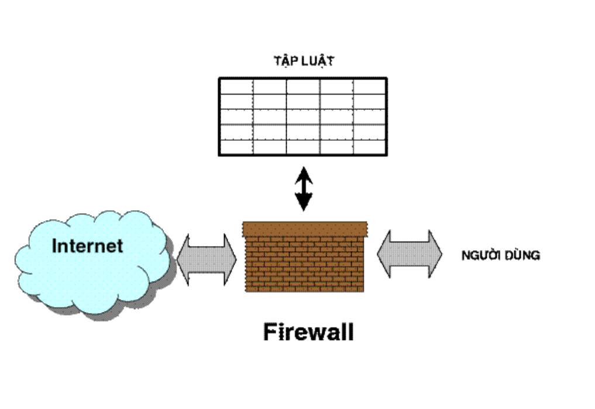
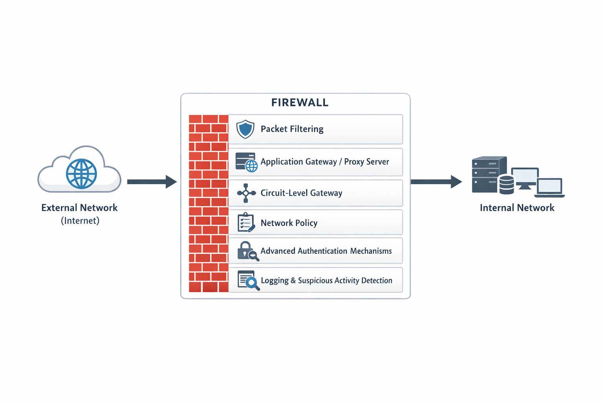
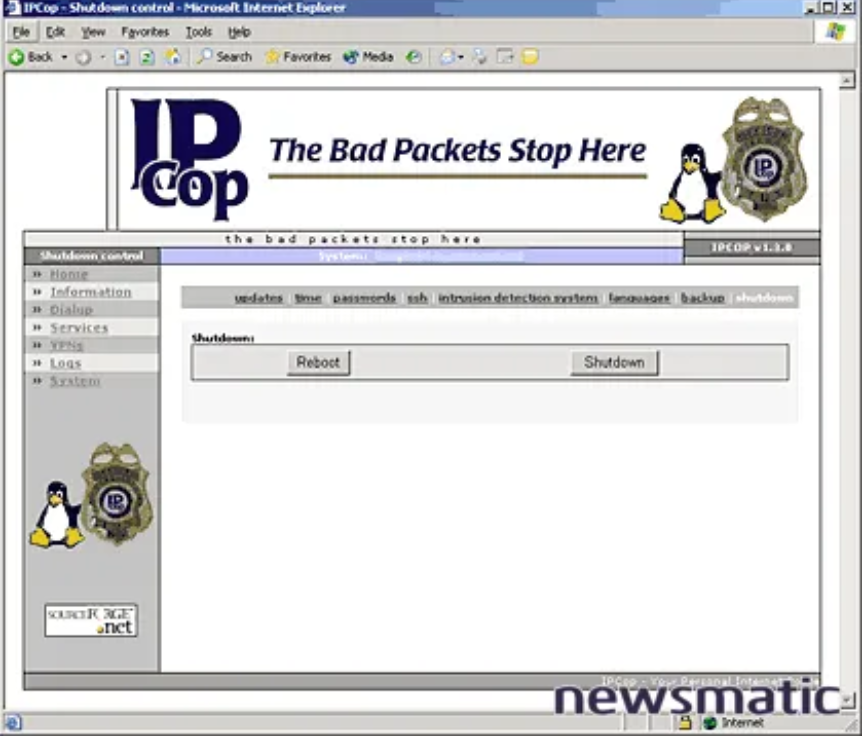
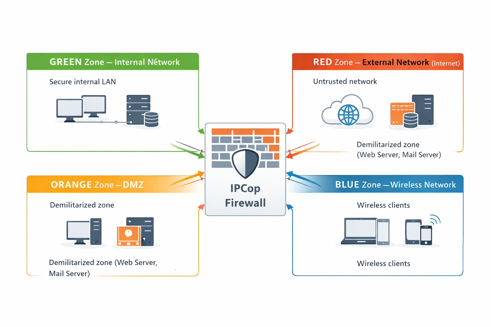
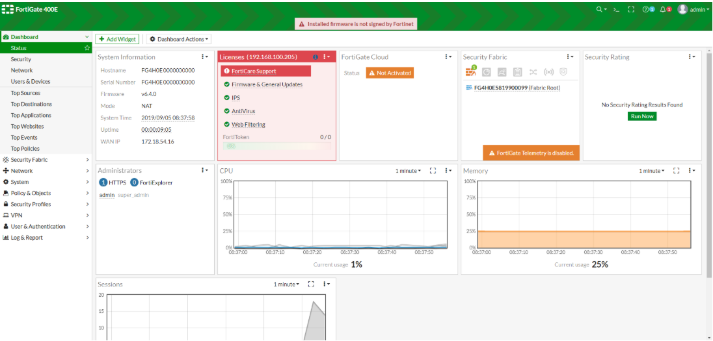

# TÌM HIỂU VỀ FIREWALL

## TỔNG QUAN VỀ FIREWALL

### 1. Firewall là gì ?

**Firewall** là một thành phần trong hệ thống mạng máy tính được thiết kế để điều khiển truy nhập giữa các mạng bằng cách ngăn chặn các truy cập không được phép và cho phép các truy cập hợp lệ.

Đây có thể là một thiết bị hoặc một nhóm thiết bị được cấu hình nhằm cho phép, ngăn chặn, mã hóa, giải mã hoặc làm proxy cho lưu lượng mạng giữa các miền bảo mật khác nhau, dựa trên tập các luật (rule) hoặc tiêu chuẩn xác định trước.

### 2. Chức năng của Firewall

- Cho phép hoặc ngăn cản truy nhập vào ra giữa các mạng.
- Theo dõi luồng dữ liệu trao đổi giữa các mạng.
- Kiểm soát người sử dụng và việc truy nhập của người sử dụng.
- Kiểm soát nội dung thông tin lưu chuyển trên mạng.

### 3. Cấu trúc thành phần trong Firewall

Các sản phẩm Firewall không có cấu trúc giống nhau nhưng cơ bản sẽ có những thành phần cơ bản sau:

- Bộ lọc gói (Packet filtering).
- Application gateways / Proxy server.
- Circuit level gateway.
- Các chính sách mạng (Network policy).
- Các cơ chế xác thực nâng  cao (Advanced authentication mechanisms).
- Thống kê và phát hiện các hoạt động bất thường (Logging anddetection of suspicious activity).

### 4. Phân loại Firewall

#### a. Phân loại theo kỹ thuật xử lí lưu lượng

- **Packet Filtering Firewall**

  - Hoạt động ở Layer 3 & 4 (Network & Transport)
  - Kiểm tra: IP nguồn/đích, port, protocol
  - Nhanh, đơn giản, ít tốn tài nguyên
  - Không kiểm soát được nội dung gói tin
  - Ví dụ: ACL trên router, firewall cơ bản

- **Circuit-Level Gateway**

  - Hoạt động ở Layer 5 (Session)
  - Kiểm soát phiên kết nối (session), không kiểm tra payload
  - Thường dùng để ẩn mạng nội bộ
  - Ví dụ: SOCKS proxy

- **Application-Level Gateway (Proxy Firewall)**

  - Hoạt động ở Layer 7 (Application)
  - Kiểm soát nội dung ứng dụng (HTTP, FTP, SMTP…)
  - Bảo mật cao
  - Chậm hơn do phải xử lý sâu
  - Ví dụ: Web Proxy, Email Gateway

- **Stateful Inspection Firewall**

  - Theo dõi trạng thái kết nối
  - Quyết định cho phép/chặn dựa trên context của session
  - Cân bằng tốt giữa hiệu năng & bảo mật

- **Next-Generation Firewall (NGFW)**

  - Kết hợp nhiều chức năng:
  - Stateful Inspection
  - Application Control
  - IDS/IPS
  - Deep Packet Inspection (DPI)
  - Nhận diện ứng dụng không phụ thuộc port
  - Ví dụ: FortiGate, Palo Alto, Sophos

#### b.Phân loại theo vị trí triển khai

- **Network-based Firewall**

  - Đặt tại gateway mạng
  - Bảo vệ toàn bộ hệ thống
  - Doanh nghiệp dùng nhiều

- **Host-based Firewall**

  - Cài trực tiếp trên máy chủ hoặc máy trạm
  - Kiểm soát lưu lượng ra/vào từng máy
  - Ví dụ: Windows Defender Firewall, iptables

- Cloud Firewall

  - Chạy trên hạ tầng cloud
  - Linh hoạt, mở rộng nhanh
  - Ví dụ: AWS Security Group, Azure Firewall

#### c. Phân loại theo mô hình triển khai

- **Hardware Firewall**

  - Thiết bị vật lý chuyên dụng
  - Hiệu năng cao, ổn định

- **Software Firewall**

  - Cài trên hệ điều hành
  - Linh hoạt, chi phí thấp

- **Virtual Firewall**

  - Chạy trên máy ảo
  - Phù hợp môi trường ảo hóa / Cloud

### 5. Nguyên lí hoạt động tường lửa

#### 1. Kiểm soát lưu lượng mạng

- Mọi gói tin khi đi qua tường lửa đều phải được kiểm tra và đánh giá dựa trên một tập hợp các **Chính sách bảo mật (security policies)** đã được cấu hình trước. Các chính sách này quy định rõ:

  - Lưu lượng nào được phép đi qua
  - Lưu lượng nào bị từ chối hoặc chặn
  - Lưu lượng nào cần ghi log hoặc giám sát đặc biệt

#### 2. Phân tích thông tin gói tin

- Tùy theo loại tường lửa, quá trình kiểm tra gói tin có thể diễn ra ở nhiều mức khác nhau:

  - Packet Filtering: kiểm tra địa chỉ IP nguồn/đích, cổng (port) và giao thức (protocol),...
  - Stateful Inspection: theo dõi trạng thái của các phiên kết nối để đảm bảo gói tin thuộc về một kết nối hợp lệ
  - Application-level Inspection: phân tích nội dung dữ liệu ở tầng ứng dụng nhằm phát hiện các hành vi bất thường hoặc tấn công

#### 3. Ra quyết định xử lý

- Sau khi phân tích, tường lửa sẽ đưa ra quyết định xử lý đối với gói tin:

  - Cho phép (Allow) gói tin đi qua
  - Từ chối (Deny/Drop) gói tin
  - Chuyển tiếp qua proxy hoặc áp dụng các biện pháp bảo mật bổ sung như xác thực người dùng, mã hóa dữ liệu
  - Quyết định này hoàn toàn dựa trên tập luật và chính sách bảo mật đã được thiết lập từ trước.

#### 4. Ghi log và giám sát

- Tường lửa có khả năng ghi lại nhật ký (logging) các sự kiện liên quan đến lưu lượng mạng như:

  - Các kết nối bị chặn
  - Các truy cập bất thường
  - Các hành vi nghi ngờ tấn công
  - Những thông tin này hỗ trợ cho công tác giám sát, phân tích sự cố và nâng cao mức độ an toàn hệ thống.

#### 5. Bảo vệ hệ thống mạng

- Thông qua việc kiểm soát chặt chẽ lưu lượng ra vào, tường lửa giúp:

  - Ngăn chặn truy cập trái phép
  - Giảm thiểu nguy cơ tấn công mạng
  - Bảo vệ tài nguyên và dữ liệu nội bộ
  - Đảm bảo hệ thống mạng hoạt động ổn định và an toàn

## CÁC GIẢI PHÁP FIREWALL

Trong doanh nghiệp luôn có những yêu cầu khắt khe về việc bảo mật thông tin. Vì thế cần có giải pháp thích hợp đối với yêu cầu bảo mật thông tin khác nhau

### 1. Giải pháp phần mềm mã nguồn mở IPCop Firewall

**IPCop Firewall** là một giải pháp tường lửa mã nguồn mở, được xây dựng trên nền hệ điều hành Linux, hướng tới việc cung cấp một hệ thống bảo mật mạng đơn giản, ổn định và dễ triển khai cho các doanh nghiệp vừa và nhỏ cũng như các hệ thống mạng nội bộ.

IPCop hoạt động như một Gateway bảo mật, nằm giữa mạng nội bộ và mạng bên ngoài (Internet), giúp kiểm soát lưu lượng truy cập và bảo vệ hệ thống khỏi các mối đe dọa từ bên ngoài.

#### q. Kiến trúc và mô hình hoạt động

IPCop sử dụng mô hình phân vùng mạng rõ ràng thông qua các vùng màu (Color Zones):

- `GREEN`: Mạng nội bộ an toàn (Internal Network)
- `RED`: Mạng bên ngoài, không tin cậy (Internet)
- `ORANGE`: Vùng DMZ, chứa các máy chủ cung cấp dịch vụ công cộng
- `BLUE`: Mạng không dây (Wireless Network)

Việc phân chia mạng theo các vùng này giúp IPCop kiểm soát lưu lượng truy cập chặt chẽ, hạn chế rủi ro lan truyền tấn công giữa các vùng mạng.

#### b. Các chức năng chính của IPCop Firewall

IPCop Firewall cung cấp nhiều chức năng bảo mật quan trọng, bao gồm:

- **Packet Filtering và Stateful Inspection**

  - Kiểm soát lưu lượng dựa trên địa chỉ IP, cổng và giao thức
  - Theo dõi trạng thái kết nối để đảm bảo các gói tin hợp lệ

- **Network Address Translation (NAT)**

  - Ẩn địa chỉ IP nội bộ
  - Giúp các máy trong mạng LAN truy cập Internet thông qua một IP công cộng

- **Proxy Server**

  - Hỗ trợ proxy HTTP/HTTPS
  - Tăng hiệu suất truy cập và kiểm soát nội dung web

- **Hệ thống ghi log và giám sát**

  - Ghi nhận các kết nối bị chặn
  - Theo dõi lưu lượng mạng theo thời gian thực
  - Hỗ trợ phân tích và xử lý sự cố an ninh

- **Quản lý qua giao diện Web**

  - Cung cấp giao diện quản trị trực quan
  - Dễ dàng cấu hình và theo dõi trạng thái hệ thống

#### c. Ưu điểm của IPCop Firewall

- Mã nguồn mở, miễn phí
- Dễ cài đặt và cấu hình
- Hoạt động ổn định, tiêu tốn ít tài nguyên
- Phù hợp cho môi trường lab, đào tạo và doanh nghiệp nhỏ

#### d. Hạn chế của IPCop Firewall

- Giao diện và tính năng chưa hiện đại so với các firewall thế hệ mới
- Không tích hợp sẵn các chức năng nâng cao như NGFW, IDS/IPS hiện đại
- Khả năng mở rộng còn hạn chế trong các hệ thống lớn

#### e. Đánh giá tổng quan

=> **IPCop Firewall** là một giải pháp tường lửa mã nguồn mở phù hợp cho các hệ thống mạng nhỏ và vừa, đặc biệt trong môi trường học tập, nghiên cứu và triển khai cơ bản. Mặc dù không sở hữu các tính năng bảo mật nâng cao như các firewall thương mại, IPCop vẫn đáp ứng tốt các yêu cầu kiểm soát truy cập và bảo vệ mạng ở mức cơ bản.

### 2. Giải pháp phần mềm FortiGate Antivirus Firewall

**FortiGate Antivirus Firewall** là giải pháp tường lửa thương mại do hãng Fortinet phát triển, thuộc nhóm **Next-Generation Firewall** (NGFW). **FortiGate** được sử dụng rộng rãi trong các doanh nghiệp từ nhỏ đến lớn nhờ khả năng kết hợp tường lửa truyền thống với các cơ chế bảo mật nâng cao, đáp ứng tốt các yêu cầu bảo mật hiện đại.

**FortiGate** không chỉ thực hiện chức năng kiểm soát truy cập mạng mà còn tích hợp chống mã độc, phòng chống xâm nhập và kiểm soát ứng dụng, giúp bảo vệ toàn diện hệ thống mạng doanh nghiệp.

#### a. Kiến trúc và mô hình hoạt động của Fortigate

**FortiGate** thường được triển khai tại gateway mạng, đóng vai trò là điểm kiểm soát trung tâm cho toàn bộ lưu lượng ra/vào hệ thống. Mọi dữ liệu trước khi đi vào mạng nội bộ đều phải được kiểm tra, phân tích và xử lý dựa trên các chính sách bảo mật đã được cấu hình.

FortiGate hoạt động dựa trên FortiOS, hệ điều hành bảo mật chuyên dụng của Fortinet, cho phép:

- Quản lý tập trung các chính sách bảo mật
- Phân tích lưu lượng theo thời gian thực
- Cập nhật chữ ký bảo mật tự động từ FortiGuard

#### b. Các chức năng chính của FortiGate Antivirus Firewall

FortiGate cung cấp nhiều chức năng bảo mật nâng cao, bao gồm:

**Stateful Firewall và Packet Filtering**:

- Kiểm soát lưu lượng dựa trên IP, cổng, giao thức
- Theo dõi trạng thái kết nối để đảm bảo tính hợp lệ của gói tin

**Antivirus (AV)**:

- Quét và phát hiện mã độc, virus, ransomware
- Bảo vệ dữ liệu khỏi các mối đe dọa từ Internet và email

**Intrusion Prevention System (IPS)**:

- Phát hiện và ngăn chặn các hành vi tấn công mạng
- Bảo vệ hệ thống khỏi các lỗ hổng đã biết

- **Application Control**

- Nhận diện và kiểm soát các ứng dụng mạng (Facebook, YouTube, BitTorrent…)
- Không phụ thuộc vào số cổng (port)

**Web Filtering**:

- Lọc và kiểm soát truy cập website theo danh mục
- Hạn chế truy cập các trang web độc hại hoặc không phù hợp

**Virtual Private Network (VPN)**:

- Hỗ trợ VPN IPsec và SSL VPN
- Cho phép kết nối từ xa an toàn vào mạng nội bộ

**Ghi log và giám sát**:

- Ghi lại chi tiết các sự kiện bảo mật
- Hỗ trợ phân tích, cảnh báo và báo cáo

#### c. Ưu điểm của FortiGate Antivirus Firewall

- Tích hợp nhiều tính năng bảo mật trong một thiết bị
- Khả năng phát hiện và ngăn chặn mối đe dọa cao
- Hiệu năng tốt, phù hợp môi trường doanh nghiệp
- Quản lý tập trung thông qua giao diện web trực quan
-Hỗ trợ kỹ thuật và cập nhật bảo mật thường xuyên

#### d. Hạn chế của FortiGate Antivirus Firewall

- Chi phí đầu tư và bản quyền tương đối cao
- Yêu cầu kiến thức chuyên môn để cấu hình tối ưu
- Một số tính năng nâng cao phụ thuộc vào gói license

#### e. Đánh giá tổng quát

=> **FortiGate Antivirus Firewall** là giải pháp bảo mật toàn diện, phù hợp cho các doanh nghiệp có yêu cầu cao về an toàn thông tin. Với việc tích hợp nhiều công nghệ bảo mật hiện đại như Antivirus, IPS, Application Control và VPN, FortiGate giúp nâng cao mức độ bảo vệ hệ thống mạng, tuy nhiên chi phí triển khai và vận hành cũng cao hơn so với các giải pháp mã nguồn mở.

### 3. Giải pháp phần mềm OPNsense Firewall

**OPNsense Firewall** là một giải pháp tường lửa mã nguồn mở, được phát triển dựa trên hệ điều hành FreeBSD, kế thừa và cải tiến từ dự án pfSense. OPNsense hướng tới việc cung cấp một hệ thống firewall hiện đại, an toàn, linh hoạt và dễ quản trị, phù hợp cho cả môi trường doanh nghiệp vừa và nhỏ, phòng lab, cũng như hệ thống mạng yêu cầu bảo mật cao.

**OPNsense** không chỉ đóng vai trò là tường lửa truyền thống mà còn tích hợp nhiều cơ chế bảo mật nâng cao, tiệm cận mô hình Next-Generation Firewall (NGFW).

#### a. Kiến trúc và mô hình hoạt động của OPNsense

**OPNsense** thường được triển khai tại gateway mạng, nằm giữa mạng nội bộ và mạng bên ngoài (Internet), đóng vai trò kiểm soát toàn bộ lưu lượng ra/vào hệ thống.

Hệ thống hoạt động dựa trên các thành phần chính:

- pf (Packet Filter) của FreeBSD để thực hiện packet filtering và stateful inspection
- Kiến trúc module cho phép mở rộng thêm IDS/IPS, Proxy, VPN, Web Filtering
- Giao diện quản trị Web GUI hiện đại, dễ sử dụng

Mọi lưu lượng mạng đều phải đi qua OPNsense để được kiểm tra, phân tích và xử lý dựa trên các chính sách bảo mật (Firewall Rules) đã được cấu hình.

#### b. Các chức năng chính của OPNsense Firewall

OPNsense cung cấp nhiều chức năng bảo mật mạnh mẽ, bao gồm:

- **Firewall và Stateful Inspection**

  - Kiểm soát lưu lượng dựa trên:

    - Địa chỉ IP nguồn/đích
    - Cổng (Port)
    - Giao thức (Protocol)

- Theo dõi trạng thái kết nối (stateful) để đảm bảo gói tin hợp lệ
- Hỗ trợ rule chi tiết theo interface, VLAN, zone

- **Intrusion Detection / Intrusion Prevention (IDS/IPS)**

  - Tích hợp Suricata
  - Phát hiện và ngăn chặn:

    - Tấn công khai thác lỗ hổng
    - Quét cổng, brute-force
    - Lưu lượng bất thường

  - Hỗ trợ cập nhật chữ ký tấn công thường xuyên

- **Network Address Translation (NAT)**

  - Ẩn địa chỉ IP nội bộ
  - Hỗ trợ:

    - Source NAT
    - Destination NAT
    - Port Forwarding

  - Phù hợp cho hệ thống có nhiều server nội bộ

- **Virtual Private Network (VPN)**

  - Hỗ trợ nhiều loại VPN:

    - IPsec VPN
    - OpenVPN
    - WireGuard

  - Cho phép kết nối từ xa an toàn vào mạng nội bộ
  - Phù hợp cho mô hình làm việc từ xa

- **Web Proxy và Web Filtering**

  - Hỗ trợ proxy HTTP/HTTPS
  - Kiểm soát và lọc nội dung truy cập web
  - Có thể kết hợp với danh sách chặn (Blacklist)

- **Ghi log và giám sát**

  - Ghi lại chi tiết các sự kiện:

    - Kết nối bị chặn
    - Hoạt động nghi ngờ
    - Trạng thái hệ thống

  - Cung cấp dashboard trực quan
  - Hỗ trợ xuất log phục vụ phân tích và điều tra sự cố

#### c. Ưu điểm của OPNsense Firewall

- Mã nguồn mở, miễn phí
- Giao diện quản trị hiện đại, thân thiện
- Hỗ trợ nhiều tính năng bảo mật nâng cao
- Cộng đồng lớn, tài liệu phong phú
- Phù hợp cho:

  - Môi trường lab
  - Doanh nghiệp vừa và nhỏ
  - Hệ thống yêu cầu tùy biến cao

#### d. Hạn chế của OPNsense Firewall

- Hiệu năng phụ thuộc vào phần cứng triển khai
- Cần kiến thức mạng để cấu hình tối ưu
- Một số tính năng nâng cao cần cấu hình thủ công

#### e. Đánh giá tổng thể

=> **OPNsense Firewall** là một giải pháp tường lửa mã nguồn mở mạnh mẽ, hiện đại và linh hoạt, đáp ứng tốt các yêu cầu bảo mật mạng ở mức từ cơ bản đến nâng cao. Với việc tích hợp IDS/IPS, VPN, Proxy và cơ chế quản lý trực quan, OPNsense là lựa chọn phù hợp cho các doanh nghiệp vừa và nhỏ cũng như môi trường đào tạo, nghiên cứu và triển khai thực tế
