# TÌM HIỂU VỀ OPNsense

## I.TỔNG QUAN VỀ OPENSENSE

### 1. OPNsense là gì ?

**OPNsense** là một nền tảng tường lửa và định tuyến mã nguồn mở, dễ sử dụng và dễ xây dựng dựa trên FreeBSD.

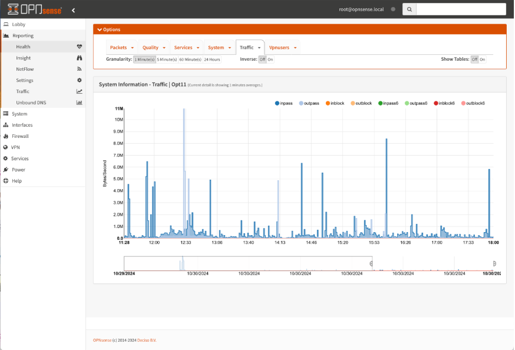

### 2. Các tính năng cốt lỗi của OPNsense

- Bộ điều chỉnh lưu lượng truy cập (**Trafic Shaping**)
- Cổng thông tin bắt buộc (**Captive Portal**)
- **Forward Caching Proxy**(**Transparent mode suport** and **Blacklist support**)
- **VPN**:

  - Site to site
  - IPsec
  - OpenVPN
  - Wire Guard

- **High Availability & Hardware Failover**:

  - Bao gồm đồng bộ hóa cấu hình và bảng trạng thái được đồng bộ hóa.
  - Di chuyển địa chỉ IP ảo

- **Phát hiện xâm nhập và ngăn chặn trực tuyến**:

  - Hỗ trợ tích hợp cho các quy tắc về mối đe dọa mới nổi.
  - Basic Setup using Rule.
  - Tạo Schedule & Backup định kì

- **Các công cụ báo cáo và giám sát tích hợp sẵn**:

  - Sức khỏe hệ thống, phiên bản hiện đại của đồ thị RRD.
  - Ghi lại gói tin

- **DNSServer** & DNS Forwrder
- **Dynamic DNS**

- Sao lưu & Khôi phục

  - Sao lưu đám mây được mã hóa lên Google Drive và Nextcloud.

- **802.1Q VLAN support** (Hỗ trợ chuẩn 802.1Q)
- Kiểm tra trạng thái tường lửa (Stateful Firewall)

## II. HƯỚNG DẪN CÀI ĐẶT VÀ TRIỂN KHAI OPNSENSE

**OPNsense** cung cấp hai loại ảnh hệ thống (Image) cho tất cả các phiên bản chính: **ảnh nhúng** (Embedded Image) và **ảnh đầy đủ** (Full Image):

| Tiêu chí                   | Nhúng (Embedded)                                    | Đầy (Full)                                    |
|----------------------------|-----------------------------------------------------|-----------------------------------------------|
| Ghi dữ liệu                | Ghi dữ liệu vào ổ đĩa RAM                           | Ghi dữ liệu vào ổ đĩa cục bộ(ROM)             |
| Dữ liệu nhật ký sau reboot | Không lưu giữ dữ liệu nhật ký sau khi khởi động lại | Lưu trữ dữ liệu nhật ký sau khi khởi động lại |
| Ghi dữ liệu cục bộ         | Không dùng để ghi dữ liệu cục bộ vào ổ đĩa          | Thích hợp cho việc ghi dữ liệu vào ổ đĩa      |
| Mục đích sử dụng           | Chỉ sử dụng nhúng                                   | Sử dụng đầy đủ như hệ thống thông thường      |
| SWAP                       | Tệp SWAP là tùy chọn                                | Thường dùng SWAP như hệ thống chuẩn           |
| RAM Disk                   | Có thể kích hoạt ổ đĩa RAM cho chế độ nhúng         | Không cần RAM Disk                            |

Tuỳ thuộc vào phần cứng và trường hợp sử dụng của bạn, sẽ có các tùy chọn cài đặt khác nhau:

| Kiểu     | Miêu tả                                                                                                        |Image Type|
|----------|----------------------------------------------------------------------------------------------------------------|----------|
| DVD      | ISO Image khởi động vào môi trường Live ở chế độ chỉ VGA với hỗ trợ UEFI                                       | Full     |
| VGA      | USB Image khởi động vào môi trường Live ở chế độ chỉ VGA với hỗ trợ UEFI                                       | Full     |
| Serial   | USB Image khởi động vào môi trường trực tiếp chạy ở Serial Console Mode (115200) chỉ với hỗ trợ UEFI           | Full     |
| nano     | Image dùng với các thiết bị nhúng chạy ở chế độ bảng điều khiển nối tiếp (115200), có hỗ trợ VGA phụ           | Embedded |

Vào trang [sau](https://opnsense.org/download/)

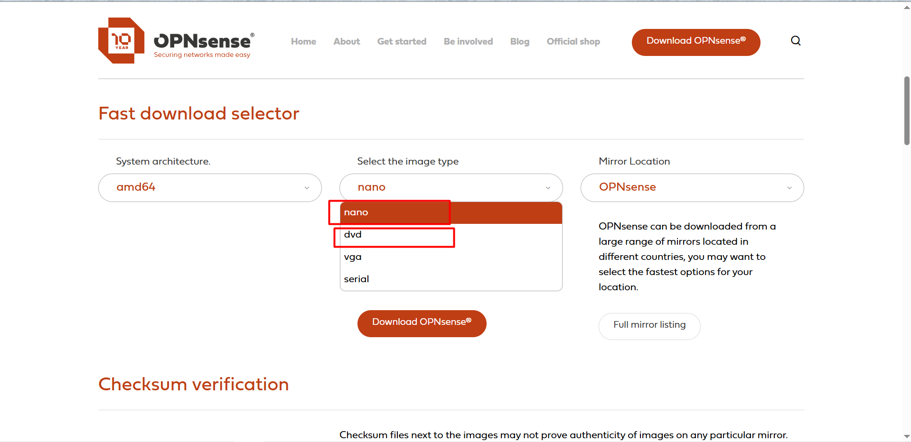

Ta tải Image về máy dưới dạng file nén và nhớ Select **Image Type** để chọn loại Image mà ta muốn cài đặt. Ở đây ta sẽ tải 2 loại Image là : `nano` và `dvd` nhưng tạm thời ta chỉ sử dụng bản `dvd` để cài đặt trên VMWare.

### 1. Mô hình triển khai

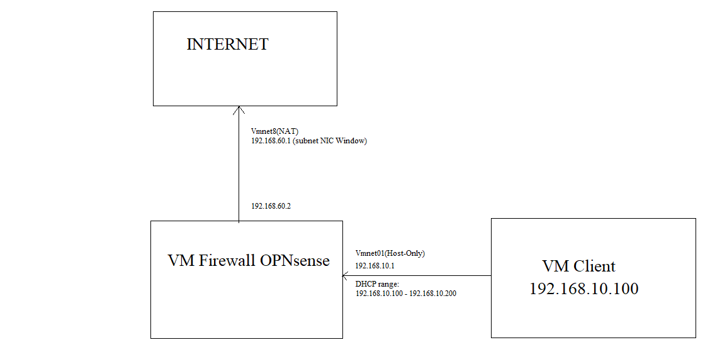

Trong sơ đồ trên ta sẽ phải tạo 2 card mạng cho máy ảo đó là:

- Adapter1: `vmnet8` -> WAN (External Network - cấu hình DHCP nhận IP từ mạng ngoài)
- Adapter2: `vmnet1` -> LAN (Internal Network - Dùng kết nối VM Client trong dải Gatewway)

Ngoài ra, chúng ta tạo 1 con client VM (192.168.10.129) có cùng dải Gateway với con OPNsense(192.168.10.1) và sẽ cho nó ping ra ngoài (8.8.8.8)

=> Nếu ping ra ngoài được thì ta đã gán interface thành công

### 2. Boot OPNsense dựa trên file ISO vừa tải về

Ta mở giao diện VMWare rồi chọn `Create A New Virtual Machine` :

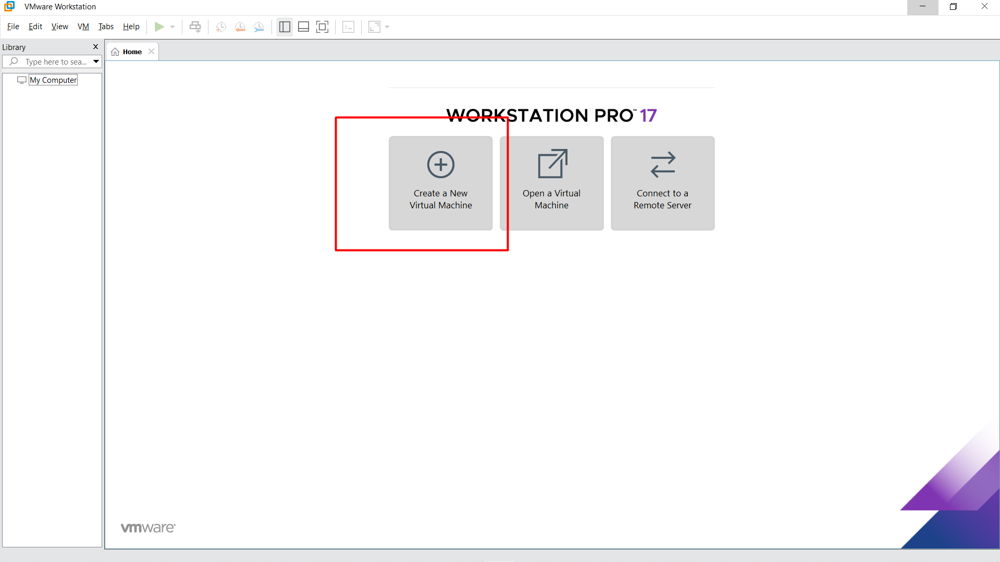

Chọn bản ISO mà ta đã tải về và giải nén từ trước để **Install**:

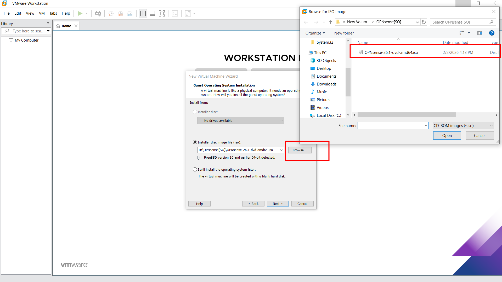

Đặt tên cho VM và cài đặt chỗ lưu dữ liệu của nó:

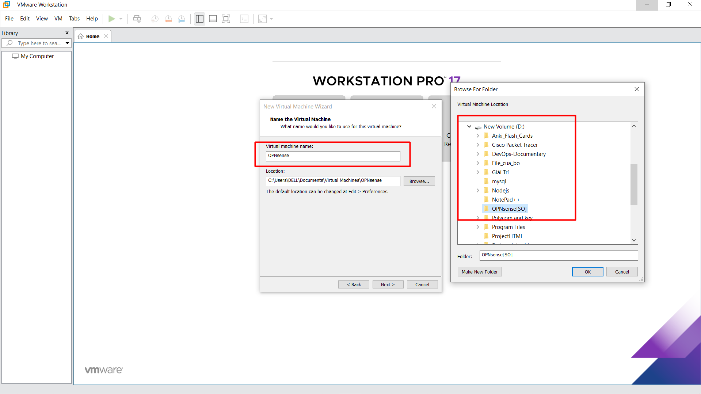

Cài đặt dung lượng ổ đĩa cứng:

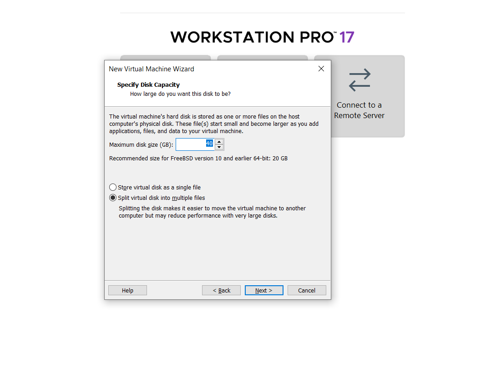
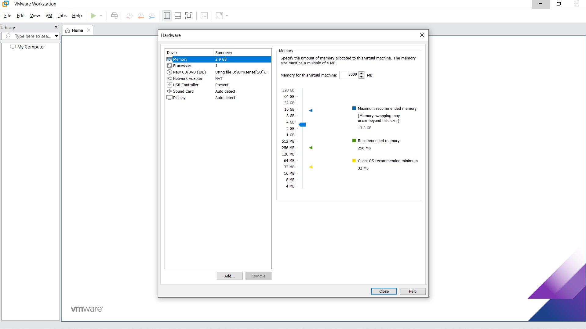

- Dung lượng ổ cứng tối thiểu nên là 20 GB
- Dung lượng RAM tối thiểu nên để là 3 GB
- Chip lên để 2 nhân 1 lõi

Tiếp theo là gán Interface cho Firewall:

- Ta tạo interface `vmnet1`(Host-Only) để kết nối VM Client:

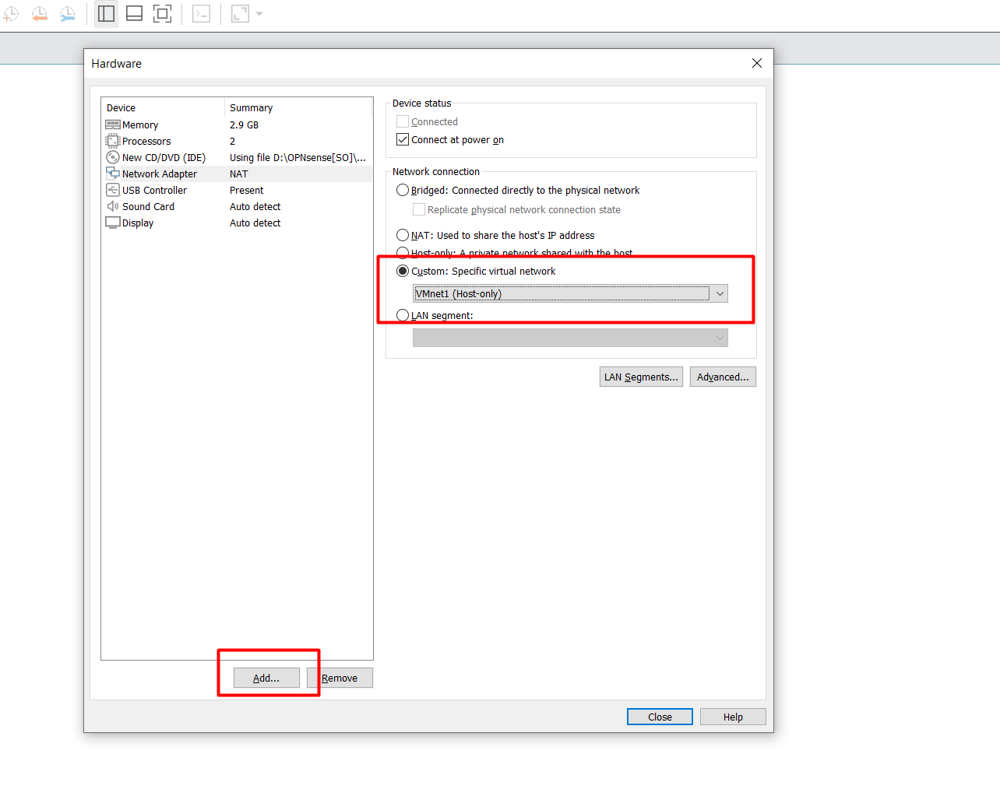

- Ta tạo interface `vmnet8` (NAT)

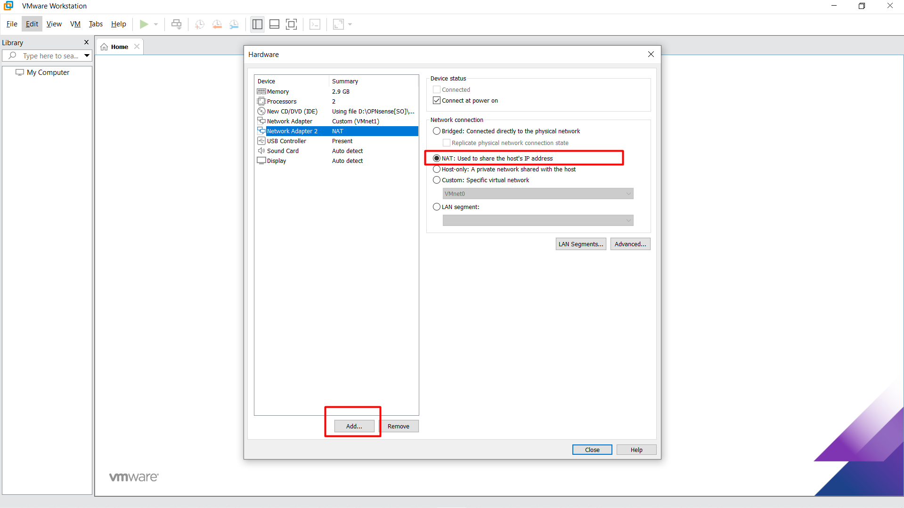

Sau khi Boot xong thì sẽ hiện ra giao diện đăng nhập và chúng ta sẽ đăng nhập bằng tài khoản mặc định:

```text
login :installer
pass :opnsense
```

Install UFS:

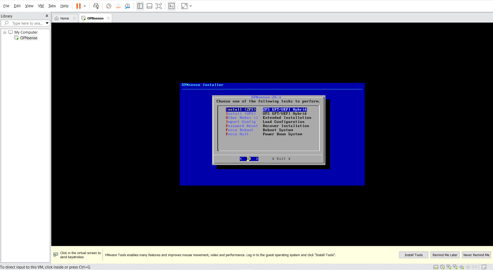

Cài ổ đĩa và cài đặt mật khẩu cho tài khoản `root`

Sau đó ta Reboot lại VM và đăng nhập bằng tài khoản `root` là được giao diện sẽ hiện lên các tuỳ chọn như sau:

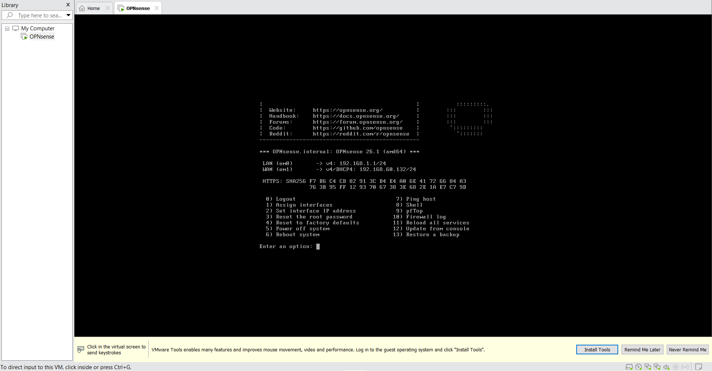

Trong đó:

- **Option 0 (logout)** là đăng xuất.
- **Option 1 (Assign Interface)** là gán card mạng cho OPNsense (Gán WAN/LAN/OPT)
- **Option 2 (Set Interface address)** là đặt IP cho interface (WAN/LAN)
- **Option 3 (Reset root pss)** là đổi mật khẩu tài khoản `root`
- **Option 4 (Reset factory deafault)** là Xoá sạch và cài lại cấu hình về lại ban đầu
- **Option 5 (Power off system)** là tắt nguồn Firewall OPNsense
- **Option 6 (Reboot system)** là Khởi động lại Firewall
- **Option 7 (ping host)** là ping các host, test mạng (eg: ping `8.8.8.8`,LAN,... )
- **Option 8 (Shell)** là vào shell FreeBDS để có thể dùng lệnh chẳng hạn như: `ìfconfig`, `netstat -rn`, `pfctl`,...
- **Option 9 là Pftop** -> Xem Realtime Traffic của Firewall (Check BW client)
- **Option 10 (Filter Logs)** là xem log của Firewall
- **Option 11 (Reload all Services)** là Restert toàn bộ services(DNS,DHCP,Firewall,WebGUI,...)
- **Option 12 (Update System)** là Update OPNsense
- **Option 13 (Restore a backup)** là khôi phục lại bản Backup đã lưu

Lưu ý:

- Để thoát menu Optio của OPNsense ta gõ `13 + phím Enter` hoặc chọnn Option 0
- Để thoát cấu hình hình khi ta chọn 1 Option để tuỳ chỉnh ta bấm `Ctrl + C`
- Nếu đang ở Shell (Option8) thì ta gõ `exit` để thoát or `Ctrl + D`

### Các bước cấu hình bài lab

#### Bước 1: Tạo / Kiểm tra Vboxnet8

Đầu tiên `Pơweroff` **VM Firewall OPNsense**.

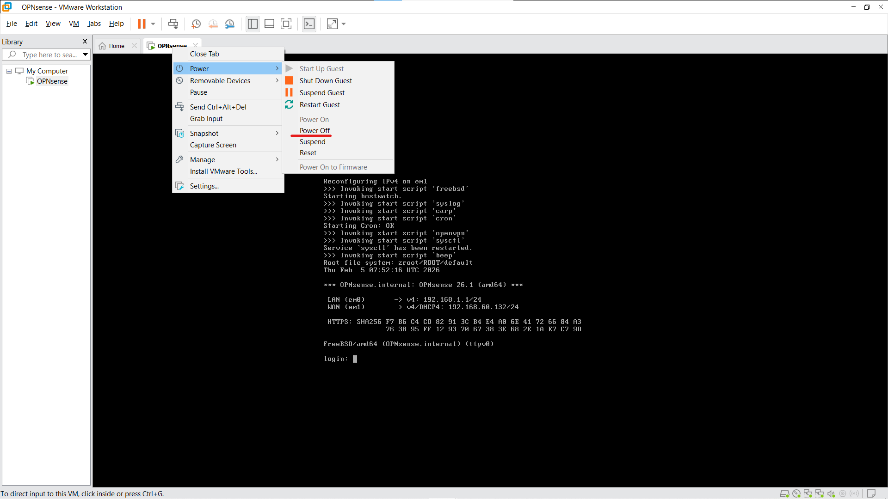

Check **VM Firewall OPNsense** trong VMWare đã có cấu hình Vboxnet8 chưa ?

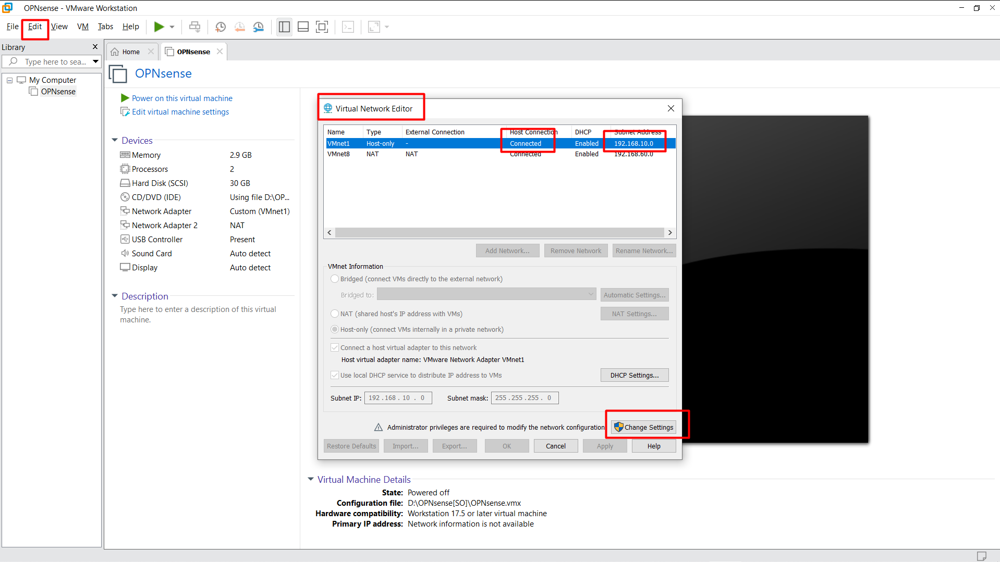

=> Ở đây đã có **Vboxnet8** có subnet `192.168.60.1`

#### Bước 2: Kiểm tra NIC trong VM OPNsense

**VM Firewall OPNsense** vẫn trong trạng thái tắt

Vào `Edit Virtual machine` -> Settings:

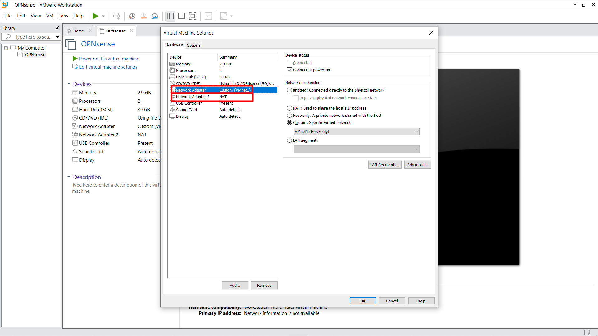

Ở đây đã có 2 card mạng ta cấu hình từ trước đó:

- Adapter 1 : ta để là cổng LAN (vmnet1), nó sẽ tương ứng với `em0` trong giao diện console của **VM Firewall OPnsense**
- Adapter 2 : ta đẻ là cổng WAN (vmnet8), nó sẽ tương ứng với `em1` trong giao diện console của **VM Firewall OPnsense**

#### Bước 3: Gán lại Interface trong OPNsense

Đăng nhập tài khoản `root` -> Vào giao diện console -> Vào **Option1** , nó sẽ hỏi:

```text
Do you want to set up LAGGs? → NO
Do you want to set up VLANs? → NO
```

-> Ta từ chối

Lúc này nó sẽ hiện danh sách interface :

```bash
em0
em1
```

Ta cần phải gán interface của Firewall cho đúng bài Lab:

```bash
em0 -> LAN (192.168.10.x)
em1 -> WAN (192.168.60.X)
```

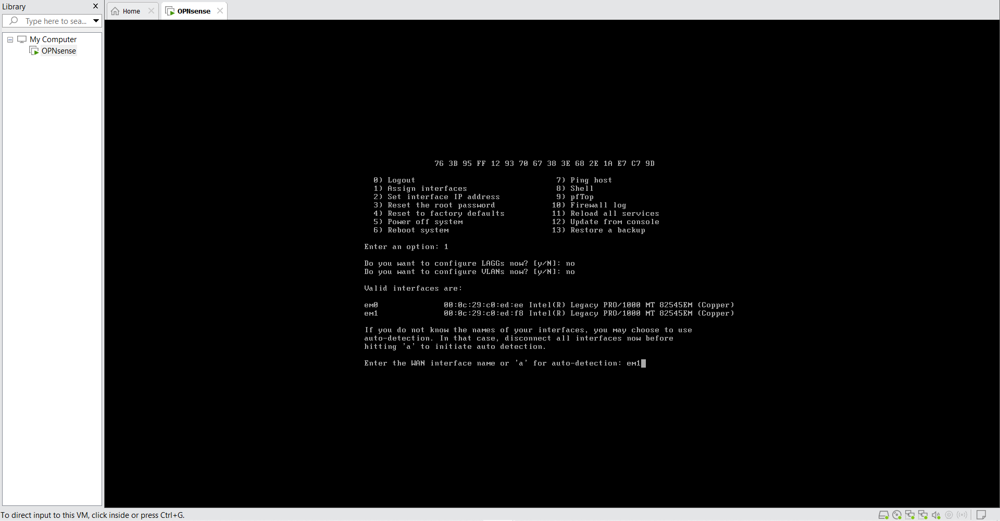
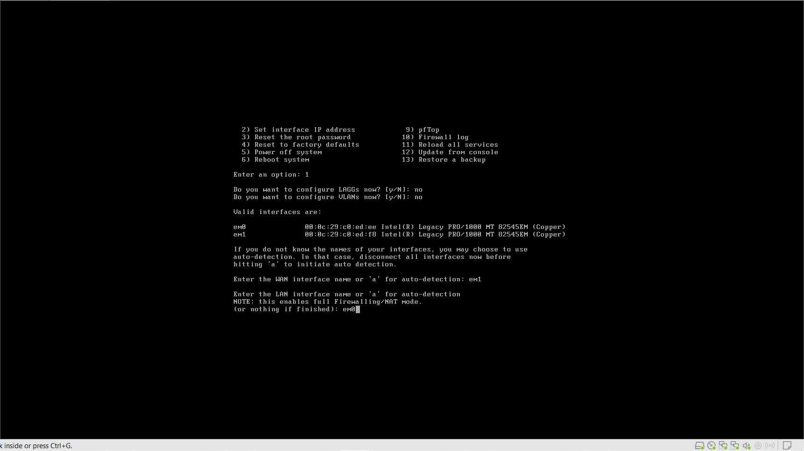

Lưu cấu hình:

```bash
Do you want to proceed? YES
```

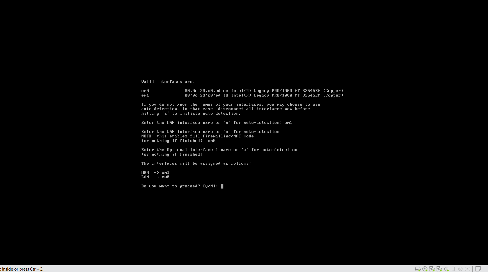

#### Bước 4: Cấu hình IP cho từng Interface

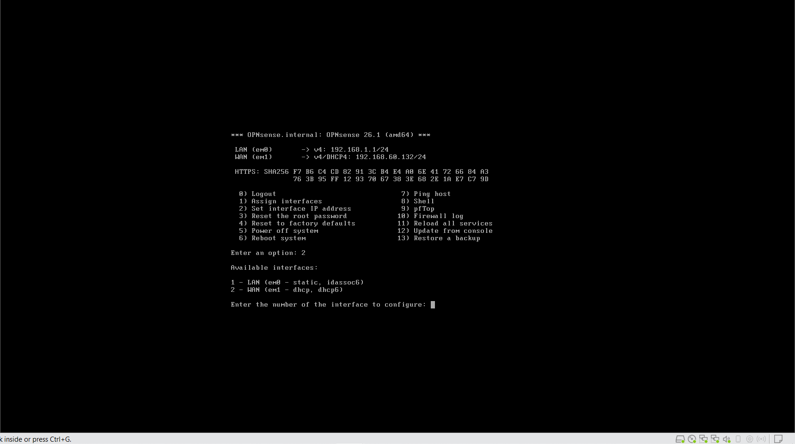

Nhập số để vào cấu hình IP cho từng interface

```bash
enter number of interface to configure ?
1 - LAN
2 - WAN
```

**Cấu hình IP cho interface WAN**: Vì interface WAN để NAT và không có môi trường Internet để test, WAN nên để IP tĩnh:

```bash
IP:      192.168.60.2
Subnet:  24
Gateway: 192.168.60.1  (IP host Windows)
```

**Cấu hình IP cho interface LAN**: Ta để nhận IP tĩnh `192.168.10.129` như trong mô hình:

``` bash
