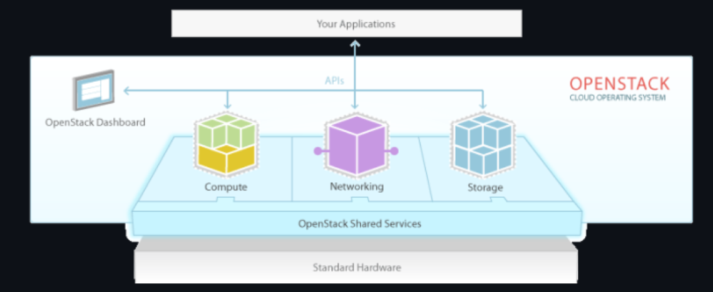
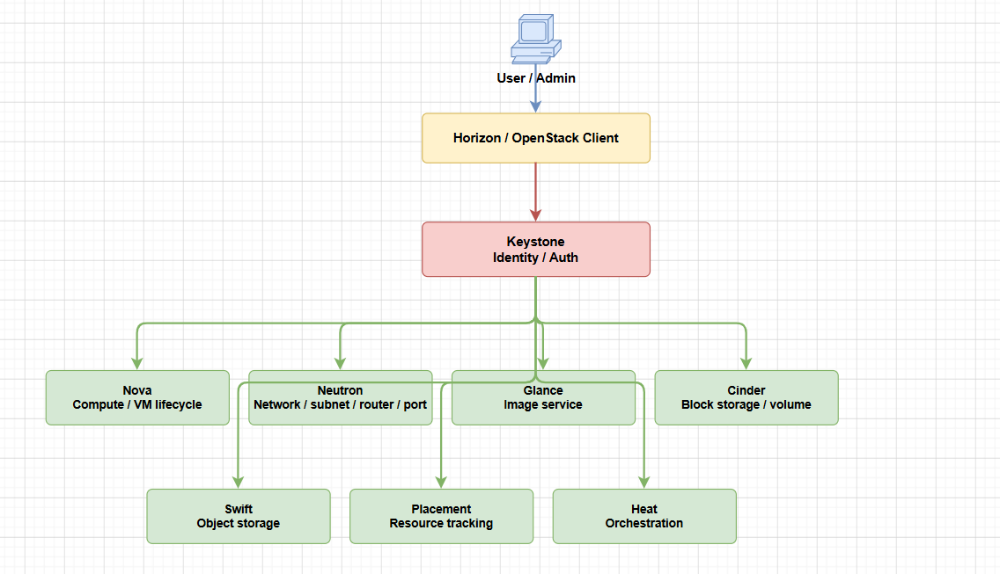
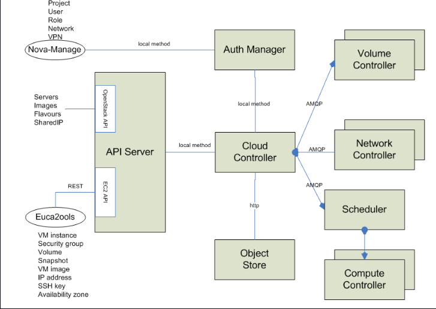

# TỔNG QUAN VỀ OPENSTACK BẢN MỚI NHẤT

## I. MỞ ĐẦU



OpenStack là một nền tảng mã nguồn mở dùng để xây dựng hệ thống điện toán đám mây, đặc biệt là mô hình **Infrastructure as a Service (IaaS)**. Với OpenStack, người dùng có thể tự tạo máy ảo, network, subnet, router, volume, image và nhiều tài nguyên hạ tầng khác thông qua **Dashboard**, **CLI** hoặc **API**.

Tính đến **15/05/2026**, bản OpenStack ổn định mới nhất là **OpenStack 2026.1 Gazpacho**, phát hành ngày **01/04/2026**. Đây là bản OpenStack thứ 33 và là một bản **SLURP release**, tức là bản phát hành phù hợp cho các chu kỳ nâng cấp dài hơn so với các bản trung gian.

Tài liệu này trình bày các nội dung chính:

- Cloud Computing là gì?
- Mô hình 5-4-3 trong Cloud Computing
- OpenStack là gì?
- Kiến trúc tổng quan của OpenStack
- Các service chính trong OpenStack
- Quota và giới hạn tài nguyên trong OpenStack

## II. CLOUD COMPUTING LÀ GÌ?

### 1. Khái niệm Cloud Computing

**Cloud Computing**, hay **điện toán đám mây**, là mô hình cung cấp tài nguyên công nghệ thông tin qua mạng theo nhu cầu sử dụng.

Thay vì phải mua server vật lý, tự lắp đặt, tự cấu hình network, storage và hệ điều hành, người dùng có thể yêu cầu tài nguyên từ hệ thống cloud và sử dụng gần như ngay lập tức.

Ví dụ:

- Tạo một máy ảo Ubuntu trong vài phút
- Tạo một ổ đĩa volume 100 GB để attach vào VM
- Tạo network riêng cho project
- Tạo firewall rule/security group
- Tạo image để boot nhiều VM giống nhau

Các tài nguyên cloud thường bao gồm:

| Nhóm tài nguyên | Ví dụ                                             |
|-----------------|---------------------------------------------------|
| Compute         | VM, container, bare metal, CPU, RAM               |
| Storage         | Block storage, object storage, file storage       |
| Network         | Network ảo, subnet, router, floating IP, firewall |
| Image           | Image hệ điều hành để boot VM                     |
| Identity        | User, project, role, token                        |
| API             | Giao diện tự động hóa thao tác cloud              |

Theo định nghĩa của NIST, Cloud Computing là mô hình cho phép truy cập thuận tiện qua mạng tới một nhóm tài nguyên dùng chung, có thể được cấp phát và thu hồi nhanh với ít thao tác quản trị hoặc tương tác với nhà cung cấp dịch vụ.

### 2. Vì sao cần Cloud Computing?

Trước khi có cloud, doanh nghiệp thường phải triển khai hạ tầng theo cách truyền thống:

```text
Mua server vật lý
→ lắp đặt vào rack
→ cấu hình network
→ cài OS
→ cấp storage
→ bàn giao cho người dùng
```

Cách này tốn thời gian, khó mở rộng và dễ lãng phí tài nguyên.

Cloud Computing giải quyết các vấn đề đó bằng cách:

- Cấp phát tài nguyên nhanh hơn
- Tận dụng tài nguyên vật lý tốt hơn
- Cho phép người dùng tự phục vụ
- Dễ mở rộng hoặc thu hẹp tài nguyên
- Hỗ trợ tự động hóa bằng API
- Dễ đo lường mức sử dụng tài nguyên

### 3. Cloud Computing và Virtualization khác nhau thế nào?

**Virtualization** là kỹ thuật ảo hóa tài nguyên vật lý, ví dụ tạo nhiều VM trên một server vật lý.

**Cloud Computing** sử dụng virtualization nhưng không chỉ dừng ở đó. Cloud bổ sung thêm các lớp quản lý như:

- Self-service portal
- API
- Scheduler
- Resource pooling
- Multi-tenancy
- Quota
- Metering
- Automation

Có thể hiểu ngắn gọn:

```text
Virtualization = tạo tài nguyên ảo
Cloud Computing = quản lý, cấp phát, đo lường và tự động hóa tài nguyên ảo
```

## III. MÔ HÌNH 5-4-3 TRONG CLOUD COMPUTING

Mô hình **5-4-3** là cách tóm tắt Cloud Computing theo NIST:

```text
5 đặc tính thiết yếu
4 mô hình triển khai
3 mô hình dịch vụ
```

### 1. Năm đặc tính thiết yếu của Cloud Computing

#### a. On-demand Self-service

Người dùng có thể tự cấp phát tài nguyên khi cần mà không phải yêu cầu admin thao tác thủ công từng bước.

Ví dụ:

```text
User tự tạo VM
User tự tạo volume
User tự tạo network
User tự upload image
```

Trong OpenStack, đặc tính này thể hiện qua:

- Horizon Dashboard
- OpenStack CLI
- OpenStack API

#### b. Broad Network Access

Dịch vụ cloud được truy cập qua mạng bằng các chuẩn phổ biến.

Người dùng có thể truy cập cloud qua:

- Web browser
- CLI
- REST API
- SDK

Ví dụ:

```text
Truy cập Horizon qua HTTP/HTTPS
Gọi OpenStack API để tạo VM
Dùng openstack client để quản trị cloud
```

#### c. Resource Pooling

Tài nguyên vật lý được gom thành các pool dùng chung.

Ví dụ:

```text
Nhiều compute node tạo thành pool CPU/RAM
Nhiều storage backend tạo thành pool lưu trữ
Nhiều network segment tạo thành pool network
```

Người dùng không cần biết chính xác VM của mình chạy trên server vật lý nào. Hệ thống cloud sẽ tự chọn tài nguyên phù hợp.

#### d. Rapid Elasticity

Tài nguyên có thể được mở rộng hoặc thu hẹp nhanh chóng.

Ví dụ:

- Tăng số lượng VM
- Resize flavor
- Tăng dung lượng volume
- Tạo thêm network
- Scale ứng dụng theo tải

Đây là một trong các lý do cloud phù hợp với môi trường cần thay đổi tài nguyên liên tục.

#### e. Measured Service

Cloud có khả năng đo lường mức sử dụng tài nguyên.

Các tài nguyên có thể đo gồm:

- Số lượng VM
- CPU/RAM đã cấp phát
- Dung lượng volume
- Dung lượng object storage
- Network traffic
- Thời gian sử dụng tài nguyên

Đặc tính này là nền tảng cho:

- Billing
- Quota
- Monitoring
- Capacity planning

### 2. Bốn mô hình triển khai Cloud

#### a. Public Cloud

**Public Cloud** là cloud công cộng do nhà cung cấp dịch vụ vận hành, ví dụ AWS, Microsoft Azure, Google Cloud.

Đặc điểm:

- Người dùng thuê tài nguyên
- Hạ tầng thuộc nhà cung cấp
- Truy cập qua Internet
- Dễ mở rộng
- Phù hợp với nhiều loại workload

#### b. Private Cloud

**Private Cloud** là cloud riêng phục vụ cho một tổ chức.

Đặc điểm:

- Hạ tầng dành riêng cho một doanh nghiệp/tổ chức
- Có thể đặt tại datacenter nội bộ hoặc thuê ngoài
- Kiểm soát dữ liệu tốt hơn
- Phù hợp với hệ thống yêu cầu bảo mật, tuân thủ, kiểm soát hạ tầng

OpenStack thường được dùng để xây dựng **Private Cloud**.

#### c. Community Cloud

**Community Cloud** là cloud dùng chung cho một nhóm tổ chức có yêu cầu tương tự nhau.

Ví dụ:

- Các cơ quan chính phủ
- Các trường đại học
- Các tổ chức y tế
- Các tổ chức nghiên cứu

#### d. Hybrid Cloud

**Hybrid Cloud** là mô hình kết hợp nhiều môi trường cloud, thường là:

```text
Private Cloud + Public Cloud
```

Ví dụ:

- Hệ thống chính chạy trên private cloud
- Khi tải tăng cao thì mở rộng sang public cloud
- Dữ liệu nhạy cảm giữ trong private cloud
- Workload ít nhạy cảm chạy trên public cloud

### 3. Ba mô hình dịch vụ Cloud

#### a. IaaS - Infrastructure as a Service

**IaaS** cung cấp hạ tầng dưới dạng dịch vụ.

Người dùng được cấp:

- VM
- Network
- Storage
- Security group
- Floating IP

Người dùng tự quản lý:

- Hệ điều hành
- Middleware
- Runtime
- Application
- Dữ liệu

OpenStack chủ yếu thuộc mô hình **IaaS**.

#### b. PaaS - Platform as a Service

**PaaS** cung cấp nền tảng để phát triển và chạy ứng dụng.

Người dùng chủ yếu quan tâm tới code và application, ít phải quản lý OS hoặc hạ tầng bên dưới.

Ví dụ:

- Container platform
- Database platform
- Application runtime
- Developer platform

#### c. SaaS - Software as a Service

**SaaS** cung cấp phần mềm hoàn chỉnh qua mạng.

Người dùng chỉ sử dụng ứng dụng, không quản lý hạ tầng, OS hay runtime.

Ví dụ:

- Gmail
- Microsoft 365
- Salesforce
- Google Drive

## IV. OPENSTACK LÀ GÌ?

### 1. Khái niệm OpenStack

**OpenStack** là một nền tảng cloud mã nguồn mở dùng để xây dựng và quản lý hạ tầng cloud theo mô hình **IaaS**.

OpenStack cho phép người dùng tạo và quản lý:

- Máy ảo
- Image
- Network
- Subnet
- Router
- Security group
- Floating IP
- Volume
- Snapshot
- User/project/role

Người dùng có thể thao tác với OpenStack thông qua:

- Horizon Dashboard
- OpenStack CLI
- REST API
- SDK

Có thể hiểu đơn giản:

```text
OpenStack biến một cụm server vật lý thành một nền tảng cloud.
```

### 2. OpenStack dùng để làm gì?

OpenStack thường được dùng để xây dựng:

- Private cloud cho doanh nghiệp
- Public cloud cho nhà cung cấp dịch vụ
- Cloud nội bộ cho DevOps
- Hạ tầng lab nghiên cứu cloud
- Telco cloud/NFV
- Hạ tầng chạy VM tự phục vụ
- Hệ thống tránh phụ thuộc vendor public cloud

### 3. Đặc điểm nổi bật của OpenStack

#### a. Mã nguồn mở

OpenStack là phần mềm mã nguồn mở, được phát triển bởi cộng đồng toàn cầu và nhiều doanh nghiệp lớn.

#### b. Kiến trúc module

Mỗi chức năng lớn là một service riêng.

Ví dụ:

```text
Nova    -> Compute
Neutron -> Network
Cinder  -> Block Storage
Glance  -> Image
Keystone-> Identity
Horizon -> Dashboard
```

#### c. API-driven

Hầu hết thao tác trong OpenStack đều có thể thực hiện qua API. Điều này giúp OpenStack dễ tự động hóa và tích hợp với các hệ thống khác.

#### d. Hỗ trợ nhiều backend

OpenStack không bắt buộc chỉ dùng một công nghệ duy nhất.

Ví dụ:

- Nova có thể dùng KVM/QEMU, VMware, Hyper-V
- Cinder có thể dùng LVM, NFS, Ceph RBD, iSCSI, storage vendor
- Neutron có thể dùng Linux Bridge, Open vSwitch, OVN, SDN controller
- Glance có thể lưu image trên file system, Swift, Ceph, HTTP backend

#### e. Phù hợp private cloud

OpenStack đặc biệt phổ biến trong các môi trường cần kiểm soát hạ tầng, dữ liệu và chính sách vận hành.

## V. KIẾN TRÚC TỔNG QUAN OPENSTACK

### 1. Kiến trúc logic

OpenStack gồm nhiều service độc lập, giao tiếp với nhau thông qua API, message queue và database.

Sơ đồ logic đơn giản:



Bên dưới các service thường có các thành phần nền:

```text
MariaDB/Galera       - Database
RabbitMQ             - Message Queue
Memcached            - Cache/token
KVM/QEMU/Libvirt     - Hypervisor
OVN/OVS/Linux Bridge - Network dataplane
Ceph/LVM/NFS/iSCSI   - Storage backend
```

### 2. Mô hình triển khai cơ bản



Một cụm OpenStack cơ bản thường chia thành các loại node:

#### a. Controller Node

Controller node chạy các service điều khiển trung tâm.

Ví dụ:

- Keystone
- Glance API
- Nova API
- Nova Scheduler
- Nova Conductor
- Neutron Server
- Cinder API
- Cinder Scheduler
- Horizon
- MariaDB
- RabbitMQ
- Memcached

Controller node không nhất thiết chạy VM, mà chủ yếu điều phối hệ thống.

#### b. Compute Node

Compute node là nơi chạy VM.

Thành phần thường có:

- nova-compute
- hypervisor KVM/QEMU
- libvirt
- neutron agent
- bridge/OVS/OVN dataplane

Khi user tạo VM, Nova Scheduler chọn một compute node phù hợp, sau đó nova-compute trên node đó sẽ gọi libvirt để boot VM.

#### c. Storage Node

Storage node cung cấp lưu trữ cho cloud.

Ví dụ:

- Cinder volume backend
- LVM backend
- NFS backend
- Ceph OSD
- iSCSI target
- Swift storage node

Không phải môi trường nào cũng tách riêng storage node. Trong lab nhỏ, storage có thể chạy chung với controller hoặc compute.

#### d. Network Node

Network node xử lý các chức năng mạng tập trung như router, NAT, DHCP, metadata, floating IP.

Trong một số mô hình mới dùng OVN hoặc provider network đơn giản, network function có thể phân tán trên controller/compute.

### 3. Luồng tạo VM trong OpenStack

Khi user tạo một VM, các service phối hợp như sau:

```text
1. User gửi request tạo VM qua Horizon/CLI/API
2. Keystone xác thực token
3. Nova API nhận request
4. Nova Scheduler hỏi Placement để chọn compute node
5. Nova gọi Neutron tạo port mạng
6. Nova lấy image metadata từ Glance
7. Nếu VM dùng volume, Nova phối hợp với Cinder
8. Nova Compute trên compute node gọi libvirt/KVM để boot VM
9. VM được tạo và gắn network/volume tương ứng
```

## VI. CÁC SERVICE CHÍNH TRONG OPENSTACK

### 1. Keystone - Identity Service

**Keystone** là service xác thực và phân quyền trong OpenStack.

Keystone quản lý:

- User
- Project
- Role
- Token
- Domain
- Service catalog
- Endpoint

Các service khác như Nova, Neutron, Glance, Cinder đều dùng Keystone để xác thực request.

Ví dụ:

```text
User đăng nhập
→ Keystone kiểm tra username/password
→ Keystone cấp token
→ User dùng token gọi API các service khác
```

### 2. Nova - Compute Service

**Nova** quản lý vòng đời máy ảo.

Nova có nhiệm vụ:

- Tạo VM
- Start/stop/reboot VM
- Resize VM
- Migrate VM
- Rescue VM
- Xóa VM
- Điều phối VM tới compute node phù hợp

Các thành phần chính:

- `nova-api`: nhận request từ user
- `nova-scheduler`: chọn compute node
- `nova-conductor`: trung gian truy cập database, giảm quyền cho compute node
- `nova-compute`: chạy trên compute node, điều khiển hypervisor
- `nova-novncproxy`: cung cấp console qua VNC

Nova không tự mình ảo hóa. Nó điều khiển hypervisor như KVM/QEMU thông qua libvirt.

### 3. Placement - Resource Tracking Service

**Placement** theo dõi tài nguyên và allocation trong OpenStack.

Placement quản lý:

- Resource provider
- Inventory
- Allocation
- Traits
- Resource class

Nova Scheduler dùng Placement để biết compute node nào còn đủ CPU, RAM, disk hoặc tài nguyên đặc biệt để chạy VM.

### 4. Neutron - Networking Service

**Neutron** cung cấp Network-as-a-Service cho OpenStack.

Neutron quản lý:

- Network
- Subnet
- Port
- Router
- Floating IP
- Security group
- DHCP
- Metadata

Ví dụ, khi tạo VM, Nova sẽ yêu cầu Neutron tạo port mạng cho VM. Neutron sau đó cấu hình network dataplane thông qua Linux Bridge, Open vSwitch, OVN hoặc plugin tương ứng.

Các thành phần thường gặp:

- `neutron-server`
- ML2 plugin
- Linux Bridge agent hoặc Open vSwitch agent
- DHCP agent
- Metadata agent
- L3 agent hoặc OVN services

### 5. Glance - Image Service

**Glance** quản lý image dùng để boot VM.

Glance lưu:

- Image OS
- Metadata của image
- Disk format
- Container format

Các định dạng image thường gặp:

- `qcow2`
- `raw`
- `vmdk`
- `vdi`
- `iso`

Khi tạo VM từ image, Nova sẽ sử dụng Glance để lấy image cần boot.

### 6. Cinder - Block Storage Service

**Cinder** cung cấp persistent block storage cho VM.

Cinder quản lý:

- Volume
- Snapshot
- Backup
- Volume type
- Backend
- Attach/detach volume
- Boot from volume

Các thành phần chính:

- `cinder-api`: nhận API request
- `cinder-scheduler`: chọn backend phù hợp
- `cinder-volume`: quản lý backend storage thật
- `cinder-backup`: backup volume sang backend backup

Ví dụ:

```text
User tạo volume 10 GB
→ Cinder API nhận request
→ Cinder Scheduler chọn backend
→ Cinder Volume tạo volume trên LVM/NFS/Ceph/iSCSI
→ Volume được attach vào VM qua Nova
```

Backend Cinder có thể là:

- LVM
- NFS
- Ceph RBD
- iSCSI
- Fibre Channel
- Storage vendor như NetApp, Dell, HPE

### 7. Horizon - Dashboard Service

**Horizon** là giao diện web của OpenStack.

Thông qua Horizon, user/admin có thể:

- Tạo VM
- Upload image
- Tạo network/subnet
- Tạo router
- Tạo security group
- Tạo volume
- Attach volume
- Quản lý project/user/flavor/quota

Horizon không thay thế các service khác. Nó chỉ là giao diện web gọi API tới các service OpenStack.

### 8. Swift - Object Storage Service

**Swift** cung cấp object storage.

Swift phù hợp cho:

- Backup
- Log
- Media file
- Static file
- Archive
- Dữ liệu phi cấu trúc

Khác với Cinder, Swift không cung cấp block device attach vào VM. Swift lưu dữ liệu dưới dạng object và truy cập qua HTTP API.

### 9. Heat - Orchestration Service

**Heat** dùng để triển khai tài nguyên bằng template.

Thay vì tạo từng tài nguyên thủ công, user có thể viết template để tạo đồng thời:

- Network
- Subnet
- Router
- Security group
- VM
- Volume
- Floating IP

Heat giúp tự động hóa triển khai ứng dụng nhiều tầng trên OpenStack.

## VII. SO SÁNH NHANH CÁC LOẠI STORAGE TRONG OPENSTACK

| Loại storage        | Service thường dùng | Cách truy cập    | Use case                         |
|---------------------|---------------------|------------------|----------------------------------|
| Ephemeral storage   | Nova                | Disk tạm theo VM | Root disk tạm, mất khi xóa VM    |
| Block storage       | Cinder              | Attach như ổ đĩa | Database, data disk, boot volume |
| Object storage      | Swift               | HTTP/API         | Backup, media, archive           |
| Image storage       | Glance              | API image        | Lưu image boot VM                |
| Shared file storage | Manila              | NFS/CephFS/SMB   | File share dùng chung            |

## VIII. QUOTA VÀ GIỚI HẠN TÀI NGUYÊN TRONG OPENSTACK

### 1. Quota là gì?

**Quota** là cơ chế giới hạn số lượng tài nguyên mà một project hoặc user được phép sử dụng trong OpenStack.

Trong môi trường cloud nhiều người dùng, quota giúp:

- Tránh một project dùng hết tài nguyên của cả hệ thống
- Chia tài nguyên công bằng giữa nhiều project
- Kiểm soát chi phí và dung lượng hạ tầng
- Giảm rủi ro user tạo nhầm quá nhiều VM, volume hoặc network
- Hỗ trợ capacity planning cho admin

Ví dụ, admin có thể giới hạn project `demo` chỉ được tạo tối đa:

```text
10 VM
20 vCPU
50 GB RAM
10 volume
1000 GB dung lượng volume
5 router
20 floating IP
```

Khi user tạo tài nguyên vượt quá quota, API sẽ trả lỗi dạng `Quota exceeded`.

### 2. Quota khác gì với tài nguyên vật lý còn trống?

Quota là **giới hạn chính sách** ở mức project/user, còn tài nguyên vật lý còn trống là **capacity thật** của cloud.

Hai khái niệm này không thay thế nhau:

- Nếu quota còn nhưng compute node hết CPU/RAM, VM vẫn không boot được.
- Nếu compute node còn tài nguyên nhưng project hết quota, user vẫn không tạo thêm VM được.
- Nova dùng Placement để biết tài nguyên thật còn lại.
- Nova/Neutron/Cinder dùng quota để quyết định project có được phép tạo thêm resource hay không.

Có thể hiểu ngắn gọn:

```text
Quota    = Project này được phép dùng tối đa bao nhiêu?
Capacity = Cụm cloud thật sự còn bao nhiêu tài nguyên?
Placement = Theo dõi inventory/allocation tài nguyên compute.
```

### 3. Các quota thường gặp

| Service | Quota thường gặp | Ý nghĩa |
|---------|------------------|---------|
| Nova | `instances`, `cores`, `ram`, `key-pairs`, `server-groups` | Giới hạn VM, vCPU, RAM và một số tài nguyên compute |
| Nova Unified Limits | `servers`, `class:VCPU`, `class:PCPU`, `class:MEMORY_MB`, `class:DISK_GB` | Tên resource dùng trong cơ chế Keystone Unified Limits |
| Neutron | `networks`, `subnets`, `ports`, `routers`, `floating-ips`, `secgroups`, `secgroup-rules` | Giới hạn tài nguyên network |
| Cinder | `volumes`, `snapshots`, `gigabytes`, `backups`, `backup-gigabytes`, `per-volume-gigabytes` | Giới hạn volume, snapshot, backup và dung lượng block storage |
| Glance | image count, image size, staging size | Giới hạn image tùy cấu hình triển khai |
| Swift | account/container/object quota | Giới hạn object storage tùy policy và middleware |

Trong bản OpenStack mới, cần chú ý riêng phần Nova:

- Nova quota kiểu database cũ đã bị khuyến nghị chuyển dần sang **Keystone Unified Limits**.
- Với Unified Limits, limit mặc định gọi là **registered limit**.
- Limit riêng cho từng project gọi là **project limit**.
- Usage của các resource compute như vCPU/RAM/disk được liên hệ với Placement.

### 4. Xem quota bằng OpenStack CLI

Xem toàn bộ quota của một project:

```bash
openstack quota show <project>
```

Xem quota kèm mức đang sử dụng:

```bash
openstack quota show --usage <project>
```

Xem riêng quota compute, network hoặc volume:

```bash
openstack quota show --compute <project>
openstack quota show --network <project>
openstack quota show --volume <project>
```

Xem quota mặc định:

```bash
openstack quota show --default <project>
```

Liệt kê các project có quota khác mặc định:

```bash
openstack quota list --compute
openstack quota list --network
openstack quota list --volume
```

### 5. Cấu hình quota theo project

Set quota compute cho project:

```bash
openstack quota set <project> \
  --instances 20 \
  --cores 40 \
  --ram 81920
```

Trong đó:

- `--instances 20`: project được tạo tối đa 20 VM.
- `--cores 40`: tổng vCPU tối đa là 40.
- `--ram 81920`: tổng RAM tối đa là 81920 MB, tương đương 80 GB.

Set quota network:

```bash
openstack quota set <project> \
  --networks 10 \
  --subnets 20 \
  --ports 200 \
  --routers 5 \
  --floating-ips 20 \
  --secgroups 20 \
  --secgroup-rules 200
```

Set quota volume:

```bash
openstack quota set <project> \
  --volumes 20 \
  --snapshots 20 \
  --gigabytes 1000 \
  --backups 10 \
  --backup-gigabytes 1000
```

Xóa quota riêng của project để quay lại default:

```bash
openstack quota delete <project>
```

Hoặc xóa riêng từng nhóm:

```bash
openstack quota delete --compute <project>
openstack quota delete --network <project>
openstack quota delete --volume <project>
```

### 6. Nova và Keystone Unified Limits

Từ các bản OpenStack mới, Nova khuyến nghị dùng **Keystone Unified Limits** để quản lý quota compute theo hướng tập trung hơn.

Các lệnh thường gặp:

```bash
openstack registered limit list --service nova
openstack limit list --service nova
openstack limit list --service nova --project <project-id>
```

Tạo registered limit mặc định:

```bash
openstack registered limit create --service nova \
  --default-limit <limit> \
  <resource>
```

Tạo limit riêng cho project:

```bash
openstack limit create --service nova \
  --project <project-id> \
  --resource-limit <limit> \
  <resource>
```

Ví dụ resource trong Nova Unified Limits:

```text
servers
class:VCPU
class:PCPU
class:MEMORY_MB
class:DISK_GB
server_groups
server_group_members
```

Lưu ý quan trọng: nếu Nova dùng Unified Limits theo chế độ yêu cầu registered limit, resource nào chưa có registered limit có thể bị coi là limit `0`, khiến request tạo tài nguyên bị từ chối.

### 7. Luồng kiểm tra quota khi tạo VM

Khi user tạo VM, quota thường được kiểm tra theo luồng đơn giản như sau:

```text
1. User gửi request tạo VM.
2. Keystone xác thực token và project.
3. Nova API kiểm tra quota compute của project.
4. Nova hỏi Placement để tìm compute node còn tài nguyên.
5. Nova gọi Neutron tạo port mạng.
6. Neutron kiểm tra quota network, ví dụ port/floating IP.
7. Nếu VM boot từ volume, Cinder kiểm tra quota volume/gigabytes.
8. Nếu tất cả quota và capacity đều đạt, VM được tạo.
```

Nếu một bước vượt quota, request sẽ dừng tại service tương ứng.

Ví dụ:

- Hết quota `instances` hoặc `cores`: lỗi từ Nova.
- Hết quota `ports`: lỗi từ Neutron khi tạo port cho VM.
- Hết quota `gigabytes`: lỗi từ Cinder khi tạo volume.

### 8. Lưu ý khi vận hành quota

Không nên set quota quá cao cho mọi project ngay từ đầu. Quota quá cao làm user dễ tạo quá nhiều tài nguyên và gây áp lực lên hạ tầng.

Không nên set quota quá thấp trong lab có nhiều service. Một VM có thể cần nhiều resource hơn ta tưởng:

- 1 VM dùng ít nhất 1 port Neutron.
- VM có floating IP sẽ dùng thêm floating IP quota.
- VM boot từ volume sẽ dùng quota Cinder.
- Snapshot VM có thể dùng quota Glance hoặc Cinder tùy kiểu snapshot.

Nên kiểm tra cả quota và capacity khi debug lỗi tạo VM:

```bash
openstack quota show --usage <project>
openstack hypervisor stats show
openstack allocation candidate list
openstack network quota show <project>
openstack volume service list
```

Với môi trường production, nên có quota mặc định cho project mới và chỉ tăng quota khi có nhu cầu rõ ràng.

## IX. KẾT LUẬN

Cloud Computing là mô hình cung cấp tài nguyên CNTT linh hoạt qua mạng. Mô hình 5-4-3 giúp hiểu nền tảng cloud gồm:

```text
5 đặc tính thiết yếu
4 mô hình triển khai
3 mô hình dịch vụ
```

OpenStack là một nền tảng mã nguồn mở mạnh để xây dựng cloud theo mô hình IaaS. Với kiến trúc module, OpenStack chia hệ thống thành nhiều service như Keystone, Nova, Placement, Neutron, Glance, Cinder, Horizon, Swift và Heat.

Trong thực tế, OpenStack thường được dùng để xây dựng private cloud, public cloud, telco cloud hoặc môi trường lab nghiên cứu hạ tầng cloud. Điểm mạnh của OpenStack là khả năng mở rộng, tự động hóa qua API, hỗ trợ nhiều backend, quota để kiểm soát tài nguyên theo project và tránh phụ thuộc vào một nhà cung cấp duy nhất.

## X. TÀI LIỆU THAM KHẢO

- NIST SP 800-145 - The NIST Definition of Cloud Computing: <https://csrc.nist.gov/pubs/sp/800/145/final>
- OpenStack Releases: <https://releases.openstack.org/>
- OpenStack 2026.1 Gazpacho: <https://www.openstack.org/software/openstack-gazpacho>
- OpenStack 2026.1 Installation Guides: <https://docs.openstack.org/2026.1/install/>
- OpenStack Service Overview: <https://docs.openstack.org/ocata/admin-guide/common/get-started-with-openstack.html>
- OpenStackClient quota commands: <https://docs.openstack.org/python-openstackclient/latest/cli/command-objects/quota.html>
- Nova 2026.1 Unified Limits Quotas: <https://docs.openstack.org/nova/2026.1/admin/unified-limits.html>
- Keystone 2026.1 Unified Limits: <https://docs.openstack.org/keystone/2026.1/admin/unified-limits.html>
- Neutron 2026.1 Networking service quotas: <https://docs.openstack.org/neutron/2026.1/admin/ops-quotas.html>
- Cinder 2026.1 Block Storage service quotas: <https://docs.openstack.org/cinder/2026.1/cli/cli-cinder-quotas.html>
