# TÌM HIỂU VỀ OPENSTACK

## I. TỔNG QUAN VỀ OPENSTACK

### 1. Định nghĩa OpenStack và các khái niệm liên quan

Đa số những người làm trong ngành IT trước khi nghe tới OpenStack đều đã biết đến những cụm từ như **Ảo hóa** và **Điện toán đám mây**. Vậy nên trước khi tìm hiểu về OpenStack. Hãy cùng tìm hiểu qua về **ảo hóa** và **điện toán đám mây**.

#### a. Ảo hoá (Virtualization)

**Ảo Hóa** (**Virtualization**) là kỹ thuật tạo ra phần cứng, thiết bị mạng, thiết bị lưu trữ … ảo – không có thật (và ở góc độ nào đó có thể hiểu là “giả lập” và “mô phỏng” lại các thành phần này)

Đi kèm với Ảo hóa thường có các cụm từ **Hardware Virtualization**, **Platform Virtualization**.

Các cụm từ này **ám chỉ việc tạo ra các thành phần phần cứng (ảo)** để **tạo ra các máy ảo (Virtual Machine)**, chúng có gần như đầy đủ các thành phần như **máy thật (physical machine )** và có thể cài đặt **hệ điều hành (Linux, Windows,…)**. Trong network thì có thể có các Router ảo và Switch ảo và tất nhiên người dùng có thể sử dụng và khai thác được các máy ảo, thiết bị ảo này.

Các bạn có thể tìm hiểu sâu hơn về ảo hóa thông qua một vài keywords sau: **Full-Virtualization**, **Para-Virtualization**, **Operating system-level virtualization**, **Hypervisor**.

#### b. Điện toán đám mây (Cloud Computing)

**Cloud Computing** là mô hình cho phép truy cập qua mạng để lựa chọn và sử dụng tài nguyên có thể được tính toán (ví dụ: mạng, máy chủ, lưu trữ, ứng dụng và dịch vụ) theo nhu cầu một cách thuận tiện và nhanh chóng; đồng thời cho phép kết thúc sử dụng dịch vụ, giải phóng tài nguyên dễ dàng, giảm thiểu các giao tiếp với nhà cung cấp

=> Có thể coi đây là bước kế tiếp của Ảo hóa. Ảo hóa phần cứng, ảo hóa ứng dụng. là **thành phần quản lý** và **tổ chức**, **vận hành các hệ thống ảo hóa** trước đó.

**Cloud Computing** có **5 đặc tính**, **4 mô hình dịch vụ** và **3 mô hình triển khai** theo NIST

##### 5 Đặc tính của Cloud Computing

- **Rapid elasticity**: Khả năng thu hồi và cấp phát tài nguyên
- **Broad network access**: Truy nhập qua các chuẩn mạng
- **Measured service**: Dịch vụ sử dụng đo đếm được, hay là chi trả theo mức độ sử dụng pay as you go
- **On-demand self-service**: Khả năng tự phục vụ
- **Resource pooling**: Chia sẻ tài nguyên

##### 4 mô hình dịch vụ

- **Public Cloud**: Đám mây công cộng (là các dịch vụ trên nền tảng Cloud Computing để cho các cá nhân và tổ chức thuê, họ dùng chung tài nguyên).
- **Private Cloud**: Đám mây riêng (dùng trong một doanh nghiệp và không chia sẻ với người dùng ngoài doanh nghiệp đó)
- **Community Cloud**: Đám mây cộng đồng (là các dịch vụ trên nền tảng Cloud computing do các công ty cùng hợp tác xây dựng và cung cấp các dịch vụ cho cộng đồng
- **Hybrid Cloud** : Là mô hình kết hợp (lai) giữa các mô hình Public Cloud và Private Cloud

##### 3 Mô hình triển khai

- Hạ tầng như một dịch vụ (Infrastructure as a Service)
- Software as a Service (SaaS): Phần mềm như một dịch vụ
- Nền tảng như một dịch vụ (Platform as a Service)

#### c. Khái niệm OpenStack

**OpenStack** là một phần mềm mã nguồn mở, dùng để triển khai Cloud Computing, bao gồm private cloud và public cloud (nhiều tài liệu giới thiệu là **Cloud Operating System**)

Dưới đây là mô hình minh họa OpenStack trong thực tế :


Trong đó:

- Phía dưới cùng là phần cứng đã được ảo hoá để chia sẻ cho ứng dụng và người dùng
- Trên cùng là các ứng dụng của bạn, tức là phần mềm mà bạn sử dụng
- Và OpenStack là phần giữa hai phần trên (thực tế OpenStack cấu tạo từ các module khác nhau)và cấu tạo từ các thành phần cơ bản: **Dashboard**, **Compute**, **Networking**, **API**, **Storage**...

### 2. Lược sử về Open Stack

- Ban đầu, **OpenStack** được phát triển bởi NASA và Rackspace, và ra phiên bản đầu tiên vào năm 2010. Định hướng của họ từ khi mới bắt đầu là tạo ra một dự án nguồn mở mà mọi người có thể sử dụng hoặc đóng góp. OpenStack dưới chuẩn Apache License 2.0, và vì thế phiên bản đầu tiên đã phát triển rộng rãi trong cộng đồng được hỗ trợ bởi hơn 9000 cộng tác viên trên gần 90 quốc gia, và hơn 150 công ty bao gồm Redhat, Canonical, IBM, AT&T, Cisco, Intel, PayPal, Comcast và một nhiều cái tên khác. Đến nay, OpenStack đã cho ra mắt 15 phiên bản, các bạn có thể xem thêm tại đây.

- **OpenStack** hoạt động theo hướng mở: (Open) Công khai lộ trình phát triển, (Open) công khai mã nguồn … Stack mang nghĩa là tầng, lớp (ở đây được hiểu là OpenStack được phát triển theo nguyên lí các tầng lớp chồng lên nhau).

- Tháng 10/2010 Rackspace và NASA công bố phiên bản đầu tiên của OpenStack, có tên là OpenStack Austin, với 2 thành phần chính ( project con) : **Compute** (tên mã là `Nova`) và **Object Storage** (tên mã là `Swift`)

- Tên các phiên bản được bắt đầu theo thứ tự A, B, C, D …trong bảng chữ cái.

### 3. Thành phần trong Open Stack

**OpenStack** gồm rất nhiều thành phần, trong đó có thành phần core (phải có), có thành phần được phát triển với các mục đích riêng của các công ty triển khai

Core:

```texxt
Nova
Keystone
Glance      (lưu Image)
Neutron
Swift       (ObjectStorage)
```

Add:

```text
Horizon     (DashBoard)
Cinder      (Block Storage)
Ceilometer  (giám sát)
Heat        (tự động)
Ceph        (backend Storage)
....
```

**Phân tích kĩ hơn**:

- **OpenStack compute** (code-name `Nova`): là module quản lý và cung cấp máy ảo. Tên phát triển của nó Nova. Nó hỗ trợ nhiều hypervisors gồm KVM, QEMU, LXC, XenServer... Compute là một công cụ mạnh mẽ mà có thể điều khiển toàn bộ các công việc: networking, CPU, storage, memory, tạo, điều khiển và xóa bỏ máy ảo, security, access control. Bạn có thể điều khiển tất cả bằng lệnh hoặc từ giao diện dashboard trên web.

- **OpenStack Glance** (code-name `Glance`): là OpenStack Image Service, quản lý các disk image ảo. Glance hỗ trợ các ảnh Raw, Hyper-V (VHD), VirtualBox (VDI), Qemu (qcow2) và VMWare (VMDK, OVF). Bạn có thể thực hiện: cập nhật thêm các virtual disk images, cấu hình các public và private image và điều khiển việc truy cập vào chúng, và tất nhiên là có thể tạo và xóa chúng.

- **OpenStack Object Storage** (code-name `Swift`): dùng để quản lý lưu trữ. Nó là một hệ thống lưu trữ phân tán cho quản lý tất cả các dạng của lưu trữ như: archives, user data, virtual machine image … Có nhiều lớp redundancy và sự nhân bản được thực hiện tự động, do đó khi có node bị lỗi thì cũng không làm mất dữ liệu, và việc phục hồi được thực hiện tự động.

- **Identity Server**(code-name `Keystone`): quản lý xác thực cho user và projects.

- **OpenStack Netwok** (code-name `Neutron`): là thành phần quản lý network cho các máy ảo. Cung cấp chức năng network as a service. Đây là hệ thống có các tính chất pluggable, scalable và API-driven.

- **OpenStack dashboard** (code-name `Horizon`): cung cấp cho người quản trị cũng như người dùng giao diện đồ họa để truy cập, cung cấp và tự động tài nguyên cloud. Việc thiết kế có thể mở rộng giúp dễ dàng thêm vào các sản phẩm cũng như dịch vụ ngoài như billing, monitoring và các công cụ giám sát khác.

### 4.Cấu trúc của OpenStack

OpenStack là một nền tảng điện toán đám mây mã nguồn mở được tạo thành bởi nhiều services khác nhau. Mỗi service sẽ đảm nhận một chức năng cụ thể và chúng có mối liên hệ mật thiết với nhau. Hình dưới đây mô tả về mối liên hệ giữa các dịch vụ trong OpenStack:


Bảng dưới đây sẽ mô tả rõ hơn về từng service cấu thành lên kiến trúc của OpenStack:

| Service          | Project name | Description                              |
| ---------------- | ------------ | ---------------------------------------- |
| Dashboard        | Horizon      | Cung cấp giao diện trên nền tảng web để người dùng tương tác với các dịch vụ khác của OpenStack ví dụ như tạo VM, gán địa chỉ IP, cấu hình kiểm soát truy cập... |
| Compute service  | Nova         | Quản lí các máy ảo trong môi trường OpenStack. Nó có trách nhiệm khởi tạo, lên lịch và gỡ bỏ các VM theo yêu cầu |
| Networking       | Neutron      | Cung cấp khả năng kết nối mạng cho các dịch vụ khác. Cung cấp API cho người dùng tạo ra network và quản lí chúng. Nó có kiến trúc linh hoạt hỗ trợ hầu hết các công nghệ về networking. |
| Object Storage   | Swift        | Lưu trữ và truy xuất các dữ liệu phi cấu trúc thông qua RESTful, HTTP based API. Nó có khả năng chịu lỗi cao nhờ cơ chế sao chép và mở rộng. Quy trình thực hiện của Swift không giống với file server. |
| Block Storage    | Cinder       | Cung cấp các storage để chạy máy ảo. Kiến trúc linh hoạt của nó cho phép người dùng khởi tạo và quản lí các thiết bị lưu trữ. |
| Identity service | Keystone     | Cung cấp dịch vụ xác thực và ủy quyền cho các dịch vụ khác. Cung cấp một danh mục các thiết bị đầu cuối cho tất cả các dịch vụ OpenStack. |
| Image Service    | Glance       | Lưu trữ và truy xuất các ổ đĩa của máy ảo. Compute sẽ sử dụng dịch vụ này trong suốt quá trình khởi tạo và chạy máy ảo |

Ngoài những dịch vụ chính kể trên, OpenStack còn có thêm một vài dịch vụ khác như **Telemetry**, **Orchestration**, **Database** và **Data Processing service**.

## II. TỔNG QUAN SERVICE THÀNH PHẦN TRONG OPENSTACK

### `Nova` - Compute Service

Được dùng để khởi tạo và quản lí hệ thống điện toán đám mây. Đây là thành phần chính trong hệ thống **Infrastructure-as-a-service** (IaaS). Các modules chính của nó được xây dựng bằng Python.

OpenStack Compute giao tiếp với OpenStack Identity để xác thực, OpenStack Image để lấy ổ cứng cài đặt, OPenStack Dashboard để lấy giao diện người dùng và người quản trị, OpenStack Compute có thể mở rộng theo chiều ngang tuỳ theo từng phần cứng , nó cũng có thể download để tạo máy ảo.

**OpenStack Compute** hỗ trợ rất nhiều Hypervisor bao gồm KVM (libvirt/QEMU), ESXi from VMware, Hyper-V from Microsoft và XenServer.

Tùy vào mức độ hỗ trợ và số hypervisor này được chia làm 3 nhóm:

- Nhóm A: `libvirt` (qemu/KVM on x86). Được hỗ trợ đầy đủ nhất, việc kiểm thử bao gồm unit test và functional testing.
- Nhóm B: `Hyper-V`, `VMware`, `XenServer 6.2`. Được hỗ trợ ở mức trung bình, việc kiểm thử bao gồm unit test và functional testing cung cấp bởi một hệ thống bên ngoài.
- Nhóm C: `baremetal`, `docker` , `Xen via libvirt`, `LXC via libvirt`. Đây là nhóm ít được hỗ trợ nhất. Nên cẩn thẩn khi sử dụng chúng.

Các thành phần cấu thành lên Nova service:

- **Cloud Controller**: đại diện cho trạng thái toàn cục và tương tác với các component khác
- **API Server**: có thể coi như các Web services cho cloud controller
- **Compute Controller**: cung cấp tài nguyên máy chủ tính toán
- **Object Store**: cung cấp dịch vụ lưu trữ
- **Auth Manager**: cung cấp dịch vụ xác thực và ủy quyền
- **Volume Controller**: cung cấp các khối lưu trữ bền vững và nhanh chóng cho các computer server
- **Network controller**: cung cấp mạng ảo cho phép các compute server tương tác với nhau và với public network
- **Scheduler**: lựa chọn compute controller phù hợp nhất để host một instance (máy ảo)
- **The queue** : Đóng vai trò trung tâm truyền thông điệp giữa các `daemons`. Thông thường được dùng với RabbitMQ, nó cũng có thể sử dụng bất cứ AMPQ message queue nào khác ví dụ như Apache Qpid (used by Red Hat OpenStack) và ZeroMQ.
- **SQL database**: Lưu trữ trạng thái trong quá trình cloud khởi tạo và chạy, nó bao gồm:

  - Available instance types
  - Instances in use
  - Available networks
  - Projects

Theo lí thuyết thì **OpenStack Compute** hỗ trợ bất cứ database nào mà SQLAlchemy hỗ trợ. Thông thường người ta sử dụng SQLite3, MySQL, MariaDB, và PostgreSQL.

Trong OpenStack, các thành phần kể trên có những tên gọi khác nhau ví dụ như: `nova-api`, `nova-scheduler`, `nova-conductor`...

Dưới đây là mô hình mô tả mối quan hệ giữa các thành phần với nhau:


**OpenStack Glance** giao tiếp với **OpenStack Nova** thông qua **Glance API**.

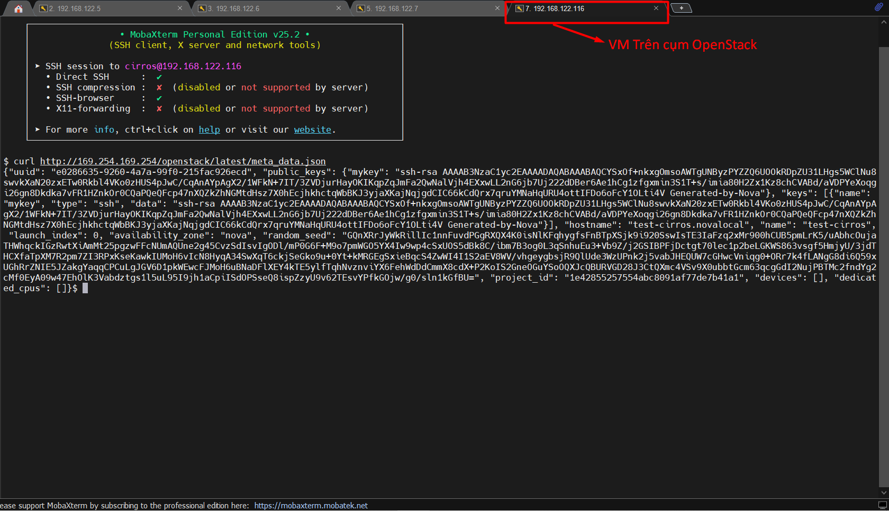

### `Glance` - Image service

Glance cho phép người dùng tìm kiếm, đăng kí và di chuyển các disk image của máy ảo. Nó sung cấp giao diện web đơn giản (REST: Representational State Transfer) cho phép người dùng truy xuất metadata của image trong các VM. Glance làm việc trực tiếp với Nova để hỗ trợ cho việc tạo máy ảo, nó cũng giao tiếp với Keystone để xác thực API.

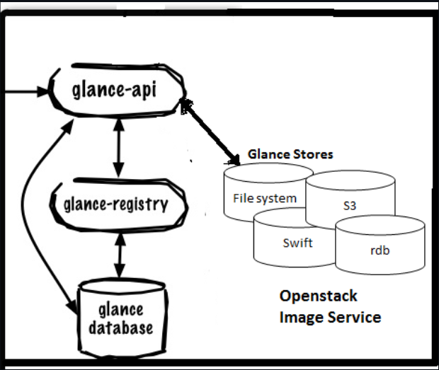

**OpenStack Image service** là trung tâm của **Infrastructure-as-a-Service (IaaS)**. Nó tiếp nhận các **API requests** cho ổ đĩa, server images hoặc metadata. Nó cũng hỗ trợ các storage lưu trữ khác nhau bao gồm **OpenStack Object Storage**.

Các thành phần chính của **OpenStack Image service**:

- **glance-api** : Chấp thuận các API calls cho việc tìm kiếm, vận chuyển và lưu trữ.
- **glance-registry** : Lưu, xử lí và truy vấn metadata về các images. Metadata bao gồm các thông tin về image như là kích cỡ và loại.
- **database**: Lưu trữ metadata, MySQL hoặc SQLite thường được sử dụng.
- **Storage repository** : Hỗ trợ nhiều loại kho lưu trữ thông thường bao gồm: **RADOS block devices**, **VMware datastore**, **HTTP và Swift**.
- **Metadata definition service**: API cho nhà phân phối, quản trị và người dùng để tự định nghĩa metadata của riêng họ.

Danh sách các định dạng ổ đĩa và container được hỗ trợ bao gồm:

- **Disk Format**: **Disk format** của một image máy ảo là định dạng của disk image, bao gồm:

  - `raw`: là định dạng ảnh đĩa phi cấu trúc
  - `vhd`: là định dạng ảnh đĩa chung sử dụng bởi các công nghệ VMware, Xen, Microsoft, VirtualBox, etc.
  - `vmdk`: định dạng ảnh đĩa chung hỗ trợ bởi nhiều công nghệ ảo hóa khác nhau (điển hình là VMware)
  - `vdi`: định dạng ảnh đĩa hỗ trợ bởi VirtualBox và QEMU emulator
  - `iso`: định dạng cho việc lưu trữ dữ liệu của ổ đĩa quang
  - `qcow2`: hỗ trợ bởi QEMU và có thể ở rộng động, hỗ trợ copy on write
  - `aki`: Amazon kernel image
  - `ari`: Amazon ramdisk image
  - `ami`: Amazon machine image

- **Container Format**:

  - `bare`: định dạng này xác định rằng không có container hoặc metadata cho image
  - `ovf`: định dạng OVF container
  - `aki`: xác định Amazon kernel image lưu trữ trong Glance
  - `ami`: Xác định Amazon ramdisk image lưu trữ trong Glance
  - `ova`: xác định file OVA tar lưu trữ trong Glance

- **Glance API**:

API đóng vai trò quan trọng trong việc xử lý image của Glance. Glance API có 2 version 1 và 2. **Glance API ver2** cung cấp tiêu chuẩn của một số thuộc tính tùy chỉnh của image. Glance phụ thuộc vào Keystone và OpenStack Identity API để thực hiện việc xác thực cho client. Bạn phải có được token xác thực từ Keystone và gửi token đó đi cùng với mọi API requests tới Glance thông qua **X-Auth-Token header**. **Glance sẽ tương tác với Keystone** để xác nhận hiệu lực của token và lấy được các thông tin chứng thực.

### `Keystone` - Identity Service

Cung cấp dịch vụ xác thực cho toàn bộ hạ tầng OpenStack

- Theo dõi người dùng và quyền hạn của họ
- Cung cấp một catalog của các dịch vụ đang sẵn sàng với các API endpoints để truy cập các dịch vụ đó

**Identity service** chính là dịch vụ đầu tiên mà người dùng tương tác. Một khi đã được xác thực, người dùng có thể dùng nó để tương tác với các dịch vụ khác. Bên cạnh đó, các dịch vụ khác của OpenStack cũng sử dụng dịch vụ xác thực để chắc chắn về danh tính người sử dụng. Dịch vụ này có thể đi kèm với một vài hệ thống quản lí user như `LDAP`.

**Keystone** cung cấp chức năng **xác thực** và **ủy quyền** cho **các phần tử trong OpenStack**. Người dùng khai báo chứng thực với Keystone và dựa trên kết quả của tiến trình xác thực, nó sẽ gán "role" cùng với một token xác thực cho người dùng. **Token** là một dạng thông tin của một user, **Token** được sinh ra khi ta sử dụng **username**,**password** đúng để xác thực với **Keystone**. Khi đó user sẽ dùng token này để truy cập vào **Openstack API**. "Role" này mô tả quyền hạn cũng như vai trò trong thực hiện việc vận hành OpenStack.

**User** trong Keystone có thể là:

- Con người
- Dịch vụ (Nova, Cinder, neutron, etc.)
- Endpoint (là địa chỉ có khả năng truy cập mạng như URL, RESTful API, etc.)

**User** có thể được tập hơp lại thành 1 tenant, tenant này có thể là project, nhóm hoặc tổ chức.

**Keystone** gán một tenant và một role cho user. Một user có thể có nhiều role trong các tenants khác nhau. Tiến trình xác thực có thể biểu diễn như sau:

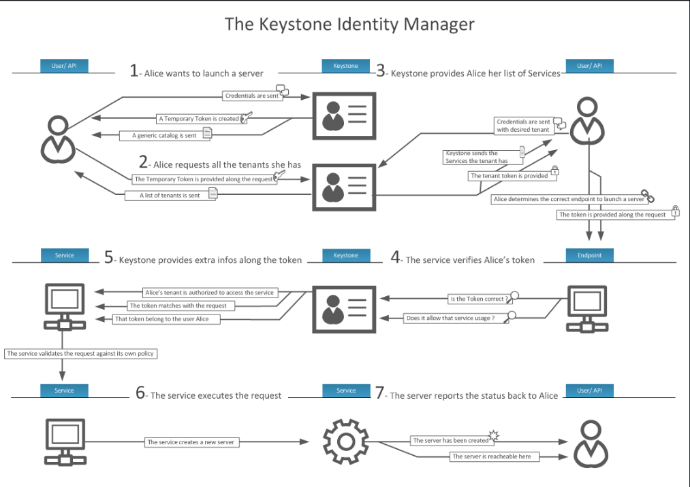

**Các dịch vụ bên trong keystone** bao **gồm**:

- **Identity**

  - Cung cấp dịch vụ chứng thực và dữ liệu về **Users**, **Groups**, **Projects**, **Domains Roles**, **Metadata**, etc.
  - Về cơ bản, tất cả các dữ liệu này được quản lý bởi dịch vụ, cho phép các dịch vụ quản lý các thao tác CRUD (Create - Read - Update - Delete) với dữ liệu
  - Trong nhiều trường hợp khác, dữ liệu bị thu thập từ các dịch vụ backend được ủy quyền khác như LDAP

- **Token**

  - Xác nhận và quản lý các tokens được sử dụng để xác thực yêu cầu khi thông tin của người dùng đã được xác minh

- **Catalog**

  - Cung cấp một endpoint registry sử dụng để phát hiện endpoint

- **Policy**

  - Cung cấp engine để ủy quyền dựa trên rule và kết nối với giao diện quản lý rule

  - Mỗi dịch vụ này có thể được cấu hình để sử dụng một dịch vụ back-end. Một số back-end service điển hình:

    - **Key Value Store**: cung cấp giao diện hỗ trợ tìm kiếm theo khóa
    - **Memcached**: Là hệ thống phân phối và lưu trữ bộ nhớ đệm (cache) và chứa dữ liệu trên RAM. (lưu tạm thông tin những dữ liệu hay sử dụng và bộ nhớ RAM)
    - **SQL**: sử dụng SQLAlchemy để lưu trữ dữ liệu bền vững
    - **Pluggable Authentication Module (PAM)**: sử dụng dịch vụ PAM của hệ thống cục bộ cho việc xác thực
    - **LDAP**: kết nối thông qua LDAP tới một thư mục back-end, như Active Directory để xác thực các user và lấy thông tin về role

Từ bản Juno, **Keystone** có tính năng mới là **federation of identity service**. Nghĩa là thay vì việc xác thực tập trung, việc xác thực sẽ phân tán trên Internet, hay còn gọi là **Identity Providers(IdPs)**. Lợi ích của việc sử dụng IdPs:

- Không cần phải dự phòng các user entries trong Keystone (các bản ghi về người dùng), bởi vì các user entries đã được lưu trữ trong cơ sở dữ liệu của các IdPs
- Không cần phải xây dựng mô hình xác thực trong Keystone, bởi vì các IdPs chịu trách nhiệm xác thực cho người dùng sử dụng bất kỳ công nghệ nào phù hợp. Do đó có thể kết hợp nhiều công nghệ xác thực khác nhau
- Nhiều tổ chức hợp tác có thể chia sẻ chung các dịch vụ cloud bằng cách mỗi tổ chức sẽ sử dụng IdP cục bộ để xác thực người dùng của họ

### `Swift` – Object Storage Service

Khi nhắc tới Storage, người ta thường nói tới 3 thể loại chính đó là:

- Block Storage
- File Storage
- Object Storage

Sau đây là bảng so sánh giữa 3 thể loại này:

| Tiêu chí         | **Block Storage**                | **File Storage**           | **Object Storage**              |
| ---------------- | -------------------------------- | -------------------------- | ------------------------------- |
| Cách lưu trữ     | Chia dữ liệu thành **block** nhỏ | Lưu theo **file + folder** | Lưu thành **object**            |
| Cấu trúc         | Không có cấu trúc thư mục        | Cây thư mục (folder/file)  | Flat (không thư mục thật)       |
| Metadata         | Rất ít                           | Cơ bản                     | Rất nhiều (metadata mạnh)       |
| Cách truy cập    | Gắn như **ổ đĩa**                | Qua **file system**        | Qua **API / HTTP**              |
| Giao thức        | iSCSI, FC, NVMe-oF               | NFS, SMB/CIFS              | REST API (HTTP/HTTPS)           |
| Hiệu năng        |  **Cao nhất**                    | Trung bình                 |  Thấp hơn (đổi lại scale tốt)   |
| Khả năng mở rộng | Khó scale lớn                    | Scale vừa                  |  **Scale cực lớn**              |
| Độ trễ           | Rất thấp                         | Thấp                       | Cao hơn                         |
| Tính nhất quán   | Strong consistency               | Strong                     | Eventual (thường là vậy)        |
| Quản lý          | Phức tạp                         | Dễ                         | Rất dễ                          |
| Use case chính   | OS, DB, VM disk                  | Chia sẻ file               | Backup, media, cloud            |
| Ví dụ thực tế    | SAN, LVM                         | NAS                        | S3, Swift                       |
| Ví dụ dịch vụ    | AWS EBS                          | AWS EFS                    | AWS S3                          |

Đặc điểm của Swift:

- **Swift** là nền tảng lưu trữ mạnh mẽ, có khả năng mở rộng và chịu lỗi cao, được thiết kế để lưu trữ một lượng lớn dữ liệu phi cấu trúc với chi phí thấp thông qua một **http RESTful API**. Người dùng không thể truy cập dữ liệu dưới dạng **block** hoặc **file**. **Object Storage** thường được sử dụng để lưu trữ và backup dữ liệu như disk image máy ảo, ảnh, video, nhạc...

- "Khả năng mở rộng cao" có nghĩa là nó có thể mở rộng đến hàng ngàn máy với hàng chục ngàn của ổ đĩa cứng. **Swift** được thiết kế có khả năng mở rộng theo chiều ngang. **Swift** là lý tưởng để lưu trữ và phục vụ cho nhiều người, nhiều người sử dụng đồng thời - một đặc điểm phân biệt nó với các hệ thống lưu trữ khác.

- **Swift** có tính "dự phòng" nghĩa là **swift** lưu trữ nhiều bản sao của mỗi thực thể trong hệ thống. Mỗi bản sao được lưu trữ sẵn trong khu vực vật lý riêng biệt, tránh được những thất bại phổ biến như các vấn đề về ổ cứng, mạng, mất dữ liệu, etc.

- **Swift** lưu trữ dữ liệu phi cấu trúc nghĩa là Swift lưu trữ theo các bits. Swift không phải là một cơ sở dữ liệu, không phải là một hệ thống lưu trữ thep khối, Swift lưu trữ **blobs** (Binary large Object) của dữ liệu.

- Ngoài ra, vì **Swift** đảm bảo rằng các object sẽ có sẵn dữ liệu ngay khi chúng được ghi thành công, nên **Swift** có thể được sử dụng để lưu trữ các nội dung thay đổi thường xuyên. Để thích ứng với những nhu cầu thay đổi, hệ thống lưu trữ phải có khả năng để xử lý khối lượng công việc quy mô web với đồng thời nhiều reader và writer để lưu trữ dữ liệu. Một số dữ liệu thường viết ra và tìm kiếm, chẳng hạn như: các tập tin cơ sở dữ liệu và hình ảnh máy ảo, dữ liệu khác như: văn bản, hình ảnh, tài liệu (và sao lưu thường được ghi một lần và hiếm khi truy cập). Web và các dữ liệu di động cũng cần phải được truy cập qua web thông qua một URL để hỗ trợ web / ứng dụng di động.

**Swift** có 2 nodes chính:

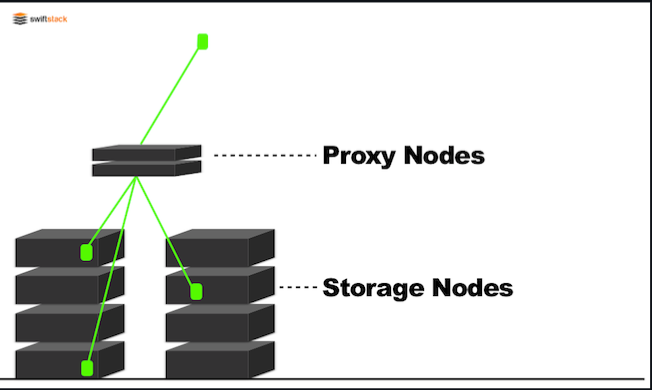

- **Proxy Nodes**: những node này tương tác với "Swift client" và thực hiện xử lý các yêu cầu. Client chỉ có thể tương tác với Proxy nodes
- **Storage Nodes**: đây là các node lưu trữ các objects

Các thành phần trong Swift:

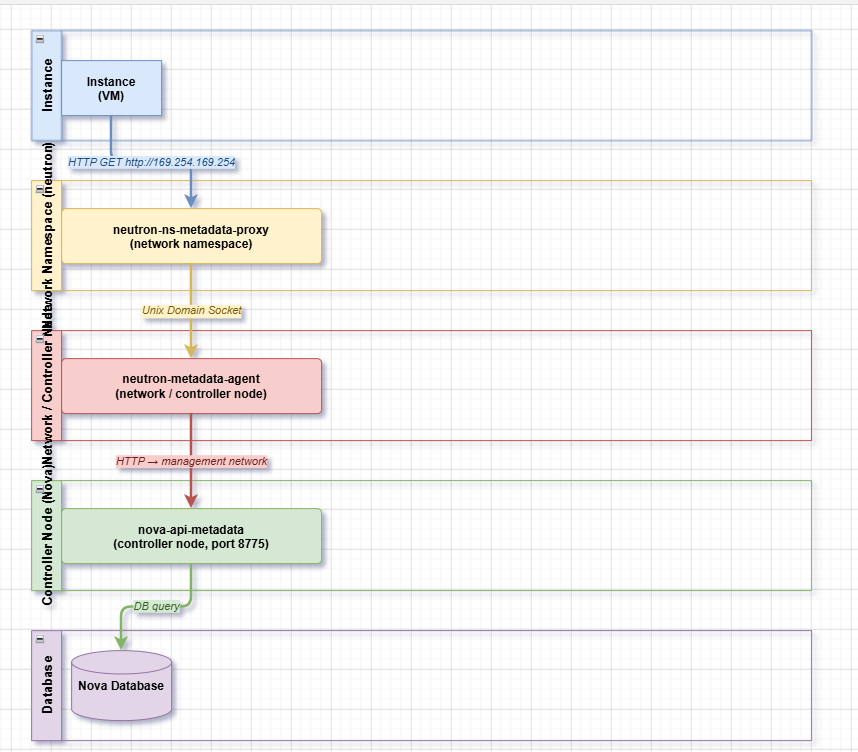

- **Partition**: phân vùng lưu trữ các đối tượng, cơ sở dữ liệu **Account** và cơ sở dữ liệu **container**. Đây là **một trung gian vùng chứa** giúp quản lý vị trí, nơi dữ liệu sống trong cluster.
- **Ring - "Trái tim" của Swift**: Một Ring đại diện cho **một ánh xạ giữa tên của các thực thể được lưu trữ trên đĩa và vị trí địa lý của chúng**. Có Ring riêng biệt cho các **account**, **container**, và **các object**. Khi các thành phần khác cần phải thực hiện bất kỳ hoạt động trên một container, object, hoặc account, thì **cần phải tương tác với Ring thích hợp để xác định vị trí của nó trong cluster**.
- **Objects**: là các bản ghi dưới dạng key-value lưu trữ dữ liệu các đối tượng
- **Container**: nhóm các object
- **Account**: nhóm các containers
- **Object server**: Server Object là một blob lưu trữ server mà có thể lưu trữ, truy xuất và xóa các đối tượng được lưu trữ trên các thiết bị cục bộ.
- **Container server**: Công việc chính Server container là để xử lý danh sách các đối tượng. Nó không biết về đối tượng, mà chỉ cần biết các đối tượng đang trong một container cụ thể.
- **Account server**: Account Server tương đối giống với Server container, ngoại trừ, nó chịu trách nhiệm về các danh sách các container chứ không phải là các đối tượng.
- **Replicator**: tiện ích xử lý tạo bản sao dữ liệu
- **Updater**: xử lý các bản update không thành công của dữ liệu container hoặc account.
- **Auditor**: Auditors thu thập dữ liệu local server để kiểm tra tính toàn vẹn của các object, container, và account

Sơ đồ dưới đây mô tả mối quan hệ giữa Proxy server với **Account**, **Object**, **Container server** thông qua **Ring**:

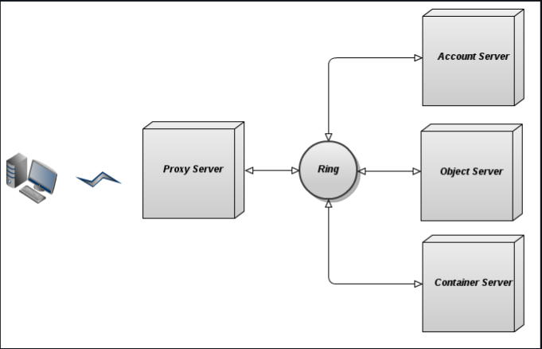

### `Cinder` - Block Storage Service

Trước đây Cinder là một phần của `Nova` (nova-volume) và được tách ra thành một service riêng biệt kể từ bản `Folsom`.

Tương tự như **Amazon Web Services S3** (Simple Storage Service) cung cấp **khối lưu trữ bền vững** (persistent block storage) để vận hành các máy ảo.

**Cinder** cung cấp dịch vụ Block Storage. Một cách ngắn gọn, Cinder thực hiện ảo hóa pool các khối thiết bị lưu trữ và cung cấp cho người dùng cuối API để request và sử dụng tài nguyên mà không cần biết khối lưu trữ của họ thực sự lưu trữ ở đâu và loại thiết bị là gì. Cũng như các dịch vụ khác trong OpenStack, self service API được sử dụng để tương tác với dịch vụ Cinder.

Kiến trúc Cinder:


- **Cinder-api**:

  - Một ứng dụng WSGI có vai trò xác thực và chuyển request trong toàn bộ dịch vụ Block Storage
  - Request được gửi tới cinder-scheduler rồi điều hướng tới cinder-volumes thích hợp

- **Cinder-scheduler**:

  - Dựa trên request được điều hướng tới, cinder-scheduler chuyển request tới Cinder Volume Service thông qua giao thức AMQP (lưu trữ bản tin điều hướng trong Queue của RabbitMQ hoặc Qpid)
  - Có thể được cấu hình để sử dụng cơ chế round-robin
  - Filter Scheduler là mode mặc định xác định nơi để gửi volume dựa trên Capacity, Avalability Zone, Volume Types, Capabilities cũng các bộ lọc tùy biến

- **Cinder-volume**:

  - Quản lý các công nghệ lưu trữ back-ends khác nhau
  - Tương tác trực tiếp với phần cứng hoặc phần mềm cung cấp khối lưu trữ
  - Cung cấp cho người dùng cái nhìn về volume

- **Cinder-backup**: Cung cấp dịch vụ backups của Cinder volumes cho OpenStack Swift

Thành phần của Cinder:

- **Back-end Storage Devices**

  - Mặc định là LVM (Logical Volume Manager) trên nhóm các volume cục bộ - "cinder-volumes"
  - Hỗ trợ các thiết bị khác như RAID ngoài hoặc các thiết bị lưu trữ
  - Kích thước khối lưu trữ được điều chỉnh sử dụng hypervisor như KVM hoặc QEMU

- **Users và Tenants/Projects**

  - Sử dụng cơ chế Role-based Access Control (RBAC) cho multi-tenants
  - Sử dụng file "policy.json" để duy trì rule cho mỗi role
  - Volume truy cập bởi mỗi người dùng riêng biệt
  - Định ra Quotas để kiểm soát mức độ tiêu tốn tài nguyên thông qua tài nguyên phần cứng sẵn sàng cho mỗi tenants
  - Quota có thể được sử dụng để kiểm soát: số lượng volume và snapshots có thể tạo ra cũng như tổng dung lượng (theo GBs) cho phép đối với mỗi tenants

**Volumes, Snapshots và Backups**:

- Tài nguyên mà dịch vụ Block Storage service cung cấp là volumes và snapshots:

  - **Volumes**: Cấp phát các khối lưu trữ có thể attach vào các instance như một khối lưu trữ thứ hai hoặc có thể sử dụng đẻ boot các instances. Volume là các khối lưu trữ đọc/ghi bên vững được attach trên compute node thông qua iSCSI
  - **Snapshots**: có thể được khởi tạo từ 1 volume đang sử dụng (bằng việc sử dụng tùy chọn --force True) hoặc trong trạng thái sẵn sàng. Snapshot sau đó có thể sử dụng để tạo volume mới.
  - **Backups**: là bản dự phòng của 1 volume lưu trữ trong OpenStack Object Storage

**Lưu trữ vật lý hỗ trợ Cinder** có thể là ổ vật lý **HDD** hoặc **SSD**. NÓ cũng có thể là hệ thống lưu trữ ngoài **cung cấp bởi giải pháp lưu trữ của bên thứ ba** như **NetApp** hoặc **EMC**

### `Neutron` - Networking Service

Ban đầu khi OpenStack mới ra mắt, dịch vụ network được cung cấp trong `Nova` - nova-networking. Sau này, khi OpenStack ngày càng trưởng thành, yêu cầu đặt ra là phải có module networking mạnh mẽ và khả chuyển (powerful & flexible).

Nova-networking bị hạn chế trong các network topo, và gần như không hỗ trợ các giải pháp của bên thứ ba. Nova-network chỉ có thể sử dụng Linux-bridge, hạn chế network type và iptable để cung cấp dịch vụ mạng cho hypervisor trong Nova. Do đó project network thay thế nova-networking ra đời - ban đầu đặt tên Quantum sau đổi tên lại thành Neutron

Các thành phần của Neutron:

- **Neutron-Server**:

Dịch vụ này chạy trên các network node để phục vụ Networking API và các mở rộng của nó. Nó cũng tạo ra network model và đánh địa chỉ IP cho mỗi port. Neutron-Server và các plugin agent yêu cầu truy cập vào Database để lưu trữ thông tin lâu dài và truy cập vào message queue (RabbitMQ) để giao tiếp nội bộ (giữa các tiến trình và với các tiến trình của các project khác)

- **Plugin agent**

Chạy trên các Compute node để quản lý cấu hình các switch ảo cục bộ (vSwitch). Các plugin này xác định xem những agent nào đang chạy. Dịch vụ này yêu cầu truy cập vào message queue.

- **DHCP agent (neutron-dhcp-agent)**

Cung cấp dịch vụ DHCP cho tenant networks. Agent này chịu trách nhiệm duy trì cấu hình DHCP. neutron-dhcp-agent yêu cầu truy cập message queue

- **L3 agent (neutron-l3-agent)**

Cung cấp kết nối ra mạng ngoài (internet) cho các VM trên các tenant networks nhờ L3/NAT forwarding.

- **Network provider services (SDN server/services)**

Cung cấp dịch vụ mạng nâng cao cho tenant network. Các dịch vụ SDN này có thể tương tác với **Neutron-server**, **Neutron-plugin**, **Plugin-agents** thông qua REST APIs hoặc các kênh kết nối khác.

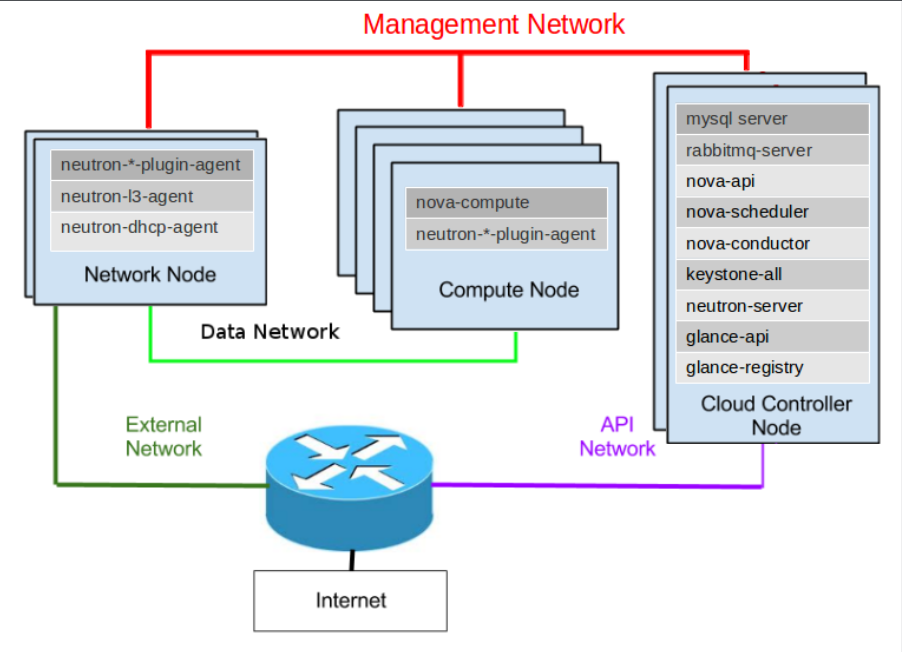

- **Neutron API**

  - Neutron API cho phép người dùng định nghĩa:

    - **Network**: người dùng có thể tạo ra một L2 segment tách biệt, tương tự như VLAN
    - **Subnet**: người dùng có thể định nghĩa ra được một tập các địa chỉ IP v4 hoặc v6 và các tham số cấu hình liên quan
    - **Port**: là điểm kết nối cho phép attach một thiết bị đơn lẻ (ví dụ như card mạng của server ảo) vào mạng ảo (Virtual network) cũng như các thông số cấu hình network liên quan như địa chỉ MAC và IP được sử dụng trên port đó.

- **Neutron API extension**

  - Với API extension. user có thể định nghĩa nên các chức năng mạng bổ sung thông qua Neutron plugins. Sơ đồ dưới đây biểu diễn mối quan hệ giữa Neutron API, Neutron API extension và Neutron plugin - plugin interface để giao tiếp với SDN Controller - OpenDaylight.

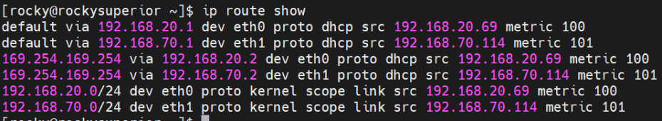

- **Neutron plugins**

Là giao diện kết nối giữa Neutron và các công nghệ back-end như SDN, Cisco, VMware NSX. Nhờ đó người dùng Neutron có thể tận dụng được các tính năng nâng cao của các thiết bị mạng hoặc phần mềm mạng của bên thứ ba. Các plugin này bao gồm: Open vSwitch, Cisco UCS/Nexus, Linux Bridge, Nicira Network Virtualization Platform, Ryu OpenFlow Controller, NEC OpenFlow. Một trong các plugin không trực tiếp liên quan tới công nghệ bên thứ ba nhưng là 1 plugin quan trọng đó là ML2 (Modular Layer 2) plugin. Plugin này cho phép hoạt động đồng thời của nhiều công nghệ mạng hỗn hợp trong Neutron.

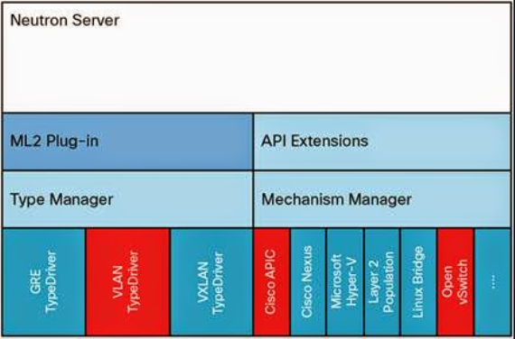

Không có ML2 driver, Neutron chỉ có thể cung cấp dịch vụ lớp 2. Hai khái niệm về driver trong ML2 là Type và Mechanism:

- **Type Manager**: GRE, VLAN, VXLAN
- **Mechanism Manager**: Cisco APIC, Cisco Nexus, Linux Bridge, OvS

### Horizon - Dashboard Service

Cung cấp giao diện nền web cho người dùng cuối và người quản trị cloud để tương tác với các dịch vụ khác của OpenStack, ví dụ như vận hành các instance, cấp phát địa chỉ IP và kiểm soát cấu hình truy cập các dịch vụ. Một số thông tin mà giao diện người dùng cung cấp cho người sử dụng:

- Thông tin về quota và cách sử dụng
- Instances để vậy hành các máy ảo cloud
- Volume Management điều khiển khởi tạo, hủy kết nối tới các block storage
- Images and Snapshots để up load và điều khiển các virtual images, các virtual images được sử dụng để back up hoặc boot một instance mới
- Mục addition cũng cung cấp giao diện cho hệ thống cloud:
  
  - `Project`: cung cấp các group logic của các user
  - `User`: quản trị các user
  - `System Info`: Hiển thị các dịch vụ đang chạy trên cloud
  - `Flavors`: định nghĩa các dịch vụ catalog yêu cầu về CPU, RAM và BOOT disk storage

## III. KIẾN TRÚC OPENSTACK

Giả sử ta có môi trường Classroom:

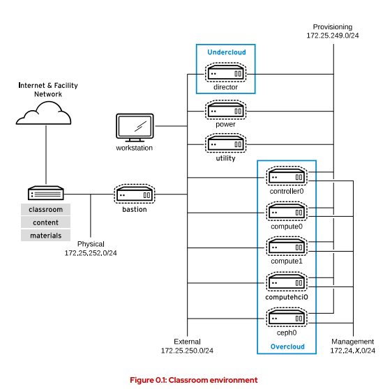

### 1. Khái niệm TripleO:

TripleO là một project của OpenStack dùng để tự động hóa việc triển khai OpenStack bằng các công cụ của OpenStack.

Tên TripleO viết tắt của: **OpenStack On OpenStack (OOO → TripleO)**

- OpenStack dùng để triển khai gọi là **Undercloud**
- OpenStack được triển khai ra gọi là **Overcloud**

### 2. Workstation là máy trung tâm lab

- Workstation VM là máy chính để làm việc

Đặc điểm:

- Là VM duy nhất có GUI
- Dùng để:
  - mở browser
  - truy cập dashboard OpenStack
  - dùng các GUI tools

- Phải login vào workstation trước
- Sau đó từ máy Workstation ta SHH vào các VM khác

```text
       → ssh controller0
       → ssh compute0
       → ssh ceph0
```

### 3. Cách truy cập giao diện web

Từ máy **Workstation**, ta mở browser để vào:

- OpenStack Dashboard
- Các GUI tool khác

Ví dụ dashboard của OpenStack:**OpenStack Horizon**

### 4. External Network của lab

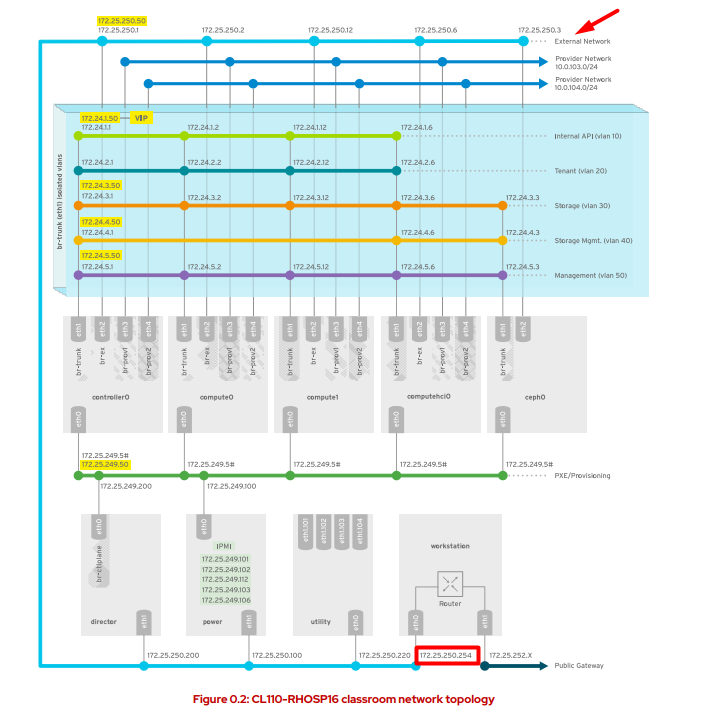

Tất cả VM đều kết nối vào external network

`172.25.250.0/24`

Gateway:

`172.25.250.254`

Gateway này chính là: **Workstation**

Tức là:

```text
VM → workstation → mạng classroom → internet
```

Workstation đóng vai trò:

- Router
- DNS server

### 5. Internal Network của Overcloud

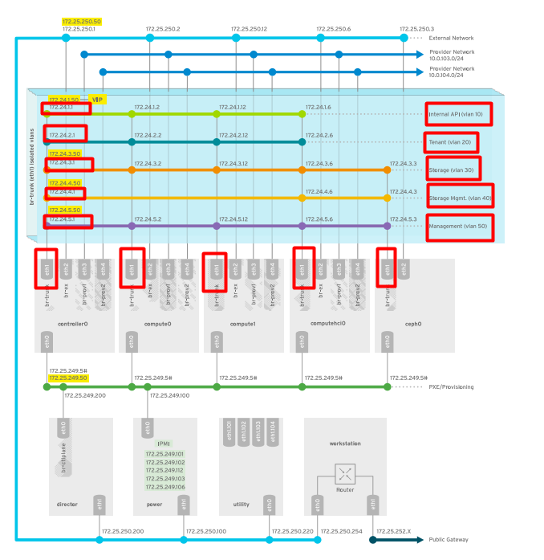

Các VM của Overcloud dùng mạng riêng:

`172.24.X.0/24`

Mạng này:

- dùng VLAN
- là internal network

### 6. Các VM trong lab

#### a. VM của sinh viên

Domain:

`lab.example.com`

Bao gồm:

- utility
- power

#### b. VM của Overcloud

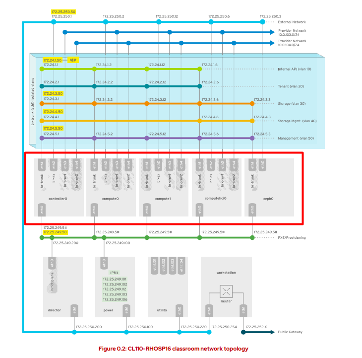

Domain:

`overcloud.example.com`

Bao gồm:

```text
controller0
compute0
compute1
computehci0      
ceph0
```

### 7. Provisioning Network

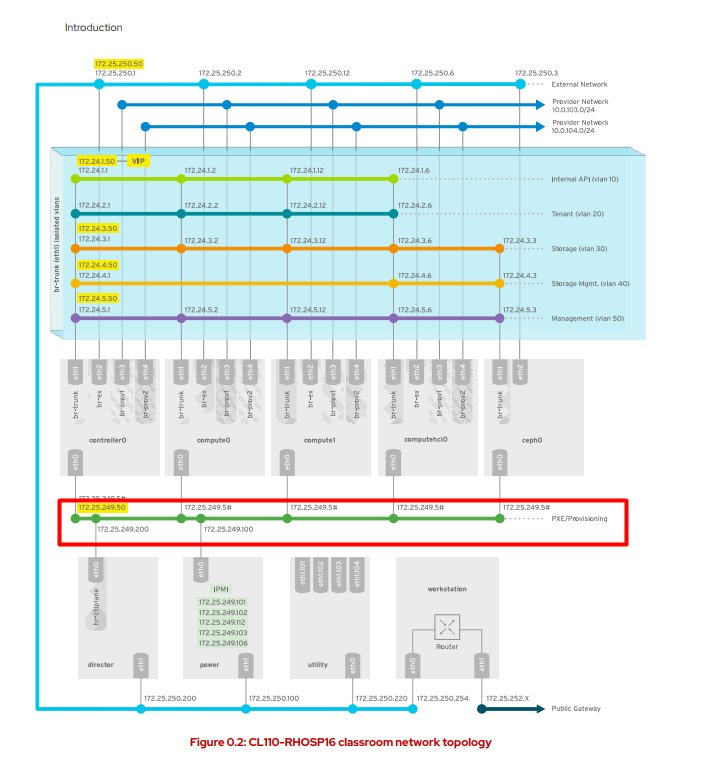

Các node **Overcloud** được deploy qua mạng:

`172.25.249.0/24`

Mạng này gọi là:**Provisioning Network**

Các node trong mạng này:

```text
director
power
controller
compute
ceph
```

### 8. Undercloud và Overcloud

Trong RHOSP có 2 tầng:

#### a. Undercloud

-> Node quản lý deployment

Tên thường là:

```text
director
```

Chức năng:

- deploy overcloud
- provisioning nodes
- cấu hình cluster

#### b. Overcloud

Hệ thống OpenStack thực tế:

```text
controller0
compute0
compute1
ceph0
```

### 9. Classroom server

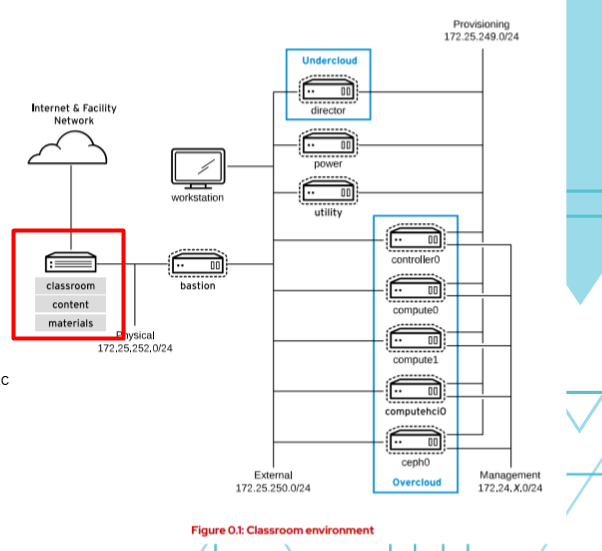

Server lớp học có vai trò:

- **NAT router**

Cho phép lab truy cập:

`Internet`

#### File server

Các URL:

```text
content.example.com
materials.example.com
```

Dùng để:

- chứa tài liệu
- chứa file lab

**Link tham khảo**:

<https://github.com/thaonv1/meditech-thuctap/blob/master/ThaoNV/Tim%20hieu%20OpenStack/docs/general/cau-truc-va-thanh-phan-openstack.md>
<https://docs.openstack.org/2025.2/admin/>


