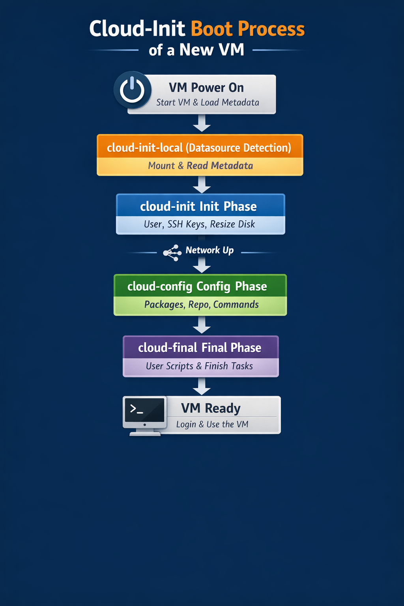
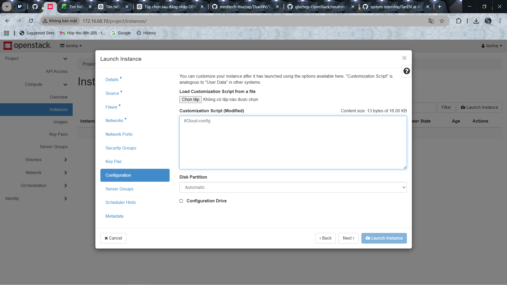

# TÌM HIỂU VỀ CLOUD-INIT

## I. TỔNG QUAN VỀ CLOUD-INIT

### Tiến trình Cloud-init can thiệp khi mới khởi tạo 1 VM mới



**Giai đoạn 1**: VM power on :

- Hypervisor (OpenStack / AWS / Proxmox / VMware…) cấp:

  - CPU, RAM
  - Disk
  - Network

- Gắn metadata source (ISO config-drive, HTTP metadata…)

**Giai đoạn 2**: Kernel + Init system boot

- Linux kernel boot
- systemd khởi động
- Service cloud-init-local chạy

**Giai đoạn 3** `Cloud-init-local` hành động

- Nó Detect **DataSource**:

  - eg: OpenStack,EC2,...

- Mount Metadata Source
- Đọc `user-data`, `meta-data`

-> Chưa có network,chưa tạo user và chưa SSH

**Giai đoạn 4**: Bước đầu khởi tạo của `Cloud-init` (INT phase)

Lúc này module `cloud_init_modules` chạy. Việc nó làm:

- Tạo user mặc định
- Inject SSH key
- Set hostname
- Grow partition
- Resize filesystem
- Setup SSH daemon

-> lúc này chưa có network

**Giai đoạn 5**: Network lên

- systemd-networkd / NetworkManager chạy
- VM có IP
- Default route có

**Giai đoạn 6**: Bước cấu hình của `Cloud-init` (Config phase)

Lúc này, `cloud_config_modules`(`cloud-config` được đọc và thêm vào ở bước này) chạy. Và việc nó làm:

- Mount filesystem
- Set locale, timezone
- Add repo
- Install / update package
- Chạy `cmd`

**Giai đoạn 7**: Cấu hình Final(Hoàn thiện)

Lúc này, `cloud_final_modules` chạy. Và việc nó làm:

- Chạy script user
- Script per-boot / per-instance
- Ghi log fingerprint SSH
- In thông báo hoàn tất

-> VM gần như Boot xong hoàn toàn

**Giai đoạn 8**: Login được vào VM

- SSH bằng user cloud
- Disk đã resize
- Hostname đúng
- Package đã cài

-> Cloud-init DONE

**Lưu ý**: Những lần boot sau:

- cloud-init-local vẫn chạy
- Module `per-once` không chạy lại
- Modules INIT / CONFIG bỏ qua
- Chỉ chạy `scripts-per-boot`

### 1. Khái niệm về Cloud-Init

**Cloud-init** là 1 phần mềm được sử dụng để thực hiện các thiết lập ban đầu đối với các máy ảo hoá và cloud. Dịch vụ này sẽ chạy trước quá trình `boot`, nó sẽ lấy dữ liệu từ bên ngoài và thực hiện 1 số tác động tới máy chủ.

Các tác động mà cloud-init thực hiện phụ thuộc vào loại format thông tin mà nó tìm kiếm được. Các format hỗ trọ :

- Shell scripts (Bắt đầu với #!)
- Cloud config files (Bắt đầu với #cloud-config)
- MIME multipart archive.
- Gzip Compressed Content
- Cloud Boothook

=> Một trong những format thông dụng nhất dành cho các scripts đó là `cloud-config`.

#### Khái niệm `cloud config`

`cloud-config` là các file script được thiết kế để chạy trong các tiến trình cloud-init. Nó được sử dụng cho các cài đặt cấu hình ban đầu trên server như networking, SSH keys, timezone, user data injection...

#### File config của `cloud-init`

File cấu hình của cloud-init `/etc/cloud/cloud.cfg` mặc định chứa 3 module là `Cloud_init_modules`, `Cloud_config_modules`, `Cloud_final_module`

Ví dụ:

```bash
users:                                                              # Dùng user mặc định của distro
 - default

disable_root: 1                                                     # Không đặc nhập trực tiếp bằng tk root (dù có tai khoan root)
ssh_pwauth:   0                                                     # Cấm SSH bằng password chỉ SSH bằng SSH key

locale_configfile: /etc/sysconfig/i18n                              # File cấu hình ngôn ngữ/locale của hệ thống
mount_default_fields: [~, ~, 'auto', 'defaults,nofail', '0', '2']   # Các option mặc định khi cloud-init mount filesystem
resize_rootfs_tmp: /dev                                             # Dùng /dev làm nơi resize root filesystem
ssh_deletekeys:   0                                                 # không xoá SSH host keys cũ (Dùng kh clone image)
ssh_genkeytypes:  ~                                                 # Không chỉ định loại key -> Gen ra mặc định (rsa,..)
syslog_fix_perms: ~                                                 # Không can thiệp permission syslog

cloud_init_modules:
 - migrator                                                         # Upgrade cấu trúc dữ liệu cloud-init cũ 
 - bootcmd                                                          # Chạy lệnh rất sớm trước, trước Network 
 - write-files                                                      # Ghi file cấu hình User-data
 - growpart                                                         # Mở rộng partition nếu disk lớn hơn
 - resizefs                                                         # Resize filesystem sau khi grow partition
 - set_hostname                                                     # Set hostname + update /etc/hosts
 - update_hostname                                                  # Set hostname + update /etc/hosts
 - update_etc_hosts                                                 # Set hostname + update /etc/hosts
 - rsyslog                                                          # Setup logging
 - users-groups                                                     # Tạo user / group
 - ssh                                                              # Setup SSH, inject SSH key

cloud_config_modules:                                               
 - mounts                                                           # Mount filesystem
 - locale                                                           # Set locale
 - set-passwords                                                    # Set password (nếu cho phép)
 - yum-add-repo                                                     # Add repo yum
 - package-update-upgrade-install                                   # Update / upgrade / install package
 - timezone                                                         # Set timezone
 - puppet                                                           # Tool quản lý cấu hình (CM tools Không dùng có thể bỏ)
 - chef                                                             # Tool quản lý cấu hình (CM tools Không dùng có thể bỏ)
 - salt-minion                                                      # Tool quản lý cấu hình (CM tools Không dùng có thể bỏ)
 - mcollective                                                      # Tool quản lý cấu hình (CM tools Không dùng có thể bỏ)
 - disable-ec2-metadata                                             # Tắt metadata EC2 nếu không chạy trên AWS
 - runcmd                                                           # Chạy command do user định nghĩa

cloud_final_modules:
 - rightscale_userdata                                              # RightScale integration (cloud cũ)
 - scripts-per-once                                                 # Script chạy 1 lần duy nhất
 - scripts-per-boot                                                 # Script chạy mỗi lần boot
 - scripts-per-instance                                             # Script chạy mỗi instance
 - scripts-user                                                     # Script do user cung cấp
 - ssh-authkey-fingerprints                                         # Log fingerprint SSH key
 - keys-to-console                                                  # In SSH key ra console (debug)
 - phone-home                                                       # Gửi signal về cloud provider
 - final-message                                                    # In message: cloud-init done

system_info:                                                        # Nơi lưu thông tin hệ thống
  default_user:                                                     # User mặc định của cloud image
    name: centos                                                    # Tên user
    lock_passwd: true                                               # User không login bằng password
    gecos: Cloud User                                               
    groups: [wheel, adm, systemd-journal]                           # Thuộc group sudo + log
    sudo: ["ALL=(ALL) NOPASSWD:ALL"]                                # sudo không cần password
    shell: /bin/bash                                                # shell mặc định
  distro: rhel                                                      # Distro họ RHEL
  paths:                                                            # Nơi cloud -init lưu state + template
    cloud_dir: /var/lib/cloud
    templates_dir: /etc/cloud/templates
  ssh_svcname: sshd

# vim:syntax=yaml
```

=> Ở trong 3 modules này chứa Jobs mặc định của Cloud- init, ta có thể thay đổi các Jobs này, định nghĩa ra các Jobs mới. Bạn cần phải viết thêm một file code python thực hiện các thông số đầu vào mà người dùng đặt và đặt nó trong thư mục chứa datasource. Các đầu mục trong /etc/cloud/cloud.cfg sẽ được map với code Python.

=> Thứ tự cấu hình chạy dầu tiên từ khi khởi tạo cho đến Instance hoạt động trơn tru: `Cloud_init_modules` (Khi boot VM) -> `Cloud_config_modules`(Khi VM sẵn sàng), `Cloud_final_module` (Khi VM đẫ hoàn thành các bược khởi dộng và đã đủ để hoạt động như bình thường)

### 2. Cấu trúc thư mục `cloud-init` (DIRS)

Thông thường thư mục chính của `Cloud-init` được đặt tại `/var/lib/cloud`. `Cloud-init` sẽ **lấy thông tin từ Datasource** và lưu tại đây.  

(**Datasource** là các nguồn dữ liệu cấu hình cho `Cloud-init` thường được lấy từ **User** (userdata) hoặc tới từ stack tạo ra **Configuration drive** (metadata). **Userdata** thường chứa files, `yaml`, và **shell scripts**. Trong khi đó, metadata lại chứa **Server name**, **Instance id**, **display name** và một số thông tin khác.)

Notes: Đối với OpenStack, url để lấy metadata của nó thường là <http://169.254.169.254>

```bash
/var/lib/cloud/
  - data/                       # Chứa các thông tin liên quan instance id, datasource, hostname instance(của lần trước đó)
    - instance-id                     
    - previous-instance-id
    - datasource
    - previous-datasource
    - previous-hostname
  - handlers/                   # Các part-handlers code được chứa tại đây
  - instance                    # Một symlink tới folder instances, chỉ tới các ínstance đang active 
  - instances/                  # Tất cả các instances được tạo bởi image với instance indentifier subdirectories
    i-00000XYZ/                 
      - boot-finished
      - cloud-config.txt
      - datasource
      - handlers/
      - obj.pkl
      - scripts/
      - sem/
      - user-data.txt
      - user-data.txt.i
  - scripts/                   # scripts được tải và tạo bởi part-handler
    - per-boot/
    - per-instance/
    - per-once/
  - seed/
  - sem/                       # Cloud-init có một khái niệm  
  ```

### 3. Chức năng của `Cloud-init`

- Đặt nơi chứa máy ảo
- Thiết lập hostname
- Generate SSH private keys
- Chèn SSH key vào file .ssh/authorized_keys để user đó có thể đăng nhập
- Cấu hình các mount points
- Cấu hình các network devices

### 4. Giới thiệu về Cloud-config

**Cloud-config** là **một định dạng cấu hình YAML** và nó thực thi các câu lệnh và được sử dụng làm **User-data** cho **Cloud-init**, nhằm khởi tạo va cấu hình máy ảo ở lần boot đầu tiên

-> Lưu ý: Nó không phải là file cấu hình cố định, daemon, service. Mà **thuộc trong tiến trình của cloud-init** khi khởi tạo VM

Dấu hiện nhận biết của Cloud-config:

```text
#cloud-config
```



Một số rules khi viết file định dạng YAML:

- Các khoảng trống (space) cho biết cấu trúc và mối quan hệ giữa các items. Ví dụ các items là sub-items của item đầu tiên khi nó được viết thụt vào trong lề.
- Danh sách được xác định bằng các dấu gạch đầu dòng
- Các entries của mảng liên kết với nhau thể hiện qua dấu hai chấm (:), theo sau là khoảng trống (space) và các giá trị.
- Các khối văn bản với nhau được thụt vào lề dòng.

Hãy xem xét 1 ví dụ về cloud-config:

```bash
#cloud-config
users:
  - name: demo
    groups: sudo
    shell: /bin/bash
    sudo: ['ALL=(ALL) NOPASSWD:ALL']
    ssh-authorized-keys:
      - ssh-rsa ... user@example.com
      - ssh-rsa ... user@desktop
runcmd:
  - touch /test.txt
```

Một số lưu ý quan trọng:

- Mỗi một file cloud-config được bắt đầu bằng #cloud-config đứng một mình ở dòng đầu tiên. Đây là dấu hiệu để cloud init biết được đó là file cloud-config.
- Ví dụ trên có 2 câu lệnh "top-level" đó là users và runcmd . Đây đều được coi là keys và nó được theo sau bởi một loạt các dòng lệnh thụt lề dòng.
- Đối với phần user, giá trị là 1 list item. Với chỉ 1 dấu gạch ngang (-), ta có thể biết được ở đây chỉ thực hiện các thiết lập cho 1 user.

