# TÌM HIỂU VỀ METADATA SERVICE

## I. `Metadata Service` TRONG OpenStack LÀ GÌ?

Trong OpenStack:

**Metadata Service** là dịch vụ cho phép VM lấy thông tin cấu hình của chính nó thông qua địa chỉ `169.254.169.254`.

-> Địa chỉ này là link-local address (không cần internet).  
-> Nó bắt nguồn từ mô hình của Amazon Web Services (AWS).

## II. VÌ SAO `Metadata` QUAN TRỌNG ?

Khi VM vừa boot:

- Nó chưa biết hostname
- Chưa có SSH key
- Chưa có user
- Chưa có script cấu hình

Nhưng nó có:

- DHCP IP
- Default route

Lúc này:

Cloud-init sẽ gọi:

```text
http://169.254.169.254
```

Để lấy metadata.

## III. PHÂN BIỆT `Metadata` VÀ `Cloud-init`

`Metadata service` = cung cấp dữ liệu  
`Cloud-init` = đọc dữ liệu và cấu hình hệ thống

-> `Cloud-init` chỉ là client của metadata service.

## IV, CÁC LOẠI `Metadata`

Neutron/ Nova trả về 4 nhóm:

| Loại         | Ý nghĩa                 |
| ------------ | ----------------------- |
| Meta-Data    | instance-id, hostname…  |
| User-Data    | cloud-config script     |
| Vendor-Data  | dữ liệu từ nhà cung cấp |
| Network-Data | IP, MAC, subnet…        |

## V. CẤU TRÚC CỦA MetaData Service

Đây là sơ đồ miêu tả tổng quan các thành phần trong metadata:

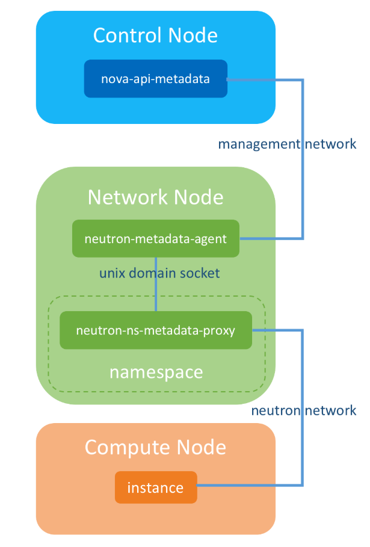

### 1. Nova-api-metadata

Là một **sub-service**của **nova-api**, nó chịu trách nhiệm cung cấp **metadata**, instance có thể gửi request tới **REST API** của **nova-api-metadata** để lấy metadata.

Dịch vụ này chạy trên **node controller** với port là `8775`

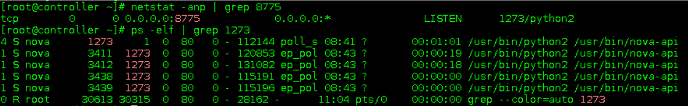

Các bạn có thể thấy ở một số trường hợp nhất định thì nova-api-metadata và nova-api sẽ được kết hợp lại với nhau. Để có thể làm như vậy, ta cần khai báo trong file `nova.conf`:

```bash
enabled_apis=osapi_compute,metadata
```

**osapi_compute** là dịch vụ của **nova-api**, **metadata** là **nova-api-metadata service**.

### 2. Neutron-metadata-agent

Máy ảo không thể kết nối trực tiếp tới `http://controller_ip:8775` để lấy **metadata**. Vì thế ta cần tới **neutron-metadata-agent**. Thông thường dịch vụ này chạy trên node network. Trong một số trường hợp nó cũng có thể chạy trên node controller.

Instance sẽ gửi request tới **neutron-metadata-agent** và **neutron-metadata-agent** sẽ foward nó tới nova-api-metadata.

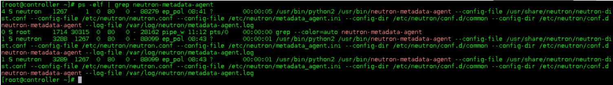

Thực tế thì máy ảo không thể giao tiếp trực tiếp với **neutron-metadata-agent**. Vì thế, ta cần tới sự trợ giúp của **dhcp agent** và **l3 agent**.

### 3. Neutron-ns-metadata-proxy

**Neutron-ns-metadata-proxy** được tạo bởi dhcp agent và l3 agent (nó chạy trên namespace nơi chứa dhcp-agent hoặc router). Neutron-ns-metadata-proxy được kết nối trực tiếp với neutron-metadata-agent thông qua unix domain socket.

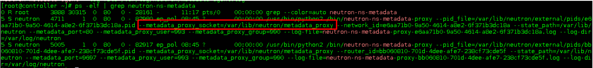

## VI. CÁCH THỨC HOẠT ĐỘNG, FLOW CỦA `MetaData` TRONG OpenStack

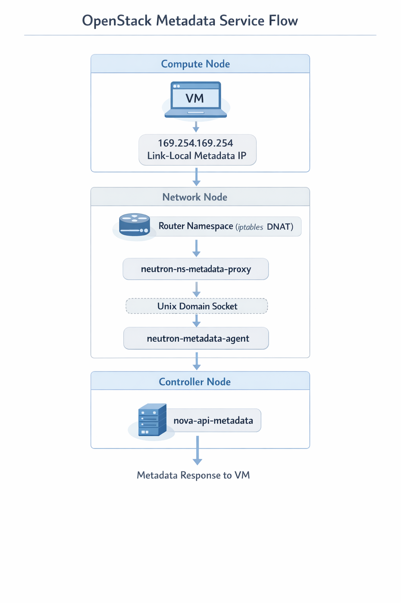

Như vậy, ta có thể hình dung đường đi tổng quan của metadata như sau:

1. Máy ảo gửi request tới **neutron-ns-metadata-proxy** thông qua **neutron network** (Project network).

2. **neutron-ns-metadata-proxy** gửi request tới **neutron-metadata-agent** thông qua **unix domain socket**

3. **neutron-metadata-agent** gửi request tới **nova-api-metadata** thông qua internal management network.

### Ví dụ chi tiết về đường đi của metadata trong OpenStack

Giả sử mình có một private network với dhcp (không có router)

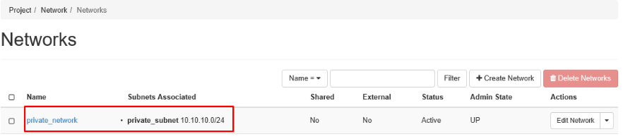

Ta thử deploy một máy ảo vm01 với private network và theo dõi log. Kết quả:

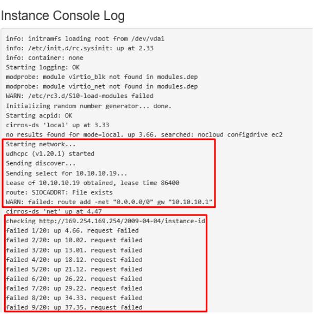

Ta có thể thấy rằng máy ảo đã nhận ip từ dhcp tuy nhiên nó không thể truy cập vào địa chỉ `http://169.254.169.254/2009-04-04/instance-id` (truy cập 20 lần thất bại)

#### **Địa chỉ 169.254.169.254 là gì ?**

Địa chỉ này bắt nguồn từ **AWS**, khi mà Amazon bắt đầu thiết kế lên public cloud, họ dùng `169.254.169.254` làm địa chỉ cho server để máy ảo có thể **request metadata**. OPS đơn giản là...dùng lại thôi...

Trở lại với ví dụ bên trên, khi mà máy ảo không thể truy cập tới `169.254.169.254` thì đương nhiên nó sẽ không thể lấy được metadata. Bởi thế hostname (mặc định là instance name) sẽ không được set.

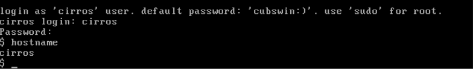

- Như vậy tên của máy ảo (vm01) đã không được set.

Ta kiểm tra **neutron-ns-metadata-proxy process** trên node controller, kết quả cho thấy hiện **neutron-ns-metadata-proxy** chỉ chạy trên external network (dhcp-agent).

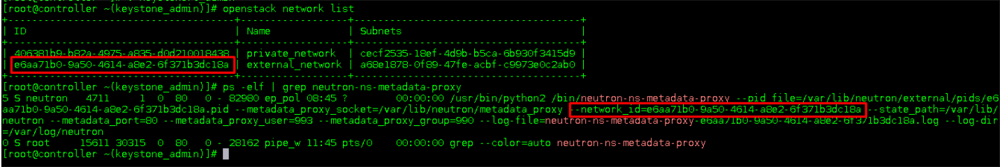

- Nguyên nhân đó là **neutron-ns-metadata-proxy** đối với private netwok được manage bởi **L3_agent**. **Private network** hiện không được kết nối với **neutron router** nên **neutron-ns-metadata-proxy** hiện không thể được bật.

Ta tiến hành thêm router và kết nối nó với private network. Sau đó kiểm tra lại neutron-ns-metadata-proxy process.

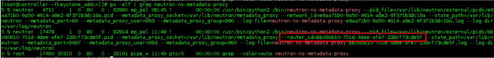

Restart lại `vm01` ta sẽ thấy kết quả:

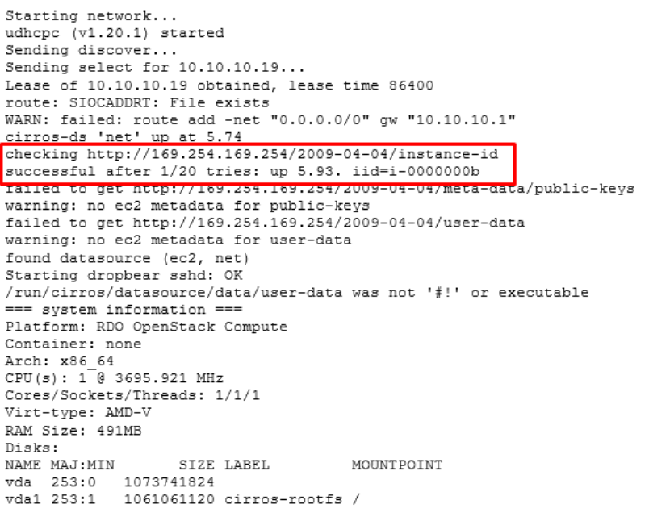

Máy ảo đã có thể kết nối tới `169.254.169.254`và nhận metadata

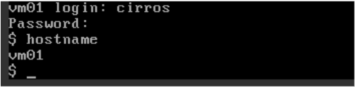

#### **Phân tích quá trình routing tới 169.254.169.254 sử dụng L3 Agent**

Ta có thể thấy metadata service address là 169.254.169.254 port 80, thử "curl" tới địa chỉ này:

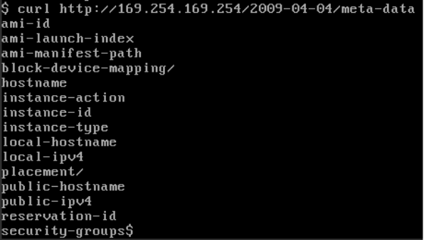

Đã thấy metadata, thế nhưng 169.254.169.254 không phải là IP của dịch vụ nova-api-metadata, làm sao nó có thể lấy được metadata ?

**Giải thích**:

Request từ `vm01` thông qua bảng routing sẽ tới `169.254.169.254` qua `10.10.10.1`. Đó là địa chỉ gateway của router, địa chỉ này được add tự động. Vì thế request sẽ được forward tới **neutron router metadata**.

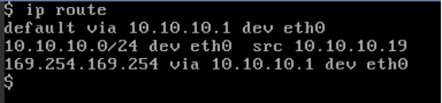

Tại đây, router sẽ forward nó qua port `9697` thông qua iptables rules:

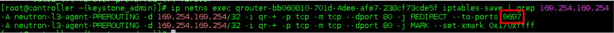

- Đây chính là port listening của **neutron-ns-metadata-proxy**

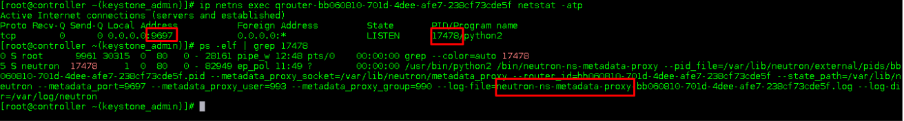

Như vậy ta có:

1. Máy ảo gửi request tới `169.254.169.254`
2. Request này được forward tới router
3. Router lại forward nó sang **neutron-ns-metadata-proxy**
4. **neutron-ns-metadata-proxy** thông qua Unix domain socket gửi tới **neutron-metadata-agent** và từ đó nó được gửi tới **nova-api-metadata**.

#### Sử dụng DHCP agent

Ngoài **L3 agent** thì OPS cũng sử dụng cả **dhcp agent** để tạo và quản lý **neutron-ns-metadata-proxy**. Để set-up, ta cần chỉnh sử tùy chọn `force_metadata = True` trong file `/etc/neutron/dhcp_agent.ini.`

Lúc này `169.254.169.254` sẽ được route thông qua IP cấp dhcp của network. Điều này có nghĩa rằng dhcp agent đã tự config khiến mọi metadata request tới `http://169.254.169.254` sẽ được gửi thẳng tới `dhcp-agent port 80` và port 80 cũng là port mà **process neutron-ns-metadata-proxy** được bật.

Luồng đi của metadata sau này vẫn tương tự với **l3-agent**.

=> Như vậy **l3-agent** sẽ sử dụng **iptables rules** để **forward** trong khi đó **dhcp-agent** lại **tự config** ip `169.254.169.254` cho chính interface của nó.

#### Phân tích quá trình `nova-api-metadata` trả lại metadata cho instance

Để lấy metadata từ nova-api-metadata, bạn cần phải chỉ ra id của máy ảo. Tuy vậy máy ảo khi mới được boot sẽ không thể biết được id của nó, vì thế http request sẽ không có thông tin về id, nó sẽ được thêm sau bởi neutron-metadata-agent. Ở đây ta thấy sự khác biệt khi sử dụng **l3-agent** và **dhcp-agent**.

##### L3 - agent

Hình dưới đây mô tả cách L3-agent tham gia vào quá trình gửi và nhận metadata request.

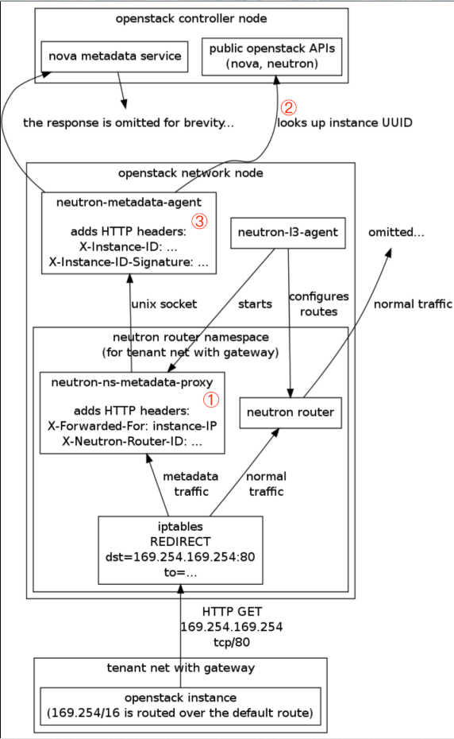

Flow:

instance -> neutron-ns-metadata-proxy -> neutron-metadata-agent -> nova-api-metadata:

1. **neutron-ns-metadata-proxy** nhận request, forward nó tới **neutron-metadata-agent** trước khi instance ip và router id được add vào request.

2. **neutron-metadata-agent** nhận request, nó sẽ check **instance id** bằng quy trình sau:

- Thông qua router id để tìm tất cả những subnet connection rồi filter ra instance ip
- Thông qua subnet để tìm instance ip port phù hợp
- Thông qua port để tìm instance phù hợp và cả id của nó nữa.

**neutron-metadata-agent** sẽ add **instance id** vào http request header rồi sau đó forward nó tới **nova-api-metadata**. **nova-api-metadata** lúc này có thể biết **instance id** để gửi lại metadata phù hợp.

##### Dhcp-agent

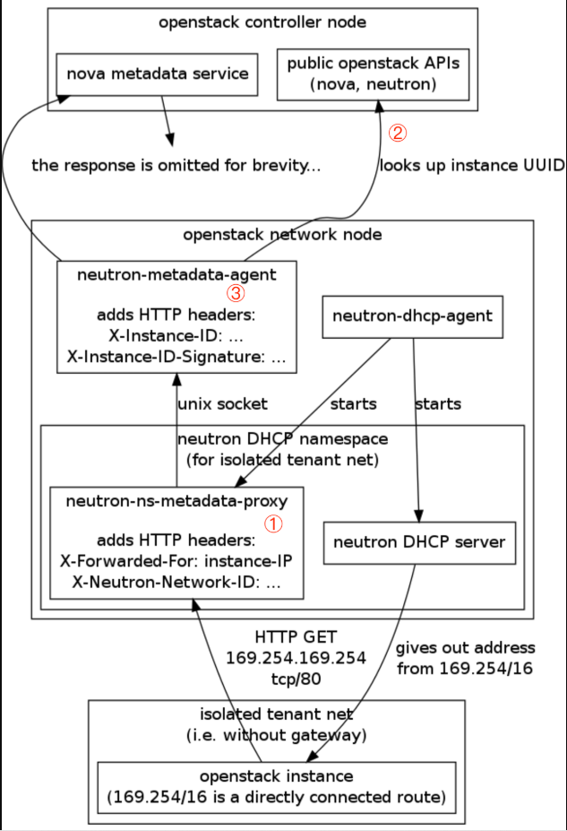

1. eutron-ns-metadata-proxy trước khi gửi request sẽ add instance ip và network id vào header của http request
2. neutron-metadata-agent nhận request, nó sẽ check instance id bằng các bước sau:

- Thông qua network id để tìm kiếm tất cả các subnet sau đó filter ra subnet chứa instance bằng instance ip.
- Thông qua subnet tìm kiếm instance ip port phù hợp.
- Thông qua port tìm kiếm ra instance và id của nó.

3. Neutron-metadata-agent sẽ add instance id vào http request header rồi sau đó forward nó tới nova-api-metadata. nova-api-metadata lúc này có thể biết instance id để gửi lại metadata phù hợp.

**Lưu ý**:

Để có thể lấy được metadata thì có một bước rất quan trọng đó là instance cần phải lấy được dhcp ip đầu tiên. Nếu không thì nó sẽ không thể gửi request tới 169.254.169.254 vì lúc ấy không có bất cứ routing nào.

