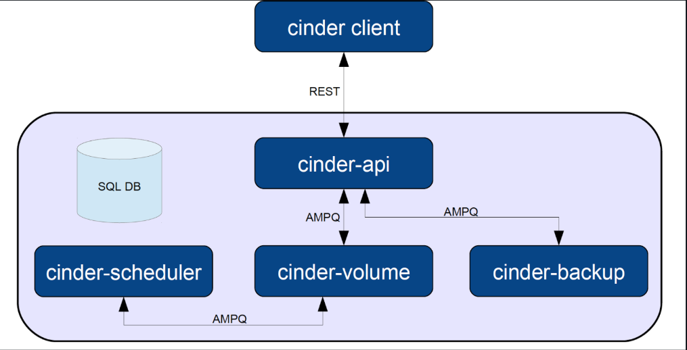

# TÌM HIỂU VỀ CLOUD-INIT

> **Phiên bản tham chiếu:** OpenStack 2026.1 (Gazpacho) | cloud-init 24.x  
> **Cập nhật lần cuối:** 2026-05-19

## MỤC LỤC

1. [Tổng quan về Cloud-Init](#i-tổng-quan-về-cloud-init)
2. [Luồng khởi động của Cloud-Init](#ii-luồng-khởi-động-của-cloud-init)
3. [DataSource trong Cloud-Init](#iii-datasource-trong-cloud-init)
4. [Cấu trúc thư mục Cloud-Init](#iv-cấu-trúc-thư-mục-cloud-init)
5. [File cấu hình /etc/cloud/cloud.cfg](#v-file-cấu-hình-etccloudcloudcfg)
6. [Cloud-Config – User Data YAML](#vi-cloud-config--user-data-yaml)
7. [Tích hợp Cloud-Init với OpenStack](#vii-tích-hợp-cloud-init-với-openstack)
8. [Debug và Troubleshooting](#viii-debug-và-troubleshooting)

## I. TỔNG QUAN VỀ CLOUD-INIT

### 1. Khái niệm

**Cloud-init** là công cụ chuẩn công nghiệp (`industry-standard`) dùng để **tự động cấu hình máy ảo (VM) ngay lần boot đầu tiên**. Nó được phát triển ban đầu bởi Canonical và hiện được hỗ trợ trên hầu hết các nền tảng cloud (OpenStack, AWS, GCP, Azure...) và các distro Linux phổ biến.

**Cloud-init thực hiện các tác vụ như:**

- Set hostname, locale, timezone
- Tạo user, inject SSH key
- Cài đặt package
- Ghi file cấu hình
- Chạy script tùy chỉnh
- Resize filesystem, cấu hình network

### 2. Các định dạng User-Data hỗ trợ

| Định dạng             | Dấu nhận biết                | Mô tả                            |
|-----------------------|------------------------------|----------------------------------|
| Cloud Config (YAML)   | `#cloud-config`              | Phổ biến nhất, khai báo cấu hình |
| Shell Script          | `#!/bin/bash` hoặc `#!`      | Chạy script bash/sh              |
| MIME Multipart        | `Content-Type: multipart/...`| Kết hợp nhiều loại               |
| Gzip Compressed       | Binary gzip                  | Nội dung nén gzip                |
| Cloud Boothook        | `#cloud-boothook`            | Chạy rất sớm, trước init         |
| Part Handler          | `#part-handler`              | Xử lý các loại content tùy chỉnh |

> **Thông dụng nhất:** `#cloud-config` **(.yaml)**

## II. LUỒNG KHỞI ĐỘNG CỦA CLOUD-INIT

Cloud-init chia quá trình boot thành **4 giai đoạn chính** (stages), mỗi stage tương ứng với một systemd service:



### Tương ứng systemd services

| Service                    | Stage   | Thời điểm       |
|----------------------------|---------|-----------------|
| `cloud-init-local.service` | Local   | Trước network   |
| `cloud-init.service`       | Network | Sau network up  |
| `cloud-config.service`     | Config  | Sau cloud-init  |
| `cloud-final.service`      | Final   | Gần cuối boot   |

### Các lần boot tiếp theo

- `cloud-init-local` vẫn chạy nhưng **detect đã có instance cũ**
- Module `per-once` **không chạy lại**
- Module `per-instance` chỉ chạy khi instance ID thay đổi
- **Chỉ** `scripts-per-boot` chạy mỗi lần boot

## III. DATASOURCE TRONG CLOUD-INIT

**DataSource** là nguồn cung cấp `meta-data` và `user-data` cho cloud-init. Cloud-init sẽ tự động phát hiện datasource phù hợp với môi trường đang chạy.

### 1. Các DataSource phổ biến trong OpenStack

| DataSource        | Label disk    | Mô tả                                                            |
|-------------------|---------------|------------------------------------------------------------------|
| **ConfigDrive**   | `config-2`    | **Mặc định cho OpenStack** – disk ảo được Nova gắn vào VM        |
| **OpenStack**     | HTTP          | Dùng metadata API `http://169.254.169.254`                       |
| **NoCloud**       | `cidata`      | Dùng cho test/bare-metal, không cần cloud platform               |
| **EC2**           | HTTP          | Tương thích với AWS metadata format                              |

### 2. ConfigDrive (ưu tiên trong OpenStack)

OpenStack Nova tạo một **disk ảo nhỏ** (ISO/vfat, label `config-2`) và gắn vào VM. Cloud-init mount disk này để đọc cấu hình.

**Cấu trúc ConfigDrive:**

```text
/dev/sdX  (label: config-2)
└── openstack/
    └── latest/
        ├── meta_data.json       # Instance ID, hostname, SSH keys
        ├── user_data            # User-data script/yaml
        ├── network_data.json    # Cấu hình network (Neutron/OVN)
        └── vendor_data.json     # Dữ liệu từ vendor/operator
```

**Bật ConfigDrive trong Nova** (`/etc/nova/nova.conf`):

```ini
[DEFAULT]
force_config_drive = True

# Hoặc theo từng instance khi tạo VM:
# openstack server create --config-drive True ...
```

### 3. OpenStack Metadata API

Nếu không dùng ConfigDrive, cloud-init sẽ gọi HTTP endpoint:

```text
http://169.254.169.254/openstack/latest/meta_data.json
http://169.254.169.254/openstack/latest/user_data
http://169.254.169.254/openstack/latest/network_data.json
```

### 4. Thứ tự ưu tiên DataSource

Cấu hình trong `/etc/cloud/cloud.cfg` hoặc `/etc/cloud/cloud.cfg.d/`:

```yaml
datasource_list:
  - ConfigDrive    # Ưu tiên 1 – dùng cho OpenStack
  - OpenStack      # Ưu tiên 2 – HTTP metadata
  - NoCloud        # Ưu tiên 3 – local/test
  - None           # Fallback
```

> **Best practice OpenStack 2026.1:** Luôn đặt `ConfigDrive` trước `OpenStack` để tăng tốc boot (tránh HTTP timeout).

## IV. CẤU TRÚC THƯ MỤC CLOUD-INIT

Cloud-init lưu trạng thái tại `/var/lib/cloud/`:

```text
/var/lib/cloud/
├── data/                        # Thông tin instance hiện tại
│   ├── instance-id              # ID instance đang chạy
│   ├── previous-instance-id     # ID instance lần trước
│   ├── datasource               # DataSource đang dùng
│   └── previous-hostname        # Hostname lần trước
│
├── instance -> instances/<id>/  # Symlink tới instance active
│
├── instances/
│   └── <instance-id>/
│       ├── boot-finished        # Dấu hiệu boot hoàn tất
│       ├── cloud-config.txt     # cloud-config đã xử lý
│       ├── user-data.txt        # User-data gốc
│       ├── user-data.txt.i      # User-data đã decode
│       ├── datasource           # DataSource đã detect
│       ├── obj.pkl              # State object (Python pickle)
│       ├── handlers/            # Part handlers
│       ├── scripts/             # Scripts đã xử lý
│       └── sem/                 # Semaphore – track module đã chạy
│
├── scripts/
│   ├── per-boot/                # Chạy mỗi lần boot
│   ├── per-instance/            # Chạy mỗi instance mới
│   └── per-once/                # Chỉ chạy 1 lần duy nhất
│
├── seed/                        # Dữ liệu seed (NoCloud)
└── sem/                         # Semaphore toàn cục
```

---

## V. FILE CẤU HÌNH `/etc/cloud/cloud.cfg`

File cấu hình chính của cloud-init, định nghĩa 3 nhóm module:

```yaml
# /etc/cloud/cloud.cfg

users:
  - default                          # Dùng user mặc định của distro

disable_root: true                   # Không cho login root trực tiếp
ssh_pwauth: false                    # Chỉ SSH bằng key, không dùng password

# Tùy chỉnh datasource (OpenStack 2026.1)
datasource_list:
  - ConfigDrive
  - OpenStack
  - NoCloud

# ─── MODULE 1: INIT (trước network) ───────────────────────
cloud_init_modules:
  - migrator           # Nâng cấp dữ liệu cloud-init cũ
  - bootcmd            # Lệnh chạy rất sớm (trước network)
  - write-files        # Ghi file từ user-data
  - growpart           # Mở rộng partition nếu disk lớn hơn image
  - resizefs           # Resize filesystem sau growpart
  - set_hostname       # Đặt hostname
  - update_hostname    # Cập nhật hostname
  - update_etc_hosts   # Cập nhật /etc/hosts
  - ca-certs           # Cài CA certificates (mới trong 24.x)
  - rsyslog            # Cấu hình logging
  - users-groups       # Tạo user / group
  - ssh                # Setup SSH, inject authorized_keys

# ─── MODULE 2: CONFIG (sau network) ───────────────────────
cloud_config_modules:
  - mounts             # Mount filesystem
  - locale             # Đặt locale
  - set-passwords      # Đặt password (nếu bật)
  - ntp                # Cấu hình NTP (thay thế cho timezone cũ)
  - timezone           # Đặt timezone
  - disable-ec2-metadata  # Tắt EC2 metadata nếu không dùng AWS
  - runcmd             # Chạy lệnh tùy chỉnh từ user-data

# ─── MODULE 3: FINAL (cuối boot) ──────────────────────────
cloud_final_modules:
  - package-update-upgrade-install  # Cài/update package
  - scripts-vendor    # Script từ vendor
  - scripts-per-once  # Chạy 1 lần duy nhất
  - scripts-per-boot  # Chạy mỗi lần boot
  - scripts-per-instance  # Chạy mỗi instance mới
  - scripts-user      # Script do user định nghĩa
  - ssh-authkey-fingerprints  # Log fingerprint SSH key
  - final-message     # Thông báo hoàn tất

# ─── THÔNG TIN HỆ THỐNG ───────────────────────────────────
system_info:
  default_user:
    name: ubuntu                     # Tên user mặc định (theo distro)
    lock_passwd: true                # Không login bằng password
    gecos: Cloud User
    groups: [sudo, adm, systemd-journal]
    sudo: ["ALL=(ALL) NOPASSWD:ALL"]
    shell: /bin/bash
  distro: ubuntu                     # debian / rhel / suse...
  paths:
    cloud_dir: /var/lib/cloud
    templates_dir: /etc/cloud/templates
  ssh_svcname: ssh                   # sshd trên RHEL-based
```

> **Drop-in config:** Nên dùng `/etc/cloud/cloud.cfg.d/*.cfg` thay vì sửa trực tiếp `cloud.cfg` để dễ quản lý.

## VI. CLOUD-CONFIG – USER DATA YAML

### 1. Cú pháp cơ bản

File cloud-config **bắt buộc** bắt đầu bằng `#cloud-config`:

```yaml
#cloud-config
# Dòng này BẮT BUỘC phải là dòng đầu tiên
```

### 2. Các directive phổ biến

#### a. Quản lý User

```yaml
#cloud-config
users:
  - name: devops
    gecos: "DevOps Engineer"
    groups: [sudo, docker, adm]
    shell: /bin/bash
    sudo: "ALL=(ALL) NOPASSWD:ALL"
    lock_passwd: false
    passwd: "$6$rounds=4096$..."     # Password hash (mkpasswd -m sha-512)
    ssh_authorized_keys:
      - ssh-rsa AAAAB3Nza... user@laptop
      - ssh-ed25519 AAAAC3Nz... user@desktop

  - name: readonly-user
    shell: /bin/bash
    sudo: false                       # Không có quyền sudo
```

#### b. Cài đặt Package

```yaml
#cloud-config
package_update: true          # apt update / yum makecache
package_upgrade: true         # apt upgrade / yum update
package_reboot_if_required: true  # Reboot nếu cần sau upgrade

packages:
  - nginx
  - git
  - python3-pip
  - [python3, "3.10.*"]       # Chỉ định version (apt)
```

#### c. Ghi File

```yaml
#cloud-config
write_files:
  - path: /etc/nginx/conf.d/app.conf
    owner: root:root
    permissions: "0644"
    content: |
      server {
          listen 80;
          server_name example.com;
          location / {
              proxy_pass http://localhost:8080;
          }
      }

  - path: /etc/environment
    append: true               # Thêm vào cuối file (không ghi đè)
    content: |
      APP_ENV=production
      LOG_LEVEL=info

  - path: /etc/ssl/my-cert.pem
    encoding: b64              # Nội dung base64
    content: <base64-encoded-cert>
    permissions: "0600"
```

#### d. Chạy lệnh (runcmd)

```yaml
#cloud-config
runcmd:
  - systemctl enable --now nginx
  - curl -fsSL https://get.docker.com | sh
  - usermod -aG docker devops
  - [sh, -c, "echo 'Done' > /tmp/cloud-init-done.txt"]
```

> **Lưu ý:** `runcmd` chạy ở stage **final**, sau khi đã cài package và ghi file.

#### e. Timezone & NTP

```yaml
#cloud-config
timezone: Asia/Ho_Chi_Minh

ntp:
  enabled: true
  servers:
    - 0.pool.ntp.org
    - 1.pool.ntp.org
  ntp_client: chrony           # systemd-timesyncd | ntp | chrony
```

#### f. Hostname

```yaml
#cloud-config
hostname: web-server-01
fqdn: web-server-01.example.com
manage_etc_hosts: true         # Tự cập nhật /etc/hosts
preserve_hostname: false       # Cho phép cloud-init ghi đè hostname
```

#### g. Bootcmd (chạy rất sớm)

```yaml
#cloud-config
bootcmd:
  - echo "nameserver 8.8.8.8" >> /etc/resolv.conf
  - modprobe overlay
```

> **Khác `runcmd`:** `bootcmd` chạy ở stage **init** (trước network), mỗi lần boot đều chạy.

#### h. Mount filesystem

```yaml
#cloud-config
mounts:
  - [/dev/vdb, /data, ext4, "defaults,nofail", "0", "2"]
  - [UUID=xxxx-xxxx, /backup, xfs, "defaults", "0", "0"]

mount_default_fields:
  - ~
  - ~
  - auto
  - "defaults,nofail"
  - "0"
  - "2"
```

#### i. CA Certificates (mới trong cloud-init 23+)

```yaml
#cloud-config
ca_certs:
  trusted:
    - |
      -----BEGIN CERTIFICATE-----
      MIIDXTCCAkWgAwIBAgIJAJC1HiIAZAiIMA0GCSqGSIb3DQEBCwUAMEUxCzAJ...
      -----END CERTIFICATE-----
```

### 3. Ví dụ hoàn chỉnh – Cấu hình Web Server

```yaml
#cloud-config

# Thông tin hệ thống
hostname: web-prod-01
timezone: Asia/Ho_Chi_Minh
manage_etc_hosts: true

# Cập nhật và cài package
package_update: true
package_upgrade: true
packages:
  - nginx
  - git
  - curl
  - htop
  - ufw

# Tạo user
users:
  - default
  - name: deploy
    groups: [sudo, www-data]
    shell: /bin/bash
    sudo: "ALL=(ALL) NOPASSWD:ALL"
    ssh_authorized_keys:
      - ssh-ed25519 AAAAC3Nz... deploy@ci-server

# Ghi file cấu hình
write_files:
  - path: /etc/nginx/sites-available/default
    content: |
      server {
          listen 80 default_server;
          root /var/www/html;
          index index.html;
      }

  - path: /etc/motd
    content: |
      ====================================
       Production Web Server - web-prod-01
       Managed by OpenStack + cloud-init
      ====================================

# Chạy lệnh sau cùng
runcmd:
  - ufw allow 22
  - ufw allow 80
  - ufw allow 443
  - ufw --force enable
  - systemctl enable --now nginx
  - echo "cloud-init setup completed" >> /var/log/setup.log

# NTP
ntp:
  enabled: true
  servers: [0.vn.pool.ntp.org, 1.vn.pool.ntp.org]
```

## VII. TÍCH HỢP CLOUD-INIT VỚI OPENSTACK

### 1. Truyền User-Data khi tạo VM

**Qua CLI (openstack-client):**

```bash
# Truyền file cloud-config
openstack server create \
  --image ubuntu-22.04 \
  --flavor m1.small \
  --network private-net \
  --user-data ./my-cloud-config.yaml \
  --key-name my-keypair \
  web-server-01

# Bật config-drive (khuyến nghị)
openstack server create \
  --config-drive true \
  --user-data ./my-cloud-config.yaml \
  web-server-01
```

**Qua Horizon Dashboard:**

```text
Compute → Instances → Launch Instance
→ Tab "Configuration"
→ Dán nội dung cloud-config vào ô "Customization Script"
→ Tick "Configuration Drive" nếu cần
```

### 2. Xác minh user-data đã truyền

```bash
# Từ bên trong VM
curl http://169.254.169.254/openstack/latest/user_data
curl http://169.254.169.254/openstack/latest/meta_data.json

# Hoặc dùng cloud-init CLI
cloud-init query userdata
cloud-init query ds                   # Xem datasource
cloud-init query instance-id
cloud-init query local-hostname
```

### 3. Luồng dữ liệu OpenStack → Cloud-init

```text
Nova API
  │
  ├── [ConfigDrive mode]
  │     Nova tạo ISO disk (config-2)
  │     → Gắn vào VM
  │     → cloud-init mount và đọc
  │
  └── [Metadata API mode]
        Nova → nova-metadata service
        → neutron-metadata-agent (qua router)
        → http://169.254.169.254
        → cloud-init fetch qua HTTP
```

### 4. Network Data (OpenStack 2026.1)

OpenStack truyền thông tin network qua `network_data.json` (chuẩn `network_config v1/v2`):

```json
{
  "links": [
    {"id": "tap-port-1", "type": "phy", "name": "eth0",
     "mtu": 1500, "mac_address": "fa:16:3e:xx:xx:xx"}
  ],
  "networks": [
    {"id": "network0", "type": "ipv4", "link": "tap-port-1",
     "ip_address": "192.168.1.100", "netmask": "255.255.255.0",
     "routes": [{"network": "0.0.0.0", "netmask": "0.0.0.0",
                 "gateway": "192.168.1.1"}],
     "dns_nameservers": ["8.8.8.8", "8.8.4.4"]}
  ],
  "services": [
    {"type": "dns", "address": "8.8.8.8"}
  ]
}
```

## VIII. DEBUG VÀ TROUBLESHOOTING

### 1. Log files quan trọng

| File                                 | Nội dung                                |
|--------------------------------------|-----------------------------------------|
| `/var/log/cloud-init.log`            | Log chi tiết toàn bộ quá trình          |
| `/var/log/cloud-init-output.log`     | stdout/stderr của các command           |
| `/run/cloud-init/result.json`        | Kết quả thành công/thất bại             |
| `/run/cloud-init/ds-identify.result` | Kết quả nhận diện datasource            |

### 2. Các lệnh cloud-init CLI hữu ích

```bash
# Xem trạng thái tổng quát
cloud-init status --long

# Xem user-data đang dùng
cloud-init query userdata

# Validate cú pháp file cloud-config
cloud-init schema --config-file my-config.yaml

# Xem toàn bộ instance data
cloud-init query --all

# Chạy lại cloud-init (development/debug)
cloud-init clean --logs
cloud-init init
cloud-init modules --mode config
cloud-init modules --mode final

# Xem datasource đã detect
cloud-init query ds
```

### 3. Kiểm tra semaphore (module đã chạy)

```bash
# Xem modules đã chạy (sem = semaphore)
ls /var/lib/cloud/instances/<instance-id>/sem/

# Xóa semaphore để chạy lại 1 module
rm /var/lib/cloud/instances/<instance-id>/sem/config_runcmd

# Xóa toàn bộ state để chạy lại từ đầu
cloud-init clean --logs --reboot
```

### 4. Các lỗi thường gặp

| Lỗi | Nguyên nhân | Giải pháp |
|-----|------------|-----------|
| `DataSource not found` | Cloud-init không detect được datasource | Kiểm tra ConfigDrive hoặc metadata service |
| `user-data not found` | Không truyền user-data khi tạo VM | Truyền `--user-data` hoặc check Horizon |
| YAML parse error | Sai cú pháp YAML (indent, tab...) | Dùng `cloud-init schema --config-file` |
| Module không chạy | Semaphore còn từ lần trước | Xóa sem file hoặc chạy `cloud-init clean` |
| Timeout khi fetch metadata | Neutron metadata agent lỗi | Kiểm tra `neutron-metadata-agent` service |
| SSH key không inject | `ssh_deletekeys` bị set sai | Kiểm tra `cloud.cfg` và user-data |

### 5. Validate cloud-config trước khi dùng

```bash
# Cài cloud-init local
sudo apt install cloud-init   # Ubuntu/Debian
sudo dnf install cloud-init   # RHEL/Rocky/AlmaLinux

# Validate
cloud-init schema --config-file my-cloud-config.yaml

# Output thành công:
# Valid cloud-config: my-cloud-config.yaml
```

---

## TÀI LIỆU THAM KHẢO

- [cloud-init Official Docs](https://cloudinit.readthedocs.io/en/latest/)
- [OpenStack User Guide – Provide user data](https://docs.openstack.org/nova/latest/user/user-data.html)
- [OpenStack ConfigDrive](https://docs.openstack.org/nova/latest/admin/config-drive.html)
- [cloud-init DataSources](https://cloudinit.readthedocs.io/en/latest/reference/datasources.html)

