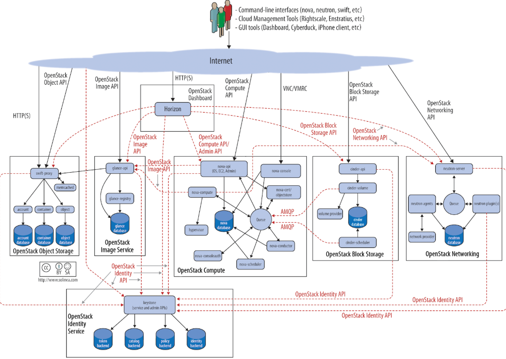
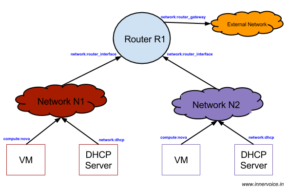
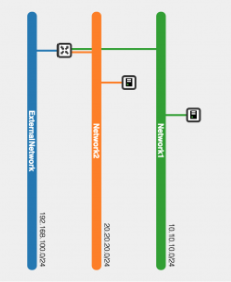

# TÌM HIỂU CHUNG NEUTRON

## I KHÁI NIỆM VÀ THÀNH PHẦN VỀ NEUTRON

### 1. Khái niệm

**OpenStack Networking** cho phép bạn tạo và quản lí các network objects ví dụ như network, subnets và ports cho các service khác của OpenStack sử dụng. Với kiến trúc plugable, các plug-in có thể được sử dụng đẻ triển khai các thiết bị và phần mềm khác nhau , nó khiến Open Stack có tính linh hoạt trong kiến trúc và triển khai.

**Dịch vụ Networking trong OpenStack (Neutron)** cung cấp API cho phép bạn định nghĩa các kết nối mạng và gán địa chỉ mạng ở trong môi trường Cloud . Nó cũng cho phép các nhà khai thác vận hành các công nghệ Networking khác phù hợp với mô hình điện toán đám mây của riêng họ. Neutron cũng cung cấp 1 API cho việc cấu hình cũng như quán lí các dịch vụ networking khác nhau từ L3 forwarding , NAT cho tới Load Balancing ,perimeter Firewall và Virtual Private Networks.

OpenStack Networking tương tác với các thành phần OpenStack khác:

- **OpenStack Identity service (keystone)**: xác thực và cấp quyền cho các API request
- **OpenStack Compute service (nova)**: sử dụng để gắn mỗi virtual NIC trên VM vào một mạng cụ thể
- **OpenStack Dashboard (horizon)**: sử dụng bởi người quản trị và tenant user để tạo và quản lý dịch vụ mạng thông qua giao diện đồ họa web



=> **Tổng kết**: **OpenStack Networking** cung cấp một hạ tầng thiết bị mạng ảo cho các virtual machine tương tự như các thiết bị mạng vật lý.

### 2. Các thành phần

- **API Server**: OpenStack Networking API hỗ trợ L2 Networking và Ip address management (IPAM-Quản lí địa chỉ IP), cũng như 1 extension để xây dựng Router Layer 3 cho phép định tuyến giữa các Networks Layer 2 và các Gateway đẻ ra mạng ngoài. OpenStack Networking cung cấp một danh sách các plugins (ngày 1 tăng) cho phép tương tác nhiều công nghệ mạng mã nguồn mở và cả thương mại, bao gồm các routers, switches, switch ảo và SDN controller.

- **OpenStack Networking plug-in and agents**: Các plugin và các agent này cho phép gắn và gỡ các ports, tạo ra network hay subnet, và đánh địa chỉ IP. Lựa chọn plugin và agents nào là tùy thuộc vào nhà cung cấp và công nghệ sử dụng trong hệ thống cloud nhất định. **Điều quan trọng là tại một thời điểm chỉ sử dụng được một plug-in.**

- **Messaging queue**: Tiếp nhận và định tuyến các RPC requests giữa các agents để hoàn thành quá trình vận hành API. Các Message queue được sử dụng trong ML2 plugin để thực hiện truyền thông RPC giữa neutron server và các neutron agents chạy trên mỗi hypervisor, cụ thể là các ML2 driver cho Open vSwitch và Linux bridge.

## II. CÁC LOẠI MẠNG TRONG NEUTRON

Với **Neutron**, bạn có thể tạo và cấu hình các **networks, subnets** và thông báo tới **Compute** để gán các thiết bị ảo vào các ports của mạng vừa tạo. OpenStack Compute chính là "khách hàng" của neutron, chúng liên kết với nhau để cung cấp kết nối mạng cho các máy ảo. Cụ thể hơn, OpenStack Networking hỗ trợ cho phép các projects có nhiều private networks và các projects có thể tự chọn danh sách IP cho riêng mình, kể cả những IP đã được sử dụng bởi một project khác. Có hai loại **Network** đó là **Project** và **Provider**.(Compute:)

### 1. Provider Networks

**Provider network** là: Mạng do admin tạo, map trực tiếp xuống hạ tầng vật lý. VM gắn vào **Provider network** sẽ “gần” với mạng thật.

**Provider networks** cung cấp kết nối layer 2 cho các máy ảo với các tùy chọn hỗ trợ cho dịch vụ DHCP và metadata. Các kết nối này thường sử dụng VLAN (802.1q) để nhận diện và tách biệt nhau.

Nhìn chung, **Provider networks** cũng cấp sự đơn giản, hiệu quả và sự minh bạch, linh hoạt trong chi phí. Mặc định chỉ có duy nhất người quản trị mới có thể tạo hoặc cập nhật **Provider Networks** bởi nó yêu cầu phải cấu hình thiết bị vật lí. Bạn cũng có thể thay đổi quyền cho phép user khác tạo hoặc update provider networks bằng cách thêm 2 câu sau vào file `policy.json`:

```text
create_network:provider:physical_network
update_network:provider:physical_network
```

Bên cạnh đó, **Provider networks** chỉ quản lí kết nối ở layer 2 cho máy ảo, vì thế nó thiếu đi một số tính năng ví dụ như định tuyến và gán floating IP.

Các nhà khai thác đã quen thuộc với kiến trúc mạng ảo dựa trên nền tảng mạng vật lí cho layer 2, layer 3 và các dịch vụ khác có thể dễ dàng triển khai OpenStack Networking service. **Provider networks** cũng khiến các nhà khai thác muốn chuyển từ **Compute networking service (nova-network)** sang **OpenStack Networking Service**.(`nova-network` là dịch vụ mạng tích hợp bên trong Nova thời OpenStack đời đầu)

Các dạng **Provider network**:

- Flat:

  - Không VLAN
  - Tất cả VM nằm chung 1 broadcast domain

- VLAN:

  - Mỗi network gắn 1 VLAN ID
  - Phân tách bằng VLAN vật lý

- GRE/VXLAN:

  - Triển khai mạng Overlay ra ngoài (**Overlay network** = mạng ảo chạy trên mạng vật lý - ví dụ VXLAN)

#### Sự khác nhau **Compute networking service (nova-network)** và **OpenStack Networking Service**

| So sánh      | Nova-network        | Neutron                |
| ------------ | ------------------- | ---------------------- |
| Vị trí       | Tích hợp trong Nova | Service riêng          |
| Kiến trúc    | Monolithic          | Modular (plugin-based) |
| Mở rộng      | Hạn chế             | Rất mạnh               |
| SDN support  | Không               | Có (OVS, VXLAN, GRE…)  |
| Multi-tenant | Cơ bản              | Chuẩn cloud            |
| Floating IP  | Có nhưng đơn giản   | Quản lý linh hoạt      |
| Hiện trạng   |  Bị loại bỏ         |  Chuẩn hiện tại        |
| Scale        | Hạn chế             | Lượng lớn VM (ngàn VM) |

Vì các thành phần chịu trách nhiệm cho việc vận hành kết nối layer 3 sẽ ảnh hưởng tới hiệu năng và tính tin cậy nên **Provider Networks** chuyển các kết nối này xuống tầng vật lí.

### 2. Self-Service Networks

**Self-service network** là: Mạng do user (project) tự tạo, được cách ly bằng overlay.Đây chính là tenant network.

**Self-service networks** được ưu tiên ở các projects thông thường để quản lí networks mà không cần quản trị viên (quản lí network trong project). Các networks này là ảo và nó yêu cầu các routers ảo để giao tiếp với provider và external networks. Self-service networks cũng đồng thời cung cấp dịch vụ DHCP và metadata cho máy ảo.

Trong hầu hết các trường hợp, **Self-service networks** sử dụng các giao thức như `VXLAN` hoặc `GRE` bởi chúng hỗ trợ nhiều hơn là `VLAN tagging (802.1q)`. Bên cạnh đó, Vlans cũng thường yêu cầu phải cấu hình thêm ở tầng vật lí.

Với IPv4, **Self-service networks** thường sử dụng dải mạng riêng và tương tác với **Provider networks** thông qua cơ chế NAT trên router ảo. Floating IP sẽ cho phép kết nối tới máy ảo thông qua địa chỉ NAT trên router ảo. Trong khi đó, **IPv6 self-service networks** thì lại sử dụng dải IP public và tương tác với **Provider networks** bằng giao thức định tuyến tĩnh qua router ảo.

Trái ngược lại với **Provider networks**, **Self-service networks** buộc phải đi qua Layer-3 agent. Vì thế việc gặp sự cố ở một node có thể ảnh hưởng tới rất nhiều các máy ảo sử dụng chúng.

Các user có thể tạo các **Project networks** cho các kết nối bên trong project. Mặc định thì các kết nối này là riêng biệt và không được chia sẻ giữa các project.

Mô hình hoạt động của Self-Service Network:

```text
VM A (Compute 1)  
   ↓  
OVS → VXLAN Tunnel ────────────┐  
                               │
                               | Physical Network  
                               │
OVS → VXLAN Tunnel ────────────┘  
   ↓  
VM B (Compute 2)  
```

=> Các VM khác tenant không nhìn thấy mạng này.

### 3. Phân biệt Provider vs Self-Service

| So sánh               | Provider Network | Self-Service Network |
| --------------------- | ---------------- | -------------------- |
| Tạo bởi               | Admin            | User                 |
| Map xuống mạng vật lý | Có               | Không trực tiếp      |
| Overlay               | Không bắt buộc   | Bắt buộc             |
| Cô lập multi-tenant   | VLAN level       | VXLAN level          |
| Dùng cho              | Public/external  | Private nội bộ       |
| Phức tạp              | Đơn giản         | Phức tạp hơn         |

### 4. Mô hình triển khai chuẩn trong thực tế

```text
                INTERNET
                    │
         ┌──────── Provider Net (VLAN) ────────┐
         │                                      │
    Router (Neutron L3)                    External GW
         │
   ┌───────────────┐
   │ Self-Service  │
   │ Tenant Net    │ (VXLAN)
   └───────────────┘
         │
        VM
```

-> Tenant network private
-> Router nối ra provider network
-> Floating IP map từ provider vào VM

## III. CÁC KHÁI NIỆM TRONG OpenStack Neutron

### 1. Routed Provider Networks

**Routed Provider Networks** cung cấp kết nối ở layer 3 cho các máy ảo. Các network này map với những networks layer 3 đã tồn tại. Cụ thể hơn, các layer-2 segments của **Provider Network** sẽ được gán các router gateway giúp chúng có thể được định tuyến ra bên ngoài chứ thực chất **Networking Service** không cung cấp khả năng định tuyến. **Routed provider networks** tất nhiên sẽ có hiệu suất thấp hơn so với **Provider Networks**.

### 2. Flat

- **Flat**: Tất cả các instances nằm trong cùng một mạng, và có thể chia sẻ với hosts. Không hề sử dụng VLAN tagging hay hình thức tách biệt về network khác.

### 3. VLAN

- **VLAN**: Kiểu này cho phép các users tạo nhiều provider hoặc Project network sử dụng VLAN IDs(chuẩn 802.1Q tagged) tương ứng với VLANs trong mạng vật lý. Điều này cho phép các instances giao tiếp với nhau trong môi trường cloud. Chúng có thể giao tiếp với servers, firewalls, load balancers vật lý và các hạ tầng network khác trên cùng một VLAN layer 2.

### 4. GRE và VXLAN

- **GRE and VXLAN**: `VXLAN` và `GRE` là các giao thức đóng gói tạo nên overlay networks để kích hoạt và kiểm soát việc truyền thông giữa các máy ảo (instances). Một router được yêu cầu để cho phép lưu lượng đi ra luồng bên ngoài tenant network `GRE` hoặc `VXLAN`. Router cũng có thể yêu cầu để kết nối một tenant network với mạng bên ngoài (ví dụ Internet). Router cung cấp khả năng kết nối tới instances trực tiếp từ mạng bên ngoài sử dụng các địa chỉ floating IP.

### 5. Tenant Network

- **Tenant Network**: Tenant network là mạng ảo riêng của từng project trong OpenStack, đảm bảo cách ly giữa các tenant. Ngoài ra còn có single tenant và multi tenant.

### 6. Subnets

Là một khối tập hợp các địa chỉ IP và đã được cấu hình. Quản lí các địa chỉ IP của subnet do IPAM thực hiện. Subnet được dùng để cấp phát các địa chỉ IP khi Ports mới được tạo trên Network.

### 7. Subnet pool

Người dùng cuối thông thường có thể tạo subnet với bất kì địa chỉ IP hợp lệ nào mà không bị hạn chế. Tuy nhiên, trong một vài trường hợp, sẽ là ổn hơn nếu như admin hoặc tenant định nghĩa trước pool các địa chỉ để từ đó tạo ra các subnets được cấp phát tự động. Sử dụng subnets pools sẽ ràng buộc những địa chỉ nào có thể được sử dụng bằng cách định nghĩa rằng mỗi subnet phải nằm trong một pool được định nghĩa trước. Điều đó ngăn chặn việc tái sử dụng IP hoặc chồng lẫn hai subnets trong cùng 1 pool.

### 8. Ports in OpenStack Neutron

=> Là điểm kết nối để attach một thiết bị như card mạng của máy ảo tới mạng ảo. Port cũng được cấu hình các thông tin như địa chỉ MAC, địa chỉ IP để sử dụng port đó.

**OpenStack** hỗ trợ trừu tượng phong phú để xử lý nhu cầu mạng ảo hóa trong cloud. Với một người dùng, đối tượng dễ thấy nhất là các network, subnet, router, firewall,... Nhưng nếu xem xét điểm vào và ra của lưu lượng dữ liệu, đối tượng quan trọng nhất là Port. OpenStack Neutron Port thường được tạo tự động như một phần của hoạt động người dùng. Tuy nhiên, CLI cũng cho phép người dùng tạo các Port một các độc lập.

**Port** đại diện cho điểm xuất nhập data trafic và các cấu hình liên quan như interface và địa chỉ IP. Chúng đóng một vai trò quan trọng trong OpenStack networking.

Các loại port trong OpenStack:



Trong hình trên, chúng ta có 2 **Tenant Network**, mỗi network có 1 máy ảo và 1 DHCP server. Hai Network được kết nối với nhau qua một **Tenant Router**. Thêm nữa, chúng ta sẽ sử dụng một **External Network** và thiết lập nó như gateway trên Tenant Router cho các máy ảo truy nhập Internet. Topology đúng của OpenStack Network nhìn như sau:



- Để xem loại port trong cấu hình OpenStack, bao gồm cả các thuộc tính "device_owner" của port bằng lệnh sau:


- `compute:nova`: chỉ ra rằng port được gán cho máy ảo. Các port này được tạo tự động như một phần của máy ảo (thông qua nova). Phần "compute" chỉ ra rằng port được tạo trên compute node.

- `network:dhcp` chỉ ra port được gán cho DHCP server. Từ "network" ngụ ý rằng, port này được tạo trên Netwok node. Port DHCP được tạo khi máy ảo đầu tiên được tạo trên mạng tương ứng.

- `network:router_interface` miêu tả "gateway" IP interface cho một tenant network và máy ảo của nó. Interface này được kết hợp với một OpenStack router (namespace). Các port loại này được tạo khi người dùng thực hiện "Add interface" trên Router. Bạn sẽ nhìn thấy nhiều "network:router_interface" port - một trong những network ở ví dụ. Thêm một lần nữa, port loại này được nhìn thấy tại Network Node.

- `network:router_gateway`: với một Router, External Network miêu tả "gateway" đi ra mạng ngoài (internet). Một port cụ thể loại "network:router_gateway" được tạo ở đây. Port này được tạo khi người dùng thực hiện "Set Gateway" trên một Router và Port này trên Network Node.

### 9. Router

Cung cấp các dịch vụ Layer 3 ví dụ như định tuyến, NAT giữa các self service và provider network hoặc giữa các self service với nhau trong cùng 1 project

### 10. Security Groups

Một **Security Group** được coi như một firewall ảo cho các máy ảo để kiểm soát lưu lượng bên trong và bên ngoài router. **Security Groups** hoạt động ở mức ports, không phải ở mức subnet. Do đó, mỗi ports trên một subnet có thể được gán với một tập hợp các security groups riêng. Nếu không chỉ định group cụ thể nào khi vận hành , máy ảo sẽ được gán tự động với **Default Security Group** của project. Mặc định, group này sẽ huỷ tất cả các lưu lượng vào và cho phép lưu ra ngoài. Các rule có thể được bổ sung để thay đổi hành vi đó. Security Group và các **Security Group Rule** cho phép người quản trị và các tenant chỉ định loại traffic và hướng (ingress/egress) cho phép đi qua các port. Một **Security group** là một container của các **Security Group Rules**.

Các rule trong **Security Groups** phụ thuộc vào nhau. Vì thế, nếu bạn cho phép inbound TCP port 22, hệ thống sẽ tự tạo ra 1 rule cho phép outbound traffic trả lại Và **ICMP error messages** liên quan tới các kết nối TCP vừa được tạo rules.

Mặc định, mọi **Security Groups** chứa các rules thực hiện 1 số hành động sau:

- Cho phép traffic ra bên ngoài chỉ khi nó sử dụng địa chỉ MAC và IP của port máy ảo, cả hai địa chỉ này được kết hợp tại `allowed-address-pairs`.
- Cho phép tín hiệu tìm kiếm **DHCP** và gửi **Message request** sử dụng MAC của port cho máy ảo và địa chỉ IP chưa xác định.
- Cho phép trả lời các tín hiệu **DHCP** và **DHCPv6** từ DHCP server để các máy ảo có thể lấy IP.
- Từ chối việc trả lời các tín hiệu **DHCP request** từ bên ngoài để tránh việc máy ảo trở thành DHCP server.
- Cho phép các tín hiệu inbound/outbound **ICMPv6 MLD**, tìm kiếm neighbors, các máy ảo nhờ vậy có thể tìm kiếm và gia nhập các **Multicast group**.
- Từ chối các tín hiệu outbound **ICMPv6** để ngăn việc máy ảo trở thành IPv6 router và forward các tín hiệu cho máy ảo khác.
- Cho phép tín hiệu outbound **non-IP** từ địa chỉ MAC của các port trên máy ảo .

Mặc dù cho phép **Non-IP traffic** nhưng **Security Groups** không cho phép các **ARP traffic**. Có một số rules để lọc các tín hiệu ARP nhằm ngăn chặn việc sử dụng nó để chặn tín hiệu tới máy ảo khác. Bạn không thể xóa hoặc vô hiệu hóa những rule này. Bạn có thể hủy security groups bằng các sửa giá trị dòng `port_security_enabled` thành `False`.

### 11. Extensions

**OpenStack Networking Service** có khả năng mở rộng. Có hai mục đích chính cho việc này: cho phép thực thi các tính năng mới trên API mà không cần phải đợi đến khi ra bản tiếp theo và cho phép các nhà phân phối bổ sung những chức năng phù hợp. Các ứng dụng có lấy danh sách các extensions có sẵn sử dụng phương thức GET trên /extensions URI. Chú ý đây là một request phụ thuộc vào phiên bản OpenStack, một extension trong một API ở phiên bản này có thể không sử dụng được cho phiên bản khác.

### 12. DHCP

Dịch vụ tùy chọn DHCP quản lí địa chỉ IP trên **provider** và **Self-service networks**. Networking service triển khai DHCP service sử dụng agent quản lí **qdhcp namespaces** và **dnsmasq service**.

### 13. Metadata

Dịch vụ tùy chọn cung cấp API cho máy ảo để lấy metadata ví dụ như SSH keys.

### 14. Open vSwitch

**OpenvSwitch (OVS)** là công nghệ switch ảo hỗ trợ **SDN (Software-Defined Network)**, thay thế Linux bridge. OVS cung cấp chuyển mạch trong mạng ảo hỗ trợ các tiêu chuẩn Netflow, OpenFlow, sFlow. OpenvSwitch cũng được tích hợp với các switch vật lý sử dụng các tính năng lớp 2 như STP, LACP, 802.1Q VLAN tagging. OVS tunneling cũng được hỗ trợ để triển khai các mô hình network overlay như `VXLAN`, `GRE`.

### 15. Services

Các dịch vụ Routing

- `VPNaaS`: Virtual Private Network-as-a-Service (VPNaaS), extension của neutron cho VPN
- `LBaaS`: Load-Balancer-as-a-Service (LBaaS), API quy định và cấu hình nên các load balancers, được triển khai dựa trên HAProxy software load balancer.
- `FWaaS`: Firewall-as-a-Service (FWaaS), API thử nghiệm cho phép các nhà cung cấp kiểm thử trên networking của họ.

### 16. Neutron Plugin trong OpenStack

Networking trong OpenStack (cho các VM) thì tương tự với networking trong thế giới thật. VM khởi tạo yêu cầu tối thiểu kết nối Layer2 (L2) network. Thêm nữa, khởi tạo có thể yêu cầu dịch vụ routing, firewall và load-balancing. Các công nghệ và dịch vụ mạng này có thể thực thi sử dụng kết hợp với phần mềm và phần cứng mạng.

### ML2 - the most important core plugin

ML2 hay Modular Layer 2 plugin được gói lại với OpenStack. Nó là important core plugin bởi vì nó hỗ trợ nhiều công nghệ L2. Quan trọng hơn, ML2 plugin cho phép nhiểu công nghệ của nhiều nhà cung cấp cùng tồn tại.

ML2 plugin hỗ trợ nhiều công nghệ Layer2 như VLAN, VXLAN, GRE,... Các công nghệ này được nhắc đến như Type drivers.

### 17. Neutron Agent trong OpenStack

Trong khi Neutron server đóng vai trò như controller tập trung, câu lệnh liên quan tới mạng thực tế và cấu hình được thực thi trên Compute và Network node. Và các agent là các thực thể thực thi thay đổi mạng thực tế trên các node đó. Các agent nhận tin nhắn và chỉ dẫn từ Neutron server (thông qua plugin hoặc trực tiếp) trên message bus.

Hình dưới chỉ ra một cái nhìn đơn giản tương tác của plugin và agent với các thành phần trong OpenStack Networking

Ví dụ: Open vSwitch (OVS) Plugin and Agent:


=> Trong hình trên, Neutron nhận một **API request** (thông qua điều khiển trên Horizon hay CLI). **API server** gọi đến **ML2 plugin** để xử lý request. **ML2 plugin đã tải OVS mechanism driver** và **chuyển tiếp yêu cầu** liên quan tới **OVS driver**. **OVS driver** tạo một **RPC message** sử dụng các thông tin có sẵn trong request. **RPC message** là cast tới một **OVS agent** cụ thể chạy trên **Compute node**. **OVS agent** này nhận **RPC message** và thực hiện cấu hình khởi tạo trên **Local OVS switch**.

