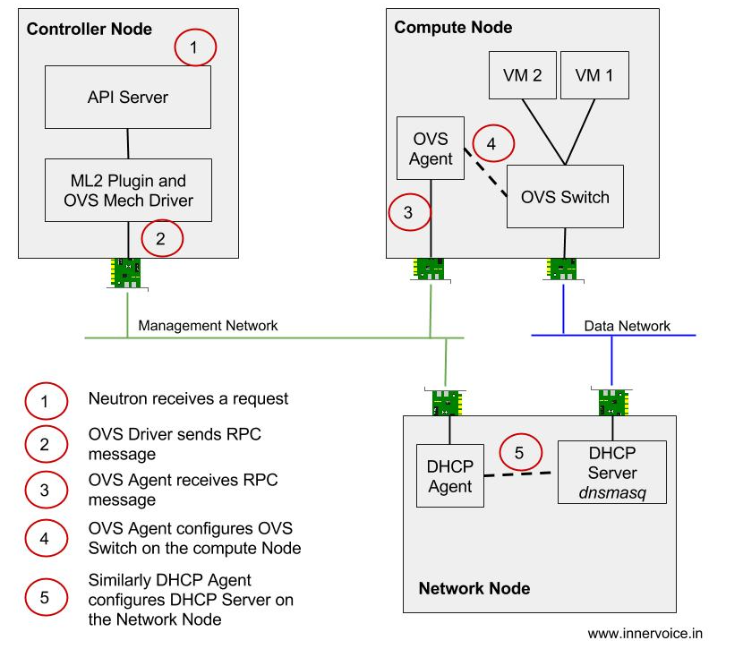

# TÌM HIỂU TỔNG QUAN OPENSTACK NEUTRON

> Tài liệu này tổng hợp và cập nhật theo OpenStack 2026.1 Gazpacho, là bản OpenStack stable mới nhất tại thời điểm viết. Trong release này, Neutron thuộc nhánh 28.x. OpenStack 2026.2 Hibiscus đã tồn tại ở trạng thái development nhưng chưa phải bản stable để triển khai production.

## I. Neutron là gì?

**OpenStack Neutron** là dịch vụ Networking của OpenStack. Neutron cung cấp API để tạo, quản lý và gắn các tài nguyên mạng ảo như **network**, **subnet**, **port**, **router**, **floating IP**, **security group** cho máy ảo và các dịch vụ khác trong cloud.

Nói ngắn gọn:

- Nova quản lý vòng đời máy ảo.
- Glance quản lý image.
- Cinder quản lý block storage.
- Keystone quản lý identity và phân quyền.
- **Neutron quản lý kết nối mạng cho workload.**

Neutron không chỉ tạo ra một card mạng ảo cho VM. Nó còn mô hình hóa gần như đầy đủ các khái niệm mạng thường gặp trong data center: switch, subnet, router, NAT, firewall rule, DHCP, metadata, QoS, trunk VLAN, provider network, overlay network và tích hợp với các backend như Open vSwitch, OVN, SR-IOV, Macvtap hoặc SDN controller/vendor driver.


### 1. Vai trò chính của Neutron

Neutron giải quyết các vấn đề sau trong OpenStack:

- **Cấp mạng cho VM**: VM khi boot cần một hoặc nhiều vNIC. Nova gọi Neutron để tạo hoặc gắn port tương ứng vào network.
- **Tách biệt tenant/project**: mỗi project có thể có mạng riêng, subnet riêng, IP riêng, không nhìn thấy mạng của project khác nếu không được cấu hình chia sẻ.
- **Kết nối ra ngoài**: VM có thể đi ra Internet hoặc mạng vật lý qua router ảo, SNAT, floating IP hoặc provider network.
- **Áp chính sách bảo mật**: security group, port security, allowed address pairs, RBAC, quota.
- **Tích hợp nhiều công nghệ mạng**: cùng API Neutron nhưng backend có thể là OVS, OVN, SR-IOV, DPDK, hardware offload hoặc SDN controller.
- **Tự động hóa network**: network được tạo/xóa/cập nhật qua API, CLI, Horizon, Terraform, Heat, SDK hoặc service khác.

### 2. Neutron khác gì so với mạng truyền thống?

Trong data center truyền thống, admin thường cấu hình switch, VLAN, router, firewall bằng tay. Trong OpenStack, các thao tác đó được biểu diễn thành resource và API:

| Mạng truyền thống | Neutron |
| --- | --- |
| VLAN, switch vật lý | Network, provider network, segment |
| IP subnet | Subnet |
| Cổng switch/NIC | Port |
| Router vật lý | Router ảo hoặc OVN logical router |
| NAT/Floating IP | SNAT, DNAT, floating IP |
| Firewall rule | Security group rule |
| DHCP server | DHCP agent hoặc DHCP native của OVN |
| ACL/QoS | Security group, QoS policy |

Điểm quan trọng là Neutron không bắt buộc phải thay thế toàn bộ mạng vật lý. Neutron thường chạy song song với mạng vật lý: phần vật lý cung cấp underlay, còn Neutron cung cấp lớp network ảo và policy cho cloud.

## II. Phiên bản OpenStack mới nhất và điểm cần chú ý

Tại thời điểm cập nhật tài liệu này:

- **OpenStack stable mới nhất**: `2026.1 Gazpacho`
- **Thời điểm phát hành**: tháng 04/2026
- **Neutron trong Gazpacho**: nhánh `28.x`, deliverable release `28.0.0`
- **OpenStack kế tiếp**: `2026.2 Hibiscus`, đang development, chưa phải release stable

Các điểm hiện đại cần nhớ khi đọc tài liệu Neutron:

- **ML2 vẫn là core plugin quan trọng nhất** trong Neutron.
- **OVN là lựa chọn backend phổ biến trong các triển khai mới** vì nó cung cấp nhiều chức năng phân tán như L2 switching, L3 routing, DHCP, DNS, port forwarding, packet logging.
- **ML2/OVS vẫn được hỗ trợ** và vẫn xuất hiện ở nhiều môi trường production.
- **Linux Bridge không còn là hướng nên chọn cho triển khai mới**. Các tài liệu/triển khai cũ có thể vẫn nhắc tới Linux Bridge, nhưng xu hướng hiện tại là OVS hoặc OVN.
- **LBaaS không còn là dịch vụ chính trong Neutron**. Load Balancer hiện đại trong OpenStack là **Octavia**.
- **FWaaS/VPNaaS là service plugin/tách riêng**, không nên hiểu là mọi môi trường Neutron mặc định đều bật các dịch vụ này.

## III. Neutron tương tác với các dịch vụ OpenStack khác

Neutron không chạy độc lập một mình trong thực tế. Nó phối hợp với nhiều service khác:

| Service | Vai trò với Neutron |
| --- | --- |
| Keystone | Xác thực, phân quyền API request, policy, role |
| Nova | Gọi Neutron để tạo/gắn vNIC port cho VM |
| Horizon | Giao diện web để user/admin tạo network, subnet, router, security group |
| Placement | Có thể phối hợp khi dùng QoS minimum bandwidth, SR-IOV hoặc resource provider |
| Designate | DNS integration cho record của port/VM |
| Octavia | Cung cấp Load Balancer-as-a-Service hiện đại, dùng network/port của Neutron |
| Ironic | Bare metal node có thể dùng port/network do Neutron quản lý |
| Heat/Terraform/SDK | Tự động hóa tạo network topology |

Luồng cơ bản khi tạo VM:

```text
User / Horizon / CLI
        |
        v
Nova API nhận yêu cầu boot VM
        |
        v
Nova gọi Neutron API để tạo/gắn port
        |
        v
Neutron cấp MAC/IP, security group, binding info
        |
        v
Backend network cấu hình datapath trên compute node
        |
        v
VM boot với vNIC đã nối vào network
```

## IV. Kiến trúc tổng quan của Neutron

Neutron có thể nhìn theo hai lớp:

- **Control plane**: API, database, message queue, plugin, scheduler, policy.
- **Data plane**: OVS bridge, OVN logical switch/router, Linux namespace, tap/veth, VLAN, VXLAN/Geneve tunnel, SR-IOV VF, router/NAT path.

### 1. Các thành phần chính

| Thành phần | Chức năng |
| --- | --- |
| `neutron-server` | Nhận API request, xác thực qua Keystone, gọi plugin phù hợp, ghi state vào database |
| Database | Lưu trạng thái network, subnet, port, router, IP allocation, security group, binding |
| Message queue | Truyền RPC giữa neutron-server và agent trong mô hình dùng agent |
| ML2 plugin | Core plugin phổ biến nhất, hỗ trợ nhiều type driver và mechanism driver |
| Type driver | Định nghĩa network được hiện thực bằng công nghệ nào: flat, VLAN, VXLAN, GRE, Geneve |
| Mechanism driver | Định nghĩa cách cấu hình network xuống backend: OVS, OVN, SR-IOV, Macvtap, vendor driver |
| L2 agent | Cấu hình switching/tunnel trên node, ví dụ OVS agent |
| L3 agent | Cung cấp router, SNAT/DNAT, floating IP trong mô hình truyền thống |
| DHCP agent | Chạy DHCP service, thường dùng `dnsmasq`, cấp IP cho VM |
| Metadata agent | Proxy metadata request từ VM tới Nova metadata API |
| OVN controller/agent | Cấu hình datapath OVN/OVS theo logical network state |

### 2. Mô hình truyền thống với ML2/OVS

Trong mô hình ML2/OVS truyền thống:

- `neutron-server` chạy trên controller node.
- ML2 plugin xử lý API.
- OVS mechanism driver tạo thông tin binding.
- OVS agent chạy trên compute/network node để cấu hình `br-int`, `br-tun`, `br-ex`.
- DHCP agent tạo namespace `qdhcp-*` và chạy `dnsmasq`.
- L3 agent tạo namespace `qrouter-*`, cấu hình router, NAT, floating IP.
- Metadata agent xử lý metadata qua địa chỉ `169.254.169.254`.

Ví dụ tương tác OVS agent:



Luồng xử lý đơn giản:

```text
API request
   |
   v
neutron-server
   |
   v
ML2 plugin
   |
   v
OVS mechanism driver
   |
   v
RPC message
   |
   v
OVS agent trên compute node
   |
   v
Open vSwitch local bridge
```

### 3. Mô hình hiện đại với ML2/OVN

Trong mô hình ML2/OVN:

- Neutron dùng ML2 plugin với OVN mechanism driver.
- OVN Northbound DB lưu logical switch, logical router, ACL, NAT.
- OVN Southbound DB chứa binding và thông tin chassis.
- `ovn-controller` trên compute node đọc Southbound DB và cấu hình flow xuống Open vSwitch.
- Nhiều chức năng không cần agent truyền thống nữa, ví dụ L2 switching, L3 routing, DHCP native, distributed routing.

Mô hình khái quát:

```text
Neutron API
    |
    v
ML2/OVN driver
    |
    v
OVN Northbound DB
    |
    v
OVN Northd
    |
    v
OVN Southbound DB
    |
    v
ovn-controller trên từng node
    |
    v
Open vSwitch datapath
```

OVN có lợi thế lớn ở môi trường nhiều compute node vì nhiều chức năng được phân tán, giảm phụ thuộc vào network node tập trung.

## V. Các object quan trọng trong Neutron

### 1. Network

**Network** là broadcast domain/logical switch trong Neutron. VM không gắn trực tiếp vào subnet, mà gắn vào **port** trên **network**.

Có các loại network thường gặp:

- **Provider network**: map trực tiếp xuống mạng vật lý.
- **Self-service/project network**: mạng riêng do project tạo, thường dùng overlay.
- **External network**: provider network được đánh dấu `--external`, dùng làm gateway cho router hoặc cấp floating IP.
- **Shared network**: network được chia sẻ qua RBAC cho project khác.
- **Routed provider network**: một network đại diện nhiều L2 segment có routing ở hạ tầng vật lý.

### 2. Subnet

**Subnet** là dải IP gắn với một network. Subnet định nghĩa:

- CIDR, ví dụ `192.168.10.0/24`
- Gateway IP
- DHCP bật/tắt
- Allocation pool
- DNS nameserver
- Host route
- IPv4/IPv6 mode

Một network có thể có nhiều subnet, ví dụ một subnet IPv4 và một subnet IPv6.

### 3. Subnet pool

**Subnet pool** là pool địa chỉ được định nghĩa trước để user/project tạo subnet trong phạm vi cho phép.

Ví dụ admin tạo pool `10.10.0.0/16`, project có thể xin subnet `/24` từ pool đó:

```bash
openstack subnet pool create private-pool \
  --pool-prefix 10.10.0.0/16 \
  --default-prefix-length 24
```

Lợi ích:

- Tránh trùng CIDR giữa nhiều project.
- Chuẩn hóa cách cấp IP.
- Hữu ích khi cần route giữa nhiều tenant hoặc integrate với mạng ngoài.

### 4. Port

**Port** là điểm kết nối vào network. Đây là object rất quan trọng trong Neutron.

Một port thường chứa:

- MAC address
- Fixed IP
- Network ID
- Subnet ID
- Security group
- Port security
- Device owner
- Device ID
- Binding host
- Binding profile
- Allowed address pairs

Ví dụ một VM có một vNIC thì sẽ có một Neutron port tương ứng. Khi VM có nhiều NIC, nó sẽ có nhiều port.

Các `device_owner` thường gặp:

| Device owner | Ý nghĩa |
| --- | --- |
| `compute:nova` | Port gắn với VM do Nova quản lý |
| `network:dhcp` | Port của DHCP service |
| `network:router_interface` | Interface router nối vào internal network |
| `network:router_gateway` | Gateway router nối ra external network |
| `network:floatingip` | Port/liên kết phục vụ floating IP |
| `network:distributed` | Port dùng trong DVR hoặc backend phân tán |
| `network:ha_router_replicated_interface` | Interface phục vụ L3 HA |

Topology port minh họa:


Kiểm tra port:

```bash
openstack port list
openstack port show <port-id>
openstack port list --server <server-id>
```

### 5. Router

**Router** trong Neutron cung cấp kết nối Layer 3 giữa các subnet/network.

Router thường làm các việc:

- Route giữa các self-service network.
- Làm gateway ra external/provider network.
- SNAT để VM private IP đi ra ngoài.
- DNAT/floating IP để bên ngoài truy cập VM.

Mô hình router cơ bản:

```text
External Provider Network
          |
          | router gateway
          v
   Neutron Router
      |       |
      |       |
 internal  internal
 network A network B
      |       |
     VM      VM
```

Trong ML2/OVS truyền thống, router thường được hiện thực bằng Linux network namespace trên network node hoặc compute node nếu dùng DVR. Trong OVN, logical router được OVN hiện thực phân tán hơn.

### 6. Floating IP

**Floating IP** là địa chỉ IP lấy từ external network và NAT vào fixed IP của port VM.

Fixed IP dùng trong mạng nội bộ tenant:

```text
VM: 10.0.0.10
```

Floating IP dùng để truy cập từ ngoài:

```text
Floating IP: 203.0.113.25 -> 10.0.0.10
```

Các lệnh thường dùng:

```bash
openstack floating ip create public
openstack server add floating ip vm01 203.0.113.25
openstack floating ip list
```

### 7. Security group

**Security group** là firewall rule set áp ở mức port. Nó không áp ở mức subnet.

Đặc điểm:

- Rule theo hướng `ingress` hoặc `egress`.
- Rule theo protocol, port range, remote IP hoặc remote security group.
- Một port có thể gắn nhiều security group.
- Nếu không chỉ định, port thường được gắn security group `default`.
- Mặc định thường cho phép egress và chặn ingress, trừ khi cloud operator thay đổi default rule.

Ví dụ cho phép SSH:

```bash
openstack security group rule create default \
  --protocol tcp \
  --dst-port 22 \
  --remote-ip 0.0.0.0/0
```

Cần phân biệt:

- **Security group**: firewall stateful cho port.
- **Port security**: cơ chế chống spoofing MAC/IP và bật/tắt security group trên port.
- **Allowed address pairs**: cho phép port dùng thêm IP/MAC ngoài fixed IP, thường dùng cho VRRP, load balancer, HA.

### 8. QoS policy

**Quality of Service (QoS)** cho phép áp chính sách băng thông lên port hoặc network.

Các rule hay gặp:

- Giới hạn băng thông egress/ingress.
- DSCP marking.
- Minimum bandwidth.
- Minimum packet rate.

Ví dụ:

```bash
openstack network qos policy create qos-limit
openstack network qos rule create qos-limit \
  --type bandwidth-limit \
  --max-kbps 100000 \
  --max-burst-kbits 10000
openstack port set --qos-policy qos-limit <port-id>
```

### 9. Trunk port

**Trunk** cho phép một VM nhận nhiều VLAN qua một parent port. Đây là mô hình hữu ích cho NFV, firewall ảo, router ảo, appliance hoặc VM cần nhiều mạng phía trong.

Khái niệm:

- **Parent port**: port chính gắn vào VM.
- **Subport**: port con đi kèm VLAN tag.
- VM cần tự xử lý VLAN bên trong OS.

### 10. RBAC

**Role-Based Access Control (RBAC)** trong Neutron dùng để chia sẻ resource giữa project, ví dụ shared network.

Ví dụ use case:

- Admin tạo một provider/shared network.
- Cho nhiều project cùng attach VM vào network đó.
- Giới hạn project nào được quyền sử dụng.

### 11. Availability Zone

Neutron có thể dùng **Availability Zone** để gom nhóm network agent hoặc gateway node. Điều này hữu ích khi muốn router/DHCP được schedule theo vùng hạ tầng cụ thể.

## VI. Các loại network trong Neutron

### 1. Provider network

**Provider network** là network do admin/operator tạo và map trực tiếp xuống hạ tầng mạng vật lý.

Ví dụ:

- Flat network gắn với bridge `br-ex`.
- VLAN network gắn với VLAN ID trên trunk vật lý.
- External network để cấp floating IP.

Đặc điểm:

- Thường do admin tạo.
- Có mapping tới `physical_network`.
- Dùng tốt cho public/external network hoặc workload cần nằm trực tiếp trên VLAN vật lý.
- Đơn giản, ít overhead hơn overlay.
- Phụ thuộc nhiều vào thiết kế mạng vật lý.

Ví dụ tạo provider VLAN network:

```bash
openstack network create provider-vlan100 \
  --provider-network-type vlan \
  --provider-physical-network physnet1 \
  --provider-segment 100

openstack subnet create provider-vlan100-subnet \
  --network provider-vlan100 \
  --subnet-range 192.168.100.0/24 \
  --gateway 192.168.100.1
```

Ví dụ tạo external network:

```bash
openstack network create public \
  --external \
  --provider-network-type flat \
  --provider-physical-network physnet1
```

### 2. Self-service network / project network / tenant network

**Self-service network** là network do project/user tự tạo trong phạm vi quota và policy cho phép. Đây cũng thường được gọi là **project network** hoặc **tenant network**.

Đặc điểm:

- User tự tạo được mà không cần admin cấu hình VLAN vật lý cho từng mạng.
- Thường dùng overlay như VXLAN hoặc Geneve.
- Mỗi project có thể có CIDR riêng, thậm chí trùng với project khác vì đã được cô lập.
- Muốn ra ngoài thường cần Neutron router nối tới external network.
- Phù hợp cloud multi-tenant.

Mô hình self-service network:

```text
VM A (Compute 1)
   |
   v
OVS/OVN local datapath
   |
   v
VXLAN/Geneve tunnel qua physical underlay
   |
   v
OVS/OVN local datapath
   |
   v
VM B (Compute 2)
```

Ví dụ tạo self-service network:

```bash
openstack network create private

openstack subnet create private-subnet \
  --network private \
  --subnet-range 10.0.0.0/24 \
  --gateway 10.0.0.1 \
  --dns-nameserver 8.8.8.8

openstack router create router1
openstack router add subnet router1 private-subnet
openstack router set router1 --external-gateway public
```

### 3. External network

**External network** là provider network được đánh dấu `router:external=True`. Nó là điểm nối từ router ảo ra mạng ngoài.

External network thường dùng để:

- Cấp floating IP.
- Làm gateway cho Neutron router.
- Kết nối cloud ra Internet, mạng campus hoặc mạng DC bên ngoài.

Không phải mọi provider network đều là external network. Một provider VLAN có thể chỉ dùng nội bộ, không cấp floating IP.

### 4. Shared network

**Shared network** là network được chia sẻ cho nhiều project. Nó có thể là provider network hoặc network thường, tùy policy và RBAC.

Use case:

- Mạng quản trị chung.
- Mạng backup chung.
- Mạng service chung.
- Mạng public cho nhiều project.

### 5. Routed provider network

**Routed provider network** cho phép một Neutron network đại diện cho nhiều L2 segment khác nhau. Mỗi segment có subnet riêng và routing giữa các segment do hạ tầng vật lý xử lý.

Vấn đề mà routed provider network giải quyết:

- Một L2 network rất lớn thì khó scale và failure domain rộng.
- Nhiều L2 network nhỏ thì user phải tự chọn đúng network.
- Routed provider network cho phép operator trình bày một network logic duy nhất, còn Neutron biết compute node nào thuộc segment nào.

Mô hình:

```text
Provider Network: provider-routed
   |
   |-- Segment A: VLAN 101, subnet 10.10.1.0/24, compute rack A
   |
   |-- Segment B: VLAN 102, subnet 10.10.2.0/24, compute rack B
   |
   |-- Segment C: VLAN 103, subnet 10.10.3.0/24, compute rack C

Routing giữa các subnet/segment do router vật lý đảm nhiệm.
```

Điểm cần nhớ: Neutron không tự route giữa các segment trong routed provider network. Hạ tầng vật lý phải có routing tương ứng.

## VII. So sánh Provider Network và Self-Service Network

| Tiêu chí | Provider Network | Self-Service Network |
| --- | --- | --- |
| Người tạo | Thường là admin/operator | Project/user |
| Mapping mạng vật lý | Có, qua `physical_network` | Không trực tiếp |
| Công nghệ thường dùng | Flat, VLAN | VXLAN, Geneve, đôi khi VLAN |
| Cô lập tenant | Theo VLAN/segment/policy | Theo overlay network ID |
| Kết nối ra ngoài | Có thể trực tiếp hoặc qua router | Thường qua Neutron router |
| Floating IP | Dùng external provider network | Gắn qua router ra external network |
| Overhead | Thấp hơn | Cao hơn do overlay encapsulation |
| Scale multi-tenant | Phụ thuộc VLAN/physical design | Tốt hơn cho nhiều tenant |
| Phù hợp | Public, external, workload cần L2 thật | Private tenant network, lab, cloud self-service |

Mô hình thường gặp trong production:

```text
                          Internet / DC Network
                                   |
                                   v
                         External Provider Network
                                   |
                           Neutron Router / OVN LR
                                   |
                     Self-Service Network của Project
                                   |
                                  VM
```

## VIII. Network type: Flat, VLAN, VXLAN, GRE, Geneve

### 1. Flat

Flat network là mạng không gắn VLAN tag.

Đặc điểm:

- Một physical network thường chỉ có một flat network.
- Tất cả port cùng broadcast domain.
- Đơn giản nhưng ít cô lập.
- Chỉ phù hợp provider network, không dùng cho project allocation.

Ví dụ:

```bash
openstack network create public \
  --external \
  --provider-network-type flat \
  --provider-physical-network physnet1
```

### 2. VLAN

VLAN network dùng tag 802.1Q để tách broadcast domain.

Đặc điểm:

- Phù hợp provider network.
- Có thể dùng cho project network nếu admin cấu hình VLAN range.
- Phụ thuộc switch vật lý, trunk port, VLAN ID.
- Giới hạn truyền thống 4094 VLAN ID.

Ví dụ:

```bash
openstack network create vlan200 \
  --provider-network-type vlan \
  --provider-physical-network physnet1 \
  --provider-segment 200
```

### 3. VXLAN

VXLAN đóng gói frame Layer 2 bên trong UDP/IP để tạo overlay network trên underlay Layer 3.

Đặc điểm:

- Dùng VNI 24-bit, scale lớn hơn VLAN rất nhiều.
- Phù hợp self-service/project network.
- Cần tunnel endpoint trên compute/network node.
- Có overhead do encapsulation, cần tính MTU.

Mô hình:

```text
Tenant Ethernet Frame
        |
        v
VXLAN Encapsulation
        |
        v
UDP/IP packet chạy trên physical underlay
```

### 4. GRE

GRE cũng là giao thức tunneling overlay. GRE từng xuất hiện nhiều trong tài liệu cũ, nhưng hiện nay VXLAN/Geneve phổ biến hơn trong OpenStack.

Đặc điểm:

- Đơn giản.
- Ít được ưu tiên trong triển khai mới.
- OVN không hỗ trợ GRE trong ML2 support matrix hiện đại.

### 5. Geneve

Geneve là overlay encapsulation hiện đại, linh hoạt hơn VXLAN trong việc mang metadata.

Đặc điểm:

- Rất phổ biến với OVN.
- Phù hợp cloud network hiện đại.
- Hỗ trợ mở rộng tốt.

Trong ML2 support matrix hiện đại:

| Backend/mechanism | Flat | VLAN | VXLAN | GRE | Geneve |
| --- | --- | --- | --- | --- | --- |
| Open vSwitch | Có | Có | Có | Có | Có |
| OVN | Có | Có | Có, cần OVN đủ mới | Không | Có |
| SR-IOV | Có | Có | Không | Không | Không |
| Macvtap | Có | Có | Không | Không | Không |

## IX. ML2 plugin

**ML2** là viết tắt của **Modular Layer 2**. Đây là core plugin quan trọng nhất của Neutron.

ML2 tách hai câu hỏi lớn:

1. Network này là loại gì?
2. Network này được hiện thực xuống backend bằng cách nào?

### 1. Type driver

Type driver trả lời câu hỏi: network được hiện thực bằng công nghệ L2/overlay nào?

Các type driver thường gặp:

- `flat`
- `vlan`
- `vxlan`
- `gre`
- `geneve`

Ví dụ cấu hình:

```ini
[ml2]
type_drivers = flat,vlan,vxlan,geneve
tenant_network_types = vxlan
```

### 2. Mechanism driver

Mechanism driver trả lời câu hỏi: Neutron cấu hình backend nào để network hoạt động?

Các mechanism driver thường gặp:

- `openvswitch`
- `ovn`
- `sriovnicswitch`
- `macvtap`
- vendor SDN driver

Ví dụ ML2/OVS:

```ini
[ml2]
mechanism_drivers = openvswitch,l2population
```

Ví dụ ML2/OVN:

```ini
[ml2]
mechanism_drivers = ovn
```

### 3. L2 population

`l2population` là mechanism driver hỗ trợ tối ưu BUM traffic:

- Broadcast
- Unknown unicast
- Multicast

Nó giúp giảm flood trong overlay network bằng cách phân phối thông tin MAC/IP endpoint tốt hơn. `l2population` thường đi kèm OVS, không phải standalone mechanism driver.

## X. ML2/OVS và ML2/OVN

### 1. ML2/OVS

ML2/OVS dùng Open vSwitch agent để cấu hình bridge và flow trên từng node.

Các bridge thường gặp:

| Bridge | Vai trò |
| --- | --- |
| `br-int` | Integration bridge, nơi gắn tap port của VM |
| `br-tun` | Tunnel bridge cho VXLAN/GRE |
| `br-ex` | External/provider bridge nối ra NIC vật lý |

Luồng packet đơn giản trong self-service network:

```text
VM tap port
   |
   v
br-int
   |
   v
br-tun
   |
   v
VXLAN tunnel
   |
   v
Compute node khác
```

Ưu điểm:

- Rất phổ biến, nhiều tài liệu, dễ debug bằng `ovs-vsctl`, `ovs-ofctl`.
- Phù hợp nhiều mô hình truyền thống.
- Hỗ trợ nhiều network type.

Nhược điểm:

- Cần nhiều agent truyền thống hơn.
- L3/DHCP/metadata có thể phụ thuộc network node nếu không dùng DVR/HA.
- Scale lớn cần thiết kế cẩn thận.

### 2. ML2/OVN

ML2/OVN dùng OVN để quản lý logical switch/router và đẩy flow xuống OVS.

OVN cung cấp:

- L2 switching native.
- L3 routing distributed.
- DHCP native.
- DNS native.
- Port forwarding qua floating IP extension.
- Packet logging dựa trên security group.
- Trunk.
- VLAN project network.
- Routed provider network.
- DPDK datapath qua OVS.

Ưu điểm:

- Kiến trúc phân tán tốt hơn.
- Giảm nhu cầu L3 agent/DHCP agent truyền thống cho nhiều chức năng.
- Phù hợp triển khai mới và môi trường scale lớn.
- Logical topology rõ ràng qua OVN NB/SB DB.

Nhược điểm:

- Debug cần hiểu thêm OVN command như `ovn-nbctl`, `ovn-sbctl`, `ovn-trace`.
- Một số hành vi khác ML2/OVS truyền thống.
- Cần kiểm tra feature parity theo bản OVN/Neutron cụ thể.

### 3. So sánh nhanh

| Tiêu chí | ML2/OVS | ML2/OVN |
| --- | --- | --- |
| Datapath | Open vSwitch | Open vSwitch |
| Control plane network | Neutron agents + RPC | OVN NB/SB DB + ovn-controller |
| L2 | OVS agent | OVN logical switch |
| L3 | L3 agent/DVR | OVN logical router, distributed |
| DHCP | DHCP agent/dnsmasq | Native OVN DHCP hoặc agent tùy triển khai |
| Metadata | Metadata agent | OVN metadata/OVN agent extension |
| Debug | `ip netns`, `ovs-vsctl`, `ovs-ofctl` | `ovn-nbctl`, `ovn-sbctl`, `ovn-trace`, OVS tools |
| Triển khai mới | Vẫn dùng được | Thường được ưu tiên hơn |

## XI. DHCP và Metadata

### 1. DHCP

DHCP cấp IP cho VM trên network có bật DHCP.

Trong ML2/OVS truyền thống:

- DHCP agent tạo namespace `qdhcp-<network-id>`.
- Bên trong namespace chạy `dnsmasq`.
- Port `network:dhcp` xuất hiện trên network.

Kiểm tra:

```bash
openstack network agent list --agent-type dhcp
openstack port list --device-owner network:dhcp
ip netns list | grep qdhcp
```

Trong OVN:

- DHCP có thể được OVN xử lý native.
- Không nhất thiết có `qdhcp` namespace như mô hình cũ.

### 2. Metadata

Metadata service cho phép VM lấy thông tin khi boot, ví dụ:

- SSH public key.
- User-data/cloud-init.
- Hostname.
- Instance ID.
- Network config.

VM thường truy cập metadata qua:

```text
http://169.254.169.254/
```

Trong mô hình truyền thống, metadata request đi qua DHCP namespace hoặc router namespace rồi tới metadata agent, sau đó proxy tới Nova metadata API.

Mô hình đơn giản:

```text
VM
 |
 | 169.254.169.254
 v
Neutron metadata proxy
 |
 v
Nova metadata API
```

## XII. NAT, Router và Floating IP

### 1. SNAT

**SNAT** cho phép VM dùng private IP đi ra ngoài qua IP gateway của router.

Ví dụ:

```text
VM 10.0.0.10 -> Internet
Source IP sau NAT: 203.0.113.10
```

### 2. DNAT và Floating IP

**Floating IP** dùng DNAT để map IP public vào fixed IP của VM.

```text
Client ngoài -> 203.0.113.25 -> DNAT -> VM 10.0.0.10
```

### 3. DVR

**Distributed Virtual Routing (DVR)** trong OVS giúp phân tán một phần routing và floating IP xuống compute node, giảm bottleneck trên network node.

OVN cũng có distributed routing native, vì vậy trong triển khai OVN người ta thường không nói theo đúng mô hình DVR cũ của OVS.

### 4. L3 HA

Trong ML2/OVS, L3 HA thường dùng VRRP/keepalived để router có active/standby trên nhiều network node.

Trong OVN, HA/routing dựa vào cơ chế phân tán và gateway chassis của OVN.

## XIII. Security trong Neutron

### 1. Security group là stateful firewall

Security group hoạt động stateful. Nếu cho phép inbound TCP 22, return traffic của kết nối đó được cho phép mà không cần tạo rule ngược riêng.

Ví dụ rule phổ biến:

```bash
openstack security group rule create default --protocol icmp
openstack security group rule create default --protocol tcp --dst-port 22
openstack security group rule create web --protocol tcp --dst-port 80
openstack security group rule create web --protocol tcp --dst-port 443
```

### 2. Port security

Port security giúp chống spoofing:

- VM không được tự ý dùng MAC khác MAC của port.
- VM không được tự ý dùng IP khác fixed IP của port.
- Security group hoạt động khi port security bật.

Tắt port security chỉ nên làm khi hiểu rõ tác động:

```bash
openstack port set --disable-port-security <port-id>
```

Use case cần tắt hoặc chỉnh:

- Appliance firewall/router tự xử lý traffic.
- VRRP/keepalived.
- Load balancer.
- NFV workload.

Trong nhiều trường hợp, nên dùng `allowed-address-pairs` thay vì tắt toàn bộ port security.

### 3. Allowed address pairs

Cho phép port sử dụng thêm IP/MAC ngoài fixed IP chính.

Ví dụ:

```bash
openstack port set <port-id> \
  --allowed-address ip-address=10.0.0.100
```

Use case:

- VRRP virtual IP.
- HAProxy/Keepalived.
- Firewall/router appliance.
- Kubernetes VIP trong một số mô hình.

### 4. RBAC và policy

Neutron dùng policy để kiểm soát ai được tạo/sửa/xóa resource.

Ví dụ:

- User thường tạo self-service network.
- Admin tạo provider network.
- Admin chia sẻ network qua RBAC.
- Role reader/member/admin quyết định quyền đọc/ghi.

Không nên cấp quyền tạo provider network rộng rãi vì provider network đụng tới hạ tầng vật lý.

## XIV. Dịch vụ và tính năng mở rộng

### 1. Octavia thay cho LBaaS cũ

Tài liệu cũ thường nhắc `LBaaS` trong Neutron. Trong OpenStack hiện đại, load balancer được cung cấp bởi **Octavia**.

Octavia vẫn dùng Neutron network/port/subnet để kết nối amphora hoặc provider driver, nhưng nó là service riêng.

### 2. VPNaaS

`neutron-vpnaas` là service mở rộng cho VPN. Không phải môi trường OpenStack nào cũng bật VPNaaS mặc định.

### 3. FWaaS

`neutron-fwaas` là firewall service extension. Cần kiểm tra trạng thái hỗ trợ trong distro/deployment tool đang dùng, vì nhiều môi trường production dùng security group, appliance firewall hoặc external firewall thay vì FWaaS.

### 4. BGP Dynamic Routing

`neutron-dynamic-routing` cho phép quảng bá route qua BGP trong một số mô hình, ví dụ floating IP hoặc provider network.

Ngoài ra, hệ sinh thái Neutron hiện đại còn có:

- `ovn-bgp-agent`
- BGP floating IP over L2 segmented networks
- Routed provider network integration

### 5. SR-IOV

SR-IOV cho phép VM dùng trực tiếp Virtual Function từ NIC vật lý để đạt hiệu năng cao.

Ưu điểm:

- Throughput cao.
- Latency thấp.
- Phù hợp NFV, telco, workload network-heavy.

Nhược điểm:

- Ít linh hoạt hơn OVS/OVN overlay.
- Migration phức tạp hơn.
- Security group/QoS/observability có giới hạn tùy driver/NIC.

### 6. DPDK và hardware offload

Open vSwitch có thể dùng DPDK datapath để xử lý packet trong user space, giảm overhead kernel path.

Hardware offload cho phép offload flow xuống NIC hỗ trợ switchdev/TC flower, cải thiện performance nhưng yêu cầu phần cứng, driver và cấu hình phù hợp.

### 7. QoS

QoS giúp giới hạn hoặc đảm bảo băng thông/packet rate cho port/network. Tính năng này quan trọng khi cloud có nhiều tenant và cần kiểm soát noisy neighbor.

### 8. Trunking

Trunking cho phép VM nhận nhiều VLAN qua một vNIC logic. Đây là tính năng quan trọng cho NFV và network appliance.

### 9. Tap-as-a-Service và Service Function Chaining

Một số môi trường dùng thêm:

- Tap-as-a-Service để mirror traffic.
- Service Function Chaining để đi qua chuỗi service như firewall, IDS, load balancer.

Các tính năng này cần kiểm tra kỹ mức hỗ trợ trong release và deployment tool cụ thể.

## XV. Mô hình triển khai thường gặp

### 1. Provider network only

Mô hình đơn giản nhất:

```text
VM
 |
 v
Provider Network VLAN/Flat
 |
 v
Physical Network
```

Đặc điểm:

- Không cần self-service router.
- VM nằm trực tiếp trên VLAN/flat network vật lý.
- Phù hợp lab, private cloud nhỏ, hoặc môi trường muốn mạng OpenStack giống mạng vật lý.
- Ít phù hợp multi-tenant phức tạp.

### 2. Self-service network với external network

Mô hình phổ biến:

```text
Internet / DC Network
        |
        v
External Provider Network
        |
        v
Neutron Router
        |
        v
Tenant Self-Service Network
        |
        v
VM
```

Đặc điểm:

- Project tự tạo network riêng.
- VM dùng private IP.
- Router cung cấp SNAT.
- Floating IP cung cấp truy cập từ ngoài vào VM.

### 3. Multi-node với overlay

```text
Compute 1                         Compute 2
---------                         ---------
VM A                              VM B
 |                                |
OVS/OVN                           OVS/OVN
 |                                |
VXLAN/Geneve tunnel over underlay network
```

Cần chú ý:

- MTU underlay phải đủ lớn cho overlay.
- Tunnel endpoint IP phải reach được nhau.
- Firewall vật lý phải cho phép UDP port tương ứng.
- Network node/gateway node phải HA nếu dùng mô hình tập trung.

### 4. Provider VLAN nhiều segment

```text
Rack A: VLAN 101, subnet 10.1.1.0/24
Rack B: VLAN 102, subnet 10.1.2.0/24
Rack C: VLAN 103, subnet 10.1.3.0/24
```

Phù hợp khi data center đã thiết kế theo rack/segment và muốn Neutron hiểu placement của compute node theo segment.

### 5. SR-IOV/NFV

```text
VM/NFV workload
   |
   v
SR-IOV VF
   |
   v
Physical NIC
   |
   v
Physical Switch
```

Phù hợp workload cần hiệu năng mạng cao, nhưng cần thiết kế trước về scheduling, NUMA, hugepage, PCI passthrough, security và observability.

## XVI. Packet flow tham khảo

### 1. VM cùng self-service network, cùng compute node

```text
VM1 tap
  |
  v
Local OVS/OVN datapath
  |
  v
VM2 tap
```

Traffic không cần ra khỏi host vật lý.

### 2. VM cùng self-service network, khác compute node

```text
VM1
 |
 v
Compute 1 OVS/OVN
 |
 v
VXLAN/Geneve tunnel
 |
 v
Compute 2 OVS/OVN
 |
 v
VM2
```

Traffic đi qua underlay network dưới dạng packet đã encapsulate.

### 3. VM private đi Internet

```text
VM private IP
 |
 v
Self-service network
 |
 v
Neutron Router / OVN Logical Router
 |
 v
SNAT
 |
 v
External Provider Network
 |
 v
Internet/DC Network
```

### 4. Client ngoài truy cập VM qua floating IP

```text
Client ngoài
 |
 v
Floating IP trên external network
 |
 v
DNAT
 |
 v
VM fixed IP trong tenant network
```

### 5. VM lấy metadata

```text
VM
 |
 v
169.254.169.254
 |
 v
Neutron metadata proxy/OVN metadata
 |
 v
Nova metadata API
```

## XVII. Nova-network và Neutron

`nova-network` là cơ chế networking cũ tích hợp trong Nova. Nó không còn là hướng hiện đại.

| Tiêu chí | Nova-network | Neutron |
| --- | --- | --- |
| Vị trí | Tích hợp trong Nova | Service riêng |
| Kiến trúc | Đơn giản, monolithic | Modular, plugin-based |
| API networking | Hạn chế | Đầy đủ, extensible |
| Multi-tenant | Cơ bản | Chuẩn cloud |
| SDN integration | Hạn chế | Mạnh: OVS, OVN, SR-IOV, vendor SDN |
| Self-service network | Hạn chế | Có |
| Floating IP | Có nhưng đơn giản | Linh hoạt hơn |
| Tình trạng | Di sản/cũ | Chuẩn hiện tại |

Khi học OpenStack hiện đại, nên tập trung vào Neutron.

## XVIII. Lệnh kiểm tra và vận hành cơ bản

### 1. Network, subnet, port

```bash
openstack network list
openstack network show <network>

openstack subnet list
openstack subnet show <subnet>

openstack port list
openstack port show <port-id>
```

### 2. Router và floating IP

```bash
openstack router list
openstack router show <router>
openstack router port list <router>

openstack floating ip list
openstack floating ip show <floating-ip>
```

### 3. Security group

```bash
openstack security group list
openstack security group show <security-group>
openstack security group rule list <security-group>
```

### 4. Agent

```bash
openstack network agent list
openstack network agent show <agent-id>
```

Trong OVN, không phải agent truyền thống nào cũng xuất hiện giống mô hình OVS. Cần kết hợp thêm lệnh OVN.

### 5. OVS

```bash
ovs-vsctl show
ovs-vsctl list-br
ovs-vsctl list-ports br-int
ovs-ofctl dump-flows br-int
ovs-ofctl dump-flows br-tun
```

### 6. Linux namespace trong mô hình OVS truyền thống

```bash
ip netns list
ip netns exec qrouter-<id> ip a
ip netns exec qrouter-<id> ip route
ip netns exec qdhcp-<id> ip a
```

Nếu dùng OVN, nhiều namespace kiểu `qrouter`/`qdhcp` có thể không tồn tại như mô hình OVS agent truyền thống.

### 7. OVN

```bash
ovn-nbctl show
ovn-sbctl show
ovn-sbctl list chassis
ovn-trace <logical-switch> '<flow-expression>'
```

### 8. Log cần xem

Tùy distro/deployment tool, log có thể nằm trong container hoặc systemd journal:

```bash
journalctl -u neutron-server
journalctl -u neutron-openvswitch-agent
journalctl -u neutron-l3-agent
journalctl -u neutron-dhcp-agent
journalctl -u neutron-metadata-agent
journalctl -u ovn-controller
```

Với Kolla-Ansible, thường kiểm tra trong container:

```bash
docker ps | grep neutron
docker logs neutron_server
docker logs neutron_openvswitch_agent
docker logs ovn_controller
```

## XIX. Các lỗi thiết kế và troubleshooting thường gặp

### 1. Sai MTU khi dùng overlay

Overlay như VXLAN/Geneve thêm header, làm packet lớn hơn. Nếu underlay MTU không đủ, VM có thể bị lỗi kết nối khó đoán: ping nhỏ được nhưng SSH/HTTP lỗi, hoặc throughput thấp.

Hướng xử lý:

- Tăng MTU underlay, ví dụ jumbo frame.
- Hoặc giảm MTU tenant network.
- Kiểm tra `path MTU`.

### 2. Bridge mapping sai

Provider network cần map `physical_network` với bridge/NIC đúng.

Ví dụ:

```ini
[ovs]
bridge_mappings = physnet1:br-ex
```

Nếu tạo provider network `--provider-physical-network physnet1` nhưng node không có mapping `physnet1`, VM sẽ không có kết nối ra provider network.

### 3. VLAN chưa trunk trên switch vật lý

Nếu provider VLAN không đi được:

- Kiểm tra VLAN đã allow trên switch port chưa.
- Kiểm tra bond/trunk trên host.
- Kiểm tra `provider-segment` có đúng VLAN ID không.

### 4. Security group chặn traffic

VM không SSH/ping được thường do:

- Chưa có rule ingress ICMP/SSH.
- Port không gắn đúng security group.
- Port security/allowed address pairs chưa phù hợp.

Kiểm tra:

```bash
openstack port show <port-id> -c security_group_ids -c port_security_enabled
openstack security group rule list <sg-id>
```

### 5. Router chưa có external gateway

VM private network không ra ngoài được nếu router chưa set gateway:

```bash
openstack router show router1
openstack router set router1 --external-gateway public
```

### 6. DHCP không cấp IP

Kiểm tra:

- Subnet có bật DHCP không.
- DHCP agent còn sống không nếu dùng OVS truyền thống.
- Port `network:dhcp` có tồn tại không.
- Namespace `qdhcp-*` có `dnsmasq` không.

```bash
openstack subnet show <subnet> -c enable_dhcp
openstack port list --device-owner network:dhcp
```

### 7. Metadata không hoạt động

Dấu hiệu:

- VM boot nhưng không nhận SSH key.
- Cloud-init timeout ở metadata.
- Không truy cập được `169.254.169.254`.

Kiểm tra:

- Metadata agent/OVN metadata service.
- Route tới metadata IP.
- Security group/iptables/namespace.
- Nova metadata API.

### 8. Binding port lỗi

Nếu VM boot lỗi ở bước network:

```bash
openstack port show <port-id> -c status -c binding_host_id -c binding_vif_type -c binding_vif_details
```

Các nguyên nhân thường gặp:

- Compute node không có agent/chassis tương ứng.
- Mechanism driver không hỗ trợ network type đó.
- Provider mapping thiếu.
- SR-IOV VF không còn resource.
- OVN chassis chưa register.

## XX. Best practice khi thiết kế Neutron

### 1. Tách rõ các mạng hạ tầng

Một cloud production thường nên tách:

- Management/API network.
- Tunnel/overlay network.
- Provider/external network.
- Storage network nếu dùng Ceph/iSCSI/NFS.
- Out-of-band/IPMI network nếu có bare metal.

### 2. Chọn backend phù hợp

- Cloud mới, multi-tenant, scale lớn: ưu tiên xem xét OVN.
- Cloud đang chạy OVS ổn định: không cần đổi nếu không có lý do rõ ràng.
- Workload NFV hiệu năng cao: xem xét SR-IOV, DPDK, hardware offload.
- Môi trường đơn giản/lab: provider network only có thể đủ.

### 3. Thiết kế IP và subnet pool sớm

Tránh để tenant tự tạo CIDR tùy ý nếu sau này cần route/interconnect.

Nên có:

- Subnet pool private.
- Subnet pool IPv6 nếu dùng IPv6.
- Quy ước CIDR theo project/env.
- Chính sách tránh overlap khi cần route liên tenant.

### 4. Chuẩn hóa external/provider network

External network là phần đụng trực tiếp tới hạ tầng thật. Cần chuẩn hóa:

- `physical_network` name.
- Bridge mapping.
- VLAN range.
- IP allocation pool.
- Floating IP pool.
- Gateway.
- DNS.

### 5. Luôn tính MTU khi dùng overlay

Đây là lỗi phổ biến nhất khi triển khai VXLAN/Geneve.

### 6. Không tắt port security bừa bãi

Tắt port security có thể làm mất chống spoofing và bypass security group. Chỉ tắt khi workload thật sự cần, ví dụ router/firewall appliance, và nên thay bằng allowed address pairs nếu đủ.

### 7. HA cho network service

Nếu dùng mô hình có network node tập trung, cần thiết kế HA:

- Nhiều network node.
- L3 HA hoặc DVR.
- DHCP HA.
- Metadata HA.
- OVN gateway chassis HA nếu dùng OVN.

### 8. Theo dõi quota

Neutron có quota cho:

- Network.
- Subnet.
- Port.
- Router.
- Floating IP.
- Security group.
- Security group rule.

Quota quá thấp gây lỗi tạo VM/network; quota quá cao có thể làm tenant tạo quá nhiều resource.

## XXI. Tổng kết

Neutron là dịch vụ cung cấp network-as-a-service cho OpenStack. Nó biến các khái niệm mạng như switch, subnet, router, NAT, firewall, DHCP, metadata và QoS thành resource quản lý qua API.

Các ý cần nhớ:

- **Network** là logical L2 domain.
- **Subnet** là dải IP gắn với network.
- **Port** là điểm gắn thiết bị vào network, VM dùng port để có vNIC.
- **Router** nối các subnet/network và cung cấp NAT/floating IP.
- **Security group** là firewall stateful ở mức port.
- **Provider network** map xuống mạng vật lý.
- **Self-service network** là mạng tenant, thường dùng overlay.
- **ML2** là plugin trung tâm, gồm type driver và mechanism driver.
- **OVS** là backend phổ biến, dễ gặp trong tài liệu và lab.
- **OVN** là hướng hiện đại, phân tán hơn và phù hợp nhiều triển khai mới.
- **Octavia** là dịch vụ load balancer hiện đại, thay cho cách hiểu LBaaS cũ trong Neutron.

## XXII. Tài liệu tham khảo

- OpenStack Documentation 2026.1: <https://docs.openstack.org/2026.1/>
- OpenStack 2026.1 Gazpacho release: <https://www.openstack.org/software/openstack-gazpacho>
- OpenStack release index: <https://releases.openstack.org/>
- OpenStack 2026.1 Gazpacho release details: <https://releases.openstack.org/gazpacho/index.html>
- Neutron documentation 2026.1: <https://docs.openstack.org/neutron/2026.1/>
- Neutron introduction: <https://docs.openstack.org/neutron/2026.1/admin/intro.html>
- Neutron networking service overview: <https://docs.openstack.org/neutron/2026.1/install/common/get-started-networking.html>
- Neutron ML2 plugin: <https://docs.openstack.org/neutron/2026.1/admin/config-ml2.html>
- Neutron OVN features: <https://docs.openstack.org/neutron/2026.1/admin/ovn/features.html>
- Routed provider networks: <https://docs.openstack.org/neutron/2026.1/admin/config-routed-networks.html>
- Neutron governance/deliverables: <https://governance.openstack.org/tc/reference/projects/neutron.html>
