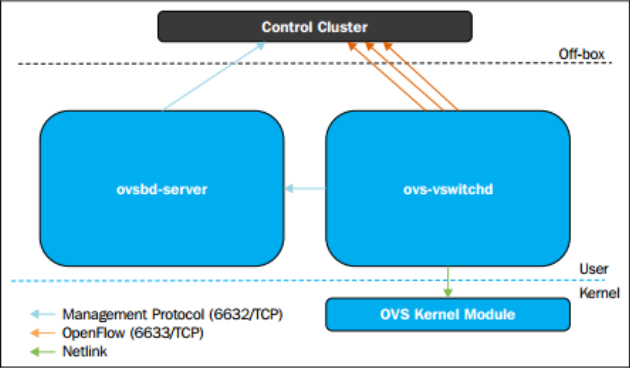

# TÌM HIỂU VỀ OPENVSWITCH

## 1. Tìm hiểu về SDN ((Software Defined Networking)) và OpenFlow

### a. SDN (Software Defined Networking)


**SDN (Software-Defined Networking)**: là mô hình mạng trong đó:

- Tách biệt phần quản lí (Control Plane) với phần truyền tài dữ liệu (Data Plane)
- Các thành phần trong Network có thể được quản lí bởi các phần mềm được lập trình chuyên biệt
- Tập trung vào phần kiểm soát và quản lí network

### b. Vấn đề của mạng truyền thống

Mạng truyền thống:

- Mỗi switch có control plane riêng
- Cấu hình thủ công qua CLI
- Khó scale
- Khó automation
- Phụ thuộc vendor
- Cùng quay trở lại quá khứ, khi mà người ta vẫn sử dụng Ethernet Hub. Về bản chất, thiết bị này chỉ làm công việc lặp đi lặp lại đó là mỗi khi nhận dữ liệu, nó lại forward tới tất cả các port mà nó kết nối ->Dẫn đến hệ quả Boardcast Storm,loop,...(Các kiểu truyền này gọi là Data Plane, Forwarding Plane )

Kiến trúc:

```text
Switch
 ├── Control Plane
 └── Data Plane

Router
 ├── Control Plane
 └── Data Plane
```

→ Phân tán, khó quản lý. Cho lên mới dẫn đến sự ra đời thiết bị layer 2 hay còn được biết với tên Network Switch .Thiết bị này đã biết gửi đúng interface và từ đây khái niệm **Control Plane** đã ra đời

### c. Kiến trúc SDN

SDN chia thành 3 tầng:

```text
Application Layer
       ↑
Control Layer (SDN Controller)
       ↑
Infrastructure Layer (Switches)
```


Nhìn chung, SDN có 3 lớp chính đó là:

- **Network infrastructure Layer** :

  - Switch vật lý hoặc virtual
  - Chỉ làm forwarding
  - Không tự quyết định routing
  - Ví dụ: Open vSwitch

- **Controller Layer**:

  - Tính toán đường đi
  - Quản lý flow table
  - Push rule xuống switch
  - Ví dụ: OpenDaylight, ONOS, VMware NSX

- **Applications Layer**: App dùng API của controller để:

  - Load balancing
  - Firewall
  - QoS
  - Traffic engineering

Open Flow

### d. Giao thức OpenFlow

**OpenFlow** là tiêu chuẩn đầu tiên, được định nghĩa là kênh giao tiếp giữa các giao diện của lớp điều khiển (control plane) và bộ chuyển tiếp (switch)trong kiến trúc SDN. **OpenFlow** cho phép truy cập trực tiếp và điều khiển mặt phẳng chuyển tiếp (OPF Switch) của các thiết bị mạng như switch và router, cả thiết bị vật lý và thiết bị ảo, do đó giúp di chuyển phần điều khiển mạng ra khỏi các thiết bị chuyển mạch thực tế tới phần mềm điều khiển trung tâm. Các quyết định về các luồng traffic sẽ được quyết định tập trung tại **OpenFlow Controller** giúp đơn giản trong việc quản trị cấu hình trong toàn hệ thống. Một thiết bị OpenFlow bao gồm ít nhất 3 thành phần:

Thành phần trong OpenFlow:

**Secure Channel**: kênh kết nối thiết bị tới bộ điều khiển (controller), cho phép các lệnh và các gói tin được gửi giữa bộ điều khiển và thiết bị.  
**OpenFlow Protocol**: giao thức cung cấp phương thức tiêu chuẩn và mở cho một bộ điều khiển truyền thông với thiết bị.  
**Flow Table**: một liên kết hành động với mỗi luồng, giúp thiết bị xử lý các luồng.

Cấu trúc, sơ đồ OpenFlow:


### e. So sánh Control Plane vs Data Plane

| Thành phần    | Vai trò             |
| ------------- | ------------------- |
| Control Plane | Quyết định đường đi |
| Data Plane    | Forward packet      |

=> SDN tách 2 cái này ra.

### g. Packet Flow trong SDN

1. Packet đến switch
2. Switch không có rule
3. Gửi packet lên controller
4. Controller tính toán
5. Push rule xuống switch
6. Các packet sau đi thẳng

### f. SDN trong Cloud (OpenStack)

Neutron dùng SDN để:

- Tạo tenant network
- Overlay VXLAN
- Security Group
- Floating Ip

OpenStack dùng:

- Open vSwitch
- Linux bridge
- L3 agent

### g. SDN dùng để Overlay Network & VXLAN

SDN thường dùng overlay:

- VXLAN

VXLAN:

Encapsulation L2 over L3
Tạo virtual network trên IP network
Scale đến 16 triệu network

## 2. Tìm hiểu về OpenvSwitch

### a. OpenvSwitch là gì ?

**Open vSwitch (OVS)** là:

**Virtual multilayer switch** dùng trong môi trường ảo hóa và cloud để làm **switching**, **routing**, **tunneling** và **SDN forwarding**. Nó là một **multilayer software** được viết bằng ngôn ngữ C cung cấp cho người dùng các **chức năng quản lí network interface**.

Nó hỗ trợ rất nhiều nền tảng như **Xen/XenServer**, **KVM**, và **VirtualBox**.

### b. Chức năng chính của OpenvSwitch

- Gán cổng Trunk Port cho các VM
- Hỗ trợ trong việc **NIC Bonding** (Gộp nhiều interface thành 1 logical interface)
- OVS hỗ trợ setup rate limit, Queue scheduling, policing(giới hạn tốc độ đầu vào -drop nếu vượt quá)
- Hỗ trợ tạo các tunnel port (`VXLAN`, `GRE`, `Geneve`, `STT`, `LISP`,...)
- ...

### c. Kiến trúc của OpenvSwitch


Trong đó:

- ovsdb-server:

  - Lưu cấu hình
  - Dùng OVSDB protocol
  - Lưu bridge, port, interface

- ovs-vswitchd:

  - Control daemon
  - Quản lý flow
  - Giao tiếp với kernel datapath

- Kernel datapath

  - Xử lý packet thực tế
  - Fast path forwarding
  - Dùng flow cache

### d. Những hạn chế khi sử dụng Linux Bridge - So sánh OpenVSwitch và Linux Bridge

#### Hạn chế của Linux Bridge

**Linux Bridge (LB)** là cơ chế ảo hoá mặc định sử dụng trong KVM. Nó rất dễ dàng để cấu hình và quản lí tuy nhiên nó vốn không được dùng cho mục đích ảo vì thế bị hạn chế cho 1 số các chức năng.

LB không hỗ trợ tunneling và OpenFlow protocols. Điều này khiến nó bị hạn chế trong việc mở rộng các chức năng. Đó cũng là lí do vì sao Open vSwitch xuất hiện.

Dưới đây là bảng so sánh giữa hai công nghệ này:

| Open vSwitch                             | Linux bridge                                           |
|------------------------------------------|--------------------------------------------------------|
| Được thiết kế cho môi trường mạng ảo hóa | Mục đích ban đầu không phải dành cho môi trường ảo hóa |
| Có các chức năng của layer 2-4           | Chỉ có chức năng của layer 2                           |
| Có khả năng mở rộng                      | Bị hạn chế về quy mô                                   |
| ACLs, QoS, Bonding                       | Chỉ có chức năng forwarding                            |
| Có OpenFlow Controller                   | Không phù hợp với môi trường cloud                     |
| Hỗ trợ Netflow và sflow                  | Không hỗ trợ tunneling                                 |

#### OVS

- Ưu điểm: các tính năng tích hợp nhiều và đa dạng, kế thừa từ linux bridge. OVS hỗ trợ ảo hóa lên tới layer4. Được sự hỗ trợ mạnh mẽ từ cộng đồng. Hỗ trợ xây dựng overlay network.

- Nhược điểm: Phức tạp, gây ra xung đột luồng dữ liệu

#### LB

- Ưu điểm: Các tính năng chính của switch layer được tích hợp sẵn trong nhân. Có được sự ổn định và tin cậy, dễ dàng trong việc troubleshoot Less moving parts: được hiểu như LB hoạt động 1 cách đơn giản, các gói tin được forward nhanh chóng

- Nhược điểm: Để sử dụng ở mức user space phải cài đặt thêm các gói. VD vlan, ifenslave. Không hỗ trợ openflow và các giao thức điều khiển khác. không có được sự linh hoạt

### e.Các thành phần và kiến trúc OpenVSwitch

Các thành phần chính của Open vSwitch:

- `ovs-vswitchd` : daemon tạo ra switch, nó được đi kèm với **Linux kernel module**
- `ovsdb-server` : Một máy chủ cơ sở dữ liệu nơi `ovs-vswitchd` truy vấn để có được cấu hình.
- `ovs-dpctl` : công cụ để cấu hình **switch kernel module**.
- `ovs-vsctl` : Dùng để truy vấn và cập nhật cấu hình cho `ovs-vswitchd`.
- `ovs-appctl` : Dùng để gửi câu lệnh chạy `Open vSwitch daemons`.


### f. Cơ chế hoạt động

Nhìn chung Open vSwitch được chia làm 2 phần, Open vSwitch kernel module (Data Plane) và user space tools (Control Plane).

OVS kernel module sẽ dùng netlink socket để tương tác với vswitchd daemon để tạo và quản lí số lượng OVS switches trên hệ thống local. SDN Controller sẽ tương tác với vswitchd sử dụng giao thức OpenFlow. ovsdb-server chứa bảng dữ liệu. Các clients từ bên ngoài cũng có thể tương tác với ovsdb-server sử dụng json rpc với dữ liệu theo dạng file JSON.

Open vSwitch có 2 modes, **normal** và **flow**:

- **Normal Mode**: Ở mode này, Open vSwitch tự quản lí tất cả các công việc switching/forwarding. Nó hoạt động như một switch layer 2.

- **Flow Mode**: Ở mode này, Open vSwitch dùng flow table để quyết định xem port nào sẽ nhận packets. Flow table được quản lí bởi SDN controller nằm bên ngoài.


