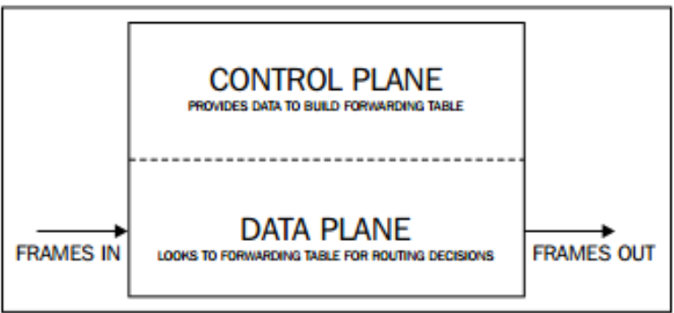
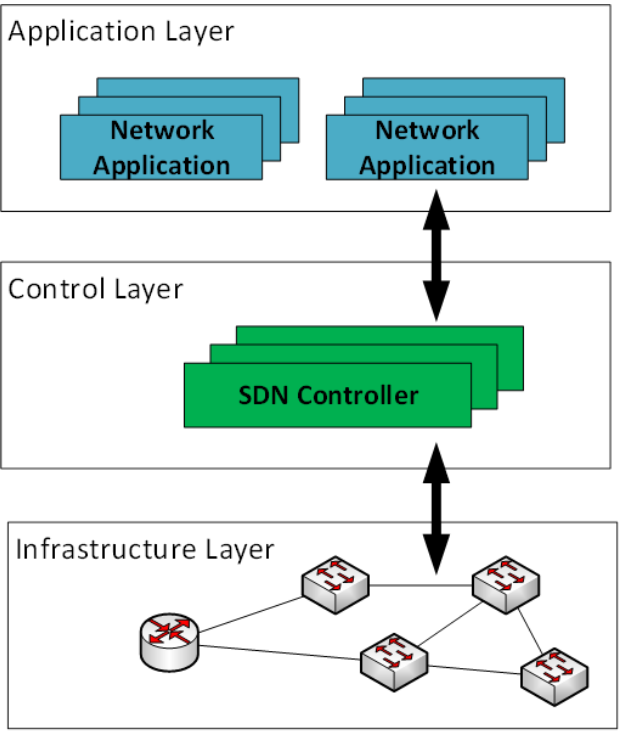
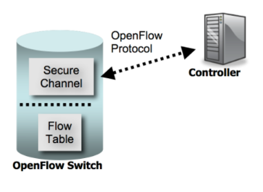
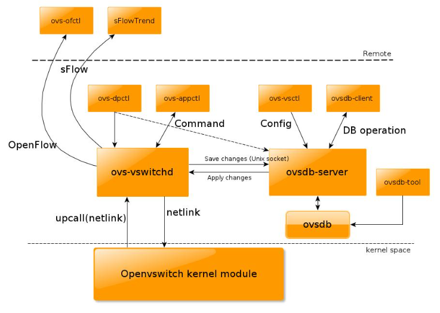
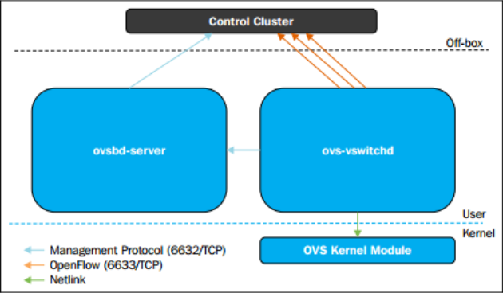

# TÌM HIỂU VỀ OPENVSWITCH

## 1. Tìm hiểu về SDN ((Software Defined Networking)) và OpenFlow

### a. SDN (Software Defined Networking)



**SDN (Software-Defined Networking)**: là mô hình mạng trong đó:

- Tách biệt phần quản lí (Control Plane) với phần truyền tài dữ liệu (Data Plane)
- Các thành phần trong Network có thể được quản lí bởi các phần mềm được lập trình chuyên biệt
- Tập trung vào phần kiểm soát và quản lí network

### b. Vấn đề của mạng truyền thống

Mạng truyền thống:

- Mỗi switch có control plane riêng
- Cấu hình thủ công qua CLI
- Khó scale
- Khó automation
- Phụ thuộc vendor
- Cùng quay trở lại quá khứ, khi mà người ta vẫn sử dụng Ethernet Hub. Về bản chất, thiết bị này chỉ làm công việc lặp đi lặp lại đó là mỗi khi nhận dữ liệu, nó lại forward tới tất cả các port mà nó kết nối ->Dẫn đến hệ quả Boardcast Storm,loop,...(Các kiểu truyền này gọi là Data Plane, Forwarding Plane )

Kiến trúc:

```text
Switch
 ├── Control Plane
 └── Data Plane

Router
 ├── Control Plane
 └── Data Plane
```

→ Phân tán, khó quản lý. Cho lên mới dẫn đến sự ra đời thiết bị layer 2 hay còn được biết với tên Network Switch .Thiết bị này đã biết gửi đúng interface và từ đây khái niệm **Control Plane** đã ra đời

### c. Kiến trúc SDN

SDN chia thành 3 tầng:

```text
Application Layer
       ↑
Control Layer (SDN Controller)
       ↑
Infrastructure Layer (Switches)
```



Nhìn chung, SDN có 3 lớp chính đó là:

- **Network infrastructure Layer** :

  - Switch vật lý hoặc virtual
  - Chỉ làm forwarding
  - Không tự quyết định routing
  - Ví dụ: Open vSwitch

- **Controller Layer**:

  - Tính toán đường đi
  - Quản lý flow table
  - Push rule xuống switch
  - Ví dụ: OpenDaylight, ONOS, VMware NSX

- **Applications Layer**: App dùng API của controller để:

  - Load balancing
  - Firewall
  - QoS
  - Traffic engineering

Open Flow

### d. Giao thức OpenFlow

**OpenFlow** là tiêu chuẩn đầu tiên, được định nghĩa là kênh giao tiếp giữa các giao diện của lớp điều khiển (control plane) và bộ chuyển tiếp (switch)trong kiến trúc SDN. **OpenFlow** cho phép truy cập trực tiếp và điều khiển mặt phẳng chuyển tiếp (OPF Switch) của các thiết bị mạng như switch và router, cả thiết bị vật lý và thiết bị ảo, do đó giúp di chuyển phần điều khiển mạng ra khỏi các thiết bị chuyển mạch thực tế tới phần mềm điều khiển trung tâm. Các quyết định về các luồng traffic sẽ được quyết định tập trung tại **OpenFlow Controller** giúp đơn giản trong việc quản trị cấu hình trong toàn hệ thống. Một thiết bị OpenFlow bao gồm ít nhất 3 thành phần:

Thành phần trong OpenFlow:

**Secure Channel**: kênh kết nối thiết bị tới bộ điều khiển (controller), cho phép các lệnh và các gói tin được gửi giữa bộ điều khiển và thiết bị.  
**OpenFlow Protocol**: giao thức cung cấp phương thức tiêu chuẩn và mở cho một bộ điều khiển truyền thông với thiết bị.  
**Flow Table**: một liên kết hành động với mỗi luồng, giúp thiết bị xử lý các luồng.

Cấu trúc, sơ đồ OpenFlow:




### e. So sánh Control Plane vs Data Plane

| Thành phần    | Vai trò             |
| ------------- | ------------------- |
| Control Plane | Quyết định đường đi |
| Data Plane    | Forward packet      |

=> SDN tách 2 cái này ra.

### g. Packet Flow trong SDN

1. Packet đến switch
2. Switch không có rule
3. Gửi packet lên controller
4. Controller tính toán
5. Push rule xuống switch
6. Các packet sau đi thẳng

### f. SDN trong Cloud (OpenStack)

Neutron dùng SDN để:

- Tạo tenant network
- Overlay VXLAN
- Security Group
- Floating Ip

OpenStack dùng:

- Open vSwitch
- Linux bridge
- L3 agent

### g. SDN dùng để Overlay Network & VXLAN

SDN thường dùng overlay:

- VXLAN

VXLAN:

Encapsulation L2 over L3
Tạo virtual network trên IP network
Scale đến 16 triệu network

## 2. Tìm hiểu về OpenvSwitch

### a. OpenvSwitch là gì ?

**Open vSwitch (OVS)** là:

**Virtual multilayer switch** dùng trong môi trường ảo hóa và cloud để làm **switching**, **routing**, **tunneling** và **SDN forwarding**. Nó là một **multilayer software** được viết bằng ngôn ngữ C cung cấp cho người dùng các **chức năng quản lí network interface**.

Nó hỗ trợ rất nhiều nền tảng như **Xen/XenServer**, **KVM**, và **VirtualBox**.

### b. Chức năng chính của OpenvSwitch

- Gán cổng Trunk Port cho các VM
- Hỗ trợ trong việc **NIC Bonding** (Gộp nhiều interface thành 1 logical interface)
- OVS hỗ trợ setup rate limit, Queue scheduling, policing(giới hạn tốc độ đầu vào -drop nếu vượt quá)
- Hỗ trợ tạo các tunnel port (`VXLAN`, `GRE`, `Geneve`, `STT`, `LISP`,...)
- ...

### c. Kiến trúc của OpenvSwitch


Trong đó:

- ovsdb-server:

  - Lưu cấu hình
  - Dùng OVSDB protocol
  - Lưu bridge, port, interface

- ovs-vswitchd:

  - Control daemon
  - Quản lý flow
  - Giao tiếp với kernel datapath

- Kernel datapath

  - Xử lý packet thực tế
  - Fast path forwarding
  - Dùng flow cache

### d. Những hạn chế khi sử dụng Linux Bridge - So sánh OpenVSwitch và Linux Bridge

#### Hạn chế của Linux Bridge

**Linux Bridge (LB)** là cơ chế ảo hoá mặc định sử dụng trong KVM. Nó rất dễ dàng để cấu hình và quản lí tuy nhiên nó vốn không được dùng cho mục đích ảo vì thế bị hạn chế cho 1 số các chức năng.

LB không hỗ trợ tunneling và OpenFlow protocols. Điều này khiến nó bị hạn chế trong việc mở rộng các chức năng. Đó cũng là lí do vì sao Open vSwitch xuất hiện.

Dưới đây là bảng so sánh giữa hai công nghệ này:

| Open vSwitch                             | Linux bridge                                           |
|------------------------------------------|--------------------------------------------------------|
| Được thiết kế cho môi trường mạng ảo hóa | Mục đích ban đầu không phải dành cho môi trường ảo hóa |
| Có các chức năng của layer 2-4           | Chỉ có chức năng của layer 2                           |
| Có khả năng mở rộng                      | Bị hạn chế về quy mô                                   |
| ACLs, QoS, Bonding                       | Chỉ có chức năng forwarding                            |
| Có OpenFlow Controller                   | Không phù hợp với môi trường cloud                     |
| Hỗ trợ Netflow và sflow                  | Không hỗ trợ tunneling                                 |

#### OVS

- Ưu điểm: các tính năng tích hợp nhiều và đa dạng, kế thừa từ linux bridge. OVS hỗ trợ ảo hóa lên tới layer4. Được sự hỗ trợ mạnh mẽ từ cộng đồng. Hỗ trợ xây dựng overlay network.

- Nhược điểm: Phức tạp, gây ra xung đột luồng dữ liệu

#### LB

- Ưu điểm: Các tính năng chính của switch layer được tích hợp sẵn trong nhân. Có được sự ổn định và tin cậy, dễ dàng trong việc troubleshoot Less moving parts: được hiểu như LB hoạt động 1 cách đơn giản, các gói tin được forward nhanh chóng

- Nhược điểm: Để sử dụng ở mức user space phải cài đặt thêm các gói. VD vlan, ifenslave. Không hỗ trợ openflow và các giao thức điều khiển khác. không có được sự linh hoạt

### e.Các thành phần và kiến trúc OpenVSwitch

Các thành phần chính của Open vSwitch:

- `ovs-vswitchd` : daemon tạo ra switch, nó được đi kèm với **Linux kernel module**
- `ovsdb-server` : Một máy chủ cơ sở dữ liệu nơi `ovs-vswitchd` truy vấn để có được cấu hình.
- `ovs-dpctl` : công cụ để cấu hình **switch kernel module**.
- `ovs-vsctl` : Dùng để truy vấn và cập nhật cấu hình cho `ovs-vswitchd`.
- `ovs-appctl` : Dùng để gửi câu lệnh chạy `Open vSwitch daemons`.



### f. Cơ chế hoạt động

Nhìn chung Open vSwitch được chia làm 2 phần, Open vSwitch kernel module (Data Plane) và user space tools (Control Plane).

OVS kernel module sẽ dùng netlink socket để tương tác với vswitchd daemon để tạo và quản lí số lượng OVS switches trên hệ thống local. SDN Controller sẽ tương tác với vswitchd sử dụng giao thức OpenFlow. ovsdb-server chứa bảng dữ liệu. Các clients từ bên ngoài cũng có thể tương tác với ovsdb-server sử dụng json rpc với dữ liệu theo dạng file JSON.

Open vSwitch có 2 modes, **normal** và **flow**:

- **Normal Mode**: Ở mode này, Open vSwitch tự quản lí tất cả các công việc switching/forwarding. Nó hoạt động như một switch layer 2.

- **Flow Mode**: Ở mode này, Open vSwitch dùng flow table để quyết định xem port nào sẽ nhận packets. Flow table được quản lí bởi SDN controller nằm bên ngoài.



### g. Hướng dẫn cài đặt OpenSwitch và KVM

**Mô hinh**:

- Môi trường lab: KVM
- 1 máy Ubuntu 14.04 có 2 NICs, 1 NIC bridge và 1 NIC host-only

**Cài đặt**:

Update máy ảo:

```bash
apt-get update -y && apt-get upgrade -y && apt-get dist-upgrade -y
```

Kế tiếp, chúng ta sẽ cài đặt KVM và 02 gói hỗ trợ:

```bash
apt-get install qemu-kvm libvirt-bin virtinst -y
```

Chuẩn bị cài OVS, chúng ta sẽ gỡ bridge libvirt mặc định (name: virbr0):

```bash
virsh net-destroy default
virsh net-autostart --disable default
```

Gán quyền cho user libvirtd và kvm:

```bash
sudo adduser `id -un` libvirtd
sudo adduser `id -un` kvm
```

Vì chúng ta không sử dụng linux bridge mặc định, chúng ta có thể gỡ các gói ebtables bằng lệnh sau. (Không chắc chắn 100% là bước này cần thiết, nhưng hầu hết các bài hướng dẫn sẽ có bước này):

```bash
aptitude purge ebtables -y
```

Chúng ta sẽ cài OVS bằng lệnh sau:

```bash
apt-get install openvswitch-controller openvswitch-switch openvswitch-datapath-source -y
```

Các gói OVS được cài đặt xong, chúng ta sẽ check KVM bằng lệnh sau:

```bash
virsh -c qemu:///system list
```

->Lệnh trên trả về danh sách các VM (máy ảo) đang chạy, lúc này sẽ trống.

Kiểm tra lại OVS bằng lệnh sau:

```bash
service openvswitch-switch status
ovs-vsctl show
```

Đầu tiên, sẽ xử dụng lệnh ovs-vsctl để tạo bridge và add với 1 physical interface:

```bash
ovs-vsctl add-br br0
ovs-vsctl add-port br0 eth0
```

Kiểm tra các bridge đã tạo và interface đã được gán hay chưa:

```bash
root@ubuntu:~#  ovs-vsctl show
8ff95bd9-d8c8-403e-bbc4-d584e25e7304
    Bridge "br0"
        Port "br0"
            Interface "br0"
                type: internal
        Port "eth0"
            Interface "eth0"
    ovs_version: "2.0.2"
```

Chỉnh sửa file `/etc/network/interfaces`:

```bash
auto lo
iface lo inet loopback

auto eth0
iface eth0 inet manual
up ifconfig $IFACE 0.0.0.0 up
up ip link set $IFACE promisc on
down ip link set $IFACE promisc off
down ifconfig $IFACE down

auto eth1
iface eth0 inet static
address 10.10.10.50
netmask 255.255.255.0

auto br0
iface br0 inet static
address 192.168.100.44
netmask 255.255.255.0
gateway 192.168.100.1
network 192.168.100.0
broadcast 192.168.100.255
dns-nameservers 8.8.8.8 8.8.4.4
```

Tiến hành reset lại network:

```bash
etc/init.d/networking restart
```

Như vậy ta đã cài xong kvm với OVS, để kiểm tra xem có các network nào trong KVM:

```bash
virsh net-list --all
```

Lúc này có thể thấy network default đã bị hủy, ta cần tạo network mới để sử dụng. Tạo file ovsnet.xml cho libvirt network:

```bash
<network>
  <name>br0</name>
  <forward mode='bridge'/>
  <bridge name='br0'/>
  <virtualport type='openvswitch'/>
</network>
```

Thực hiện lệnh để tạo network:

```bash
virsh net-define ovsnet.xml
virsh net-start br0
virsh net-autostart br0
```

Kiểm tra lại network đã khai báo cho libvirt bằng lệnh virsh net-list --all, chúng ta sẽ nhìn thấy network có tên là br0, đây chính là network có type là openvswitch đã khai báo ở trên:

```bash
root@ubuntu:~# virsh net-list --all
 Name                 State      Autostart     Persistent
----------------------------------------------------------
 br0                  active     yes           yes
 default              inactive   no            yes
```

Ở đây tạo nhanh một KVM guest sử dụng virt-install:

```bash
cd /var/lib/libvirt/images

wget https://ncu.dl.sourceforge.net/project/gns-3/Qemu%20Appliances/linux-microcore-3.8.2.img

virt-install \
      -n VM01 \
      -r 128 \
       --vcpus 1 \
      --os-variant=generic \
      --disk path=/var/lib/libvirt/images/linux-microcore-3.8.2.img,format=qcow2,bus=virtio,cache=none \
      --network network=br0 \
      --hvm --virt-type kvm \
      --vnc --noautoconsole \
      --import
```

### h. Một vài câu lệnh với Open vSwitch

- `ovs-` : Bạn chỉ cần nhập vào ovs rồi ấn tab 2 lần là có thể xem tất cả các câu lệnh đối với Open vSwitch.

- `ovs-vsctl` : là câu lệnh để cài đặt và thay đổi một số cấu hình ovs. Nó cung cấp interface cho phép người dùng tương tác với Database để truy vấn và thay đổi dữ liệu.

  - `ovs-vsctl show`: Hiển thị cấu hình hiện tại của switch.
  - `ovs-vsctl list-br`: Hiển thị tên của tất cả các bridges.
  - `ovs-vsctl list-ports` : Hiển thị tên của tất cả các port trên bridge.
  - `ovs-vsctl list interface` : Hiển thị tên của tất cả các interface trên bridge.
  - `ovs-vsctl add-br` : Tạo bridge mới trong database.
  - `ovs-vsctl add-port` : : Gán interface (card ảo hoặc card vật lý) vào Open vSwitch bridge.

- `ovs-ofctl` và `ovs-dpctl` : Dùng để quản lí và kiểm soát các flow entries. OVS quản lý 2 loại flow:

  - OpenFlows : flow quản lí control plane
  - Datapath : là kernel flow.
  - `ovs-ofctl` giao tiếp với OpenFlow module, `ovs-dpctl` giao tiếp với Kernel module.

- `ovs-ofctl show` : hiển thị thông tin ngắn gọn về switch bao gồm port number và port mapping.

- `ovs-ofctl dump-flows` : Dữ liệu trong OpenFlow tables

- `ovs-dpctl show` : Thông tin cơ bản về logical datapaths (các bridges) trên switch.

- `ovs-dpctl dump-flows` : Hiển thị flow cached trong datapath.

- `ovs-appctl bridge`/`dumpflows`: thông tin trong flow tables và offers kết nối trực tiếp cho VMs trên cùng hosts.

- `ovs-appctl fdb`/`show`: Hiển thị các cặp mac/vlan.
