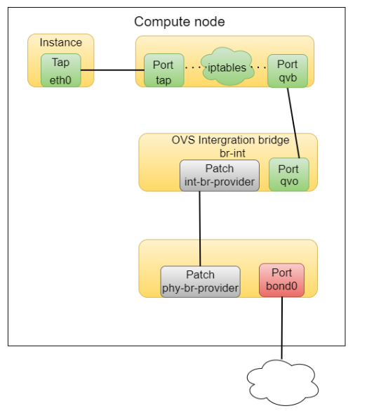
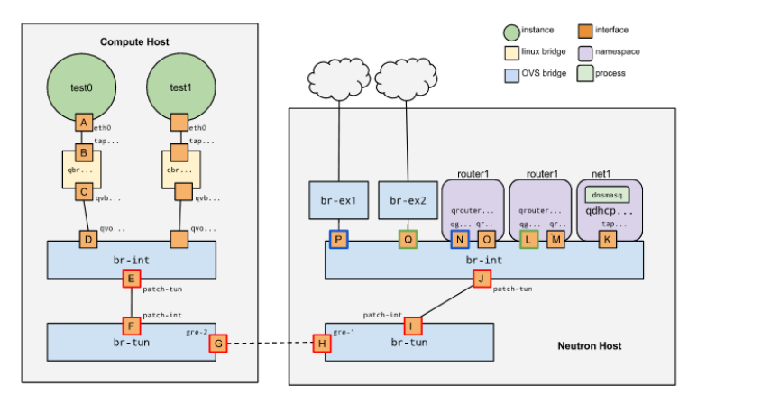
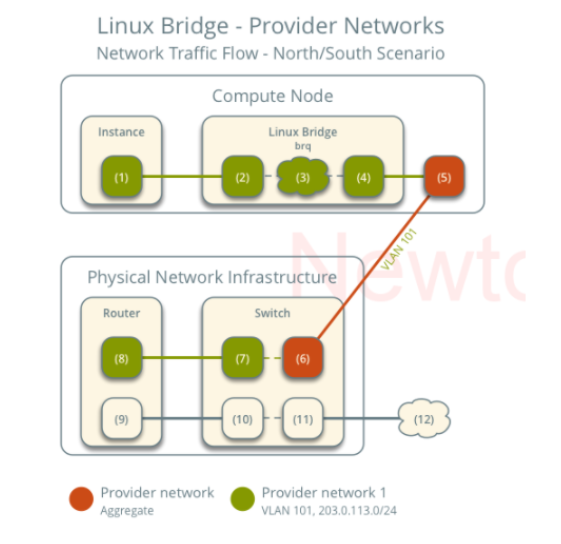
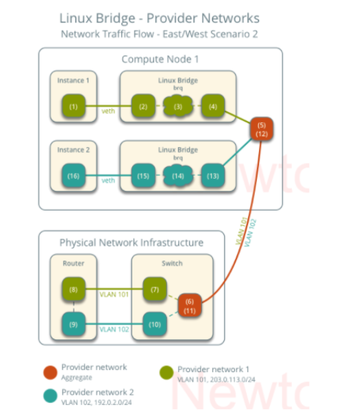
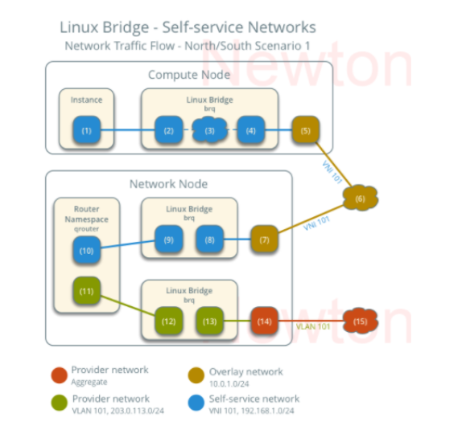
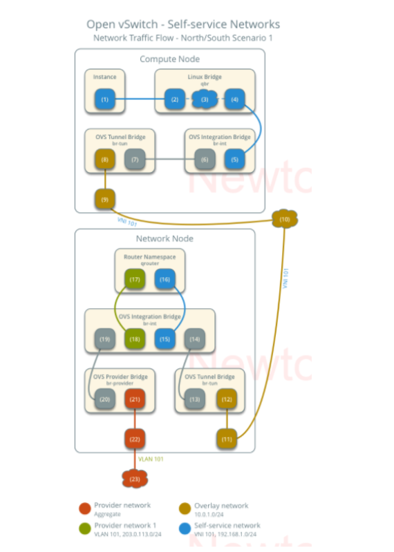
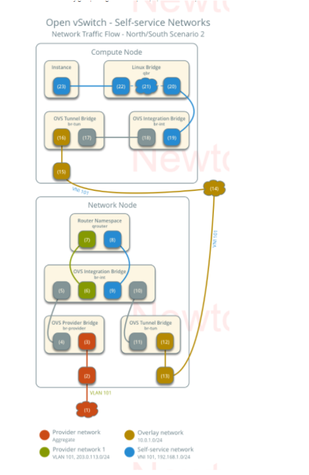
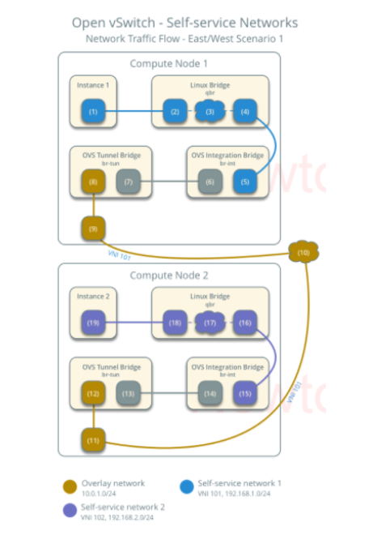
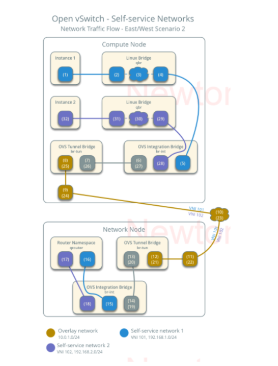

# KIẾN TRÚC NETWORK TRONG OPENSTACK VÀ ĐƯỜNG ĐI CỦA GÓI TIN TRONG OPS

## I. PROVIDER NETWORK

Dưới đây là mô hình kiến trúc tổng quan của network trong OpenStack sử dụng provider network:



### 1. Instance Networking (Đang ở trong Compute Node)

Gói tin sẽ bắt đầu từ card `eth0` trên máy ảo, nó được kết nối với `tap` device trên host. `tap` device này ở trên Linux bridge. Sở dĩ có 1 layer Linux Bridge là vì OpenStack sử dụng các rules của iptables trên tap devices để thực hiện Security Groups. Trước đây khi mà OpenVSwitch chưa hỗ trọ iptables thì buộc nó dùng 1 layer là Linux Bridge nữa dù lí tưởng nhất vẫn là interface của VM gán trực tiếp vào Bridge integration (br-int) của OVS.

Ở các phiên bản gần đây, iptables đã hỗ trợ OpenVSwitch vì thế nó sẽ không cần thêm một lớp LB nữa. Bạn có thể xem thêm về cách khai báo cho OVS use iptables tại [đây](https://docs.openstack.org/ocata/networking-guide/config-ovsfwdriver.html)

Mặc dù vậy nhưng OpenStack vẫn để trên [docs](https://docs.openstack.org/newton/networking-guide/deploy-ovs-provider.html) của mình của mô hình với lớp có LB đã được kiểm tra là khá ổn định. Ở đây mình sẽ vẫn đi sâu vào mô hình có lớp Linux Bridge.

Nếu bạn xem các rules trên node compute nơi chứa máy ảo thì bạn sẽ thấy được có vài rules liên quan tới `tap` device:

```bash
[root@compute2 ~]# iptables -S | grep tap5652dd5f-cd
-A neutron-openvswi-FORWARD -m physdev --physdev-out tap5652dd5f-cd --physdev-is-bridged -m comment --comment "Direct traffic from the VM interface to the security group chain." -j neutron-openvswi-sg-chain
-A neutron-openvswi-FORWARD -m physdev --physdev-in tap5652dd5f-cd --physdev-is-bridged -m comment --comment "Direct traffic from the VM interface to the security group chain." -j neutron-openvswi-sg-chain
-A neutron-openvswi-INPUT -m physdev --physdev-in tap5652dd5f-cd --physdev-is-bridged -m comment --comment "Direct incoming traffic from VM to the security group chain." -j neutron-openvswi-o5652dd5f-c
-A neutron-openvswi-sg-chain -m physdev --physdev-out tap5652dd5f-cd --physdev-is-bridged -m comment --comment "Jump to the VM specific chain." -j neutron-openvswi-i5652dd5f-c
-A neutron-openvswi-sg-chain -m physdev --physdev-in tap5652dd5f-cd --physdev-is-bridged -m comment --comment "Jump to the VM specific chain." -j neutron-openvswi-o5652dd5f-c
```

Trong đó:

- `neutron-openvswi-sg-chain` là nơi chứa neutron-managed security groups.
- `neutron-openvswi-FORWARD` điều khiển outbound traffic từ VM ra ngoài.  
- `neutron-openvswi-i5652dd5f-c` sẽ điều khiển inbound traffic tới VM.

Ở đây mình đã mở port 22 trong Security Group nên các rules sẽ như thế này :

```bash
-A neutron-openvswi-i5652dd5f-c -m state --state RELATED,ESTABLISHED -m comment --comment "Direct packets associated with a known session to the RETURN chain." -j RETURN
-A neutron-openvswi-i5652dd5f-c -s 10.10.10.2/32 -p udp -m udp --sport 67 -m udp --dport 68 -j RETURN
-A neutron-openvswi-i5652dd5f-c -m set --match-set NIPv4db2f6d52-5e02-4ab4-949d- src -j RETURN
-A neutron-openvswi-i5652dd5f-c -p tcp -m tcp -m multiport --dports 1:65535 -j RETURN
-A neutron-openvswi-i5652dd5f-c -p icmp -j RETURN
-A neutron-openvswi-i5652dd5f-c -p tcp -m tcp --dport 22 -j RETURN
```

Interface thứ 2 gán vào Linux Bridge có tên `qvb`..., interface này sẽ nối LB tới integration bridge (`br-int`).

### 2. Linux Bridge

Trên đây chứa các rule dùng cho Security Group. Nó có 1 đầu là `tap` interface có địa chỉ MAC trùng với địa chỉ MAC của card mạng trên máy ảo và 1 đầu là `qvb...` được nối với `qvo...` trên integration bridge.

### 3. Integration Bridge

Bridge này thường có tên là `br-int` thường được dùng để `tag` và `untag` VLAN cho traffic vào ra VM .Với:

- `br-int`: Switch ảo layer 2 dùng đẻ kết nối các Tap device của VM và xử lí flow Open hay xử lí các kết nối nội bộ VM trong Compute Node
- `br-tun`: Xử lý tunnel VXLAN/GRE
- `br-ex`: Xử lý kết nối ra mạng thật

Lúc này `br-int` sẽ trông như sau:

```bash
#ovs-vsctl show
...........
Bridge br-int
            Interface int-br-provider
                type: patch
                options: {peer=phy-br-provider}
        Port br-int
            Interface br-int
                type: internal
        Port "qvo5652dd5f-cd"
            tag: 1
            Interface "qvo5652dd5f-cd"
```

Trong đó:

- Interface `qvo...` là điểm đến của `qvb...` và nó sẽ chịu trách nhiệm với các traffic vào và ra khỏi layer LB. Nếu bạn sử dụng VLAN, sẽ có thêm `tag:1`. Interface `int-br-provider` kết nối tới `phy-br-provider` trên layer bridge external.

### 4. External bridge

Bridge này sẽ được gán với interface external để đi ra ngoài internet (có thể dùng bond hoặc không). Nó sẽ trông như sau:

```bash
#ovs-vsctl show
.........
Bridge br-provider
        Controller "tcp:127.0.0.1:6633"
            is_connected: true
        fail_mode: secure
        Port phy-br-provider
            Interface phy-br-provider
                type: patch
                options: {peer=int-br-provider}
        Port br-provider
            Interface br-provider
                type: internal
        Port "bond0"
            Interface "bond0"
```

## II. SELF-SERVICE NETWORK

Mô hình Self-Service Network sẽ phức tạp hơn khi mà traffic còn phải đi qua 1 router được đặt trên Node controller. Dưới đây là mô hình:



### 1. Tunnel-Bridge

Traffic từ Node Compute sẽ được chuyển tới Node controller thông qua GRE/VXLAN tunnel trên bridge tunnel (br-tun). Nếu sử dụng VLAN thì nó sẽ chuyển đổi qua lại giữa VLAN IDs và tunnel IDs được thực hiện bởi OpenFlow rules trên `br-tun`

Đối với GRE hoặc VXLAN-based network truyền tới từ `patch-tun` của `br-int` sang `patch-int` của `br-tun`. Bridge này sẽ chứa 1 port cho tunnel có tên "vxlan-.."

```bash
Bridge br-tun
       Controller "tcp:127.0.0.1:6633"
           is_connected: true
       fail_mode: secure
       Port "vxlan-c0a80b0a"
           Interface "vxlan-c0a80b0a"
               type: vxlan
               options: {df_default="true", in_key=flow, local_ip="192.168.11.12", out_key=flow, remote_ip="192.168.11.10"}
```

Tunnel trong trường hợp trên nối từ local interface trên node compute (192.168.11.12) tới remote ip trên node controller (192.168.11.10)

Tunnel này sử dụng bảng định tuyến trên host để trao đổi gói tin vì thế không cần bất cứ yêu cầu nào đối với hai endpoints hai bên, khác với khi sử dụng VLAN. Tất cả các interface trên `br-tun` được coi là internal đối với OpenVSwitch.Vì thế nó sẽ không không thể nhìn thấy từ bên ngoài, để giám sát traffic, bạn phải tạo ra mirror port cho `patch-tun` trên `br-int` bridge.

Tunnel bridge trên node controller về cơ bản không có gì khác nhiều so với tunnel trên node compute. Một số rules trên node controller:

```bash
NXST_FLOW reply (xid=0x4):
 cookie=0xb47bbe6025792346, duration=193515.678s, table=2, n_packets=38926, n_bytes=2679421, idle_age=0, hard_age=65534, priority=0,dl_dst=01:00:00:00:00:00/01:00:00:00:00:00 actions=resubmit(,22)
 cookie=0xb47bbe6025792346, duration=193515.676s, table=3, n_packets=0, n_bytes=0, idle_age=65534, hard_age=65534, priority=0 actions=drop
 cookie=0xb47bbe6025792346, duration=193392.459s, table=4, n_packets=0, n_bytes=0, idle_age=65534, hard_age=65534, priority=1,tun_id=0x3e actions=mod_vlan_vid:2,resubmit(,10)
```

### 2. DHCP Router on Controller

DHCP server thường được chạy trên node controller hoặc compute. Nó là một instance của dnsmasq chạy trong một network namespace. Network namespace là một Linux kernel facility cho phép thực hiện một loạt các tiến trình tạo ra network stack (interfaces, routing tables, iptables rules).

Bạn có thể thấy danh sách của Network namespace với câu lệnh `ip nets`

```bash
#ip nets
qdhcp-88b1609c-68e0-49ca-a658-f1edff54a264
qrouter-2d214fde-293c-4d64-8062-797f80ae2d8f
```

Trong đó:

- `qdhcp....` là DHCP Server namespace còn `qrouter...` là router.

Dùng câu lệnh `ip netns exec` để xem cấu hình interface bên trong.

```bash
# ip netns exec qdhcp-88b1609c-68e0-49ca-a658-f1edff54a264 ip addr
tapf14c598d-98: <BROADCAST,MULTICAST,UP,LOWER_UP> mtu 1500 qdisc pfifo_fast state UP qlen 1000
    link/ether fa:16:3e:10:2f:03 brd ff:ff:ff:ff:ff:ff
    inet 10.1.0.3/24 brd 10.1.0.255 scope global ns-f14c598d-98
    inet6 fe80::f816:3eff:fe10:2f03/64 scope link
       valid_lft forever preferred_lft forever
```

### 3. Router on Controller

Router cũng là một network namespace với một loạt các routing rules và iptables rules để thực hiện việc định tuyến giữa các subnets.

Chúng ta có thể xem cấu hình của router với câu lệnh `ip net exec`. Mỗi router sẽ có 2 interface, một cổng sẽ là kết nối tới gateway (được tạo bởi câu lệnh router-gateway-set), một cổng kết nối tới integration bridge

Chúng ta có thể xem bảng định tuyến bên trong router thông qua câu lệnh `ip nets qrouter-... iproute`

```bash
[root@controller ~]# ip netns exec qrouter-6c9927a0-851b-44dc-bf57-189a6b83ff89 ip route
default via 172.16.69.1 dev qg-5ae40a29-b5
10.10.10.0/24 dev qr-99b8677c-40  proto kernel  scope link  src 10.10.10.1
172.16.69.0/24 dev qg-5ae40a29-b5  proto kernel  scope link  src 172.16.69.250
```

Bạn cũng có thể xem bảng NAT thông qua câu lệnh `ip netns exec qrouter-... iptables -t nat -S`

```bash
[root@controller ~]# ip netns exec qrouter-6c9927a0-851b-44dc-bf57-189a6b83ff89 iptables -t nat -S
-P PREROUTING ACCEPT
-P INPUT ACCEPT
-P OUTPUT ACCEPT
-P POSTROUTING ACCEPT
-N neutron-l3-agent-OUTPUT
-N neutron-l3-agent-POSTROUTING
-N neutron-l3-agent-PREROUTING
-N neutron-l3-agent-float-snat
-N neutron-l3-agent-snat
-N neutron-postrouting-bottom
-A PREROUTING -j neutron-l3-agent-PREROUTING
-A OUTPUT -j neutron-l3-agent-OUTPUT
-A POSTROUTING -j neutron-l3-agent-POSTROUTING
-A POSTROUTING -j neutron-postrouting-bottom
-A neutron-l3-agent-POSTROUTING ! -i qg-5ae40a29-b5 ! -o qg-5ae40a29-b5 -m conntrack ! --ctstate DNAT -j ACCEPT
-A neutron-l3-agent-PREROUTING -d 169.254.169.254/32 -i qr-+ -p tcp -m tcp --dport 80 -j REDIRECT --to-ports 9697
-A neutron-l3-agent-snat -j neutron-l3-agent-float-snat
-A neutron-l3-agent-snat -o qg-5ae40a29-b5 -j SNAT --to-source 172.16.69.250
-A neutron-l3-agent-snat -m mark ! --mark 0x2/0xffff -m conntrack --ctstate DNAT -j SNAT --to-source 172.16.69.250
-A neutron-postrouting-bottom -m comment --comment "Perform source NAT on outgoing traffic." -j neutron-l3-agent-snat
```

## III. NETWORK TRAFFIC FLOW

### 1. Linux Bridge

#### a. North/South



1. Máy ảo chuyển gói tin từ interface (1) tới interface của provider bridge (2) qua `veth` pair
2. Security group rules (3) trên provider bridge sẽ quản lí và giám sát traffic.
3. VLAN sub-interface port (4) trên provider bridge chuyển gói tin tới physical network interface (5).
4. Physical network interface (5) gán VLAN tag (101) vào cho packets và chuyển nó tới switch vật lí (6).
5. Switch vật lí bỏ VLAN tag 101 từ packets và chuyển nó tới router (7)
6. Router định tuyến packets từ provider network (8) sang external network (9) và chuyển nó tới switch (10)
7. Switch chuyển tiếp packet tới external network (11)
8. External network (12) nhận packets

#### b. East/West

Đường đi các máy ảo theo chiều này tương tự như chiều North/South chỉ khác là nó không ra ngoài Internet , khi đến Switch vật lí bên ngoài nó sẽ được chuyển trở lại địa chỉ đích của máy ảo cần chuyển trong trường hợp cùng Vlan. Đối với các dải mạng khác, nó sẽ phải đi ra ngoài con Router rồi mới quay trở lại.

##### Cùng dải mạng


##### Khác dải mạng



### 2. Self-Service

#### a. North/ South with a fixed IP



1. Interface của máy ảo(1) sẽ chuyển packets tới self-service bridge port (2) thông qua veth pair.
2. Security group rules (3) trên self-service bridge sẽ kiểm soát giám sát kết nối.
3. Self-service bridge chuyển tiếp tới VXLAN interface (4), đóng dói gói tin dùng VNI 101
4. Underlying interface (5) của VXLAN sẽ forward gói tin tới network node hoặc controller node thông qua overlay network(6).
5. Underlying interface (7) của VXLAN chuyển tiếp gói tin tới VXLAN interface để "mở gói"
6. Self-service bridge router port (9) chuyển gói tin tới self-service network interface (10) trên router. Tại đây router sử dụng SNAT để chuyển đổi IP rồi gửi chúng tới gateway interface của provider network.
7. Router chuyển tiếp gói tin tới provider bridge router port (12).
8. VLAN sub-interface port (13) trên provider bridge chuyển gói tin tới provider physical network interface (14)
9. Provider physical network interface (14) gán VLAN tag 101 vào packet và chuyển tiếp nó ra ngoài internet thông qua physical network infrastructure (15).

#### b. North/South with floating IPv4 address


#### c. East/West: Instance on the same network


#### d. East/West: Instance on different network


## IV. NETWORK TRAFFIC FLOW WITH OpenVSwitch

### 1. Provider Network

#### a. North/South (with OpenVSwitch)


#### b. East/West (with OpenVSwitch)

##### East/West with Instance on the same network


##### East/West with Instance on different network


### 2. Self-service Network

#### a. North/South with a fixed IPv4 address



#### b. North/South with a floating IPv4 address



#### c. East/West: Instance on the same network (with OpenVSwitch)



#### d. East/West: Instance on different network (with OpenVSwitch)



## Tài liệu tham khảo

<https://docs.openstack.org/neutron/latest/>

<http://blog.oddbit.com/2013/11/14/quantum-in-too-much-detail/>

<https://docs.openstack.org/ops-guide/ops-network-troubleshooting.html#network-paths>

<http://www.yet.org/2014/09/openvswitch-troubleshooting/>
