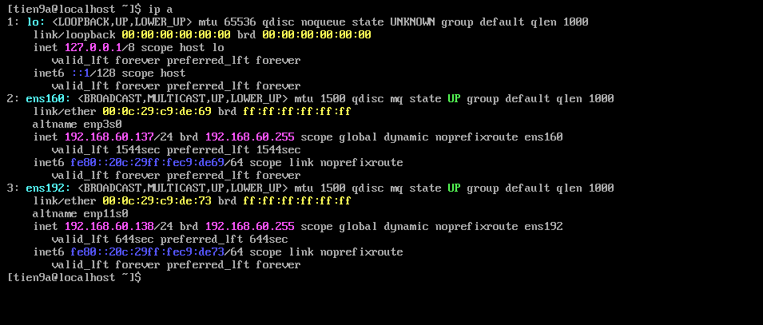
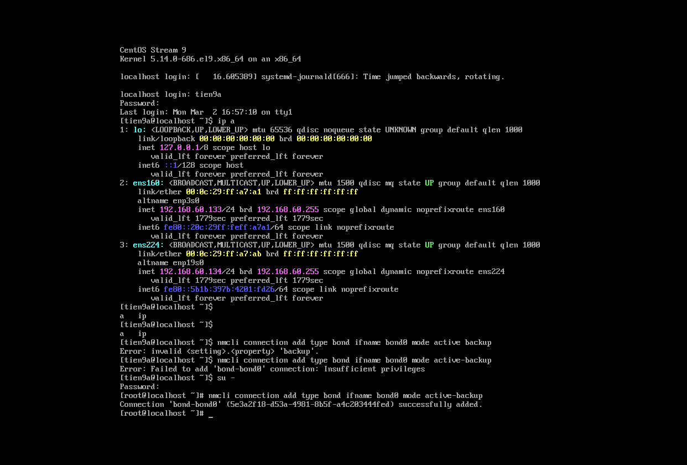
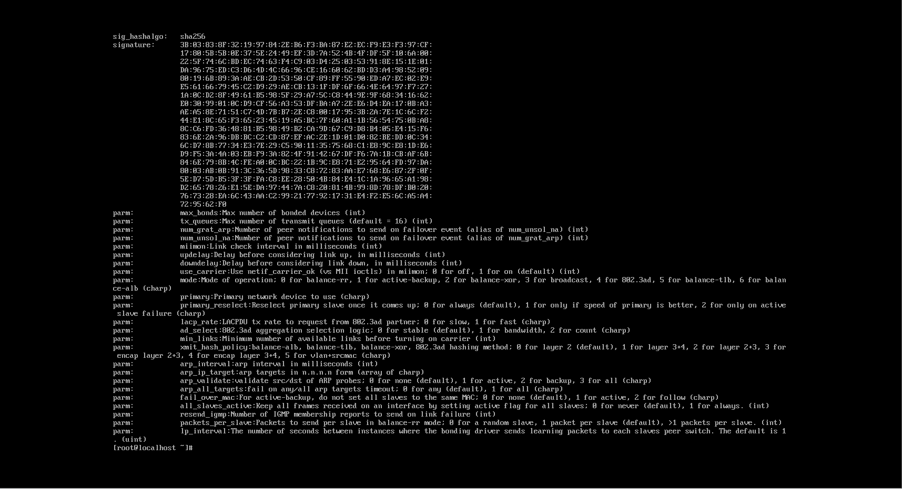

# Tìm hiểu Network Bonding

## 1. Network Bonding là gì?

Network bonding là phương pháp kết hợp hai hoặc nhiều network interfaces lại với nhau để trở thành 1 interface duy nhất. Nó giúp gia tăng băng thông, giảm thiểu sự dư thừa dữ liệu... Nếu 1 interface bị down, những cái còn lại sẽ giữ cho đường truyền mạng ổn định mà không bị ảnh hưởng.(Tính HA)

Bonding là **kernel driver** trong Linux cung cấp cho ta phương thức để thực hiện điều ấy. Chức năng của "bonded" interface phụ thuộc vào mode được cấu hình.

## 2. Kiến trúc cơ bản

```text
        Switch
        /     \
     eth0     eth1
        \     /
         bond0
            |
         Linux OS
```

## 3. Các mode trong network bonding

### a.  `mode=0 (balance-rr)`

- Gửi packet lần lượt qua từng NIC:

```code
Packet1 → eth0
Packet2 → eth1
Packet3 → eth0
```

- Ưu điểm:

  - Tăng băng thông tối đa

- Nhược điểm:

  - Có thể out-of-order packet
  - Switch phải có support trunking

### b. `mode=1 (active-backup)`

- **Cơ chế**: Chỉ 1 NIC hoạt động. NIC còn lại standby(inactive nhưng sẵn sàng thay thế).

```code
eth0 active
eth1 standby
```

=> Nếu `eth0` chết → `eth1` lên thay.

- **Ưu điểm**:

  - Ổn định
  - Không cần cấu hình switch gì đặc biệt

- Nhược điểm:

  - Không tăng Bandwidth
  - Chỉ dùng HA

=> Dùng nhiều trong Data Center

### c. `mode=2 (balance-xor)`

-> Áp dụng phép `XOR`: thực hiện `XOR` MAC nguồn và MAC đích, rồi thực hiện modulo với số slave. Mode này cung cấp khả năng cân bằng tải và chịu lỗi

```code
hash(MAC src + MAC dst)
```

=> Quyết định NIC nào được dùng

- Ưu điểm:

  - Load Balance tốt
  - Không có Out of order

- Nhược:

  - Switch phải support static Trunk

### d.`mode=3 (broadcast)`

Gửi mọi packet ra tất cả NIC.

```code
Packet → eth0 + eth1
```

- Đặc điểm:

  - Dùng cho môi trường cần redundancy cực cao.

### e.`mode=4 (802.3ad)`

-> IEEE 802.3ad. Mode này sẽ tạo một nhóm tập hợp các interfaces chia sẻ chung tốc độ và thiết lập duplex (hai chiều). Yêu cầu để sử dụng mode này là có Ethtool trên các drivers gốc để đạt được tốc độ và cấu hình hai chiều trên mỗi slave, đồng thời các switch sẽ phải cấu hình hỗ trợ chuẩn IEEE 802.3ad.

### f. `mode=5 (balance-tlb)`

-> Cân bằng tải thích ứng với quá trình truyền tin: lưu lượng ra ngoài phân tán dựa trên tải hiện tại trên mỗi slave (tính toán liên quan tới tốc độ). Lưu lượng tới nhận bởi slave active hiện tại, nếu slave này bị lỗi khi nhận gói tin, các slave khác sẽ thay thế, MAC address của đường bond sẽ chuyển sang một trong các slave còn lại.

### g. `mode=6 (balance-alb)`

 -> Cân bằng tải thích ứng: bao gồm cả cân bằng tải truyền (balance-tlb) và cân bằng tải nhận (rlb - receive load balancing) đối với lưu lượng IPv4. Cân bằng tải nhận đạt được nhờ kết hợp với ARP. Bonding driver sẽ chặn các bản tin phản hồi ARP gửi bởi hệ thống cục bộ trên đường ra và ghi đè địa chỉ MAC nguồn bằng địa chỉ MAC của một trong các slaves trên đường bond.

## 4. Các bonding options

Các tùy chọn cho bonding driver được đưa vào bonding module như là các parameters ở giai đoạn ban đầu khi boot OS hoặc cũng có thể được đưa vào sau thông qua sysfs.

Dưới đây là các bonding driver parameters hiện hành:

- `active_slave`:

-> Chỉ ra active slave cho mode hỗ trợ nó (active-backup, balance-alb và balance-tlb). Các giá trị có thể là bất cứ interface nào hoặc cũng có thể để trống, lúc này active slave sẽ được chọn tự động.

- `ad_actor_sys_prio` :

-> Parameters này chỉ được dùng ở mode 802.3ad. Nó chỉ ra độ ưu tiên cho hệ thống, giá trị có thể chọn từ 1-65535, mặc định sẽ là 65535.

- `ad_actor_system`:

-> Parameters này cũng chỉ được dùng ở mode 802.3ad. Nó chỉ ra địa chỉ MAC cho actor trong AD system.

- `ad_select` :

-> Chỉ ra phần lựa chọn kiểu nối trong mode 802.3ad, các giá trị có thể là:

- `stable or 0` :

-> Là giá trị mặc định, nó sẽ chọn aggregator theo bandwith lớn nhất. Nó sẽ chỉ được chọn lại nếu tất cả các slave của aggregator đang active bị down hoặc aggregator không có slaves.

- `bandwidth or 1` :

-> Cũng lựa chọn theo bandwith lớn nhất. Tuy nhiên nó sẽ chọn lại nếu slave được add hoặc remove khỏi bond, các thay đổi của slave cũng như nếu admin muốn thay đổi.

- `count or 2` :

-> Active aggregator được chọn theo số lượng ports lớn nhất.

- `ad_user_port_key` :

Trong ad system, port-key có 3 phần:

```text
Bits   Use  
00     Duplex  
01-05  Speed  
06-15  User-defined  
```

- `all_slaves_active` :

-> Tùy chọn cho phép duplicate frames được sử dụng hay không, mặc định thì bonding sẽ drop duplicate frames, giá trị mặc định là 0.

- `arp_interval` :

-> ARP monitor làm việc theo chu kì để check slave xem nó gửi hay nhận nhưng traffic gần nhất. Tùy chọn này cho phép kích hoạt ARP monitoring, mặc định nó sẽ bị disabled, giá trị mặc định cũng là 0.

- `arp_ip_target` :

-> Chỉ ra địa chỉ IP sẽ dược dùng làm ARP monitoring khi mà giá trị `arp_interval` > 0.

- `arp_all_targets` :

-> số lượng arp_ip_targets được kết nối tới để ARP monitor kiểm tra slave nào đang bật . Tùy chọn này chỉ có ảnh hưởng đối với active-backup mode.

- `downdelay`:

-> Xác định thời gian theo (milliseconds) để đợi trước khi hủy một slave sau khi nó bị down.

- `fail_over_mac` :

-> Xác định xem liệu active-backup mode có được set tất cả các slave có cùng 1 địa chỉ MAC không, ngoài ra nó cũng quản lí địa chỉ MAC cho bond khi được bật.

- Trong đó:

  - `none` hoặc `0` : Set tất cả các slaves có cùng địa chỉ mac. Đây là giá trị mặc định.
  - `active` hoặc `1` :  địac chỉ MAC của bond sẽ là địa chỉ MAC của slave đang active, MAC của slave không thay đổi mà chỉ có MAC của bon thay đổi sau mỗi lần chuyển qua lại giữa các slaves. Tuy nhiên nó đòi hỏi các thiết bị trong hệ thông phải thường xuyên cập nhật bảng địa chỉ MAC
  - `follow` or `2` : địa chỉ MAC của slave đầu tiên sẽ được add cho bond.

-> Giá trị mặc định là `none`, trừ khi slave đầu tiên không thể thay đổi địa chỉ MAC của nó.

- `max_bonds` :

-> Số lượng bonding devices tạo ra. Ví dụ nếu max_bonds là 3 và bonding driver chưa được load thì bond0, bond1 và bond2 sẽ được tạo. Giá trị mặc định là 1, giá trị 0 sẽ load bonding nhưng không tạo ra device.

- `miimon` :

-> Chỉ ra khoảng thời gian kiểm tra MII link trong milliseconds. Trạng thái của link sẽ được cập nhật để phát hiện link failures.

- `min_links` :

-> Số lượng nhỏ nhất của links buộc phải được active trước khi bond device được bật.

- `mode` : chỉ ra mode mà bonding chạy.

- `packets_per_slave` :

-> Số lượng packets để truyền qua slave trước khi chuyển qua cái tiếp theo. Khi set bằng 0 thì slave sẽ được chọn random. Tùy chọn này chỉ có tác dụng ở mode balance-rr.

- `primary` :

-> Các card mạng sẽ được lựa chọn để làm primary device. Card mạng nào được chọn thì nó sẽ luôn là active slave nếu thời điểm đó nó available. Tùy chọn này chỉ có tác dụng ở mode 1, 5, và 6.

- `primary_reselect` :

- Chỉ ra làm thế nào để chọn primary slave làm active slave khi mà active slave hiện tại bị down.

  - always or 0 (default) : Primary slave sẽ trở thành active slave bất cứ khi nào nó quay trở lại.
  - better or 1 : primary slave sẽ trở thành active slave khi nó quay lại và tốc độ của slave này lớn hơn tốc độ của active slave hiện tại.
  - failure or 2: primary slave trở thành active slave chỉ khi slave hiện tại bị down và primary slave đang up.

- `updelay` :

-> Số thời gian (theo milliseconds) để đợi trước khi kích hoạt slave.

- `resend_igmp` :

-> Số lượng IGMP membership reports được gửi đi sau khi mà failover event diễn ra.

## 5. Thực hành cấu hình bonding mode trên CentOS 9 và test thử

### **Mô hình**

Một máy cài CentOS 9 với 2 card mạng `ens160` và `ens192` thuộc dải mạng : `192.168.60.0/24`

Xoá IP trên 2 NIC (nếu có) không thì slave NIC vẫn có IP và nó có thể route ra ngoài thay vì `standby`

```bash
nmcli con show
nmcli con del ens160
nmcli con del ens192
```



### a. **Cấu hình bonding mode 0**

Đối với CentOS 9, bonding module mặc định sẽ không được load. Sử dụng câu lệnh sau để kích hoạt:

```bash
nmcli con add type bond ifname bond0 mode balance-rr
nmcli con add type ethernet ifname ens160 master bond0
nmcli con add type ethernet ifname ens192 master bond0

nmcli con modify bond0 ipv4.method manual ipv4.addresses 192.168.1.100/24 ipv4.gateway 192.168.1.1/ipv4.dns 8.8.8.8
nmcli con up bond0
```



Bạn có thể xem thông tin của bonding module bằng câu lệnh sau:

`modinfo bonding`



**Test Network Bonding**:

Chạy câu lệnh sau để kiểm tra xem `bond0` đã được bật và chạy hay chưa:

`cat /proc/net/bonding/bond0`

-> Có thể thấy bond0 đã được bật và nó được cấu hình ở mode 1 (active-backup). Ở mode này, chỉ có 1 slave được bật, slave còn lại sẽ được bật chỉ khi slave đang active bị chết.

**Test bandwidth**:

Dùng iperf test băng thông của `bond0`

```sh
[root@meditech ~]# iperf -c 192.168.100.30 -b 1G
------------------------------------------------------------
Client connecting to 192.168.100.30, TCP port 5001
TCP window size: 85.0 KByte (default)
------------------------------------------------------------
[  3] local 192.168.100.32 port 37752 connected with 192.168.100.30 port 5001
[ ID] Interval       Transfer     Bandwidth
[  3]  0.0-10.0 sec   175 MBytes   146 Mbits/sec
```

Tiếp theo ta "hạ" một card mạng xuống và kiểm tra lại bằng thông:

```sh
[root@meditech ~]# ifdown ens3
Device 'ens3' successfully disconnected.
[root@meditech ~]# iperf -c 192.168.100.30 -b 1G
------------------------------------------------------------
Client connecting to 192.168.100.30, TCP port 5001
TCP window size: 85.0 KByte (default)
------------------------------------------------------------
[  3] local 192.168.100.32 port 37754 connected with 192.168.100.30 port 5001
[ ID] Interval       Transfer     Bandwidth
[  3]  0.0-10.0 sec   167 MBytes   140 Mbits/sec
```

Có thể thấy băng thông không có sự thay đổi khi ta bỏ 1 card mạng đi.

### Xoá mode bonding đang tồn tại

```bash
ip link delete bond0
```

## 6. Một số ghi chép về network bonding

- Tùy chọn `STARTMODE` trong file cấu hình bonding có thể chọn:
  - onboot: Khởi động theo HĐH
  - manual: chỉ khởi động khi bạn gọi đến nó
  - off hoặc ignore: cấu hình bị ignore

- Tùy chọn `BONDING_MASTER='yes'` chỉ ra đó là bonding master device
- Trong tùy chọn `BONDING_MODULE_OPTS` không nên đưa vào `max_bonds` bởi nó làm hệ thống confuse trong trường hợp bạn có nhiều bond.
- Để tắt bond device, trước tiên phải làm nó down sau đó mới remove driver modules.

``` sh
# ifconfig bond0 down
# rmmod bonding
```

- Bạn có thể dùng Sysfs để cấu hình bonding.
  - Nếu bạn muốn thêm bond `foo`

  `# echo +foo > /sys/class/net/bonding_masters`

  - Nếu muốn gỡ bond `bar`

  `# echo -bar > /sys/class/net/bonding_masters`

  - Xem các bond hiện tại

  `# cat /sys/class/net/bonding_masters`

  - Thêm slave eth0 vào bond0

  ```sh
  # ifconfig bond0 up
  # echo +eth0 > /sys/class/net/bond0/bonding/slaves
  ```

  - gỡ slave eth0 từ bond0

  `# echo -eth0 > /sys/class/net/bond0/bonding/slaves`

  - Kích hoạt tùy chọn miinon với giá trị 1 giây:

  `# echo 1000 > /sys/class/net/bond0/bonding/miimon`

- Mỗi một bonding devices có 1 file read-only trong thư mục `/proc/net/bonding`. Nội dung file chứa thông tin cấu hình, options và trạng thái của các slaves.

**Link tham khảo:**

<https://www.kernel.org/doc/Documentation/networking/bonding.txt>
