# TÌM HIỂU NAMESPACE TRONG NEUTRON

## I. TỔNG QUÁT VỀ NAMESPACE

### 1. Khái niệm Namespace ?

**Network namespace** là một môi trường mạng tách biệt hoàn toàn trong cùng một OS.

Mỗi **Namespace** có riêng:

- Interface
- Routing table
- iptables
- ARPtable
- Socket
- IP address

-> Dùng để phân chia với các namespace khác.

**Network namespace** đã sử dụng trong các dự án đa dạng như Openstack, Docker và Minimet. Để tìm hiểu sâu về những dự án này, bạn phải làm quen với namespaces và biết được cách chúng làm việc.

Tạo thử 1 Namespace có tên `testns`:

```bash
ip netns add test-ns
ip netns exec test-ns ip a
```

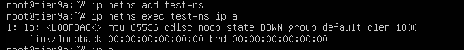

-> Chúng ta chưa có network cụ thể cho nó lên mới chỉ hiện địa chỉ loopback

### 2. Chức năng của Namespace trong OpenStack ?

Tạo router ảo
Cấp DHCP
Thực hiện NAT
Cách ly tenant network (trong Multi-tenant)

=> Giúp 1 máy vật lí có thể chứa hàng trăm router riêng biệt

### 3. Các loại namespace trong OpenStack

Để xem có bao nhiêu **namespace** đang tồn tại đồng thời ta dùng câu lệnh :

```bash
ip netns
#hoặc
ip netns list
```

Ta sẽ thấy có những loại **namespace** sau:

#### `qrouter-xxxxx`

-> Đây là **namespace** của **Virtual Router**.

Ví dụ: `qrouter-3fa2b...`

Bên trong nó có:

- Interface nội bộ (qr-xxxx)
- Interface external (qg-xxxx)
- Routing table
- iptables NAT rule

-> Có vai trò tương tự như 1 Router vật lí (SNAT, DNAT, Routing table)

### 4. Luồng thực tế: VM trong OPStack ra Internet


### 5. Namespace giúp cách ly tenant thế nào ?

Tenant A và Tenant B:

- Mỗi tenant có router riêng
- Router nằm trong namespace khác nhau
- Routing table hoàn toàn tách biệt

=> Không thể nhìn thấy nhau nếu không có route.

### 6. Một số lệnh hay dùng trong namespace

Xem namespace:

```bash
ip netns
```

Vào router namespace:

```bash
ip netns exec qrouter-xxx bash
```

Kiểm tra NAT:

```bash
iptables -t nat -L -n -v
```

### 7. Namespace khác với VM ở điểm gì?

| VM               | Namespace              |
| ---------------- | ---------------------- |
| Có kernel riêng  | Dùng chung kernel      |
| Có CPU/RAM riêng | Chỉ tách network stack |
| Nặng hơn         | Rất nhẹ                |

=> **Namespace** giống container nhưng chỉ tách phần mạng.

### 8. Mối liên hệ Namespace với OVS

Namespace không phải là OVS.

Namespace chứa:

- Interface `qr-`
- Interface `qg-`

Các interface này được gắn vào:

`br-int` (của OVS)
`br-ex` (của OVS)

Thông qua `veth` pair.

-> Còn switching vẫn do Open vSwitch xử lý.

## LAB

Thực hiện lab trên môi trường máy ảo chạy Ubuntu Server 22.04, đã cài OpenVSwitch

`Note`: Nên thực hiện clone và snapshot máy ảo thuận tiện cho việc khôi phục trong quá trình thử nghiệm

### Sơ đồ lab

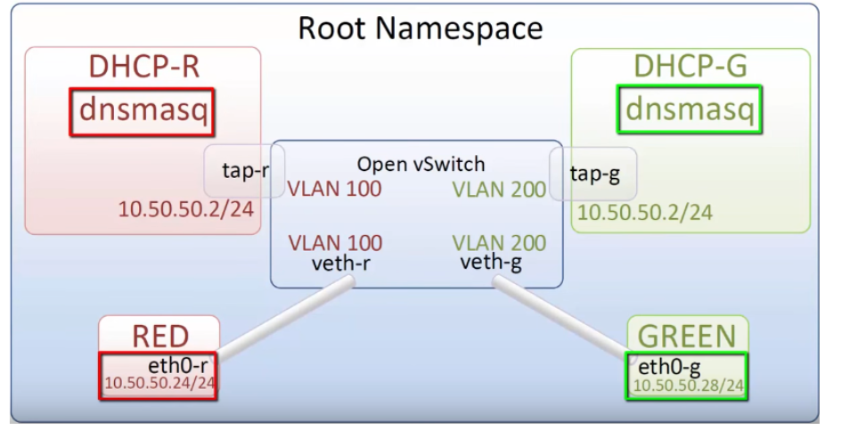

### Thực hành

Tạo 2 **Namespace** đóng vai trò VM tenant:

```bash
ip netns add red
ip netns add green
ip netns exec red ip link       # Kiểm tra xem đã tạo được chưa
ip netns exec green ip link
```

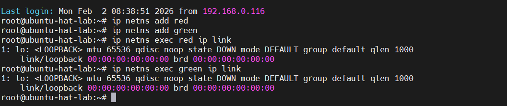

Tạo OVS bridge:

```bash
ovs-vsctl add-br ovs1
ovs-vsctl show
```

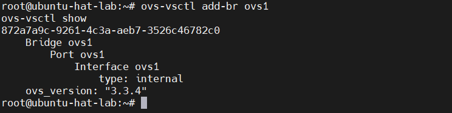

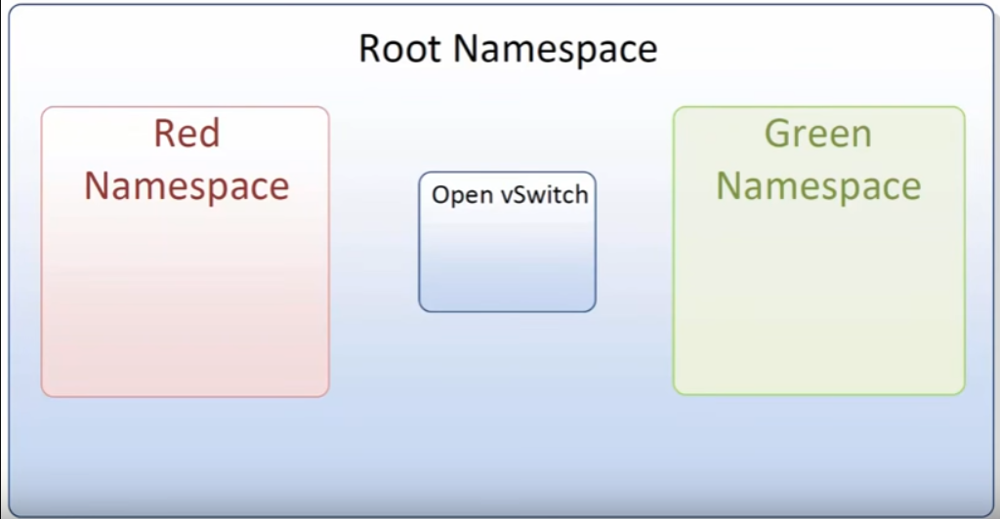

Tạo kết nối từ ovs tới namespace tương ứng(hay còn gọi `veth` pair):

```bash
ip link add eth0-r type veth peer name veth-r
ip link set eth0-r netns red
ovs-vsctl add-port ovs1 veth-r
```

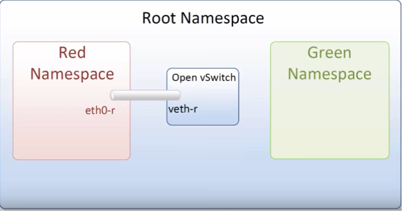

```bash
ip link add eth0-g type veth peer name veth-g
ip link set eth0-g netns green
ovs-vsctl add-port ovs1 veth-g
```

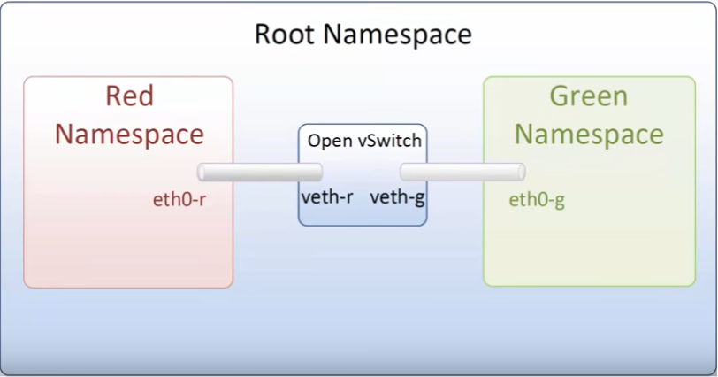

Check kiểm tra OVS đã kết nối với namespace chưa:

```bash
ovs-vsctl show
```

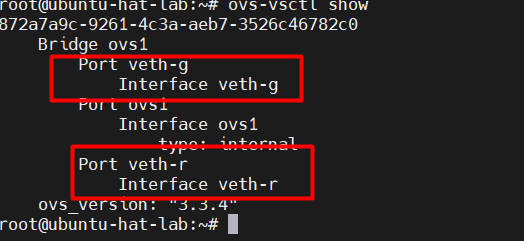

Cấu hình các interface (Gán IP cho các Interface)

```bash
ip link set veth-r up                               #  up interface veth-r để kết nối
ip link set veth-g up
ip netns exec red ip link set lo up                 # bật cả địa chỉ loop để không lỗi service
ip netns exec red ip link set eth0-r up             # up interface eth0-r 
ip netns exec green ip link set lo up
ip netns exec green ip link set eth0-g up
ip netns exec red ip addr add 10.0.0.1/24 dev eth0-r     # Gán IP static cho từng interface
ip netns exec green ip addr add 10.0.0.2/24 dev eth0-g
ip netns exec green ip a
ip netns exec red ip a
```

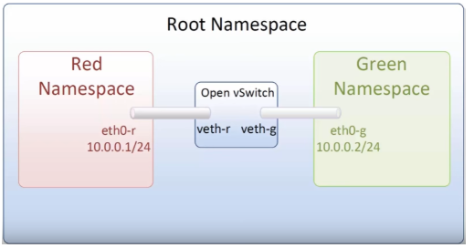

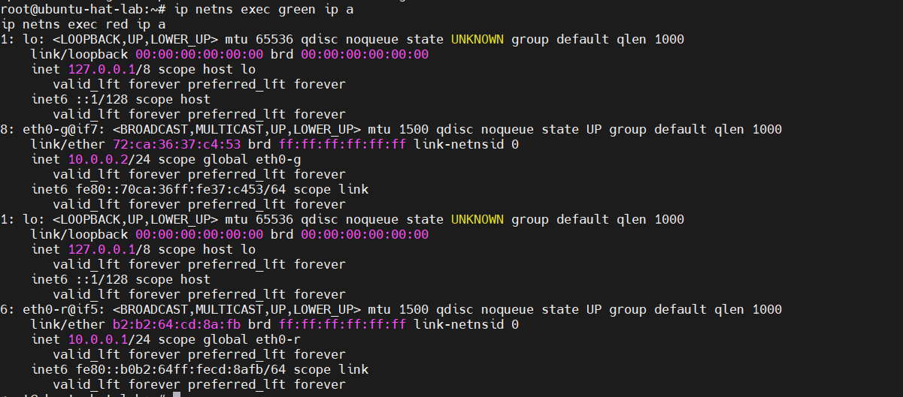

-> Vào con namespace 2 ta ping đc IP 10.0.0.2 là success.

Cấu hình DHCP và tag VLAN cho 2 namespace:

```bash
ovs-vsctl set port veth-r tag=100       # Tag VLan đối với kết nối đi qua veth-r
ovs-vsctl set port veth-g tag=200
```

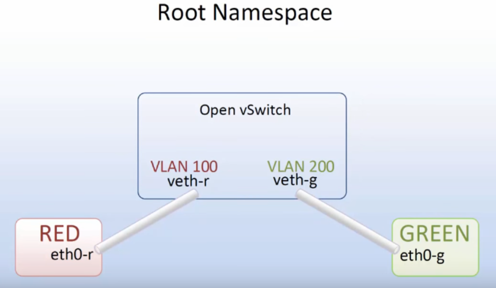

Xoá IP static ta vừa gán:

```bash
ip netns exec red ip address del 10.0.0.1/24 dev eth0-r # xoá địa chỉ ip static đi vì sắp cấu hình dhcp
ip netns exec green ip address del 10.0.0.2/24 dev eth0-g
```

Tạo namespace DHCP:

```bash
ip netns add dhcp-r                     # Cấu hình thêm 1 namespace mới có tên dhcp-r
ip netns add dhcp-g
```

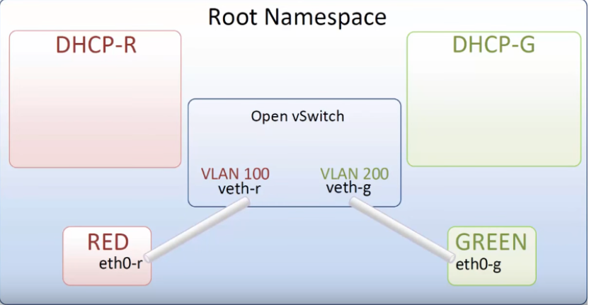

Cấu hình thêm NIC ảo(`tap`) trên OVS và gán `VLANtag` khi packet đi qua:

```bash
ovs-vsctl add-port ovs1 tap-r                # Thêm một cổng logic tap-r trên switch ovs1
ovs-vsctl set interface tap-r type=internal  # Cấu hình internal interface
ovs-vsctl set port tap-r tag=100             # Gán VLAN tag 100 cho port này

ovs-vsctl add-port ovs1 tap-g                # Thêm một cổng logic tap-g trên switch ovs1
ovs-vsctl set interface tap-g type=internal  
ovs-vsctl set port tap-g tag=200             # Gán VLAN tag 200 cho port này

ovs-vsctl show
```

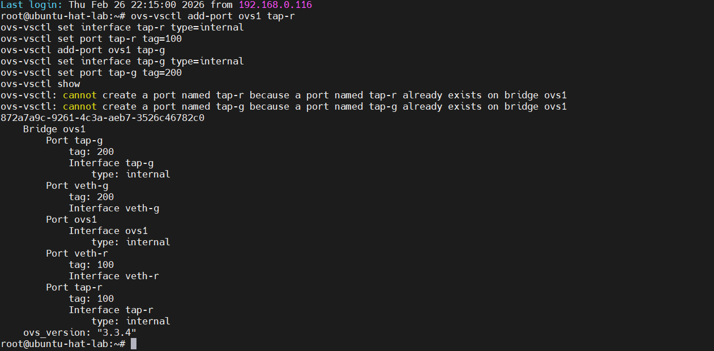

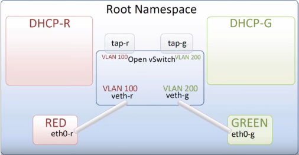

Down các NIC trước khi Move:

```bash
ip link set tap-r down
ip link set tap-g down
```

Chuyển các `tap` từ namespace mặc định sang namespace `dhcp` tương ứng

```bash
ip link set tap-r netns dhcp-r 
ip link set tap-g netns dhcp-g
```

Tiếp theo cấu hình IP cho từng interface trong namespace `dhcp`

```bash
ip netns exec dhcp-r bash # Mở shell trong namespace dhcp-r
ip link set dev lo up     # Bật interface loopback lên 
ip link set dev tap-r up  # Bật interface tap-r do đã chuyển vào namespace dhcp-r
ip address add 10.50.50.2/24 dev tap-r # Gán IP mới cho nó (Đóng vai trò DHCP Server cho mạng)
exit

ip netns exec dhcp-g bash
ip link set dev lo up
ip link set dev tap-g up
ip address add 10.50.50.2/24 dev tap-g
exit
```

Cho chạy DHCP Server. Trước hết cài gói dnsmasq:

```bash
apt install dnsmasq
```

Cấu hình range:

```bash
ip netns exec dhcp-r dnsmasq --interface=tap-r --dhcp-range=10.50.50.10,10.50.50.100,255.255.255.0
ip netns exec dhcp-g dnsmasq --interface=tap-g --dhcp-range=10.50.50.10,10.50.50.100,255.255.255.0
```

Cho 2 con client là red với green namespace được cấp phát IP từ DHCP Server:

```bash
ip netns exec red dhclient eth0-r
ip netns exec green dhclient eth0-g
```

Kết quả:

```bash
ip netns exec red ip a
ip netns exec green ip a
```

=> Sau khi nhận IP từ Server thì check ip hiện ra nhận IP là đã thành công.