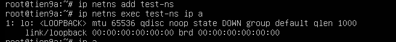
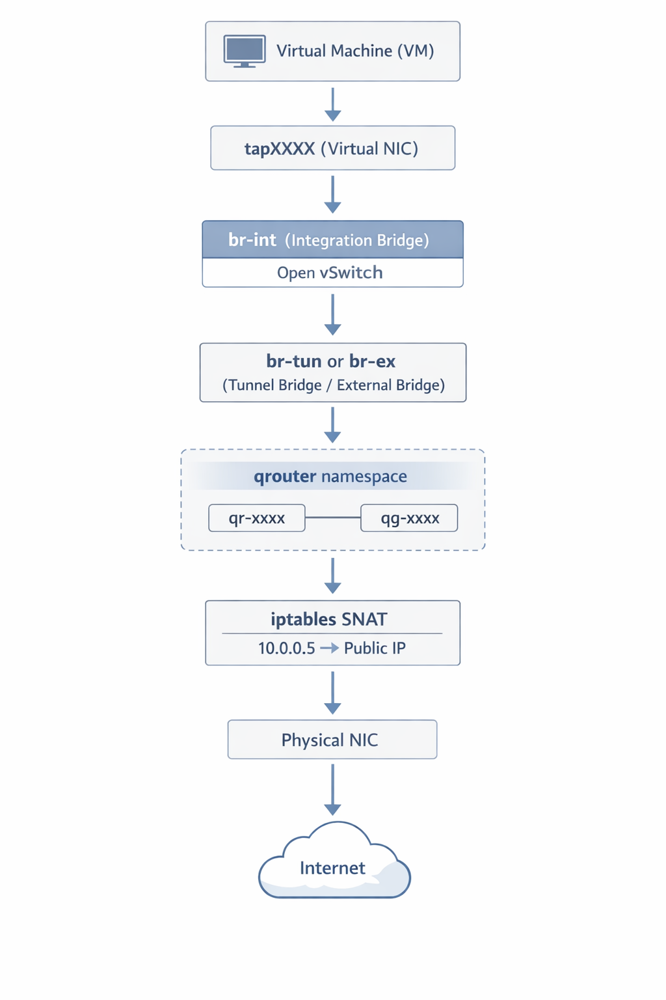

# TÌM HIỂU NAMESPACE TRONG NEUTRON

> Tài liệu này cập nhật theo OpenStack 2026.1 Gazpacho / Neutron 28.x. Nội dung tập trung vào lý thuyết, kiến trúc và cách đọc hiểu namespace trong Neutron, không viết lab tạo namespace thủ công.

## I. Namespace là gì?

**Namespace** là cơ chế của Linux dùng để tách biệt một nhóm tài nguyên cho từng tiến trình hoặc nhóm tiến trình.

Linux có nhiều loại namespace:

| Loại namespace | Tách biệt cái gì? |
| --- | --- |
| `pid` | Process ID |
| `mnt` | Mount point |
| `uts` | Hostname, domain name |
| `ipc` | Inter-process communication |
| `user` | User ID, group ID |
| `net` | Network stack |
| `cgroup` | Cgroup view |

Trong Neutron, thứ quan trọng nhất là **network namespace**.

## II. Network namespace là gì?

**Network namespace** là một network stack riêng bên trong cùng một Linux host.

Mỗi network namespace có riêng:

- Interface.
- IP address.
- Routing table.
- ARP/neighbor table.
- iptables/nftables rule.
- Conntrack state.
- Socket.
- Loopback interface.

Nói đơn giản: một máy Linux có thể chứa nhiều "ngăn mạng" độc lập. Mỗi ngăn có thể có route, IP, NAT rule và interface riêng.

```text
Linux host
  |
  |-- root namespace
  |     |-- eth0
  |     |-- br-int
  |     |-- br-ex
  |
  |-- qrouter-xxx
  |     |-- qr-xxx
  |     |-- qg-xxx
  |
  |-- qdhcp-yyy
        |-- tap/ns interface
```



## III. Vì sao Neutron cần network namespace?

Neutron dùng namespace để tạo nhiều router, DHCP service và metadata path độc lập trên cùng một node vật lý.

Namespace giúp Neutron giải quyết các vấn đề sau:

- **Overlapping IP**: nhiều project có thể cùng dùng `10.0.0.0/24` mà không đụng nhau.
- **Router ảo riêng**: mỗi Neutron router có routing table và NAT rule riêng.
- **DHCP riêng theo network**: mỗi network có DHCP service tách biệt.
- **Metadata path riêng**: VM lấy metadata qua `169.254.169.254` mà không lẫn giữa project/network.
- **Cách ly tenant**: tenant A không nhìn thấy routing table hoặc iptables của tenant B.
- **Triển khai nhiều service trên một node**: một network node có thể chứa hàng trăm router/DHCP namespace.

Ví dụ hai tenant trùng CIDR:

```text
Tenant A network: 10.0.0.0/24
Tenant B network: 10.0.0.0/24

Nếu không có namespace:
  Linux host không thể có hai routing table giống nhau cho hai mạng khác ngữ cảnh.

Nếu có namespace:
  qrouter-A có route 10.0.0.0/24 của Tenant A
  qrouter-B có route 10.0.0.0/24 của Tenant B
```

## IV. Namespace khác gì VM và container?

| Tiêu chí | VM | Container | Network namespace |
| --- | --- | --- | --- |
| Kernel | Kernel riêng | Dùng chung kernel host | Dùng chung kernel host |
| Mức cô lập | Cao | Trung bình/cao tùy cấu hình | Chỉ tách network stack |
| Tài nguyên | Nặng hơn | Nhẹ | Rất nhẹ |
| Mục đích | Chạy OS/ứng dụng đầy đủ | Chạy ứng dụng cô lập | Tách interface, route, NAT, socket |
| Ví dụ | VM KVM | Docker/LXC | `qrouter`, `qdhcp`, `ovnmeta` |

Network namespace không phải VM. Nó chỉ tách phần mạng.

## V. Namespace trong Neutron nằm ở đâu?

Namespace xuất hiện trên node đang chạy service tương ứng.

### 1. Với ML2/OVS truyền thống

Namespace thường nằm trên:

- Network node.
- Compute node nếu DHCP agent chạy trên compute.
- Compute node nếu dùng DVR.

Các namespace phổ biến:

| Namespace | Nằm ở đâu? | Vai trò |
| --- | --- | --- |
| `qdhcp-<network-id>` | DHCP agent node | DHCP service cho Neutron network |
| `qrouter-<router-id>` | L3 agent node | Router, route, SNAT/DNAT |
| `snat-<router-id>` | Network node khi dùng DVR | Centralized SNAT |
| `fip-<external-network-id>` | Compute/network node khi dùng DVR | Floating IP namespace |

### 2. Với ML2/OVN hiện đại

OVN không dùng `qrouter` và `qdhcp` theo mô hình truyền thống cho L2/L3/DHCP thông thường.

Thay vào đó:

- Router là **OVN Logical Router**.
- Network là **OVN Logical Switch**.
- Security group là **OVN ACL/Port Group**.
- DHCP có thể do OVN native xử lý.
- East/West routing được phân tán qua logical flow.

Tuy nhiên OVN vẫn có namespace cho metadata:

| Namespace | Vai trò |
| --- | --- |
| `ovnmeta-<network-id>` | Metadata proxy local cho network có VM trên compute node |

Trong một số triển khai đặc biệt, ví dụ Ironic/bare metal hoặc cấu hình bật DHCP agent cùng OVN, vẫn có thể thấy một số namespace kiểu truyền thống.

## VI. Các loại namespace quan trọng trong Neutron

### 1. `qdhcp-<network-id>`

`qdhcp` là namespace của DHCP service trong mô hình Neutron agent truyền thống.

Ví dụ:

```text
qdhcp-8b868082-e312-4110-8627-298109d4401c
```

Bên trong namespace này thường có:

- Interface nối vào Neutron network.
- IP thuộc subnet của network.
- Process `dnsmasq`.
- File cấu hình host lease/DHCP option do Neutron quản lý.

Vai trò:

- Cấp IP cho VM.
- Cấp gateway, DNS, route, MTU option.
- Có thể hỗ trợ metadata route trong một số mô hình.

Mô hình:

```text
VM
 |
 v
Tenant network
 |
 v
qdhcp-<network-id>
 |
 v
dnsmasq cấp DHCP lease
```

Khi nào có `qdhcp`?

- Network bật DHCP.
- DHCP agent được bật và schedule cho network đó.
- Mô hình ML2/OVS hoặc Linux bridge truyền thống.

Khi nào có thể không thấy `qdhcp`?

- Network tắt DHCP.
- Dùng OVN native DHCP.
- Dùng config drive thay metadata/DHCP trong một số triển khai.

### 2. `qrouter-<router-id>`

`qrouter` là namespace của Neutron L3 router trong mô hình L3 agent truyền thống.

Ví dụ:

```text
qrouter-17db2a15-e024-46d0-9250-4cd4d336a2cc
```

Bên trong namespace này thường có:

| Interface | Ý nghĩa |
| --- | --- |
| `qr-xxxx` | Router interface nối vào internal/self-service subnet |
| `qg-xxxx` | Router gateway interface nối ra external/provider network |
| `lo` | Loopback |

Vai trò:

- Route giữa các tenant subnet.
- Route từ tenant network ra external network.
- SNAT cho VM private IP đi ra ngoài.
- DNAT cho floating IP đi vào VM.
- Redirect metadata request tới metadata proxy trong một số mô hình.

Mô hình:

```text
Self-service network
      |
      v
 qr-* trong qrouter
      |
      v
 Routing table + NAT rule
      |
      v
 qg-* trong qrouter
      |
      v
 External/provider network
```

### 3. `snat-<router-id>`

`snat` namespace xuất hiện trong mô hình **DVR - Distributed Virtual Routing**.

Vai trò:

- Xử lý centralized SNAT cho router phân tán.
- Thường nằm trên network node.
- Dùng cho traffic VM private IP đi ra ngoài khi không dùng floating IP distributed.

Mô hình:

```text
VM private IP
  |
  v
DVR routing local
  |
  v
snat-<router-id> trên network node
  |
  v
External network
```

### 4. `fip-<external-network-id>`

`fip` namespace cũng liên quan đến DVR.

Vai trò:

- Hỗ trợ floating IP trong mô hình distributed.
- Tạo đường ra/vào floating IP gần compute node hơn.
- Giảm bottleneck qua network node cho floating IP traffic.

Tùy cấu hình DVR và version triển khai, số lượng và vị trí `fip` namespace có thể khác nhau.

### 5. `ovnmeta-<network-id>`

`ovnmeta` namespace xuất hiện trong mô hình **ML2/OVN** để phục vụ metadata.

Ví dụ:

```text
ovnmeta-8b868082-e312-4110-8627-298109d4401c
```

Vai trò:

- Chạy metadata proxy local theo network.
- Giúp VM truy cập metadata qua `169.254.169.254`.
- Bên trong thường có HAProxy hoặc proxy path nối về `ovn-metadata-agent`.

Mô hình:

```text
VM
 |
 | http://169.254.169.254
 v
ovnmeta-<network-id>
 |
 v
ovn-metadata-agent
 |
 v
Nova metadata API
```

## VII. Namespace liên hệ với Neutron object như thế nào?

Tên namespace thường chứa UUID của Neutron resource.

| Namespace | UUID tương ứng |
| --- | --- |
| `qdhcp-<network-id>` | Neutron network ID |
| `qrouter-<router-id>` | Neutron router ID |
| `snat-<router-id>` | Neutron router ID |
| `fip-<external-network-id>` | External network ID |
| `ovnmeta-<network-id>` | Neutron network ID |

Ví dụ:

```text
qrouter-17db2a15-e024-46d0-9250-4cd4d336a2cc
```

Router tương ứng:

```bash
openstack router show 17db2a15-e024-46d0-9250-4cd4d336a2cc
```

Network tương ứng với `qdhcp`:

```bash
openstack network show 8b868082-e312-4110-8627-298109d4401c
```

Các lệnh trên là lệnh quan sát/troubleshooting, không phải lab tạo mới.

## VIII. Interface trong namespace

### 1. Interface `qr-*`

`qr-*` là router interface nối vào tenant/internal subnet.

Ví dụ:

```text
qr-99b8677c-40
```

Ý nghĩa:

- Địa chỉ IP thường là gateway của subnet tenant.
- VM trong subnet dùng IP này làm default gateway.
- Interface này nằm trong `qrouter` namespace.

Mô hình:

```text
VM 10.0.0.10
  |
  v
Tenant network 10.0.0.0/24
  |
  v
qr-* = 10.0.0.1 trong qrouter
```

### 2. Interface `qg-*`

`qg-*` là router gateway interface nối ra external/provider network.

Ý nghĩa:

- Có IP thuộc external network.
- Dùng để SNAT private IP ra ngoài.
- Là nơi floating IP NAT đi qua trong mô hình L3 agent truyền thống.

Mô hình:

```text
qrouter
  |
  |-- qr-* -> tenant network
  |
  |-- qg-* -> external/provider network
```

### 3. Interface DHCP

Trong `qdhcp` namespace, interface DHCP có thể có dạng:

```text
tapxxxx
ns-xxxx
```

Tên cụ thể phụ thuộc driver và version. Interface này tương ứng với Neutron port có `device_owner=network:dhcp`.

### 4. Interface trong DVR

Trong DVR có thể gặp thêm các interface như:

- `rfp-*`
- `fpr-*`
- `sg-*`

Các interface này phục vụ kết nối giữa router namespace, floating IP namespace và OVS bridge. Không phải môi trường nào cũng có vì phụ thuộc cấu hình DVR.

## IX. Namespace và Open vSwitch

Namespace không phải là OVS. Chúng làm hai việc khác nhau.

| Thành phần | Vai trò |
| --- | --- |
| Namespace | Chứa network stack riêng: interface, IP, route, NAT |
| OVS | Switch ảo, forward packet giữa port/bridge/tunnel |
| Neutron agent | Tạo port, namespace, flow, NAT rule theo state từ Neutron |

Trong ML2/OVS, namespace thường nối vào `br-int` bằng port do Neutron agent tạo.

Mô hình đơn giản:

```text
qrouter namespace
   |
   | qr-* / qg-*
   v
br-int
   |
   v
br-tun hoặc br-ex
```

Provider/external path:

```text
qrouter qg-*
   |
   v
br-int
   |
   v
patch port
   |
   v
br-ex / br-provider
   |
   v
Physical network
```

Self-service path:

```text
VM tap
   |
   v
br-int
   |
   v
tenant network
   |
   v
qrouter qr-*
```

## X. Luồng VM ra Internet qua namespace

Mô hình cũ trong tài liệu:



Luồng đi ra Internet với self-service network và L3 agent truyền thống:

```text
VM
 |
 v
tap port trên compute node
 |
 v
br-int
 |
 v
VXLAN/Geneve tunnel hoặc VLAN path
 |
 v
br-int trên network node
 |
 v
qr-* trong qrouter namespace
 |
 v
Routing + SNAT
 |
 v
qg-* trong qrouter namespace
 |
 v
br-ex / provider bridge
 |
 v
Physical network / Internet
```

Giải thích:

- VM gửi packet tới default gateway.
- Default gateway chính là IP trên `qr-*`.
- Packet đi vào `qrouter`.
- `qrouter` dùng routing table để quyết định next-hop.
- Nếu đi ra external network bằng IPv4 private, NAT rule đổi source IP sang IP trên gateway/floating path.
- Packet rời namespace qua `qg-*`.

## XI. Floating IP và NAT trong namespace

### 1. SNAT

SNAT dùng khi VM private IP đi ra ngoài.

```text
VM: 10.0.0.10
Router external IP: 203.0.113.10

Trước NAT:
  src=10.0.0.10 dst=8.8.8.8

Sau SNAT:
  src=203.0.113.10 dst=8.8.8.8
```

Trong mô hình OVS/L3 agent, SNAT rule nằm trong `qrouter` hoặc `snat` namespace.

### 2. DNAT / Floating IP

DNAT dùng khi client ngoài truy cập VM qua floating IP.

```text
Floating IP: 203.0.113.25
Fixed IP:    10.0.0.10

Trước DNAT:
  dst=203.0.113.25

Sau DNAT:
  dst=10.0.0.10
```

Trong mô hình L3 agent truyền thống, DNAT thường nằm trong `qrouter`.

Trong DVR, floating IP có thể liên quan thêm `fip` namespace.

## XII. Metadata và namespace

VM thường lấy metadata từ địa chỉ:

```text
169.254.169.254
```

Metadata dùng cho:

- SSH public key.
- Cloud-init user-data.
- Hostname.
- Instance ID.
- Network config.

### 1. Metadata trong OVS/L3 agent truyền thống

Trong nhiều mô hình OVS truyền thống:

```text
VM
 |
 | http://169.254.169.254
 v
qrouter hoặc qdhcp namespace
 |
 v
neutron-metadata-agent
 |
 v
nova-metadata-api
```

Neutron có thể redirect metadata request bằng iptables rule trong namespace.

### 2. Metadata trong OVN

Trong OVN:

```text
VM
 |
 v
ovnmeta-<network-id>
 |
 v
ovn-metadata-agent
 |
 v
nova-metadata-api
```

Đây là điểm quan trọng khi cập nhật tài liệu mới: dùng OVN không có nghĩa là không còn namespace nào. Có thể không còn `qrouter/qdhcp`, nhưng vẫn có `ovnmeta-*` để phục vụ metadata.

## XIII. Namespace trong Provider network

Provider network không nhất thiết cần `qrouter`.

Trường hợp thường gặp:

```text
VM
 |
 v
Provider network
 |
 v
Physical gateway/router
```

Nếu provider network bật DHCP qua Neutron, có thể có:

```text
qdhcp-<provider-network-id>
```

Nếu VM dùng gateway vật lý, L3 routing nằm ngoài OpenStack, không nằm trong `qrouter`.

Nếu provider network được đánh dấu external và dùng làm gateway cho Neutron router, traffic self-service network ra ngoài sẽ đi qua `qrouter` hoặc OVN logical router.

## XIV. Namespace trong Self-service network

Self-service network thường cần namespace hơn provider network trong mô hình OVS truyền thống.

Các thành phần:

```text
Self-service network
  |
  |-- qdhcp-<network-id>  cấp DHCP
  |
  |-- qrouter-<router-id> route/NAT ra external
```

Nếu có nhiều self-service network nối vào cùng một router:

```text
qrouter-<router-id>
  |
  |-- qr-A -> network A
  |
  |-- qr-B -> network B
  |
  |-- qg-X -> external network
```

East/West khác subnet sẽ đi qua router namespace. East/West cùng subnet không cần router namespace.

## XV. Namespace và VRF

VRF - Virtual Routing and Forwarding - là khái niệm nhiều routing table cùng tồn tại trên cùng một router.

Network namespace có thể hiểu gần giống VRF ở mức Linux:

- Mỗi namespace có routing table riêng.
- Cùng một destination IP có thể được route khác nhau trong từng namespace.
- Mỗi namespace có firewall/NAT state riêng.

Ví dụ:

```text
qrouter-A:
  default route -> external gateway A

qrouter-B:
  default route -> external gateway B
```

Hai router này nằm trên cùng một node vật lý nhưng không dùng chung routing table.

## XVI. Các lệnh quan sát namespace

Phần này chỉ liệt kê lệnh đọc trạng thái để hiểu và troubleshoot, không phải lab.

### 1. Liệt kê namespace

```bash
ip netns list
```

### 2. Xem interface trong namespace

```bash
ip netns exec qrouter-<router-id> ip addr
ip netns exec qdhcp-<network-id> ip addr
```

### 3. Xem route trong namespace

```bash
ip netns exec qrouter-<router-id> ip route
```

### 4. Xem NAT rule

```bash
ip netns exec qrouter-<router-id> iptables -t nat -S
```

Với hệ thống dùng nftables backend, có thể cần xem thêm:

```bash
ip netns exec qrouter-<router-id> nft list ruleset
```

### 5. Xem process trong namespace

```bash
ip netns pids qdhcp-<network-id>
ip netns pids ovnmeta-<network-id>
```

### 6. Mapping namespace với Neutron object

```bash
openstack network show <network-id>
openstack router show <router-id>
openstack port list --router <router-id>
openstack port list --network <network-id>
```

## XVII. Cách đọc namespace khi troubleshooting

### 1. VM không nhận IP

Kiểm tra theo hướng:

```text
Subnet có enable DHCP không?
  |
  v
Có qdhcp namespace hoặc OVN native DHCP không?
  |
  v
DHCP port có tồn tại không?
  |
  v
dnsmasq/OVN DHCP có hoạt động không?
```

Lệnh quan sát:

```bash
openstack subnet show <subnet-id> -c enable_dhcp
openstack port list --device-owner network:dhcp
ip netns list | grep qdhcp
```

### 2. VM không ra Internet

Kiểm tra theo hướng:

```text
VM có default route không?
  |
  v
Router có interface vào subnet không?
  |
  v
Router có external gateway không?
  |
  v
qrouter/snat namespace có route và NAT rule không?
  |
  v
br-ex/provider network có đi ra physical network không?
```

Lệnh quan sát:

```bash
openstack router show <router-id>
openstack router port list <router-id>
ip netns exec qrouter-<router-id> ip route
ip netns exec qrouter-<router-id> iptables -t nat -S
```

### 3. Floating IP không vào được VM

Kiểm tra theo hướng:

```text
Floating IP đã associate với port chưa?
  |
  v
Security group có cho traffic vào chưa?
  |
  v
DNAT rule trong router/fip namespace có chưa?
  |
  v
Provider/external network có route tới floating IP pool không?
```

Lệnh quan sát:

```bash
openstack floating ip list
openstack floating ip show <floating-ip>
openstack port show <vm-port-id>
```

### 4. Metadata không hoạt động

Dấu hiệu:

- VM boot không nhận SSH key.
- Cloud-init timeout.
- Không truy cập được `169.254.169.254`.

Kiểm tra theo backend:

| Backend | Cần xem |
| --- | --- |
| OVS truyền thống | `qrouter`, `qdhcp`, `neutron-metadata-agent` |
| OVN | `ovnmeta-*`, `ovn-metadata-agent`, route metadata |

## XVIII. Những điểm dễ nhầm

### 1. Namespace không phải tenant network

Tenant network là Neutron resource. Namespace là cơ chế Linux để hiện thực một số chức năng như DHCP, router, NAT, metadata.

### 2. Provider network có thể không có router namespace

Nếu VM nằm trực tiếp trên provider network và gateway là router vật lý, Neutron không cần tạo `qrouter`.

### 3. Dùng OVN không còn nhiều namespace như OVS agent

OVN chuyển L2/L3/DHCP sang logical datapath. Vì vậy không thấy `qrouter` không nhất thiết là lỗi.

### 4. Không nên tự sửa namespace bằng tay

Namespace do Neutron agent hoặc OVN service quản lý. Sửa IP, route, iptables trong namespace bằng tay có thể bị agent ghi đè hoặc làm cloud mất ổn định.

### 5. Namespace tên ngắn nhưng resource ID dài

Interface như `qr-xxxx`, `qg-xxxx` thường bị cắt ngắn từ port UUID. Khi mapping cần dùng `openstack port list/show`.

## XIX. So sánh OVS truyền thống và OVN về namespace

| Thành phần | ML2/OVS truyền thống | ML2/OVN hiện đại |
| --- | --- | --- |
| Router | `qrouter-*` qua L3 agent | OVN logical router |
| DHCP | `qdhcp-*` qua DHCP agent | OVN native DHCP hoặc DHCP agent tùy cấu hình |
| Metadata | Metadata agent qua `qrouter/qdhcp` path | `ovnmeta-*` + OVN metadata agent |
| NAT | iptables trong `qrouter/snat/fip` | NAT logical flow trong OVN |
| Debug chính | `ip netns`, `iptables`, `ovs-vsctl` | `ovn-nbctl`, `ovn-sbctl`, `ovn-trace`, `ovnmeta-*` |
| Namespace xuất hiện nhiều | Có | Ít hơn |

## XX. Tổng kết

Network namespace là cơ chế Linux giúp Neutron tạo nhiều network stack độc lập trên cùng một node.

Các ý cần nhớ:

- Mỗi namespace có interface, IP, route, iptables/nftables và socket riêng.
- `qdhcp-*` phục vụ DHCP cho network.
- `qrouter-*` phục vụ routing, SNAT, DNAT cho router trong mô hình OVS truyền thống.
- `snat-*` và `fip-*` thường liên quan DVR.
- `ovnmeta-*` phục vụ metadata trong mô hình OVN.
- Namespace giúp OpenStack hỗ trợ overlapping IP giữa nhiều tenant.
- Trong OpenStack hiện đại dùng OVN, không thấy `qrouter/qdhcp` không đồng nghĩa với lỗi.
- Không nên chỉnh namespace thủ công; chỉ nên quan sát để troubleshoot.

## XXI. Tài liệu tham khảo

- OpenStack 2026.1 Documentation: <https://docs.openstack.org/2026.1/>
- Neutron 2026.1 Documentation: <https://docs.openstack.org/neutron/2026.1/>
- Network namespaces: <https://docs.openstack.org/neutron/2026.1/admin/intro-network-namespaces.html>
- Neutron Networking service overview: <https://docs.openstack.org/neutron/2026.1/install/common/get-started-networking.html>
- Open vSwitch Provider networks: <https://docs.openstack.org/neutron/2026.1/admin/deploy-ovs-provider.html>
- Open vSwitch Self-service networks: <https://docs.openstack.org/neutron/2026.1/admin/deploy-ovs-selfservice.html>
- OVN reference architecture: <https://docs.openstack.org/neutron/2026.1/admin/ovn/refarch/refarch.html>
- OVN features: <https://docs.openstack.org/neutron/2026.1/admin/ovn/features.html>
