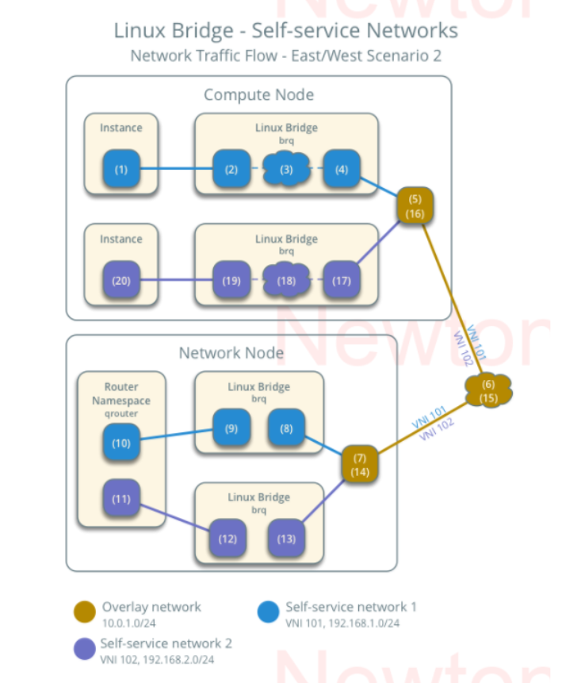
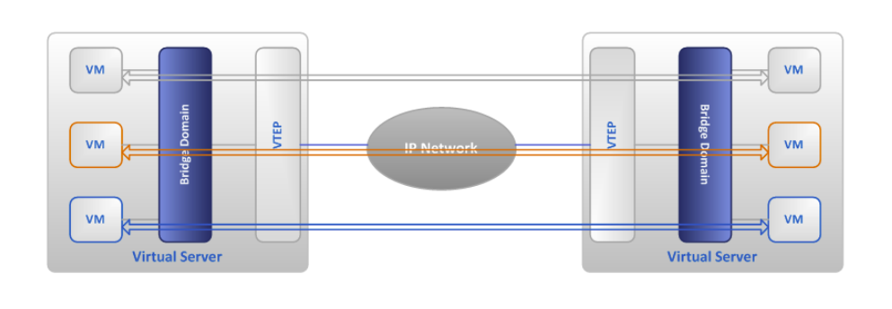
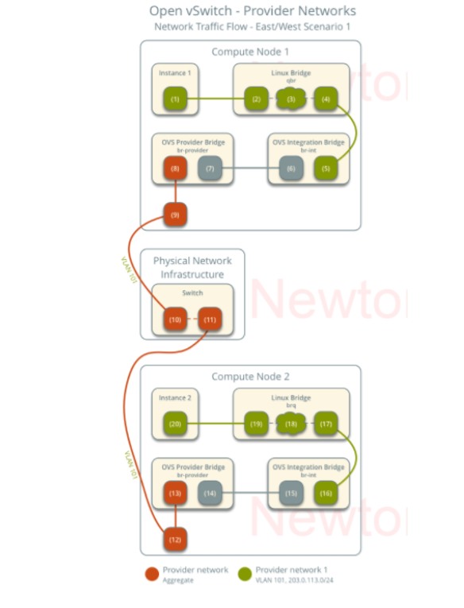
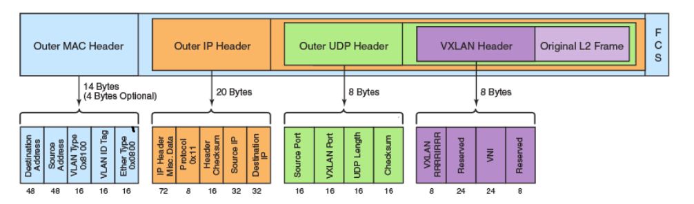

# TÌM HIỂU VXLAN VÀ GRE TRONG OPENSTACK NEUTRON

> Tài liệu này cập nhật theo OpenStack 2026.1 Gazpacho / Neutron 28.x. Nội dung tập trung vào lý thuyết, kiến trúc, cách Neutron dùng VXLAN/GRE và các điểm cấu hình cần hiểu.

## I. Mục tiêu

Sau khi đọc tài liệu này, cần nắm được:

- Vì sao cloud cần overlay network thay vì chỉ dùng VLAN.
- VXLAN và GRE đóng gói gói tin như thế nào.
- VXLAN/GRE nằm ở đâu trong kiến trúc OpenStack Neutron.
- Sự khác nhau giữa VXLAN, GRE, VLAN và Geneve.
- Các điểm cập nhật quan trọng trong Neutron mới, đặc biệt là ML2/OVS, ML2/OVN và thay đổi `tenant_network_types` sang `project_network_types`.

## II. Vì sao cần Overlay Network?

Trong môi trường ảo hóa và cloud, một cụm OpenStack có thể có rất nhiều project, network và VM chạy trên nhiều compute node khác nhau. Mỗi VM cần MAC, IP và kết nối mạng riêng.

Nếu chỉ dùng VLAN:

- VLAN ID chỉ có 12 bit, thực tế dùng được khoảng 4094 VLAN.
- Mỗi tenant network thường cần một segment riêng.
- Khi số lượng project/network tăng lớn, VLAN ID dễ bị thiếu.
- Hạ tầng switch vật lý phải mang nhiều VLAN, cấu hình phức tạp và khó mở rộng.
- Việc di chuyển VM giữa compute node cần mạng L2 hiện diện ở nhiều nơi.

Overlay network giải quyết vấn đề này bằng cách tạo mạng L2 ảo chạy bên trên mạng IP vật lý L3.

```text
VM network / tenant network
        |
        v
Overlay: VXLAN hoặc GRE
        |
        v
Underlay: mạng IP vật lý giữa các node
```

Nói ngắn gọn: **underlay chỉ cần route IP giữa các node**, còn **overlay tạo các mạng ảo riêng cho tenant**.



## III. Các khái niệm chính

| Khái niệm | Ý nghĩa |
| --- | --- |
| Underlay network | Mạng vật lý hoặc mạng IP thật kết nối controller, network node, compute node. |
| Overlay network | Mạng ảo được tạo bên trên underlay. VXLAN/GRE là hai kỹ thuật overlay. |
| VTEP | Virtual Tunnel Endpoint, điểm đóng gói và mở gói tunnel. Trong Neutron/OVS, thường nằm trên compute/network node. |
| Encapsulation | Đóng gói frame gốc của VM vào một header mới để đi qua underlay. |
| Decapsulation | Gỡ header overlay ở node đích để trả lại frame gốc cho VM. |
| Segment ID | ID phân biệt các mạng overlay. VXLAN dùng VNI, GRE dùng tunnel ID/key. |
| BUM traffic | Broadcast, Unknown unicast, Multicast. Đây là loại traffic dễ gây flood trong overlay. |
| MTU | Kích thước gói tối đa. Overlay thêm header nên phải tính MTU cẩn thận. |

## IV. Overlay hoạt động như thế nào?

Khi VM gửi packet sang VM ở node khác:

```text
VM nguồn
  |
  v
vSwitch local: br-int / br-tun
  |
  v
Đóng gói VXLAN hoặc GRE
  |
  v
Mạng IP underlay
  |
  v
Node đích mở gói
  |
  v
vSwitch đích chuyển frame tới VM đích
```



Một tunnel endpoint thường có hai phía:

- Phía trong nối với mạng ảo của VM.
- Phía ngoài nối với mạng IP underlay giữa các node.

Khi đóng gói, Neutron/OVS giữ nguyên frame gốc của VM, sau đó thêm outer header để underlay có thể định tuyến tới node đích.



Trong gói tin overlay:

- **Inner Ethernet/IP header**: địa chỉ MAC/IP thật của VM nguồn và VM đích.
- **Outer IP header**: địa chỉ IP của tunnel endpoint nguồn và tunnel endpoint đích.
- **Overlay header**: VNI hoặc GRE key dùng để xác định tenant network.

Điểm quan trọng: mạng vật lý không cần biết MAC của VM. Nó chỉ cần biết cách route IP giữa các tunnel endpoint.

## V. VXLAN là gì?

**VXLAN - Virtual Extensible LAN** là kỹ thuật tạo mạng L2 ảo trên mạng L3 bằng cách đóng gói frame Ethernet vào UDP.

Đặc điểm chính:

- Dùng UDP, cổng chuẩn phổ biến là `4789`.
- Dùng **VNI - VXLAN Network Identifier** dài 24 bit.
- Hỗ trợ hơn 16 triệu segment logic, lớn hơn rất nhiều so với VLAN.
- Phù hợp với cloud nhiều tenant và nhiều compute node.
- Hỗ trợ ECMP tốt hơn GRE vì underlay có thể hash theo UDP/IP.
- Được phần cứng mạng và NIC hiện đại hỗ trợ offload phổ biến hơn GRE.

```text
VM Ethernet frame
  |
  v
Outer Ethernet + Outer IP + UDP + VXLAN + Inner Ethernet frame
```

### 1. VXLAN header

VXLAN header dài 8 byte.



Các trường quan trọng:

| Trường | Ý nghĩa |
| --- | --- |
| Flags | Bit `I` được bật để báo VNI hợp lệ. |
| VNI | ID 24 bit dùng để phân biệt VXLAN segment. |
| Reserved | Các bit dự trữ, thường đặt bằng 0. |

VM trong cùng VNI có thể cùng một mạng L2 ảo. VM ở VNI khác nhau bị cách ly ở L2, trừ khi có router nối giữa các network đó.

### 2. Outer header của VXLAN

| Header | Vai trò |
| --- | --- |
| Outer Ethernet | Dùng để đi qua hop L2 kế tiếp trong underlay. |
| Outer IP | IP nguồn/đích là IP tunnel endpoint của node nguồn/node đích. |
| Outer UDP | UDP đích thường là `4789`; UDP nguồn thường được chọn để hỗ trợ hashing/ECMP. |
| VXLAN | Mang VNI xác định tenant network. |
| Inner Ethernet | Frame gốc của VM. |

### 3. VXLAN và MTU

VXLAN thường làm giảm MTU hữu dụng của VM khoảng 50 byte với IPv4 underlay thông thường:

```text
Inner Ethernet header 14 byte
Outer IP              20 byte
UDP                    8 byte
VXLAN                  8 byte
```

Outer Ethernet header vẫn tồn tại trên đường truyền vật lý, nhưng không được tính vào IP MTU của interface. Nếu underlay có VLAN tag hoặc dùng IPv6, overhead còn tăng thêm. Vì vậy cần tính MTU để tránh fragmentation.

Ví dụ dễ hiểu:

```text
Underlay MTU: 1500
VXLAN overhead: khoảng 50
MTU hữu dụng cho VM: khoảng 1450
```

Trong Neutron, các tham số như `global_physnet_mtu`, `path_mtu` và MTU của network giúp kiểm soát phần này.

## VI. GRE là gì?

**GRE - Generic Routing Encapsulation** là giao thức đóng gói gói tin bên trong IP tunnel. GRE ban đầu do Cisco phát triển, nhưng đã trở thành giao thức phổ biến trong nhiều hệ thống mạng.

Đặc điểm chính:

- Chạy trực tiếp trên IP, dùng IP protocol `47`.
- Không dùng TCP/UDP port.
- Có thể đóng gói nhiều loại payload khác nhau.
- Trong Neutron, GRE dùng tunnel ID/key để phân biệt project network.
- Được ML2/OVS hỗ trợ, nhưng không được ML2/OVN hỗ trợ.

```text
VM Ethernet frame
  |
  v
Outer Ethernet + Outer IP + GRE + Inner Ethernet frame
```

GRE đơn giản hơn VXLAN ở lớp đóng gói, nhưng có một số điểm bất lợi trong cloud lớn:

- Nhiều thiết bị underlay ECMP không hash GRE tốt bằng UDP VXLAN.
- Firewall/NAT trung gian có thể khó xử lý GRE hơn UDP.
- Hỗ trợ offload phần cứng thường kém phổ biến hơn VXLAN.
- Trong OpenStack hiện đại, GRE thường được xem là lựa chọn cũ hơn VXLAN/Geneve.

## VII. GENEVE là gì?

Geneve (Generic Network Virtualization Encapsulation) ra đời sau, được thiết kế để khắc phục sự cứng nhắc của VXLAN

VXLAN, NVGRE, STT... mỗi cái đều cố định cấu trúc header, khi cần thêm tính năng mới (ví dụ gắn security group ID, chain policy cho service function chaining) thì phải sửa lại chuẩn → rất khó mở rộng.

Geneve giải quyết bằng cách chỉ chuẩn hóa phần base header tối thiểu, còn lại là các TLV option tùy biến — ai muốn nhét gì vào cũng được miễn tuân thủ format TLV, thiết bị không hiểu option đó thì bỏ qua (skip) mà vẫn xử lý được gói tin bình thường.

### Công dụng GENEVE trong OVN

OVN (Open Virtual Network) — layer điều khiển chạy trên OVS — mặc định dùng Geneve làm encapsulation protocol cho overlay, thay vì VXLAN, chính vì OVN cần mang thêm metadata (như logical port ID, egress/ingress policy) mà VXLAN header không đủ chỗ chứa.

## VIII. VXLAN/GRE nằm ở đâu trong Neutron?

Neutron không tự "kéo dây mạng". Neutron lưu trạng thái network, port, subnet, router trong database, sau đó dùng plugin/agent hoặc OVN để hiện thực chúng trên node.

Trong mô hình ML2 truyền thống:

```text
Neutron API
  |
  v
ML2 plugin
  |
  |-- Type driver: flat, vlan, vxlan, gre, geneve
  |
  |-- Mechanism driver: Open vSwitch, OVN, SR-IOV, ...
  |
  v
Agent/controller trên node
  |
  v
OVS bridge / OVN logical flow / tunnel port
```

### 1. Type driver

Type driver định nghĩa network được hiện thực bằng kiểu gì.

| Type driver | Ý nghĩa |
| --- | --- |
| `flat` | Provider network không VLAN tag. |
| `vlan` | Network dùng VLAN ID. |
| `vxlan` | Network overlay dùng VXLAN VNI. |
| `gre` | Network overlay dùng GRE tunnel ID. |
| `geneve` | Overlay hiện đại, thường dùng với OVN. |

### 2. Mechanism driver

Mechanism driver quyết định cách áp network đó xuống hạ tầng thật.

| Mechanism driver | VXLAN | GRE | Ghi chú |
| --- | --- | --- | --- |
| Open vSwitch | Có | Có | Dùng OVS agent, `br-int`, `br-tun`, tunnel port. |
| OVN | Có, yêu cầu OVN 20.09+ | Không | OVN thường ưu tiên Geneve cho self-service network. |
| SR-IOV | Không | Không | Chủ yếu dùng VLAN/flat cho port direct. |
| MacVTap | Không | Không | Chủ yếu dùng VLAN/flat. |
| L2 population | Có | Có | Không chạy độc lập, dùng kèm OVS để giảm flood BUM. |

## IX. Cập nhật quan trọng trong OpenStack 2026.1

OpenStack 2026.1 Gazpacho là bản latest release tại thời điểm cập nhật tài liệu này, Neutron thuộc nhánh 28.x.

Các điểm cần nhớ:

- Trong ML2 mới, `tenant_network_types` đã bị deprecate.
- Thay bằng `project_network_types`.
- Tên cũ vẫn còn hoạt động trong 2026.1, nhưng theo release notes sẽ bị gỡ ở OpenStack `2027.1`.
- Neutron vẫn hỗ trợ type driver `vxlan` và `gre` trong ML2.
- ML2/OVN không hỗ trợ GRE.
- OVN reference architecture hiện đại thường ưu tiên Geneve cho self-service network, dù ML2 matrix vẫn ghi nhận OVN có hỗ trợ VXLAN với OVN 20.09+.

Nói ngắn gọn:

```text
ML2/OVS truyền thống:
  VXLAN: nên dùng phổ biến
  GRE: còn hỗ trợ nhưng ít được ưu tiên

ML2/OVN hiện đại:
  Geneve: lựa chọn thường gặp/ưu tiên
  VXLAN: có hỗ trợ theo điều kiện OVN version
  GRE: không hỗ trợ
```

## X. Các tham số cấu hình cần hiểu

Phần này chỉ giải thích ý nghĩa tham số, không phải lab cấu hình.

### 1. Trên Neutron server / ML2

| Tham số | Ý nghĩa |
| --- | --- |
| `[ml2] type_drivers` | Danh sách network type mà ML2 được phép dùng, ví dụ `flat`, `vlan`, `vxlan`, `gre`, `geneve`. |
| `[ml2] project_network_types` | Danh sách network type cấp cho project khi user tạo self-service network. Thay cho `tenant_network_types`. |
| `[ml2] mechanism_drivers` | Driver hiện thực network, ví dụ OVS, OVN, SR-IOV, L2 population. |
| `[ml2] extension_drivers` | Extension như `port_security`, `qos`. |
| `[ml2] path_mtu` | MTU tối đa đi qua underlay khi dùng overlay/tunnel. |
| `[ml2] overlay_ip_version` | Phiên bản IP dùng cho tunnel endpoint, `4` hoặc `6`. |
| `[ml2_type_vxlan] vni_ranges` | Dải VNI cấp phát cho VXLAN project network. |
| `[ml2_type_vxlan] vxlan_group` | Multicast group cho VXLAN nếu dùng multicast mode. Với OVS agent thường không dùng kiểu này. |
| `[ml2_type_gre] tunnel_id_ranges` | Dải tunnel ID cấp phát cho GRE project network. |

### 2. Trên Open vSwitch agent

| Tham số | Ý nghĩa |
| --- | --- |
| `[ovs] local_ip` | IP của local tunnel endpoint trên node. Đây là IP underlay dùng để tạo VXLAN/GRE tunnel. |
| `[ovs] integration_bridge` | Bridge tích hợp, mặc định thường là `br-int`. |
| `[ovs] tunnel_bridge` | Bridge tunnel, mặc định thường là `br-tun`. |
| `[agent] tunnel_types` | Overlay type agent hỗ trợ, ví dụ `vxlan`, `gre`, `geneve`. |
| `[agent] vxlan_udp_port` | UDP port cho VXLAN, mặc định `4789`. |
| `[agent] l2_population` | Cho phép Neutron điền FDB để giảm flood BUM trong overlay. |
| `[agent] arp_responder` | Cho OVS trả lời ARP local khi kết hợp với L2 population. |
| `[agent] dont_fragment` | Điều khiển DF bit trên packet GRE/VXLAN. |
| `[agent] tunnel_csum` | Điều khiển checksum cho tunnel header. |

Điểm cần cẩn thận: nếu cloud đã có network dùng một type driver nào đó, không nên tự ý xóa type đó khỏi `type_drivers`, vì có thể gây lệch database/state.

## XI. Luồng traffic VXLAN/GRE trong ML2/OVS

### 1. Hai VM cùng network, khác compute node

```text
VM1
 |
 v
tap port trên compute 1
 |
 v
br-int
 |
 v
br-tun
 |
 v
VXLAN/GRE tunnel qua underlay
 |
 v
br-tun trên compute 2
 |
 v
br-int
 |
 v
tap port
 |
 v
VM2
```

Giải thích:

- VM1 và VM2 cùng Neutron network nên cùng segment overlay.
- OVS map local VLAN/internal tag sang tunnel ID.
- `br-tun` đóng gói frame bằng VXLAN hoặc GRE.
- Underlay chỉ thấy packet giữa IP tunnel endpoint của hai compute node.
- Node đích mở gói rồi chuyển frame về VM2.

### 2. Hai VM khác network

Nếu hai VM nằm ở hai Neutron network khác nhau, chúng không giao tiếp L2 trực tiếp. Traffic phải đi qua router:

```text
VM network A
  |
  v
Neutron router / OVN logical router
  |
  v
VM network B
```

Trong ML2/OVS truyền thống, router thường được hiện thực bằng `qrouter-*` namespace hoặc DVR. Trong ML2/OVN, router là OVN logical router.

### 3. VM đi ra ngoài Internet

```text
VM
 |
 v
Self-service network VXLAN/GRE
 |
 v
Router namespace hoặc OVN gateway
 |
 v
Provider/external network
 |
 v
Physical network
```

VXLAN/GRE chủ yếu xử lý phần tenant/self-service network. Khi traffic ra external/provider network, nó thường được chuyển sang flat/VLAN/provider bridge hoặc OVN gateway chassis.

## XII. VXLAN/GRE và BUM traffic

BUM là viết tắt của:

- Broadcast.
- Unknown unicast.
- Multicast.

Trong mạng L2 truyền thống, broadcast/ARP có thể flood trong cùng VLAN. Trong overlay, flood nghĩa là gửi traffic tới nhiều tunnel endpoint, làm tăng tải underlay.

Neutron/OVS có các cơ chế giảm flood:

| Cơ chế | Vai trò |
| --- | --- |
| L2 population | Neutron chủ động đẩy thông tin MAC/IP tới OVS FDB thay vì để OVS học bằng flood. |
| ARP responder | OVS trả lời ARP tại local node nếu đã biết MAC/IP đích. |
| DVR | Phân tán routing để giảm traffic vòng qua network node. |
| OVN logical flow | OVN dùng control plane riêng để phân phối forwarding state. |

Nếu không tối ưu BUM, overlay vẫn chạy nhưng dễ gây nhiều broadcast trong cloud lớn.

## XIII. So sánh VXLAN/GRE với VLAN và Geneve

| Công nghệ | Mục đích | Điểm mạnh | Hạn chế |
| --- | --- | --- | --- |
| VLAN | Chia L2 trên hạ tầng vật lý | Đơn giản, phổ biến | Giới hạn khoảng 4094 VLAN, phụ thuộc switch vật lý |
| VXLAN | L2 overlay trên L3 | Scale lớn, ECMP tốt, phổ biến trong cloud | Cần tính MTU, cần tối ưu BUM |
| GRE | Generic IP tunnel | Đơn giản, linh hoạt | ECMP/offload kém hơn VXLAN, không dùng với OVN |
| Geneve | Overlay mở rộng, hiện đại | Linh hoạt, phù hợp OVN | Overhead lớn hơn, cần hỗ trợ từ backend |

Trong OpenStack hiện đại:

- Dùng **ML2/OVS**: VXLAN vẫn là lựa chọn overlay rất phổ biến.
- Dùng **ML2/OVN**: Geneve thường là lựa chọn được ưu tiên trong tài liệu OVN.
- GRE chủ yếu còn gặp trong môi trường cũ hoặc yêu cầu tương thích đặc biệt.

## XIV. Ưu điểm và hạn chế của VXLAN trong Neutron

### 1. Ưu điểm

- Mở rộng số lượng tenant network lớn hơn VLAN rất nhiều.
- Không cần kéo VLAN end-to-end qua toàn bộ datacenter.
- Underlay chỉ cần IP reachability giữa các tunnel endpoint.
- Phù hợp live migration vì network ảo không phụ thuộc trực tiếp vào vị trí vật lý của VM.
- Tận dụng ECMP tốt trong mạng spine-leaf.
- Hỗ trợ rộng trong OVS, NIC và switch hiện đại.

### 2. Hạn chế

- Tăng overhead nên phải tính MTU.
- Không tự mã hóa traffic.
- Nếu không dùng L2 population/ARP responder hoặc cơ chế control plane tương đương, BUM traffic có thể lớn.
- Cần mở đúng UDP port VXLAN trên tunnel network.
- Khi underlay mất ổn định, overlay cũng lỗi dù Neutron object vẫn tồn tại.

## XV. Ưu điểm và hạn chế của GRE trong Neutron

### 1. Ưu điểm GRE

- Cấu trúc đơn giản.
- Không cần UDP port.
- Có thể hoạt động trong một số môi trường mạng cũ hỗ trợ GRE tốt.
- ML2/OVS vẫn hỗ trợ GRE type driver và GRE tunnel.

### 2. Hạn chế GRE

- Không phù hợp bằng VXLAN cho underlay dùng ECMP lớn.
- Một số firewall/NAT không xử lý GRE thuận lợi.
- Hardware offload kém phổ biến.
- Không được ML2/OVN hỗ trợ.
- Ít được ưu tiên trong triển khai OpenStack mới
