# LAB VỀ CÁC LỆNH NEUTRON CƠ BẢN

## I. MÔI TRƯỜNG

Môi trường Lab là ta sẽ thực hiện trên cụm OpenStack mà ta đã dựng sau [đây](https://github.com/tiend9/Tim-hieu-OPNsense/blob/main/07.Learn_About_OpenStack_Cinder/labs/01.Install_Cinder_with_LVM.md)

## II. LAB

### 1. Cấu hình Network

Thực hiện trên Node Controller(Nhớ nạp biến mtr):

```bash
# Xem danh sách network
openstack network list

# Tạo network
openstack network create <tên-network>
# Ví dụ: tiennet

# Xem chi tiết network
openstack network show <tên-network>

# Xóa network
openstack network delete <tên-network>
```

Kết quả:

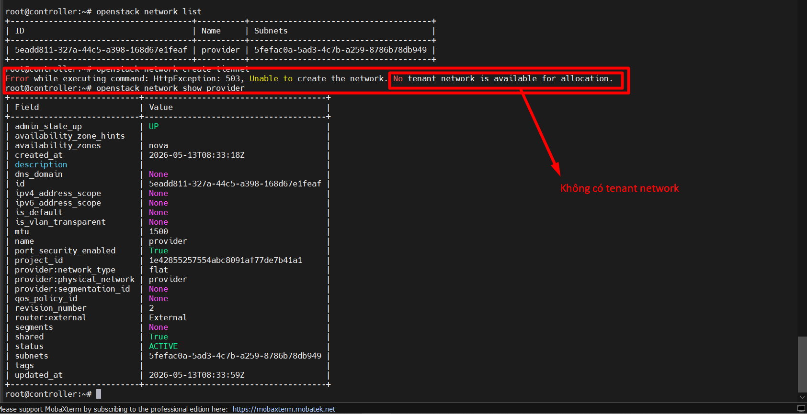

Phân tích:

- Ta có thể thấy ở Output 2 ta có dòng `No tenant network is available for allocation` là do ta chưa cấu hình Network pool cấp phát cho mạng tenant/self-service.

- Check các agent đang tồn tại trong cụm:

```bash
openstack network agent list
```

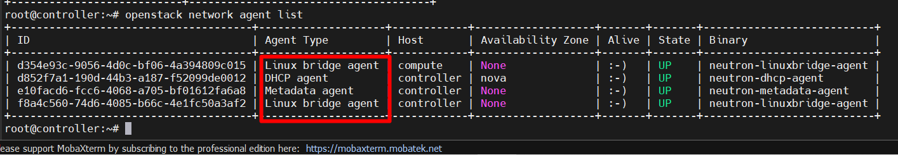

- Trong cụm của ta khả thi để tạo tenant network vì đã có `ens34` dải `10.0.0.0/24` giữa controller và compute và dải này làm VXLAN tunnel cũng được

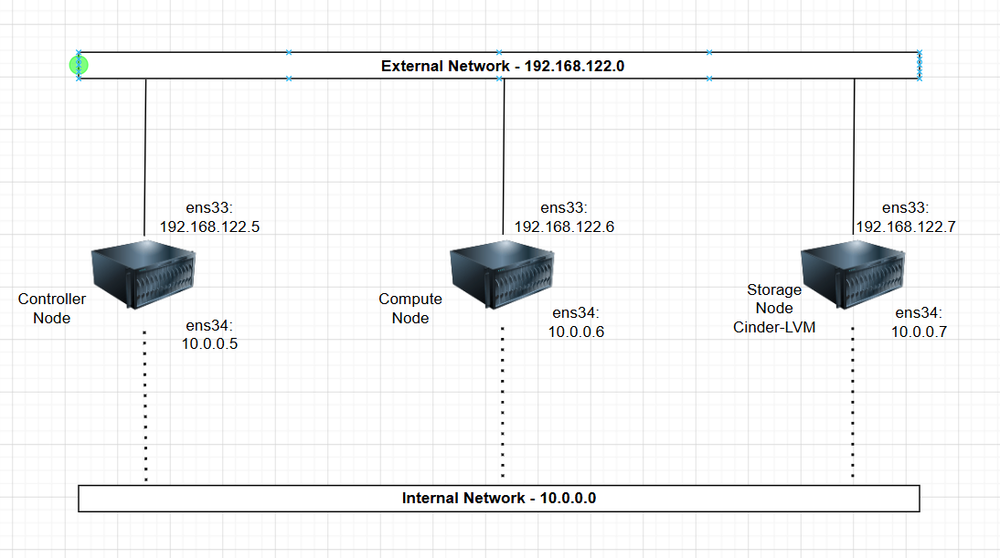

- Để có mạng tenant ta cần phải cấu hình ML2 plugin trong file `/etc/neutron/plugins/ml2/ml2_conf.ini`. Cụm lab này đang đi theo hướng **Linux Bridge + VXLAN**, nên cấu hình như sau:

```ini
[ml2]
type_drivers = flat,vlan,vxlan
tenant_network_types = vxlan
mechanism_drivers = linuxbridge,l2population
extension_drivers = port_security

[ml2_type_flat]
flat_networks = provider

[ml2_type_vxlan]
vni_ranges = 1:1000

[securitygroup]
enable_ipset = true
```

- Ngoài ra, trên controller + compute trong `/etc/neutron/plugins/ml2/linuxbridge_agent.ini` phải bật VXLAN:

Trên **Controller**:

```ini
[linux_bridge]
physical_interface_mappings = provider:ens33

[vxlan]
enable_vxlan = true
local_ip = 10.0.0.5
l2_population = true
```

Trên **Compute**:

```ini
[linux_bridge]
physical_interface_mappings = provider:ens33

[vxlan]
enable_vxlan = true
local_ip = 10.0.0.6
l2_population = true
```

- Rồi restart service:

```bash
# Controller
systemctl restart neutron-server neutron-linuxbridge-agent neutron-dhcp-agent neutron-metadata-agent

# Compute
systemctl restart neutron-linuxbridge-agent
```

- Rồi check network có chưa:

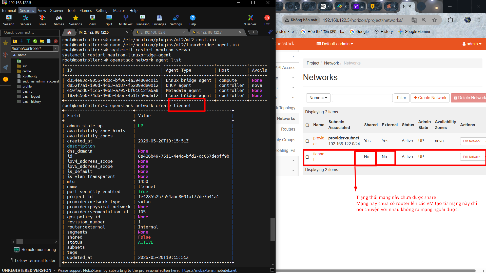

- **Note**:

  - Lưu ý cấu hình trên đủ để tạo 1 tenant network giúp các con VM cùng dải nói chuyện được với nhau qua VXLAN L2. Chưa có router/L3 agent thì network này chỉ là mạng nội bộ tenant, chưa đi ra provider network được.
  - Ngoài ra, trạng thái `Shared = False`: chỉ project `admin` sở hữu network này dùng được

### 2. Cấu hình Subnet cho Tenant Network(Mạng nội bộ VM)

Sau khi đã có mạng tenant network xong ta thử tạo mạng con và tạo VM ping thử cho nhau xem được không:

```bash
# Xem danh sách subnet
openstack subnet list

# Tạo subnet
openstack subnet create tiensubnet \
  --network tiennet \
  --subnet-range 192.168.10.0/24 \
  --gateway 192.168.10.1 \
  --dns-nameserver 8.8.8.8

# Xem chi tiết subnet
openstack subnet show tiensubnet

# Ví dụ xóa subnet
openstack subnet delete tiensubnet
```

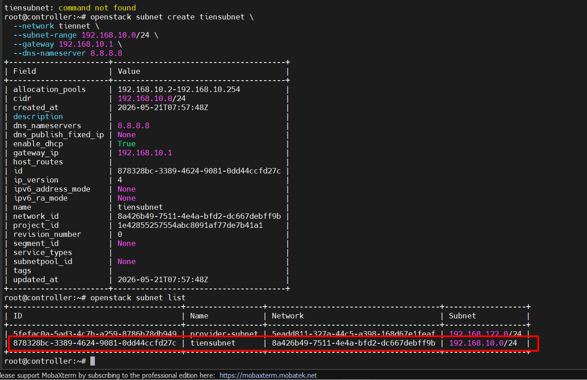

Tạo 2 VM cùng trên dải `192.168.10.x/24`, rồi ta thử ping xem 2 máy có ping được nhau không:

**Note 2**:

- Nếu thấy trên cụm cấp IP cho VM rồi nhưng `ip a` không thấy thì dùng lệnh `dhclient` trên VM để xin IP.

Output:

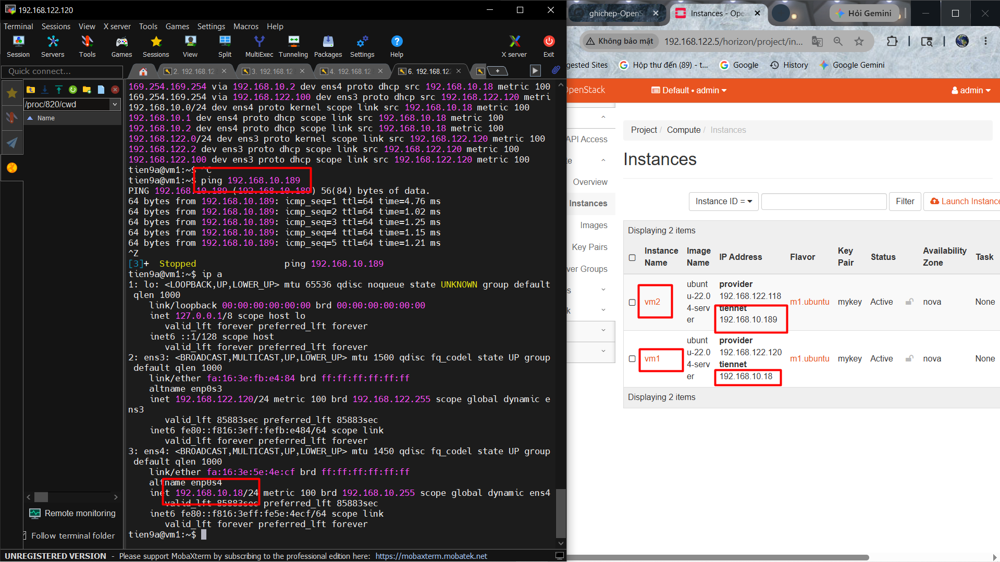

### 3. Cấu hình Router để trỏ Tenant Network ra Provider Network

Sau khi đã lab ping 2 VM trong 1 tenant Network nói chuyện được với nhau giờ ta cấu hình thêm `q-router` trên namespace có sẵn của Controller để nối Tenant network `192.168.10.x/24` với Provider Network `192.168.122.x/24`.

Trước hết, ta cần nắm format các lệnh:

```bash
# Xem danh sách router
openstack router list

# Tạo router
openstack router create <tên-router>

# Gắn gateway ra provider network
openstack router set <tên-router> \
  --external-gateway <tên-provider-network>

# Add interface vào subnet
openstack router add subnet <tên-router> <tên-subnet>

# Xóa interface khỏi router
openstack router remove subnet <tên-router> <tên-subnet>

# Xóa router
openstack router delete <tên-router>
```

Trước hết, muốn cấu hình Neutron router thì ta cần check xem cụm có `neutron-l3-agent` chưa:

```bash
openstack network agent list

# => Chưa có vì ở trên check rồi
```

Ta cài `neutron-l3-agent` về máy Controller:

```bash
apt -y install neutron-l3-agent
```

Tiếp theo, cấu hình file `/etc/neutron/neutron.conf` trên Controller:

```bash
[DEFAULT]
service_plugins = router
```

Trong `/etc/neutron/l3_agent.ini` trên Controller:

```bash
[DEFAULT]
interface_driver = linuxbridge
```

Bật cấu hình hệ thống cho pháp forward gói tin IPv4:

```bash
sysctl -w net.ipv4.ip_forward=1
```

Restart để ăn cấu hình:

```bash
systemctl restart neutron-server neutron-l3-agent
systemctl enable neutron-l3-agent
```

Sau đó tạo router `tien-router` rồi add nó với subnet `tiensubnet` (Có thể tạo qua Dash Board). Ở đây, ta tạo qua CLI:

```bash
# Nhớ nạp biến mtr

openstack router create tien-router
openstack router set tien-router --external-gateway provider
openstack router add subnet tien-router tiensubnet

# Check:
openstack router list
openstack router show tien-router
openstack port list --router tien-router
ip netns list | grep qrouter
```

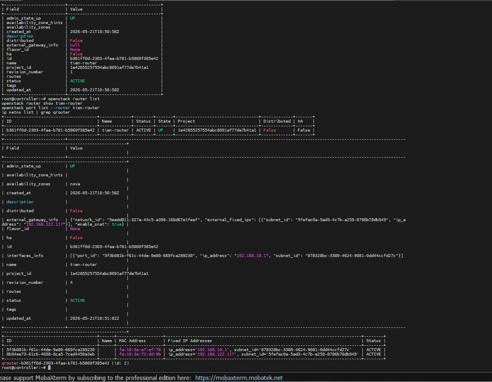

=> nếu thấy `OUTPUT` namespace `q-router...` là `OKE`.

Vào VM test xem đã ra được mạng ngoài chưa:

```bash
# Gỡ 1 card provider ở lab trước xuống cho gọn đường route (Chọn Dettach Interface trong DashBoard)

ip r
ping 192.168.10.1
ping 8.8.8.8

# Trace route để xem đường đi gói tin:
traceroute
```

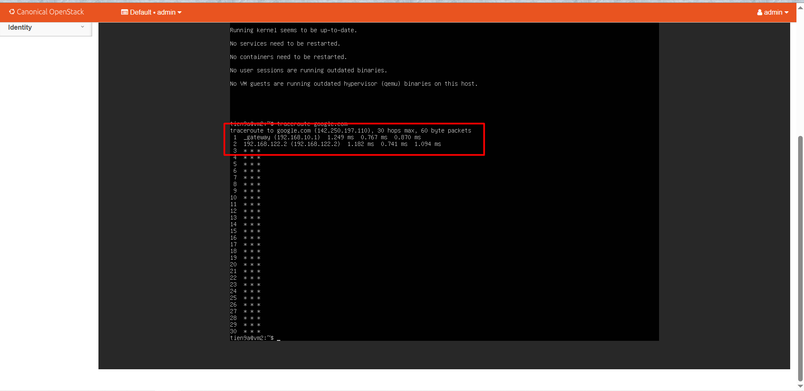

### 4. Cấu hình Floating IP (để SSH từ máy ngoài vào VM trên dải mạng Tenant Network)

Trước hết, để thêm cấu hình Floating IP thì ta cần hiểu các lệnh căn bản sau:

```bash
# Xem danh sách floating IP
openstack floating ip list

# Tạo floating IP
openstack floating ip create <tên-provider-network>

# Gắn floating IP vào VM
openstack server add floating ip <tên-vm> <floating-ip>

# Gỡ floating IP khỏi VM
openstack server remove floating ip <tên-vm> <floating-ip>

# Xóa floating IP
openstack floating ip delete <floating-ip>
```

Floating IP như pool IP của Provider network cung cấp cho máy ngoài SSH vào máy trong cụm.

Floating IP không cần cài thêm nếu đã có `neutron-l3-agent`; chỉ cần cấu hình đúng L3 agent/router trên Controller/Network node rồi tạo và gán floating IP bằng lệnh `openstack floating ip create` + `openstack server add floating ip`.

Check xem có `l3-agent` chưa:

```bash
openstack network agent list

# state l3-agent = UP là OKE 
```

Tạo floating trước:

```bash
openstack floating ip create <tên-provider-network>
```

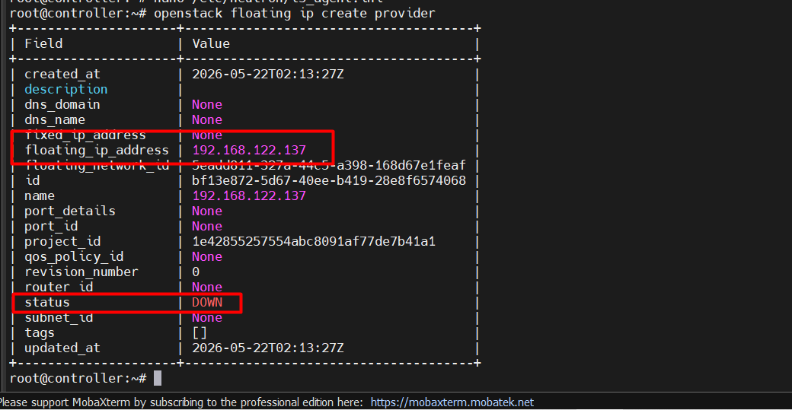

=> Ở đây ta thấy có một IP `192.168.122.137` xuất hiện. Tiếp theo, ta map nó vào 1 VM bất kì rồi SSH vào nó:

```bash
openstack server add floating ip <tên-vm> <floating-ip>

# Ta gán vào vm1 lab trên
# vm1 chỉ có dải 192.168.10.x đang hoạt động
```

Check Floating IP đã map vào IP cảu dải `192.168.10.x` chưa:

```bash
openstack server list
openstack port list --server vm1
```

Tiếp theo mở rule SSH để SSH vào

```bash
openstack security group rule create --proto tcp --dst-port 22 default
openstack security group rule create --proto icmp default
# Ở đây đã mở rồi
```

Output:

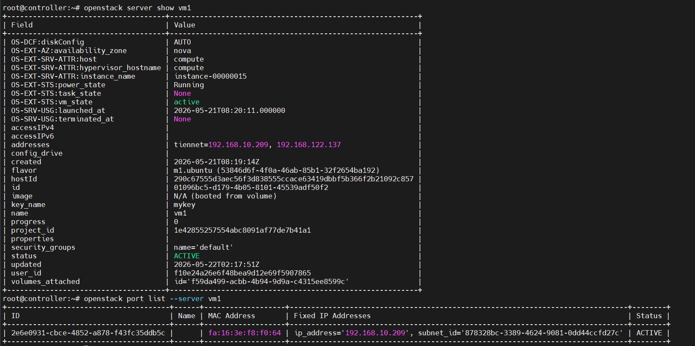

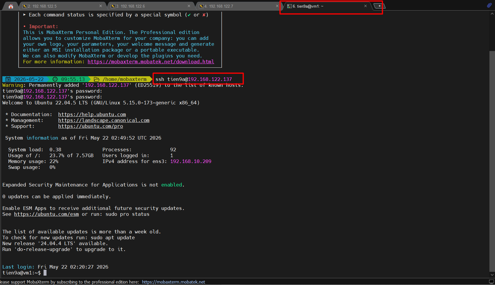

### 5. Cấu hình Security Group để add rule Egress/Ingress

Trước tiên, ta cần thuộc một số lệnh về Security Group:

```bash
# Xem danh sách security group
openstack security group list

# Tạo security group
openstack security group create <tên-sg>

# Thêm rule SSH
openstack security group rule create <tên-sg> \
  --protocol tcp \
  --dst-port 22 \
  --remote-ip 0.0.0.0/0

# Thêm rule HTTP
openstack security group rule create <tên-sg> \
  --protocol tcp \
  --dst-port 80 \
  --remote-ip 0.0.0.0/0

# Thêm rule ICMP (ping)
openstack security group rule create <tên-sg> \
  --protocol icmp \
  --remote-ip 0.0.0.0/0

# Xem rules của security group
openstack security group rule list <tên-sg>

# Xóa security group
openstack security group delete <tên-sg>
```

Nhưng phần này mọi người tương tác với DashBoard vì nó đã có sẵn các port rồi.

### 6. Cấu hình Port cho các VM

Giống như Security Group phần này có các lệnh:

```bash
# Xem danh sách port
openstack port list

# Xem port của VM cụ thể
openstack port list --server <tên-vm>

# Xem chi tiết port
openstack port show <port-id>

# Tạo port thủ công
openstack port create <tên-port> \
  --network <tên-network> \
  --fixed-ip subnet=<tên-subnet>,ip-address=192.168.1.100

# Xóa port
openstack port delete <port-id>
```

Phần này ta cũng có thể tương tác qua DashBoard.

### 7. Cấu hình Agent & NetworkNode

Phần này cũng có các lệnh:

```bash
# Xem danh sách neutron agent
openstack network agent list

# Xem chi tiết agent
openstack network agent show <agent-id>

# Xem network trên agent nào đang host
openstack network agent list --network <network-id>
```

Các service/agent Neutron thường gặp:

```text
neutron-server
neutron-linuxbridge-agent
neutron-openvswitch-agent
neutron-dhcp-agent
neutron-metadata-agent
neutron-l3-agent
```