# QUÁ TRÌNH KHỞI TẠO VM

## I. `Bước 1`: Xác thực với KeyStone

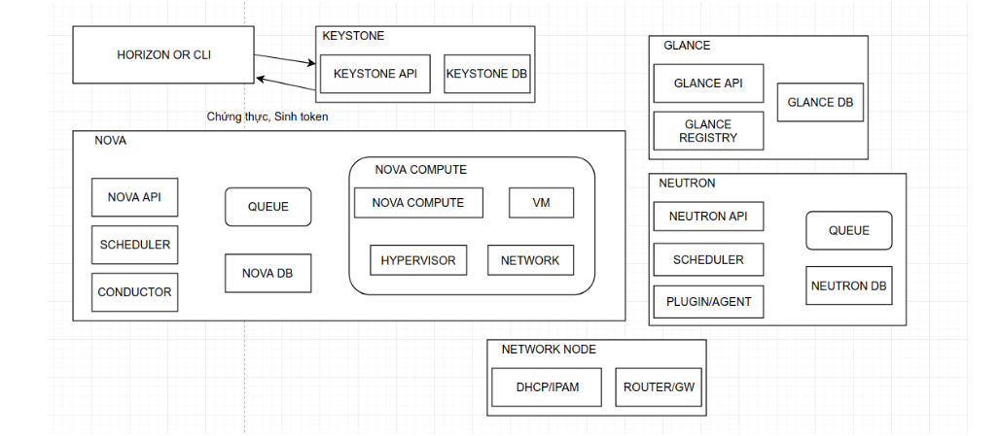

- User sử dụng hoặc login từ horizon để xác thực với KeyStone thông qua Keystone-api
- Project KeyStone sẽ tra DB KeyStone về UserID để trả đúng KeyStone của User
- Sau khi quá trình xác thực chính xác KeyStone, User nhận lại Unscope Token.
  
  - Trong Unscope Token chứa danh sách Project ID và Role của User

- Từ Unscope Token:

  - User lựa chọn project mong muốn sử dụng.
  - Request tới KeyStone tạo scoped token để làm việc với các service khác(nova, neutron, ..) trong project.

## II. `Bước 2`: Yêu cầu tạo VM

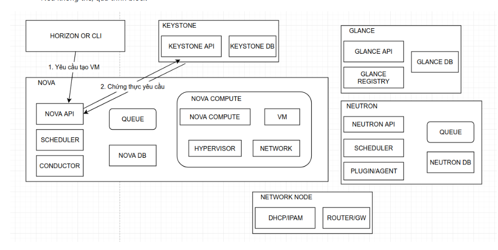

- Sau bước 1 User đã có quyền làm việc với các project.
- User ra lệnh tạo ra VM tới Nova API
- Nova API nhận yêu cầu, xác thực ngược ScopeToken User với KeyStone
  - Nếu xác thực được quá trình tiếp tục
  - Nếu không thể thì quá trình bị Block

- Sau đó Nova API sẽ làm 2 việc:
  
  - Nova API gửi chỉ thị tới Nova DB (Sử dụng SQL Alchemy),ghi thông tin instance vào DB:

    - flavor
    - image
    - network
    - project
    - trạng thái ban đầu

  - Gửi chỉ thị tạo VM tới Nova scheduler qua Queue (Queue thường dùng RabbitMQ)

    - Queue dùng cho **RPC communication** giữa các service.
    - Queue trong OPS nghĩa là:"message broker để các service giao tiếp bất đồng bộ (asynchronous)".

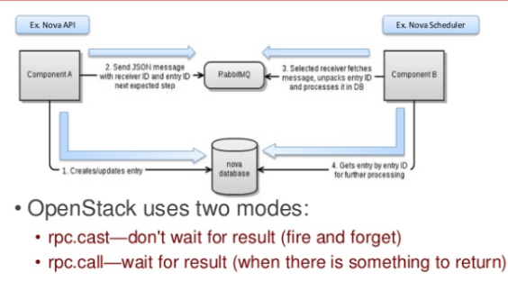

- Nova scheduler:
  
  - Nhận request từ queue
  - Lấy đối trượng từ Nova DB

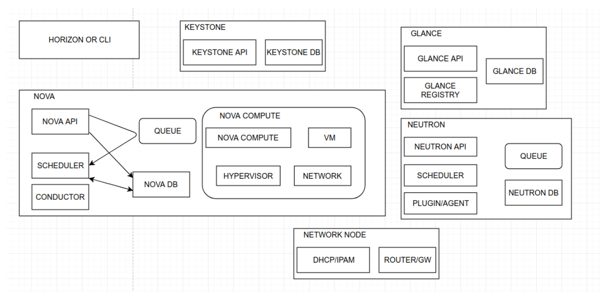

- Tiếp theo đó, Nova Scheduler (Chọn Compute Node) sử dụng:

  - **Filter**: Để loại Host không phù hợp

    - Ví dụ: RAM không đủ, Disk không đủ, Host đang disable
  
  - **Weigher**:Chấm điểm các Host còn lại

    - Ví dụ: Host nào ít load hơn, Host nào có nhiều Resource.

- Sau khi lựa chọn xong, Nova scheduler gửi yêu cầu cung cấp VM tới Nova Compute (qua queue).

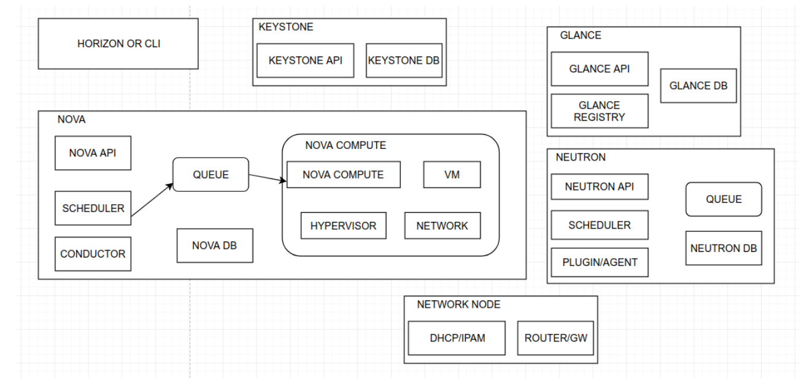

- Ở đây, Nova Compute là Service quản trị VM trên các Node Nova Compute. Nova Compute có nhiệm vụ:

  - Tạo VM, Quản lí VM, giao tiếp với Hypervisor

    - Ví dụ: KVM, QEMU, VMWare ESXi

-> `Nhớ`: Nova Compute không phải Hypervisor.

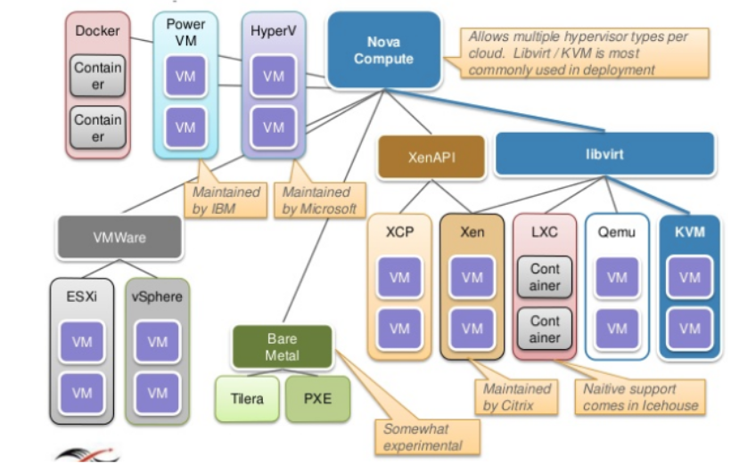

- Và rồi, Nova Compute:

  - Lấy thông tin từ Nova DB
  - Giao tiếp giữa Nova Compute với Nova DB thông qua Nova Conductor(Nova Compute không giao tiếp trực tiếp với Nova DB)
  - Flow như sau:

  ```text
  Nova Compute
   ↓ RPC
  Nova Conductor
   ↓
  Nova DB
  ```

  - Lợi ích của việc không giao tiếp trực tiếp:

    - Tăng Security.
    - Tránh Compute làm Overload DB
    - Scale hệ thông lớn tốt hơn

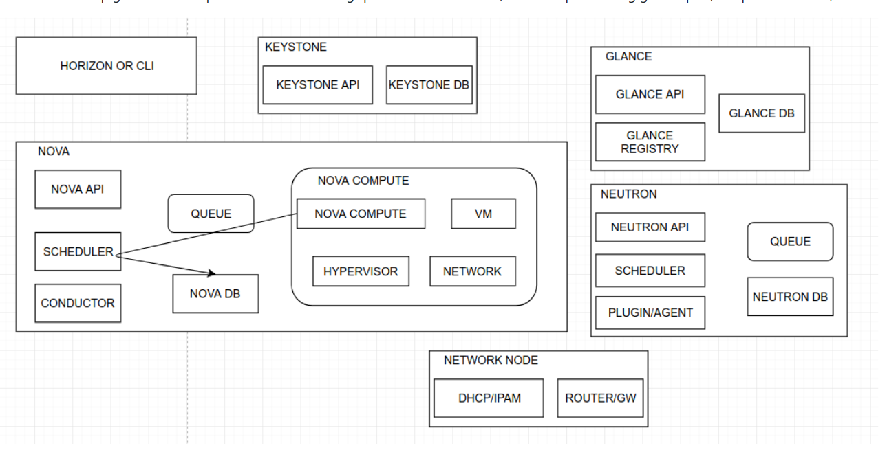

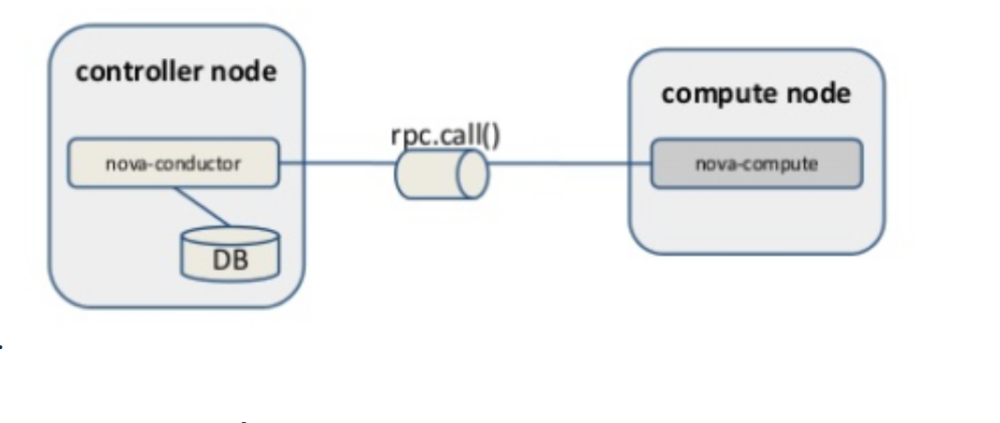

## `Bước 3`: Yêu cầu Network cho VM (Request to Neutron)

- Sau khi lấy được thông tin VM, Nova compute request tới Neutron API, yêu cầu cung cấp Network cho VM.

- Neutron nhận được yêu cầu, xác thực lại request tới KeyStone(allocate port), sử dụng thành phần `Plugin`/`Agent` tương tác với NetworkNode, cung cấp Network tới Nova Compute.

- Ngoài ra `Agent` tham gia:

  - L2 agent(OvSwitch/LinuxBridge)
  - DHCP agent
  - L3 agent

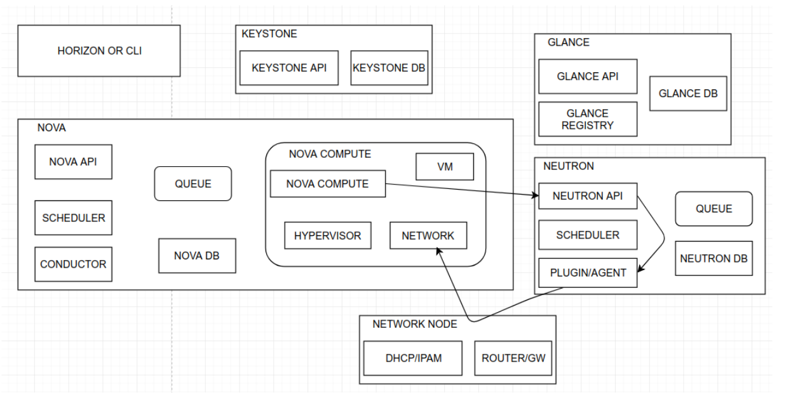

## `Bước 4`: Yêu cầu Storage

- Nova Compute sau khi nhận network từ Neutron, thực hiện cung cấp nới lưu trữ VM để thực hiện quá trình Boot. Có 3 lựa chọn:

  - Tạo VM trên Ephemeral storage
  - Tạo VM trên Block storage (Cinder)
  - Tạo VM trên image cache

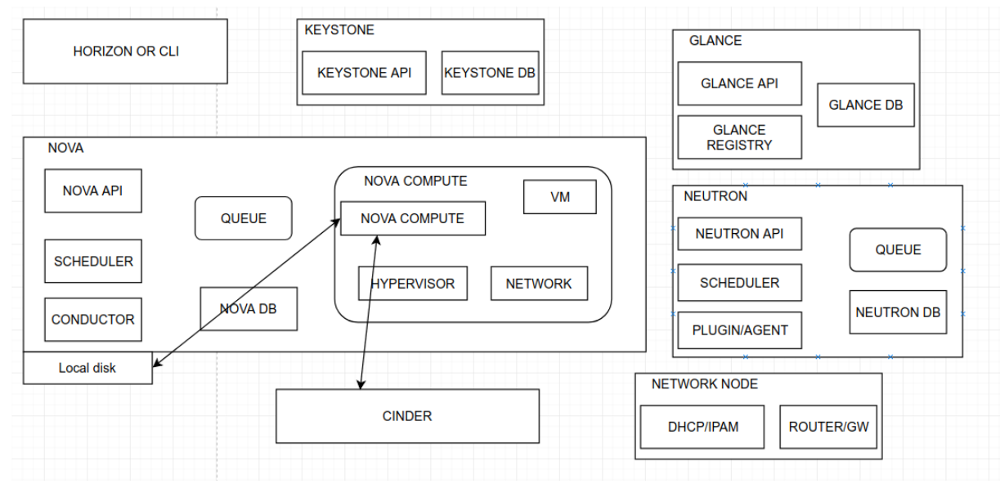

## `Bước 5`:Yêu cầu image cho VM (Request to Glance)

- Sau khi lựa chọn Storage phù hợp cho VM, Nova compute gửi yêu cầu tới Glance API, yêu cầu cung cấp Image.
- Glance API nhận yêu cầu , xác thực lại request với KeyStone, nếu request chứng thực thành công:

  - Tìm kiếm Image phù hợp,nếu có, trả lại URI image để nova compute thực hiện quá trình download và boot VM

-> Lưu ý: Image có thể được lưu tại object storage (ceph, swift), block storage (cinder), HTTP, FS, RBD ....

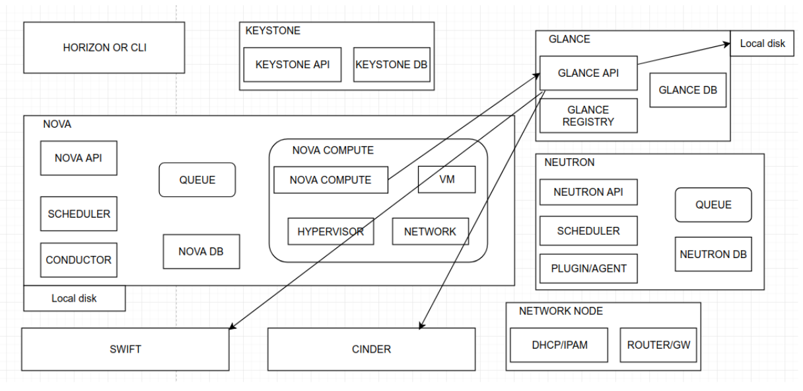

## `Bước 6`: Boot VM

- Nova compute nhận image uri, down image, gán storage vào vm, thực hiện quá trình boot với image ( quá trình boot sẽ sử dụng drive kết nối tới các hypervisor).

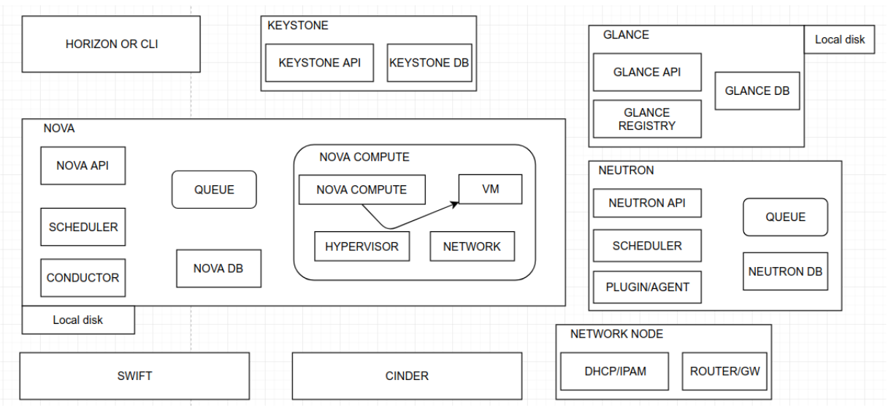

Nova compute update trạng thái VM tới Nova Db thông quá Nova Conductor

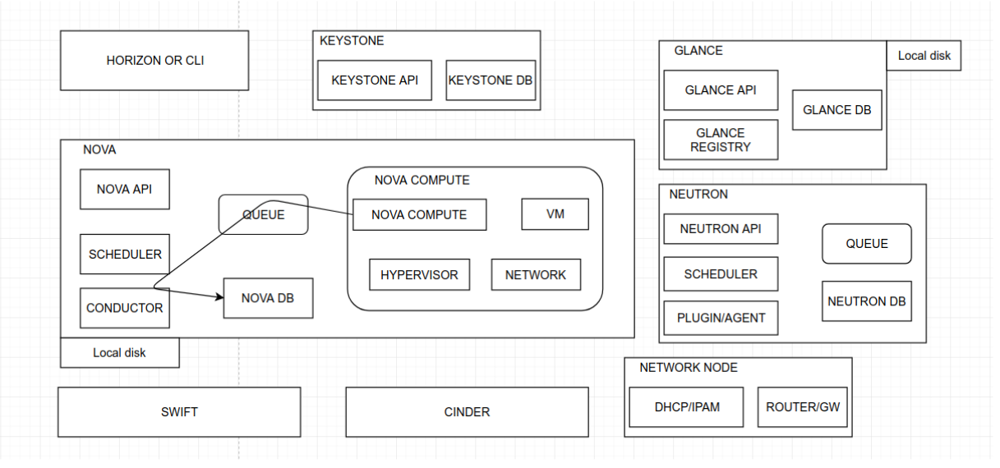

## `Bước 7`: Cập nhật trạng thái VM

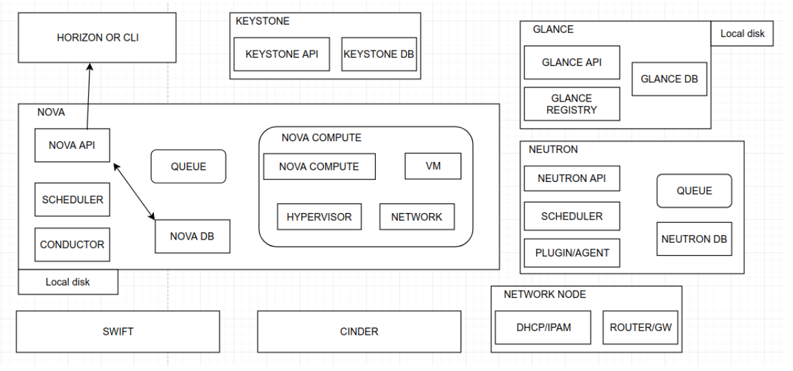

Tài liệu tham khảo:

<https://github.com/lacoski/OpenStack-Note/blob/master/docs/nova/work-flow-launch-instance.md>

<https://www.slideshare.net/openstack/openstack-super-bootcamppdf>

<https://www.slideshare.net/mirantis/openstack-architecture-43160012>
