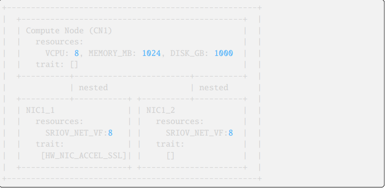
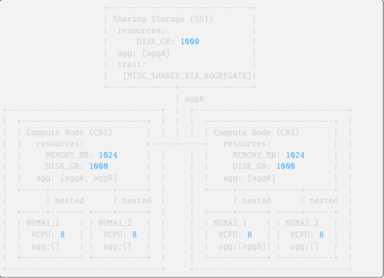

# TÌM HIỂU NOVA PLACEMENT VÀ NOVA CONDUCTOR

## A. TÌM HIỂU VỀ NOVA PLACEMENT

### I. TÌM HIỂU TỔNG QUAN VỀ NOVA PLACEMENT

#### 1. Nova placement là gì?

**Placement** là service chịu trách nhiệm quản lí tài nguyên và quyết định compute node nào có đủ tài nguyên để chạy VM.

Service này được tách riêng từ OpenStack Nova từ phiên bản Ocata/Pike để cải thiện khả năng Scale. Và cũng để các project khác có thể dùng (Xưa chỉ có Project Nova có thể dùng)

Ví dụ: Các project có thể sử dụng placment:

- Nova (compute)
- OpenStack Neutron
- OpenStack Cyborg

Các project này có thể:

- Đăng ký tài nguyên
- Xoá tài nguyên
- Cập nhật tài nguyên

=> Thông qua **Placement HTTP API**.

Placement lưu thông tin:

| Resource    | Ví dụ        |
| ----------- | ------------ |
| CPU         | VCPU         |
| RAM         | MEMORY_MB    |
| Disk        | DISK_GB      |
| Network     | SRIOV_NET_VF |
| Accelerator | FPGA         |

#### 2. Placement dùng mô hình Resource Provider

=> Placement coi mỗi **nơi cung cấp tài nguyên** là một **Resource Provider**

Ví dụ:

| Resource Provider | Tài nguyên |
| ----------------- | ---------- |
| Compute Node      | CPU, RAM   |
| Storage Pool      | DISK       |
| Network Pool      | IP         |

Ví dụ: Khi VM dùng

```text
CPU  -> compute node
RAM  -> compute node
Disk -> storage pool
IP   -> IP pool
```

=> **Placement** sẽ ghi nhận **VM tiêu thụ tài nguyên từ nhiều Provider khác nhau.**.

#### 3. Khái niệm Resource Class

Resource Class = loại tài nguyên

Ví dụ:

| Resource class | Ý nghĩa    |
| -------------- | ---------- |
| VCPU           | CPU        |
| MEMORY_MB      | RAM        |
| DISK_GB        | Disk       |
| SRIOV_NET_VF   | SR-IOV NIC |

Ngoài ra có thể tạo Custom:

```text
Custom_GPU
Custom_FPGA
```

#### 4.Khái niệm Inventory

Inventory = **Số lượng tài nguyên mà provider có**.

Ví dụ: `VM1` dùng

```text
VCPU: 2
MEMORY_MB: 4096
DISK_GB: 40
```

=> **Placement lưu inventory này**

#### 5. Allocation

**Allocation** = Tài nguyên cấp phát cho VM

Ví dụ: `VM1` dùng

```text
VCPU: 2
MEMORY_MB: 4096
DISK_GB: 40
```

Placement ghi:

```text
consumer = VM1
allocation = resources
```

#### 6. Khái niệm Allocation

Allocation = **Tài nguyên đã cấp** cho VM.

Ví dụ: `VM1` dùng

```text
VCPU: 2
MEMORY_MB: 4096
DISK_GB: 40
```

Placement ghi:

```text
consumer = VM1
allocation = resources
```

#### 7. Khái niệm Traits

Trait = **Đặc điểm của Resource Provider**

Ví dụ:

| Trait                       | Ý nghĩa             |
| --------------------------- | ------------------- |
| STORAGE_DISK_SSD            | disk là SSD         |
| HW_CPU_X86_AVX2             | CPU hỗ trợ AVX2     |
| COMPUTE_VOLUME_MULTI_ATTACH | hỗ trợ multi attach |

=> VM có thể yêu cầu Traits

VÍ dụ:

```text
required=STORAGE_DISK_SSD
```

#### 8. `NUMA` Trong OpenStack Nova và OpenStack Placement

`NUMA` node được mô hình thành **resource provider con**.

Ví dụ:

```text
Compute Node
 ├── NUMA1
 │     └── VCPU
 └── NUMA2
       └── VCPU
```

Placement có thể cấp tài nguyên như:

```text
NUMA1 -> 2 VCPU
Compute node -> RAM
Shared storage -> Disk
```

##### Tại sao OpenStack phải quan tâm `NUMA`?

Một số workload yêu cầu:

- latency thấp
- CPU và RAM gần nhau

Ví dụ:

- NFV
- DPDK
- GPU workload

OpenStack có thể pin VM vào NUMA node:

```text
VM -> NUMA1
```

→ hiệu năng tốt hơn.

**Lưu ý**: **Placement** không **schedule trực tiếp** `VM` vào **Compute Node**, mà schedule vào `NUMA` node bên trong **Compute Node**.

#### 9. Khái niệm Provider Tree

Placement hỗ trợ **cấu trúc cây tài nguyên**

Ví dụ:

```text
Compute Node
 ├── NUMA1
 │    └── VCPU
 └── NUMA2
      └── VCPU
```

**Hoặc**:




```text
Compute Node
 ├── NIC
 ├── GPU
 └── FPGA
```

Mục đích hỗ trợ các mô hình:

- mô hình NUMA
- SRIOV
- accelerator

#### 10. Khái niệm Sharing Provider

Provider có thể chia sẻ tài nguyên giữa nhiều ComputeNode

Ví dụ:



```text
Shared Storage
   │
 ┌─┴─────┐
CN1     CN2
```

-> Disk dùng chung.

-> Trait dùng để bật sharing:

```text
MISC_SHARES_VIA_AGGREGATE
```

#### 11. Nova dùng Placement như thế nào

Có 2 component của OpenStack Nova Tương tác với Placement:

##### `nova-compute`

Nhiệm vụ:

- tạo resource provider
- cập nhật inventory
- cập nhật traits

##### `nova-scheduler`

Khi tạo VM:

`Bước1`: Scheduler gửi request tới Placement

```bash
GET /allocation_candidates
```

`Bước 2`: Placement trả về:

```text
list compute node có đủ resource
```

`Bước 3`: Scheduler chọn host tốt nhất.

#### 12. Allocation Candidates (Ứng viên cấp tài nguyên)

API quan trọng nhất:

```bash
GET /allocation_candidates
```

Ví dụ:

```bash
GET /allocation_candidates?
resources=VCPU:1,MEMORY_MB:512,DISK_GB:500
```

=> Placement trả về các host có thể chạy VM.

#### 13. Aggregates

Aggregate = nhóm host.

Ví dụ:

```text
aggA
 ├─ compute1
 └─ compute2
```

VM có thể yêu cầu:

```text
member_of=aggA
```

#### 14. Filtering

Placement cho phép lọc host theo nhiều điều kiện.

**theo resource**:

- VCPU
- RAM
- DISK

**theo trait**:

```bash
required=SSD
```

**theo aggregate**:

```bash
member_of=aggA
```

**theo provider tree**:

```bash
in_tree=<uuid>
```

#### 15. Microversion API

Placement API dùng **microversion**.

| Version | Feature                   |
| ------- | ------------------------- |
| 1.0     | API đầu tiên              |
| 1.10    | allocation candidates     |
| 1.14    | nested provider           |
| 1.25    | granular resource request |

=> Điều này giúp nâng cấp OpenStack mà không phá API cũ.

#### 16. CLI tool(Phần sau đề cập đến)

```bash
placement-manage
placement-status
```

#### 17. Placement đóng vai trò gì khi tạo VM

Luồng chuẩn:

```text
User
   ↓
Nova API
   ↓
Nova Scheduler
   ↓
Placement (check resource)
   ↓
Compute node
   ↓
VM created
```

#### 18. Cơ chế `allocations` và `consumer_generation`

Trong **OpenStack Placement**, mỗi **VM (consumer)** sẽ có **allocations** – tức tài nguyên mà nó đang sử dụng.

Để tránh lỗi **ghi đè đồng thời (concurrent write)**, Placement dùng:

`consumer_generation`

**Ý nghĩa**:

- Mỗi lần allocation thay đổi → generation tăng
- Client phải gửi generation hiện tại khi update allocation

Nếu generation không khớp:

```bash
HTTP 409 Conflict
```

→ Client phải:

- đọc lại allocations
- gửi request lại

**Mục đích**: tránh **race condition** khi nhiều service cùng sửa allocation.

#### 19. `API PUT /allocations/{consumer_uuid}`

**API này** dùng để **thay thế allocations** của một **consumer (VM)**.

Đặc điểm:

- Gửi toàn bộ **allocation mới**
- Có thể gửi **empty allocations**

Ví dụ:

```bash
allocations: {}
```

→ **xoá toàn bộ allocation** của VM (Cách này an toàn hơn DELETE vì có kiểm tra generation)

#### 20. Cảnh báo microversion (< 1.28)

Cảnh báo nhấn mạnh:

`Không được dùng API allocation với microversion < 1.28`

Lý do:

- Không kiểm tra generation
- Dễ gây **allocation corruption**

Do đó:

`luôn dùng microversion >= 1.28`

#### 21. Allocation Candidates với Nested Provider (v1.29)

Từ version Rocky:

API:

```bash
GET /allocation_candidates
```

-> có thể trả về resource từ **nested resource providers**

Ví dụ:

```text
Compute node
 ├─ NUMA1
 ├─ NUMA2
 └─ NIC
```

Placement có thể combine:

```text
NUMA1 + Disk + NIC
```

-> để tạo allocation.

#### 22. `API /reshaper` (v1.30)

API:

```bash
POST /reshaper
```

=> Dùng để thay đổi cấu trúc **resource provider**.

Ví dụ:

- Trước:

```text
Compute Node
   └── DISK
```

- Sau:

```text
Compute Node
   └── Storage Provider
          └── DISK
```

`reshaper` sẽ:

- chuyển inventory
- cập nhật allocations

**Lưu ý quan trọng**: Chỉ dùng khi topology thay đổi.

#### 23. `in_tree` query parameter (v1.31)

API:

```bash
GET /allocation_candidates
```

=> Có thể giới hạn resource trong **một provider tree**.

API:

```bash
