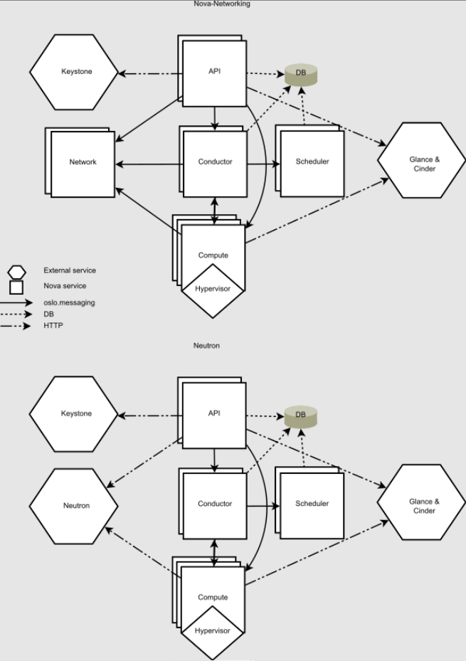

# TÌM HIỂU NOVA CONDUCTOR



## I. TỔNG QUAN VỀ NOVA CONDUCTOR

### 1. Nova Conductor là gì?

**OpenStack Nova Conductor** là **một service trung gian(middleware**) hay còn là 1 **deamon service** trong OpenStack. Nó đóng vai trò xử lý logic phức tạp và truy cập database thay cho compute node.

Nói ngắn gọn:

```text
Compute Node  →  Nova Conductor  →  Database
```

=> Compute không được phép **truy cập DB trực tiếp** mà phải **đi qua Conductor**.

### 2. Vì sao Nova Conductor tồn tại

Trước các phiên bản OpenStack cũ (**Grizzly** trở về trước):

```text
nova-compute → truy cập trực tiếp DB
```

Vấn đề:

- **Security risk**: nếu compute node bị hack → hacker truy cập DB.
- **DB overload**: nhiều compute truy cập DB cùng lúc
- Logic phân tán khó quản lý.

=> Vì vậy OpenStack tạo ra Nova Conductor.

Sau đó kiến trúc trở thành:

```bash
nova-compute
      │
      │ RPC
      ▼
nova-conductor
      │
      ▼
database
```

### 3. Vai trò chính của Nova Conductor

Nova Conductor có 3 nhiệm vụ cực kỳ quan trọng.

#### 3.1 Truy cập Database thay cho Compute

Compute không được phép truy cập database.

- Compute gửi request qua RPC message:

```bash
nova-compute
   │
   │ RPC
   ▼
nova-conductor
   │
   ▼
MySQL / MariaDB
```

Ví dụ khi:

```text
tạo VM
update instance state
attach volume
snapshot VM
```

=> Compute sẽ gửi RPC tới Conductor.

#### 3.2 Xử lý logic nặng (Complex Tasks)

Một số task trong OpenStack Nova rất phức tạp.

Ví dụ:

```text
Build instance
Resize instance
Cold migration
Live migration preparation
Instance scheduling workflow
```

=> Các task này được conductor xử lý để: **compute node** nhẹ hơn

#### 3.3 Điều phối RPC giữa các service

=> Nova Conductor là **message handler**.

Các service như:

```text
nova-api
nova-scheduler
nova-compute
```

=> đều giao tiếp qua message queue.

Ví dụ với:

```text
RabbitMQ
Apache Qpid
```

### 4. Vị trí của Nova Conductor trong kiến trúc Nova

Trong kiến trúc Nova:

```text
            User
              │
              ▼
         nova-api
              │
              ▼
        nova-scheduler
              │
              ▼
        nova-compute
              │
              ▼
        nova-conductor
              │
              ▼
          Database
```

Thực tế flow:

```text
User → API → Scheduler → Compute → Conductor → DB
```

### 5. Các thành phần mà Conductor làm việc cùng

Nova Conductor thường tương tác với:

| Service                  | Vai trò            |
| ------------------------ | ------------------ |
| OpenStack Nova API       | nhận request user  |
| OpenStack Nova Scheduler | chọn compute node  |
| OpenStack Nova Compute   | chạy VM            |
| OpenStack Placement      | quản lý tài nguyên |
| OpenStack Neutron        | cấp network        |
| OpenStack Glance         | lấy image          |
| OpenStack Cinder         | attach volume      |

### 6. Flow khi tạo VM (có Nova Conductor)

Ví dụ user tạo VM:

```text
1 User
   │
   ▼
2 nova-api
   │
   ▼
3 nova-scheduler
   │
   ▼
4 nova-compute (node được chọn)
   │
   ▼
5 nova-conductor
   │
   ▼
6 Database update
```

### 7. Message Queue trong Nova Conductor

Conductor giao tiếp với compute qua RPC message queue.

Thường dùng:

- RabbitMQ
- ZeroMQ

Flow:

```text
nova-compute
     │
     │ RPC
     ▼
message queue
     │
     ▼
nova-conductor
```

### 8. Các loại task Nova Conductor xử lý

Một số task phổ biến:

**Instance lifecycle**:

- Build instance
- Rebuild instance
- Resize
- Migrate
- Delete

**Metadata handling**:

- Update instance state
- Store instance metadata
- Scheduling assistance

**Validate resources**:

- confirm scheduling decisions

### 9. Nova Conductor có thể scale

Một điểm mạnh là:

**Conductor có thể chạy nhiều instance**:

```text
nova-conductor (1)
nova-conductor (2)
nova-conductor (3)
```

Tất cả cùng đọc message queue.

Lợi ích:

- Scale horizontally
- High availability
- Load balancing

## II. CONFIG FILE NOVA CONDUCTOR

File cấu hình Nova Conductor thường nằm trong: `/etc/nova/nova.conf`.

Section:

```text
[conductor]
```

Service chạy bằng systemd:

```text
systemctl status openstack-nova-conductor
```

Hoặc Devstack:

```text
screen -r stack
```

## III. CLI NOVA CONDUCTOR

### 1. Nova Conductor CLI

Trong OpenStack Nova, service **nova-conductor** có CLI rất đơn giản vì nó là **daemon service** chạy nền.

Cú pháp cơ bản:

```bash
nova-conductor [options]
```

Service này khởi chạy **Nova Conductor daemon** để cung cấp:

- coordination tasks
- database query support cho Nova.

### 2. Mô tả CLI nova-conductor

Theo tài liệu OpenStack:

“nova-conductor is a server daemon that serves the Nova Conductor service, providing coordination and database query support for Nova.”

Nghĩa là:

- nova-conductor không phải CLI tương tác như `nova` client
- nó chỉ là process daemon

### 3. Các options quan trọng

Một số option phổ biến:

#### `--config-file`

=> Chỉ định file config.

```bash
nova-conductor --config-file /etc/nova/nova.conf
```

Giải thích:

- Đọc cấu hình từ file nova.conf
- Có thể chỉ định nhiều file config

#### `--config-dir`

Chỉ định thư mục chứa nhiều file config.

```bash
nova-conductor --config-dir /etc/nova/nova.conf.d
```

Hệ thống sẽ:

- đọc tất cả .conf trong directory
- override config nếu cần.

#### `--debug` hoặc `-d`

Bật chế độ debug logging.

```bash
nova-conductor --debug
```

Hoặc

```bash
nova-conductor -d
```

Tác dụng:

```bash
log level: DEBUG     # viết log ở mức DEBUG
```

Ngoài ra còn nhiều options nữa ta còn có thể tham khảo ở nguồn [sau](https://docs.openstack.org/nova/latest//cli/nova-conductor.html)

### 4. File cấu hình được sử dụng

Nova conductor đọc cấu hình từ:

```bash
/etc/nova/nova.conf
```

File này chứa:

- Database connection
- Message queue
- RPC config
- Conductor options.

### 5. Ví dụ chạy Nova-conductor thủ công

Trong lab hoặc debug:

```bash
nova-conductor --config-file /etc/nova/nova.conf
```

Khi chạy sẽ:

```text
Starting nova conductor
Connecting to message queue
Initializing RPC server
Waiting for compute requests
```

### 6. Trong thực tế service được start như nào ?

Trong production:

```bash
systemctl start openstack-nova-conductor
```

Kiểm tra:

```bash
systemctl status openstack-nova-conductor
```

Hoặc:

```bash
ps -ef | grep nova-conductor
```

=> Sẽ hiện tiến trình của Nova-Conductor.

### 7. Log của nova conductor

Log thường nằm ở:

```bash
/var/log/nova/nova-conductor.log
```

### 8. Các CLI liên quan conductor (admin)

Ngoài nova-conductor, admin còn dùng:

**nova-manage**:

```bash
nova-manage
nova-manage cell_v2 list_cells
nova-manage db sync
```

**Openstack CLI**:

```bash
openstack compute service list
```

=> để kiểm tra conductor service.

### 9. Kiểm tra service conductor trong OpenStack

```bash
openstack compute service list
```

Kết quả sẽ có dòng:

```text
 1  | nova-conductor | controller | enabled |
```

## IV. TẠI SAO NOVA CONDUCTOR LÀ SERVICE QUAN TRỌNG?

**OpenStack Nova Conductor** là một trong những service rất quan trọng trong kiến trúc OpenStack vì nó đóng vai trò trung gian giữa **compute node** và **database**, đồng thời xử lý nhiều logic điều phối của Nova.

Dưới đây là các lý do chính:

### 1. Bảo vệ Database (Security)

Trước đây:

```text
nova-compute → truy cập trực tiếp database
```

Điều này nguy hiểm vì:

- Nếu compute node bị hack → attacker có thể truy cập DB
- Có thể thay đổi trạng thái VM, user, metadata

Khi có Nova Conductor:

```text
nova-compute → RPC → nova-conductor → database
```

Compute không còn quyền truy cập database nữa.

Điều này giúp:

- giảm rủi ro bảo mật
- bảo vệ dữ liệu hệ thống.

### 2. Giảm tải Database

Trong cloud lớn có thể có:

```bash
100 → 1000 compute nodes
```

Nếu tất cả truy cập DB trực tiếp:

```bash
compute → DB
compute → DB
compute → DB
```

Database sẽ:

- quá tải
- nhiều query đồng thời

Nova Conductor giúp:

```bash
compute → conductor → DB
```

=> Conductor **quản lý và tối ưu các request database**.

### 3. Xử lý các tác vụ phức tạp

Nhiều thao tác VM trong OpenStack Nova rất phức tạp, ví dụ:

- Build instance
- Resize instance
- Cold migration
- Rebuild instance
- Snapshot VM

Những task này thường cần:

- Nhiều bước
- Nhiều service khác nhau

Nova Conductor sẽ:

- Điều phối workflow
- Xử lý logic phức tạp.

### 4. Giảm tải cho Compute Node

Compute node nên chỉ tập trung:

```text
chạy VM
quản lý hypervisor
```

Không nên xử lý:

- Logic scheduling
- Workflow orchestration
- Database transactions

Nova Conductor giúp:

```bash
Compute → nhẹ hơn
```

Compute chỉ cần:

- Receive task
- Execute VM operation

### 5. Hỗ trợ giao tiếp giữa các service

Nova Conductor giao tiếp với nhiều service khác trong OpenStack:

- OpenStack Nova Scheduler
- OpenStack Placement
- OpenStack Neutron
- OpenStack Glance
- OpenStack Cinder

Conductor đóng vai trò:

- **Orchestration layer**

### 6. Tăng khả năng mở rộng (Scalability)

Nova Conductor có thể chạy nhiều instance cùng lúc.

Ví dụ:

```text
nova-conductor-1
nova-conductor-2
nova-conductor-3
```

Các instance này:

- cùng đọc message queue
- xử lý request song song

Thường dùng message broker như:

`RabbitMQ`

=> Nhờ vậy hệ thống có thể scale cho cloud lớn.

### 7. Hỗ trợ kiến trúc Cells v2

Trong kiến trúc Cells v2 của Nova:

```text
API Cell
   │
   ▼
Nova Conductor
   │
   ▼
Cell Database
```

Conductor giúp:

- Điều phối các cell
- Quản lý instance metadata
- Giảm tải database global.

### 8. Nếu Nova Conductor bị lỗi

Nếu service này down:

- Compute không truy cập được database
- VM creation fail
- Migration fail
- Instance state không update

→ Cloud gần như không hoạt động được.

### 9. Tóm tắt

| Lý do                | Ý nghĩa                    |
| -------------------- | -------------------------- |
| Security             | compute không truy cập DB  |
| Performance          | giảm tải database          |
| Orchestration        | điều phối workflow VM      |
| Compute optimization | giảm workload compute node |
| Scalability          | scale nhiều conductor      |
| Cells v2 support     | quản lý multi-cell         |

### 10. Kết luận

=> **Nova Conductor** là service quan trọng vì nó đóng vai trò trung gian giữa **compute node** và **database**, xử lý logic phức tạp của Nova và giúp hệ thống OpenStack hoạt động an toàn, ổn định và có thể mở rộng.

Nếu mày đang học OpenStack, tao khuyên nên nhớ thêm một điều rất quan trọng:
