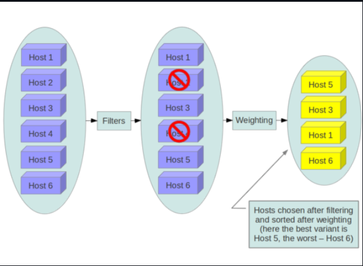
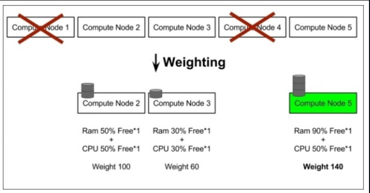

# CƠ CHẾ SCHEDULER VÀ FILTER VÀ WEIGHTING TRONG NOVA

## I. TÌM HIỂU NOVA SCHEDULER

### 1. Nova Scheduler là gì ?

Trong OpenStack Nova, Scheduler là service:

```text
Chọn compute host phù hợp để chạy VM
```

Nó trả lời câu hỏi:

`“VM này nên chạy trên host nào?”`

### 2. Kiến trúc tổng thể Scheduler

```bash
User/API (nova-api)
        ↓
nova-conductor
        ↓
nova-scheduler
        ↓
compute host (nova-compute)
```

**Vai trò**:

| Component      | Vai trò             |
| -------------- | ------------------- |
| nova-api       | nhận request        |
| nova-conductor | trung gian DB + RPC |
| nova-scheduler | chọn host           |
| nova-compute   | tạo VM              |

### 3. Flow chi tiết khi tạo VM

`Bước 1`: User request

openstack server create

`Bước 2`: nova-api

- Validate request
- Tạo instance record (chưa có host)

`Bước 3`: nova-conductor

gọi scheduler

`Bước 4`: nova-scheduler

Làm 3 việc chính:

1. Lấy danh sách host
2. Filter host
3. Weigh host

`Bước 5`: trả về host tốt nhất

→ `conductor` → `compute` → `spawn VM`

### 4. Scheduler driver

Nova hỗ trợ nhiều driver nhưng phổ biến nhất:

```bash
scheduler_driver = filter_scheduler
```

=> Đây là `Filter` + `Weight model` = `Filter Scheduler`

### 5. Tổng quan cơ chế Filter Scheduler (Filtering)

```bash
All hosts
   ↓
[Filters]  → loại host không phù hợp
   ↓
[Weighers] → chấm điểm host
   ↓
Best host
```



Cơ chế hoạt động của **Filter Scheduler**: Là **Filtering** đuwocj trình bày như sau:

- Trong quá trình boot VM , **Filter Scheduler** dò trên nodes Compute được tìm thấy, đánh giá lại đói với mỗi thiết lập của **filters**. Đánh giá kết quả các hosts được sắp xếp bởi **weighers**. Scheduler sau đó chọn hosts có **weighted cao nhất cho instance**.

- Nếu **Scheduler** không thể tìm thấy host phù hợp cho instance, nó có nghĩa là không có hosts thích hợp cho việc tạo instance.

- **Filter Scheduler** khá linh hoạt để hỗ trợ nhiều loại yêu cầu filtering và weighting. Nếu filter mặc định của OpenStack chưa đủ linh hoạt, bạn có thể sử dụng thuật toán filtering của bạn.

- Compute được cấu hình với những thông số scheduler mặc định sau:

```bash
scheduler_driver_task_period = 60
scheduler_driver = nova.scheduler.filter_scheduler.FilterScheduler
scheduler_available_filters = nova.scheduler.filters.all_filters
scheduler_default_filters = RetryFilter, AvailabilityZoneFilter, RamFilter, DiskFilter, ComputeFilter, ComputeCapabilitiesFilter, ImagePropertiesFilter, ServerGroupAntiAffinityFilter, ServerGroupAffinityFilter
```

- Mặc định thì **scheduler_driver** được cấu hình như là **filter scheduler**, scheduler này sẽ xem xét các host có đầy đủ các tiêu chí hay chuẩn (nova.scheduler.filters) sau:

- Chưa từng tham gia vào scheduling (`RetryFilter`)
- Nằm trong vùng requested availability zone (`requested availability zone`)
- Có RAM phù hợp (`RamFilter`).
- Có dung lượng ổ cứng phù hợp cho root và ephemeral storage (`DiskFilter`).
- Có thể thực thi yêu cầu (`ComputeFilter`)
- Đáp ứng các yêu cầu ngoại lệ với các instance type (`ComputeCapabilitiesFilter`)
- Đáp ứng mọi yêu cầu về architecture, hypervisor type, hoặc virtual machine mode properties được khai báo trong instance’s image properties (`ImagePropertiesFilter`).
- Ở host khác với các instance khác trong group (nếu có) (`ServerGroupAntiAffinityFilter`).
- Ở trong danh sách các group hosts (nếu có) (`ServerGroupAffinityFilter`).

Scheduler sẽ cache lại danh sách available hosts, dùng `scheduler_driver_task_period` để quy định thời gian danh sách được update.

## II. TÌM HIỂU VỀ FILTER

### 1. Filter là gì?

Filter = điều kiện loại host

-> Nếu host không đạt → `bị loại`

Nguyên tắc:

`"Host phải pass TẤT CẢ filters"`

### 2. Các nhóm Filter quan trọng

#### 2.1 Resource Filters

1.RamFilter

- Đủ RAM không?

```bash
free_ram_mb >= required_ram
```

2.CoreFilter

- Đủ CPU không?

```bash
vcpus >= required_vcpus
```

3.DiskFilter

- Đủ disk không?

```bash
free_disk >= required_disk
```

#### 2.2 Compute state filters

1.ComputeFilter  
2.Compute Capabilities Filter

=> Có thể tham khảo nhiều Filter nữa ở tài liệu [sau](https://docs.openstack.org/mitaka/config-reference/compute/scheduler.html)

## II. TÌM HIỂU VỀ WEIGHER LÀ GÌ?



### 1. Định nghĩa Weigher

Sau khi filter xong còn nhiều host → Ta cần Weigher để chọn best host.

`Weigher` = **chấm điểm host theo công thức**:

```bash
Host score = sum(weight * multiplier)
```

### 2. Các Weigher phổ biến

#### 2.1 RAMWeigher

ưu tiên host còn nhiều RAM

#### 2.2 CPUWeigher

ưu tiên CPU rảnh

#### 3.3 DiskWeigher

ưu tiên disk trống

#### 3.4 MetricsWeigher

custom metrics (Ceilometer)

#### 3.5 IoOpsWeigher

tránh host quá tải IO

#### 3.6 Công thức chọn host

Final host = max(score)

### 3. Cơ chế Weighting

Sau khi Filter loại host không hợp lệ, vẫn còn nhiều host → cần chọn host tốt nhất. Và lúc này cần chấm điểm host score và đây gọi là cơ chế **Weighting**

Nguyên tắc hoạt động

```text
Host score = Σ (weight × multiplier)
```

Trong đó:

- mỗi weigher → cho 1 điểm
- cộng lại → ra score cuối
- host có score cao nhất → được chọn

Riêng **multiplier**. Config trong:

```bash
/etc/nova/nova.conf
```

Ví dụ:

```bash
ram_weight_multiplier = 1.0
cpu_weight_multiplier = 2.0
```

=> CPU quan trọng gấp đôi RAM