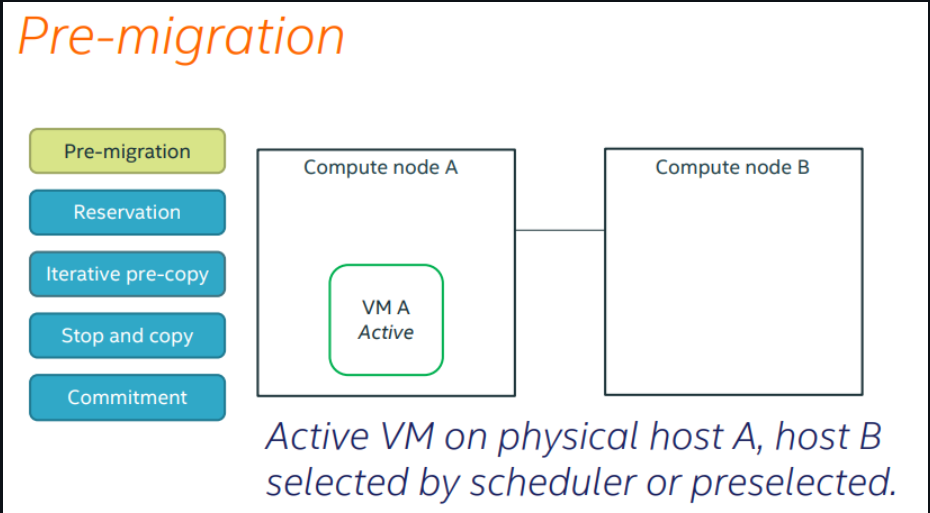
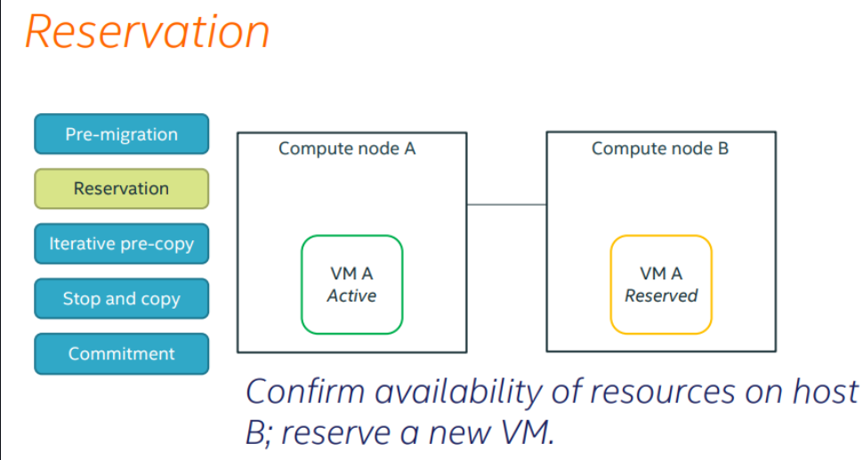
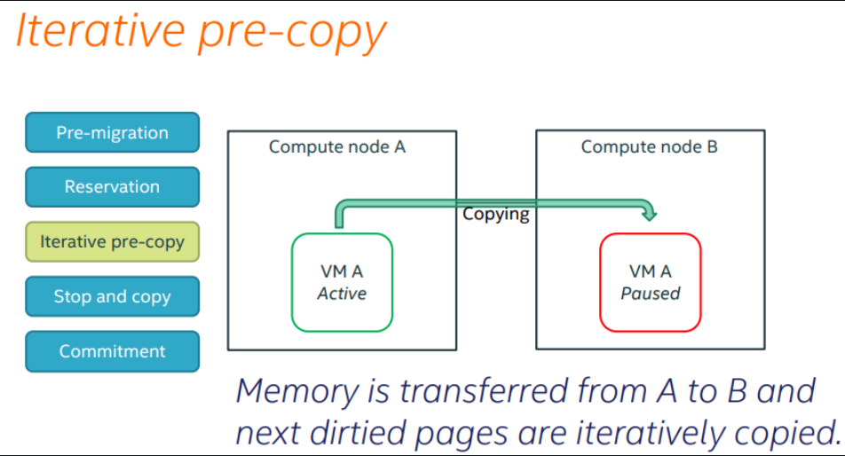
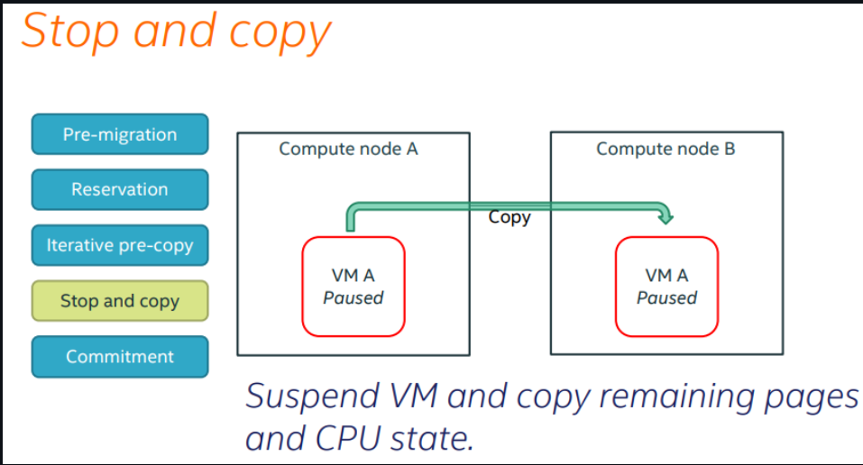
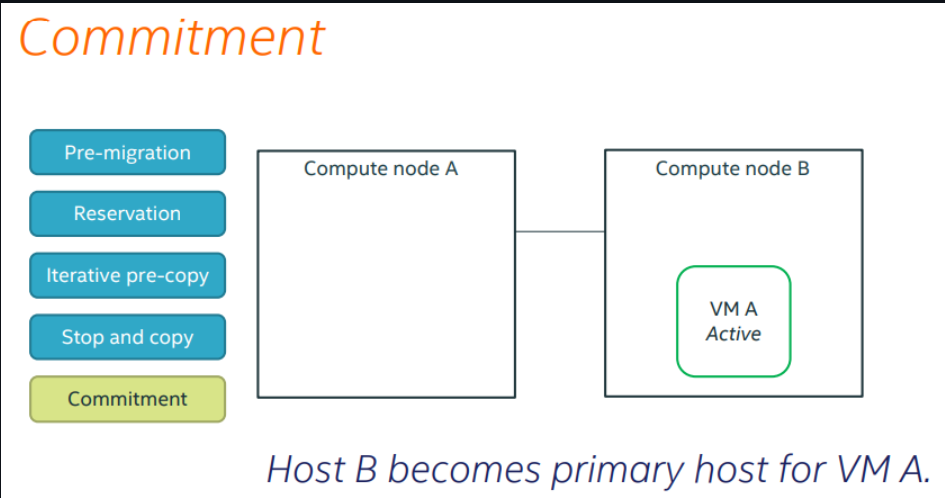

# TÌM HIỂU VỀ COLD MIGRATE , LIVE MIGRATE, RESIZE, RESCUE, EVACUATE AND WORKING FLOW OF THEM

## I. TÌM HIỂU VỀ MIGRATE

### 1. Migrate là gì?


**Migration** là **quá trình di chuyển máy ảo** từ **host vật lí này** sang một **host vật lí khác**. **Migration** được sinh ra để làm nhiệm vụ bảo trì nâng cấp hệ thống. Ngày nay **tính năng này đã được phát triển** để **thực hiện nhiều tác vụ hơn**:

- **Cân bằng tải**: Di chuyển VMs tới các host khác khi phát hiện host đang chạy có dấu hiệu quá tải.  
- **Bảo trì, nâng cấp hệ thống**: Di chuyển các VMs ra khỏi host trước khi tắt nó đi.  
- **Khôi phục lại máy ảo khi host gặp lỗi**: Restart máy ảo trên một host khác.

Trong OpenStack, việc **Migrate** được **thực hiện giữa các node compute với nhau** hoặc **giữa các project trên cùng 1 node compute**.

### 2. Các kiểu Migrate trong OPS và WorkFlow của chúng

OpenStack hỗ trợ 2 kiểu **Migration** đó là:

- `Cold migration` : Non-live migration
- `Live migration` :

  - `True live migration` (shared storage or volume-based)
  - `Block live migration`

#### 2.1 Cold Migrate (Non-live Migrate)

- **Cold Migrate** khác live **Migrate** ở chỗ nó thực hiện **Migration** khi tắt máy ảo ( Libvirt domain không chạy)

- Yêu cầu **SSH key pairs** được triển khai cho user đang chạy `nova-compute` với mọi **Hypervisors**.

##### 2.1.1 Cold Migrate workflow

- Tắt máy ảo ( tương tự `virsh destroy` ) và disconnect các volume.

- Di chuyển thư mục hiện hành của máy ảo ra ngoài (`instance_dir` -> `instance_dir_resize`). Tiến trình **Resize Instance** sẽ tạo ra thư mục tạm thời.

- Nếu sử dụng `QCOW2`, convert image sang dạng `RAW`.

- Với hệ thống Shared Storage, di chuyển thư mục `instance_dir` mới vào. Nếu không, copy thông qua SCP.

#### 2.2 Live Migrate

- Thực hiện bởi câu lệnh:

```bash
"nova live-migration [--block-migrate]"
```

- Có 2 loại Live Migration: **Normal Migration** và **“Block” Migrations**.

  - **Normal live Migration** yêu cầu cả **hai source** và **target hypervisor** phải **truy cập đến data của instance** ( trên hệ thống lưu trữ có chia sẻ, ví dụ: `NAS`, `SAN`)

  - **Block migration** không yêu cầu đặc biệt gì đối với **Hệ thống storage**. **Instance disk** được migrated như một phần của tiến trình.

- **Live migrations** là một trong những thao tác vận hành mang tính nhạy cảm nhất liên quan đến phiên bản của `QEMU` đang chạy trên máy chủ nguồn và đích.

##### 2.2.1 Live Migration WorkFlow

- Kiểm tra **storage backend** là thích hợp với loại migration hay không:

  - Thực hiện kiểm tra hệ thống **shared storage** cho **Normal migrations**
  - Thực hiện **kiểm tra các yêu cầu** cho **Block migrations**
  - Kiểm tra trên cả source và destination, điều phối thông qua **RPC calls** từ scheduler.

- Trên destination
  
  - Tạo các kết nối volume cần thiết.
  - Nếu là **Block migration**, tạo thư mục instance, lưu lại các file bị mất từ Glance và tạo instance disk trống.

- Trên source, khởi tạo tiến trình migration.
- Khi tiến trình hoàn tất, tái sinh file `Libvirt XML` và define nó trên destination.

Dưới đây là hình minh hoạ:











### 3. So sánh ưu nhược điểm giữa cold và live migrate

**Cold migrate**:

Ưu điểm:

- Đơn giản, dễ thực hiện
- Thực hiện được với mọi loại máy ảo

Hạn chế:

- Thời gian downtime lớn
- Không thể chọn được host muốn migrate tới.
- Quá trình migrate có thể mất một khoảng thời gian dài

**Live migrate**:

Ưu điểm:

- Có thể chọn host muốn migrate
- Tiết kiệm chi phí, tăng sự linh hoạt trong khâu quản lí và vận hành.
- Giảm thời gian downtime và gia tăng thêm khả năng "cứu hộ" khi gặp sự cố

Nhược điểm:

- Dù chọn được host nhưng vẫn có những giới hạn nhất định
- Quá trình migrate có thể fails nếu host bạn chọn không có đủ tài nguyên.
- Bạn không được can thiệp vào bất cứ tiến trình nào trong quá trình live migrate.
- Khó migrate với những máy ảo có dung lượng bộ nhớ lớn và trường hợp hai host khác CPU.