# THỰC HÀNH LAB CƠ BẢN VỚI NOVA OPENSTACK

## I. MÔI TRƯỜNG

Môi trường Lab là ta sẽ thực hiện trên cụm OpenStack mà ta đã dựng sau [đây](https://github.com/tiend9/Tim-hieu-OPNsense/blob/main/07.Learn_About_OpenStack_Cinder/labs/01.Install_Cinder_with_LVM.md)

## II. LAB

### 1. Lab tạo và quản lí VM

**Mục tiêu**:

- Tạo flavor, upload image (Cirros/Ubuntu) vào Glance
- Boot instance bằng openstack server create
- Gắn floating IP, SSH vào instance
- Thực hành stop → start → reboot → shelve → unshelve

**Thực hành**:

- Đối với Tạo flavor, upload image (Cirros/Ubuntu) vào Glance; Boot instance bằng `openstack server create` và Gắn floating IP, SSH vào instance hay stop->start->reboot ta tham khảo khảo tài liệu tài liệu trước [đây](https://github.com/tiend9/Tim-hieu-OPNsense/blob/main/02.Learn_About_OpenStack/02.%20Learn_About_Metadata.md)

Còn đối với **shelve**->**unshelve** VM thì ta hiểu như sau:

- **Shelve** là kiểu "đóng băng" VM — Nova tạo snapshot disk, xóa VM khỏi hypervisor (giải phóng CPU/RAM), nhưng vẫn giữ snapshot trong Glance. VM chuyển sang trạng thái `SHELVED_OFFLOADED`.
- **Unshelve** thì làm ngược lại — Nova lấy snapshot đó, tạo lại VM từ đầu trên một compute node (có thể khác node cũ).

Đầu tiên, ta test tạo 1 VM `test-shelve` để thử **shelve** nó :

```bash
openstack server create \
  --flavor m1.ubuntu \
  --image ubuntu-22.04-server \
  --nic net-id=$(openstack network show provider -f value -c id) \
  --key-name mykey \
  test-shelve

openstack server list
```

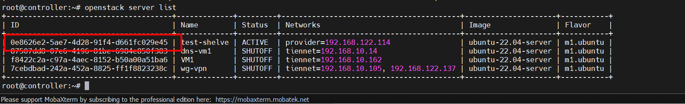

Trong VM, ghi thử dữ liệu vào file trước khi shelve:

```bash
touch file.txt
echo "data before shelve" > file.txt
cat file.txt
```

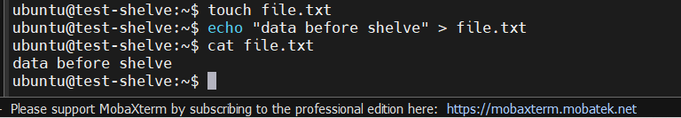

Sau đó, tiến hành shelve VM:

```bash
openstack server shelve test-shelve

openstack server show test-shelve \
  -c status \
  -c OS-EXT-SRV-ATTR:host \
  -c flavor_attached
```

Output:

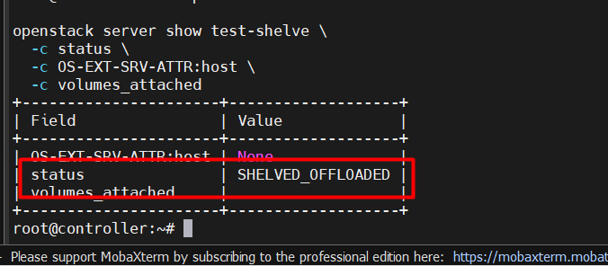

=> Trạng thái `shelved` khác `shelved offload` đó là: `shelved` vẫn gắn trên Compute Node còn `shelved offload` đã được gỡ khỏi Compute Node và sẵn sàng được chuyển sang Compute Node khác.

Nếu status của bạn là `SHELVED` thì có thể ép về `SHELVED OFFLOAD` bằng cách:

```bash
nova shelve-offload test-shelve
```

Trên **Compute Node** có thể soi thêm:

```bash
virsh list --all
ls -lh /var/lib/nova/instances/
```

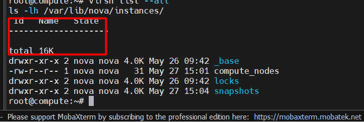

=> VM đã bị gỡ khỏi Compute Node: Khi `SHELVED_OFFLOADED`, VM gần như đã bị gỡ khỏi compute host, tài nguyên CPU/RAM được trả lại. Với VM boot từ image, Nova sẽ giữ snapshot tạm ở Glance. Với volume Cinder attach kèm, dữ liệu volume vẫn nằm ở Storage Node trong VG `cinder-volumes`.

Tiếp theo, **Unshelve** VM:

```bash
openstack server unshelve test-shelve

openstack server list
openstack server show test-shelve \
  -c status \
  -c OS-EXT-SRV-ATTR:host \
  -c volumes_attached
```

### 2. Lab Keypair, Security Group & metadata

**Mục tiêu**:

- Tạo keypair, inject vào instance
- Cấu hình security group: inbound SSH, HTTP
- Dùng `user-data` / `cloud-init` để cài package tự động khi boot

**Thực hành**:

Các phần trên ta có thể tham khảo từ phần ta đã làm trước [đây](https://github.com/tiend9/Tim-hieu-OPNsense/blob/main/02.Learn_About_OpenStack/02.%20Learn_About_Metadata.md)

**Bổ sung phần rotate keypair**:

Trong OpenStack/Nova, cần hiểu đúng một điểm quan trọng:

- `openstack keypair create` chỉ tạo/lưu **public key** trong Nova.
- File `.pem` là **private key**, Nova chỉ trả về đúng một lần lúc tạo keypair.
- Keypair được inject vào VM thông qua metadata/cloud-init ở lần boot đầu tiên.
- Xóa hoặc tạo lại keypair trong OpenStack **không tự đổi key SSH bên trong VM đang chạy**.

Vì vậy, rotate keypair có 2 phần:

- Rotate keypair trong OpenStack để các VM tạo mới dùng key mới.
- Rotate `authorized_keys` bên trong VM cũ để VM đang chạy chấp nhận key mới và bỏ key cũ.

#### a. Kiểm tra keypair hiện tại

Trên **Controller Node**, kiểm tra keypair đang có:

```bash
openstack keypair list
openstack keypair show mykey
```

Nếu muốn xem VM đang được tạo với keypair nào:

```bash
openstack server show test-ubuntu \
  -c name \
  -c status \
  -c key_name \
  -c addresses
```

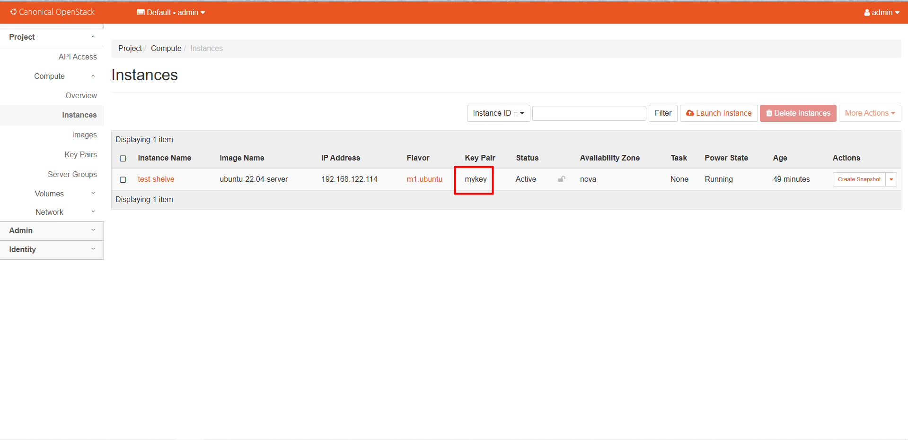

> Lưu ý: `key_name` chỉ cho biết VM được boot với keypair nào ban đầu. Nếu sau này ta sửa `~/.ssh/authorized_keys` trong VM thì giá trị `key_name` trong Nova vẫn không đổi.

#### b. Tạo keypair mới để rotate

Ta tạo keypair mới tên `mykey-rotate`:

```bash
openstack keypair create mykey-rotate > /root/mykey-rotate.pem
chmod 600 /root/mykey-rotate.pem
ssh-keygen -y -f /root/mykey-rotate.pem > /root/mykey-rotate.pub
```

Kiểm tra lại:

```bash
openstack keypair list
cat /root/mykey-rotate.pub
```

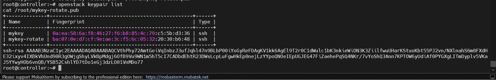

Trong đó:

- `/root/mykey-rotate.pem` là private key mới để SSH.
- `/root/mykey-rotate.pub` là public key sẽ đưa vào file `authorized_keys` trong VM.
- `mykey-rotate` là keypair object trong Nova, dùng cho các VM tạo mới về sau.

#### c. Thêm key mới vào VM đang chạy

Trước tiên SSH vào VM bằng key cũ:

```bash
ssh -i /root/mykey.pem ubuntu@<VM_IP>
```

Sau khi đã vào trong VM, backup file `authorized_keys`:

```bash
mkdir -p ~/.ssh
chmod 700 ~/.ssh
cp ~/.ssh/authorized_keys ~/.ssh/authorized_keys.bak.$(date +%F-%H%M%S)
```

Quay lại **Controller Node**, copy public key mới vào VM:

```bash
ssh-copy-id -f -i /root/mykey-rotate.pub -o IdentityFile=/root/mykey.pem ubuntu@<VM_IP>
```

Nếu máy không có `ssh-copy-id`, có thể làm thủ công:

```bash
NEW_PUB_KEY=$(cat /root/mykey-rotate.pub)
ssh -i /root/mykey.pem ubuntu@<VM_IP> "mkdir -p ~/.ssh && chmod 700 ~/.ssh && echo '$NEW_PUB_KEY' >> ~/.ssh/authorized_keys && chmod 600 ~/.ssh/authorized_keys"
```

> Với lệnh thủ công ở trên, nếu VM không dùng user `ubuntu` thì đổi `ubuntu@<VM_IP>` thành `tien9a@<VM_IP>` hoặc `cirros@<VM_IP>` tương ứng.

#### d. Test key mới trước khi xóa key cũ

Mở một terminal khác và SSH bằng key mới:

```bash
ssh -i /root/mykey-rotate.pem ubuntu@<VM_IP>
```

>Chỉ khi key mới đã SSH thành công thì mới xóa key cũ. Đây là bước rất quan trọng để tránh tự khóa mình khỏi VM.

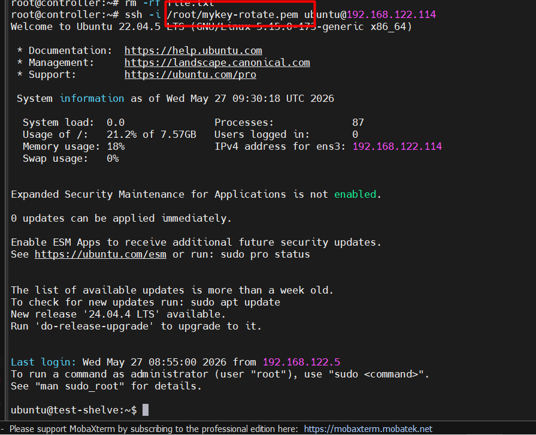

#### e. Xóa public key cũ khỏi VM

Lấy public key cũ từ private key cũ:

```bash
ssh-keygen -y -f /root/mykey.pem > /root/mykey.pub
cat /root/mykey.pub
```

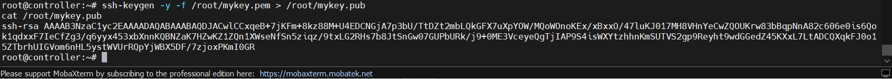

SSH vào VM bằng key mới:

```bash
ssh -i /root/mykey-rotate.pem ubuntu@<VM_IP>
```

Trong VM, mở file `authorized_keys` và xóa dòng public key cũ:

```bash
nano ~/.ssh/authorized_keys
```

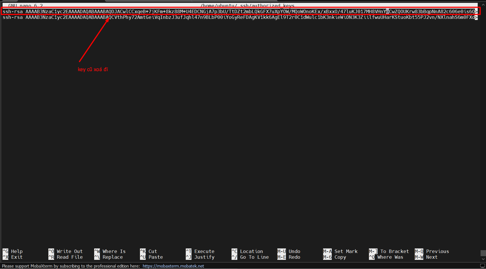

Sau đó kiểm tra quyền file:

```bash
chmod 700 ~/.ssh
chmod 600 ~/.ssh/authorized_keys
```

Thoát ra rồi test lại:

```bash
# Key mới phải vào được
ssh -i /root/mykey-rotate.pem ubuntu@<VM_IP>

# Key cũ nên bị từ chối
ssh -i /root/mykey.pem ubuntu@<VM_IP>
```

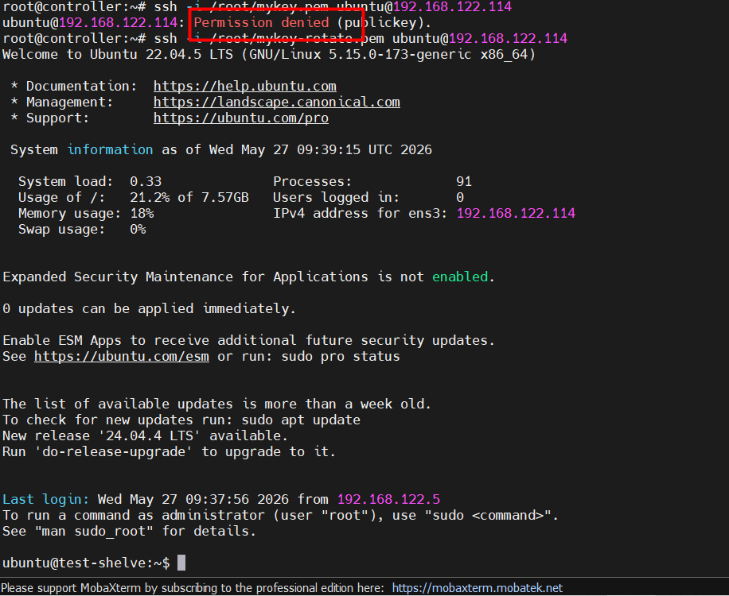

Nếu key mới vào được và key cũ không vào được nữa thì rotate keypair cho VM đang chạy đã thành công.

#### f. Đổi keypair dùng cho các VM tạo mới

Từ thời điểm này, khi tạo VM mới thì dùng key mới:

```bash
openstack server create \
  --flavor m1.ubuntu \
  --image ubuntu-22.04-server \
  --nic net-id=$(openstack network show provider -f value -c id) \
  --security-group default \
  --key-name mykey-rotate \
  test-ubuntu-rotate
```

Nếu chắc chắn không còn VM nào cần keypair cũ `mykey`, có thể xóa object keypair cũ trong OpenStack:

```bash
openstack keypair delete mykey
openstack keypair list
```

> Lưu ý: Lệnh trên chỉ xóa keypair object trong Nova. Nó không xóa dòng public key cũ trong các VM đã tồn tại. Muốn khóa key cũ khỏi VM nào thì phải xóa public key đó trong `~/.ssh/authorized_keys` của VM đó.

#### g. Trường hợp mất private key cũ

Nếu mất `/root/mykey.pem` mà VM vẫn còn cách đăng nhập khác như password, console hoặc user khác có sudo, ta vẫn có thể thêm key mới vào `authorized_keys` như phần trên.

Nếu mất private key cũ và cũng không còn cách đăng nhập vào VM, Nova không thể lấy lại private key cũ cho ta. Khi đó có vài hướng xử lý:

- Dùng console/VNC nếu VM có user/password còn đăng nhập được.
- Dùng rescue mode để mount disk VM rồi sửa `authorized_keys`.
- Rebuild hoặc tạo VM mới với `--key-name mykey-rotate`.

Với lab hiện tại, cách an toàn nhất là luôn tạo key mới, add vào VM, test SSH bằng key mới, rồi mới xóa key cũ.

### 3. Lab Snapshot & Backup VM

**Mục tiêu**:

- Instance snapshot: Chụp snapshot root disk của VM, tạo VM mới từ snapshot và verify dữ liệu.
- Instance backup: Tạo backup image theo kiểu daily/weekly và quản lý retention.
- Volume snapshot/backup: Bảo vệ dữ liệu nằm trên Cinder volume attach vào VM.
- Restore: Mô phỏng mất dữ liệu rồi khôi phục từ snapshot/backup.

**Lưu ý quan trọng**:

- Nova snapshot/backup của instance chủ yếu bảo vệ **root disk** của VM và tạo image mới trong Glance.
- Nếu VM có attach thêm Cinder volume như `test-volume` trong bài Cinder LVM, dữ liệu trong volume đó cần snapshot/backup bằng Cinder riêng.
- Muốn snapshot nhất quán hơn trong lab, nên `sync`, dừng app ghi dữ liệu, hoặc stop VM trước khi snapshot.
- Với Ubuntu cloud image, keypair/user-data vẫn lấy qua metadata/cloud-init khi boot VM mới từ snapshot.

#### a. Chuẩn bị VM để test snapshot

Trong lab này ta dùng VM Ubuntu `test-ubuntu` đã tạo ở bài metadata. Nếu chưa có thì tạo lại:

```bash
openstack server create \
  --flavor m1.ubuntu \
  --image ubuntu-22.04-server \
  --nic net-id=$(openstack network show provider -f value -c id) \
  --security-group default \
  --key-name mykey-rotate \
  test-ubuntu

openstack server list
```

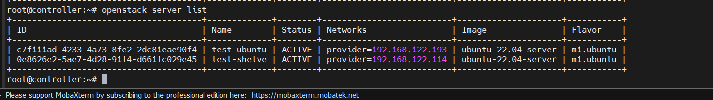

SSH vào VM và tạo file dữ liệu mẫu trên root disk:

```bash
ssh -i mykey-rotate.pem ubuntu@<VM_IP>
```

Trong VM:

```bash
echo "data before nova snapshot" | sudo tee /root/nova-snapshot-test.txt
cat /root/nova-snapshot-test.txt
sync
exit
```

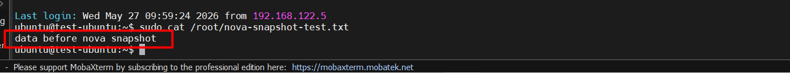

Kiểm tra VM đang `ACTIVE`:

```bash
openstack server show test-ubuntu \
  -c status \
  -c addresses \
  -c OS-EXT-SRV-ATTR:host
```

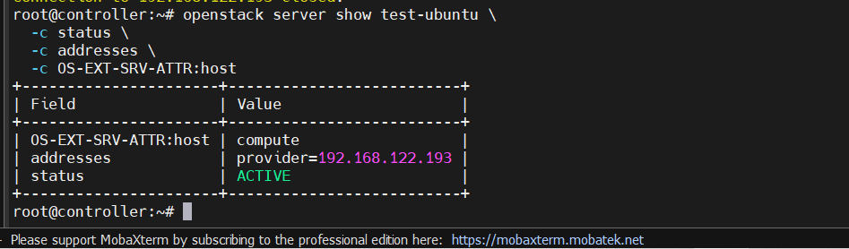

#### b. Chụp Nova instance snapshot

Để snapshot root disk sạch hơn trong lab, stop VM trước:

```bash
openstack server stop test-ubuntu
openstack server show test-ubuntu -c status
```

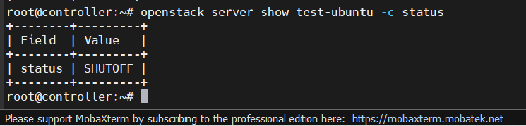

Khi VM đã `SHUTOFF`, tạo snapshot:

```bash
openstack server image create \
  --name test-ubuntu-snap-01 \
  --wait \
  test-ubuntu
```

Kiểm tra snapshot image trong Glance:

```bash
openstack image list
openstack image show test-ubuntu-snap-01 \
  -c id \
  -c name \
  -c status \
  -c disk_format \
  -c size
```

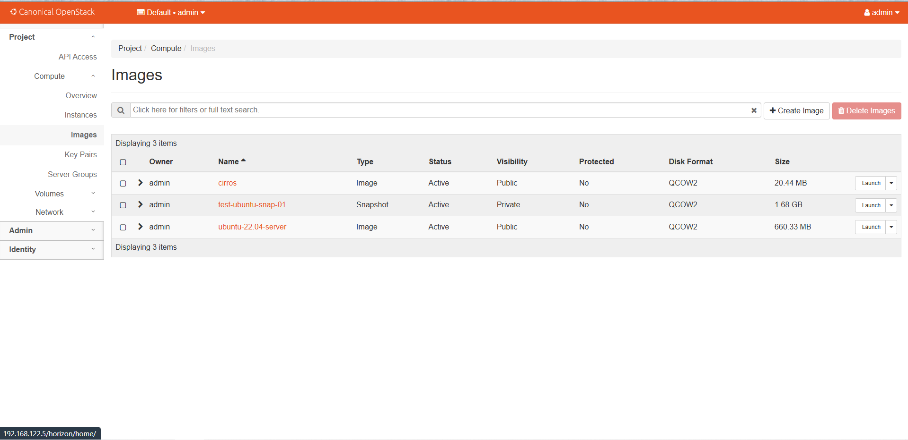

Sau đó start lại VM gốc:

```bash
openstack server start test-ubuntu
openstack server list
```

#### c. Restore bằng cách tạo VM mới từ snapshot

Nova không "rollback" trực tiếp VM cũ về snapshot theo kiểu undo tại chỗ. Cách an toàn trong lab là tạo VM mới từ snapshot image:

```bash
openstack server create \
  --flavor m1.ubuntu \
  --image test-ubuntu-snap-01 \
  --nic net-id=$(openstack network show provider -f value -c id) \
  --security-group default \
  --key-name mykey-rotate \
  restore-from-nova-snapshot

openstack server list
```

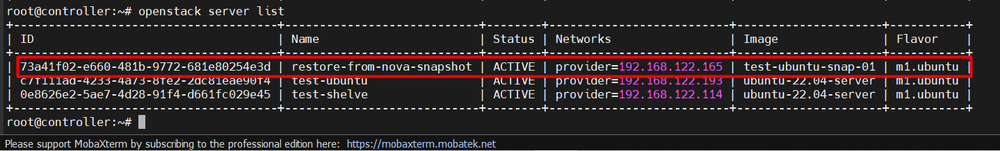

SSH vào VM restore và kiểm tra file đã có từ thời điểm snapshot:

```bash
ssh -i /root/mykey-rotate.pem ubuntu@<RESTORE_VM_IP>
```

Trong VM restore:

```bash
sudo cat /root/nova-snapshot-test.txt
```

Nếu thấy:

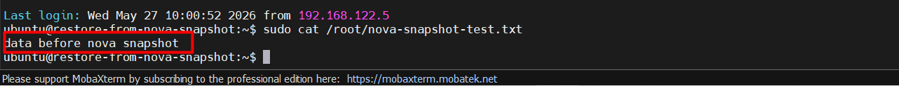

=> VM restore từ Nova snapshot đã hoạt động.

#### d. Mô phỏng mất dữ liệu trên VM gốc

Trên VM gốc `test-ubuntu`, xóa file:

```bash
ssh -i /root/mykey-rotate.pem ubuntu@<VM_IP>
sudo rm -f /root/nova-snapshot-test.txt
sudo ls -l /root/nova-snapshot-test.txt
```

File trên VM gốc đã mất, nhưng VM `restore-from-nova-snapshot` vẫn còn file vì nó được boot từ image snapshot đã chụp trước đó.

Nếu muốn khôi phục theo kiểu thay VM cũ bằng VM mới, ta thường:

- Tạo VM mới từ snapshot.
- Kiểm tra service/data.
- Chuyển IP/Floating IP hoặc DNS sang VM mới.
- Xóa VM cũ sau khi chắc chắn không cần nữa.

#### e. Tạo Nova instance backup

Nova backup cũng tạo image trong Glance giống snapshot, nhưng có thêm `backup_type` và `rotation` để giữ số bản backup gần nhất.

Trước khi backup, tạo một file test riêng cho backup:

```bash
ssh -i /root/mykey-rotate.pem ubuntu@<VM_IP>
```

Trong VM:

```bash
echo "data before nova backup" | sudo tee /root/nova-backup-test.txt
cat /root/nova-backup-test.txt
sync
exit
```

Tạo backup daily, giữ tối đa 2 bản:

```bash
openstack server backup create \
  --name test-ubuntu-daily \
  --type daily \
  --rotate 2 \
  --wait \
  test-ubuntu
```

Kiểm tra image backup:

```bash
openstack image list
openstack image show test-ubuntu-daily \
  -c id \
  -c name \
  -c status \
  -c properties
```

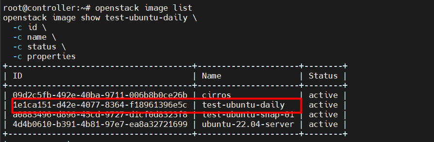

Tạo thêm một backup daily lần 2 để kiểm tra rotation:

```bash
openstack server backup create \
  --name test-ubuntu-daily-2 \
  --type daily \
  --rotate 2 \
  --wait \
  test-ubuntu

openstack image list
```

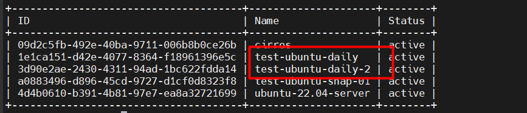

Nếu số backup cùng type vượt quá `--rotate 2`, Nova sẽ giữ các bản mới nhất và dọn bớt bản cũ theo policy backup rotation.

Restore từ backup image cũng giống restore từ snapshot:

```bash
openstack server create \
  --flavor m1.ubuntu \
  --image test-ubuntu-daily \
  --nic net-id=$(openstack network show provider -f value -c id) \
  --security-group default \
  --key-name mykey-rotate \
  restore-from-nova-backup
```

SSH vào VM restore từ backup và kiểm tra:

```bash
ssh -i mykey-rotate.pem ubuntu@<BACKUP_RESTORE_VM_IP>
sudo cat /root/nova-backup-test.txt
```

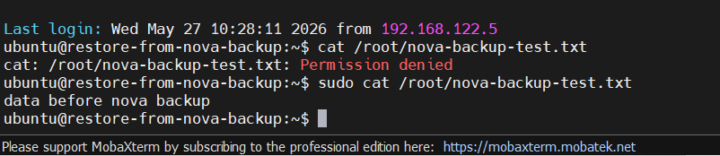

Nếu thấy `data before nova backup` thì restore từ Nova backup đã OK.

#### f. Snapshot Cinder volume attach vào VM

Nếu dữ liệu nằm trong Cinder volume như `test-volume` ở bài Cinder LVM, không nên chỉ dựa vào Nova snapshot. Cần snapshot volume riêng.

Kiểm tra volume đang attach vào VM nào:

```bash
openstack volume list
openstack server volume list test-cirros
openstack volume show test-volume \
  -c status \
  -c attachments
```

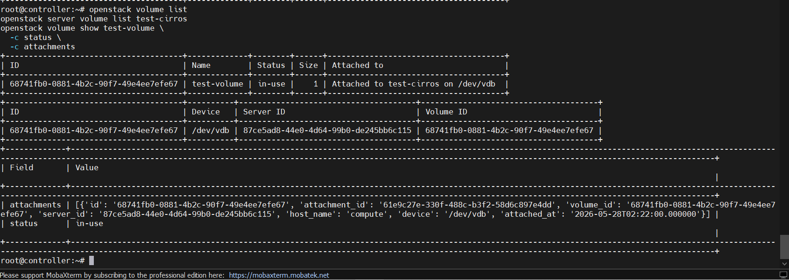

Trong VM, flush dữ liệu và unmount volume trước:

```bash
ssh -i mykey.pem cirros@<CIRROS_IP>
```

Trong VM CirrOS:

```bash
sync
sudo umount /mnt/cinder-volume
exit
```

Trên Controller, detach volume để snapshot ở trạng thái sạch:

```bash
openstack server remove volume test-cirros test-volume
openstack volume show test-volume -c status
```

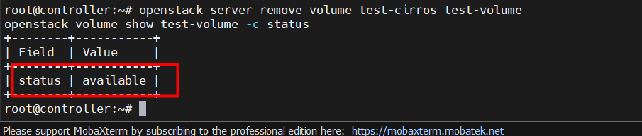

Khi volume về `available`, tạo snapshot:

```bash
openstack volume snapshot create \
  --volume test-volume \
  test-volume-snap-01

openstack volume snapshot list
openstack volume snapshot show test-volume-snap-01 \
  -c status \
  -c volume_id \
  -c size
```

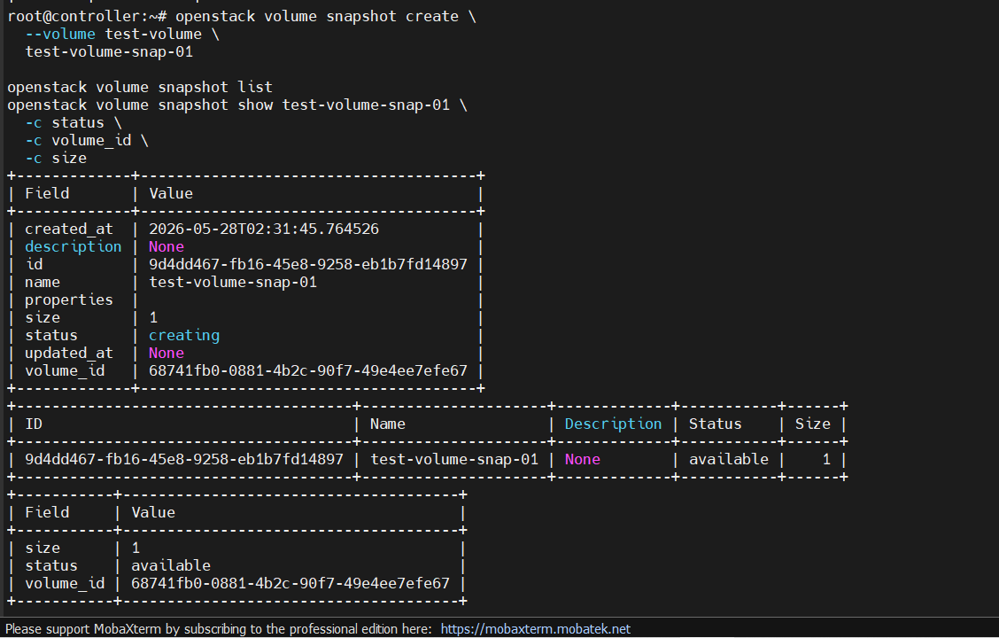

Tạo volume mới từ snapshot:

```bash
openstack volume create \
  --snapshot test-volume-snap-01 \
  --size 1 \
  test-volume-restore

openstack volume list
```

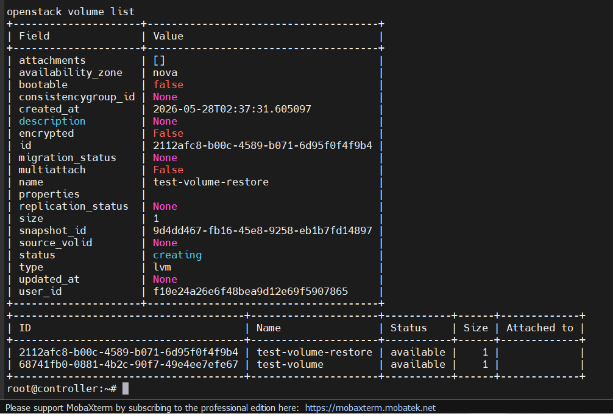

Attach volume restore vào VM để verify dữ liệu:

```bash
openstack server add volume test-cirros test-volume-restore
openstack server volume list test-cirros
```

Trong VM, mount disk mới và đọc file:

```bash
ssh -i mykey.pem cirros@<CIRROS_IP>
```

Trong VM:

```bash
lsblk
sudo mkdir -p /mnt/cinder-volume-restore
sudo mount /dev/vdb /mnt/cinder-volume-restore
cat /mnt/cinder-volume-restore/test.txt
```

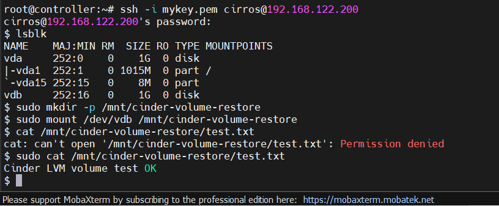

#### g. Backup Cinder volume

Volume backup khác volume snapshot ở chỗ backup thường được đẩy sang backend backup riêng, ví dụ file/NFS/Ceph/S3, và cần service `cinder-backup`.

Kiểm tra cụm đã có `cinder-backup` chưa:

```bash
openstack volume service list
```

Nếu chưa thấy service `cinder-backup`, phần volume backup sẽ chưa chạy được. Lúc đó cần cài và cấu hình thêm `cinder-backup` trước. Trong bài Cinder LVM hiện tại, ta đã cài `cinder-api`, `cinder-scheduler`, `cinder-volume`, còn `cinder-backup` là phần mở rộng.

Khi đã có `cinder-backup`, tạo backup cho volume:

```bash
openstack volume backup create \
  --name test-volume-backup-01 \
  test-volume

openstack volume backup list
openstack volume backup show test-volume-backup-01 \
  -c status \
  -c volume_id \
  -c size
```

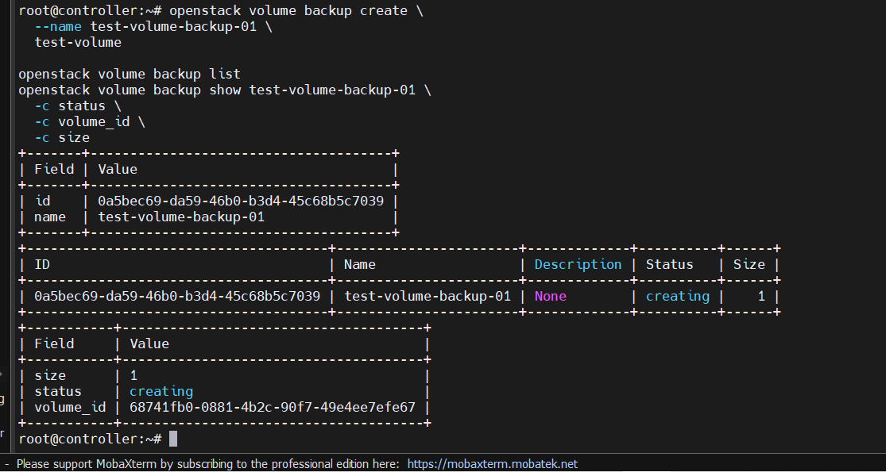

Nếu volume đang `in-use`, nên unmount và detach trước giống phần snapshot. Một số môi trường cho phép `--force`, nhưng trong lab nên detach để tránh backup dữ liệu đang ghi dở.

Restore backup sang volume mới:

```bash
#Tạo volume mới để backup vào:
openstack volume create --size 1 --type lvm test-volume-from-backup

openstack volume backup restore \
  test-volume-backup-01 \
  test-volume-from-backup

openstack volume show test-volume-from-backup -c status
```

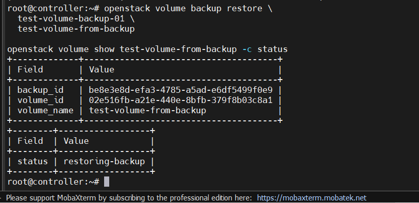

Attach volume restore vào VM rồi mount kiểm tra giống phần snapshot:

```bash
openstack server add volume test-cirros test-volume-from-backup
openstack server volume list test-cirros
```

**Note**: **Snapshot** là ảnh chụp lưu VM tại 1 thời điểm, còn Backup là sẽ lưu trạng thái VM cho tới lúc bị lỗi hoặc chết.

#### h. Dọn tài nguyên sau lab

Nếu chỉ test xong và không cần giữ lại:

```bash
openstack server delete restore-from-nova-snapshot
openstack server delete restore-from-nova-backup

openstack image delete test-ubuntu-snap-01
openstack image delete test-ubuntu-daily
openstack image delete test-ubuntu-daily-2

openstack server remove volume test-cirros test-volume-restore
openstack volume delete test-volume-restore
openstack volume snapshot delete test-volume-snap-01

openstack server remove volume test-cirros test-volume-from-backup
openstack volume delete test-volume-from-backup
openstack volume backup delete test-volume-backup-01
```

> Nếu tài nguyên báo đang `in-use`, kiểm tra lại attachment trước bằng `openstack server volume list <VM>` và `openstack volume show <VOLUME> -c attachments`.
