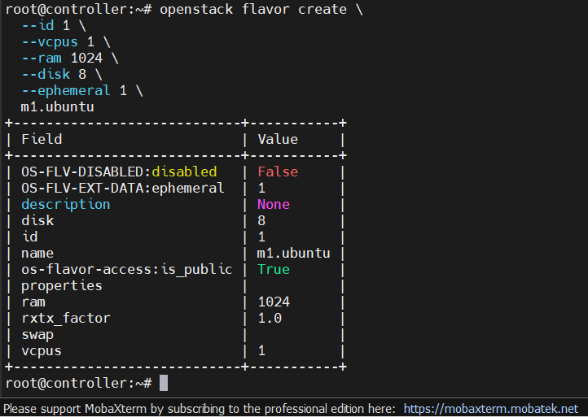
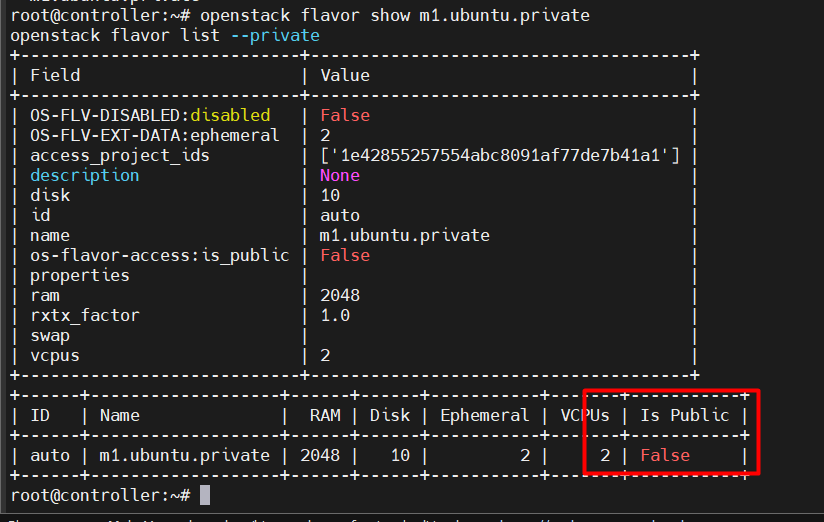
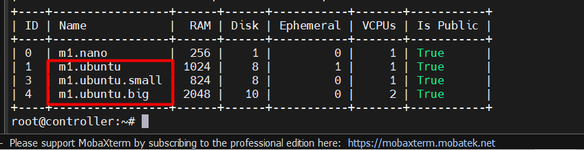
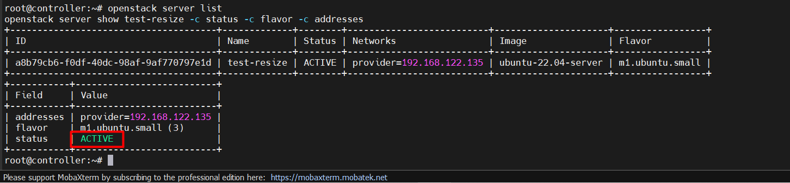
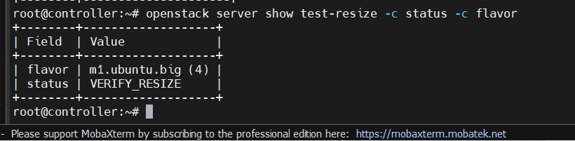
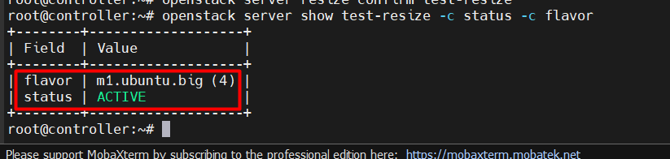
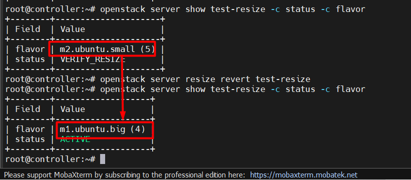

# LAB NÂNG CAO VỀ NOVA

## I. MÔI TRƯỜNG

Môi trường Lab là ta sẽ thực hiện trên cụm OpenStack mà ta đã dựng sau [đây](https://github.com/tiend9/Tim-hieu-OPNsense/blob/main/07.Learn_About_OpenStack_Cinder/labs/01.Install_Cinder_with_LVM.md)

## II. LAB

### 1. Flavor & Resource management

#### a. Tạo và quản lý custom flavor

**Mục tiêu**:

- Tạo flavor với VCPU/RAM/disk/ephemeral, giới hạn theo project.

**Thực hành**:

Ta có 2 loại flavor đó là public và private (dùng cho các project riêng)

Đầu tiên, Tạo custom flavor **public**:

```bash
# tạo flavor có tên m1.ubuntu
openstack flavor create \
  --id 1 \
  --vcpus 1 \
  --ram 1024 \
  --disk 8 \
  --ephemeral 1 \
  m1.ubuntu
# --vcpus 1       1 vCPU
# --ram 1024      1 GB RAM
# --disk 8        root disk 8 GB
# --ephemeral 1   disk tạm 1 GB, mất khi xóa VM
```

Check:



Tạo custom flavor **private**, chỉ project được dùng:

```bash
openstack flavor create \
  --id auto \
  --vcpus 2 \
  --ram 2048 \
  --disk 10 \
  --ephemeral 2 \
  --private \
  m1.ubuntu.private
```

Cho project được dùng flavor này. Nếu ta chỉ cho dùng project `admin`:

```bash
openstack flavor set \
  --project admin \
  m1.ubuntu.private
```

Check quyền access:

```bash
openstack flavor show m1.ubuntu.private
openstack flavor list --private
```



Nếu muốn bỏ quyền project:

```bash
openstack flavor unset \
  --project admin \
  m1.ubuntu.private
```

Xong sau đó, ta sẽ cấu hình giới hạn resource theo project `admin` bằng quota:

```bash
openstack quota set \
  --instances 3 \
  --cores 4 \
  --ram 4096 \
  admin

# --instances 3   tối đa 3 VM
# --cores 4       tổng tối đa 4 vCPU
# --ram 4096      tổng tối đa 4 GB RAM
```

Check quota:

```bash
openstack quota show admin
```

**Note**: Test quota bằng cách boot nhiều VM. Nếu vượt quota, Nova sẽ báo kiểu:

```bash
Quota exceeded for cores/ram/instances
```

Cuối cùng, ta gắn extra specs cho flavor:

- **Extra specs** = metadata nâng cao gắn vào flavor — dùng để kiểm soát những thứ mà CPU/RAM/disk thông thường không mô tả được.

```bash
openstack flavor set \
  --property hw:cpu_policy=shared \
  m1.ubuntu

# CPU policy — gắn CPU thật cho VM (vCPU chia sẻ core với VM khác)
```

Muốn xoá property:

```bash
openstack flavor unset \
  --property hw:cpu_policy \
  m1.ubuntu
```

=> Tương tự ta có thể đặt quota CPU/RAM/instance/floating IP theo project

#### b. Resize instance

**Mục tiêu**:

- scale up/down flavor, confirm và revert resize

**Thực hiện**:

Đầu tiên lên có flavor nhỏ hơn/ Lớn hơn để resize qua lại:

```text
m1.ubuntu
m1.ubuntu.small
m1.ubuntu.big
```

Nếu chưa có hãy tạo:

```bash
openstack flavor create \
  --id 3 \
  --vcpus 1 \
  --ram 824 \
  --disk 8 \
  m1.ubuntu.small

openstack flavor create \
  --id 4 \
  --vcpus 2 \
  --ram 2048 \
  --disk 10 \
  m1.ubuntu.big

openstack flavor list
```



Boot VM `test-resize` bằng flavor nhỏ :

```bash
openstack server create \
  --flavor m1.ubuntu.small \
  --image ubuntu-22.04-server \
  --nic net-id=$(openstack network show provider -f value -c id) \
  --security-group default \
  --key-name mykey-rotate \
  test-resize
```

Check:

```bash
openstack server list
openstack server show test-resize -c status -c flavor -c addresses
```



=> Đợi VM `ACTIVE` là `OKE`.

Tiếp theo, Ta resize lên flavor lớn:

```bash
openstack server resize \
  --flavor m1.ubuntu.big \
  test-resize
```

Check trạng thái:

```bash
openstack server show test-resize -c status -c flavor
```

**Note 2**: Ở đây, sau khi mọi người chạy lệnh resize mà flavor của Vm vẫn giữ nguyên thì khả năng do lab của ta chỉ có 1 Compute mà resize mặc định cần scheduler chọn host, nhưng Nova không cho resize lại cùng Host nếu chưa bật `allow_resize_to_same_host = true` trong file config Nova. Cách fix:

- Sửa trên **Controller**+ **Compute** `/etc/nova/nova.conf`:

```ini
[DEFAULT]
allow_resize_to_same_host = true
```

- Restart service trên **Compute Node**:

```bash
systemctl restart nova-compute
```

- Restart service nova control plane trên Controller Node:

```bash
systemctl restart nova-api nova-scheduler nova-conductor
```

- Sau đó thử resize lại:

```bash
openstack server resize \
  --flavor m1.ubuntu.big \
  test-resize
```

- Check lại:

```bash
openstack server show test-resize -c status -c flavor
```

- Nếu thấy:

```bash
VERIFY_RESIZE
```



=> Ở trạng thái này Nova đã resize xong nhưng chờ ta xác nhận.

Cuối cùng, ta confirm resize:

```bash
# Nếu VM chạy OK thì ta xác nhận resize:
openstack server resize confirm test-resize
```

Check lại:

```bash
openstack server show test-resize -c status -c flavor
```

Kỳ vọng:

```text
Trạng thái ACTIVE và flavor là m1.ubuntu.big
```



Sau khi resize được xong, ta sẽ test revert resize:

```bash
# Đầu tiên ta sẽ resize nó lại về flavor nhỏ
openstack server resize \
  --flavor m1.ubuntu.small \
  test-resize
```

Check:

```bash
openstack server show test-resize -c status -c flavor
```

Khi `STATE_RESIZE`, thử revert:

```bash
openstack server resize revert test-resize
```

Check lại:

```bash
openstack server show test-resize -c status -c flavor
```

**Note 3**: Ở đây nếu ta resize rồi nhưng mà flavor vẫn giữ nguyên khả năng do nova-scheduler không cho phép resize xuống flavor dung lượng nhỏ hơn vì thế ta cần tạo 1 flavor có dung lượng >=10 GB và có thể để vCPU hoặc RAM thấp hơn. Fix:

- Tạo flavor `m2.ubuntu.small`:

```bash
openstack flavor create \
  --id 5 \
  --vcpus 1 \
  --ram 824 \
  --disk 12 \
  m2.ubuntu.small
```

Ta resize về `m2.ubuntu.small`:

```bash
openstack server resize \
  --flavor m2.ubuntu.small \
  test-resize
```

Check state= `VERIFY_RESIZE` rồi ta sẽ revert:

```bash
openstack server resize revert test-resize
```

Check lại state = `ACTIVE` và flavor là `m1.ubuntu.big` là OKE



=> Flavor quay trở lại flavor `m1.ubuntu.big` như trước lúc resize là `OKE`

#### c. Extra specs & CPU pinning

**Mục tiêu**:

- Gán NUMA topology, hugepages, CPU policy vào flavor

**Thực hiện**:


#### d. Host aggregate & Availability zone

**Mục tiêu**:

- Nhóm compute node, gán flavor vào aggregate cụ thể

**Thực hiện**:

### 2. Nova Scheduler & Placement

#### a. Scheduler filter & weight

**Mục tiêu**:

- Cấu hình ComputeFilter, RamFilter, coreFilter, test placement.

**Thực hiện**:

#### b. Server groups: affinity & anti-affinity

Trong OpenStack, Server Group dùng để đặt “quy tắc sắp xếp VM” khi scheduler chọn compute node.

Có 2 policy phổ biến:

| Policy          | Ý nghĩa                       | Dùng khi                                    |
| --------------- | ----------------------------- | ------------------------------------------- |
| `affinity`      | VM phải nằm cùng compute node | cần tốc độ giao tiếp nhanh, latency thấp    |
| `anti-affinity` | VM phải nằm khác compute node | High Availability (HA), tránh chết cùng lúc |

**Mục tiêu**:

- Buộc VM chạy cùng/khác node, dùng cho HA và performance.

**Thực hiện**:

### 3. Migration

#### 

#### a. Cold migration


#### b. Live migration