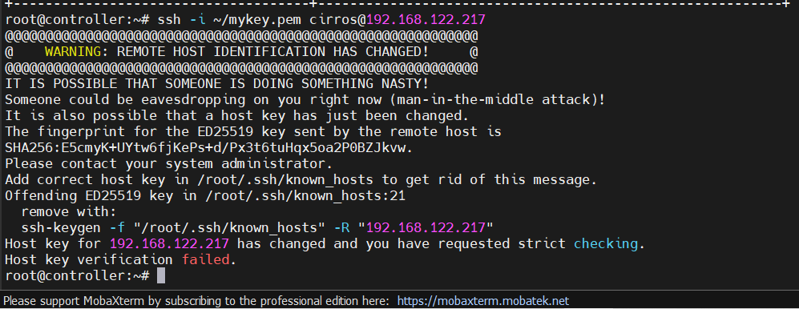
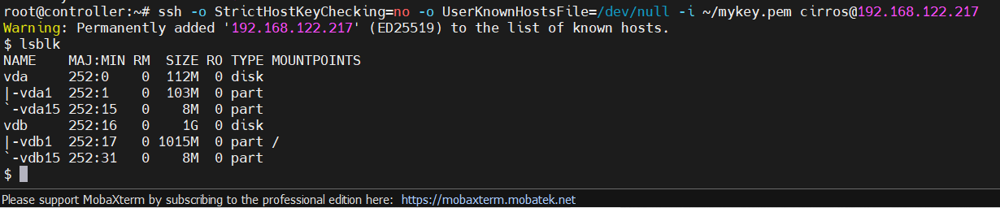
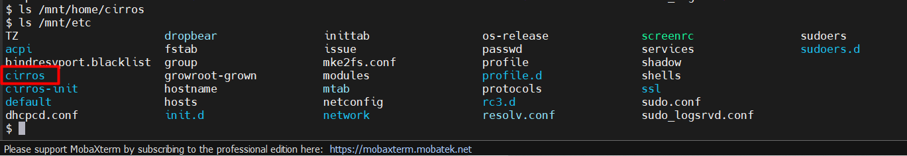
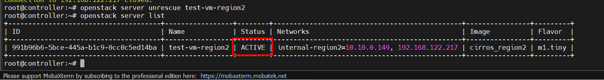
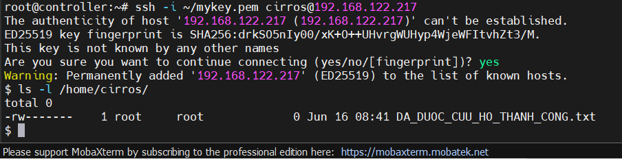

# LAB NÂNG CAO VỀ NOVA

## I. MÔI TRƯỜNG

Môi trường Lab là ta sẽ thực hiện trên cụm OpenStack mà ta đã dựng sau [đây](https://github.com/tiend9/Tim-hieu-OPNsense/blob/main/07.Learn_About_OpenStack_Cinder/labs/01.Install_Cinder_with_LVM.md)

## II. LAB

### 1. Flavor & Resource management

#### a. Tạo và quản lý custom flavor

**Mục tiêu**:

- Tạo flavor với VCPU/RAM/disk/ephemeral, giới hạn theo project.

**Thực hành**:

Ta có 2 loại flavor đó là public và private (dùng cho các project riêng)

Đầu tiên, Tạo custom flavor **public**:

```bash
# tạo flavor có tên m1.ubuntu
openstack flavor create \
  --id 1 \
  --vcpus 1 \
  --ram 1024 \
  --disk 8 \
  --ephemeral 1 \
  m1.ubuntu
# --vcpus 1       1 vCPU
# --ram 1024      1 GB RAM
# --disk 8        root disk 8 GB
# --ephemeral 1   disk tạm 1 GB, mất khi xóa VM
```

Check:


Tạo custom flavor **private**, chỉ project được dùng:

```bash
openstack flavor create \
  --id auto \
  --vcpus 2 \
  --ram 2048 \
  --disk 10 \
  --ephemeral 2 \
  --private \
  m1.ubuntu.private
```

Cho project được dùng flavor này. Nếu ta chỉ cho dùng project `admin`:

```bash
openstack flavor set \
  --project admin \
  m1.ubuntu.private
```

Check quyền access:

```bash
openstack flavor show m1.ubuntu.private
openstack flavor list --private
```


Nếu muốn bỏ quyền project:

```bash
openstack flavor unset \
  --project admin \
  m1.ubuntu.private
```

Xong sau đó, ta sẽ cấu hình giới hạn resource theo project `admin` bằng quota:

```bash
openstack quota set \
  --instances 3 \
  --cores 4 \
  --ram 4096 \
  admin

# --instances 3   tối đa 3 VM
# --cores 4       tổng tối đa 4 vCPU
# --ram 4096      tổng tối đa 4 GB RAM
```

Check quota:

```bash
openstack quota show admin
```

**Note**: Test quota bằng cách boot nhiều VM. Nếu vượt quota, Nova sẽ báo kiểu:

```bash
Quota exceeded for cores/ram/instances
```

Cuối cùng, ta gắn extra specs cho flavor:

- **Extra specs** = metadata nâng cao gắn vào flavor — dùng để kiểm soát những thứ mà CPU/RAM/disk thông thường không mô tả được.

```bash
openstack flavor set \
  --property hw:cpu_policy=shared \
  m1.ubuntu

# CPU policy — gắn CPU thật cho VM (vCPU chia sẻ core với VM khác)
```

Muốn xoá property:

```bash
openstack flavor unset \
  --property hw:cpu_policy \
  m1.ubuntu
```

=> Tương tự ta có thể đặt quota CPU/RAM/instance/floating IP theo project

#### b. Resize instance

**Mục tiêu**:

- scale up/down flavor, confirm và revert resize

**Thực hiện**:

Đầu tiên lên có flavor nhỏ hơn/ Lớn hơn để resize qua lại:

```text
m1.ubuntu
m1.ubuntu.small
m1.ubuntu.big
```

Nếu chưa có hãy tạo:

```bash
openstack flavor create \
  --id 3 \
  --vcpus 1 \
  --ram 824 \
  --disk 8 \
  m1.ubuntu.small

openstack flavor create \
  --id 4 \
  --vcpus 2 \
  --ram 2048 \
  --disk 10 \
  m1.ubuntu.big

openstack flavor list
```


Boot VM `test-resize` bằng flavor nhỏ :

```bash
openstack server create \
  --flavor m1.ubuntu.small \
  --image ubuntu-22.04-server \
  --nic net-id=$(openstack network show provider -f value -c id) \
  --security-group default \
  --key-name mykey-rotate \
  test-resize
```

Check:

```bash
openstack server list
openstack server show test-resize -c status -c flavor -c addresses
```


=> Đợi VM `ACTIVE` là `OKE`.

Tiếp theo, Ta resize lên flavor lớn:

```bash
openstack server resize \
  --flavor m1.ubuntu.big \
  test-resize
```

Check trạng thái:

```bash
openstack server show test-resize -c status -c flavor
```

**Note 2**: Ở đây, sau khi mọi người chạy lệnh resize mà flavor của Vm vẫn giữ nguyên thì khả năng do lab của ta chỉ có 1 Compute mà resize mặc định cần scheduler chọn host, nhưng Nova không cho resize lại cùng Host nếu chưa bật `allow_resize_to_same_host = true` trong file config Nova. Cách fix:

- Sửa trên **Controller**+ **Compute** `/etc/nova/nova.conf`:

```ini
[DEFAULT]
allow_resize_to_same_host = true
```

- Restart service trên **Compute Node**:

```bash
systemctl restart nova-compute
```

- Restart service nova control plane trên Controller Node:

```bash
systemctl restart nova-api nova-scheduler nova-conductor
```

- Sau đó thử resize lại:

```bash
openstack server resize \
  --flavor m1.ubuntu.big \
  test-resize
```

- Check lại:

```bash
openstack server show test-resize -c status -c flavor
```

- Nếu thấy:

```bash
VERIFY_RESIZE
```


=> Ở trạng thái này Nova đã resize xong nhưng chờ ta xác nhận.

Cuối cùng, ta confirm resize:

```bash
# Nếu VM chạy OK thì ta xác nhận resize:
openstack server resize confirm test-resize
```

Check lại:

```bash
openstack server show test-resize -c status -c flavor
```

Kỳ vọng:

```text
Trạng thái ACTIVE và flavor là m1.ubuntu.big
```


Sau khi resize được xong, ta sẽ test revert resize:

```bash
# Đầu tiên ta sẽ resize nó lại về flavor nhỏ
openstack server resize \
  --flavor m1.ubuntu.small \
  test-resize
```

Check:

```bash
openstack server show test-resize -c status -c flavor
```

Khi `STATE_RESIZE`, thử revert:

```bash
openstack server resize revert test-resize
```

Check lại:

```bash
openstack server show test-resize -c status -c flavor
```

**Note 3**: Ở đây nếu ta resize rồi nhưng mà flavor vẫn giữ nguyên khả năng do nova-scheduler không cho phép resize xuống flavor dung lượng nhỏ hơn vì thế ta cần tạo 1 flavor có dung lượng >=10 GB và có thể để vCPU hoặc RAM thấp hơn. Fix:

- Tạo flavor `m2.ubuntu.small`:

```bash
openstack flavor create \
  --id 5 \
  --vcpus 1 \
  --ram 824 \
  --disk 12 \
  m2.ubuntu.small
```

Ta resize về `m2.ubuntu.small`:

```bash
openstack server resize \
  --flavor m2.ubuntu.small \
  test-resize
```

Check state= `VERIFY_RESIZE` rồi ta sẽ revert:

```bash
openstack server resize revert test-resize
```

Check lại state = `ACTIVE` và flavor là `m1.ubuntu.big` là OKE


=> Flavor quay trở lại flavor `m1.ubuntu.big` như trước lúc resize là `OKE`

#### c. Extra specs & CPU pinning

**Mục tiêu**:

- Gán NUMA topology, hugepages, CPU policy vào flavor

**Thực hiện**:

Thực hiện sau vì chưa có cụm nhiều compute node trong 1 Region.

#### d. Host aggregate & Availability zone

**Mục tiêu**:

- Nhóm compute node, gán flavor vào aggregate cụ thể

**Thực hiện**:

Thực hiện sau vì chưa có cụm nhiều compute node trong 1 Region.

### 2. Nova Scheduler & Placement

#### a. Scheduler filter & weight

**Mục tiêu**:

- Cấu hình ComputeFilter, RamFilter, coreFilter, test placement.

**Thực hiện**:

Thực hiện sau vì chưa có cụm nhiều compute node trong 1 Region.

#### b. Server groups: affinity & anti-affinity

Trong OpenStack, Server Group dùng để đặt “quy tắc sắp xếp VM” khi scheduler chọn compute node.

Có 2 policy phổ biến:

| Policy          | Ý nghĩa                       | Dùng khi                                    |
| --------------- | ----------------------------- | ------------------------------------------- |
| `affinity`      | VM phải nằm cùng compute node | cần tốc độ giao tiếp nhanh, latency thấp    |
| `anti-affinity` | VM phải nằm khác compute node | High Availability (HA), tránh chết cùng lúc |

**Mục tiêu**:

- Buộc VM chạy cùng/khác node, dùng cho HA và performance.

**Thực hiện**:

Thực hiện sau vì chưa có cụm nhiều compute node trong 1 Region.

### 3. Migration

#### a. Môi trường Lab

Ta sẽ sử dụng cụm lab Openstack MultiRegion dưới [đây](https://github.com/tiend9/Tim-hieu-OPNsense/tree/main/15.Deployment_OPS/03.Deloy_OPS_Multi_Region) để làm môi trường cho bài lab này.

#### b. Cold migration

**Note**: Phải giả định Region 2 đã có 2 node Compute (`compute2` và `compute3`). Đặc biệt, Migration đòi hỏi cấu hình mạng nội bộ cực kỳ khắt khe:

-Cold Migrate: Yêu cầu user nova trên 2 máy Compute phải có thể SSH cho nhau (để copy file ổ cứng qua mạng).

**Thực hành**:

`Bước 1`: Kiểm tra vị trí hiện tại Đứng trên **Controller1**, gõ lệnh:

```bash
source ~/admin-openrc-region2
openstack server show test-vm-region2 -c host -c status
```

Output: VM đang `ACTIVE` và nằm trên `compute2` là `OKE`.

`Bước 2`: Chạy lệnh Cold Migrate Vì Cold Migrate mượn cơ chế của Resize, bạn chỉ cần gõ lệnh sau:

```bash
openstack server migrate test-vm-region2

# Check trạng thái
openstack server show test-vm-region2 -c host -c status
```

Output: Lúc này trạng thái của VM sẽ lần lượt chuyển qua: `RESIZE` -> `MIGRATING` -> `VERIFY_RESIZE`. Quá trình này nhanh hay chậm tùy thuộc vào dung lượng ổ cứng của VM.

`Bước 3`: Xác nhận trạng thái chuyển nhà khi trạng thái VM hiện là `VERIFY_RESIZE`. Nghĩa là nó đã chạy lên thành công ở Node mới (`compute3`). Lúc này OpenStack chờ bạn ra quyết định:

- Nếu thấy máy chạy ngon lành, bạn gõ lệnh Xác nhận (xóa bản sao lưu ở Node cũ):

```bash
openstack server resize --confirm test-vm-region2
```

- Nếu máy lỗi không lên được, bạn gõ lệnh Hoàn tác (quay về nhà cũ `compute2`):

```bash
openstack server resize --revert test-vm-region2

# ta sẽ thực hiện lại từ bước1 rồi nếu không được sẽ debug lỗi
```

=> Sau khi **confirm**, Status quay về `ACTIVE` và Host là `compute3`. Hoàn thành Cold Migrate!

#### c. Live migration

**Note**: Phải giả định Region 2 đã có 2 node Compute (`compute2` và `compute3`). Đặc biệt, Migration đòi hỏi cấu hình mạng nội bộ cực kỳ khắt khe:

- Yêu cầu dịch vụ libvirt trên 2 máy Compute phải thông nhau (qua TCP hoặc SSH) để đồng bộ RAM theo thời gian thực.

**Bản chất**: Chuyển VM sang Compute mới trong khi VM vẫn đang chạy và phục vụ khách hàng, hoàn toàn không bị rớt mạng (Zero Downtime).

**Các bước thực hiện**:

`Bước 1`: Ping liên tục vào VM Mở một Terminal khác, ping liên tục vào IP public của VM để chứng minh nó không hề bị sập mạng trong quá trình di chuyển

```bash
ping 192.168.122.217
```

`Bước 2`: Chạy lệnh Live Migrate Đứng trên Controller, gõ lệnh di chuyển nóng. Vì ở lab này ta đang dùng Local Disk (không có Shared Storage), ta phải ép Nova copy cả ổ cứng lặn RAM qua mạng (gọi là Block Live Migration):

```bash
# Lệnh Live Migrate chỉ định rõ node mới (compute3) và bắt buộc copy ổ cứng (--block-migration)
openstack server migrate --live-migration --host compute3 --block-migration test-vm-region2
```

`Bước 3`: Quan sát quá trình Quay sang tab đang Ping, bạn sẽ thấy Ping vẫn nhảy đều đặn. Dùng lệnh sau để xem tiến độ di chuyển (hiển thị `%` copy `RAM` và `Disk`):

```bash
openstack server migration list
```

`Bước 4`: Hoàn thành Khi tiến trình báo hoàn thành (completed), bạn kiểm tra lại vị trí của VM:

```bash
openstack server show test-vm-region2 -c host -c status
```

Output: Cột Host đã nhảy sang `compute3`, Status vẫn giữ nguyên `ACTIVE` thì `OKE`.

**Note2**: Nếu VM boot from volume hoặc dùng Shared Storage (Ceph, NFS) thì Live Migration sẽ nhanh hơn rất nhiều vì không phải copy ổ cứng qua mạng. và ngoài ra ở `bước 2` ta sẽ bỏ option `--block-migration` khi migrate

### 4. Lab Rescue

#### a. Môi trường lab

Ta sẽ sử dụng cụm lab Openstack MultiRegion dưới [đây](https://github.com/tiend9/Tim-hieu-OPNsense/tree/main/15.Deployment_OPS/03.Deloy_OPS_Multi_Region) để làm môi trường cho bài lab này.

#### b. Thực hành

**GIải sử**: bạn quên mất mật khẩu của user root (hoặc bị mất SSH Key) không thể vào được VM. Chúng ta sẽ dùng tính năng Rescue để gắn tạm ổ cứng của VM sang một hệ điều hành cứu hộ, chroot vào đó để đổi mật khẩu, rồi trả về trạng thái cũ.

**Thực hiện**:

`Bước 1`: Kích hoạt chế độ Rescue cho VM

Bạn đứng trên con **Controller1** nạp biến môi trường của Region2 và gõ lệnh rescue(có thể thực hiện trên DashBoard):

```bash
source ~/admin-openrc-region2

# Kích hoạt Rescue
openstack server rescue test-vm-region2
```

**Note**: Lệnh này sẽ in ra màn hình một mật khẩu (admin password) tạm thời. Tuy nhiên, vì Cirros image thường có sẵn user `cirros` và pass `gocubsgo`, ta có thể không cần dùng tới pass tạm này, cứ giữ nguyên SSH key hiện tại là vào được.

`Bước 2`: SSH vào máy ảo đang ở chế độ cứu hộ

Lúc này máy ảo đã khởi động lại bằng một "hệ điều hành tạm" (rescue image), còn ổ cứng thật (bị lỗi) của nó đang bị tháo ra và cắm vào như một cái USB.

Từ Controller 1, bạn SSH vào IP của nó như bình thường:

```bash
ssh -i ~/mykey.pem cirros@192.168.122.217
```

**Note2**:



=> **Giải thích**: Khi bạn đưa VM vào chế độ `Rescue`, bản chất OpenStack đã lấy một hệ điều hành (image) hoàn toàn mới để boot lên. Khi cái hệ điều hành mới này khởi động lần đầu, nó tự động sinh ra một bộ khóa nhận diện (SSH Host Key) mới toanh. Trong khi đó, máy **Controller 1** của bạn vẫn đang nhớ cái SSH Host Key cũ của VM (từ lúc nãy bạn SSH vào thành công). Hai key lệch nhau nên hệ thống bảo mật cảnh báo bạn đang bị tấn công Man-in-the-Middle!

**Cách khắc phục**:Bạn không nên xóa key cũ đi (vì lát nữa unrescue nó sẽ quay lại key cũ). Thay vào đó, hãy dùng lệnh SSH với tham số bỏ qua check key tạm thời cho chế độ `Rescue`:

```bash
ssh -o StrictHostKeyChecking=no -o UserKnownHostsFile=/dev/null -i ~/mykey.pem cirros@192.168.122.217
```

`Bước 3`: Mount ổ cứng cũ ra để sửa chữa

Vào được bên trong giao diện dòng lệnh của VM rồi, bạn gõ lệnh để xem các ổ cứng:

```bash
lsblk
```



Ta sẽ thấy có 2 ổ đĩa:

- `dev/vda`: Ổ đĩa cứu hộ (đang chạy).
- `/dev/vdb`: Ổ đĩa "thật" của VM bị mang vào làm ổ phụ.

Tiến hành mount phân vùng chính của ổ thật (thường là `/dev/vdb1`) vào thư mục `/mnt`:

```bash
sudo mount /dev/vdb1 /mnt

# Kiểm tra xem dữ liệu cũ có ở đó không
ls /mnt/home/cirros
ls /mnt/etc
```



`Bước 4`: Sửa lỗi/Cứu hộ

Bây giờ dữ liệu ổ cứng cũ đã nằm trong `/mnt`. Đáng lẽ ra ta sẽ dùng lệnh chroot `/mnt` để biến `/mnt` thành thư mục gốc ảo và gõ lệnh `passwd` đổi mật khẩu. Nhưng vì hệ điều hành Cirros quá nhẹ, nó không hỗ trợ lệnh `chroot`, nên ta sẽ giả lập việc sửa file cấu hình !

Ví dụ, tạo một file báo cáo đã cứu hộ thành công vào thư mục của ổ cứng cũ:

```bash
# sau khi thao tác sửa các file config thì ta tạo 1 file báo cáo để đánh dấu 
sudo touch /mnt/home/cirros/DA_DUOC_CUU_HO_THANH_CONG.txt
```

Làm xong, ta thoát khỏi VM

```bash
sudo umount /mnt
exit
```

`Bước 5`: Thoát chế độ cứu hộ (Unrescue)

Quay lại terminal của **Controller 1**, gõ lệnh để hệ thống vứt bỏ hệ điều hành cứu hộ đi, và cắm lại cái ổ cứng thật vào làm ổ boot chính:

```bash
openstack server unrescue test-vm-region2

# Đợi 10 giây và kiểm tra lại trạng thái
openstack server list
```



Bạn thấy **Status** quay lại **ACTIVE** và khi SSH vào lại **VM** (cũng với SSH key cũ) thì thấy có file

`Bươc 6`: Xác nhận kết quả

SSH vào lại VM 1 lần nữa:

```bash
# Refresh lại SSH key lưu trên controller 1
ssh-keygen -f "/root/.ssh/known_hosts" -R "192.168.122.217"

ssh -i ~/mykey.pem cirros@192.168.122.217

# Kiểm tra xem file bạn tạo ở Bước 4 có tồn tại không
ls -l /home/cirros/
```

Output:



=> Là `OKE`

**Note**: Tuỳ VM tạo từ ephemeral disk hay persistent disk mà bước mount sẽ khác nhau, ở đây ta dùng ephemeral disk nên bước mount sẽ như trên.

### 5. Lab Evacuate

#### a. Môi trường lab Evacuate

Ta sẽ sử dụng cụm lab Openstack MultiRegion dưới [đây](https://github.com/tiend9/Tim-hieu-OPNsense/tree/main/15.Deployment_OPS/03.Deloy_OPS_Multi_Region) để làm môi trường cho bài lab này. NGoài ra ta sẽ giả định ở `Region2`
sẽ có thêm node `compute3` (do không đủ tài nguyên hạ tầng) cấu hình nó trỏ về **Controller2**

#### b. Thực hành Evacuate

**Note**: Phải giả định là máy ảo `test-vm-region2` được tạo ra trên `Region2` ở Node `compute2` và được boot from Volume (hay còn gọi là Cinder Volume - persistent disk).Nếu boot from Local Disk(ephemeral disk) thì khi Evacuate sẽ bị mất sạch dữ liệu trên ổ cứng, máy ảo tạo lại sẽ là máy ảo trắng!

`Bước 1`: Kiểm tra vị trí hiện tại của máy ảo
Đứng trên Controller, gõ lệnh xem VM đang nằm ở đâu:

```bash
openstack server show test-vm-region2 -c host -c status
```

Output: Trạng thái `ACTIVE`, nằm trên `compute2` là `OKE`.

`Bước 2`: Giả lập sự cố cháy nổ và mất điện ở DataCenter khiến `compute2` bị sập.

- Thay vì thao tác mềm, bạn vào thẳng VMWare/VirtualBox, tắt (`Power Off`) máy `compute2` or tắt service trên `compute2`:

```bash
# Tắt nóng dịch vụ nova-compute để giả lập sập nguồn
systemctl stop nova-compute
```

`Bước 3`: Xác nhận Node đã chết trong Openstack

Đứng trên Controller, gõ lệnh xem tình trạng node `compute2`:

```bash
openstack compute service list
```

Output: Bạn sẽ thấy dòng của `compute2`, cột Status là enabled nhưng cột `State` sẽ chuyển từ `up` sang `down` (Mất kết nối).

`Bước 4`: Ra lệnh Sơ tán khẩn cấp (**Evacuate**)

- Khi node đã down, bạn mới có thể sơ tán VM. Gõ lệnh:

```bash
# Cú pháp cơ bản
openstack server evacuate test-vm-region2

# Hoặc cú pháp chỉ định ép nó phải sang compute3
openstack server evacuate --host compute3 test-vm-region2
```

`Bước 5`: Kiểm tra kết quả

- Bạn liên tục gõ lệnh kiểm tra xem VM đã chạy lại chưa:

```bash
openstack server list
openstack server show test-vm-region2 -c host -c status
```

Output: Cột Host của máy ảo đã bị đổi thành `compute3`, và Status quay lại `ACTIVE`.

### Lưu ý quan trọng

Khi ta lab Evacuate, Migrate và nhóm Scheduling / Placement (Server Groups hay Host Aggregates & Availability Zones,...) thì đều yêu cầu thực hiện trong cùng 1 Region và trong Region đó phải tồn tại 2 Node trở lên
