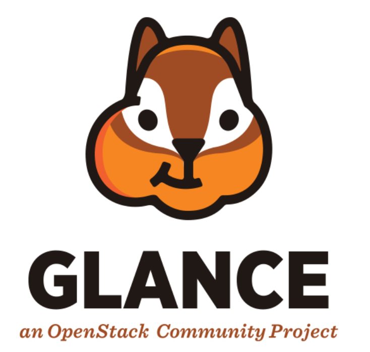
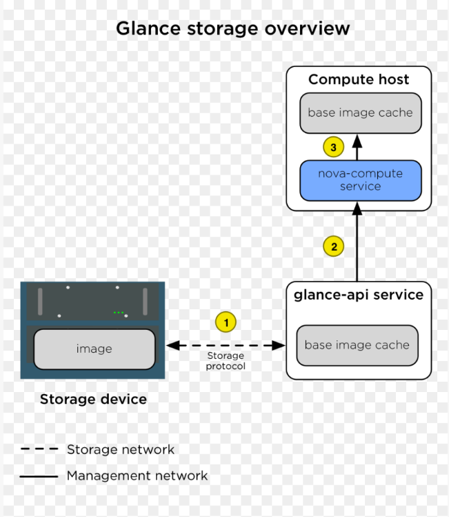
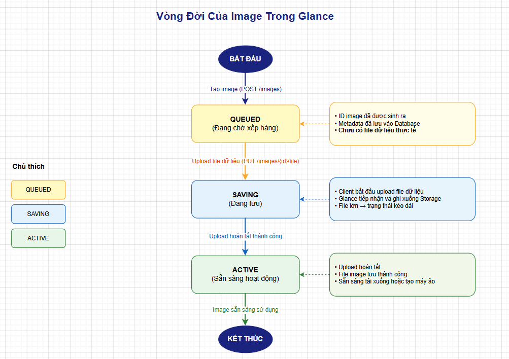
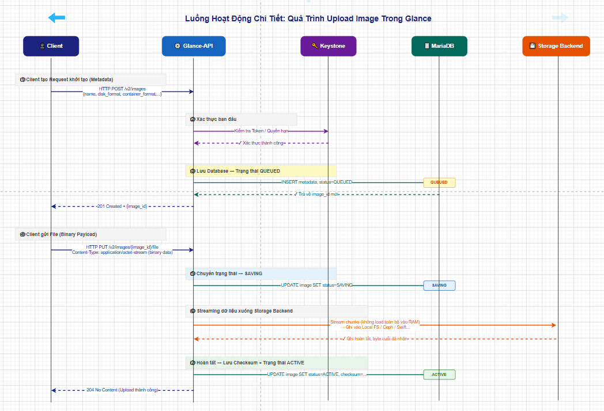

# TỔNG QUAN VỀ PROJECT GLANCE TRONG OPENSTACK

Trong tài liệu này, chúng ta sẽ cùng nhau tìm hiểu chi tiết về **Project Glance** trong OpenStack. Tài liệu được biên soạn và phân chia thành các mục rõ ràng để bạn dễ dàng nắm bắt từ khái niệm cơ bản, kiến trúc, cho đến luồng hoạt động sâu bên trong của Glance

## 1. Khái niệm và Kiến trúc của Project Glance

### 1.1. Glance là gì?

**Glance (OpenStack Image Service)** là dịch vụ trung tâm trong OpenStack chịu trách nhiệm quản lý, khám phá, đăng ký và lấy các file image của máy ảo (Virtual Machine Images).

Nói một cách dễ hiểu, Glance giống như một "kho chứa" các bản cài đặt hệ điều hành (Windows, Ubuntu, CentOS,...) để từ đó dịch vụ Nova (Compute) có thể lấy ra và tạo thành các máy ảo chạy thực tế.

### 1.2. Kiến trúc của Glance

Kiến trúc của Glance khá đơn giản, bao gồm các thành phần chính sau:

- **Glance API (glance-api)**: Là thành phần cốt lõi, tiếp nhận các yêu cầu từ người dùng (thông qua REST API) để tìm kiếm, tải lên (upload), lấy ra (download) và quản lý image.

- **Database (MariaDB/MySQL)**: Nơi lưu trữ **Metadata** (dữ liệu mô tả) của image như: tên, định dạng, dung lượng, trạng thái, yêu cầu phần cứng,...

- **Storage Backend (Kho lưu trữ)**: Nơi lưu trữ **file image thực tế**. Glance không tự lưu trữ file mà nó đẩy file này xuống các backend (ví dụ: Local File System, Ceph, Swift).

*(Lưu ý: Trong các phiên bản OpenStack cũ có thêm thành phần `glance-registry` để giao tiếp với Database. Tuy nhiên, từ bản API v2 trở đi, chức năng này đã được tích hợp thẳng vào `glance-api` nhằm đơn giản hóa kiến trúc và tối ưu hiệu năng).*

### 1.3. Xác thực và Giao tiếp

- **Tiếp nhận yêu cầu (REST API)**: Glance phơi bày (expose) các REST API cho người dùng (Client) hoặc các dịch vụ khác (như Nova Compute).

- **Xác thực qua Keystone**: Trước khi Glance thực hiện bất kỳ yêu cầu nào (tạo mới, xóa, tải image), nó đều gửi token của người dùng sang Keystone để xác thực (Authentication) và kiểm tra quyền hạn (Authorization). Nếu hợp lệ, Glance mới tiếp tục xử lý yêu cầu.

## 2. Các Định Dạng Image Được Hỗ Trợ

Khi đưa một image lên Glance, bạn cần xác định 2 thông số quan trọng: **Disk Format** (Định dạng ổ đĩa) và **Container Format** (Định dạng bao quanh).

### 2.1. Disk Format (Định dạng ổ đĩa)

Đây là định dạng gốc của file image. Dưới đây là bảng so sánh các định dạng phổ biến:

| Định dạng                      | Ưu điểm                                                                                                                         | Nhược điểm                                                                                                                        | Phù hợp cho                                                                   |
| ------------------------------ | ------------------------------------------------------------------------------------------------------------------------------- | --------------------------------------------------------------------------------------------------------------------------------- | ----------------------------------------------------------------------------- |
| **Raw**                        | Tốc độ đọc/ghi (I/O) nhanh nhất do không bị nén, không có overhead.                                                             | Chiếm dung lượng lớn (1 file Raw 10GB sẽ chiếm đúng 10GB thực tế). Không hỗ trợ tạo snapshot trực tiếp trên file.                 | Môi trường cần hiệu năng I/O cực cao (thường được dùng kết hợp với Ceph RBD). |
| **QCOW2** (QEMU Copy On Write) | Phổ biến nhất. Hỗ trợ cấp phát mỏng (thin-provisioning giúp tiết kiệm dung lượng đĩa cứng), nén dữ liệu và hỗ trợ tạo snapshot. | Hiệu năng I/O chậm hơn một chút so với Raw do qua lớp xử lý trung gian.                                                           | Hầu hết các môi trường KVM tiêu chuẩn của OpenStack.                          |
| **ISO**                        | Định dạng chuẩn cho đĩa CD/DVD ảo.                                                                                              | Chỉ dùng để boot/cài đặt OS ban đầu, không phải là ổ đĩa ảo để cài OS lưu trữ dài hạn.                                            | Cài đặt hệ điều hành từ đầu.                                                  |
| **VHD / VMDK**                 | Tương thích với Microsoft Hyper-V (VHD) và VMware (VMDK).                                                                       | Cần Hypervisor tương ứng hoặc phải convert sang Raw/QCOW2 nếu dùng KVM.                                                           | Migrate (chuyển đổi) hệ thống từ Hyper-V hoặc VMware sang OpenStack.          |

### 2.2. Container Format (Định dạng bao quanh)

**Container Format** cho biết file image có được "gói" cùng với các siêu dữ liệu bổ sung nào không.Nó gồm các **Formats** sau:

- **Bare**: Định dạng mặc định và phổ biến nhất. Khai báo "bare" nghĩa là file image không được gói trong bất kỳ định dạng container nào, nó chỉ là một file đĩa đơn thuần.
- **OVF (Open Virtualization Format)**: Định dạng chuẩn mở chứa file đĩa cùng với cấu hình máy ảo (yêu cầu RAM, CPU, Network,...).
- **Docker**: Định dạng dành riêng cho các container image (thường được lưu dưới dạng tar archive).

## 3. Cơ Chế Lưu Trữ Trong Glance

Glance tách biệt rõ ràng giữa **Metadata** (dữ liệu mô tả) và **Payload** (file dữ liệu thực tế).

### 3.1. Lưu trữ Metadata (Database)

**Metadata** được lưu trong cơ sở dữ liệu quan hệ (thường là MariaDB) để đảm bảo tốc độ truy vấn nhanh chóng.

Bên cạnh tên, dung lượng, định dạng, bạn có thể thiết lập các **thuộc tính metadata đặc biệt** để ràng buộc điều kiện tạo máy ảo:

- `min_ram`: Dung lượng RAM tối thiểu (MB) cần có để chạy image này (ví dụ Windows cần ít nhất 2048MB).
- `min_disk`: Dung lượng ổ cứng tối thiểu (GB) cần có để chứa image này.

**Lợi ích:** Nếu người dùng chọn cấu hình (Flavor) có RAM hoặc Disk nhỏ hơn mức quy định này, Nova sẽ báo lỗi ngay lập tức và từ chối tạo máy ảo, giúp tránh lỗi boot.

### 3.2. Lưu trữ File thực tế (Storage Backend)

Khi bạn upload file (ví dụ `QCOW2`) lên Glance, file đó sẽ được cất ở đâu?Điều này phụ thuộc vào backend bạn cấu hình:

- **Local File System (Hệ thống file cục bộ)**: Đây là cấu hình mặc định của DevStack. File được lưu trực tiếp trên ổ cứng của server chạy Glance (thường tại `/var/lib/glance/images/`). Nhược điểm: khó mở rộng, không chịu lỗi tốt (No HA).

- **Ceph (RBD - RADOS Block Device)**: Rất phổ biến trong môi trường Production. Glance lưu image thành các object/block trong cluster Ceph. Kết hợp với Ceph giúp Nova tạo máy ảo cực nhanh bằng cơ chế clone "Copy-on-Write" (CoW) thay vì phải copy toàn bộ file qua mạng.

- **Swift (Object Storage)**: Dịch vụ lưu trữ Object của OpenStack. Glance lưu file image như một object trong container của Swift. Phù hợp cho lưu trữ lâu dài với độ an toàn cao.

## 4. Trạng Thái và Vòng Đời Của Image

Một image trong Glance trải qua nhiều trạng thái (Status) trong suốt vòng đời của mình.

### 4.1. Vòng đời cơ bản (Từ lúc tạo đến khi sẵn sàng)

1. **Queued (Đang chờ xếp hàng)**: Đây là trạng thái khởi tạo. ID của image đã được sinh ra, metadata đã lưu vào Database, nhưng **file dữ liệu thực tế chưa được upload** lên Glance.

2. **Saving (Đang lưu)**: Trạng thái này xuất hiện khi Client bắt đầu upload file dữ liệu lên Glance. Glance đang tiếp nhận và ghi file xuống Storage Backend. (Nếu file lớn, trạng thái này có thể kéo dài).

3. **Active (Sẵn sàng hoạt động)**: Quá trình upload hoàn tất. File image đã lưu thành công và sẵn sàng để tải xuống hoặc dùng tạo máy ảo.

### 4.2. Các trạng thái đặc biệt khác

- **Deactivated (Bị vô hiệu hóa)**: Quản trị viên (Admin) có thể chủ động chuyển image sang trạng thái này. Lúc này, image vẫn tồn tại trong hệ thống, nhưng người dùng **không thể** tải xuống hoặc dùng nó để tạo máy ảo mới. Rất hữu ích khi muốn bảo trì hoặc chặn tạm thời một image bị lỗi/nhiễm mã độc mà chưa muốn xóa hẳn.

- **Killed (Bị hủy/Lỗi)**: Xảy ra khi quá trình upload (Saving) gặp lỗi bất thường (VD: đứt kết nối mạng, backend hết dung lượng ổ cứng). Image bị coi như hỏng và không thể phục hồi. Bạn cần xóa nó đi và làm lại từ đầu.

- **Pending_Delete / Deleted**: Khi gọi API xóa, image có thể chuyển sang `pending_delete` (nếu hệ thống cấu hình "xóa trễ" để cho phép khôi phục), sau đó chuyển thành `deleted` (đã xóa file thật). Khi đã `deleted`, metadata của image vẫn còn lưu trong Database (đánh dấu `deleted=True`) phục vụ mục đích log/audit, nhưng không còn dùng được nữa.

## 5. Phân Tích Quá Trình Upload (Luồng Hoạt Động Chi Tiết)

Để hiểu sâu hơn, chúng ta cùng phân tích quá trình từ lúc Client đẩy file qua API cho đến khi file nằm yên vị trong Storage Backend:

1. **Client tạo Request khởi tạo (Metadata)**: Client gửi một HTTP POST request tới `Glance-API` chứa thông tin metadata (Tên, disk_format, container_format,...). Lúc này chưa gửi kèm file.

2. **Xác thực ban đầu**: `Glance-API` liên hệ với `Keystone` để xác nhận Client có quyền thao tác không.

3. **Lưu Database (Trạng thái Queued)**: Glance ghi metadata vào MariaDB, tạo một ID mới cho image. Trạng thái là `Queued`. ID này được trả về cho Client.

4. **Client gửi File (Payload)**: Client sử dụng ID vừa nhận, gửi tiếp HTTP PUT request kèm theo nội dung file image vật lý (binary data).

5. **Chuyển trạng thái Saving**: Ngay khi nhận được dữ liệu, Glance chuyển trạng thái image trong Database thành `Saving`.

6. **Streaming xuống Backend**: Để tối ưu RAM, `Glance-API` không nạp toàn bộ file vào bộ nhớ, mà dùng cơ chế truyền luồng (streaming) đẩy trực tiếp dữ liệu (chunks) xuống Storage Backend (Local FS hoặc Ceph,...).

7. **Hoàn tất (Trạng thái Active)**: Khi byte cuối cùng được ghi xuống Backend thành công, Glance tính toán và lưu Checksum (để đảm bảo tính toàn vẹn), đổi trạng thái thành `Active` và thông báo hoàn thành cho Client.

## 6. Khả Năng Hiển Thị (Visibility) Của Image

Tính năng Visibility quyết định **ai có quyền nhìn thấy và sử dụng** một image. Glance hỗ trợ 4 mức độ:

- **Public (Công khai)**: Bất kỳ user nào, thuộc bất kỳ Project nào trong cụm OpenStack đều nhìn thấy và sử dụng được (Thường được Admin thiết lập cho các OS chuẩn dùng chung).

- **Private (Riêng tư)**: Mức mặc định khi một người dùng tự tạo image. Chỉ những user là thành viên của **cùng Project** (với user đã upload image) mới nhìn thấy và sử dụng được nó.

- **Shared (Chia sẻ)**: Chủ sở hữu image (đang ở Private) có thể sử dụng chức năng *Image Membership* để chia sẻ image cho một vài Project ID cụ thể khác. Sau đó, Project được chia sẻ phải thao tác "Chấp nhận" (Accept) thì image mới hiển thị trong danh sách của họ.

- **Community (Cộng đồng)**: Image hiển thị cho tất cả mọi người trên hệ thống. Khác với Public (chỉ admin tạo), Community thường do user bình thường chia sẻ rộng rãi. Tuy nhiên, để tránh "rác", các image này sẽ bị ẩn khỏi danh sách mặc định; người dùng muốn dùng phải chủ động tìm kiếm các image với bộ lọc `visibility=community` mới thấy được
