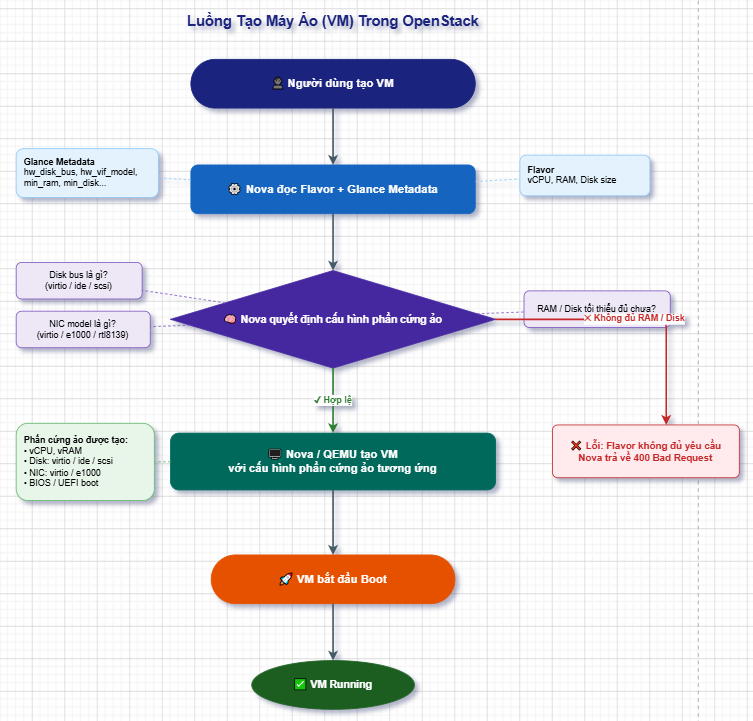
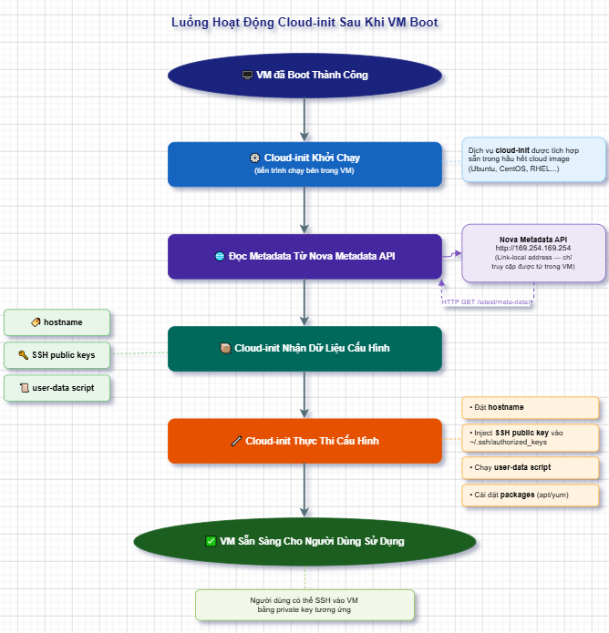
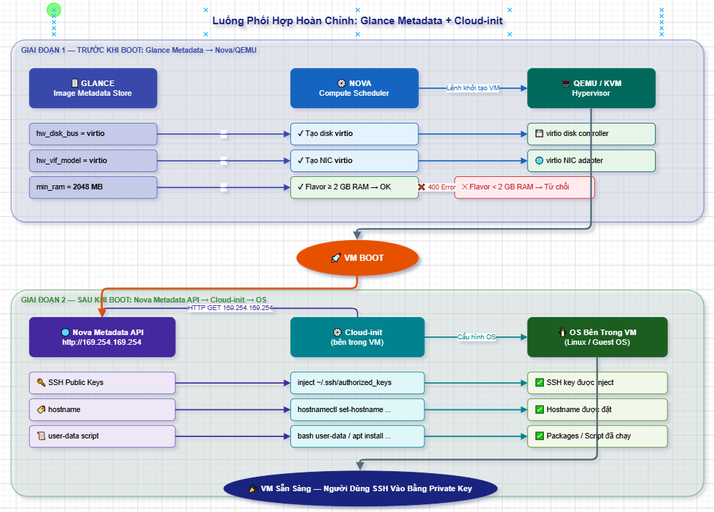
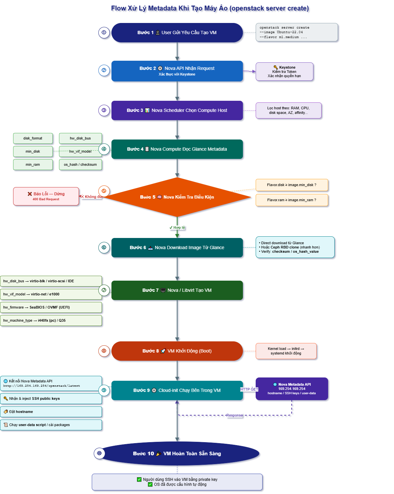

# TÌM HIỂU VỀ METADATA IMAGE TRONG GLANCE (Phiên bản mới nhất - 2024/2025)

> **Phiên bản:** Glance 32.x / OpenStack Image API v2 (Dalmatian 2024.2 trở lên)

## MỤC LỤC

1. [Metadata của Glance Image là gì?](#1-metadata-của-glance-image-là-gì)
2. [Các thuộc tính cốt lõi (Core Properties)](#2-các-thuộc-tính-cốt-lõi-core-properties)
3. [Các thuộc tính phần cứng (Hardware Properties)](#3-các-thuộc-tính-phần-cứng-hardware-properties)
4. [Các thuộc tính hệ điều hành (OS Properties)](#4-các-thuộc-tính-hệ-điều-hành-os-properties)
5. [Thuộc tính bảo mật và xác thực (Security Properties)](#5-thuộc-tính-bảo-mật-và-xác-thực-security-properties)
6. [Thuộc tính tùy chỉnh (Custom Properties)](#6-thuộc-tính-tùy-chỉnh-custom-properties)
7. [Metadata Definitions (Metadef)](#7-metadata-definitions-metadef)
8. [Glance Metadata vs Cloud-init](#8-glance-metadata-vs-cloud-init)
9. [Flow xử lý Metadata khi tạo máy ảo](#9-flow-xử-lý-metadata-khi-tạo-máy-ảo)
10. [Thao tác với Metadata qua CLI](#10-thao-tác-với-metadata-qua-cli)

---

## 1. Metadata của Glance Image là gì?

### 1.1. Định nghĩa

**Metadata của Glance image** là tập hợp các **thuộc tính mô tả** (key-value pairs) đi kèm với mỗi image, được lưu trong **database** (MariaDB/MySQL), tách biệt hoàn toàn với file dữ liệu thực tế của image.

Nói đơn giản: nếu file `.qcow2` là "quyển sách", thì metadata là "bìa sách + mục lục" — không phải nội dung, nhưng cho biết nội dung là gì, cần bao nhiêu tài nguyên để đọc, và ai được phép đọc.

### 1.2. Tại sao Metadata quan trọng?

| Vai trò                  | Giải thích                                                                   |
|--------------------------|------------------------------------------------------------------------------|
| **Mô tả image**          | Tên, định dạng, dung lượng, hệ điều hành — giúp người dùng biết đang dùng gì |
| **Kiểm soát tài nguyên** | `min_disk`, `min_ram` — Nova từ chối tạo VM nếu flavor không đủ              |
| **Hướng dẫn hypervisor** | Các `hw_*` properties báo cho Nova/QEMU biết dùng driver nào                 |
| **Bảo mật**              | Checksum, hash — đảm bảo tính toàn vẹn dữ liệu                               |
| **Phân quyền**           | Visibility, owner — xác định ai được dùng image                              |
| **Tự động hoá**          | Cloud-init đọc metadata để cấu hình VM sau khi boot                          |

### 1.3. Hai loại metadata trong Glance

```ini
Metadata của Glance Image
├── Core Properties       — Glance tự quản lý (id, name, status, size...)
├── Hardware Properties   — Nova/QEMU đọc để cấu hình VM (hw_disk_bus, hw_vif_model...)
├── OS Properties         — Mô tả hệ điều hành (os_distro, os_version...)
├── Security Properties   — Mã hóa, ký số (img_signature, os_secure_boot...)
└── Custom Properties     — Do người dùng/admin tự định nghĩa (key=value tùy ý)
```

## 2. Các thuộc tính cốt lõi (Core Properties)

Đây là các thuộc tính do **Glance tự quản lý**, không do người dùng nhập tùy ý.

### 2.1. Thuộc tính định danh

| Thuộc tính | Kiểu   | Mô tả                                  | Ví dụ               |
|------------|--------|----------------------------------------|---------------------|
| `id`       | UUID   | ID duy nhất của image, Glance tự sinh  | `abc12345-1234-...` |
| `name`     | string | Tên hiển thị, do người dùng đặt        | `Ubuntu-22.04-LTS`  |
| `owner`    | UUID   | Project ID sở hữu image                | `project-uuid`      |

### 2.2. Thuộc tính định dạng

| Thuộc tính         | Kiểu | Giá trị hợp lệ                                            | Mô tả                 |
|--------------------|------|-----------------------------------------------------------|-----------------------|
| `disk_format`      | enum | `raw`, `qcow2`, `vmdk`, `vhd`, `vdi`, `iso`, `ploop`      | Định dạng file image  |
| `container_format` | enum | `bare`, `ovf`, `aki`, `ari`, `ami`, `docker`, `compressed`| Container format bọc  |

> **Thực tế:** Hầu hết image dùng `disk_format=qcow2` và `container_format=bare`.

### 2.3. Thuộc tính trạng thái và vòng đời

| Thuộc tính   | Kiểu     | Giá trị                                                                                         | Mô tả                    |
| ------------ | -------- | ----------------------------------------------------------------------------------------------- | ------------------------ |
| `status`     | enum     | `queued`, `saving`, `active`, `killed`, `deleted`, `pending_delete`, `deactivated`, `importing` | Trạng thái hiện tại      |
| `created_at` | datetime | ISO 8601                                                                                        | Thời điểm tạo            |
| `updated_at` | datetime | ISO 8601                                                                                        | Thời điểm cập nhật cuối  |

### 2.4. Thuộc tính kích thước và toàn vẹn dữ liệu

| Thuộc tính      | Kiểu    | Mô tả                                                                          |
| --------------- | ------- | ------------------------------------------------------------------------------ |
| `size`          | integer | Kích thước file image (bytes)                                                  |
| `virtual_size`  | integer | Kích thước ảo của đĩa sau khi giải nén (bytes)                                 |
| `checksum`      | string  | MD5 checksum của dữ liệu image                                                 |
| `os_hash_algo`  | string  | Thuật toán hash (mặc định: `sha512`)                                           |
| `os_hash_value` | string  | Giá trị hash tính theo `os_hash_algo` — dùng để xác minh tính toàn vẹn         |

> **Lưu ý:** `os_hash_algo` và `os_hash_value` là cặp "multihash" mới hơn, chính xác và bảo mật hơn `checksum` (MD5 cũ). Từ Glance Train trở đi nên dùng `os_hash_value` để verify.

### 2.5. Thuộc tính phân quyền và chia sẻ

| Thuộc tính      | Kiểu    | Giá trị                                    | Mô tả                                                      |
| --------------- | ------- | ------------------------------------------ | ---------------------------------------------------------- |
| `visibility`    | enum    | `public`, `private`, `shared`, `community` | Mức độ hiển thị                                            |
| `protected`     | boolean | `true` / `false`                           | Khi `true`: không ai xóa được image này                    |
| `member_status` | enum    | `accepted`, `rejected`, `pending`          | Trạng thái nhận shared image (phía member)                 |

### 2.6. Thuộc tính giới hạn tài nguyên

| Thuộc tính | Kiểu    | Đơn vị | Mô tả                                                                        |
| ---------- | ------- | ------ | ---------------------------------------------------------------------------- |
| `min_disk` | integer | GB     | Dung lượng đĩa tối thiểu để chạy image. Nova từ chối nếu flavor disk nhỏ hơn |
| `min_ram`  | integer | MB     | RAM tối thiểu để chạy image. Nova từ chối nếu flavor RAM nhỏ hơn             |

**Ví dụ thực tế:**

```bash
# Đặt min_disk=20GB và min_ram=2048MB cho image Windows
openstack image set \
    --min-disk 20 \
    --min-ram 2048 \
    "Windows-Server-2022"
```

### 2.7. Tags

Tags là danh sách nhãn tự do, giúp phân loại và tìm kiếm image dễ dàng.

```bash
# Thêm tag
openstack image set --tag ubuntu --tag lts --tag production <image-id>

# Tìm image theo tag
openstack image list --tag ubuntu
```

## 3. Các thuộc tính phần cứng (Hardware Properties)

Đây là nhóm `hw_*` properties — Nova đọc và truyền xuống hypervisor (QEMU/KVM) để cấu hình phần cứng ảo của VM.

### 3.1. Disk & Storage

| Thuộc tính      | Giá trị phổ biến                | Mô tả                                                  |
| --------------- | ------------------------------- | ------------------------------------------------------ |
| `hw_disk_bus`   | `virtio`, `scsi`, `ide`, `sata` | Bus đĩa ảo. `virtio` cho hiệu năng cao nhất trên KVM   |
| `hw_scsi_model` | `virtio-scsi`, `lsilogic`       | Model SCSI controller (khi `hw_disk_bus=scsi`)         |
| `hw_cdrom_bus`  | `ide`, `scsi`                   | Bus cho ổ CD/DVD ảo                                    |

### 3.2. Network

| Thuộc tính                  | Giá trị phổ biến             | Mô tả                                                               |
| --------------------------- | ---------------------------- | ------------------------------------------------------------------- |
| `hw_vif_model`              | `virtio`, `e1000`, `rtl8139` | Model card mạng ảo. `virtio` tốt nhất cho Linux                     |
| `hw_vif_multiqueue_enabled` | `true` / `false`             | Bật multiqueue cho card mạng virtio (tăng hiệu năng mạng)           |

### 3.3. CPU & Memory

| Thuộc tính             | Giá trị                        | Mô tả                                                               |
| ---------------------- | ------------------------------ | ------------------------------------------------------------------- |
| `hw_cpu_cores`         | integer                        | Số core trên mỗi socket CPU ảo                                      |
| `hw_cpu_sockets`       | integer                        | Số socket CPU ảo                                                    |
| `hw_cpu_threads`       | integer                        | Số thread trên mỗi core                                             |
| `hw_cpu_policy`        | `shared`, `dedicated`          | Chính sách gắn CPU. `dedicated` = pinning vCPU vào pCPU cụ thể      |
| `hw_cpu_thread_policy` | `prefer`, `isolate`, `require` | Chính sách sibling thread khi dùng hyperthreading                   |
| `hw_mem_page_size`     | `small`, `large`, `any`        | Kích thước memory page. `large` = HugePages (giảm TLB miss)         |
| `hw_numa_nodes`        | integer                        | Số NUMA node ảo                                                     |

### 3.4. Video & Display

| Thuộc tính       | Giá trị                            | Mô tả                              |
| -----------------| ---------------------------------- | ---------------------------------- |
| `hw_video_model` | `vga`, `cirrus`, `vmvga`, `virtio` | Card đồ họa ảo                     |
| `hw_video_ram`   | integer (MB)                       | Dung lượng VRAM của card đồ họa ảo |

### 3.5. Boot & Firmware

| Thuộc tính         | Giá trị          | Mô tả                                                                  |
| ------------------ | ---------------- | ---------------------------------------------------------------------- |
| `hw_firmware_type` | `bios`, `uefi`   | Loại firmware. `uefi` bắt buộc cho Secure Boot và Windows 11           |
| `hw_machine_type`  | `pc`, `q35`      | Chipset ảo. `q35` hỗ trợ PCIe, cần thiết cho một số driver hiện đại    |
| `hw_boot_menu`     | `true` / `false` | Hiện menu boot khi khởi động VM                                        |

### 3.6. Watchdog & I/O

| Thuộc tính            | Giá trị                                          | Mô tả                                          |
| --------------------- | ------------------------------------------------ | ---------------------------------------------- |
| `hw_watchdog_action`  | `reset`, `shutdown`, `poweroff`, `pause`, `none` | Hành động của watchdog khi VM bị treo          |
| `hw_rng_model`        | `virtio`                                         | Kích hoạt Random Number Generator ảo           |
| `hw_qemu_guest_agent` | `yes` / `no`                                     | Cài QEMU Guest Agent trong image               |

**Ví dụ cấu hình đầy đủ cho image Ubuntu production:**

```bash
openstack image set \
    --property hw_disk_bus=virtio \
    --property hw_vif_model=virtio \
    --property hw_vif_multiqueue_enabled=true \
    --property hw_qemu_guest_agent=yes \
    --property hw_firmware_type=bios \
    --property hw_machine_type=q35 \
    "Ubuntu-22.04-LTS"
```

## 4. Các thuộc tính hệ điều hành (OS Properties)

Nhóm `os_*` mô tả hệ điều hành bên trong image — hữu ích cho Horizon Dashboard và các công cụ quản lý.

| Thuộc tính            | Giá trị ví dụ                                   | Mô tả                                                                   |
| --------------------- | ----------------------------------------------- | ----------------------------------------------------------------------- |
| `os_distro`           | `ubuntu`, `centos`, `rhel`, `windows`, `debian` | Tên hệ điều hành ([danh sách chuẩn libosinfo](https://libosinfo.org/))  |
| `os_version`          | `22.04`, `9`, `2022`                            | Phiên bản hệ điều hành                                                  |
| `os_admin_user`       | `ubuntu`, `cloud-user`, `Administrator`         | Username admin mặc định (dùng khi SSH lần đầu)                          |
| `os_require_quiesce`  | `yes` / `no`                                    | Yêu cầu quiesce filesystem trước khi snapshot                           |
| `os_shutdown_timeout` | integer (giây)                                  | Thời gian chờ shutdown graceful trước khi force-off                     |

**Ví dụ:**

```bash
openstack image set \
    --property os_distro=ubuntu \
    --property os_version=22.04 \
    --property os_admin_user=ubuntu \
    "Ubuntu-22.04-LTS"
```

## 5. Thuộc tính bảo mật và xác thực (Security Properties)

### 5.1. Ký số và xác minh image (Image Signing)

Glance hỗ trợ ký số image bằng **Barbican** (Key Manager). Khi Nova download image, nó có thể xác minh chữ ký trước khi dùng.

| Thuộc tính                        | Mô tả                                               |
| --------------------------------- | --------------------------------------------------- |
| `img_signature`                   | Chữ ký số của image data (base64)                   |
| `img_signature_hash_method`       | Thuật toán hash dùng để ký (`SHA-256`, `SHA-3-256`) |
| `img_signature_key_type`          | Loại khóa (`RSA-PSS`, `DSA`, `ECC-SECT571K1`...)    |
| `img_signature_certificate_uuid`  | UUID của certificate trong Barbican                 |

### 5.2. Secure Boot

| Thuộc tính       | Giá trị                              | Mô tả                                              |
| ---------------- | ------------------------------------ | -------------------------------------------------- |
| `os_secure_boot` | `required`, `optional`, `disabled`   | Yêu cầu Secure Boot (UEFI). Bắt buộc với Windows 11|

> **Lưu ý:** Khi dùng `os_secure_boot = required`, `hw_firmware_type` phải là `uefi`.

### 5.3. Mã hóa image (Image Encryption)

Từ OpenStack Train trở đi, Glance hỗ trợ lưu image ở dạng mã hóa.

| Thuộc tính                | Mô tả                                  |
| ------------------------- | -------------------------------------- |
| `os_glance_failed_import` | Lý do import thất bại (Glance tự ghi)  |
| `os_glance_import_task`   | Task ID của tiến trình import          |

## 6. Thuộc tính tùy chỉnh (Custom Properties)

**Admin** và người dùng có thể thêm bất kỳ thuộc tính nào dưới dạng key-value. Đây là cơ chế **mở rộng linh hoạt** của Glance.

### 6.1. Thêm và xem custom property

```bash
# Thêm property khi tạo image
openstack image create \
    --property environment=production \
    --property team=devops \
    --property backup_policy=daily \
    "My-Custom-Image"

# Thêm property vào image đã tồn tại
openstack image set \
    --property cost_center=CC-001 \
    --property approved_by=admin \
    <image-id>

# Xem tất cả properties
openstack image show <image-id>

# Lọc theo property (tìm image của team devops)
openstack image list --property team=devops
```

### 6.2. Xóa custom property

```bash
# Xóa một property
openstack image unset --property team <image-id>

# Xóa nhiều property
openstack image unset --property team --property cost_center <image-id>
```

### 6.3. Bảo vệ property (Property Protection)

Admin có thể giới hạn ai được phép đọc/ghi/xóa property nào bằng file `property-protections.conf`.

```ini
# /etc/glance/property-protections.conf
# Chỉ admin mới được đặt os_secure_boot
[os_secure_boot]
create = admin
read = @
update = admin
delete = admin

# Mọi user đều đọc được hw_*, nhưng chỉ admin được sửa
[hw_.*]
create = admin
read = @
update = admin
delete = admin
```

## 7. Metadata Definitions (Metadef)

**Metadef** là hệ thống cho phép admin **định nghĩa trước** các schema metadata chuẩn (namespace, object, property) để áp dụng nhất quán lên image, volume, flavor...

### 7.1. Các thành phần của Metadef

```ini
Metadef
├── Namespace    — Nhóm chứa các định nghĩa (ví dụ: "OS::Compute::Hypervisor")
│   ├── Object   — Đối tượng trong namespace (ví dụ: "CPUPinning")
│   │   └── Property — Thuộc tính của Object (ví dụ: "cpu_policy")
│   ├── Property — Thuộc tính trực tiếp của namespace
│   └── Tag      — Tag gắn với namespace
└── Resource Type — Loại tài nguyên áp dụng (Image, Volume, Flavor...)
```

### 7.2. Xem danh sách namespace

```bash
# Liệt kê tất cả namespace metadef
openstack metadef namespace list

# Xem chi tiết một namespace
openstack metadef namespace show "OS::Compute::Hypervisor"
```

### 7.3. Tạo namespace tùy chỉnh

```bash
openstack metadef namespace create \
    --public \
    --display-name "Thông tin nội bộ" \
    --description "Metadata cho quản lý nội bộ" \
    "org.example.internal"
```

### 7.4. Load namespace mặc định của OpenStack

```bash
# Load toàn bộ namespace metadef mặc định (chạy sau cài đặt Glance)
glance-manage db_load_metadefs

# Xóa toàn bộ metadefs
glance-manage db_clear_metadefs
```

## 8. Glance Metadata vs Cloud-init

Đây là hai cơ chế **bổ sung** cho nhau, không thay thế nhau.

### 8.1. So sánh tổng quan

| Tiêu chí                | Glance Metadata                       | Cloud-init                            |
| ----------------------- | ------------------------------------- | ------------------------------------- |
| **Lưu ở đâu**           | Database của Glance                   | Script/config bên trong image         |
| **Ai đọc**              | Nova, Glance API, người dùng          | Cloud-init daemon bên trong VM        |
| **Khi nào chạy**        | Trước khi VM được tạo                 | Sau khi VM boot lần đầu               |
| **Mục đích chính**      | Mô tả image, cấu hình hypervisor      | Cấu hình OS bên trong VM              |
| **Ví dụ**               | `hw_disk_bus=virtio`, `min_ram=2048`  | Đặt hostname, SSH key, cài package    |
| **Thay đổi được không** | Có (dùng `openstack image set`)       | Không (đã bake vào image)             |

### 8.2. Glance Metadata — Cấu hình phần cứng ảo (trước khi boot)



```text
Người dùng tạo VM
       ↓
Nova đọc flavor + Glance metadata
       ↓
Nova quyết định: disk bus là gì? NIC model là gì? RAM tối thiểu đủ chưa?
       ↓
Nova/QEMU tạo VM với cấu hình phần cứng ảo tương ứng
       ↓
VM bắt đầu boot
```

### 8.3. Cloud-init — Cấu hình OS bên trong VM (sau khi boot)



### 8.4. Luồng phối hợp hoàn chỉnh (Cloud init + Metadata)



## 9. Flow xử lý Metadata khi tạo máy ảo



=> Đây là luồng chi tiết từ lúc user chạy `openstack server create` đến khi VM sẵn sàng

## 10. Thao tác với Metadata qua CLI

### 10.1. Xem toàn bộ metadata của image

```bash
openstack image show <image-id>

# Chỉ xem các properties tùy chỉnh
openstack image show <image-id> -f json | python3 -m json.tool | grep -A 100 '"properties"'
```

### 10.2. Thêm / cập nhật metadata

```bash
# Cấu hình đầy đủ cho image Ubuntu KVM
openstack image set \
    --min-disk 10 \
    --min-ram 512 \
    --property os_distro=ubuntu \
    --property os_version=22.04 \
    --property os_admin_user=ubuntu \
    --property hw_disk_bus=virtio \
    --property hw_vif_model=virtio \
    --property hw_vif_multiqueue_enabled=true \
    --property hw_qemu_guest_agent=yes \
    --property hw_firmware_type=bios \
    --property hw_machine_type=q35 \
    "Ubuntu-22.04-LTS"
```

### 10.3. Cấu hình cho image Windows

```bash
openstack image set \
    --min-disk 40 \
    --min-ram 2048 \
    --property os_distro=windows \
    --property os_version=2022 \
    --property os_admin_user=Administrator \
    --property hw_disk_bus=virtio \
    --property hw_vif_model=virtio \
    --property hw_firmware_type=uefi \
    --property os_secure_boot=optional \
    --property hw_machine_type=q35 \
    --property hw_video_model=virtio \
    "Windows-Server-2022"
```

### 10.4. Xóa metadata

```bash
# Xóa một property
openstack image unset --property hw_disk_bus <image-id>

# Xóa tag
openstack image unset --tag ubuntu <image-id>
```

### 10.5. Tìm image theo metadata

```bash
# Tìm image theo property
openstack image list --property os_distro=ubuntu

# Tìm image theo tag
openstack image list --tag lts

# Tìm image theo nhiều tiêu chí
openstack image list --public --status active --property os_distro=ubuntu
```

---

## Tóm tắt các nhóm Metadata quan trọng

| Nhóm         | Prefix                    | Ví dụ                                      | Ai đọc           |
| ------------ | ------------------------- | ------------------------------------------ | ---------------- |
| **Core** | _(không prefix)_ | `id`, `name`, `status`, `min_disk` | Glance, người dùng |
| **Hardware** | `hw_` | `hw_disk_bus`, `hw_vif_model` | Nova, QEMU/KVM |
| **OS** | `os_` | `os_distro`, `os_version` | Horizon, Nova |
| **Security** | `img_`, `os_secure_boot` | `img_signature`, `os_secure_boot` | Nova, Barbican |
| **Custom** | _(tùy ý)_ | `team=devops`, `env=prod` | Người dùng |

## TÀI LIỆU THAM KHẢO

- <https://docs.openstack.org/glance/latest/admin/useful-image-properties.html>
- <https://docs.openstack.org/glance/latest/user/metadefs-concepts.html>
- <https://docs.openstack.org/image-guide/image-metadata.html>
