# CÁC BÀI LAB CƠ BẢN VỀ OPENSTACK GLANCE

## I. MÔI TRƯỜNG

Môi trường Lab là ta sẽ thực hiện trên cụm OpenStack mà ta đã dựng sau [đây](https://github.com/tiend9/Tim-hieu-OPNsense/blob/main/07.Learn_About_OpenStack_Cinder/labs/01.Install_Cinder_with_LVM.md), nhưng lưu ý cụm lab OpenStack này đã được lab thành MultiRegion theo bài lab [này](https://github.com/tiend9/Tim-hieu-OPNsense/blob/main/15.Deployment_OPS/03.Deloy_OPS_Multi_Region/01.Deploy_OPS_MultiRegion.md)

## II. THỰC HÀNH

### 1. Quản lí Image

#### 1.1 Upload Image thủ công bằng lệnh

Có rất nhiều định dạng lưu trữ phổ biến để ta có thể upload thành image. Vì vậy, ta sẽ thực hành với từng cái một:

##### `Cách 1`: Upload image từ file `ISO`

**Mục đích**:

- Cài OS + cấu hình theo ý muốn (driver, agent, phần mềm...)
- Snapshot lại thành image chuẩn
- Deploy hàng loạt VM từ image đó
- Cài đặt OS thủ công như máy thật
- Sau khi cài xong → tạo snapshot → dùng làm template

**Thực hành**:

```bash
source admin-openrc

# Tải file từ trang web về
wget https://atxfiles.netgate.com/mirror/downloads/pfSense-CE-2.7.2-RELEASE-amd64.iso.gz

# Sau đó giải nén
gunzip pfSense-CE-2.7.2-RELEASE-amd64.iso.gz

# Upload Image từ file ISO
openstack image create "pfSense-ISO" \
  --file pfSense-CE-2.7.2-RELEASE-amd64.iso \
  --disk-format iso \
  --container-format bare \
  --public
```

Output như này là `OKE`:

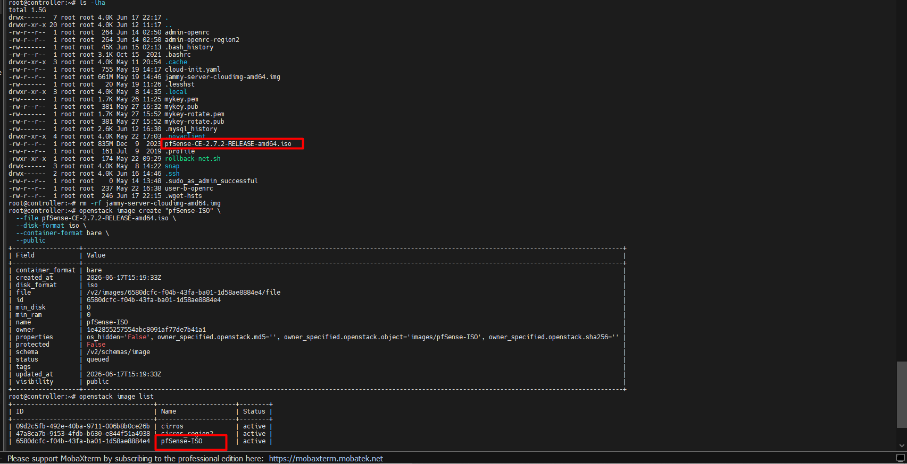

##### `Cách 2`: Upload Image từ file `RAW`

**Mục đích**:

- Không cần giải nén hay convert khi boot
- Hypervisor đọc thẳng → latency thấp hơn `qcow2`
- Phù hợp production workload I/O nặng
- Khi dùng với Cinder + LVM backend bỏ qua bước **convert**, boot nhanh hơn
- Khi dùng với Ceph/RBD backend bỏ qua bước **convert**, boot nhanh hơn

**Thực hành**:

```bash
# Nạp biến môi trường
source admin-openrc

# Upload Image
openstack image create "Ubuntu22.04-RAW" \
  --file ubuntu-22.04.5-live-server-amd64.raw \
  --disk-format raw \
  --container-format bare \
  --public
```

Output như này là `OKE`:

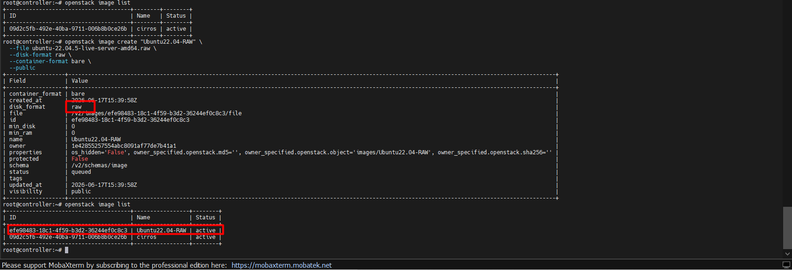

##### `Cách 3`: Upload Image từ file `QCOW2`

**Mục đích**:

- Deploy VM nhanh từ image có sẵn (cloud image của Ubuntu, CentOS...)
- Làm image template để clone hàng loạt VM
- Lab và dev environment vì tiết kiệm disk

=> Nói chung VM từ image này sẽ tiết kiệm dung lượng do hưởng công nghệ thằng `QCOW2`

**Thực hành**:

```bash
# Nạp biến môi trường
source admin-openrc

# Upload Image
openstack image create "Ubuntu22.04-QCOW2" \
  --file ubuntu-22.04.5-live-server-amd64.qcow2 \
  --disk-format qcow2 \
  --container-format bare \
  --public
```

=> Output như này là `OKE`:

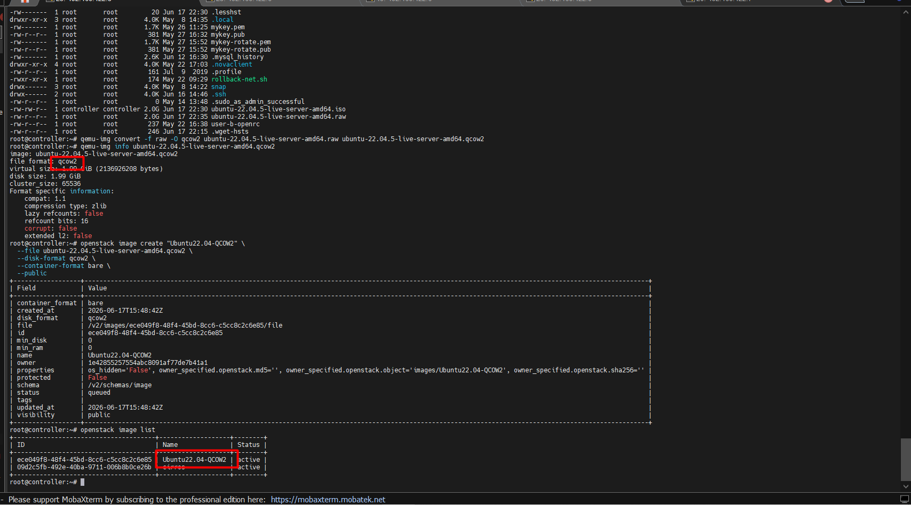

##### `Cách 4`: Upload Image từ file `VMDK` (Virtual Machine Disk)

**Mục đích**:

- Migrate VM từ VMware sang OpenStack — export VM từ ESXi/vSphere ra VMDK rồi upload thẳng lên Glance mà không cần convert
- Tái sử dụng VM cũ — các VM đang chạy trên VMware có thể chuyển sang OpenStack nhanh hơn
- Môi trường hybrid — tổ chức đang dùng song song VMware và OpenStack

**Thực hành**:

Giả sử lấy file `.vmdk` node `storage` trên cụm lab ta thực hành. Đầu tiên vào file lưu trữ cấu hình node `storage`.

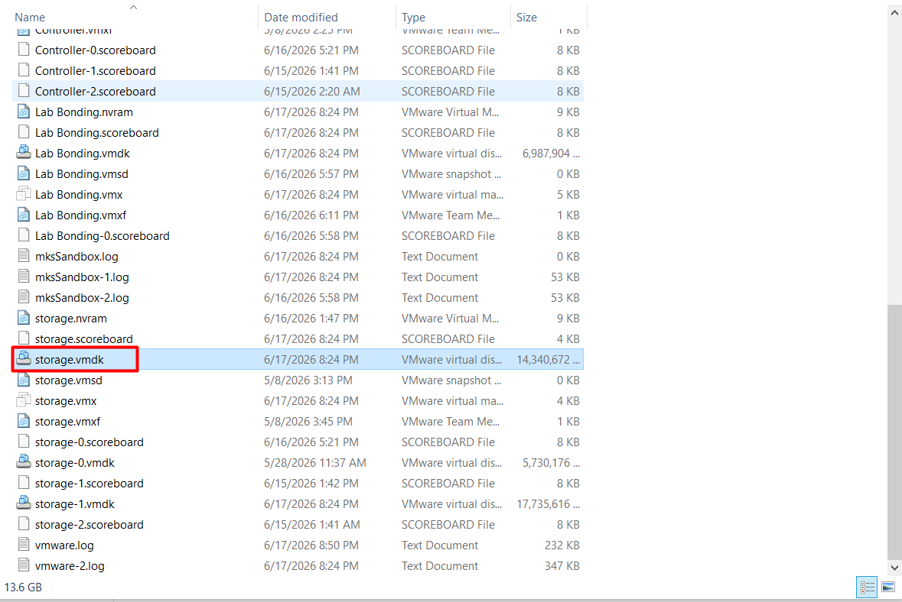

Rồi sau đó `scp` file đó sang Controller Node để upload image.(Nhớ chạy `cmd` bằng quyền `admin`)

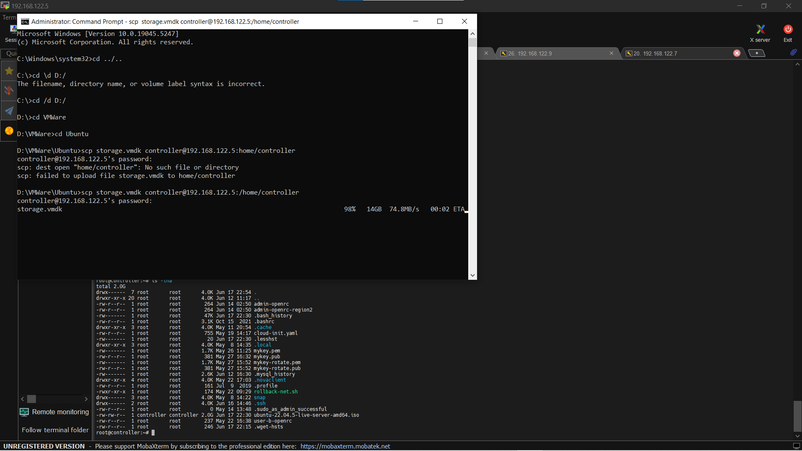

Chuyển file `.vmdk` từ user `controller` sang user `root`:

```bash
sudo mv ubuntu22.04.5-server.vmdk /root
```

```bash
sudo -i
# Nạp biến môi trường
source admin-openrc

# Upload Image
openstack image create "STORAGE-NODE-VMDK" \
  --file storage.vmdk \
  --disk-format vmdk \
  --container-format bare \
  --public
```

=> Output như này là `OKE`:

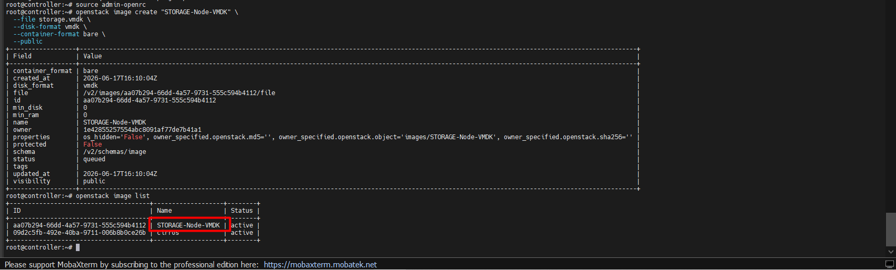

##### `Cách 5`: Upload Image từ file `OVA` (Open Virtualization Appliance)

**Mục đích**:

- Migrate VM từ VMware sang OpenStack — tương tự VMDK nhưng OVA đóng gói luôn cả cấu hình VM (RAM, CPU, disk, network) nên tiện hơn.
- Deploy appliance — nhiều vendor (firewall, load balancer, router ảo) phân phối sản phẩm dưới dạng OVA → upload lên OpenStack để dùng
- Tái sử dụng **VM template** từ môi trường VMware

**Lưu ý**: Trong bài lab này, có 1 số Application không hỗ trợ trực tiếp định dạng OVA, do đó chúng ta sẽ phải convert nó sang định dạng `QCOW2` trước khi upload.

**Thực hành**:

Trên VMWare, `Turn Off` VM lại và vào `file` -> `Export to OVF`:

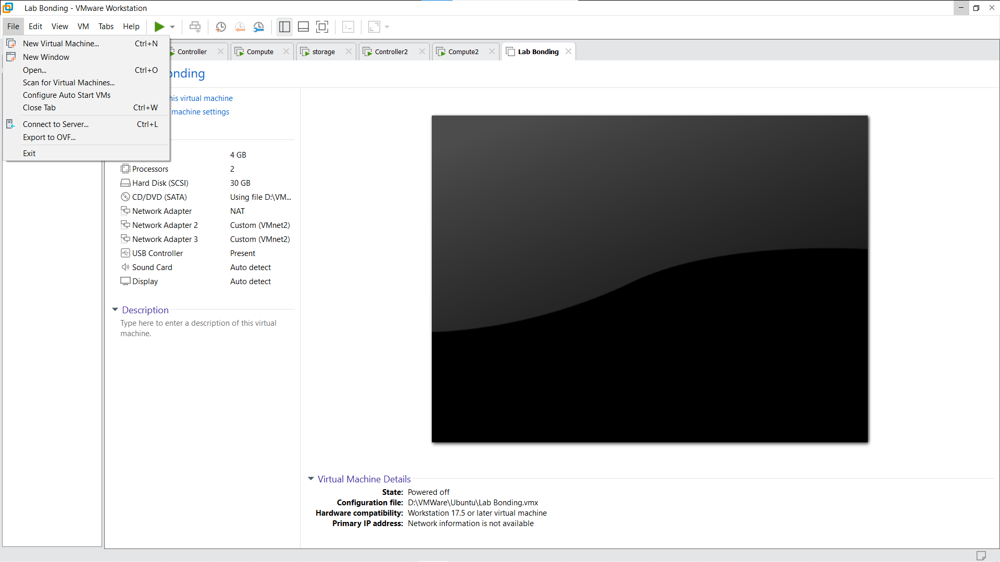

**Lưu ý**: File `.ova` = `.ovf` + `.vmdk` đóng gói lại thành 1 file `.tar`

```cmd
tar -cvf storage.tar storage.ovf storage.vmdk
```

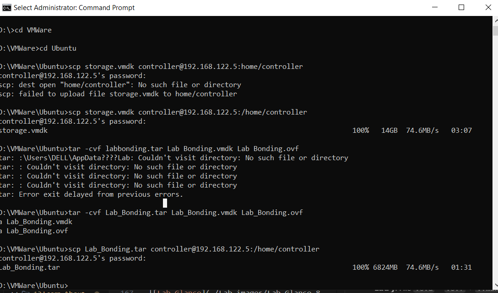

Giống như file `.vmdk`,ta lại `scp` file `.tar` sang Controller Node. Rồi upload file OVA như sau:

```bash
# Nạp biến môi trường
source admin-openrc

# Vì tar không được hỗ trợ trực tiếp → phải convert sang QCOW2:
mv Lab_Bonding.tar Lab_Bonding.ova

# Upload Image (Nhưng khuyến khích lên convert sang qcow2)
openstack image create "storage-OVA" \
  --file storage.ova \
  --disk-format ova \
  --container-format bare \
  --public
```

Output như này là `NOT_OKE`:

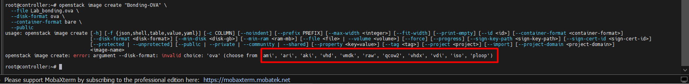

=> Vì Glance không hỗ trợ định dạng `OVA`, do đó ta cần phải convert sang `QCOW2`(Cấu hình trong file `.OVF` không còn)

#### 1.2 Download và Xoá image OpenStack

**Mục đích**:

- Download image về máy local để backup hoặc sử dụng ngoại tuyến
- Chia sẻ image với người khác
- Di chuyển image sang cloud khác
- Xóa image khi không còn sử dụng

**Câu lệnh**:

```bash
# Xoá Image:
openstack image delete <id_1> <id_2> <id_3>
# Hoặc
glance image-delete <image_id>

# Dowload Image:
openstack image save --file /tmp/cirros.img cirros-0.6.2-x86_64-disk
# Hoặc
glance image-download --file <tên_file_lưu> <image_id>
```

#### 1.3 Liệt kê, lọc và tìm kiếm Image

**Câu lệnh**:

```bash
# Liệt kê tất cả image
openstack image list
# Hoặc
glance image-list

# Tìm kiếm image theo tên
openstack image list --name <tên_image>

# Lọc image theo trạng thái
openstack image list --status active

# Lọc image theo định dạng đĩa
openstack image list --disk-format qcow2

# Lọc image theo container format
openstack image list --container-format bare

# Lọc image theo ownership (public/private)
openstack image list --property owner=<project_id>

# Lọc image theo tag
openstack image list --tag <tag>
```

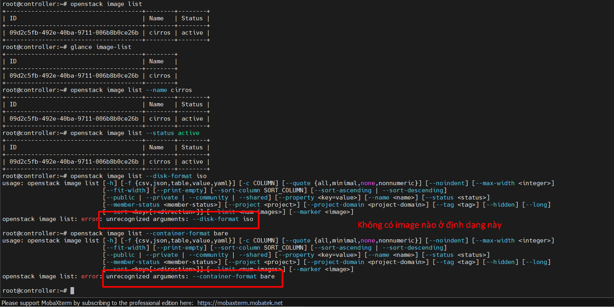

#### 1.4 Cập nhật metadata và properties của image

Cập nhật thông tin cơ bản:

```bash
openstack image set <image-id hoặc tên> \
  --name "tên mới" \
  --min-disk 10 \
  --min-ram 512 \
```

Lưu ý:

- Do `--disk-format` và `--container-format` không thể chỉnh sửa sau khi tạo nên
- Khi muốn thay đổi các thông số này, ta cần tạo một image mới với thông số mong muốn
- Sau khi tạo image mới, ta có thể xoá image cũ để giải phóng dung lượng

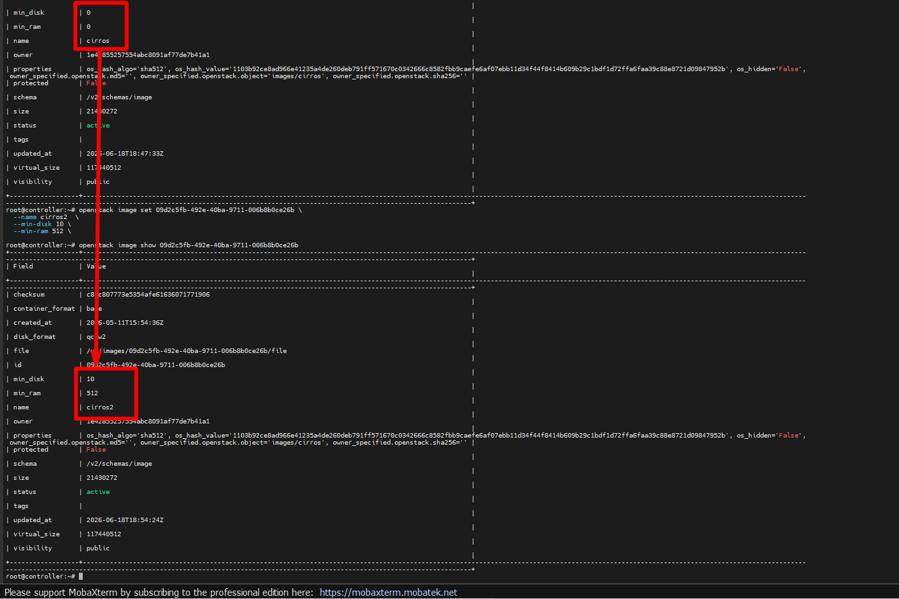

Cập nhật properties (metadata) của image:

```bash
# Thêm hoặc update property
openstack image set <image-id> \
  --property os_type \
  --property os_distro \
  --property os_version \
  --property hw_disk_bus \
  --property hw_vif_model
```

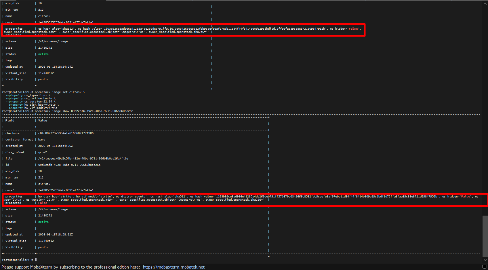

Xoá property:

```bash
openstack image unset <image-id> --property <tên_property>
```

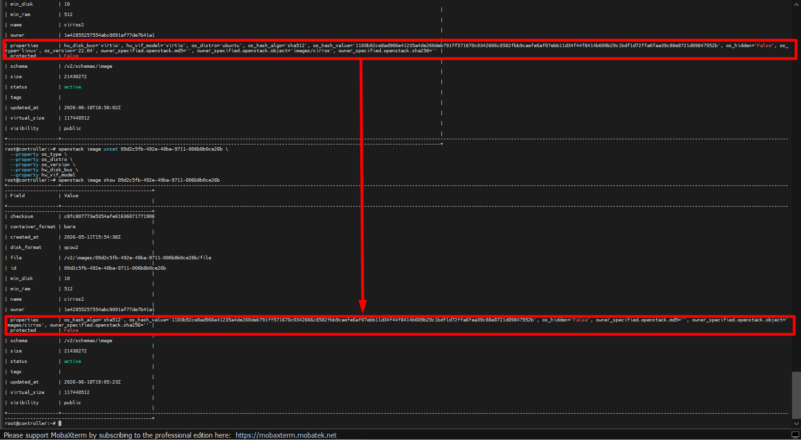

Thay đổi visibility của image (**Public**/**Private** and **Share**)

```bash
# Public
openstack image set <image-id> --public

# Private
openstack image set <image-id> --private

# Shared
openstack image set <image-id> --shared
```

Cuối cùng là xem properties hiện tại:

```bash
openstack image show <image-id>
# Hoặc
glance image-show <image-id>
```

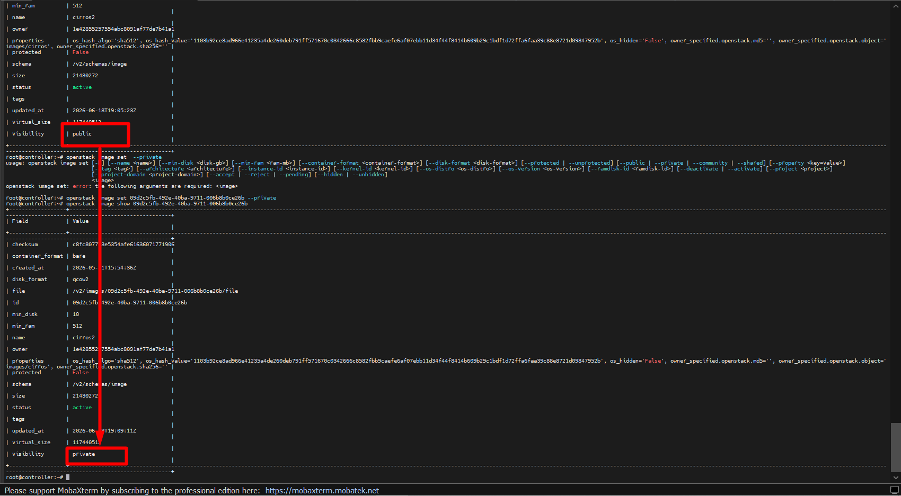

#### 1.5 Upload image thủ công (Ubuntu, CirrOS, CentOS)

##### CirrOS (nhẹ nhất, dùng để test)

```bash
# Tải
wget http://download.cirros-cloud.net/0.6.2/cirros-0.6.2-x86_64-disk.img

# Upload
openstack image create "cirros-0.6.2" \
  --file cirros-0.6.2-x86_64-disk.img \
  --disk-format qcow2 \
  --container-format bare \
  --public
```

##### Ubuntu (22.04 cloud image)

```bash
# Tải
wget https://cloud-images.ubuntu.com/jammy/current/jammy-server-cloudimg-amd64.img

# Upload
openstack image create "Ubuntu-22.04" \
  --file jammy-server-cloudimg-amd64.img \
  --disk-format qcow2 \
  --container-format bare \
  --public \
  --property os_type=linux \
  --property os_distro=ubuntu \
  --property os_version=22.04 \
  --min-disk 8 \
  --min-ram 1024
```

##### CentOS (Stream 9)

```bash
# Tải
wget https://cloud.centos.org/centos/9-stream/x86_64/images/CentOS-Stream-GenericCloud-9-latest.x86_64.qcow2

# Upload:

```bash
openstack image create "CentOS-Stream-9" \
  --file CentOS-Stream-GenericCloud-9-latest.x86_64.qcow2 \
  --disk-format qcow2 \
  --container-format bare \
  --public \
  --property os_type=linux \
  --property os_distro=centos \
  --property os_version=9 \
  --min-disk 10 \
  --min-ram 1024
```

Verify sau khi upload:

```bash
bashopenstack image list
openstack image show <tên image>
```

### 2. Define role (Cấp role cho user)

#### 2.1 Định nghĩa

Một số công việc cơ bản trong glance như thêm, sửa, xóa, liệt kê image. User có được thực hiện các việc đó hay không sẽ do role quyết định. Các dòng cấu hình trong file `/etc/glance/policy.json` với bản OpenStack Yoga trở xuống và `/etc/glance/policy.yaml` với bản OpenStack Yoga trở lên; để thực hiện những việc đó là:

- `add_image`: Tạo một image.
- `delete_image`: xóa iamge.
- `get_image`: show thông tin chi tiết của một image cụ thể.
- `get_images`: Liệt kê tất cả các image
- `modify_image`: Update image
- `publicize_image`: Tạo hoặc Update public image
- `communitize_image`: Tạo hoặc update communitize images

=> Như vậy, để định nghĩa một role được phép làm gì đó thì ta chỉ cần thêm role vào trong dòng cấu hình cho phép làm điều đó.

Ví dụ: tạo một số role như sau:

```bash
 "add_image": "role:upload", 
 "delete_image": "role:delete", 
 "get_image": "role:list", 
 "get_images": "role:lists",
 "modify_image": "role:edit",
 "publicize_image": "role:upload_public",
 "communitize_image": "role:upload_comm",
```

Trong đó:

- `upload`: có khả năng tạo một image,
- `delete`: có khả năng delete một image,
- `list`: có khả năng show ra một image với id cụ thể,
- `lists`: liệt kê ra tất cả các image,
- `edit`: có khả năng sửa một số thuộc tính của image,
- `upload_public`: có khả năng tạo một image với visibility là public,
- `upload_comm`: có khả năng tạo một image với `visibility` là `communiti`

Sau khi khai báo role như trên trên, ta sẽ tạo ra các user và gán các role tương ứng để kiểm tra

Nếu user muốn có nhiều hơn 1 quyền với image, chúng ta có thể add thêm role cho user hoặc định nghĩa một role khác dành riêng cho user. Sau đó thêm rule đó vào các quyền mà chúng ta muốn cho phép. Ví dụ:

```bash
# Muốn cho phép một user có hai quyền là liệt kê tất cả các image và xóa một image, ta định nghĩa một role là role_user1 cho user là user1 như sau:

# Sửa + Thêm dòng file policy.yaml:

 "get_images": "role:role_user1",
 "delete_image": "role:role_user1",
```

#### 2.2 Thực hành gán role cho user

`Bước 1`: Tạo project

```bash

root@controller:~# openstack project create --domain default --description "Labs role image" project1
```

`Bước 2`: Tạo các user

```bash
root@controller:~# openstack user create --project project1 --domain default --password Tien123 --description "User1 duoc delete image" user1
```

`Bước 3`: Tạo role

```bash
openstack role create image_deleter
```

`Bước 4`: Gán role cho user

```bash
openstack role add --project project1 --user user1 upload
```

`Bước 5`: Định nghĩa role trong file `policy.yaml`

```bash
# Thêm hoặc sửa vào file policy.yaml
delete_image: "role:image_deleter"

#Reset glance api để nhận cấu hình mới
systemctl reload glance-api
```

`Bước 6`: Check lại xem user1 đang có role `image_deleter` không ?

```bash
openstack role assignmen list --user user1

# Check xem các role hiện có
openstack role list
```

`Bước 7`: Khai báo biến môi trường cho user 1 + Test xoá image

```bash
export OS_USERNAME=user1
export OS_PASSWORD=Tien123
export OS_PROJECT_NAME=project1
export OS_AUTH_URL=http://controller:5000/v3
export OS_IDENTITY_API_VERSION=3
export OS_IMAGE_API_VERSION=2
```

Thực hiện lệnh tạo một public image để kiểm tra

```bash
# Tạo public image
openstack image create "cirros" \
--file cirros-0.3.5-x86_64-disk.img \
--disk-format qcow2 --container-format bare \
--public

# Xoá image
openstack image delete cirros
```

=> Nếu `user1` xoá được image `cirros` là thành công.

#### 2.3 Lưu ý quan trọng về role

**Note1**:

Từ bản Yoga, các rule **policy** mặc định không còn nằm ở file cấu hình nữa mà được nhúng trực tiếp vào trong source code (code-based defaults) của từng service (Glance, Nova, Cinder,...). File `policy.yaml` lúc này chỉ đóng vai trò là file ghi đè (override). Nghĩa là, nếu bạn muốn tạo một custom role (ví dụ: `image_uploader`), bạn hoàn toàn có thể:

- Tạo role trên Keystone: `openstack role create image_uploader`

- Gán role cho user:

```bash
openstack role add --project projectA --user userA image_uploader
```

- Sửa file `/etc/glance/policy.yaml` để ghi đè:

```yaml
add_image: "role:image_uploader"
```

Sau khi restart service, hệ thống vẫn sẽ nhận custom role này bình thường.

**Note2**:

Từ bản Yoga, OpenStack đẩy mạnh dự án **Secure RBAC**. Mục tiêu của Secure RBAC là chuẩn hóa toàn bộ quyền hạn của OpenStack xoay quanh 3 Role tiêu chuẩn duy nhất trên tất cả các dịch vụ:

- `admin`: Quản trị viên.
- `member`: Người dùng thông thường (có quyền tạo/sửa/xóa tài nguyên của mình).
- `reader`: Người dùng chỉ có quyền xem (Read-only), không được chỉnh sửa.

Đồng thời kết hợp với Scope (Phạm vi):

- `system`: Cấp toàn hệ thống (hạ tầng vật lý).
- `domain`: Cấp tên miền/tổ chức.
- `project`: Cấp dự án cụ thể.

*(Ví dụ: Một user có thể là `reader` ở cấp system nhưng lại là `member` ở cấp project).*

=> Vì thế lên cấu hình theo hướng **Secure RBAC** thay vì tạo role và gán thì lên sử dụng 3 role có sẵn `admin`, `member`, `reader` và kết hợp với `Scope` để kiểm soát quyền hạn của user. Chỉ sử dụng file `policy.yaml` để bóp quyền của một default role nào đó (như bài lab số 2 mà ta đang cấu hình cho member được sửa/xóa image).

**Note3**:

Trên bản Yoga trở lên, bạn vẫn có thể tự custom role bằng lệnh và `policy.yaml`, nhưng các role tự tào này chỉ có tác dụng **trong phạm vi tài nguyên của chính project đó** . Bạn không thể dùng cách này để xóa image của project khác hay của `admin` được.

Lí do:

- Glance nó check quyền qua 2 bước:

  - `Bước 1` (Check Policy): Glance đọc file policy.yaml. Nếu bạn cấp quyền `role:image_deleter` => `PASS`.

  - `Bước 2` (Check Owner trong Source code): Glance sẽ nhìn vào mã nguồn (hardcode) đã quy định chỉ có user thuộc `project:admin` mới được phép xóa image (`image.owner != request.project_id`). Nếu không đúng `project_id` sẽ từ chối => `FAIL`.

**Note4**:

Nếu muốn xoá image của user khác mà không phải `admin` thì chỉ có 1 cách đó là hai user phải nằm cùng 1 Project. Lúc này, chỉ cần file `policy.yaml` cho phép role của `user_B` có quyền `delete_image`, thì `user_B` hoàn toàn xóa được image do `user_A` tạo.

**Note5**:

Ngoài **Project** thì ta còn phải chú ý đến khái niệm **Group** và **Domain**:

- **Group**: Khái niệm **Group** trong OpenStack cũng rất giống với Group trong hệ điều hành Windows/Linux hay Active Directory. Nó sinh ra để giải quyết bài toán quản lý quyền hạn (RBAC) cho một số lượng lớn User một cách nhàn hạ hơn. Về bản chất, **Group** là một tập hợp chứa nhiều **User**.

- **Domain**: Khái niệm **Domain** trong OpenStack thì lại hoàn toàn khác. Trong OpenStack, **Domain** đóng vai trò như một **cái thùng lớn** dùng để chứa nhiều **Project** con bên trong và cả tập hợp các **User/Group**.(**1 Domain** = **N Projects** + **N Users** + **N Groups**.)

- **Project** và **Group** có khái niệm gần như giống nhau nhưng điểm khác biệt giữa chúng đó là **Project là để chứa TÀI NGUYÊN (máy móc), còn Group là để chứa CON NGƯỜI (tài khoản)**.

- Mục đích tạo ra **Group** là để quản lý quyền hạn (RBAC) cho một số lượng lớn User một cách nhàn hạ hơn (Thay vì gán role `openstack role add` cho từng user một).
