# CÁC BÀI LAB NÂNG CAO VỀ GLANCE

## I. MÔI TRƯỜNG

Môi trường Lab là ta sẽ thực hiện trên cụm OpenStack mà ta đã dựng sau [đây](https://github.com/tiend9/Tim-hieu-OPNsense/blob/main/07.Learn_About_OpenStack_Cinder/labs/01.Install_Cinder_with_LVM.md), nhưng lưu ý cụm lab OpenStack này đã được lab thành MultiRegion theo bài lab [này](https://github.com/tiend9/Tim-hieu-OPNsense/blob/main/15.Deployment_OPS/03.Deloy_OPS_Multi_Region/01.Deploy_OPS_MultiRegion.md)

## THỰC HÀNH

### 1. Chia sẻ image giữa các project

#### Mô hình

```bash
Project A (owner image) → chia sẻ → Project B (member)
```

#### `Bước 1`: Tạo 2 project và user

```bash
# Tạo project
openstack project create projectA
openstack project create projectB

# Tạo user
openstack user create userA --password Tien123 --project projectA
openstack user create userB --password Tien123 --project projectB

# Gán role
openstack role add --project projectA --user userA member
openstack role add --project projectB --user userB member
```

Output như này là `OKE`:

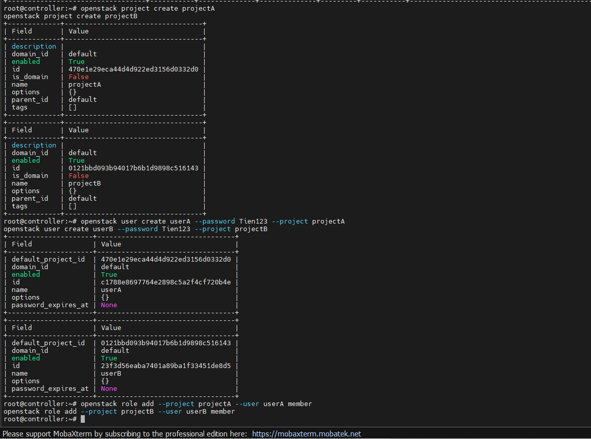

#### `Bước 2`: Tạo file openrc cho từng user

**User A**:

```bash
nano userA-openrc

# userA-openrc
export OS_USERNAME=userA
export OS_PASSWORD=Tien123
export OS_PROJECT_NAME=projectA
export OS_AUTH_URL=http://controller:5000/v3
export OS_IDENTITY_API_VERSION=3
export OS_IMAGE_API_VERSION=2
```

**User B**:

```bash
nano userB-openrc

# userB-openrc
export OS_USERNAME=userB
export OS_PASSWORD=Tien123
export OS_PROJECT_NAME=projectB
export OS_AUTH_URL=http://controller:5000/v3
export OS_IDENTITY_API_VERSION=3
export OS_IMAGE_API_VERSION=2
```

#### `Bước 3`: Upload image với visibility shared (dùng userA)

```bash
source userA-openrc

openstack image create "shared-image" \
  --file ubuntu-22.04.5-live-server-amd64.iso \
  --disk-format iso \
  --container-format bare \
  --shared
```

Output như này là `OKE`:

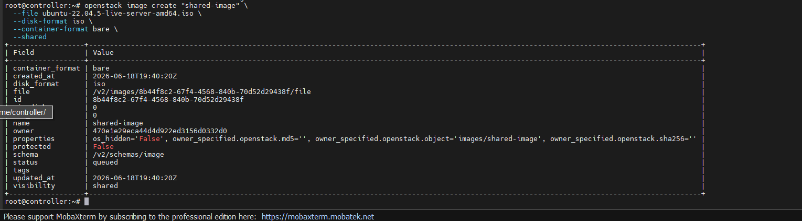

#### `Bước 4`:  Thêm projectB làm member

```bash
source admin-openrc

# Lấy ID của projectB
openstack project show projectB | grep " id"

# Thêm member (vẫn dùng userA)
openstack image add project <image-id> <projectB-id>
```

Output như này là `OKE`:

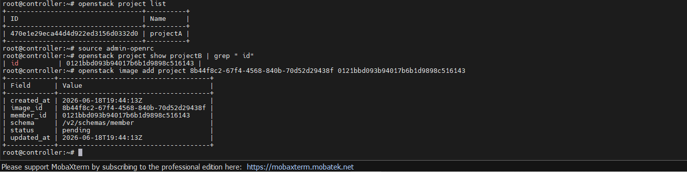

#### `Bước 5`: projectB accept image

```bash
source userB-openrc

# Accept image được chia sẻ
openstack image set --accept <image-id>

# Verify
openstack image list
```

Output như này là `OKE`:

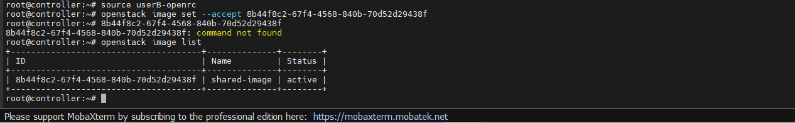

#### `Bước 6`: Verify

```bash
# Dùng userA — xem member list
source userA-openrc
openstack image member list <image-id>

# Dùng userB — xem image đã nhận
source userB-openrc
openstack image list
```

Output như này là `OKE`:

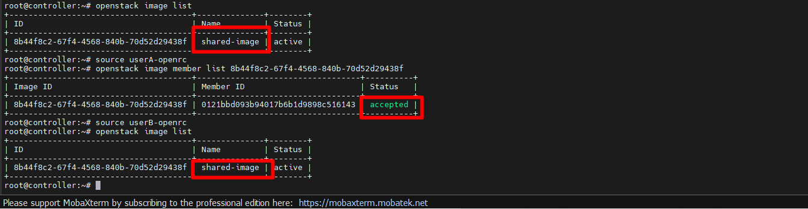

#### `Bước 7`: Gỡ member khi không cần nữa

```bash
# Dùng biến user a
source userA-openrc
openstack image remove project <image-id> <projectB-id>
```

### 2. Tạo image bằng snapshot máy ảo đang chạy

#### `Bước 1`: Kiểm tra VM đang chạy

```bash
openstack server list
```

#### `Bước 2`: Tạo Image từ snapshot VM

```bash
openstack server image create \
  --name "snapshot-vmtest" \
  0393c974-1ca0-4b90-9fff-b9282fccbfd1
```

#### `Bước 3`: Kiểm tra trạng thái snapshot

```bash
# Snapshot sẽ ở trạng thái saving → active
openstack image list
openstack image show snapshot-vmtest
```

#### `Bước 4`: Verify image có thể dùng để boot VM mới

```bash
openstack server create \
  --image snapshot-vmtest \
  --flavor flavor- \
  --network 5eadd811-327a-44c5-a398-168d67e1feaf \
  "vm-from-snapshot"
```

=> Do cụm ít CPU quá lên không boot đc 2 VM, nhưng kết quả sẽ tạo ra VM mới.

**Note**:

|                                  |                     Chi tiết                            |
|----------------------------------|---------------------------------------------------------|
|VM có cần tắt không               |Không bắt buộc, nhưng nên tắt để tránh data inconsistency|
|Thời gian                         |Tùy dung lượng disk VM, có thể mất vài phút              |
|Trạng thái VM                     |Trong lúc snapshot, VM bị pause tạm thời rồi resume      |
|Snapshot lưu ở đâu                |Glance (giống image thường)                              |

**Note2**: Nếu muốn tắt VM trước khi snapshot

```bash
# Tắt VM
openstack server stop <server-id>

# Chờ VM tắt hẳn
openstack server show <server-id> | grep status

# Tạo snapshot
openstack server image create \
  --name "snapshot-vm01" \
  <server-id>

# Bật lại VM
openstack server start <server-id>
```

### 3. Cấu hình RBAC policy cho Glance

#### 3.1 Khảo sát policy mặc định

dùng `oslopolicy-sample-generator` để xem toàn bộ action của Glance

Trên **Controller**, dùng tool xuất toàn bộ policy mặc định đang chạy trong code ra thành file vật lý để đọc:

```bash
source admin-openrc

mkdir -p /etc/glance/policy.d/
oslopolicy-sample-generator --namespace glance --output-file /etc/glance/policy.yaml
```

Đọc file vừa xuất ra:

```bash
nano /etc/glance/policy.yaml
```

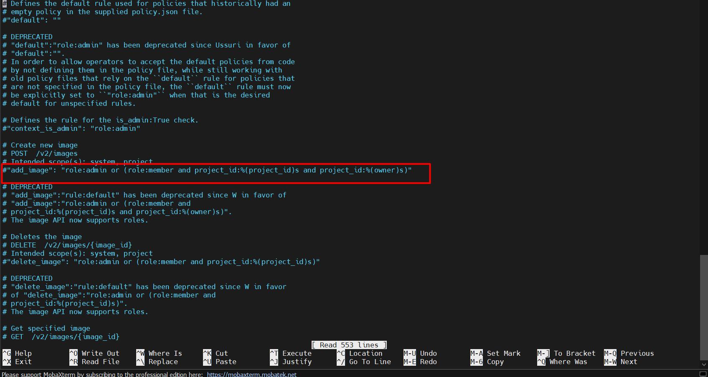

=> Bạn sẽ quan sát được các rule.

#### 3.2 Quan sát hành vi reader/ member/ admin trong RBAC policy

**Mục đích**: Tạo user thật,thử list, upload, publicize để thấy lỗi `403`

`Bước 1`: Chuẩn bị User (Bằng tài khoản `admin` trên Controller 1)

```bash
source admin-openrc

openstack project create rbac_project
openstack user create g_reader --password Tien123
openstack user create g_member --password Tien123
openstack user create g_admin --password Tien123

# Gán đúng role mặc định của Keystone
openstack role add --project rbac_project --user g_reader reader
openstack role add --project rbac_project --user g_member member
openstack role add --project rbac_project --user g_admin admin
```

`Bước 2`: Kịch bản test

Tạo sẵn 3 file file openrc cho 3 user: `g_reader`, `g_member`, `g_admin`

Dùng user `g_reader`:

- Check đọc list image:

```bash
source g_reader-openrc

openstack image list

# Nếu trả về 200 tức là thành công
```

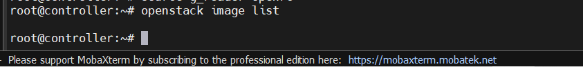

- Check tạo image bằng user `g_reader`:

```bash
openstack image create \
  --file ubuntu-22.04.5-live-server-amd64.iso \
  --disk-format iso \
  --container-format bare \
  "reader-try-create"

# Nếu vẫn tạo được là đúng vì ta chưa cấu hình RBAC policy lên Openstack vẫn chưa quan tâm ta là reader hay member
```

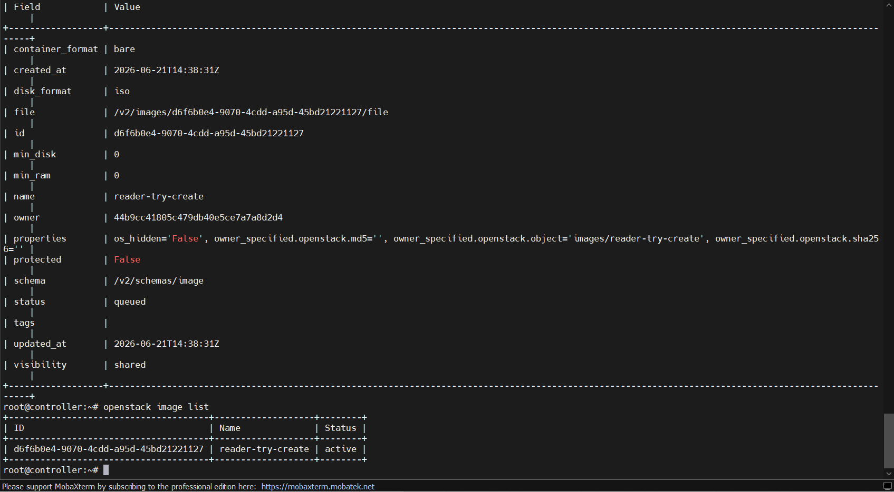

- Ta bật cấu hình RBAC policy của glance lên:

```bash
nano /etc/glance/glance-api.conf

# Tìm (hoặc thêm) block [oslo_policy] và [DEFAULT] thêm dòng sau:
[DEFAULT]
enforce_secure_rbac = True


[oslo_policy]
enforce_scope = True
enforce_new_defaults = True
```

- Khởi động lại Glance API:

```bash
systemctl restart glance-api
```

- Xoá image cũ đi và Check tạo lại image bằng user `g_reader`:

```bash
source g_member-openrc

openstack image delete "reader-try-create"

source g_reader-openrc

openstack image create \
  --file ubuntu-22.04.5-live-server-amd64.iso \
  --disk-format iso \
  --container-format bare \
  "reader-try-create"

# Nếu trả về 403 là OKE vì role reader không có quyền tạo image
```

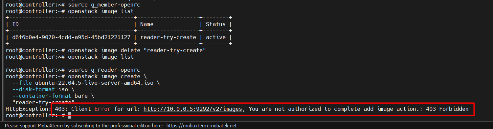

Dùng user `g_member`:

- Check tạo image:

```bash
source g_member-openrc

openstack image create \
  --file ubuntu-22.04.5-live-server-amd64.iso \
  --disk-format iso \
  --container-format bare \
  "member-try-create"

# Nếu trả về 200 là OKE vì role member có quyền tạo image
```

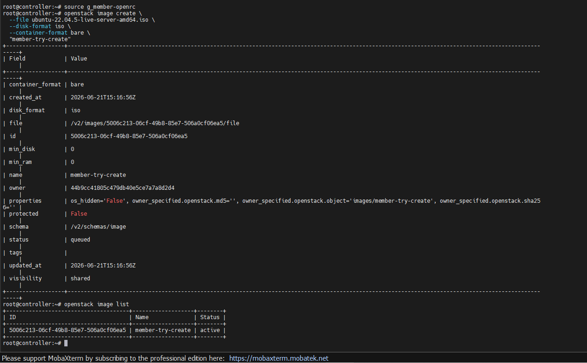

- Check publicize image:

```bash
source g_member-openrc

openstack image set \
  --public \
  "member-try-create"

# Nếu trả về 403 là OKE vì role member không có quyền publicize image
```

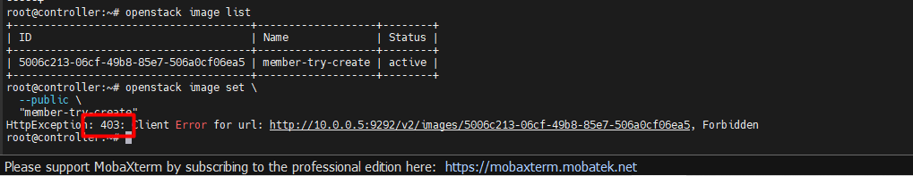

Dùng user `g_admin`:

- Check publicize image:

```bash
source g_admin-openrc

openstack image set \
  --public \
  "member-try-create"

# Nếu trả về 200 là OKE vì role admin có quyền publicize image
```

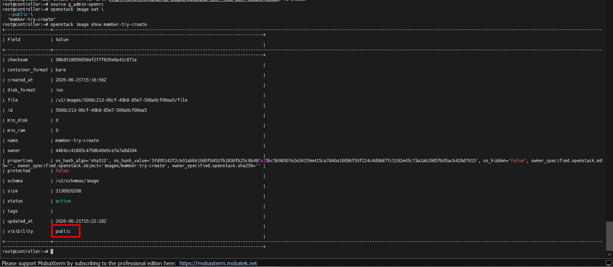

#### 3.3 Secure RBAC theo scope (system-scope vs project-scope)

Mặc định OpenStack cũ (hoặc mặc định cài đặt) trộn lẫn khái niệm "Admin của Project" và "Admin của toàn hệ thống". **Secure RBAC** sẽ tách biệt chuyện này.

`Bước 1`: Bật tính nằng RBAC policy cho Glance (Đã làm ở phần trên)

`Bước 2`: Test sự khác biệt

- Với user `g_admin` (Đây là Project Admin): Nếu bây giờ dùng `g_admin` cố gắng lấy thông tin cấu hình hệ thống hoặc list các image bị ẩn của hệ thống, hệ thống sẽ trả về `403 Forbidden`. Bởi vì tuy là `Admin`, nhưng scope của user này chỉ giới hạn trong `rbac_project`.

- Tạo `System Admin` để so sánh: Dùng tài khoản `admin` gốc, tạo một user có scope là `system`:

```bash
openstack user create sys_admin --password Tien123
openstack role add --system all --user sys_admin admin
```

Tạo file rc cho `sys_admin`, chú ý biến quan trọng nhất là `export OS_SYSTEM_SCOPE=all` (thay vì `OS_PROJECT_NAME`). Khi dùng file rc của `sys_admin` này thao tác với Glance, bạn mới thực sự có toàn quyền cao nhất chi phối toàn bộ cấu hình dịch vụ trên toàn **Region 1** or **Region 2**.
