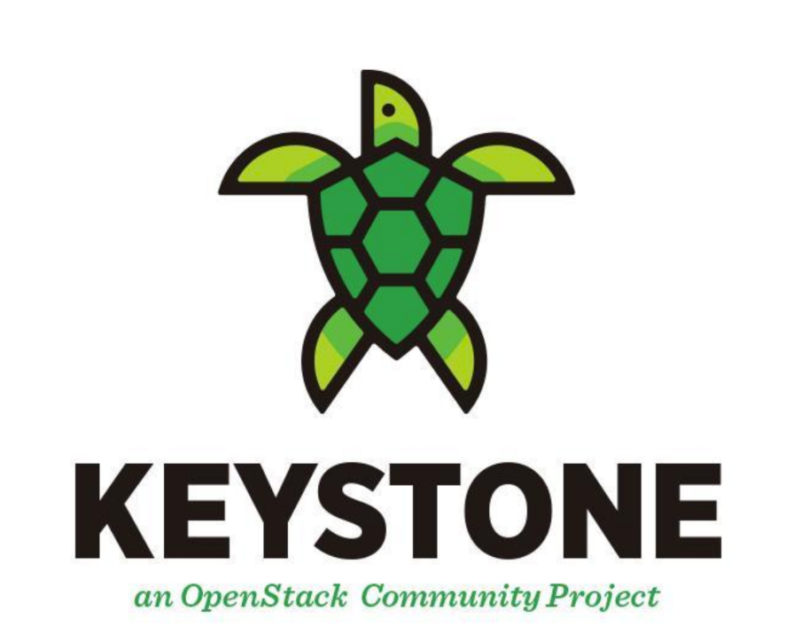
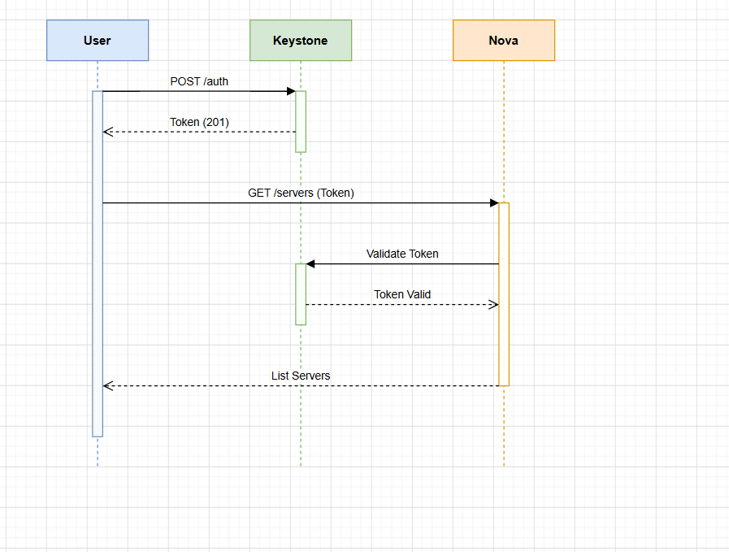

# Tổng Quan Về OpenStack Keystone

## Mục Lục

1. [Giới thiệu về OpenStack Keystone](#1-giới-thiệu-về-openstack-keystone)
2. [Khái niệm Keystone](#2-khái-niệm-keystone)
3. [Lịch sử phát triển](#3-lịch-sử-phát-triển)
4. [Vai trò của Keystone trong hệ sinh thái OpenStack](#4-vai-trò-của-keystone-trong-hệ-sinh-thái-openstack)
5. [Các khái niệm cơ bản trong Keystone](#5-các-khái-niệm-cơ-bản-trong-keystone)
   - 5.1 [Domain](#51-domain)
   - 5.2 [Project (Tenant)](#52-project-tenant)
   - 5.3 [User & Group](#53-user--group)
   - 5.4 [Role](#54-role)
   - 5.5 [Token](#55-token)
   - 5.6 [Service & Endpoint](#56-service--endpoint)
   - 5.7 [Catalog](#57-catalog)
   - 5.8 [Credential](#58-credential)
   - 5.9 [Policy](#59-policy)
6. [Các thành phần cốt lõi của Keystone](#6-các-thành-phần-cốt-lõi-của-keystone)
   - 6.1 [Identity](#61-identity)
   - 6.2 [Resource](#62-resource)
   - 6.3 [Assignment](#63-assignment)
   - 6.4 [Token Service](#64-token-service)
   - 6.5 [Catalog Service](#65-catalog-service)
   - 6.6 [Policy Service](#66-policy-service)
7. [Đặc điểm của Keystone](#7-đặc-điểm-của-keystone)
8. [Kiến trúc của Keystone](#8-kiến-trúc-của-keystone)
   - 8.1 [Kiến trúc tổng thể](#81-kiến-trúc-tổng-thể)
   - 8.2 [Luồng xác thực (Authentication Flow)](#82-luồng-xác-thực-authentication-flow)
   - 8.3 [Middleware Pipeline](#83-middleware-pipeline)
9. [Các Backend hỗ trợ](#9-các-backend-hỗ-trợ)
10. [Các loại Token trong Keystone](#10-các-loại-token-trong-keystone)
11. [Cơ chế xác thực (Authentication Methods)](#11-cơ-chế-xác-thực-authentication-methods)
12. [Keystone API](#12-keystone-api)
13. [Tóm tắt](#13-tóm-tắt)

## 1. Giới thiệu về OpenStack Keystone



**OpenStack Keystone** là dịch vụ **Identity (nhận dạng)** trung tâm của nền tảng điện toán đám mây OpenStack. Keystone đóng vai trò là **cổng vào** (gateway) cho toàn bộ hệ sinh thái OpenStack, chịu trách nhiệm xác thực danh tính người dùng và cấp phép truy cập vào các tài nguyên cloud.

Keystone được thiết kế theo mô hình **AAA (Authentication, Authorization, Accounting)**:

| Chức năng           | Tiếng Việt       | Mô tả                                               |
|---------------------|------------------|-----------------------------------------------------|
| **Authentication**  | Xác thực         | Xác minh danh tính người dùng/dịch vụ               |
| **Authorization**   | Ủy quyền         | Kiểm soát quyền truy cập vào tài nguyên             |
| **Service Catalog** | Danh mục dịch vụ | Cung cấp danh sách và địa chỉ các dịch vụ OpenStack |

## 2. Khái niệm Keystone

**Keystone** là một dịch vụ OpenStack cung cấp:

- **Xác thực danh tính (Identity Authentication):** Xác minh rằng một **user**, **service** hoặc **system** thực sự là ai mà họ tự nhận.
- **Quản lý token (Token Management):** Cấp phát và xác thực các token tạm thời để truy cập **dịch vụ**.
- **Quản lý danh mục dịch vụ (Service Catalog):** Duy trì danh sách các dịch vụ OpenStack và các **endpoint** tương ứng.
- **Kiểm soát truy cập dựa trên vai trò (RBAC - Role-Based Access Control):** Phân quyền chi tiết cho từng **user**, **group** trong từng **project**/**domain**.

> **Nói đơn giản:** Keystone giống như một "người gác cổng" của OpenStack — bất kỳ **user** hay **service** nào muốn truy cập vào hệ thống đều phải đi qua Keystone để xác thực danh tính và nhận **token** trước khi có thể làm bất kỳ điều gì.

## 3. Lịch sử phát triển

| Mốc thời gian     | Sự kiện                                                        |
|-------------------|----------------------------------------------------------------|
| **2011**          | Keystone được giới thiệu lần đầu trong OpenStack               |
| **Diablo (2011)** | Phiên bản đầu tiên tích hợp vào OpenStack                      |
| **Essex (2012)**  | Keystone v2 API ra đời, hỗ trợ Tenant và Role                  |
| **Havana (2013)** | Giới thiệu Domain, hỗ trợ LDAP backend                         |
| **Kilo (2015)**   | Keystone v3 API chính thức, token Fernet xuất hiện             |
| **Mitaka (2016)** | Deprecate Keystone v2 API                                      |
| **Queens (2018)** | Loại bỏ hoàn toàn v2 API, UUID token bị deprecated             |
| **Stein (2019)**  | Fernet token trở thành mặc định                                |
| **Hiện tại**      | Keystone tiếp tục phát triển với JWT token và cải tiến bảo mật |

## 4. Vai trò của Keystone trong hệ sinh thái OpenStack

Keystone là **trung tâm kết nối** toàn bộ hệ sinh thái OpenStack. Mọi dịch vụ khác đều phụ thuộc vào Keystone:


**Keystone cung cấp cho các dịch vụ khác:**

- Xác thực token của request đến
- Thông tin về user và quyền truy cập
- Danh sách endpoint của các service khác

## 5. Các khái niệm cơ bản trong Keystone

### 5.1 Domain


- **Domain** là đơn vị quản lý cấp cao nhất trong Keystone.
- Mỗi domain chứa các **User**, **Group**, và **Project** riêng biệt.
- Domain mặc định được gọi là **`Default`**.
- Cho phép **multi-tenancy** cấp cao: nhiều tổ chức khác nhau dùng chung một cụm OpenStack mà vẫn độc lập hoàn toàn.

```text
Domain A (Công ty X)
  ├── Project: dev
  ├── Project: production
  └── Users: alice, bob

Domain B (Công ty Y)
  ├── Project: testing
  └── Users: charlie, dave
```

### 5.2 Project (Tenant)


- **Project** (trước đây gọi là **Tenant**) là đơn vị **phân bổ tài nguyên** trong OpenStack.
- Mọi tài nguyên (VM, volume, network...) đều thuộc về một project.
- User được gán vào project và có **Role** xác định quyền hạn trong project đó.

### 5.3 User & Group

- **User:** Đại diện cho một cá nhân hoặc dịch vụ tương tác với OpenStack. Có username, password, email...
- **Group:** Tập hợp các User. Gán Role cho Group sẽ áp dụng cho tất cả User trong Group đó.

### 5.4 Role


- **Role** định nghĩa **tập hợp quyền** mà một User/Group có trong một Project/Domain.
- Role phổ biến nhất:
  - `admin` — quyền quản trị cao nhất
  - `member` — người dùng thông thường
  - `reader` — chỉ xem, không thể thay đổi
- Role được gán thông qua **Role Assignment**: `User + Project + Role`

### 5.5 Token


- **Token** là chuỗi ký tự tạm thời đại diện cho danh tính và quyền truy cập đã được xác thực.
- Sau khi xác thực thành công, Keystone cấp token cho user.
- User dùng token này để gọi đến các dịch vụ OpenStack khác (Nova, Neutron...).
- Token có **thời gian hết hạn** (**mặc định 1 giờ**).

### 5.6 Service & Endpoint

- Đối với **Service** ta check như sau:


- Đối với **Endpoint** ta check như sau:


- **Service:** Một dịch vụ OpenStack đã được đăng ký với Keystone (ví dụ: `compute`, `network`, `image`...).

- **Endpoint:** Địa chỉ URL thực tế của service, phân loại theo 3 loại:
  - `public` — URL cho client bên ngoài truy cập
  - `internal` — URL cho các service trong nội bộ cloud
  - `admin` — URL cho quản trị viên

### 5.7 Catalog


- **Service Catalog** là danh mục liệt kê tất cả services và endpoints có sẵn.
- Được nhúng trong token hoặc trả về khi query Keystone.
- Client dùng catalog để biết địa chỉ gọi đến service nào.

### 5.8 Credential

- **Credential** là thông tin xác thực của user, có thể là:
  - Username/Password
  - API Key
  - EC2 Access Key/Secret Key
  - Chứng chỉ X.509

### 5.9 Policy

- **Policy** định nghĩa các quy tắc kiểm soát truy cập chi tiết cho từng API operation.
- Được lưu trong file `policy.json` hoặc `policy.yaml` của mỗi service.
- Ví dụ: "Chỉ user có role `admin` mới được xóa project"

## 6. Các thành phần cốt lõi của Keystone

### 6.1 Identity

**Identity Service** quản lý thông tin danh tính của:

- **Users**: Tài khoản người dùng/dịch vụ
- **Groups**: Nhóm người dùng

**Chức năng:**

- CRUD Users, Groups
- Xác thực thông tin đăng nhập (password, token...)
- Hỗ trợ nhiều backend: SQL, LDAP, Active Directory

### 6.2 Resource

**Resource Service** quản lý:

- **Projects (Tenants)**: Đơn vị phân bổ tài nguyên
- **Domains**: Đơn vị phân tách hành chính cấp cao

**Chức năng:**

- CRUD Projects và Domains
- Quản lý cấu trúc phân cấp tài nguyên

### 6.3 Assignment

**Assignment Service** quản lý việc gán quyền:

- Gán **Role** cho **User/Group** trong **Project/Domain**
- Hỗ trợ **Role Inheritance**: role ở domain cấp cha có thể kế thừa xuống project con

**Ví dụ Assignment:**

``` text
User: alice
Role: admin
Scope: Project "production"
→ alice có quyền admin trên project production
```

### 6.4 Token Service

**Token Service** xử lý vòng đời của token:

| Hành động    | Mô tả                                          |
|--------------|------------------------------------------------|
| **Issue**    | Cấp phát token mới sau khi xác thực thành công |
| **Validate** | Xác thực token gửi đến có hợp lệ không         |
| **Revoke**   | Thu hồi token trước khi hết hạn                |
| **Expire**   | Tự động hết hạn sau thời gian cấu hình         |

### 6.5 Catalog Service

**Catalog Service** duy trì:

- Danh sách tất cả **Services** đã đăng ký
- Các **Endpoints** tương ứng (public/internal/admin)
- Trả về catalog phù hợp theo scope của token

### 6.6 Policy Service

**Policy Service** cung cấp:

- **Engine kiểm tra quyền truy cập theo policy rules**
- **Mỗi service tự định nghĩa policy của mình**
- Keystone đảm bảo enforcement nhất quán

## 7. Đặc điểm của Keystone

### 7.1 Tính năng nổi bật

| Đặc điểm              | Mô tả                                                        |
|-----------------------|--------------------------------------------------------------|
| **Pluggable Backend** | Hỗ trợ nhiều loại backend: SQL, LDAP, Active Directory       |
| **Multi-Domain**      | Hỗ trợ nhiều domain độc lập trên cùng hệ thống               |
| **Federation**        | Liên kết với Identity Provider bên ngoài (SAML, OAuth, OIDC) |
| **RBAC**              | Phân quyền chi tiết theo Role trên từng Project/Domain       |
| **Scalability**       | Thiết kế stateless (Fernet token) cho phép scale ngang       |
| **RESTful API**       | Cung cấp API chuẩn REST, dễ tích hợp                         |
| **Token Revocation**  | Hỗ trợ thu hồi token ngay lập tức                            |
| **Multi-Factor Auth** | Hỗ trợ xác thực đa yếu tố (MFA)                              |

### 7.2 Ưu điểm

- **Centralized**: Một điểm quản lý xác thực cho toàn bộ OpenStack
- **Flexible**: Dễ dàng tích hợp với hệ thống quản lý danh tính doanh nghiệp
- **Secure**: Hỗ trợ HTTPS, token có thời hạn, revocation
- **Extensible**: Plugin-based architecture dễ mở rộng

### 7.3 Nhược điểm / Lưu ý

- **Single Point of Failure**: Nếu Keystone down, toàn bộ OpenStack ngưng hoạt động → cần HA
- **Complexity**: Cấu hình federation và LDAP phức tạp
- **Performance**: Validate token tập trung có thể là bottleneck nếu không scale đúng cách

## 8. Kiến trúc của Keystone

### 8.1 Kiến trúc tổng thể


> **Lưu ý:** Từ phiên bản Keystone Queens trở đi, cả Public và Admin API đều chạy trên **port 5000**. Port `35357` (Admin) đã bị deprecated (khai tử).

### 8.2 Luồng xác thực (Authentication Flow)

**Bước 1 — User gửi thông tin đăng nhập:**

```json
User → POST /v3/auth/tokens
{
  "auth": {
    "identity": {
      "methods": ["password"],
      "password": {
        "user": { "name": "alice", "password": "secret",
                  "domain": { "name": "Default" } }
      }
    },
    "scope": {
      "project": { "name": "myproject", "domain": { "name": "Default" } }
    }
  }
}
```

**Bước 2 — Keystone xử lý:**

1. Xác thực credentials (kiểm tra `username`/`password` với Identity backend)
2. Xác định scope (`project`/`domain`)
3. Lấy danh sách `Role` của user trong `project`
4. Tạo token (`Fernet`) chứa thông tin `user`, `project`, `roles`
5. Build `Service Catalog`

**Bước 3 — Keystone trả về token:**

```json
HTTP 201 Created
X-Subject-Token: gAAAAABh...  ← Token
Body: { "token": { "user": {...}, "roles": [...], "catalog": [...] } }
```

**Bước 4 — User gọi dịch vụ khác (ví dụ Nova):**

```json
User → GET /v2.1/servers
X-Auth-Token: gAAAAABh...
```

**Bước 5 — Nova validate token với Keystone:**

```json
Nova → GET /v3/auth/tokens
X-Auth-Token: <nova_service_token>
X-Subject-Token: gAAAAABh...
```

**Bước 6 — Nova trả kết quả cho User:**



### 8.3 Middleware Pipeline

Keystone sử dụng **WSGI Middleware pipeline** để xử lý request:

```text
Request → [auth_token middleware] → [router] → [controller] → Response
```

- **`keystonemiddleware.auth_token`**: Middleware được cài đặt trên mỗi service OpenStack để tự động validate token trước khi request đến controller.

## 9. Các Backend hỗ trợ

| Backend               | Dùng cho                       |                     Mô tả                       |
|-----------------------|--------------------------------|-------------------------------------------------|
| **SQL** (mặc định)    | Identity, Resource, Assignment | Lưu dữ liệu trong database (MySQL, PostgreSQL)  |
| **LDAP**              | Identity                       | Tích hợp với LDAP/Active Directory doanh nghiệp |
| **PAM**               | Identity                       | Xác thực qua PAM của Linux                      |
| **OAuth 1.0**         | Authentication                 | Hỗ trợ OAuth 1.0a delegation                    |
| **SAML**              | Federation                     | Kết nối với Identity Provider (IdP) SAML        |
| **OpenID Connect**    | Federation                     | Kết nối với Google, Azure AD, Keycloak...       |
| **Fernet** (mặc định) | Token                          | Token format nhẹ, không cần lưu DB              |
| **JWT**               | Token                          | JSON Web Token, đang phát triển                 |

## 10. Các loại Token trong Keystone

### 10.1 UUID Token (Deprecated - Lỗi thời)

- Chuỗi ngẫu nhiên 32 ký tự
- Phải **lưu vào database** để validate
- Nhược điểm: gây tải DB lớn, khó scale

### 10.2 PKI/PKIZ Token (Deprecated - Lỗi thời)

- Ký số bằng RSA private key
- Validate offline mà không cần gọi Keystone
- Nhược điểm: token rất dài, overhead lớn

### 10.3 Fernet Token (Mặc định hiện tại)

- Mã hóa đối xứng `AES-128-CBC` + `HMAC-SHA256`
- **Không cần lưu vào database** (stateless)
- Kích thước nhỏ (~255 bytes)
- Cần rotate key định kỳ
- **Ưu điểm:** Hiệu suất cao, dễ scale

```text
Cấu trúc Fernet Token:
Version | Timestamp | IV | Ciphertext | HMAC
```

### 10.4 JWT Token (Thử nghiệm)

- JSON Web Token theo chuẩn `RFC 7519`
- Ký số bằng `RSA` hoặc `ECDSA`
- Validate offline
- Đang được phát triển trong các phiên bản mới

## 11. Cơ chế xác thực (Authentication Methods)

Keystone hỗ trợ nhiều phương thức xác thực:

| Phương thức                |                           Mô tả                           |
|----------------------------|-----------------------------------------------------------|
| **password**               | Username + Password (phổ biến nhất)                       |
| **token**                  | Dùng token hiện có để lấy token mới (token exchange)      |
| **application_credential** | Credential cố định cho ứng dụng, không dùng password user |
| **totp**                   | Time-based One-Time Password (MFA)                        |
| **mapped**                 | Federation mapping từ IdP bên ngoài                       |
| **oauth1**                 | OAuth 1.0a                                                |

**Multi-Factor Authentication (MFA):**

```json
{
  "auth": {
    "identity": {
      "methods": ["password", "totp"],
      "password": { "user": { "name": "alice", "password": "secret" } },
      "totp": { "user": { "id": "...", "passcode": "123456" } }
    }
  }
}
```

## 12. Keystone API

Keystone cung cấp **RESTful API v3** (v2 đã deprecated):

### Các endpoint chính

| Method | Endpoint | Mô tả |
|--------|----------|-------|
| `POST` | `/v3/auth/tokens` | Lấy token (xác thực) |
| `GET` | `/v3/auth/tokens` | Validate token |
| `DELETE` | `/v3/auth/tokens` | Thu hồi token |
| `GET` | `/v3/users` | Liệt kê users |
| `POST` | `/v3/users` | Tạo user |
| `GET` | `/v3/projects` | Liệt kê projects |
| `POST` | `/v3/projects` | Tạo project |
| `GET` | `/v3/domains` | Liệt kê domains |
| `GET` | `/v3/roles` | Liệt kê roles |
| `PUT` | `/v3/projects/{id}/users/{uid}/roles/{rid}` | Gán role |
| `GET` | `/v3/services` | Liệt kê services |
| `GET` | `/v3/endpoints` | Liệt kê endpoints |

### Ví dụ sử dụng CLI

```bash
# Xác thực và lấy token
openstack token issue

# Liệt kê users
openstack user list

# Tạo project mới
openstack project create --domain Default myproject

# Gán role cho user
openstack role add --project myproject --user alice member

# Liệt kê endpoints
openstack endpoint list
```

---

## 13. Tóm tắt

| Chủ đề                | Nội dung chính                                                  |
|-----------------------|-----------------------------------------------------------------|
| **Keystone là gì?**   | Dịch vụ Identity trung tâm của OpenStack                        |
| **Chức năng chính**   | Authentication, Authorization, Service Catalog                  |
| **Khái niệm cốt lõi** | Domain > Project > User/Group + Role + Token                    |
| **Thành phần**        | Identity, Resource, Assignment, Token, Catalog, Policy          |
| **Token mặc định**    | Fernet (stateless, AES-128 encrypted)                           |
| **API**               | RESTful API v3, Port 5000                                       |
| **Backend**           | SQL (mặc định), LDAP, Federation (SAML/OIDC)                    |
| **Luồng hoạt động**   | User → Keystone (lấy token) → Dùng token gọi service khác       |

> **Keystone = Xác thực + Phân quyền + Khám phá dịch vụ cho toàn bộ OpenStack**
