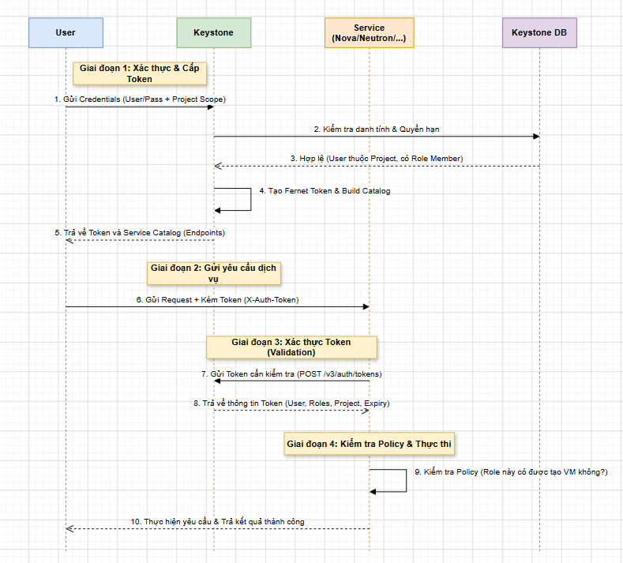

# WORKFLOW OF OPENSTACK KEYSTONE

Tài liệu này giải thích chi tiết luồng làm việc của Keystone và cách nó tương tác với các dịch vụ khác trong OpenStack.

Về câu hỏi : "**Khi thực hiện các service khác nhau thì luồng có khác nhau nhiều không?**" -> Câu trả lời là: **KHÔNG**. Về cơ bản, luồng xác thực và ủy quyền là đồng nhất cho tất cả các service (Nova, Neutron, Cinder, Glance...). Sự khác biệt duy nhất chỉ là Endpoint mà User gọi đến và các Policy (quyền hạn) cụ thể mà service đó kiểm tra.

## 1. Sơ đồ luồng làm việc tổng quát (Workflow Diagram)

Dưới đây là trình tự các bước khi một User muốn thực hiện một yêu cầu (ví dụ: tạo một máy ảo trong Nova).

## 2. Giải thích chi tiết từng bước

### Bước 1: Yêu cầu xác thực (Authentication Request)

**User** (hoặc CLI/Horizon) gửi một yêu cầu `POST /v3/auth/tokens` tới Keystone kèm theo thông tin đăng nhập (`username`, `password`) và **Scope** (phạm vi) muốn làm việc (thường là tên một Project).

### Bước 2 & 3: Kiểm tra Backend

Keystone truy vấn vào Database (SQL) hoặc LDAP để xác nhận:

- Password có đúng không?
- User có đang hoạt động (active) không?
- User có quyền (Role) trong Project đã yêu cầu không?

### Bước 4 & 5: Cấp Token và Catalog

Nếu hợp lệ, Keystone tạo một **Token** (thường là định dạng **Fernet**). Đồng thời, nó tạo một **Service Catalog** chứa danh sách tất cả các dịch vụ mà User đó có quyền truy cập cùng với các URL (Endpoints).

### Bước 6: Gửi yêu cầu đến Service

User nhìn vào Service Catalog để lấy URL của dịch vụ cần dùng (ví dụ Nova). Sau đó gửi yêu cầu thực tế (ví dụ: `POST /servers` để tạo VM) và đính kèm Token vào HTTP Header `X-Auth-Token`.

### Bước 7 & 8: Xác thực Token (Token Validation)

Khi Service nhận được request, nó **không tin tưởng ngay**. Nó cầm Token đó quay lại hỏi Keystone: "Token này có thật không? Của ai? Còn hạn không? Có những quyền gì?". Keystone sẽ giải mã token và trả về thông tin chi tiết.

### Bước 9: Kiểm tra Policy (Authorization)

Sau khi biết User là ai và có Role gì, Service sẽ đối chiếu với file `policy.yaml` nội bộ của nó.

- *Ví dụ:* Nếu policy quy định "Chỉ admin mới được xóa máy ảo", mà User chỉ có role "member", thì Service sẽ từ chối ngay tại đây.

### Bước 10: Thực hiện và Phản hồi

Nếu tất cả đều vượt qua, Service mới thực hiện logic nghiệp vụ và trả kết quả về cho User.

## 3. So sánh luồng giữa các Service khác nhau

Ta hỏi luồng có khác nhau không? Hãy xem bảng so sánh dưới đây:

| Đặc điểm | Nova (Compute) | Neutron (Network) | Cinder (Block Storage) |
| :--- | :--- | :--- | :--- |
| **Bước 1-5 (Lấy Token)** | **Giống hệt** | **Giống hệt** | **Giống hệt** |
| **Header gửi đi** | `X-Auth-Token` | `X-Auth-Token` | `X-Auth-Token` |
| **Điểm đến (Endpoint)** | `http://nova-api:8774` | `http://neutron-server:9696` | `http://cinder-api:8776` |
| **Xác thực lại với Keystone** | Có (Service nào cũng làm) | Có (Service nào cũng làm) | Có (Service nào cũng làm) |
| **Kiểm tra Policy** | Dựa trên `nova/policy.yaml` | Dựa trên `neutron/policy.yaml` | Dựa trên `cinder/policy.yaml` |

### Kết luận

- **Luồng xác thực là duy nhất:** Mọi con đường đều phải đi qua Keystone để lấy "chứng minh thư" (Token).
- **Sự khác biệt nằm ở "Đích đến":** User dùng cùng 1 Token đó để đi "shopping" ở các cửa hàng khác nhau (Nova, Neutron...). Mỗi cửa hàng sẽ tự kiểm tra xem với cái "thẻ" đó, User được mua món hàng nào.

## 4. Tại sao cần luồng này?

1. **Centralized (Tập trung):** Chỉ cần quản lý User ở một nơi duy nhất là Keystone. Các service khác không cần giữ mật khẩu của User.
2. **Stateless (Không lưu trạng thái):** Với Fernet Token, Keystone không cần lưu token vào DB, giúp hệ thống chạy cực nhanh và dễ mở rộng.
3. **Security (Bảo mật):** Password chỉ gửi đi một lần duy nhất để đổi lấy Token. Các yêu cầu sau này chỉ dùng Token có thời hạn ngắn, giảm rủi ro bị lộ mật khẩu.
