# TƯƠNG TÁC VỚI API CỦA KEYSTONE

Tài liệu này hướng dẫn cách tương tác trực tiếp với **REST API của OpenStack Keystone** thay vì chỉ dùng lệnh CLI. Bạn sẽ học cách dùng **cURL** để gọi API thủ công và viết **script Python** bằng **OpenStack SDK** để tự động hóa các thao tác xác thực và quản lý tài nguyên.

## 1. Tổng Quan: Tại Sao Cần Giao Tiếp Trực Tiếp Với API?

Câu lệnh `openstack` CLI thực chất là một lớp wrapper (bọc bên ngoài) mà bên trong vẫn gọi các HTTP REST API của Keystone. Việc hiểu cách giao tiếp trực tiếp với API mang lại nhiều lợi ích:

| Lợi ích               | Mô tả                                                             |
|-----------------------|-------------------------------------------------------------------|
| **Tự động hóa**       | Viết script tích hợp vào pipeline CI/CD, Ansible, Terraform, v.v. |
| **Debug sâu hơn**     | Nhìn thấy toàn bộ request/response JSON, header, HTTP status code |
| **Tích hợp ứng dụng** | Xây dựng ứng dụng tương tác với OpenStack mà không cần cài CLI    |
| **Hiểu kiến trúc**    | Nắm rõ cách Keystone hoạt động ở tầng giao thức                   |

Keystone sử dụng chuẩn **REST API v3** (`/v3`). Tất cả dữ liệu gửi/nhận đều theo định dạng **JSON**.

## 2. Kiến Trúc API của Keystone

### 2.1. Endpoint cơ bản

Keystone thường lắng nghe trên hai port:

| Port      | Mục đích                                                   | Endpoint ví dụ                    |
|-----------|------------------------------------------------------------|-----------------------------------|
| **5000**  | Public API (cho user thông thường)                         | `http://<keystone_host>:5000/v3`  |
| **35357** | Admin API (chỉ dành cho admin - đã bị deprecated từ Rocky) | `http://<keystone_host>:35357/v3` |

> **Lưu ý:** Từ bản **Rocky** trở đi, OpenStack hợp nhất Public và Admin API vào cùng một port **5000**. Port 35357 không còn được khuyến nghị sử dụng.

### 2.2. Cấu trúc URL chuẩn

```bash
http://<keystone_host>:5000/v3/<resource>
```

Ví dụ:

- `GET /v3/auth/tokens` → Xác thực và lấy token
- `GET /v3/projects` → Liệt kê tất cả project
- `GET /v3/users` → Liệt kê tất cả user
- `GET /v3/domains` → Liệt kê tất cả domain

### 2.3. Header quan trọng

| Header                                            | Mục đích                                                    |
|---------------------------------------------------|-------------------------------------------------------------|
| `Content-Type: application/json`                  | Báo cho server biết body gửi lên là JSON                    |
| `X-Auth-Token: <token_value>`                     | Mang theo token xác thực để gọi các API được bảo vệ         |

## 3. Xác Thực Và Lấy Token (cURL)

**Setup**: Set up biến môi trường `admin-openrc` trên con Controller dựng cụm OpenStack (Nó giống giấy thông hành cho admin có quyền quản lí )

```bash
ls | grep openrc
# => Trống tức chưa có biến môi trường

# Nguồn gốc của file admin-openrc ở bài trước:
# /usr/share/passwords/openrc

# Để tải file admin-openrc về máy và chạy thì dùng lệnh sau:(nếu bạn ở máy chủ khác)
scp [EMAIL_ADDRESS]:/usr/share/passwords/openrc ./admin-openrc
# ví dụ: scp [stack@192.168.122.131]:/usr/share/passwords/openrc ./admin-openrc
# Còn không nếu bạn trên máy chủ Controller thì chỉ cần chạy lệnh sourece trực tiếp như sau:
source ./admin-openrc

# Sau khi đã tải về máy, ta chạy lệnh sau để nạp biến môi trường:
source ./admin-openrc

# Và giờ ta có thể kiểm tra lại
ls | grep openrc

# Tải gói OpenStack CLI về máy
sudo apt update
sudo apt install python3-openstackclient

# Nếu bạn tải OpenStack bằng devstack: sau khi chạy stack.sh xong thì thư mục openstack client nằm ở:
/opt/stack/devstack

# Di chuyển vào đó để chạy lệnh nạp biến môi trường:
source openrc admin admin
```

Đây là bước đầu tiên và quan trọng nhất. Bạn gửi thông tin đăng nhập (username, password, domain, project) tới Keystone và nhận về một **Token** dùng cho các request tiếp theo.

### 3.1. Cú pháp lệnh

```bash
curl -s -i \
  -X POST http://192.168.122.131:5000/v3/auth/tokens \
  -H "Content-Type: application/json" \
  -d '{
    "auth": {
      "identity": {
        "methods": ["password"],
        "password": {
          "user": {
            "name": "<username>",
            "domain": { "name": "<domain_name>" },
            "password": "<password>"
          }
        }
      },
      "scope": {
        "project": {
          "name": "<project_name>",
          "domain": { "name": "<domain_name>" }
        }
      }
    }
  }'

# Nếu tải bằng dev stack API KeyStone của bạn không chạy trên port 5000 thì ta curl như sau

curl -s -i \
  -X POST http://192.168.122.131/identity/v3/auth/tokens \
  -H "Content-Type: application/json" \
  -d '{
    "auth": {
      "identity": {
        "methods": ["password"],
        "password": {
          "user": {
            "name": "admin",
            "domain": { "name": "Default" },
            "password": "Tien123"
          }
        }
      },
      "scope": {
        "project": {
          "name": "admin",
          "domain": { "name": "Default" }
        }
      }
    }
  }'
```

### 3.2. Ví dụ thực tế với user `admin`

```bash
curl -s -i \
  -X POST http://192.168.122.131:5000/v3/auth/tokens \
  -H "Content-Type: application/json" \
  -d '{
    "auth": {
      "identity": {
        "methods": ["password"],
        "password": {
          "user": {
            "name": "admin",
            "domain": { "name": "Default" },
            "password": "ADMIN_PASS"
          }
        }
      },
      "scope": {
        "project": {
          "name": "admin",
          "domain": { "name": "Default" }
        }
      }
    }
  }'

# Nếu dùng dev stack ta curl như sau

curl -s -i \
  -X POST http://192.168.122.131/identity/v3/auth/tokens \
  -H "Content-Type: application/json" \
  -d '{
    "auth": {
      "identity": {
        "methods": ["password"],
        "password": {
          "user": {
            "name": "admin",
            "domain": { "name": "Default" },
            "password": "Tien123"
          }
        }
      },
      "scope": {
        "project": {
          "name": "admin",
          "domain": { "name": "Default" }
        }
      }
    }
  }'
```

### 3.3. Đọc kết quả trả về

Sau khi chạy lệnh trên, bạn sẽ thấy output gồm 2 phần:

#### Phần 1: HTTP Headers

```json
HTTP/1.1 201 Created
...
X-Subject-Token: gAAAAABh....<chuỗi_token_rất_dài>...
Content-Type: application/json
```

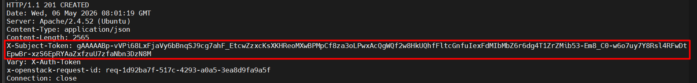

#### Phần 2: Body JSON (chứa thông tin token, user, catalog, ...)

```json
{
  "token": {
    "methods": ["password"],
    "user": {
      "domain": { "id": "default", "name": "Default" },
      "id": "xxxxxxxxxxxxxxxxxxxxxxxxxxxxxxxx",
      "name": "admin"
    },
    "audit_ids": [...],
    "expires_at": "2026-05-07T07:00:00.000000Z",
    "issued_at": "2026-05-06T07:00:00.000000Z",
    "project": { "domain": {...}, "id": "...", "name": "admin" },
    "catalog": [ ... ]
  }
}
```

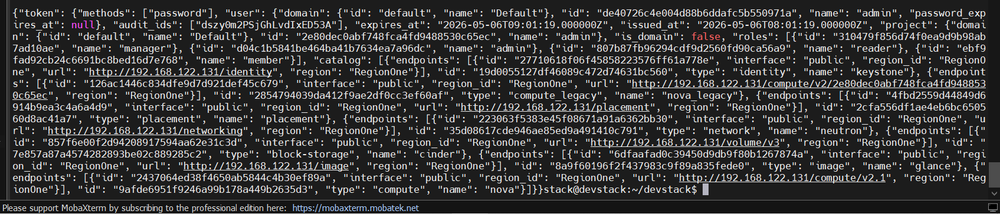

> **Quan trọng:** Token nằm trong HTTP Header `X-Subject-Token`, **không phải** trong body JSON. Bạn cần copy giá trị này để dùng cho các request sau.

### 3.4. Lưu Token vào biến môi trường (tiện dụng hơn)

```bash
# Chạy lệnh này để xin Keystone cấp một Fernet Token mới hoàn toàn
# Dùng -D- để dump headers ra stdout, rồi grep lấy token
export OS_TOKEN=$(curl -s -i \
  -X POST http://192.168.122.131/identity/v3/auth/tokens \
  -H "Content-Type: application/json" \
  -d '{
    "auth": {
      "identity": {
        "methods": ["password"],
        "password": {
          "user": {
            "name": "admin",
            "domain": { "name": "Default" },
            "password": "Tien123"
          }
        }
      },
      "scope": {
        "project": {
          "name": "admin",
          "domain": { "name": "Default" }
        }
      }
    }
  }' | grep -i "x-subject-token" | awk '{print $2}' | tr -d '\r')

echo "Token: $OS_TOKEN"
```

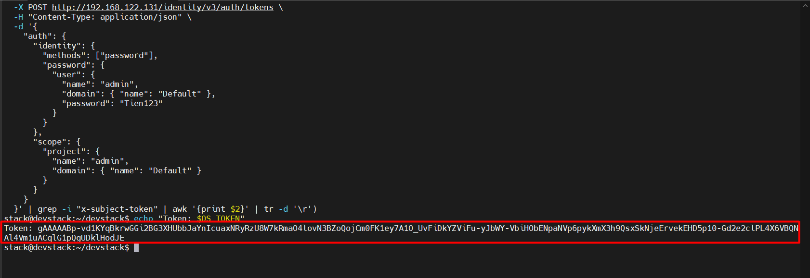

## 4. Gọi Các API Keystone Bằng cURL

Sau khi có token, bạn truyền nó vào header `X-Auth-Token` để gọi các API khác.

### 4.1. Lấy thông tin Domain và Project ID

**Liệt kê tất cả Domain:**

```bash
curl -s \
  -H "X-Auth-Token: $OS_TOKEN" \
  http://192.168.122.131/identity/v3/domains \
  | python3 -m json.tool
```

Kết quả:

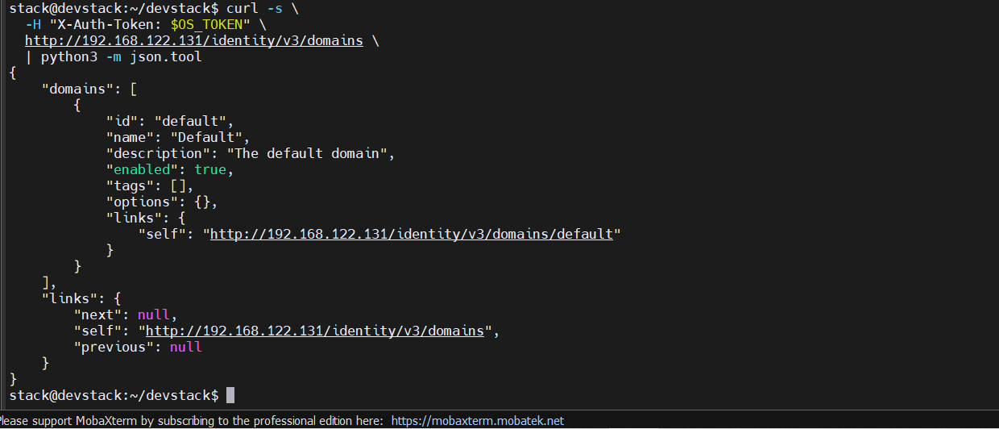

**Liệt kê tất cả Project:**

```bash
curl -s \
  -H "X-Auth-Token: $OS_TOKEN" \
  http://192.168.122.131/identity/v3/projects \
  | python3 -m json.tool
```

Kết quả:

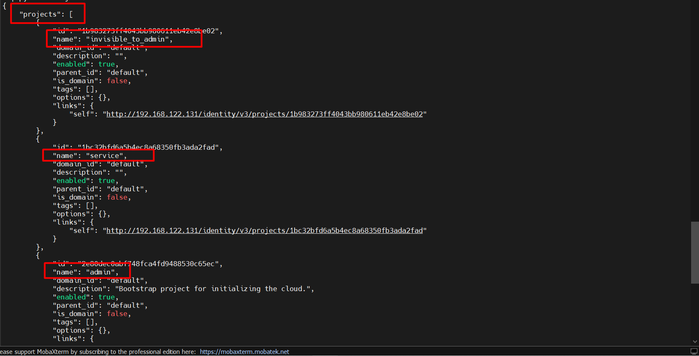
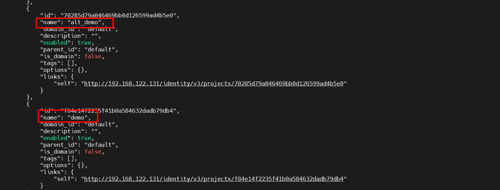

**Lọc Project theo tên:**

```bash
curl -s \
  -H "X-Auth-Token: $OS_TOKEN" \
  "http://192.168.122.131/identity/v3/projects?name=demo" \
  | python3 -m json.tool                # Đổi demo thành tên Project bạn cần tìm
```

Kết quả:

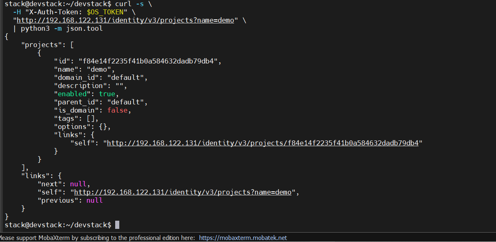

### 4.2. Liệt kê User

```bash
curl -s \
  -H "X-Auth-Token: $OS_TOKEN" \
  http://192.168.122.131/identity/v3/users \
  | python3 -m json.tool
```

Kết quả:

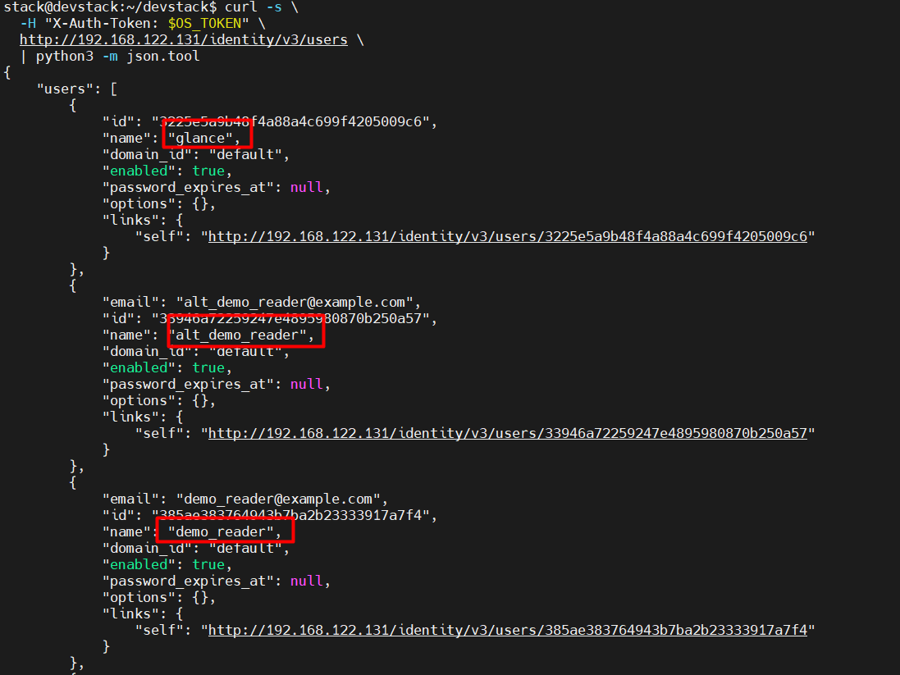

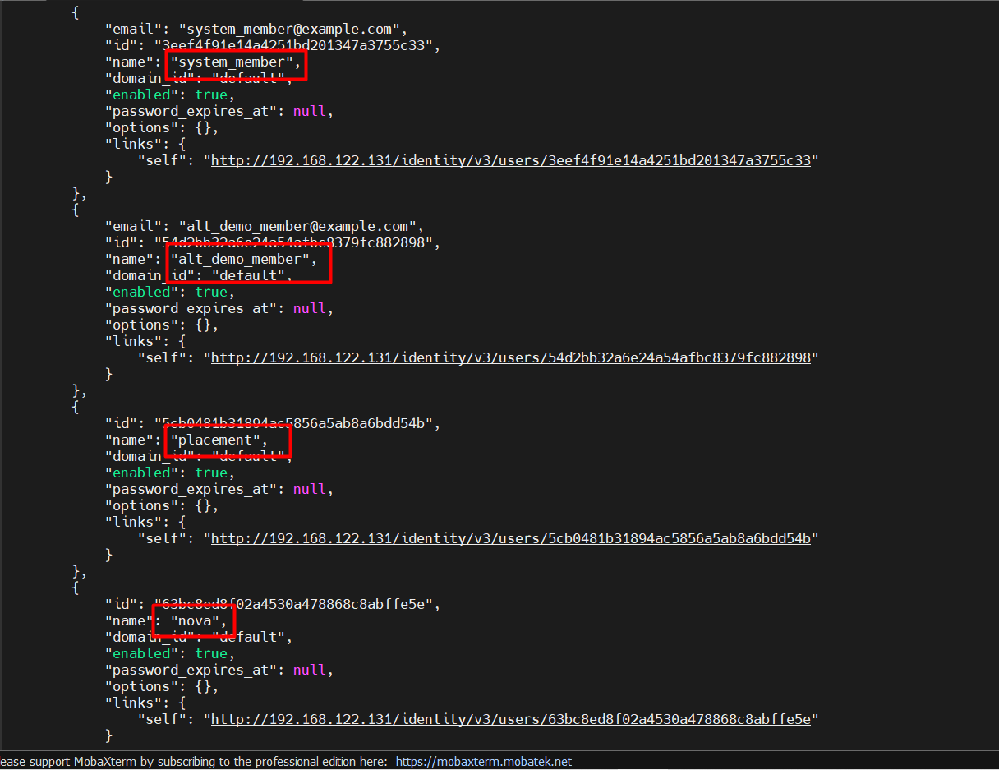

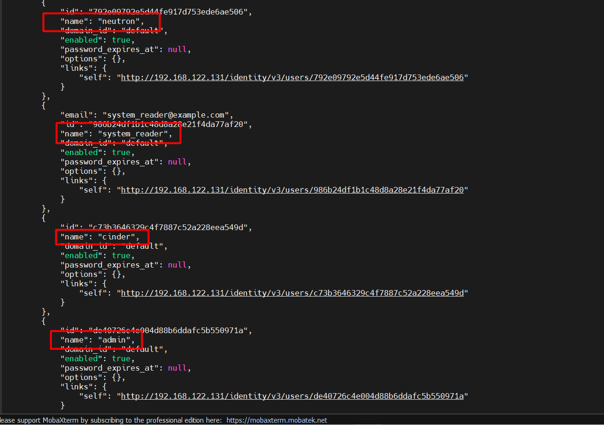

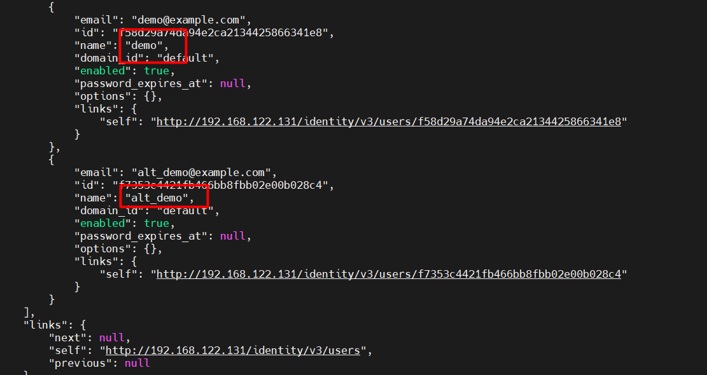

Nhận xét:

- Ta có thể mỗi project service cũng là 1 user
- Mỗi user cũng không nhất thiết phải có domain 'Default'

### 4.3. Xem thông tin User cụ thể

```bash
# Thay <user_id> bằng ID thực tế lấy từ lệnh liệt kê ở trên
curl -s \
  -H "X-Auth-Token: $OS_TOKEN" \
  http://192.168.122.131/identity/v3/users/<user_id> \
  | python3 -m json.tool
```

Kết quả:

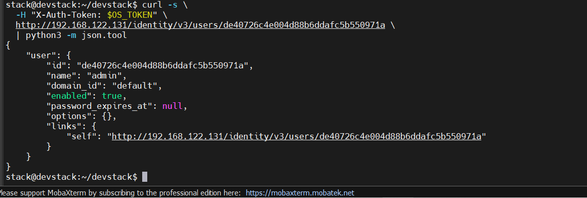

### 4.4. Liệt kê Role

```bash
curl -s \
  -H "X-Auth-Token: $OS_TOKEN" \
  http://192.168.122.131/identity/v3/roles \
  | python3 -m json.tool
```

Kết quả:

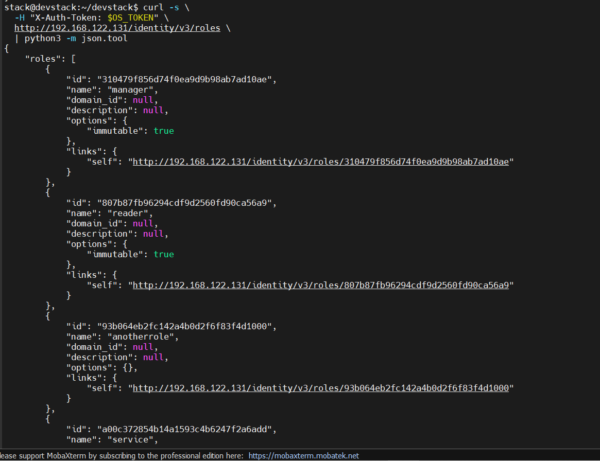

### 4.5. Tạo Project mới (POST)

```bash
curl -s \
  -X POST \
  -H "X-Auth-Token: $OS_TOKEN" \
  -H "Content-Type: application/json" \
  http://192.168.122.131/identity/v3/projects \
  -d '{
    "project": {
      "name": "tien9a",
      "description": "Project được tạo bằng API",
      "domain_id": "default",
      "enabled": true
    }
  }' | python3 -m json.tool
```

Kết quả:

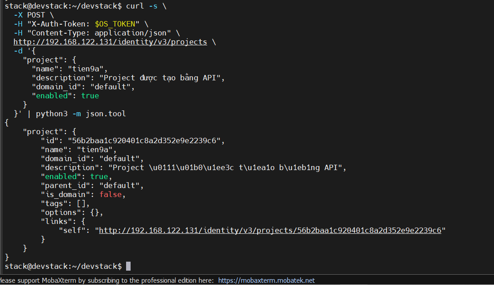

### 4.6. Kiểm tra Token (validate token)

```bash
# Kiểm tra thông tin của token hiện tại
curl -s \
  -H "X-Auth-Token: $OS_TOKEN" \
  -H "X-Subject-Token: $OS_TOKEN" \
  http://192.168.122.131/identity/v3/auth/tokens \
  | python3 -m json.tool
```

Kết quả:

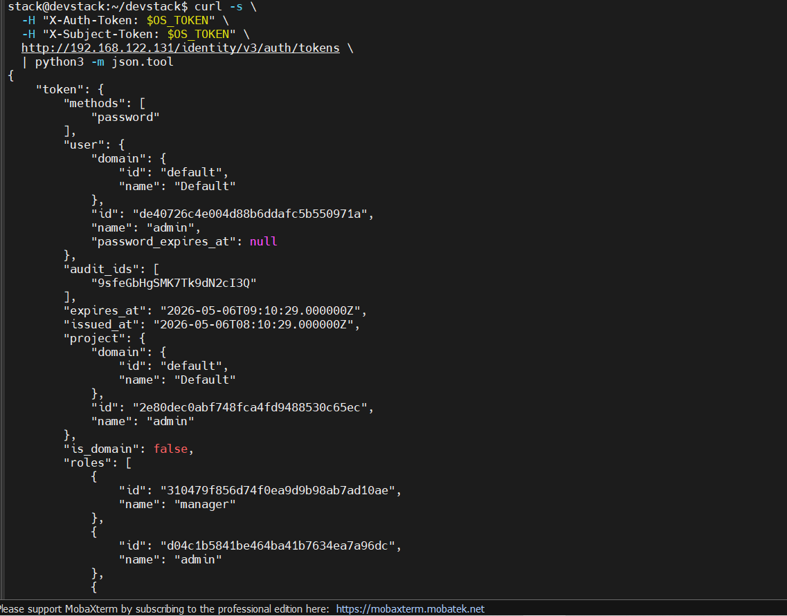

> **Giải thích:** Header `X-Auth-Token` là token của người đang thực hiện yêu cầu (caller), còn `X-Subject-Token` là token cần được kiểm tra.

### 4.7. Thu hồi Token (DELETE)

```bash
curl -s \
  -X DELETE \
  -H "X-Auth-Token: $OS_TOKEN" \
  -H "X-Subject-Token: $OS_TOKEN" \
  http://192.168.122.131/identity/v3/auth/tokens
# Nếu thành công, server trả về HTTP 204 No Content (không có body)
```

Chạy lệnh curl sau để xin Keystone cấp một Fernet Token mới hoàn toàn:

```bash
curl -s \
  -X POST \
  -H "Content-Type: application/json" \
  http://192.168.122.131/identity/v3/auth/tokens \
  -d '{
    "auth": {
      "identity": {
        "methods": ["password"],
        "password": {
          "user": {
            "name": "admin",
            "domain": { "name": "Default" },
            "password": "Tien123"
          }
        }
      },
      "scope": {
        "project": {
          "name": "admin",
          "domain": { "name": "Default" }
        }
      }
    }
  }'
```

## 5. OpenStack SDK Là Gì?

**OpenStack SDK** (hay `openstacksdk`) là thư viện Python chính thức do cộng đồng OpenStack phát triển, cho phép lập trình viên tương tác với các dịch vụ OpenStack (Keystone, Nova, Neutron, Cinder, ...) thông qua code Python thay vì phải gọi HTTP API thủ công.

### 5.1. Ưu điểm so với cURL

| Tiêu chí        | cURL                         | OpenStack SDK                              |
|-----------------|------------------------------|--------------------------------------------|
| **Độ phức tạp** | Cần tự xây dựng từng request | SDK tự xử lý auth, retry, pagination       |
| **Đọc kết quả** | Parse JSON thủ công          | Trả về Python object                       |
| **Tái sử dụng** | Khó tái sử dụng code         | Dễ dàng đóng gói thành hàm/class           |
| **Xử lý lỗi**   | Tự kiểm tra HTTP status code | SDK tự raise Exception có ý nghĩa          |
| **Phù hợp cho** | Debug nhanh, test nhanh      | Xây dựng ứng dụng, automation              |

### 5.2. Cài đặt OpenStack SDK

```bash
# Cài đặt bằng pip
pip install openstacksdk

# Kiểm tra phiên bản đã cài
python3 -c "import openstack; print(openstack.__version__)"

# Cài đặt trong môi trường ảo (khuyến nghị)
python3 -m venv ~/venv-openstack
source ~/venv-openstack/bin/activate
pip install openstacksdk
```

**Chú ý**: 

- `openstack-sdk` sẽ sử dụng thông tin từ file `clouds.yaml`.

- Ngoài ra, Khi dựng OpenStack bằng DevStack thì nó đã cài sẵn SDK rồi, ta chỉ cần quan tâm thư mục lưu lưu của nó tại `/usr/lib/python3/dist-packages`

### 5.3. Cấu hình xác thực với `clouds.yaml`

SDK đọc thông tin xác thực từ file **`clouds.yaml`**. Tạo file này để tránh hardcode thông tin nhạy cảm trong code.

**Vị trí file (theo thứ tự SDK tìm kiếm):**

1. `./clouds.yaml` (thư mục hiện tại)
2. `~/.config/openstack/clouds.yaml`
3. `/etc/openstack/clouds.yaml`

**Nội dung file `clouds.yaml`:**

Tạo file `clouds.yaml` với nội dung sau:

```bash
nano clouds.yaml
```

Dán nội dung:

```yaml
clouds:
  mycloud:     # Tên profile tùy ý. Ở đây mình đặt mycloud
    auth:
      auth_url: "http://192.168.122.131/identity/v3"
      username: "admin"
      password: "Tien123"
      project_name: "admin"
      user_domain_name: "Default"
      project_domain_name: "Default"
    region_name: "RegionOne"
    interface: "public"
    identity_api_version: 3
```

**Chú ý**: Tuy nhiên, `clouds.yaml` là tiêu chuẩn hiện đại (hiện được cộng đồng OpenStack khuyên dùng) để thay thế cho cách cũ (nạp biến môi trường `openrc`).

Sau khi lưu file này, bạn chỉ cần gõ lệnh CLI với cờ `--os-cloud` là xong:

```Bash
openstack --os-cloud mycloud user list
```

**Chú ý 2**:

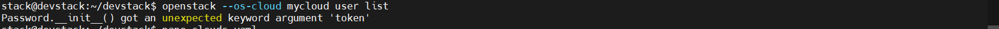

- Ta bị lỗi cảnh báo là do bạn đã chạy lệnh `export OS_TOKEN=...` ở các bước trước đó. Khi bạn chạy lệnh openstack --os-cloud mycloud, trình điều khiển (client) đọc file `clouds.yaml` thấy dùng mật khẩu, nhưng lại "nhìn" thấy biến môi trường `OS_TOKEN` đang tồn tại, dẫn đến xung đột.

- Cách fix: Dừng chạy biến môi trường `openrc` bằng lệnh `unset OS_TOKEN`.

```bash
# Xóa biến OS_TOKEN và các biến OS_ khác đang có trong phiên làm việc
unset OS_TOKEN
unset OS_AUTH_URL
unset OS_USERNAME
unset OS_PASSWORD
unset OS_PROJECT_NAME

# Sau đó chạy lại lệnh với cloud
openstack --os-cloud mycloud user list
```

Kết quả:

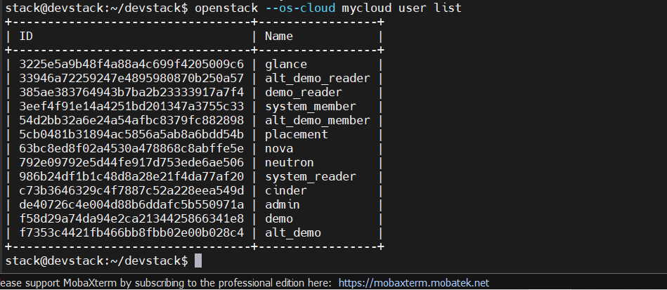

## 6. Viết Script Python Với OpenStack SDK

Vì mình đang dùng user `stack`, bạn nên mình một thư mục riêng để chứa các file script thực hành cho gọn gàng:

```bash
mkdir -p ~/python_api_test
cd ~/python_api_test
```

Nếu ta đứng ở thư mục `/python_api_test` chạy script thì nó sẽ không thể tìm thấy file `cloud.yaml` được, cho nên ta cần chuyển file `cloud.yaml` vào thư mục cấu hình mặc định của openstack:

```bash
cd ..
mkdir -p ~/.config/openstack
mv clouds.yaml ~/.config/openstack/
```

### 6.1. Script cơ bản: Kết nối và lấy Token

Tạo file `get_token.py`:

```bash
nano get_token.py
```

Viết file script vào:

```python
#!/usr/bin/env python3
"""
Script: get_token.py
Mô tả: Kết nối tới Keystone và in ra thông tin token hiện tại
"""

import openstack

# Kết nối sử dụng profile "mycloud" trong clouds.yaml
conn = openstack.connect(cloud='mycloud')

# Lấy token hiện tại của session
token = conn.auth_token
print(f"[+] Kết nối thành công!")
print(f"[+] Token: {token[:30]}...{token[-10:]}")  # In rút gọn cho an toàn

# Lấy thông tin user hiện tại
current_user = conn.current_user_id
print(f"[+] User ID: {current_user}")

# Lấy thông tin project hiện tại
current_project = conn.current_project_id
print(f"[+] Project ID: {current_project}")
```

**Chạy script:**

```bash
python3 get_token.py
```

**Kết quả**:

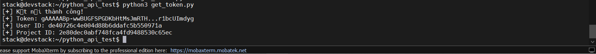

### 6.2. Script: Liệt kê Project

Tạo file `list_projects.py`:

```bash
nano list_projects.py
```

Viết file script vào:

```python
#!/usr/bin/env python3
"""
Script: list_projects.py
Mô tả: Liệt kê tất cả project trong OpenStack
"""

import openstack

conn = openstack.connect(cloud='mycloud')

print("=" * 60)
print(f"{'ID':<35} {'Name':<20} {'Enabled'}")
print("=" * 60)

for project in conn.identity.projects():
    status = "✓" if project.is_enabled else "✗"
    print(f"{project.id:<35} {project.name:<20} {status}")

print("=" * 60)
print(f"Tổng số: {len(list(conn.identity.projects()))} project(s)")
```

Chạy scripts:

```bash
python3 list_projects.py
```

**Kết quả**:

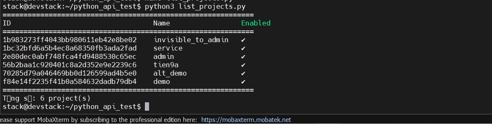

### 6.3. Script: Liệt kê User

Tạo file `list_users.py`:

```bash
nano list_users.py
```

Viết file script vào:

```python
#!/usr/bin/env python3
"""
Script: list_users.py
Mô tả: Liệt kê tất cả user trong OpenStack
"""

import openstack

conn = openstack.connect(cloud='mycloud')

print("=" * 70)
print(f"{'ID':<35} {'Name':<20} {'Email':<15}")
print("=" * 70)

for user in conn.identity.users():
    email = user.email or "N/A"
    print(f"{user.id:<35} {user.name:<20} {email:<15}")
```

Chạy file scripts:

```bash
python3 list_users.py
```

Kết quả:

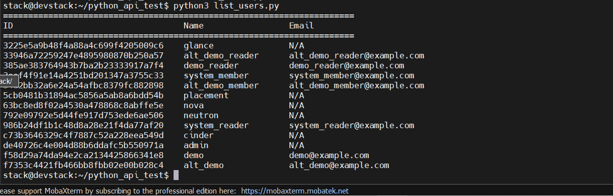

### 6.4. Script: Xác thực nâng cao và gọi API đầy đủ

Tạo file `keystone_demo.py`:

```bash
nano keystone_demo.py
```

Viết file script vào:

```python
#!/usr/bin/env python3
"""
Script: keystone_demo.py
Mô tả: Demo đầy đủ - Xác thực, liệt kê tài nguyên, tạo project mới
"""

import openstack
import json

# ---- 1. KẾT NỐI ----
print("\n[1] Đang kết nối tới Keystone...")
conn = openstack.connect(cloud='mycloud')
print(f"    Auth URL  : {conn.auth['auth_url']}")
print(f"    User      : {conn.auth['username']}")
print(f"    Token     : {conn.auth_token[:20]}...")


# ---- 2. LIỆT KÊ DOMAIN ----
print("\n[2] Danh sách Domain:")
for domain in conn.identity.domains():
    print(f"    - [{domain.id}] {domain.name} (enabled={domain.is_enabled})")


# ---- 3. LIỆT KÊ PROJECT ----
print("\n[3] Danh sách Project:")
projects = list(conn.identity.projects())
for p in projects:
    print(f"    - [{p.id}] {p.name}")


# ---- 4. LIỆT KÊ USER ----
print("\n[4] Danh sách User:")
for user in conn.identity.users():
    print(f"    - [{user.id}] {user.name}")


# ---- 5. TẠO PROJECT MỚI ----
print("\n[5] Tạo project mới 'demo-sdk-project'...")
try:
    new_project = conn.identity.create_project(
        name='demo-sdk-project',
        description='Project được tạo bằng OpenStack SDK',
        domain_id='default',
        is_enabled=True
    )
    print(f"    ✓ Tạo thành công! ID: {new_project.id}")
except openstack.exceptions.ConflictException:
    print("    ✗ Project đã tồn tại, bỏ qua bước này.")


# ---- 6. XÓA PROJECT VỪA TẠO ----
print("\n[6] Dọn dẹp - Xóa project vừa tạo...")
try:
    project_to_delete = conn.identity.find_project('demo-sdk-project')
    if project_to_delete:
        conn.identity.delete_project(project_to_delete.id)
        print(f"    ✓ Đã xóa project: demo-sdk-project")
except Exception as e:
    print(f"    ✗ Lỗi khi xóa: {e}")

print("\n[DONE] Hoàn thành demo!")
```

Chạy file scripts:

```bash
python3 keystone_demo.py
```

Kết quả:

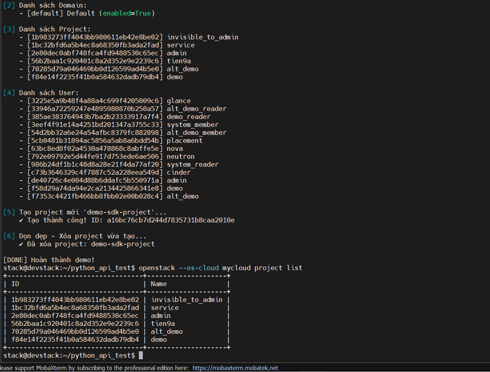

### 6.5. Script: Xác thực không dùng `clouds.yaml` (Inline Auth)

Trong trường hợp không thể tạo file `clouds.yaml` (ví dụ: trong container, CI/CD pipeline):

Tạo file script:

```bash
nano inline_auth.py
```

Viết file script vào:

```python
import openstack

# Ket noi bang cach truyen truc tiep tham so (Inline)
try:
    conn = openstack.connect(
        auth_url='http://192.168.122.131/identity/v3',
        project_name='admin',
        username='admin',
        password='Tien123',
        user_domain_name='Default',
        project_domain_name='Default',
    )
    
    print("Ket noi thanh cong!")
    print("Danh sach Project:")
    for project in conn.identity.projects():
        print(f" - {project.name}")

except Exception as e:
    print(f"Loi ket noi: {e}")
```

Chạy file script:

```bash
python3 inline_auth.py
```

Kết quả:

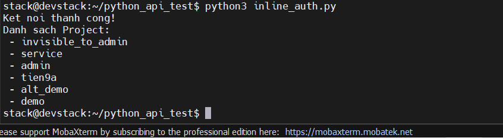

## 7. Xử Lý Lỗi Thường Gặp

### 7.1. Lỗi cURL

| HTTP Status               | Mô tả                                | Nguyên nhân phổ biến                         |
|---------------------------|--------------------------------------|----------------------------------------------|
| `401 Unauthorized`        | Token không hợp lệ hoặc hết hạn      | Sai mật khẩu, token hết hạn (mặc định 1 giờ) |
| `403 Forbidden`           | Không có quyền thực hiện hành động   | Role không đủ quyền theo Policy              |
| `404 Not Found`           | Không tìm thấy resource              | ID sai, resource chưa được tạo               |
| `409 Conflict`            | Resource đã tồn tại                  | Trùng tên project/user                       |
| `503 Service Unavailable` | Keystone không khởi động được        | Kiểm tra `systemctl status apache2`          |

### 7.2. Lỗi Python SDK

```python
import openstack

try:
    conn = openstack.connect(cloud='mycloud')
    projects = list(conn.identity.projects())
except openstack.exceptions.HttpException as e:
    print(f"HTTP Error: {e.status_code} - {e.message}")
except openstack.exceptions.SDKException as e:
    print(f"SDK Error: {e}")
except Exception as e:
    print(f"Unexpected Error: {e}")
```

**Các exception phổ biến của SDK:**

| Exception                                       | Ý nghĩa                        |
|-------------------------------------------------|--------------------------------|
| `openstack.exceptions.HttpException`            | Lỗi HTTP từ server (4xx, 5xx)  |
| `openstack.exceptions.NotFoundException`        | Resource không tồn tại (404)   |
| `openstack.exceptions.ConflictException`        | Resource đã tồn tại (409)      |
| `openstack.exceptions.ForbiddenException`       | Không có quyền (403)           |
| `keystoneauth1.exceptions.auth.InvalidResponse` | Response xác thực không hợp lệ |

## 8. Tóm Tắt Luồng Hoạt Động

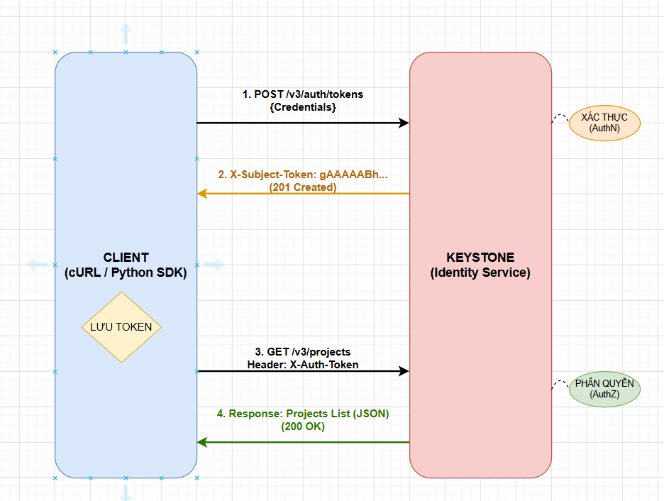

## 9. Tài Liệu Tham Khảo

- [Keystone API Reference - OpenStack Docs](https://docs.openstack.org/api-ref/identity/v3/)
- [OpenStack SDK - Python Documentation](https://docs.openstack.org/openstacksdk/latest/)
- [openstacksdk - GitHub](https://github.com/openstack/openstacksdk)
- [Authenticating with OpenStack API](https://docs.openstack.org/keystone/latest/api_curl_examples.html)
