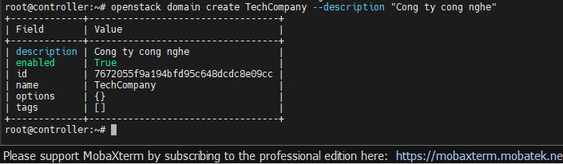
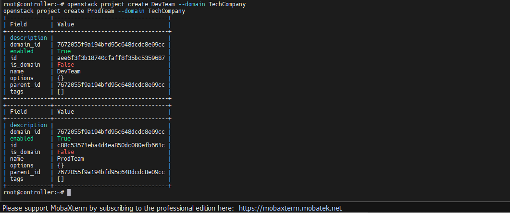
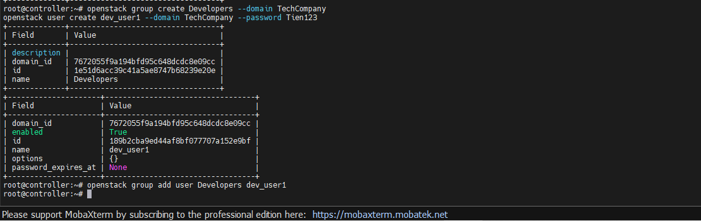
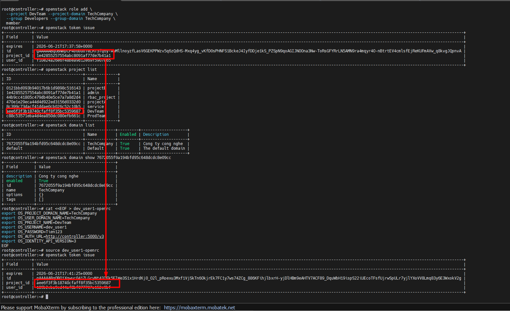
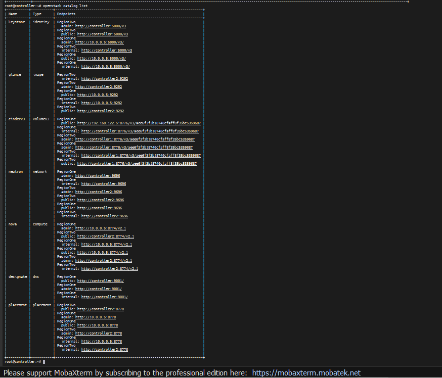
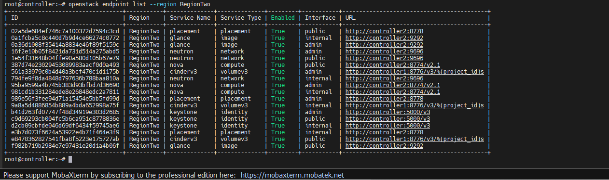
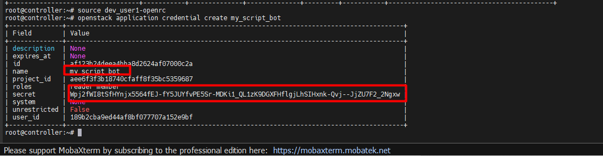
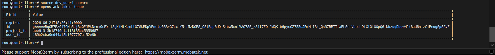
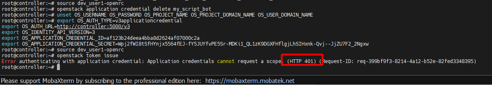

# CÁC BÀI LAB CƠ BẢN VỀ KEYSTONE

## I. MÔI TRƯỜNG

Môi trường Lab là ta sẽ thực hiện trên cụm OpenStack mà ta đã dựng sau [đây](https://github.com/tiend9/Tim-hieu-OPNsense/blob/main/07.Learn_About_OpenStack_Cinder/labs/01.Install_Cinder_with_LVM.md), nhưng lưu ý cụm lab OpenStack này đã được lab thành MultiRegion theo bài lab [này](https://github.com/tiend9/Tim-hieu-OPNsense/blob/main/15.Deployment_OPS/03.Deloy_OPS_Multi_Region/01.Deploy_OPS_MultiRegion.md)

## II. THỰC HÀNH

### 1. Xây dựng cấu trúc phân cấp (Domain -> Project -> Group -> User)

**Mục đích**:Mặc định OpenStack chỉ dùng domain `Default`. Ở lab này ta tạo một cấu trúc công ty hoàn chỉnh.

`Bước 1`: Tạo Domain mới: (Ví dụ: `TechCompany`)

```bash
openstack domain create TechCompany --description "Cong ty cong nghe"
```



`Bước 2`: Tạo các Project thuộc Domain đó:

```bash
openstack project create DevTeam --domain TechCompany
openstack project create ProdTeam --domain TechCompany
```



`Bước 3`: Tạo Group và User + add user vào Group:

```bash
openstack group create Developers --domain TechCompany
openstack user create dev_user1 --domain TechCompany --password Tien123
# Thêm user vào group
openstack group add user Developers dev_user1
```



`Bước 4`: Gán Role cho cả Group (thay vì gán lẻ tẻ từng User):

```bash
openstack role add \
  --project DevTeam --project-domain TechCompany \
  --group Developers --group-domain TechCompany \
  member
```

`Bước 5`: Verify - Tạo file `openrc` cho `dev_user1` (nhớ khai báo OS_USER_DOMAIN_NAME=TechCompany và OS_PROJECT_DOMAIN_NAME=TechCompany) và test lấy token:

```bash
cat <<EOF > dev_user1-openrc
export OS_PROJECT_DOMAIN_NAME=TechCompany
export OS_USER_DOMAIN_NAME=TechCompany
export OS_PROJECT_NAME=DevTeam
export OS_USERNAME=dev_user1
export OS_PASSWORD=Tien123
export OS_AUTH_URL=http://controller:5000/v3
export OS_IDENTITY_API_VERSION=3
EOF

source dev_user1-openrc

openstack token issue
```



### 2. Khám phá Service Catalog & Endpoints

**Mục đích**: Kiểm tra xem Keystone đang "chỉ đường" cho các dịch vụ như thế nào.

`Bước 1`: Xem danh mục các dịch vụ:

```bash
openstack catalog list

# Ta sẽ thấy Glance, Nova... có URL trỏ về RegionOne và RegionTwo riêng biệt).
```



`Bước 2`: Lọc endpoint theo Region:

```bash
openstack endpoint list --region RegionTwo
```



### 3. Sử dụng Application Credentials (Bảo mật cho Script/Bot)

**Mục đích**: Khi viết code/script gọi API OpenStack, không ai nhúng mật khẩu thật của User vào code. Thay vào đó, ta dùng **App Cred**.

`Bước 1`: Tạo app Credential (Bằng tài khoản user thường - Ví dụ sử dụng user `dev_user1` ở trên):

```bash
source dev_user1-openrc

openstack application credential create my_script_bot
```



`Bước 2`:  Lấy thông tin **ID** và **Secret** hệ thống nhả ra.

Sau khi gõ lệnh trên, màn hình sẽ in ra một cái bảng. Ta chỉ cần quan tâm 2 dòng cực kỳ quan trọng (copy lưu ra **notepad** nhé, vì cái Secret nó chỉ hiện ra đúng 1 lần duy nhất này thôi):

`Bước 3`: Sử dụng app credential để đăng nhập: (Lưu ý: Phải export thêm biến)

```bash
# Xoá các biến cũ đi để test cho chuẩn
unset OS_USERNAME OS_PASSWORD OS_PROJECT_NAME OS_PROJECT_DOMAIN_NAME OS_USER_DOMAIN_NAME

# rồi gán biến app credential
export OS_AUTH_TYPE=v3applicationcredential
export OS_AUTH_URL=http://controller:5000/v3
export OS_IDENTITY_API_VERSION=3
export OS_APPLICATION_CREDENTIAL_ID=<id_vừa_tạo>
export OS_APPLICATION_CREDENTIAL_SECRET=<secret_vừa_tạo>

# Test thử xem có ra token:
openstack token issue
```



>**Note**: Nếu lỡ ngày cái script của ta bị hacker chôm mất file cấu hình, ta chỉ cần dùng tài khoản `dev_user1` đăng nhập vào rồi gõ lệnh `openstack application credential delete my_script_bot`. Lập tức cái key kia bị vô hiệu hóa, hacker không làm gì được. Trong khi Password thật của `dev_user1` thì vẫn an toàn tuyệt đối!

`Bước 4`: Test giả sử hacker đã đánh cắp được file `my_script_bot` ta vào vô hiệu hoá key và dùng mật khẩu user `dev_user1` để đăng nhập thử xem có được không:

```bash
# Đăng nhập lại bằng mật khẩu thật (vô hiệu hóa phiên của hacker)

# Xoá biến cũ
unset OS_AUTH_TYPE OS_APPLICATION_CREDENTIAL_ID OS_APPLICATION_CREDENTIAL_SECRET

# Gán biến mới user thật
cat <<EOF > dev_user1-openrc
export OS_PROJECT_DOMAIN_NAME=TechCompany
export OS_USER_DOMAIN_NAME=TechCompany
export OS_PROJECT_NAME=DevTeam
export OS_USERNAME=dev_user1
export OS_PASSWORD=Tien123
export OS_AUTH_URL=http://controller:5000/v3
export OS_IDENTITY_API_VERSION=3
EOF
source dev_user1-openrc

# Vô hiệu hoá key
openstack application credential delete my_script_bot

# Giờ giả vờ đóng vai hacker, nạp lại cái App Credential cũ xem còn dùng được không:
unset OS_USERNAME OS_PASSWORD OS_PROJECT_NAME OS_PROJECT_DOMAIN_NAME OS_USER_DOMAIN_NAME

export OS_AUTH_TYPE=v3applicationcredential
export OS_AUTH_URL=http://controller:5000/v3
export OS_IDENTITY_API_VERSION=3
export OS_APPLICATION_CREDENTIAL_ID="<id_cũ>"
export OS_APPLICATION_CREDENTIAL_SECRET="<secret_cũ>"

source dev_user1-openrc

# Thử lấy token xem còn được không:
openstack token issue
```



=> hacker sẽ nhận ngay lỗi `401 Unauthorized` do key đã bị xóa

### 4. Những lưu ý quan trọng về KeyStone hoặc những câu hỏi dễ gây nhầm lẫn khi nói về KeyStone

#### 4.1 Cứ mỗi project hoặc Domain sinh ra 1 Token ?

**Câu trả lời**:  *Token được sinh ra dựa trên "Phạm vi" (Scope) mà ta yêu cầu lúc đăng nhập.*

**Giải thích**:

Tuỳ yêu cầu truy cập vào đâu, Keystone sinh Token cho chỗ đó. Cụ thể trong OpenStack có 4 loại Token dựa theo **Scope**:

**1. Project-scoped Token (Phổ biến nhất - sinh ra cho 1 Project)**:

- Khi trong file `openrc` ta khai báo `OS_PROJECT_NAME=DevTeam`, ta đang nói với Keystone: *"Tôi là dev_user1, tôi muốn vào làm việc trong phòng DevTeam"*.
- Keystone kiểm tra xong sẽ cấp cho ta 1 cái Token. Token này chỉ có giá trị bên trong project DevTeam.
Nếu ta muốn sang project ProdTeam tạo máy ảo, ta phải khai báo lại `OS_PROJECT_NAME=ProdTeam` để Keystone sinh ra một cái Token hoàn toàn mới.

**2. Domain-scoped Token (Sinh ra cho 1 Domain)**:

- Dùng cho các Domain Admin (Giám đốc chi nhánh). Thay vì khai báo Project, họ khai báo `OS_DOMAIN_NAME=TechCompany`.

- Token sinh ra lúc này cho phép họ tạo/xóa Project, tạo/xóa User bên trong cái Domain TechCompany đó, chứ không dùng để tạo máy ảo (vì máy ảo phải nằm trong Project).

**3. System-scoped Token (Sinh ra cho toàn Hệ thống)**:

- Cái này ta đã gặp ở bài Lab trước (`OS_SYSTEM_SCOPE=all`). Dành cho System Admin (Người quản trị trạm OpenStack).

- Token này cho phép can thiệp sâu vào cấu hình hạ tầng: Quản lý Service, Endpoint, xem danh sách Hypervisor...

**4. Unscoped Token (Token vô danh)**:

Nếu ta chỉ cung cấp mỗi Username và Password mà KHÔNG khai báo Project hay Domain nào cả.
Keystone vẫn cấp cho ta 1 Token. Nhưng Token này giống như cái thẻ "Khách tham quan". Nó chỉ chứng minh "Anh này đã gõ đúng mật khẩu", nhưng KHÔNG có quyền làm bất cứ thứ gì (tạo máy ảo, tạo user đều bị cấm). Token này thường chỉ dùng làm bước đệm để truy vấn xem "Tôi đang được phép truy cập vào những Project nào?" rồi sau đó mới xin cấp lại Token chính thức.

#### 4.2 Thế các user trong 2 project khác nhau thuộc cùng 1 domain share nhau được cái gì và không share được gì?(Hoặc khác Domain)

**Trả lời**:Về mặt Tài nguyên (Resources), mặc định chúng `KHÔNG CHIA SẺ BẤT CỨ THỨ GÌ` cho nhau cả! Tuy nhiên, OpenStack cho phép chia sẻ có chủ đích nếu được người dùng (hoặc `admin`) cấu hình. Cụ thể, họ có thể share cho nhau những thứ sau:

- **Image (Glance)**: Cần được gắn `flag:shared` or set publicize `public`.
- **Mạng (Neutron Network)**: được thiết lập cờ `--share`. (Ví dụ `DevTeam` và `ProdTeam` đều có thể cắm máy ảo vào mạng đó và ping thông nhau để làm việc.)
- **Quota**: **Admin** có thể mua một "gói" tài nguyên cho toàn bộ TechCompany (ví dụ: `100 CPU`, `200GB RAM`), sau đó chia nhỏ ra: `DevTeam` xài `40 CPU`, ProdTeam xài ~60 CPU~.
- **Chuyển giao ổ cứng (Cinder Volume Transfer)**: OpenStack có cơ chế **Transfer**. `DevTeam` có thể "gói" ổ cứng lại, tạo 1 cái **mã Transfer Key** rồi gửi mã đó cho `ProdTeam` để sử dụng volume.

Ngoài ra, những thứ không share được đó là:

- **Máy ảo (Instances)**: Thuộc sở hữu riêng.
- **Keypairs (Khóa SSH)**: Mỗi project quản lý riêng.
- **Security Groups (Tường lửa)**: Phải tạo rule riêng cho từng Project.
