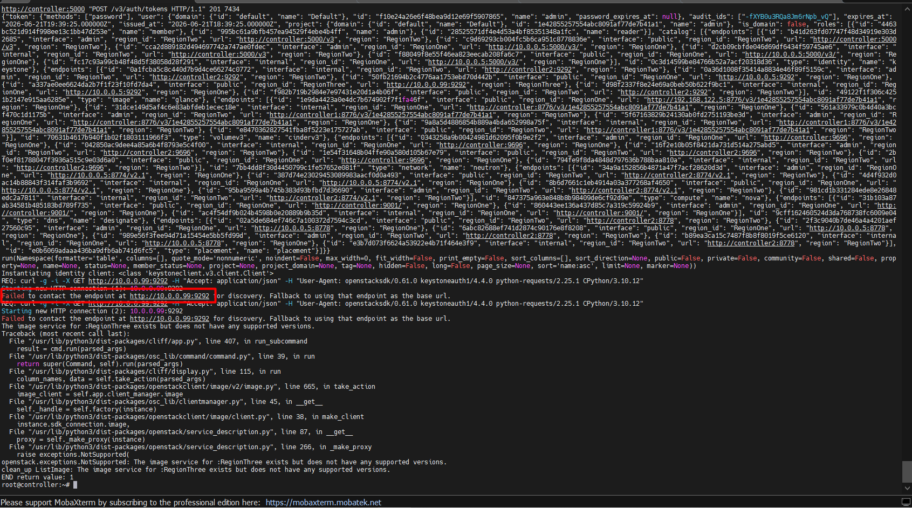
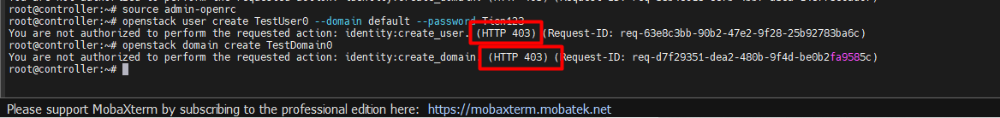
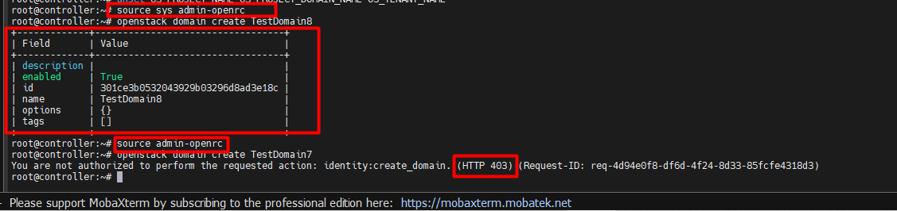
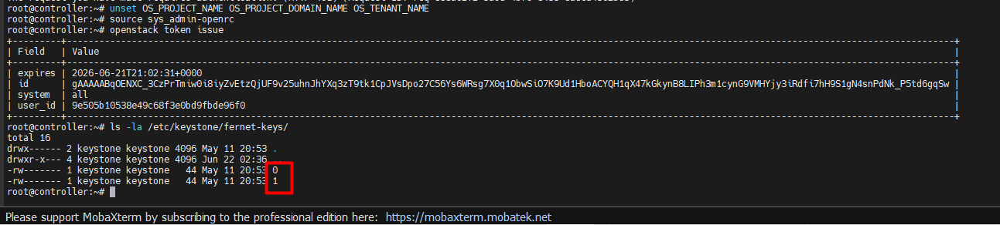
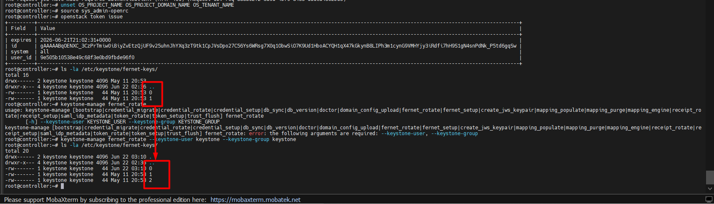
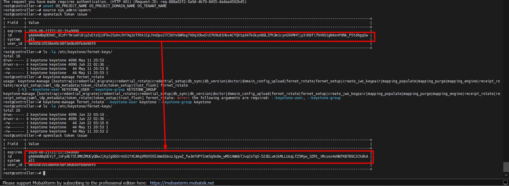

# CÁC BÀI LAB NÂNG CAO VỀ KEYSTONE

## I. MÔI TRƯỜNG

Môi trường Lab là ta sẽ thực hiện trên cụm OpenStack mà ta đã dựng sau [đây](https://github.com/tiend9/Tim-hieu-OPNsense/blob/main/07.Learn_About_OpenStack_Cinder/labs/01.Install_Cinder_with_LVM.md), nhưng lưu ý cụm lab OpenStack này đã được lab thành MultiRegion theo bài lab [này](https://github.com/tiend9/Tim-hieu-OPNsense/blob/main/15.Deployment_OPS/03.Deloy_OPS_Multi_Region/01.Deploy_OPS_MultiRegion.md)

## II. THỰC HÀNH

### 1. Keystone trong môi trường Multi-Region

**Mục đích**: Chứng minh Keystone là trung tâm định tuyến (Router) cho toàn bộ cluster.

`Bước 1`: Tạo 1 Region ảo trỏ về KeyStone

```bash
source admin-openrc
openstack region create RegionThree
```

`Bước 2`: Tạo một Endpoint ảo trỏ vào Region3:

```bash
# Giả sử ta tạo endpoint cho dịch vụ image trỏ vào một IP ảo)
openstack endpoint create --region RegionThree image public http://10.0.0.99:9292
```

`Bước 3`: Chứng minh client behavior:(hành vi người dùng)

```bash
# Dùng lệnh CLI với cờ region để xem client bám vào endpoint nào:
openstack --os-region-name RegionThree image list --debug
```



>**Note**: Trong log debug bật lên, ta sẽ thấy Client gọi lên Keystone xin token, Keystone trả về catalog chứa IP `10.0.0.99`. Client cố gắng kết nối tới IP đó và báo lỗi Connection Refused -> Khẳng định Keystone điều hướng chuẩn.

### 2. Bật bảo mật Secure RBAC cho chính KeyStone (System-Scope vs Project-Scope)

**Mục đích**: Tương tự như Glance, Keystone cũng bị tình trạng "Admin Project" tự nhận mình là "Admin Hệ Thống" nếu không bật **Secure RBAC**. Ta sẽ khắc phục tình trạng này.

`Bước 1`: Bật **Secure RBAC** cho KeyStone trên **Controller 1**:

```bash
nano /etc/keystone/keystone.conf
# Thêm vào block [oslo_policy]
enforce_scope = True
enforce_new_defaults = True

# Vô hiệu hóa cái file policy.yaml cũ để tránh conflict policy
mv /etc/keystone/keystone.policy.yaml /etc/keystone/keystone.policy.yaml.bak

# Restart Keystone chạy ngầm qua Apache
systemctl restart apache2
```

`Bước 2`: Test sự khác biệt

- Dùng Project `Admin` (user `admin` ban đầu của project `admin`) cố gắng tạo một User mới hoặc Domain mới ➔ Bị báo lỗi `403`.

```bash
# Nạp lại tài khoản admin mặc định
source admin-openrc

# Thử tạo một User mới xem Keystone có cho không
openstack user create TestUser0 --domain default --password Tien123

# Thử tạo một Domain mới
openstack domain create TestDomain0
```



- Dùng `System Admin` (user `sys_admin` ta đã tạo ở lab Glance có scope `system=all`) ➔ `Thành công`.

```bash
# Tắt file RBAC policy đi để user admin trong project admin có thể tạo user và domain + Nhớ restart apache2

# Nếu chưa tạo user admin system thì ta chạy lệnh sau:
source admin-openrc

# Tạo user sys_admin
openstack user create sys_admin --password Tien123

# Cho sys_admin quyền cai quản toàn bộ hệ thống (System Scope)
openstack role add --user sys_admin --user-domain Default --system all admin

cat <<EOF > sys_admin-openrc
export OS_SYSTEM_SCOPE=all
export OS_USERNAME=sys_admin
export OS_USER_DOMAIN_NAME=Default
export OS_PASSWORD=Tien123
export OS_AUTH_URL=http://controller:5000/v3
export OS_IDENTITY_API_VERSION=3
EOF

# Nạp quyền System Admin
source sys_admin-openrc

# Chạy lại lệnh tạo Domain lúc nãy
openstack domain create TestDomain8
```



**Note**: Với 2 setting này `enforce_scope = True` và `enforce_new_defaults = True`, `keystonemiddleware` của Cinder cần service user có role `service` (không chỉ `admin` trên project `service`) mới validate token được. Không khi tạo volume sẽ bị lỗi `503`. Cách fix:

```bash
# Đang ở trong môi trường sys_admin
source sys_admin-openrc

# Tạo role 'service' nếu chưa có
openstack role create service

# Gán role 'service' cho tất cả service users
for user in cinder nova neutron glance placement designate; do
  openstack role add --user $user --user-domain Default \
    --project service --project-domain Default service
  echo "Done: $user"
done
```

Sau đó update `/etc/cinder/cinder.conf`:

```bash
# Thêm vào [keystone_authtoken]
crudini --set /etc/cinder/cinder.conf keystone_authtoken service_token_roles service
crudini --set /etc/cinder/cinder.conf keystone_authtoken service_token_roles_required true

systemctl restart apache2
```

### 3. Quản lý và Xoay vòng khóa Fernet (Fernet Token Management)

**Mục đích**: Keystone sinh token dựa trên công nghệ mã hóa Fernet. Key này nằm ở `/etc/keystone/fernet-keys/`. Nếu Key bị lộ, hacker có thể tự sinh token hợp lệ từ key lộ và qua mặt hệ thống. Vì thế ta cần tạo khóa Fernet mới và vô hiệu hóa khóa cũ để kiểm tra tính năng xoay vòng khóa.

`Bước 1`Quan sát thư mục Key hiện tại:

```bash
source sys_admin-openrc

ls -la /etc/keystone/fernet-keys/

# Ta sẽ thấy các file đánh số 0, 1, 2...

# Ta sẽ thấy chỉ có 2 file: 0 và 1 (vì cụm mới cài, chưa rotate lần nào)

# File số 1: Là Primary Key (Khóa chính đang dùng)

# File số 0: Là Staged Key (Khóa dự bị)
```



`Bước 2`: Thực hiện Rotate Key (Xoay vòng khóa): Theo best practice, hệ thống lớn phải cronjob lệnh này mỗi tuần 1 lần. (Sinh thử 1 token bằng khoá cũ )

```bash
openstack token issue

# Thực hiện rotate key
keystone-manage fernet_rotate --keystone-user keystone --keystone-group keystone
```

`Bước 3`: Quan sát lại thư mục Key sau khi Rotate:

Ta gõ lại lệnh list file:

```bash
ls -la /etc/keystone/fernet-keys/

# File số 0 lúc nãy đã bị đổi tên thành số lớn nhất (ví dụ 2) ➔ Lên chức thành Primary Key mới.

# Một file số 0 hoàn toàn mới được sinh ra ➔ Chờ cho lần rotate tiếp theo.

# File Primary cũ (số 1) bị giáng chức xuống thành Secondary Key. (Keystone mặc định chỉ giữ lại tối đa 3 file khóa, file cũ nhất sẽ tự động bị xóa đi).
```



`Bước 4`: Check lại Token:

```bash
openstack token issue

# Ta sẽ thấy các thông tin Token mới được sinh ra với ID khác với lần trước
```


