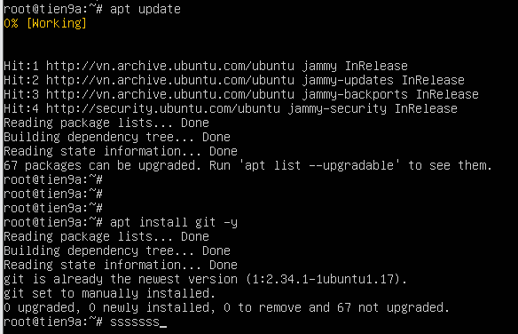
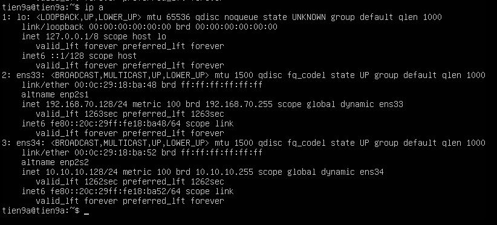
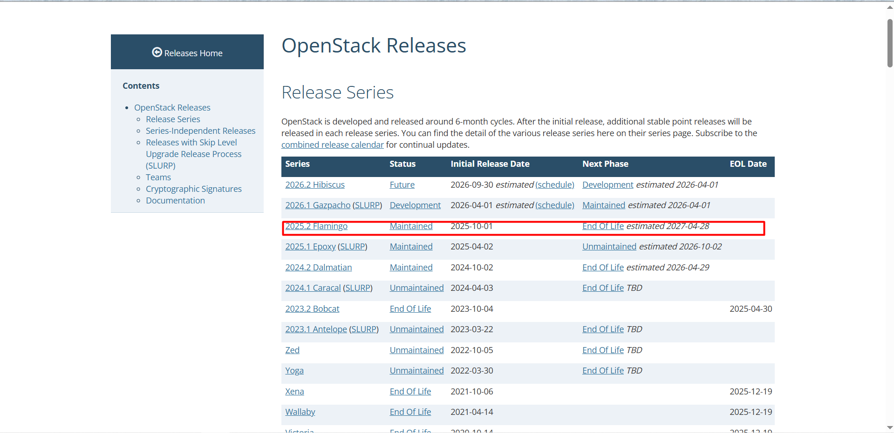
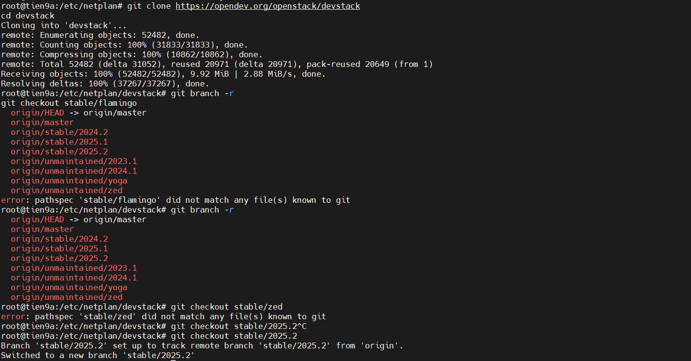
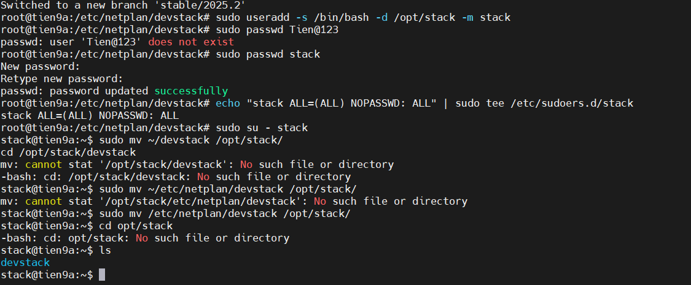

# DEPLOY OPENSTACK ALL IN ONE IN VMWARE ENVIRONMENT USE DEVSTACK

## I. SETUP

### Chuẩn bị

- Môi trường: VMWare  
- Hệ điều hành: Ubuntu 22.04 (cấu hình `minimal`)  
- Gói hộ trợ cài đặt OpenStack là DevStack  
- VM cấu hình 2 NIC:

  - NIC 1: `192.168.70.x` (Chế độ NAT - `DHCP` - Dùng để ProviderNetwork)
  - NIC 2: `10.10.10.x` (Chế Host-Only)

- Cấu hình VM khuyến nghị:

| Resource | Khuyến nghị      |
| -------- | ---------------- |
| CPU      | 4 vCPU           |
| RAM      | 8 GB (tối thiểu) |
| Disk     | 100+ GB          |
| Network  | 2 NIC            |

- Password thống nhất tất cả các dịch vụ là `Tien123`. Bao gồm:

  - Databases
  - Rabbit
  - Identity
  - Horizon và Keystone

## II. DEPLOYING

### `Bước 1`: Cấu hình VM

Bật Nested Virtualization: Bắt buộc để KVM chạy.

- VM Settings → CPU

Tick:

```text
Virtualize Intel VT-x/EPT
```

Cập nhật gói `apt` & cài đặt **dependencies**(những gói cần thiết):

```bash
sudo apt update -y 
sudo apt install git -y
```



Check IP của VM:



### `Bước 2`: Cấu hình Hostname (Khuyến khích - Không bắt buộc)

**Mục đích**: Thường bước này dành cho lab cụm OpenStack lớn nơi có các Service hoạt động dưới VM độc lập và cấu hình hostname sẽ giúp:

- Tạo endpoint
- RPC communication
- Log service

**Ví dụ**: Không tạo cấu hình hostname đôi khi DevStack tạo endpoint kiểu:

```bash
http://tien9a:5000
```

Thay vì chuẩn enterprise:(Chuẩn doanh nghiệp)

```bash
http://192.168.70.128:5000
```

**Set hostname**:

```bash
sudo hostnamectl set-hostname devstack

# Kiểm tra:

hostname

# Sửa file hosts:
sudo nano /etc/hosts

# Thêm dòng:

192.168.70.128 devstack

# Ping test devstack
# Trả về IP 192.168.70.100 là OK
```

### `Bước 3`: Clone Dev Stack

DevStack là project chính thức để deploy OpenStack lab.

```bash
git clone https://opendev.org/openstack/devstack
cd devstack
```

Giả sử: Ta sẽ tải bản `2025.2` (vì vòng đời chưa kết thúc) bằng cách:



```bash
git branch -r
git checkout stable/2025.2
```



### `Bước 4`: Bắt buộc chạy OpenStack bằng user thường

=> DevStack bắt buộc phải deploy bằng user thường

Tạo user:

```bash
#tạo user có tên stack
sudo useradd -s /bin/bash -d /opt/stack -m stack
```

Set pass:

```bash
sudo passwd stack
# mk: 1
```

Add quyền sudo cho user:

```bash
echo "stack ALL=(ALL) NOPASSWD: ALL" | sudo tee /etc/sudoers.d/stack
```

Chuyển DevStack từ `root` về user `stack`:

```bash
sudo mv ~/devstack /opt/stack/
```

Sửa quyền thư mục:

```bash
sudo chown -R stack:stack /opt/stack
sudo chmod +x /opt/stack
```

Thoát `root` sang user `stack`:

```bash
sudo -u stack -i
cd /opt/stack/devstack
```

### `Bước 5`: Tạo file cấu hình DevStack (`local.conf`)

Sau khi chuyển sang user stack, ta cần tạo file `local.conf` để DevStack biết **IP host và password** của các **service** và cả **direct của file log** nữa

Di chuyển tới thư mục DevStack:

```bash
cd /opt/stack/devstack
```

Tạo file:

```bash
nano local.conf
```

Nội dung:

```bash
[[local|localrc]]

HOST_IP=192.168.70.128      # IP management của node DevStack

ADMIN_PASSWORD=Tien123      # Password đăng nhập Horizon
DATABASE_PASSWORD=Tien123   # Password MariaDB
RABBIT_PASSWORD=Tien123     # Password RabbitMQ
SERVICE_PASSWORD=Tien123    # password các service OpenStack

LOGFILE=$DEST/logs/stack.sh.log # Direct cho file log
LOGDAYS=2

ENABLED_SERVICES+=,key,n-api,n-crt,n-obj,n-cpu,n-cond,n-sch,n-cauth,placement-api,placement-client  # Add Service

enable_plugin senlin https://opendev.org/openstack/senlin
enable_plugin senlin-dashboard https://opendev.org/openstack/senlin-dashboard
enable_service sl-api
enable_service sl-eng       # Add senlin

enable_service horizon      # Enable dashboard Horizon
```

### `Bước 6`: Deploying

Sau đó ta hoàn thiện nốt bước Deploy:

```bash
cd /opt/stack/devstack
./stack.sh
```



Nhớ pass cho từng Service:(pass:`Tien123`)

Nếu cài mà bị lỗi service nào không lên được mà không thể Debug được thì dùng các lệnh sau reset cài lại các Service như sau:

```bash
cd /opt/stack/devstack
./unstack.sh           # Dừng toàn bộ service của OpenStack (như Keystone, Nova,...)
./clean.sh             # Xóa database, network bridge, container, log… để reset môi trường
./stack.sh             # Cài lại DevStack từ đầu
```

### `Bước 7`: Truy cập vào Service EndPoint

Nếu cài thành công cuối màn hình sẽ hiện:

```bash
Horizon is now available at
http://192.168.70.128/dashboard
```

Login:

```text
user: admin
password: Tien123
```

Kết quả:


