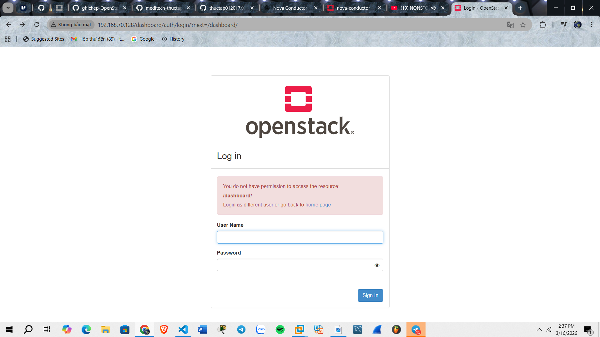

# DEPLOYING OPENSTACK ALL IN ONE IN OPENSTACK ENVIROMENT

## I. LỢI ÍCH LAB OPS TRÊN MÔI TRƯỜNG OPS

- Tận dụng sẵn hạ tầng cloud
- Dễ triển khai lab cho nhiều người (IP,network và image có sẵn)
- Dễ snapshot lại các bước và Rollback
- Không cần máy tính cá nhân mạnh, ..v.v

## II. KIẾN TRÚC LAB

```text
OpenStack Cluster chính
│
├─ Network
│
└─ VM (Ubuntu)
      IP: 192.168.70.128
      RAM: 8–16GB
      CPU: 4 vCPU
      Disk: 80GB
      │
      └─ DevStack AIO
           ├─ Keystone
           ├─ Nova
           ├─ Neutron
           ├─ Glance
           ├─ Cinder
           └─ Horizon
```

### `Bước 1`: Tạo VM trong OpenStack chính

Dùng OpenStack Horizon hoặc CLI.

Yêu cầu VM:

| Resource | Khuyến nghị  |
| -------- | ------------ |
| vCPU     | 4            |
| RAM      | 8–16GB       |
| Disk     | ≥80GB        |
| OS       | Ubuntu 22.04 |
| NIC      | 1 hoặc 2     |

### `Bước 2`: Bật Nested Virtualization (quan trọng)

Trên compute node của cụm OpenStack chính phải bật nested virtualization cho KVM.

Kiểm tra:

```bash
cat /sys/module/kvm_intel/parameters/nested
```

Nếu là:

```text
N
```

→ bật:

```bash
sudo modprobe -r kvm_intel
sudo modprobe kvm_intel nested=1
```

### `Bước 3`: Tạo VM Ubuntu

VM cần:

```text
Ubuntu 22.04
IP: 192.168.70.128
user: ubuntu
```

Cập nhật:

```bash
sudo apt update
sudo apt upgrade -y
```

### `Bước 4`: Cài dependencies

```bash
sudo apt install git -y
```

Tạo user DevStack:

```bash
sudo useradd -s /bin/bash -d /opt/stack -m stack
echo "stack ALL=(ALL) NOPASSWD: ALL" | sudo tee /etc/sudoers.d/stack
sudo su - stack
```

### `Bước 5`: Clone DevStack

DevStack

```bash
git clone https://opendev.org/openstack/devstack
cd devstack
git branch -r
git checkout stable/2025.2
```

### `Bước 6`: Tạo file local.conf

```bash
nano local.conf

# Thêm nội dung

[[local|localrc]]

HOST_IP=192.168.70.128      # IP management của node DevStack

ADMIN_PASSWORD=Tien123      # Password đăng nhập Horizon
DATABASE_PASSWORD=Tien123   # Password MariaDB
RABBIT_PASSWORD=Tien123     # Password RabbitMQ
SERVICE_PASSWORD=Tien123    # password các service OpenStack

LOGFILE=$DEST/logs/stack.sh.log # Direct cho file log
LOGDAYS=2

ENABLED_SERVICES+=,key,n-api,n-crt,n-obj,n-cpu,n-cond,n-sch,n-cauth,placement-api,placement-client  # Add Service

enable_plugin senlin https://opendev.org/openstack/senlin
enable_plugin senlin-dashboard https://opendev.org/openstack/senlin-dashboard
enable_service sl-api
enable_service sl-eng       # Add senlin

enable_service horizon      # Enable dashboard Horizon
```

### `Bước 7`: Chạy DevStack

Chạy:

```bash
./stack.sh
```

Thời gian: `20–40` phút

Sau khi xong sẽ thấy:

```text
Horizon is now available at
http://192.168.70.128/dashboard
```

### `Bước 8`: Truy cập Dashboard

Vào:

```text
http://192.168.70.128/dashboard
```

Login:

```text
user: admin
pass: secret
```


