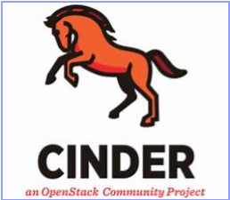
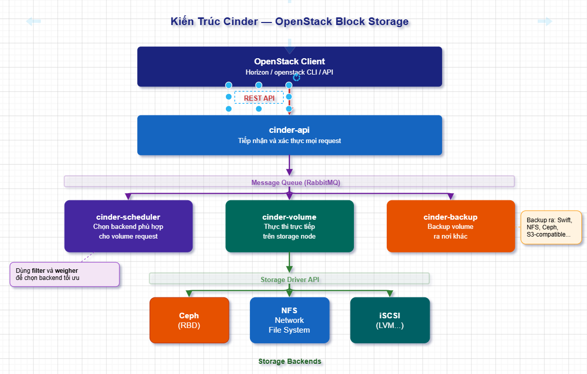
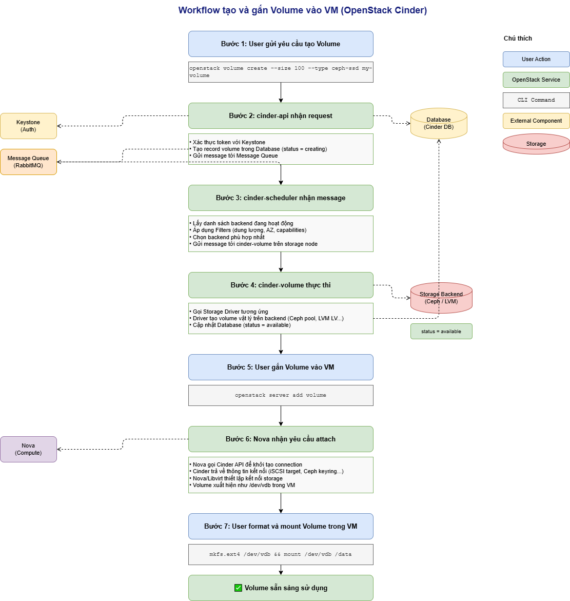
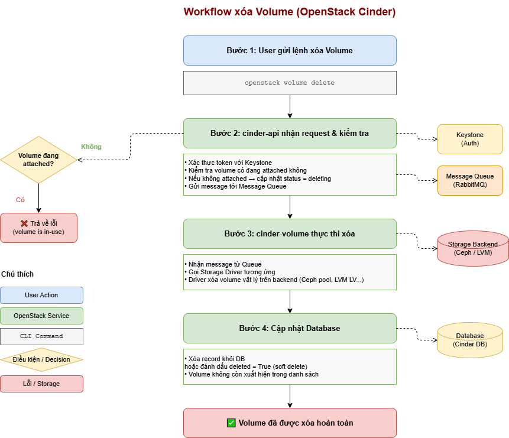

# TÌM HIỂU TỔNG QUAN VỀ OPENSTACK CINDER (Phiên bản mới nhất - 2024/2025)

> **Phiên bản:** Cinder 24.x (OpenStack Dalmatian 2024.2 trở lên)  
> **Tài liệu chính thức:** <https://docs.openstack.org/cinder/latest/>

## MỤC LỤC

1. [Cinder là gì?](#1-cinder-là-gì)
2. [Kiến trúc và các thành phần chính](#2-kiến-trúc-và-các-thành-phần-chính)
3. [Các loại Volume trong Cinder](#3-các-loại-volume-trong-cinder)
4. [Cách thức hoạt động (Workflow)](#4-cách-thức-hoạt-động-workflow)
5. [Các Storage Backend phổ biến](#5-các-storage-backend-phổ-biến)
6. [Volume Types và Quality of Service (QoS)](#6-volume-types-và-quality-of-service-qos)
7. [Snapshot và Backup](#7-snapshot-và-backup)
8. [Giao tiếp với các dịch vụ khác](#8-giao-tiếp-với-các-dịch-vụ-khác)
9. [Trạng thái vòng đời của Volume](#9-trạng-thái-vòng-đời-của-volume)
10. [Tính năng nâng cao](#10-tính-năng-nâng-cao)

## 1. Cinder là gì?



### 1.1. Định nghĩa

**Cinder (OpenStack Block Storage Service)** là dịch vụ cung cấp **Block Storage** (lưu trữ theo khối) cho các máy ảo trong OpenStack. Cinder tạo ra các **volume** — tương tự ổ cứng ảo — có thể gắn vào (attach) máy ảo Nova để lưu trữ dữ liệu.

Nói dễ hiểu: Cinder giống như một **nhà cung cấp ổ cứng ảo** trong môi trường cloud. Khi bạn cần thêm dung lượng lưu trữ cho VM, bạn yêu cầu Cinder tạo một volume rồi gắn nó vào VM — giống như cắm thêm một ổ cứng vật lý vào máy tính.

### 1.2. Phân biệt Cinder với Glance và Swift

| Tiêu chí | Glance (Image) | Cinder (Block) | Swift (Object) |
| -------- | -------------- | -------------- | -------------- |
| **Dạng lưu trữ** | File image nguyên vẹn | Block device (ổ đĩa) | Object (file/blob) |
| **Giao thức truy cập** | HTTP REST API | iSCSI, Fibre Channel, NVMe-oF | HTTP REST API |
| **Gắn vào VM** | Không trực tiếp | Có (attach/detach) | Không trực tiếp |
| **Dùng khi nào** | Lưu OS image để boot VM | Ổ đĩa dữ liệu cho VM | Lưu file, backup, media |
| **Giống với** | Kho image | Ổ cứng (HDD/SSD) | Amazon S3 |

### 1.3. Tại sao cần Cinder?

- **Root disk của VM** (ephemeral disk) chỉ tồn tại khi VM đang chạy — khi xóa VM, dữ liệu mất.
- **Cinder volume** tồn tại độc lập với VM — xóa VM không mất dữ liệu, có thể gắn vào VM khác.
- Hỗ trợ **snapshot** để backup nhanh, **resize** mở rộng dung lượng, **clone** để nhân bản volume.
- Cho phép VM truy cập hạ tầng storage doanh nghiệp (Ceph, NetApp, Pure Storage...).

## 2. Kiến trúc và các thành phần chính

### 2.1. Sơ đồ kiến trúc



### 2.2. cinder-api

**Đầu vào duy nhất** của toàn bộ dịch vụ Cinder.

- Nhận tất cả HTTP request từ client (Horizon, CLI, Nova...).
- Xác thực token với **Keystone** trước khi xử lý.
- Chuyển tiếp yêu cầu tới các thành phần khác qua **Message Queue** (RabbitMQ).
- Mặc định lắng nghe tại port **8776**.

### 2.3. cinder-scheduler

Thành phần **lên lịch và quyết định** backend nào sẽ thực hiện yêu cầu.

- Khi có yêu cầu tạo volume, scheduler nhận danh sách các backend đang hoạt động.
- Áp dụng **bộ lọc (Filters)** để loại bỏ backend không đủ điều kiện.
- Áp dụng **thuật toán đánh giá (Weighers)** để chọn backend tốt nhất.

**Các Filter phổ biến:**

| Filter | Mục đích |
| ------ | -------- |
| `AvailabilityZoneFilter` | Chỉ chọn backend trong AZ được yêu cầu |
| `CapacityFilter` | Loại backend không đủ dung lượng trống |
| `CapabilitiesFilter` | Chọn backend hỗ trợ Volume Type được yêu cầu |
| `DriverFilter` | Lọc dựa trên biểu thức tùy chỉnh của driver |

### 2.4. cinder-volume

Thành phần **thực thi** — chạy trên các storage node, trực tiếp thao tác với storage backend.

- Nhận lệnh từ scheduler qua Message Queue.
- Giao tiếp với storage backend thông qua **Storage Driver** tương ứng.
- Thực hiện: tạo volume, xóa, attach, detach, snapshot, clone, migrate...
- Mỗi cinder-volume có thể quản lý **nhiều backend** cùng lúc (multi-backend).

### 2.5. cinder-backup

Dịch vụ **sao lưu** volume ra một storage khác (thường là Swift hoặc NFS/Ceph).

- Backup volume (cả incremental lẫn full backup).
- Restore volume từ bản backup.
- Chạy độc lập, không ảnh hưởng đến cinder-volume.

### 2.6. Database (MariaDB)

Lưu trữ toàn bộ **trạng thái và metadata** của Cinder:

- Thông tin volume (ID, tên, size, trạng thái, backend...)
- Snapshot, backup records
- Volume Types, QoS specs
- Attachment records (volume gắn vào VM nào)

### 2.7. Message Queue (RabbitMQ)

Trung gian giao tiếp giữa `cinder-api`, `cinder-scheduler`, `cinder-volume`, `cinder-backup` theo mô hình **Producer-Consumer** bất đồng bộ. Giúp các thành phần hoạt động độc lập, chịu lỗi tốt.

## 3. Các loại Volume trong Cinder

### 3.1. Standard Volume

Volume thông thường, tạo từ đầu, không có dữ liệu ban đầu.

```bash
openstack volume create --size 50 my-data-volume
```

### 3.2. Volume từ Image (Boot Volume)

Tạo volume bằng cách copy từ Glance image. VM có thể boot từ volume này thay vì ephemeral disk — dữ liệu tồn tại khi xóa VM.

```bash
openstack volume create \
    --image Ubuntu-22.04 \
    --size 50 \
    --bootable \
    boot-volume-ubuntu
```

### 3.3. Volume từ Snapshot

Tạo volume mới từ snapshot của volume hiện tại.

```bash
openstack volume create \
    --snapshot <snapshot-id> \
    --size 50 \
    volume-from-snapshot
```

### 3.4. Volume từ Volume khác (Clone)

Nhân bản một volume sang volume mới (cùng backend).

```bash
openstack volume create \
    --source <source-volume-id> \
    --size 50 \
    cloned-volume
```

### 3.5. Multi-attach Volume

Volume được gắn đồng thời vào **nhiều VM** cùng lúc — yêu cầu filesystem phân tán (GFS2, OCFS2) hoặc ứng dụng biết cách xử lý concurrent access.

## 4. Cách thức hoạt động (Workflow)

### 4.1. Workflow tạo và gắn Volume vào VM



### 4.2. Workflow xóa Volume



## 5. Các Storage Backend phổ biến

### 5.1. LVM (Linux Volume Manager) — Mặc định

Backend đơn giản nhất, dùng LVM trên local disk của storage node. Phù hợp cho **dev/test**.

```ini
[lvm-backend]
volume_driver = cinder.volume.drivers.lvm.LVMVolumeDriver
volume_group = cinder-volumes
target_protocol = iscsi
target_helper = tgtadm
```

**Giao thức:** iSCSI — VM kết nối tới volume qua mạng IP.

| Ưu điểm | Nhược điểm |
| -------- | ---------- |
| Đơn giản, không cần phần cứng đặc biệt | Không HA — storage node chết = mất access |
| Dễ cấu hình, debug | Khó scale |
| Phù hợp test/lab | Hiệu năng phụ thuộc vào 1 node |

### 5.2. Ceph RBD — Phổ biến nhất trong Production

Backend phổ biến nhất nhờ tích hợp sâu với Nova (copy-on-write clone) và Glance.

```ini
[ceph-backend]
volume_driver = cinder.volume.drivers.rbd.RBDDriver
rbd_pool = volumes
rbd_ceph_conf = /etc/ceph/ceph.conf
rbd_user = cinder
rbd_secret_uuid = <libvirt-secret-uuid>
```

| Ưu điểm | Nhược điểm |
| -------- | ---------- |
| HA tự nhiên (replication factor) | Cần hạ tầng Ceph riêng |
| Scale ngang dễ dàng | Phức tạp hơn khi cấu hình |
| Clone nhanh nhờ CoW | Yêu cầu network tốt giữa nodes |
| Thin provisioning | |

### 5.3. NFS

Lưu volume như file trên NFS share. Đơn giản, phù hợp khi đã có NFS server.

```ini
[nfs-backend]
volume_driver = cinder.volume.drivers.nfs.NfsDriver
nfs_shares_config = /etc/cinder/nfs_shares
nfs_mount_options = vers=4,minorversion=1
```

### 5.4. iSCSI (các vendor khác nhau)

Nhiều storage vendor hỗ trợ Cinder qua driver iSCSI:

- **Pure Storage** (FlashArray)
- **NetApp** (ONTAP)
- **Dell EMC** (PowerStore, PowerMax)
- **HPE** (Nimble, Primera)

### 5.5. NVMe-oF (NVMe over Fabrics)

Giao thức hiện đại với độ trễ cực thấp, hiệu năng cao. Được hỗ trợ từ OpenStack Victoria trở đi.

```ini
[nvme-backend]
volume_driver = cinder.volume.drivers.nvme.NVMeOFDriver
target_protocol = nvmet_rdma
```

### 5.6. So sánh tổng quan các Backend

| Backend | Giao thức | HA | Hiệu năng | Phù hợp |
| ------- | --------- | -- | --------- | -------- |
| **LVM** | iSCSI | Không | Trung bình | Lab/Dev |
| **Ceph RBD** | Librbd/iSCSI | Có | Cao | Production |
| **NFS** | NFS | Tùy NFS server | Trung bình | Đơn giản |
| **NetApp ONTAP** | iSCSI/NFS/FC | Có | Rất cao | Enterprise |
| **NVMe-oF** | RDMA/TCP | Tùy | Cực cao | HPC/Latency |

---

## 6. Volume Types và Quality of Service (QoS)

### 6.1. Volume Type là gì?

**Volume Type** là cách Cinder phân loại các "loại" volume với đặc tính khác nhau (SSD, HDD, replicated, encrypted...). User chọn Volume Type khi tạo volume, Cinder tự chọn backend phù hợp.

```bash
# Tạo Volume Type cho SSD backend
openstack volume type create \
    --property volume_backend_name=ceph-ssd \
    SSD-Replicated

# Tạo Volume Type cho HDD
openstack volume type create \
    --property volume_backend_name=ceph-hdd \
    HDD-Cheap

# Tạo volume với type cụ thể
openstack volume create --type SSD-Replicated --size 100 my-ssd-volume
```

### 6.2. Quality of Service (QoS)

QoS cho phép giới hạn hoặc đảm bảo IOPS/bandwidth cho volume.

```bash
# Tạo QoS spec giới hạn 1000 IOPS đọc, 500 IOPS ghi
openstack volume qos create \
    --consumer front-end \
    --property read_iops_sec=1000 \
    --property write_iops_sec=500 \
    standard-qos

# Gắn QoS vào Volume Type
openstack volume qos associate standard-qos <volume-type-id>
```

**Consumer** quyết định ai thực thi QoS:

| Consumer | Ý nghĩa |
| -------- | ------- |
| `front-end` | Nova/Hypervisor thực thi (libvirt cgroups) |
| `back-end` | Storage backend thực thi |
| `both` | Cả hai cùng thực thi |

## 7. Snapshot và Backup

### 7.1. Snapshot

**Snapshot** là bản chụp trạng thái của volume tại một thời điểm — thực hiện nhanh, ít tốn dung lượng (CoW).

```bash
# Tạo snapshot
openstack volume snapshot create \
    --volume <volume-id> \
    --force \
    "snapshot-before-upgrade"

# Liệt kê snapshots
openstack volume snapshot list

# Khôi phục volume về trạng thái snapshot
# (Cinder không hỗ trợ revert trực tiếp cho volume đang attach)
# => Tạo volume mới từ snapshot
openstack volume create \
    --snapshot <snapshot-id> \
    --size 100 \
    volume-restored

# Xóa snapshot
openstack volume snapshot delete <snapshot-id>
```

**Lưu ý:** Snapshot của Cinder khác với snapshot của Nova:

- **Cinder snapshot** → snapshot của block device (volume)
- **Nova snapshot** → tạo Glance image từ VM (snapshot toàn bộ root disk)

### 7.2. Backup

**Backup** sao chép dữ liệu volume ra một storage backend khác (Swift, NFS, Ceph).

```bash
# Backup toàn bộ volume (full backup)
openstack volume backup create \
    --name "backup-$(date +%Y%m%d)" \
    <volume-id>

# Incremental backup (chỉ backup phần thay đổi so với backup trước)
openstack volume backup create \
    --incremental \
    --name "incremental-$(date +%Y%m%d)" \
    <volume-id>

# Restore từ backup
openstack volume backup restore <backup-id> <volume-id>

# Liệt kê backups
openstack volume backup list
```

| Tiêu chí | Snapshot | Backup |
| -------- | -------- | ------ |
| **Tốc độ tạo** | Nhanh (CoW) | Chậm (copy data) |
| **Nơi lưu** | Cùng backend với volume | Backend khác (Swift...) |
| **Độc lập với volume gốc** | Không (xóa volume = xóa snapshot) | Có |
| **Phục hồi khi backend hỏng** | Không | Có |
| **Dùng khi nào** | Trước upgrade/thay đổi ngắn hạn | DR, long-term backup |

## 8. Giao tiếp với các dịch vụ khác

### 8.1. Cinder ↔ Nova

Đây là tương tác quan trọng nhất. Khi user attach/detach volume:

```text
Nova API nhận lệnh attach volume
     ↓
Nova gọi Cinder API: initialize_connection()
     ↓
Cinder trả về connection info (iSCSI IQN, IP, Ceph keyring...)
     ↓
Nova/Libvirt thiết lập kết nối vật lý tới storage
     ↓
Cinder lưu attachment record vào Database
     ↓
Volume xuất hiện như block device trong VM (/dev/vdb, /dev/vdc...)
```

### 8.2. Cinder ↔ Keystone

- Mọi request tới Cinder API đều phải kèm **Keystone token** hợp lệ.
- Cinder validate token với Keystone trước khi xử lý.
- Cinder có **service account** riêng trong Keystone.

### 8.3. Cinder ↔ Glance

- Khi tạo volume **từ image**: Cinder gọi Glance API để tải image data về rồi ghi vào volume.
- Khi upload volume lên Glance: Cinder stream dữ liệu volume lên Glance.

### 8.4. Cinder ↔ Barbican

- Hỗ trợ **mã hóa volume** (Volume Encryption) sử dụng LUKS.
- Khóa mã hóa được lưu trong Barbican, không lưu trong Cinder database.

## 9. Trạng thái vòng đời của Volume

| Trạng thái         | Ý nghĩa                                |
| ------------------ | ---------------------------------------|
| `creating`         | Đang được tạo                          |
| `available`        | Sẵn sàng, chưa gắn vào VM nào          |
| `attaching`        | Đang trong quá trình gắn vào VM        |
| `in-use`           | Đang được gắn vào ít nhất 1 VM         |
| `detaching`        | Đang gỡ khỏi VM                        |
| `deleting`         | Đang bị xóa                            |
| `error`            | Xảy ra lỗi trong quá trình tạo/xóa     |
| `error_deleting`   | Xảy ra lỗi khi xóa                     |
| `backing-up`       | Đang thực hiện backup                  |
| `restoring-backup` | Đang restore từ backup                 |
| `extending`        | Đang mở rộng dung lượng                |
| `retyping`         | Đang chuyển sang Volume Type khác      |
| `maintenance`      | Bị khóa bởi admin để bảo trì           |

**Sơ đồ vòng đời cơ bản:**

```text
creating → available → attaching → in-use → detaching → available → deleting → (xóa)
                           ↓
                          error
```

## 10. Tính năng nâng cao

### 10.1. Volume Encryption (Mã hóa Volume)

Cinder hỗ trợ mã hóa volume tại rest (at-rest encryption) bằng LUKS, khóa quản lý bởi Barbican.

```bash
# Tạo encrypted Volume Type
openstack volume type create encrypted-ssd
openstack volume encryption type create \
    --cipher aes-xts-plain64 \
    --key-size 256 \
    --control-location front-end \
    encrypted-ssd \
    nova.volume.encryptors.luks.LuksEncryptor
```

### 10.2. Volume Migration

Di chuyển volume từ backend này sang backend khác mà không làm gián đoạn dịch vụ (live migration).

```bash
openstack volume migrate \
    --host cinder@ceph-backend#ceph-pool \
    <volume-id>
```

### 10.3. Volume Replication

Cinder hỗ trợ replication volume giữa hai storage backend (primary và secondary) để đảm bảo DR.

### 10.4. Thin Provisioning và Over-subscription

Cinder hỗ trợ **thin provisioning** — cấp phát dung lượng ảo lớn hơn dung lượng vật lý thực tế (over-subscription). Cần cẩn thận tránh hết dung lượng thật.

```ini
[ceph-backend]
max_over_subscription_ratio = 20.0  # Cho phép over-provision 20x
reserved_percentage = 5             # Dự trữ 5% không dùng
```

### 10.5. Consistency Groups (CGs) và Group Snapshots

Nhóm nhiều volume lại và thực hiện snapshot đồng thời (consistent point-in-time), hữu ích cho database cluster.

```bash
# Tạo group
openstack group create --group-type <type-id> --volume-types <vol-type> my-group

# Thêm volume vào group
openstack volume set --group <group-id> <volume-id>

# Tạo group snapshot
openstack group snapshot create --group <group-id> "group-snap-$(date +%Y%m%d)"
```

## Tóm tắt kiến thức cốt lõi

| Chủ đề | Điểm quan trọng |
| ------ | --------------- |
| **Cinder là gì** | Block Storage — cung cấp ổ đĩa ảo gắn vào VM |
| **Thành phần chính** | api, scheduler, volume, backup, database, message queue |
| **Luồng tạo volume** | api → scheduler → volume → backend driver |
| **Backend phổ biến** | LVM (lab), Ceph RBD (production), NFS, NetApp |
| **Volume Type** | Phân loại volume theo đặc tính, map tới backend |
| **Snapshot** | Nhanh, cùng backend, phụ thuộc volume gốc |
| **Backup** | Chậm hơn, backend khác, độc lập với volume gốc |
| **Trạng thái** | creating → available → in-use → deleting |
| **Tích hợp** | Nova (attach), Keystone (auth), Glance (image), Barbican (encrypt) |

## TÀI LIỆU THAM KHẢO

- <https://docs.openstack.org/cinder/latest/>
- <https://docs.openstack.org/cinder/latest/admin/index.html>
- <https://docs.openstack.org/cinder/latest/configuration/block-storage/volume-drivers.html>
