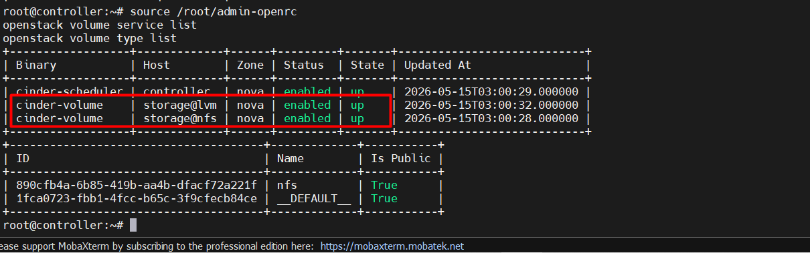
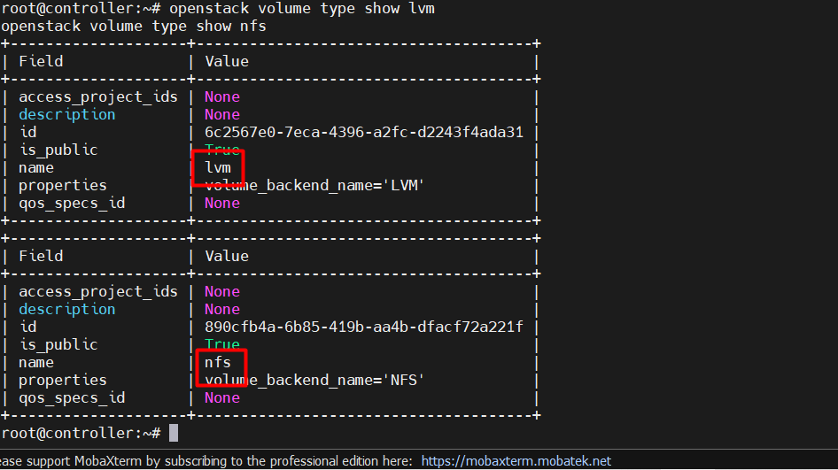
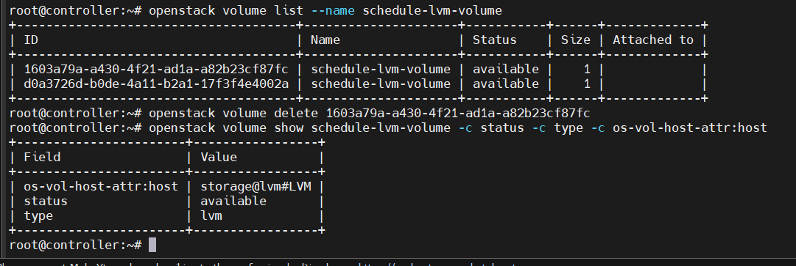
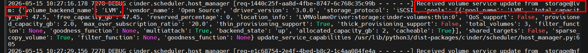

# LAB SCHEDULE VOLUME BASE ON BACKEND LOG OF CINDER

Mục tiêu:

```text
Volume type `lvm` -> scheduler chọn backend `storage@lvm`
Volume type `nfs` -> scheduler chọn backend `storage@nfs`
Đọc log `cinder-scheduler` để hiểu vì sao nó chọn backend đó
```

## I. MÔI TRƯỜNG LAB

Ta sẽ dùng cụm hạ tầng **OpenStack Zed** mà ta đã tạo sau [đây](https://github.com/tiend9/Tim-hieu-OPNsense/blob/main/07.Learn_About_OpenStack_Cinder/labs/02.%20Install_Cinder_with_NFS_and_LVM.md)

## II. LAB

### `Bước 1`: Check beckend đang sống

```bash
# Trên Controller:
source /root/admin-openrc
openstack volume service list
openstack volume type list
```

Output:



=> Là OKE.

### `Bước 2`: Tạo volume Type rõ ràng

Nếu chưa có:

```bash
openstack volume type create lvm
openstack volume type set --property volume_backend_name=LVM lvm

openstack volume type create nfs
openstack volume type set --property volume_backend_name=NFS nfs

# Check:

openstack volume type show lvm
openstack volume type show nfs
```

Output:



### `Bước 3`: Bật Debug Log cho Cinder Scheduler

Trên Controller sửa:

```nano
nano /etc/cinder/cinder.conf

# Sửa
[DEFAULT]
debug = true
scheduler_default_filters = AvailabilityZoneFilter,CapacityFilter,CapabilitiesFilter

# Restart:
systemctl restart cinder-scheduler

# Theo dõi log:
tail -f /var/log/cinder/cinder-scheduler.log
```

### `Bước 4`: Tạo volume theo backend LVM

Mở terminal khác trên Controller:

```bash
openstack volume create --size 1 --type lvm schedule-lvm-volume

# Check volume được schedule vào đâu:
openstack volume show schedule-lvm-volume -c status -c type -c os-vol-host-attr:host
```

Kỳ vọng:



```text
type                  lvm
os-vol-host-attr:host storage@lvm#LVM
# Trong log scheduler, mày tìm các keyword:
```



```text
schedule-lvm-volume
CapabilitiesFilter
storage@lvm
volume_backend_name
```

## III. KẾT LUẬN QUAN TRỌNG

> CapabilitiesFilter sẽ so sánh extra spec của volume type với capability mà cinder-volume report lên scheduler.Nếu volume_backend_name khớp thì backend pass filter. Nếu không khớp thì backend bị loại.
