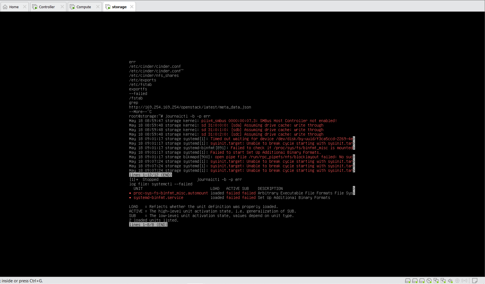
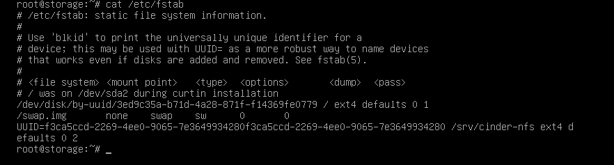
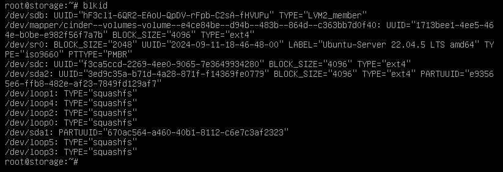
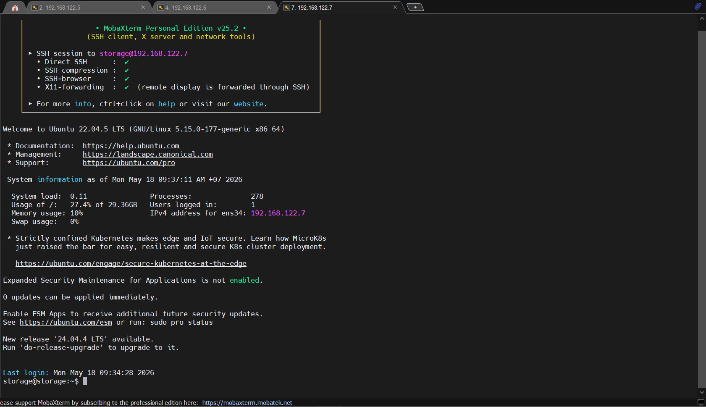

# DEBUG LỖI - STORAGE NODE VÀO EMERGENCY MODE

## 1. Lỗi

Sau Khi cấu hình multibackend, chúng ta khởi động lại VM của Node Storage và ta không SHH được vào nó thì chúng ta sẽ gặp lỗi như sau:

```bash
systemctl --failed
journalctl -b -p err --no-pager
```



Ở đây chúng ta thấy có 1 lỗi:

- `" systemd[1]: Timed out waiting for device /dev/disk/by-uuid/f3ca5ccd-2269-4e..."`

=>  `/etc/fstab` có mount một thiết bị với UUID này nhưng disk `sdc` không còn tồn tại (bị tháo, đổi tên, hoặc chưa được nhận diện).

- Các lỗi còn lại do mình reboot máy khiến cho system đang bị loop service của systemd `sysinit.target` bị dependency loop, không boot được bình thường + 2 unit failed (từ systemctl --failed) đó là `proc-sys-fs-binfmt_misc.automount` và `systemd-binfmt.service`

## 2. Fix lỗi

Chúng ta cần sửa lỗi quan trọng nhất đó là sửa lại Disk trong file `/fstab`, cần check xem nó tồn tại không hoặc đang bị lỗi gì.

### `Bước 1`: Remount filesystem read-write

Emergency mode thường mount / ở chế độ read-only, cần remount trước:

```bash
bashmount -o remount,rw /
```

### `Bước 2`: Tìm nguyên nhân gây ra Emergency Mode

```bash
# Check UUID trong file /fstab
cat /etc/fstab
```



Kiểm tra trên VM UUID có tồn tại không:

```bash
blkid
```



=> Đã tìm ra nguyên nhân file `/fstab` bị lặp 2 lần UUID của Disk

Ta sửa lại file `/fstab`:

```bash
nano /fstab
```

Sau khi fix, ta reboot lại máy:

```bash
systemctl reboot
```

Ta SSH vào xem đã fix bược lỗi chưa:


