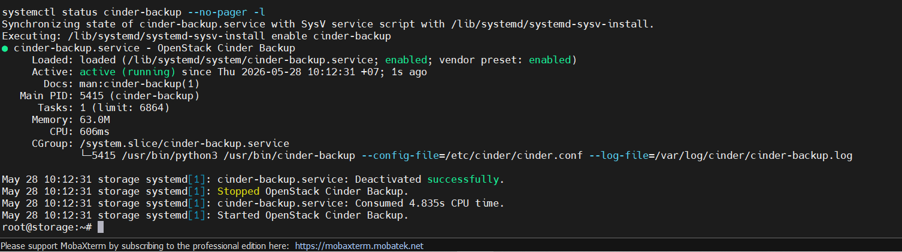
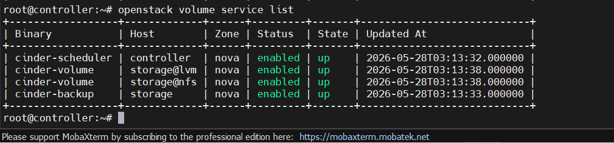

# CẤU HÌNH CINDER BACKUP

## I. MÔI TRƯỜNG

Set up trên cụm lab này ta sẽ lấy luôn ở [đây](https://github.com/tiend9/Tim-hieu-OPNsense/blob/main/07.Learn_About_OpenStack_Cinder/labs/01.Install_Cinder_with_LVM.md)

## II. THỰC HIỆN

Với lab của ta, cách nhanh và hợp lý nhất là chạy `cinder-backup` trên Storage Node `10.0.0.7`, dùng POSIX backup driver lưu backup ra một thư mục riêng, ví dụ `/srv/cinder-backup`.

**Lý do**: cụm này chưa có **Swift/Ceph/S3**, nên dùng POSIX là đơn giản nhất cho lab. Official docs cũng có POSIX driver: `cinder.backup.drivers.posix.PosixBackupDriver`.

Trên Storage Node:

```bash
sudo -i

apt update
apt -y install cinder-backup
```

Tiếp theo, tạo thư mục lưu Backup:

```bash
mkdir -p /srv/cinder-backup
chown cinder:cinder /srv/cinder-backup
chmod 0750 /srv/cinder-backup
```

Rồi sau đó, sửa `/etc/cinder/cinder.conf` trên Storage Node, thêm vào [DEFAULT]:

```ini
[DEFAULT]
backup_driver = cinder.backup.drivers.posix.PosixBackupDriver
backup_posix_path = /srv/cinder-backup
```

Giữ nguyên phần multi-backend của cụm:

```bash
[DEFAULT]
enabled_backends = lvm,nfs

# Và các block backend vẫn như cũ:
[lvm]
volume_backend_name = LVM

[nfs]
volume_backend_name = NFS
```

Restart service:

```bash
systemctl restart cinder-backup
systemctl enable cinder-backup

systemctl status cinder-backup --no-pager -l
```



Nếu lỗi thì check log:

```bash
journalctl -u cinder-backup -n 100 --no-pager
tail -n 100 /var/log/cinder/cinder-backup.log
```

Cuối cùng trên Controller kiểm tra service:

```bash
openstack volume service list
```

Nếu Out put như này là `OKE`:

```bash
cinder-backup | storage | nova | enabled | up
```



**Note**: Không cần tạo endpoint Keystone mới. cinder-backup không phải API service riêng, nó là worker của Cinder, dùng API `volumev3` hiện có.

Nếu ta lưu backup vào `/srv/cinder-backup` cùng Storage Node thì đây là lab backup, chưa phải backup chống mất node. Muốn đúng nghĩa hơn thì nên gắn thêm disk riêng `/dev/sdd` mount vào `/srv/cinder-backup`, hoặc export backup sang NFS server khác.
