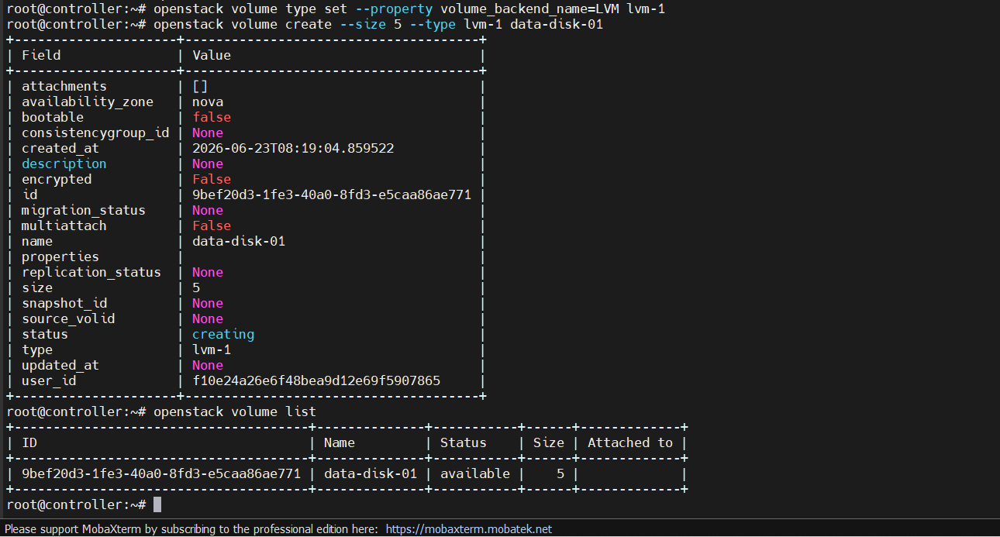
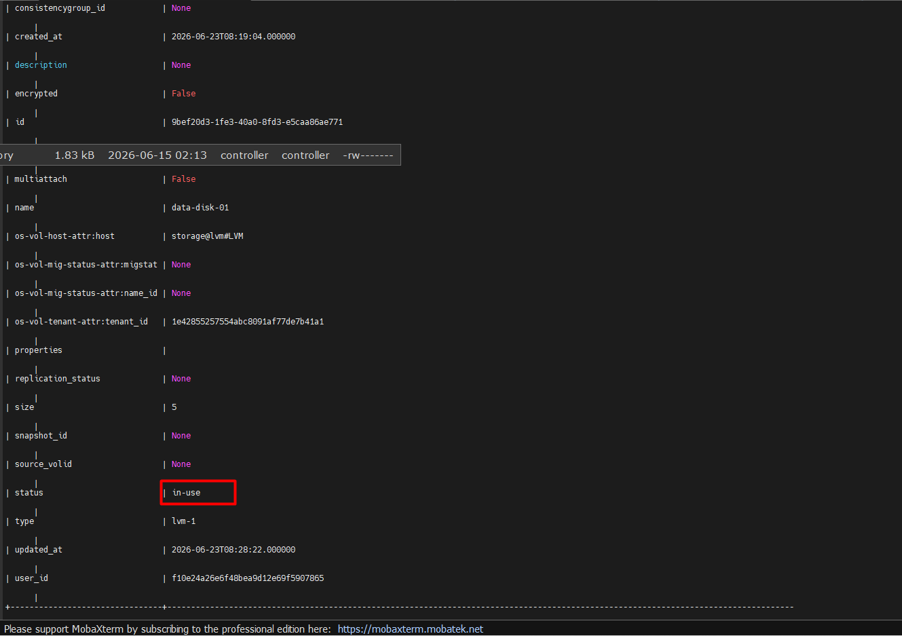
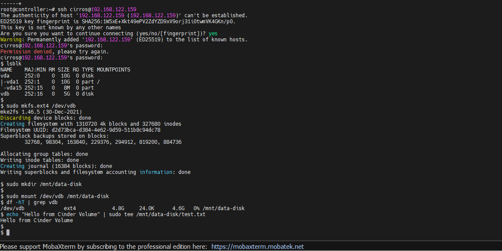
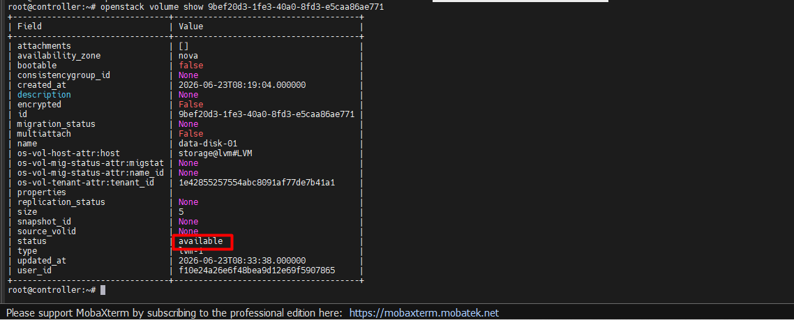
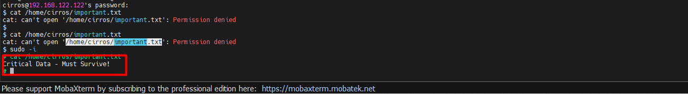

# CÁC BÀI LAB CƠ BẢN CINDER

## I. Môi trường

Môi trường Lab là ta sẽ thực hiện trên cụm OpenStack mà ta đã dựng sau [đây](https://github.com/tiend9/Tim-hieu-OPNsense/blob/main/07.Learn_About_OpenStack_Cinder/labs/01.Install_Cinder_with_LVM.md), nhưng lưu ý cụm lab OpenStack này đã được lab thành MultiRegion theo bài lab [này](https://github.com/tiend9/Tim-hieu-OPNsense/blob/main/15.Deployment_OPS/03.Deloy_OPS_Multi_Region/01.Deploy_OPS_MultiRegion.md)

## II.THỰC HÀNH

### 1. Volume Lifecycle & In-Guest Format (Vòng đời cơ bản)

**Mục đích**: Tạo Volume trắng ➔ Gắn (Attach) vào một VM đang chạy ➔ SSH vào VM dùng lệnh Linux (`fdisk`, `mkfs.ext4`) để format và mount ổ đĩa ➔ Tháo (Detach) ổ đĩa.

`Bước 1`: Tạo Volume trắng

```bash
unset unset OS_SYSTEM_SCOPE

source admin-openrc

# # Tạo volume type tên là lvm-1
openstack volume type create lvm-1


# Map cái type này với cái backend tên là lvm (đã config trong cinder.conf)
openstack volume type set --property volume_backend_name=LVM lvm-1

# Tạo volume 5GB từ backend LVM
openstack volume create --size 5 --type lvm-1 data-disk-01
openstack volume list
```



=> Status `Available` là volume đã sẵn sàng.

`Bước 2`: Attach vào VM đang chạy

```bash
# Lấy ID của VM và Volume
openstack server list
openstack volume list

# Gắn volume vào VM
openstack server add volume <SERVER_ID> <VOLUME_ID>

# Xác nhận volume đã gắn thành công (status -> in-use)
openstack volume show <VOLUME_ID>
```



=> Status `in-use` là volume đã được gắn vào VM.

`Bước 3`: SSH vào VM và format & Mount ổ đĩa

```bash
# SSH vào VM (ổ cứng mới thường là /dev/vdb)
ssh cirros@<FLOATING_IP>

# Kiểm tra ổ cứng mới xuất hiện
lsblk

# Format ổ cứng (chỉ làm 1 lần duy nhất)
sudo mkfs.ext4 /dev/vdb

# Tạo thư mục mount và mount vào
sudo mkdir /mnt/data-disk
sudo mount /dev/vdb /mnt/data-disk

# Kiểm tra đã mount thành công
df -hT | grep vdb

# Ghi thử 1 file vào ổ
echo "Hello from Cinder Volume" | sudo tee /mnt/data-disk/test.txt
```



=> lệnh `sudo tee` ra dòng `Hello from Cinder Volume` đã được ghi vào volume.

`Bước 4`: Detach Volume và kiểm tra lại dữ liệu

```bash
# Umount trong VM trước
sudo umount /mnt/data-disk
exit

# Detach Volume khỏi VM
openstack server remove volume <SERVER_ID> <VOLUME_ID>
openstack volume show <VOLUME_ID>
# Status phải trở về -> available
```



### 2. Boot from Volume (BfV)

`Bước 1`: Tạo VM boot từ Volume (không dùng Ephemeral Disk)

```bash
# Tạo VM boot thẳng từ image lưu trên Cinder Volume
openstack server create \
  --flavor m1.small \
  --image <IMAGE_ID> \
  --boot-from-volume 10 \
  --network <NETWORK_ID> \
  bfv-vm-01

# Xem danh sách volume -> sẽ thấy volume mới được tạo tự động và gắn vào VM
openstack volume list
```

`Bước 2`: Chứng minh sức mạnh của BfV (Tính Di động)

```bash
# Ghi data vào VM
ssh cirros@<FLOATING_IP>
echo "Critical Data - Must Survive!" | sudo tee /home/cirros/important.txt
exit

# Xóa VM (giả lập Compute Node bị hỏng)
openstack server delete bfv-vm-01

# Volume vẫn CÒN SỐNG! (status -> available)
openstack volume list

# Boot lại VM mới từ chính cái Volume cũ đó
openstack server create \
  --flavor m1.small \
  --volume <VOLUME_ID_CU> \
  --network <NETWORK_ID> \
  bfv-vm-02-recovered

# SSH vào và kiểm tra data vẫn còn nguyên
ssh cirros@<FLOATING_IP_MOI>
cat /home/cirros/important.txt
```



### 3. Volume Extend

`Bước 1`: Tạo Volume `5GB` và attach vào VM

```bash
# Tạo volume nhỏ
openstack volume create --size 5 --type lvm-1 extend-disk-test
openstack server add volume <SERVER_ID> <VOLUME_ID>

# SSH vào VM, format và mount
ssh cirros@<FLOATING_IP>
sudo mkfs.ext4 /dev/vdb
sudo mkdir /mnt/extend-disk
sudo mount /dev/vdb /mnt/extend-disk
df -hT | grep vdb  # Thấy ~4.8GB
```

`Bước 2`: Extend Volume lên `10GB`

```bash
# Phải detach trước khi extend (với LVM backend)
exit
sudo umount /mnt/extend-disk
openstack server remove volume <SERVER_ID> <VOLUME_ID>

# Ra ngoài Controller, extend Volume
openstack volume set --size 10 <VOLUME_ID>
openstack volume show <VOLUME_ID>
# Kiểm tra size đã thành 10

# Attach lại vào VM
openstack server add volume <SERVER_ID> <VOLUME_ID>
```

`Bước 3`: Áp dụng phần dung lượng tăng thêm trong VM

```bash
ssh cirros@<FLOATING_IP>
sudo mount /dev/vdb /mnt/extend-disk
df -hT | grep vdb  # VẪN THẤY 5GB! Cần resize filesystem

# Resize filesystem nhận diện phần dung lượng mới
sudo resize2fs /dev/vdb
df -hT | grep vdb  # BÂY GIỜ MỚI THẤY 10GB!
```

### 4. Phân biệt giữa Volume Snapshot và Volume Backup

`Bước 1`: Chuẩn bị - Ghi data vào Volume

```bash
# Mount volume vào VM và ghi data quan trọng
ssh cirros@<FLOATING_IP>
sudo mount /dev/vdb /mnt/data-disk
echo "Version 1.0 - IMPORTANT DATA" | sudo tee /mnt/data-disk/db_data.txt
sudo sync
exit
```

`Bước 2`: Chụp Snapshot

```bash
# Detach volume trước khi chụp snapshot (an toàn hơn)
openstack server remove volume <SERVER_ID> <VOLUME_ID>

# Chụp snapshot
openstack volume snapshot create --volume <VOLUME_ID> snap-before-delete
openstack volume snapshot list
```

`Bước 3`: Giả lập "tai nạn" - Xóa data

```bash
# Attach lại để xóa data
openstack server add volume <SERVER_ID> <VOLUME_ID>
ssh cirros@<FLOATING_IP>
sudo mount /dev/vdb /mnt/data-disk
sudo rm /mnt/data-disk/db_data.txt  # Giả sử Xóa nhầm!
exit
openstack server remove volume <SERVER_ID> <VOLUME_ID>
```

`Bước 4`: Restore từ Snapshot

```bash
# Tạo Volume mới từ Snapshot đã chụp
openstack volume create \
  --snapshot <SNAPSHOT_ID> \
  --size 5 \
  volume-restored-from-snap

# Attach volume mới vào VM và kiểm tra
openstack server add volume <SERVER_ID> <VOLUME_RESTORED_ID>
ssh cirros@<FLOATING_IP>
sudo mount /dev/vdc /mnt/restored
cat /mnt/restored/db_data.txt  # DATA ĐÃ SỐNG LẠI!
```

=> Volume backup là bản sao dữ liệu được lưu trữ trên Swift

=> Volume snapshot là bản sao dữ liệu được lưu trữ trên Cinder Volume

### **Sự khác biệt chính: Tên gọi + Nơi lưu trữ + Khả năng di chuyển**

|              Tiêu chí            | Volume Snapshot                                                    |                           Volume Backup                              |
| :------------------------------- | :----------------------------------------------------------------- | :------------------------------------------------------------------- |
| **Tên gọi trong OpenStack**      | **Snapshot**                                                       | **Backup**                                                           |
| **Nơi lưu trữ dữ liệu**          | Trên **Cinder Volume** của chính Cinder Service (Cùng backend LVM) | Trên **Swift (Object Storage)**                                      |
| **Mục đích chính**               | 1. Tạo điểm hồi phục nhanh (Restore)<br>2. Nhân bản Volume (Clone) | 1. Sao lưu lâu dài (Archival)<br>2. Di chuyển Volume giữa các Region |
| **Tính di động (Migratability)** | **Khó di chuyển** (Bị lock trong 1 Region)                         | **Dễ di chuyển** (Có thể Copy từ Region này sang Region khác)        |
