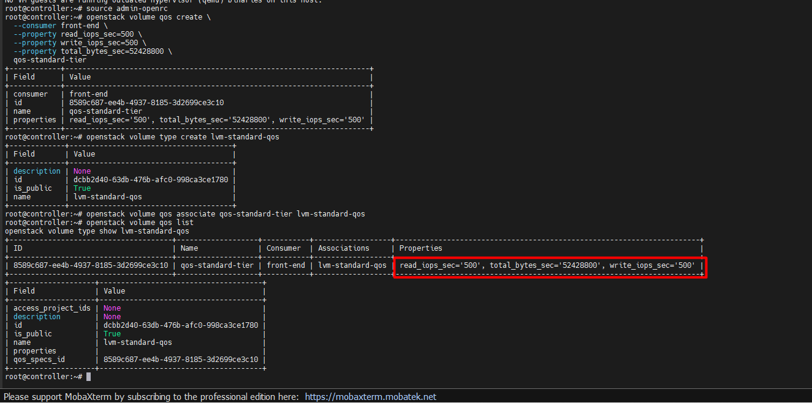
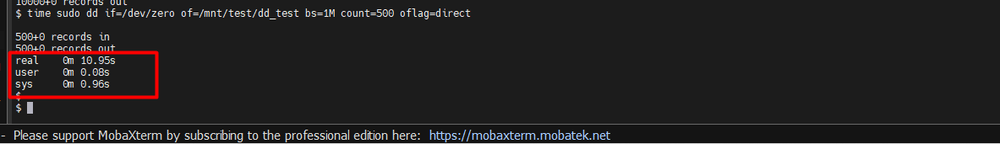
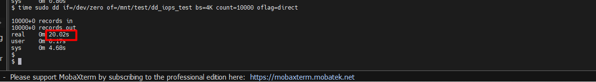
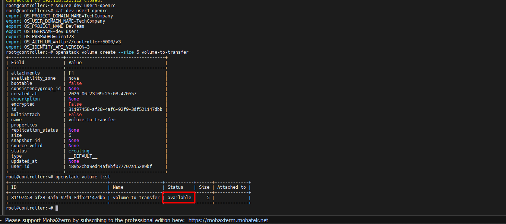
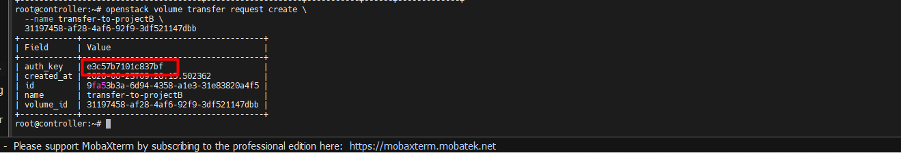

# CÁC BÀI LAB NÂNG CAO CỦA CINDER

## I. MÔI TRƯỜNG

Môi trường Lab là ta sẽ thực hiện trên cụm OpenStack mà ta đã dựng sau [đây](https://github.com/tiend9/Tim-hieu-OPNsense/blob/main/07.Learn_About_OpenStack_Cinder/labs/01.Install_Cinder_with_LVM.md), nhưng lưu ý cụm lab OpenStack này đã được lab thành MultiRegion theo bài lab [này](https://github.com/tiend9/Tim-hieu-OPNsense/blob/main/15.Deployment_OPS/03.Deloy_OPS_Multi_Region/01.Deploy_OPS_MultiRegion.md)

## II. THỰC HÀNH

### 1. Lab QoS - Giới hạn IOPS

`Bước 1`: Cài công cụ test I/O

```bash
# Trên Compute Node hoặc SSH vào VM
sudo apt install fio -y
```

`BƯớc 2`: Tạo QoS Specs gắn vào Volume Type

**Note**: Trong **OpenStack Cinder** (dịch vụ block storage), **IOPS** là viết tắt của **Input/Output Operations Per Second** – số lượng thao tác đọc/ghi mà một volume có thể thực hiện trong mỗi giây.

```bash
source admin-openrc

# Tạo QoS giới hạn 500 IOPS và 50MB/s
openstack volume qos create \
  --consumer front-end \
  --property read_iops_sec=500 \
  --property write_iops_sec=500 \
  --property total_bytes_sec=52428800 \
  qos-standard-tier

# Tạo Volume Type mới có gắn QoS
openstack volume type create lvm-standard-qos
openstack volume qos associate qos-standard-tier lvm-standard-qos

# Xem kết quả
openstack volume qos list
openstack volume type show lvm-standard-qos
```



`Bước 3`: Test tốc độ trước khi bị **QoS bóp**

```bash
# Tạo volume KHÔNG có QoS và attach vào VM
openstack volume create --size 5 --type lvm-1 disk-no-qos
openstack server add volume <SERVER_ID> <VOLUME_ID>

# SSH vào VM, format và test tốc độ ghi
ssh cirros@<FLOATING_IP>
sudo mkfs.ext4 /dev/vdb
sudo mkdir /mnt/test
sudo mount /dev/vdb /mnt/test
# Ghi 1 cục file 500MB vào đĩa (block size = 1MB, lặp lại 500 lần)
time sudo dd if=/dev/zero of=/mnt/test/dd_test bs=1M count=500 oflag=direct

# Ghi lại kết quả IOPS vào notepad
```



`Bước 4`: Test tốc độ SAU khi bị QoS bóp

```bash
# Tạo volume CÓ QoS và attach vào VM
exit
openstack server remove volume <SERVER_ID> <OLD_VOLUME_ID>
openstack volume create --size 5 --type lvm-standard-qos disk-with-qos
openstack server add volume <SERVER_ID> <NEW_VOLUME_ID>

# Test lại và so sánh kết quả
ssh cirros@<FLOATING_IP>
sudo mkfs.ext4 /dev/vdc
sudo rm -rf /mnt/test
sudo mkdir /mnt/test
sudo mount /dev/vdc /mnt/test

# Chạy test tốc độ (đã bị QoS bóp)
time sudo dd if=/dev/zero of=/mnt/test/dd_iops_test bs=4K count=10000 oflag=direct

# IOPS lúc này sẽ bị ghim cứng ở mức 500!
```



### 2. Volume Transfer (Chuyển nhượng Volume giữa 2 Project)

`Bước 1`: Chuẩn bị 2 Project

```bash
# Tạo volume ở Project A (dev_project)
source dev_user1-openrc
openstack volume create --size 5 volume-to-transfer
openstack volume list
```



`Bước 2`: Project A tạo Transfer Request

```bash
# Project A phát hành "Transfer Key"
openstack volume transfer request create \
  --name transfer-to-projectB \
  <VOLUME_ID>

# Output sẽ có 2 thứ quan trọng:
# - id (Transfer ID)
# - auth_key (Mật mã chuyển nhượng - CHỈ HIỆN 1 LẦN, COPY NGAY!)
```



`Bước 3`: Project B nhận Volume

```bash
# Chuyển sang quyền Project B
source g_admin-openrc

# Nhập Transfer ID và Auth Key để nhận Volume
openstack volume transfer request accept \
  --auth-key <AUTH_KEY> \
  <TRANSFER_ID>

# Xác nhận Volume đã chuyển sang Project B
openstack volume list
```


### 3. Cross-Region Backup & Restore

**Điều kiện**: Cả 2 Region phải dùng chung NFS Server làm Backup Target

`Bước 1`: Cấu hình NFS Backup cho Cinder ở CẢ 2 Region

```bash
# Trên Storage Node của CẢ 2 Region:

# Sửa /etc/cinder/cinder.conf
[DEFAULT]
backup_driver = cinder.backup.drivers.nfs.NFSBackupDriver
backup_share = <NFS_SERVER_IP>:/srv/cinder-backup
backup_mount_options = vers=4
systemctl restart cinder-backup
```

`Bước 2`: Backup Volume từ Region 1

```bash
# Trên Controller, dùng Region 1
source admin-openrc  # Đảm bảo đang ở Region 1
openstack volume backup create \
  --name backup-from-region1 \
  <VOLUME_ID_REGION1>
openstack volume backup list
```

`Bước 3`: Import Backup Record sang Region 2

```bash
# Lấy thông tin chi tiết của backup để export
openstack volume backup show <BACKUP_ID>

# Export backup record
openstack volume backup record export <BACKUP_ID>

# Copy toàn bộ output (backup_service, backup_url)
Bước 4: Import và Restore ở Region 2
bash

# Chuyển sang Region 2
export OS_REGION_NAME=RegionTwo

# Import backup record từ Region 1 vào Region 2
openstack volume backup record import \
  cinder.backup.drivers.nfs.NFSBackupDriver \
  "<BACKUP_URL_TU_BUOC_TREN>"

# Restore Volume mới từ backup
openstack volume backup restore \
  <BACKUP_ID_REGION2> \
  volume-restored-in-region2
openstack volume list

# Volume mới xuất hiện tại Region 2 với data y chang Region 1!
```

Bước 4: Import và Restore ở Region 2

```bash
# Chuyển sang Region 2
export OS_REGION_NAME=RegionTwo
# Import backup record từ Region 1 vào Region 2
openstack volume backup record import \
  cinder.backup.drivers.nfs.NFSBackupDriver \
  "<BACKUP_URL_TU_BUOC_TREN>"
# Restore Volume mới từ backup
openstack volume backup restore \
  <BACKUP_ID_REGION2> \
  volume-restored-in-region2
openstack volume list
# Volume mới xuất hiện tại Region 2 với data y chang Region 1!
```
