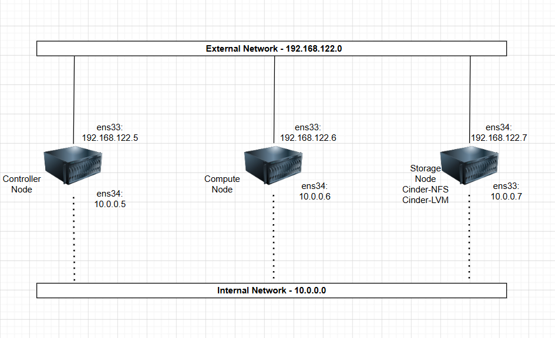
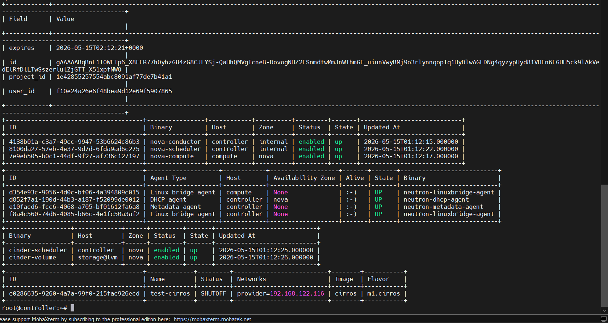

# LAB OPENSTACK INSTALL CINDER WITH BACKEND NFS (BUILD MULTI BACKEND)

## I. MÔ HÌNH



## II. SETUP MÔI TRƯỜNG VÀ QUY HOẠCH IP

### 1. Set up môi trường

Set up trên cụm lab này ta sẽ lấy luôn **cụm Lab OpenStack Cinder với Backend là LVM làm nền** nhưng thay vào đó ta sẽ **thêm 1 backend nữa là NFS** và tất cả cấu hình cụm lab nền ở [đây](https://github.com/tiend9/Tim-hieu-OPNsense/blob/main/07.Learn_About_OpenStack_Cinder/labs/01.Install_Cinder_with_LVM.md)

### 2. Quy hoạch IP

| Node           | Hostname      | Interface | Network                       | IP Address    | Ghi chú                        |
|----------------|---------------|-----------|-------------------------------|---------------|--------------------------------|
| Controller     | controller    | ens33     | Management – 192.168.122.0/24 | 192.168.122.5 | Management                     |
|                |               | ens34     | Internal – 10.0.0.0/24        | 10.0.0.5      | Storage/Tunnel traffic         |
| Compute        | compute       | ens33     | Management – 192.168.122.0/24 | 192.168.122.6 | Management                     |
|                |               | ens34     | Internal – 10.0.0.0/24        | 10.0.0.6      | Tunnel traffic (VXLAN/GRE)     |
| Storage-Cinder | storage       | ens33     | Management – 192.168.122.0/24 | 192.168.122.7 | Management                     |
|                |               | ens34     | Internal – 10.0.0.0/24        | 10.0.0.7      | iSCSI Storage traffic          |

### 3.Thông số VM (đề xuất)

| Node       | vCPU | RAM  | Disk OS | Disk Data                                 | OS           |
|------------|------|------|---------|-------------------------------------------|--------------|
| Controller | 2    | 6 GB | 50 GB   | —                                         | Ubuntu 22.04 |
| Compute    | 2    | 6 GB | 50 GB   | —                                         | Ubuntu 22.04 |
| Storage    | 1    | 6 GB | 30 GB   | **50 GB** (`/dev/sdb`, LVM VG cho Cinder) | Ubuntu 22.04 |

## III THỰC HIỆN LAB

### `Bước 1`: Kiểm tra cụm OpenStack nền

Trước tiên, xác nhận Keystone, Nova, Neutron, Glance, Cinder API đang sống.

```bash
openstack token issue
openstack compute service list
openstack network agent list
openstack volume service list
openstack server list
```

Output:



=> Output như này là `OKE`.

