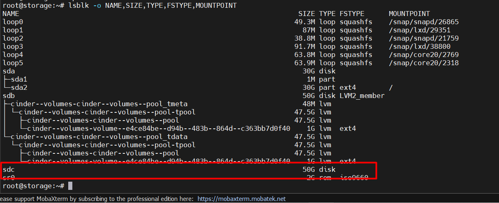
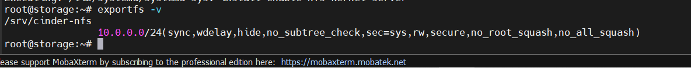
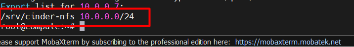
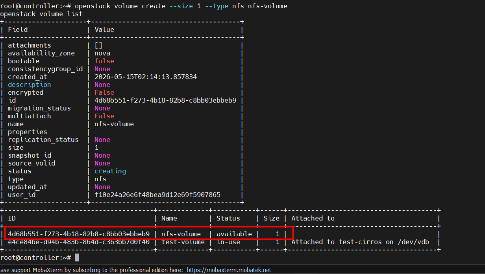
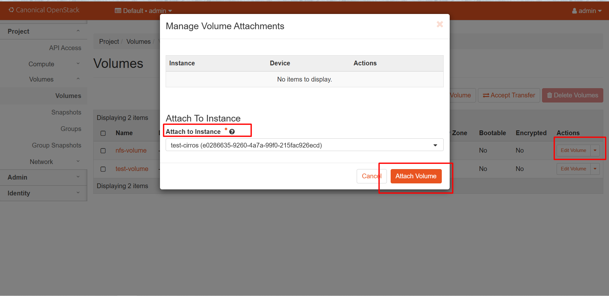
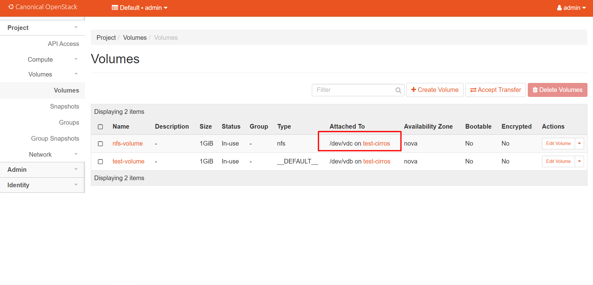
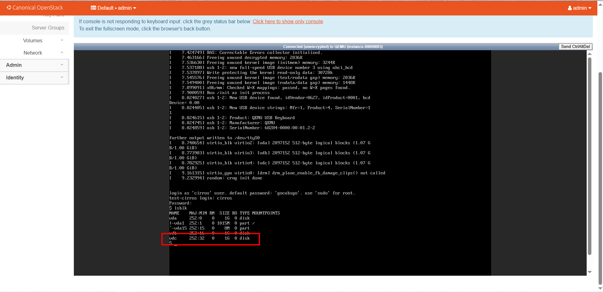

# LAB OPENSTACK INSTALL CINDER WITH MULTI BACKEND (NFS + LVM)

## I. MÔ HÌNH


## II. SETUP MÔI TRƯỜNG VÀ QUY HOẠCH IP

### 1. Set up môi trường

Set up trên cụm lab này ta sẽ lấy luôn **cụm Lab OpenStack Cinder với Backend là LVM làm nền** nhưng thay vào đó ta sẽ **thêm 1 backend nữa là NFS**. Cấu hình cụm lab nền ở [đây](https://github.com/tiend9/Tim-hieu-OPNsense/blob/main/07.Learn_About_OpenStack_Cinder/labs/01.Install_Cinder_with_LVM.md)

### 2. Quy hoạch IP

| Node           | Hostname      | Interface | Network                       | IP Address    | Ghi chú                        |
|----------------|---------------|-----------|-------------------------------|---------------|--------------------------------|
| Controller     | controller    | ens33     | Management – 192.168.122.0/24 | 192.168.122.5 | Management                     |
|                |               | ens34     | Internal – 10.0.0.0/24        | 10.0.0.5      | Storage/Tunnel traffic         |
| Compute        | compute       | ens33     | Management – 192.168.122.0/24 | 192.168.122.6 | Management                     |
|                |               | ens34     | Internal – 10.0.0.0/24        | 10.0.0.6      | Tunnel traffic                 |
| Storage-Cinder | storage       | ens34     | Management – 192.168.122.0/24 | 192.168.122.7 | Management                     |
|                |               | ens33     | Internal – 10.0.0.0/24        | 10.0.0.7      | Storage traffic                |

### 3.Thông số VM (đề xuất)

| Node       | vCPU | RAM  | Disk OS | Disk Data                                 | OS           |
|------------|------|------|---------|-------------------------------------------|--------------|
| Controller | 2    | 6 GB | 50 GB   | —                                         | Ubuntu 22.04 |
| Compute    | 2    | 6 GB | 50 GB   | —                                         | Ubuntu 22.04 |
| Storage    | 1    | 6 GB | 30 GB   | `50 GB /sdb` cho LVM + `50G /sdc` cho NFS | Ubuntu 22.04 |

## III THỰC HIỆN LAB

### `Bước 1`: Kiểm tra cụm OpenStack nền

Trước tiên, xác nhận Keystone, Nova, Neutron, Glance, Cinder API đang sống.

```bash
# Trên Controller Node
openstack token issue
openstack compute service list
openstack network agent list
openstack volume service list
openstack server list
```

Output:


=> Output như này là `OKE`.

### `Bước 2`: Chuẩn bị `/dev/sdc` trên Storage Node

Trên Storage Node attach thêm `RAW` Disk, ta có thể tham khảo qua tài liệu sau [đây](https://github.com/tiend9/system-intership/blob/master/TienHA/03.Linux/04.AdvanceInstallation.md)

Sau đó, check Disk:

```bash
lsblk -o NAME,SIZE,TYPE,FSTYPE,MOUNTPOINT
```



=> Đảm bảo `/dev/sdc` là disk mới, chưa mount, chưa có filesystem.

Ta định dạng `ext4` cho `sdc`:

```bash
mkfs.ext4 /dev/sdc
```

Tạo thư mục trên File System để làm điểm mount cho `sdc` và thực hiện mount:

```bash
mkdir -p /srv/cinder-nfs
mount /dev/sdc /srv/cinder-nfs

# Cấu hình tự mount sau reboot:
blkid /dev/sdc
nano /etc/fstab

# Thêm dòng, thay UUID thật:
UUID=<UUID-cua-sdc> /srv/cinder-nfs ext4 defaults 0 2
```

### `Bước 3`: Cài NFS Server trên Storage Node

Trước tiên, ta tải gói:

```bash
apt -y install nfs-kernel-server nfs-common
```

Sau đó sửa file exports:

```bash
nano /etc/exports

# Đây là file sẽ quyết chia sẻ thư mục `/srv/cinder-nfs` qua dải mạng nào ? (internal 10.0.0.0/24)

# Thêm dòng:
/srv/cinder-nfs 10.0.0.0/24(rw,sync,no_subtree_check,no_root_squash)

# Restart lại service:
exportfs -ra
systemctl restart nfs-kernel-server
systemctl enable nfs-kernel-server

# Check service:
exportfs -v
```

Output:



### `Bước 4`: Cài NFS Client trên Compute

Đầu tiên, trên Compute:

```bash
apt -y install nfs-common
showmount -e 10.0.0.7
```

Phải thấy:



### `Bước 5`: Cấu hình Cinder NFS backend trên Storage

Trên Storage:

```bash
nano /etc/cinder/nfs_shares
# Chèn nội dung:
10.0.0.7:/srv/cinder-nfs

# Phân quyền:
chown cinder:cinder /srv/cinder-nfs
chmod 0770 /srv/cinder-nfs
chown root:cinder /etc/cinder/nfs_shares
chmod 0640 /etc/cinder/nfs_shares

# Sửa /etc/cinder/cinder.conf:
[DEFAULT]
enabled_backends = lvm,nfs

[nfs]
volume_driver = cinder.volume.drivers.nfs.NfsDriver
volume_backend_name = NFS
nfs_shares_config = /etc/cinder/nfs_shares
nfs_mount_point_base = /var/lib/cinder/mnt

### Restart:
systemctl restart cinder-volume
```

### `Bước 6`: Tạo volume type NFS trên Controller + Test tạo volume NFS

Trên Controller:

```bash
source /root/admin-openrc

# Set volume type
openstack volume type create nfs
openstack volume type set --property volume_backend_name=NFS nfs

# Test tạo Volume NFS:
openstack volume create --size 1 --type nfs nfs-volume
openstack volume list
```

Output:



=> Nếu `nfs-volume` chuyển `available` là backend NFS `OK`.

### `Bước 7`: Sau đó attach volume vào VM `test-Cirros`

Attach volume vào VM `test-Cirros`:

```bash
openstack server add volume test-cirros nfs-volume

# Hoặc gán qua giao diện DashBoard
```



Vào VM check:




=> Output như này là `OK`.(Đoạn này tuỳ máy sẽ bị lỗi phân quyền)