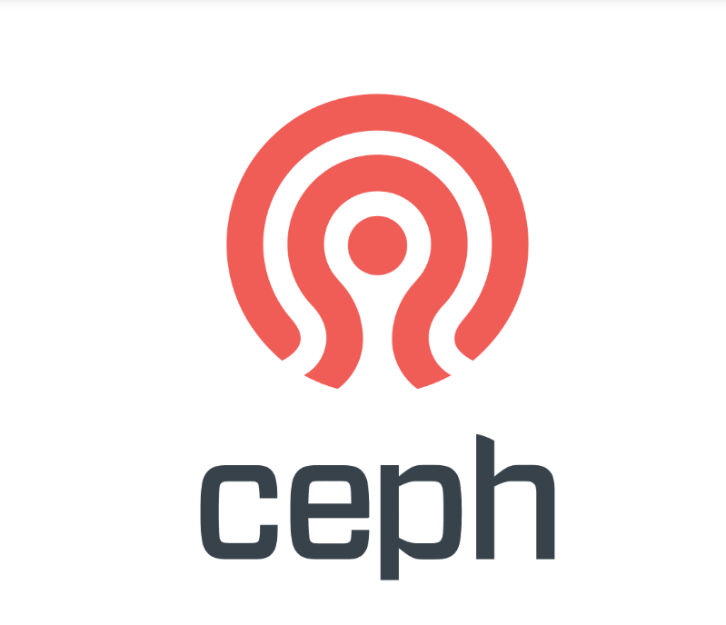
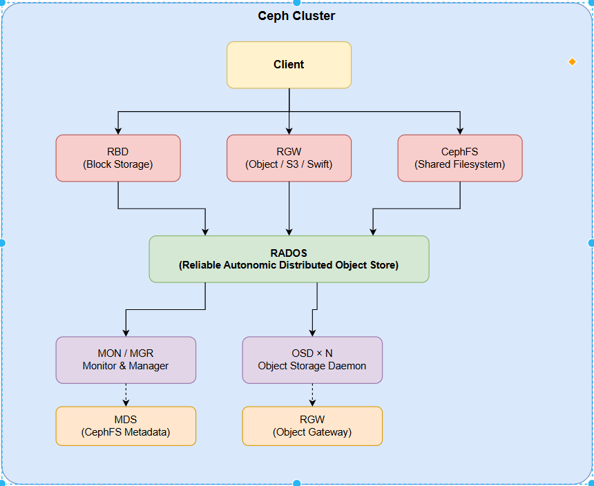
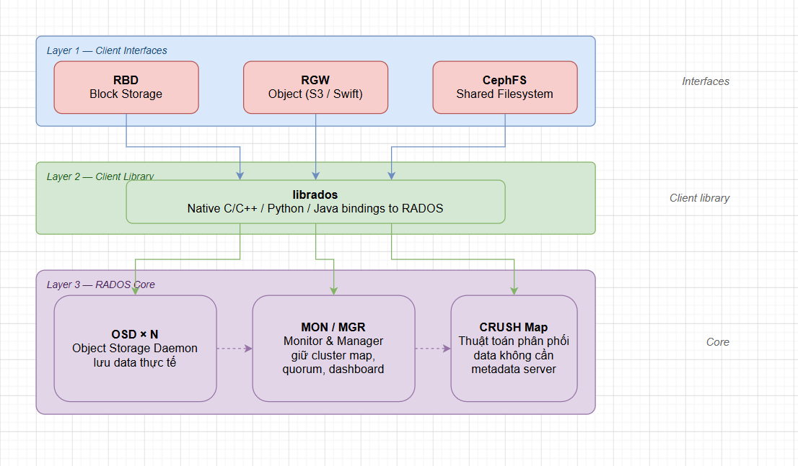

# OVERVIEW VỀ CEPH TRONG OPENSTACK

> **Phiên bản tham chiếu**: OpenStack **2026.1 Gazpacho** + Ceph **Squid (19.x)**



## I. CEPH LÀ GÌ, TẠI SAO DÙNG TRONG OPENSTACK

### 1. Ceph là gì ?

**Ceph** là một hệ thống lưu trữ phân tán mã nguồn mở, cung cấp **3 giao diện lưu trữ** trên một nền tảng duy nhất:

| Interface      | Giao thức                | Tích hợp OpenStack             |
|----------------|--------------------------|--------------------------------|
| Block Storage  | RBD (RADOS Block Device) | Cinder backend, Nova ephemeral |
| Object Storage | S3 / Swift API (qua RGW) | Swift thay thế hoặc song song  |
| File System    | CephFS (POSIX)           | Manila backend                 |

### 2. Tại sao dùng Ceph thay LVM/NFS

| Tiêu chí           | LVM / NFS truyền thống          | Ceph                               |
|--------------------|---------------------------------|------------------------------------|
| **Scale**          | Scale dọc (thêm disk cùng node) | Scale ngang (thêm OSD node bất kỳ) |
| **SPOF**           | Storage node chết = mất data    | Replication/EC tự heal             |
| **Multi-tenant**   | Phân vùng thủ công phức tạp     | Pool + namespace tách biệt sạch    |
| **Performance**    | Bị giới hạn bởi 1 node          | Striped parallel I/O qua nhiều OSD |
| **Live migration** | Cần shared storage thêm         | RBD native hỗ trợ live migrate     |
| **Snapshot/Clone** | Slow (LVM thin)                 | COW snapshot cực nhanh qua RBD     |

> **Trong OpenStack**: `Ceph RBD` là backend phổ biến nhất cho Cinder và Nova ephemeral disk từ bản Yoga trở đi vì hỗ trợ `librbd` native, không cần iSCSI.

## II. Các thành phần chính



### 1. MON — Monitor

- **Vai trò**: Giữ **Cluster Map** (monmap, osdmap, crushmap, mdsmap, pgmap) — bản đồ trạng thái toàn cluster.
- **Quorum**: Cần **số lẻ** MON (1, 3, 5) để đạt đồng thuận Paxos. Production tối thiểu **3 MON**.
- **Không lưu data**: MON chỉ lưu metadata trạng thái, không chứa data người dùng.
- **Ceph Squid**: MON sử dụng `cephadm` để tự bootstrap, thay thế hoàn toàn `ceph-deploy` cũ.

### 2. OSD — Object Storage Daemon

- **Vai trò**: Lưu trữ data thật sự. Mỗi disk (hoặc partition) = 1 OSD daemon.
- **Chức năng**: Nhận write từ client → lưu object → replication sang OSD peer → báo cáo trạng thái về MON.
- **Heartbeat**: Các OSD tự peer với nhau kiểm tra sức khoẻ, báo `up/down` về MON mà không qua trung gian.
- **Backend**: Mặc định dùng **BlueStore** (direct-to-block, không qua filesystem) từ Ceph Luminous trở đi → hiệu năng cao hơn FileStore cũ.

### 3. MGR — Manager

- **Vai trò**: Thu thập metrics, expose REST API, chạy các module mở rộng.
- **Module quan trọng**:
  - `dashboard` — Web UI quản lý cluster
  - `prometheus` — export metrics cho Prometheus/Grafana
  - `orchestrator` — tích hợp `cephadm` để deploy tự động
- **HA**: Cần ít nhất **2 MGR** (1 active, 1 standby).

### 4. MDS — Metadata Server

- **Vai trò**: Chỉ dùng cho **CephFS**, quản lý namespace (thư mục, inode, permission).
- **Không cần** nếu chỉ dùng RBD (Cinder/Nova) hoặc RGW (Object).

### 5. RGW — RADOS Gateway

- **Vai trò**: HTTP gateway cung cấp **S3-compatible** và **Swift-compatible** API trên nền RADOS.
- **Dùng trong OpenStack**: Thay thế hoặc bổ sung OpenStack Swift; Glance có thể dùng RGW làm image store.

## III. CRUSH MAP & THUẬT TOÁN CRUSH

### 1. CRUSH là gì ?

**CRUSH** (Controlled Replication Under Scalable Hashing) là thuật toán Ceph dùng để **tính toán vị trí lưu data** mà **không cần metadata server trung tâm**.

```text
Client biết:
  - Object name
  - Pool ID
  - Cluster Map (crushmap)

=> Client tự tính ra: OSD nào chứa object → ghi thẳng, không qua proxy
```

### Cấu trúc CRUSH Map

```text
root
 └── datacenter
      └── rack
           └── host
                └── OSD (leaf)
```

- **Bucket**: Mỗi node trong cây (root, datacenter, rack, host) gọi là bucket.
- **Rule**: Quy tắc CRUSH định nghĩa "chọn replica từ tầng nào" (ví dụ: mỗi replica phải ở **rack khác nhau**).

### Tại sao không cần metadata server

1. Client nhận **Cluster Map** từ MON lúc kết nối (chỉ 1 lần, rồi cache).
2. Mỗi lần đọc/ghi, client chạy thuật toán CRUSH **locally** → ra OSD ID.
3. Client giao tiếp **trực tiếp** với Primary OSD → Primary replication sang Secondary OSD.
4. MON chỉ cần cập nhật Cluster Map khi có thay đổi topology (OSD down/up, thêm node).

> **Lợi ích**: Không có bottleneck metadata, linear scale khi thêm OSD.

### Xem và chỉnh CRUSH Map

```bash
# Xem CRUSH map dạng text:
ceph osd crush tree

# Decompile crushmap để chỉnh:
ceph osd getcrushmap -o crushmap.bin
crushtool -d crushmap.bin -o crushmap.txt
# Chỉnh xong:
crushtool -c crushmap.txt -o crushmap-new.bin
ceph osd setcrushmap -i crushmap-new.bin
```

## IV. Pool, PG (Placement Group) & Replication

### 1. Pool

**Pool** là namespace logic trong Ceph, tương tự "bucket" hay "volume group". Mỗi pool có:

- **Replication factor** hoặc **Erasure Coding profile**
- **PG count** riêng
- **CRUSH rule** riêng (để điều khiển data đặt ở đâu)
- **Quota** (bytes/objects)

```bash
# Tạo pool replicated:
ceph osd pool create volumes 64
ceph osd pool set volumes size 3          # 3 replica

# Tạo pool erasure coding:
ceph osd erasure-code-profile set myec k=4 m=2
ceph osd pool create ec-pool 32 erasure myec
```

**Pool thường dùng với OpenStack**:

| Pool      | Dùng cho             |
|-----------|----------------------|
| `volumes` | Cinder RBD volumes   |
| `images`  | Glance images        |
| `vms`     | Nova ephemeral disks |
| `backups` | Cinder backups       |

### 2. PG — Placement Group

PG là đơn vị phân phối data bên trong pool:

```text
Object → hash(object_name) → PG ID → CRUSH → [OSD list]
```

- **Tại sao cần PG**: Thay vì map từng object → OSD (hàng triệu object), Ceph gom object vào ~vài trăm PG rồi map PG → OSD. Giúp rebalancing nhanh hơn khi thêm/bớt OSD.

- **PG count ảnh hưởng hiệu năng**:

| PG count | Vấn đề                                                    |
|----------|-----------------------------------------------------------|
| Quá thấp | Mỗi PG chứa quá nhiều data → recovery chậm, I/O không đều |
| Quá cao  | Overhead metadata lớn → RAM MON/OSD tốn nhiều             |

- **Công thức tính PG (Ceph docs)**:

```text
Total PGs = (OSDs × 100) / replica_count
Làm tròn lên số mũ 2 gần nhất (64, 128, 256...)

Ví dụ: 12 OSD, replica=3 → (12×100)/3 = 400 → làm tròn = 512
```

> Từ Ceph **Nautilus** trở đi có `pg_autoscaler` module tự điều chỉnh PG count.

```bash
# Bật autoscaler:
ceph mgr module enable pg_autoscaler
ceph osd pool set volumes pg_autoscale_mode on
```

### 3. Replication vs Erasure Coding

|                     | Replicated                               | Erasure Coding                                   |
|---------------------|------------------------------------------|--------------------------------------------------|
| **Cách hoạt động**  | Lưu N bản copy đầy đủ                    | Chia data thành k chunk + m parity chunk         |
| **Overhead**        | `size × data` (ví dụ 3× = 200% overhead) | `(k+m)/k × data` (ví dụ k=4,m=2 = 150% overhead) |
| **Hiệu năng read**  | Nhanh (đọc bất kỳ replica)               | Chậm hơn (cần reconstruct)                       |
| **Hiệu năng write** | Nhanh                                    | Chậm hơn (tính parity)                           |
| **Dùng cho**        | `volumes`, `images`, `vms`               | `backups`, cold storage                          |

## V. RADOS — LỚP LƯU TRỮ ĐỐI TƯỢNG NỀN

### 1. RADOS là gì ?

**RADOS** (Reliable Autonomic Distributed Object Store) là **lớp core** của Ceph — tất cả dịch vụ phía trên (RBD, RGW, CephFS) đều là client của RADOS.



### 2. RADOS làm gì

1. **Lưu object**: Mỗi object = `(pool, oid, data, xattrs, omap)`.
2. **Tự heal**: Khi OSD down, RADOS tự phát hiện PG thiếu replica → tự copy từ OSD còn lại (recovery/backfill).
3. **Tự rebalance**: Khi thêm OSD mới, RADOS tự di chuyển PG phân đều sang OSD mới (migration).
4. **Transaction**: Ghi atomically — write hoặc thành công hoàn toàn hoặc rollback.

### 3. librados — API trực tiếp

```python
# Python client giao tiếp thẳng với RADOS (ví dụ):
import rados

cluster = rados.Rados(conffile='/etc/ceph/ceph.conf')
cluster.connect()
ioctx = cluster.open_ioctx('volumes')
ioctx.write_full('my-object', b'hello ceph')
```

> **RBD** = librados + logic stripe object thành block device  
> **RGW** = librados + HTTP server + S3/Swift logic  
> **CephFS** = librados + MDS + POSIX VFS

## VI. TRẠNG THÁI CLUSTER: `HEALTH_OK` / `WARN` / `ERR`

### 1. Lệnh kiểm tra nhanh

```bash
# Tổng quan cluster:
ceph -s

# Chi tiết health:
ceph health detail

# Theo dõi real-time:
ceph -w

# Xem OSD status:
ceph osd stat
ceph osd tree

# Xem PG status:
ceph pg stat
ceph pg dump | grep -v "^pg_stat"
```

### 2. Đọc output `ceph -s`

```text
cluster:
  id:     <uuid>
  health: HEALTH_OK          ← trạng thái tổng

services:
  mon: 3 daemons, quorum a,b,c (age 2h)   ← 3 MON đang quorum
  mgr: a(active, since 2h), standbys: b   ← 1 MGR active, 1 standby
  osd: 12 osds: 12 up (since 2h), 12 in  ← tất cả OSD up và in cluster

data:
  pools:   4 pools, 256 pgs
  objects: 10.24k objects, 38 GiB
  usage:   115 GiB used, 485 GiB / 600 GiB avail
  pgs:     256 active+clean              ← tất cả PG đều OK
```

### Bảng các trạng thái quan trọng

| Trạng thái           | Ý nghĩa                                      | Hành động                     |
|----------------------|----------------------------------------------|-------------------------------|
| `HEALTH_OK`          | Cluster hoàn toàn ổn                         | Không cần làm gì              |
| `HEALTH_WARN`        | Có cảnh báo nhưng chưa mất                   | Check `ceph health detail`    |
| `HEALTH_ERR`         | Nghiêm trọng, có thể mất data                | Xử lý ngay                    |
| `active+clean`       | PG bình thường, đủ replica                   | OKE                           |
| `active+degraded`    | PG đang hoạt động nhưng thiếu                | OSD nào đó down, đang tự heal |
| `active+recovering`  | PG đang copy replica bị thiếu                | Đang tự fix, cần đợi          |
| `active+backfilling` | PG đang backfill sang OSD mới                | Đang rebalance                |
| `stale`              | PG không nhận được report từ OSD             | OSD primary down, nghiêm trọng|
| `undersized`         | Số replica < `min_size`                      | Cluster nguy hiểm             |
| `peering`            | PG đang thương lượng trạng thái giữa các OSD | Tạm thời, tự giải quyết       |

### Các WARN phổ biến và cách xử lý

```bash
# 1. POOL_NO_REDUNDANCY — pool chỉ có size=1 (không replica):
ceph health detail | grep POOL_NO_REDUNDANCY
ceph osd pool set <pool> size 3
ceph osd pool set <pool> min_size 2

# 2. OSD_DOWN — OSD bị down:
ceph health detail | grep OSD_DOWN
ceph osd tree | grep down
# Kiểm tra service OSD trên host:
systemctl status ceph-osd@<id>
journalctl -u ceph-osd@<id> -n 50

# 3. CLOCK_SKEW — Lệch thời gian giữa các node:
chronyc sources
timedatectl

# 4. PG_NOT_CLEAN — PG chưa về clean sau recovery:
ceph pg dump_stuck
ceph pg repair <pg-id>      # nếu có inconsistent

# 5. Nhiều HEALTH_WARN nhỏ (capacity warning):
ceph osd df                 # xem usage từng OSD
ceph osd set-nearfull-ratio 0.85
ceph osd set-full-ratio 0.95
```

## VII. Tích hợp Ceph với OpenStack (tóm tắt)

| OpenStack Service | Sử dụng Ceph như thế nào                                                      |
|-------------------|-------------------------------------------------------------------------------|
| **Cinder**        | RBD backend → volume = RBD image trong pool `volumes`                         |
| **Glance**        | RBD store → image = RBD image trong pool `images`                             |
| **Nova**          | Ephemeral disk = RBD image trong pool `vms`; live migrate không cần shared FS |
| **Manila**        | CephFS backend → share = CephFS directory                                     |
| **Swift**         | RGW thay thế hoặc chạy song song                                              |

> Chi tiết cài đặt tích hợp xem ở các lab tiếp theo.

## VIII. BLOCK STORAGE TRONG CEPH (RADOS BLOCK DEVICE - RBD)

### 1. Định nghĩa Block Storage

**Block Storage** (Lưu trữ dạng khối) là phương thức lưu trữ chia nhỏ dữ liệu thành các khối (blocks) có kích thước bằng nhau, mỗi khối hoạt động như một ổ đĩa cứng ảo độc lập.

Trong Ceph, Block Storage được triển khai qua giao thức **RBD (RADOS Block Device)**. Khi người dùng hoặc máy ảo tương tác với một ổ đĩa ảo RBD:

- Khối ảo được chia nhỏ (stripe) thành nhiều đối tượng nhỏ (mặc định là `4 MiB`).
- Các đối tượng này được phân tán đều và lưu trữ song song trên các OSD khác nhau dưới sự điều phối của thuật toán CRUSH.

### 2. Ưu thế vượt trội của Ceph RBD

- **Khả năng tự phục hồi (Self-Healing)**: Khi một OSD chứa block dữ liệu bị lỗi, Ceph tự động nhận diện và tái tạo (replicate) bản sao bị thiếu sang OSD lành lặn khác.

- **Copy-On-Write (COW) Snapshots và Clones**:

  - Hỗ trợ tạo ảnh chụp nhanh (Snapshot) tức thời mà không gây gián đoạn I/O hoặc suy hao hiệu năng.
  - Hỗ trợ clone nhanh (Thin Provisioning) từ snapshot, cho phép sinh ra hàng trăm ổ đĩa VM mới chỉ trong vài giây.

- **Tích hợp Native qua Driver (`librbd`)**:
  - Nova và Cinder giao tiếp trực tiếp với Ceph cluster qua thư viện C/C++ `librbd` được tích hợp sẵn trong QEMU/KVM.
  - Không cần sử dụng các giao thức trung gian như iSCSI hay Fibre Channel (FC), giúp giảm độ trễ (latency) và tránh nghẽn cổ chai băng thông
