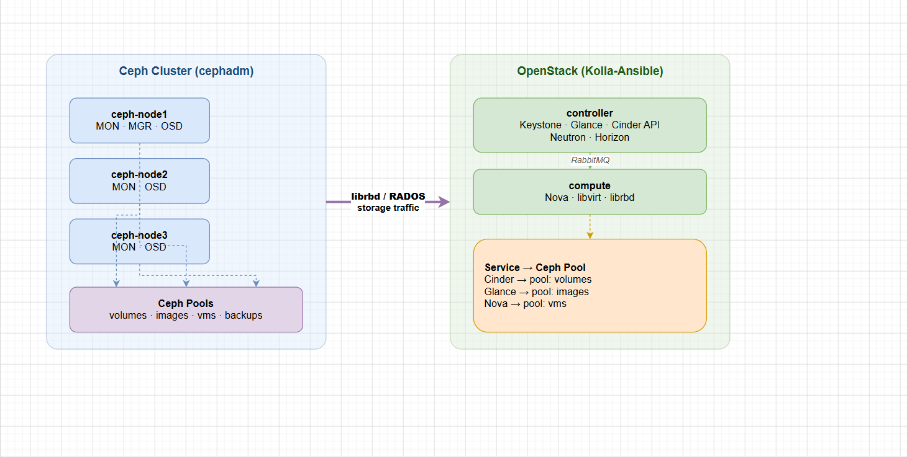

# LƯU Ý KHI CÀI ĐẶT VÀ TRIỂN KHAI CEPH TRONG OPENSTACK

> **Phiên bản tham chiếu**: OpenStack **2026.1 Gazpacho** + Ceph **Squid (19.x)**

## I. YÊU CẦU HẠ TẦNG

### 1. Network — Tách Public vs Cluster Network

Ceph yêu cầu **2 dải mạng riêng biệt**. Đây là điểm quan trọng nhất khi thiết kế hạ tầng:

| Network            | Vai trò                                            | Lưu lượng                                       |
|--------------------|----------------------------------------------------|-------------------------------------------------|
| **Public Network** | Client (OpenStack) ↔ OSD; MON ↔ Client             | Read/Write từ Cinder, Nova, Glance              |
| **Cluster Network**| OSD ↔ OSD (replication, recovery, heartbeat)       | Replication + Backfill/Recovery traffic         |

> **Tại sao phải tách?** Khi 1 OSD down và cluster recovery, lưu lượng replication giữa các OSD có thể đạt **hàng chục GB/s**. Nếu không tách, traffic recovery sẽ chèn ép client I/O → degraded performance toàn cluster.

**Ví dụ thiết kế mạng** cho 3-node Ceph tích hợp OpenStack:

```text
Node        Public Network     Cluster Network
─────────── ────────────────── ──────────────────
ceph-node1  10.0.0.11/24       192.168.10.11/24
ceph-node2  10.0.0.12/24       192.168.10.12/24
ceph-node3  10.0.0.13/24       192.168.10.13/24
controller  10.0.0.5/24        —
compute     10.0.0.6/24        —
```

### 2. Disk Layout

| Thành phần           | Khuyến nghị                                                                          |
|----------------------|--------------------------------------------------------------------------------------|
| **OS disk**          | Riêng biệt, không dùng chung với OSD                                                 |
| **OSD disk**         | **Không format**, để raw. Mỗi disk = 1 OSD. Dùng SSD/NVMe cho hot data, HDD cho cold |
| **BlueStore WAL/DB** | Nếu OSD là HDD, nên đặt BlueStore WAL + DB trên SSD riêng để tăng hiệu năng          |
| **MON disk**         | MON chỉ cần ~10 GB SSD cho `/var/lib/ceph/mon`                                       |

**BlueStore WAL/DB trên SSD** (tỉ lệ thực tế):

```text
WAL : ~1 GB / OSD
DB  : ~4% dung lượng OSD (ví dụ OSD 4TB → DB ~160 GB)
```

### 3. RAM / CPU tối thiểu

| Daemon | RAM tối thiểu | Khuyến nghị Production      |
|--------|---------------|-----------------------------|
| MON    | 2 GB          | 4 GB                        |
| MGR    | 1 GB          | 2 GB                        |
| OSD    | **1 GB / OSD**| 2–4 GB / OSD (tùy workload) |
| MDS    | 4 GB          | 8 GB (CephFS)               |
| RGW    | 1 GB          | 4 GB                        |

> **OSD RAM thực tế**: BlueStore cache mặc định chiếm **1/2 RAM available** trên host (tối đa). Node có 10 OSD cần ít nhất **10–20 GB RAM** chỉ riêng cho OSD.

**CPU**: Ceph không CPU-intensive nhưng:

- OSD: cần đủ thread để xử lý concurrent I/O — **2 core/OSD** là tối thiểu.
- MON: 2–4 core là đủ.
- RGW: nếu S3 workload nặng cần 4–8 core.

### 4. OS và Kernel

```text
OS khuyến nghị  : Ubuntu 22.04 LTS hoặc Rocky Linux 9
Kernel tối thiểu: 5.4+ (Ubuntu 22.04 đã có kernel 5.15)
Python          : 3.9+ (cephadm yêu cầu)
Docker/Podman   : Podman >= 4.0 (cephadm dùng container)
```

## II. CÀI BẰNG CEPHADM (CÁCH HIỆN ĐẠI)

> **cephadm** là tool chính thức từ Ceph Octopus trở đi. Từ Ceph **Quincy/Reef/Squid**, đây là **cách duy nhất được khuyến nghị** — `ceph-deploy` đã deprecated.

### 1. Chuẩn bị trên tất cả các node

```bash
# Trên TẤT CẢ Ceph nodes:

# Đồng bộ thời gian (BẮT BUỘC - MON quorum cần clock đồng bộ < 0.05s):
apt -y install chrony
systemctl enable --now chrony
chronyc tracking

# Tắt firewall hoặc mở port:
# MON: 3300, 6789 | OSD: 6800-7100 | MGR: 8443 (dashboard), 9283 (prometheus)
# RGW: 8080 | MDS: 6800+

# Cài Docker/Podman (cephadm dùng container):
apt -y install podman   # Ubuntu 22.04

# Thiết lập /etc/hosts để các node thấy nhau:
echo "10.0.0.11 ceph-node1" >> /etc/hosts
echo "10.0.0.12 ceph-node2" >> /etc/hosts
echo "10.0.0.13 ceph-node3" >> /etc/hosts
```

### 2. Cài cephadm và Bootstrap cluster

Thực hiện trên **node đầu tiên** (sẽ là MON đầu tiên):

```bash
# Tải cephadm:
curl --silent --remote-name --location \
  https://github.com/ceph/ceph/raw/squid/src/cephadm/cephadm

chmod +x cephadm

# Cài Ceph repo Squid:
./cephadm add-repo --release squid
./cephadm install

# Bootstrap cluster:
cephadm bootstrap \
  --mon-ip 10.0.0.11 \
  --cluster-network 192.168.10.0/24 \
  --initial-dashboard-user admin \
  --initial-dashboard-password Admin@123 \
  --allow-fqdn-hostname
```

**Output quan trọng sau bootstrap**:

```text
Ceph Dashboard is now available at:
         URL: https://10.0.0.11:8443/
        User: admin
    Password: Admin@123

You can access the Ceph CLI with:
    cephadm shell -- ceph -s
```

### 3. Add SSH key sang các node khác

```bash
# Copy SSH key của ceph user sang node2 và node3:
ssh-copy-id -f -i /etc/ceph/ceph.pub root@ceph-node2
ssh-copy-id -f -i /etc/ceph/ceph.pub root@ceph-node3

# Thêm host vào cluster:
ceph orch host add ceph-node2 10.0.0.12
ceph orch host add ceph-node3 10.0.0.13

# Kiểm tra:
ceph orch host ls
```

### 4. Add MON

```bash
# Tự động deploy MON theo label:
ceph orch host label add ceph-node1 mon
ceph orch host label add ceph-node2 mon
ceph orch host label add ceph-node3 mon

ceph orch apply mon --placement="label:mon"

# Hoặc chỉ định số lượng:
ceph orch apply mon 3

# Kiểm tra MON:
ceph mon stat
ceph quorum_status --format json-pretty | python3 -m json.tool
```

### 5. Add OSD

```bash
# Xem disk available trên tất cả node:
ceph orch device ls

# Add ALL available disk tự động (disk chưa có filesystem, chưa mount):
ceph orch apply osd --all-available-devices

# Hoặc chỉ định disk cụ thể:
ceph orch daemon add osd ceph-node1:/dev/sdb
ceph orch daemon add osd ceph-node2:/dev/sdb
ceph orch daemon add osd ceph-node3:/dev/sdb

# Kiểm tra OSD:
ceph osd stat
ceph osd tree
```

> **Lưu ý**: `--all-available-devices` sẽ claim **tất cả disk chưa dùng**. Nếu có disk OS partition dư, hãy chỉ định disk tường minh để tránh mất data.

### 6. Kiểm tra cluster sau cài

```bash
ceph -s
# Kỳ vọng: HEALTH_OK, tất cả OSD up, MON quorum đạt

ceph osd tree
ceph df
ceph pg stat
```

## III. CÀI BẰNG KOLLA-ANSIBLE + CEPH

> Kolla-Ansible từ bản **2024.1 (Caracal)** trở đi **không còn deploy Ceph nội bộ** — thay vào đó sử dụng **Ceph cluster độc lập** đã cài sẵn bằng cephadm, rồi tích hợp qua `ceph_external`.

### 1. Mô hình tích hợp



### 2. Chuẩn bị Ceph trước khi chạy Kolla

```bash
# Trên Ceph cluster, tạo sẵn pool và user (xem Mục IV chi tiết)
# Sau đó lấy keyring và ceph.conf:

ceph auth get client.cinder > /tmp/client.cinder.keyring
ceph auth get client.glance > /tmp/client.glance.keyring
ceph auth get client.nova   > /tmp/client.nova.keyring
ceph config generate-minimal-conf > /tmp/ceph.conf
```

### 3. Cấu hình Kolla-Ansible cho Ceph external

Trong file `globals.yml` của Kolla:

```yaml
# Bật Ceph external:
ceph_enable_external: "yes"

# Khai báo pool:
cinder_backend_ceph: "yes"
glance_backend_ceph: "yes"
nova_backend_ceph: "yes"

# Ceph pool names (phải khớp với pool đã tạo):
ceph_cinder_pool_name: "volumes"
ceph_cinder_backup_pool_name: "backups"
ceph_glance_pool_name: "images"
ceph_nova_pool_name: "vms"

# Ceph MON hosts (public network):
ceph_mon_hosts:
  - "10.0.0.11"
  - "10.0.0.12"
  - "10.0.0.13"
```

### 4. Copy Ceph credentials vào Kolla

```bash
# Copy vào thư mục config của Kolla:
cp /tmp/ceph.conf         /etc/kolla/config/ceph.conf
cp /tmp/client.cinder.keyring /etc/kolla/config/cinder/
cp /tmp/client.glance.keyring /etc/kolla/config/glance/
cp /tmp/client.nova.keyring   /etc/kolla/config/nova/

# Deploy:
kolla-ansible -i inventory deploy
```

## IV. TẠO POOL VÀ USER CHO OPENSTACK

### 1. Tạo Pool

```bash
# Trên Ceph cluster (node có ceph CLI):

# Pool cho Cinder block volumes:
ceph osd pool create volumes 64
ceph osd pool application enable volumes rbd

# Pool cho Glance images:
ceph osd pool create images 32
ceph osd pool application enable images rbd

# Pool cho Nova ephemeral disk:
ceph osd pool create vms 32
ceph osd pool application enable vms rbd

# Pool cho Cinder backup:
ceph osd pool create backups 32
ceph osd pool application enable backups rbd

# Init RBD trên từng pool (BẮT BUỘC trước khi dùng):
rbd pool init volumes
rbd pool init images
rbd pool init vms
rbd pool init backups

# Kiểm tra:
ceph osd lspools
```

> **PG count**: Số `64` và `32` ở trên là ví dụ cho lab nhỏ. Production cần tính theo công thức `(OSDs × 100) / replica_count` hoặc bật `pg_autoscaler`.

### 2. Tạo User (Keyring) cho từng service

```bash
# User cho Cinder (quyền đọc/ghi pool volumes + vms + images):
ceph auth get-or-create client.cinder \
  mon 'profile rbd' \
  osd 'profile rbd pool=volumes, profile rbd pool=vms, profile rbd-read-only pool=images' \
  mgr 'profile rbd pool=volumes, profile rbd pool=vms'

# User cho Glance (quyền đọc/ghi pool images):
ceph auth get-or-create client.glance \
  mon 'profile rbd' \
  osd 'profile rbd pool=images' \
  mgr 'profile rbd pool=images'

# User cho Nova (quyền đọc/ghi pool vms + đọc images):
ceph auth get-or-create client.nova \
  mon 'profile rbd' \
  osd 'profile rbd pool=vms, profile rbd-read-only pool=images' \
  mgr 'profile rbd pool=vms'

# User cho Cinder backup:
ceph auth get-or-create client.cinder-backup \
  mon 'profile rbd' \
  osd 'profile rbd pool=backups' \
  mgr 'profile rbd pool=backups'
```

### 3. Export keyring ra file và copy sang OpenStack nodes

```bash
# Export keyring:
ceph auth get client.cinder     -o /etc/ceph/ceph.client.cinder.keyring
ceph auth get client.glance     -o /etc/ceph/ceph.client.glance.keyring
ceph auth get client.nova       -o /etc/ceph/ceph.client.nova.keyring
ceph auth get client.cinder-backup -o /etc/ceph/ceph.client.cinder-backup.keyring

# Copy sang Controller (Cinder API, Glance):
scp /etc/ceph/ceph.conf                       root@controller:/etc/ceph/
scp /etc/ceph/ceph.client.cinder.keyring      root@controller:/etc/ceph/
scp /etc/ceph/ceph.client.glance.keyring      root@controller:/etc/ceph/
scp /etc/ceph/ceph.client.cinder-backup.keyring root@controller:/etc/ceph/

# Copy sang Compute (Nova, Cinder Volume):
scp /etc/ceph/ceph.conf                  root@compute:/etc/ceph/
scp /etc/ceph/ceph.client.cinder.keyring root@compute:/etc/ceph/
scp /etc/ceph/ceph.client.nova.keyring   root@compute:/etc/ceph/
```

### 4. Phân quyền file trên OpenStack nodes

```bash
# Trên Controller và Compute:
chown cinder:cinder /etc/ceph/ceph.client.cinder.keyring
chown glance:glance /etc/ceph/ceph.client.glance.keyring
chown nova:nova     /etc/ceph/ceph.client.nova.keyring
chmod 0640 /etc/ceph/ceph.client.*.keyring
```

### 5. Kiểm tra kết nối từ OpenStack node ra Ceph

```bash
# Trên Controller, test bằng user cinder:
rbd --id cinder --keyring /etc/ceph/ceph.client.cinder.keyring ls volumes

# Trên Compute, test bằng user nova:
rbd --id nova --keyring /etc/ceph/ceph.client.nova.keyring ls vms

# Kết quả rỗng hoặc có danh sách volume là kết nối OKE
```

## V. CEPH DASHBOARD & CLI CƠ BẢN

### 1. Ceph Dashboard (Web UI)

Từ Ceph **Nautilus** trở đi, Dashboard được tích hợp sẵn qua MGR module:

```bash
# Bật Dashboard:
ceph mgr module enable dashboard

# Tạo SSL certificate (self-signed cho lab):
ceph dashboard create-self-signed-cert

# Tạo admin user:
echo "Admin@123" > /tmp/pass.txt
ceph dashboard ac-user-create admin -i /tmp/pass.txt administrator
rm /tmp/pass.txt

# Kiểm tra URL:
ceph mgr services
# Output: {"dashboard": "https://10.0.0.11:8443/"}
```

**Truy cập**: `https://10.0.0.11:8443` → Đăng nhập `admin / Admin@123`

Dashboard cung cấp:

- Tổng quan cluster health, IOPS, throughput real-time
- Quản lý OSD, Pool, RBD image, CephFS
- Logs, alerts tích hợp
- Tích hợp Prometheus/Grafana

### 2. CLI cơ bản thường dùng

```bash
# ─── CLUSTER OVERVIEW ───────────────────────────────────
ceph -s                          # Tổng quan nhanh
ceph -w                          # Theo dõi event real-time
ceph health detail               # Chi tiết WARN/ERR

# ─── OSD ────────────────────────────────────────────────
ceph osd stat                    # Số OSD up/in/out
ceph osd tree                    # Sơ đồ cây OSD
ceph osd df                      # Dung lượng từng OSD
ceph osd perf                    # IOPS/latency từng OSD
ceph osd find <id>               # OSD đang ở host nào

# ─── POOL ───────────────────────────────────────────────
ceph df                          # Dung lượng toàn cluster + từng pool
ceph osd lspools                 # Danh sách pool
ceph osd pool stats volumes      # Stats pool volumes
ceph osd pool get volumes all    # Xem tất cả setting của pool

# ─── PG ─────────────────────────────────────────────────
ceph pg stat                     # Tổng PG và trạng thái
ceph pg dump_stuck               # PG bị stuck (inactive/unclean)

# ─── RBD IMAGE ──────────────────────────────────────────
rbd ls volumes                   # Liệt kê image trong pool volumes
rbd info volumes/<image-id>      # Thông tin image
rbd du volumes                   # Dung lượng thực dùng (dedup aware)
rbd snap ls volumes/<image-id>   # Snapshot của image

# ─── RADOS (Object level) ───────────────────────────────
rados -p volumes ls              # Liệt kê tất cả object trong pool
rados -p volumes stat <obj>      # Thông tin object

# ─── AUTH ────────────────────────────────────────────────
ceph auth ls                     # Tất cả keyring
ceph auth get client.cinder      # Xem keyring cụ thể

# ─── CAPACITY MONITORING ─────────────────────────────────
ceph osd df tree                 # Dung lượng theo cấu trúc cây
ceph osd dump | grep full        # Xem ngưỡng full ratio
```

### 3. Tích hợp Prometheus + Grafana (khuyến nghị)

```bash
# Bật module Prometheus trên MGR:
ceph mgr module enable prometheus

# Kiểm tra endpoint metrics:
curl http://10.0.0.11:9283/metrics | head -30

# Cấu hình Prometheus scrape (trên Prometheus server):
# scrape_configs:
#   - job_name: 'ceph'
#     static_configs:
#       - targets: ['10.0.0.11:9283', '10.0.0.12:9283', '10.0.0.13:9283']
```

Import Grafana dashboard ID **2842** (Ceph Cluster) và **5336** (Ceph OSD) để có dashboard đẹp sẵn.

## VI. CÁC LỖI PHỔ BIẾN KHI TRIỂN KHAI

| Lỗi                                                 | Nguyên nhân                               | Fix                                           |
|-----------------------------------------------------|-------------------------------------------|-----------------------------------------------|
| MON không đạt quorum                                | Clock skew > 0.05s                        | Sync NTP toàn cluster                         |
| OSD không join cluster                              | Disk có partition cũ / filesystem         | `wipefs -a /dev/sdX` rồi thêm lại             |
| `HEALTH_WARN: too few PGs`                          | PG count quá thấp cho số object           | Tăng PG hoặc bật `pg_autoscaler`              |
| `rbd: couldn't connect to the cluster`              | Sai keyring path hoặc ceph.conf           | Kiểm tra `/etc/ceph/` trên OpenStack node     |
| Cinder volume stuck `creating`                      | Cinder-volume không kết nối được Ceph     | Check log `/var/log/cinder/cinder-volume.log` |
| `HEALTH_WARN: mons are allowing insecure global_id` | Ceph Octopus+ security policy             | `ceph config set mon auth_allow_insecure_global_id_reclaim false` |
