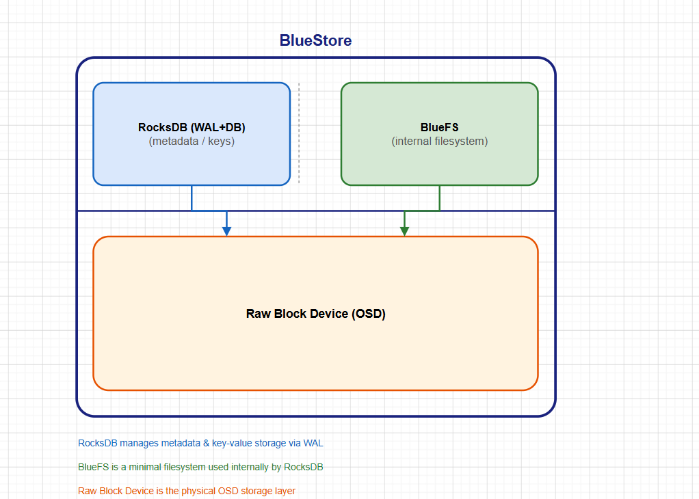
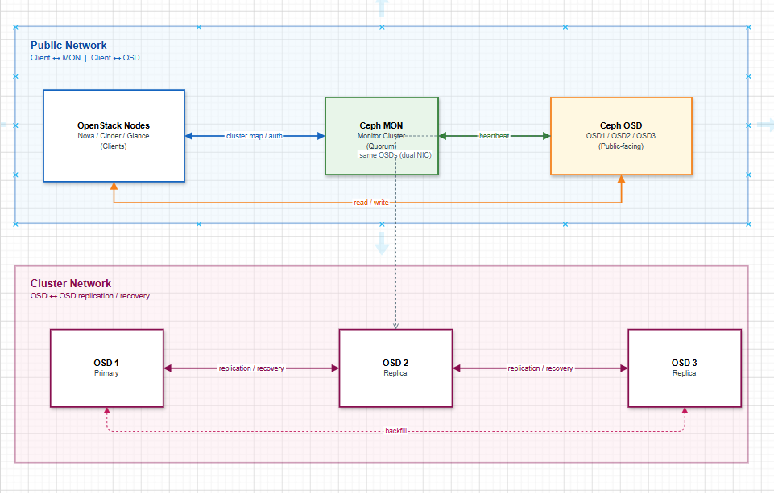

# TỐI ƯU HOÁ HIỆU NĂNG CEPH TRONG OPENSTACK

> **Phiên bản tham chiếu**: OpenStack **2026.1 Gazpacho** + Ceph **Squid (19.x)**

## I. REPLICATION VS ERASURE CODING — TRADE-OFF

### 1. Tổng quan

Ceph cung cấp 2 chiến lược lưu trữ dữ liệu chính cho pool:

| Tiêu chí              | Replicated Pool              | Erasure Coded Pool (EC)             |
|-----------------------|------------------------------|-------------------------------------|
| Cơ chế                | Nhân bản N bản sao           | Chia dữ liệu thành k+m chunks       |
| Overhead dung lượng   | `size × dung lượng gốc`      | `(k+m)/k × dung lượng gốc`          |
| Ví dụ (3 replica)     | 1 TB → tốn 3 TB              | k=4, m=2 → 1 TB tốn 1.5 TB          |
| Read latency          | Thấp (đọc từ 1 OSD)          | Thấp với partial reads              |
| Write latency         | Thấp                         | Cao hơn (cần encode/decode)         |
| Phù hợp cho           | Block (RBD), metadata-heavy  | Object (RGW), cold data, archive    |
| Hỗ trợ RBD            | Đầy đủ                       |  Chỉ với pool tiered (EC data pool) |
| Recovery speed        | Nhanh                        | Chậm hơn khi mất OSD                |

### 2. Cấu hình Replicated Pool

```bash
# Tạo pool replicated với 3 replica (mặc định):
ceph osd pool create volumes 128 128 replicated

# Đặt số replica:
ceph osd pool set volumes size 3          # Tổng số bản sao
ceph osd pool set volumes min_size 2      # Số bản sao tối thiểu để I/O tiếp tục

# Kiểm tra:
ceph osd pool get volumes size
ceph osd pool get volumes min_size
```

> **`min_size 2`**: Đảm bảo cluster vẫn phục vụ I/O khi 1 OSD chết, tránh dừng hoàn toàn.

### 3. Cấu hình Erasure Coded Pool

```bash
# Tạo EC profile k=4, m=2 (chịu được mất tối đa 2 OSD):
ceph osd erasure-code-profile set ec-4-2 \
  k=4 m=2 \
  plugin=jerasure \
  technique=reed_sol_van

# Kiểm tra profile:
ceph osd erasure-code-profile get ec-4-2

# Tạo EC pool:
ceph osd pool create ec-cold-data 64 64 erasure ec-4-2

# Bật overwrites (bắt buộc nếu muốn dùng với RBD):
ceph osd pool set ec-cold-data allow_ec_overwrites true
```

### 4. Cấu hình EC Pool cho RBD (Tiered approach)

Với Ceph Squid, RBD hỗ trợ EC pool qua cơ chế **data pool + replicated metadata pool**:

```bash
# Pool replicated làm metadata:
ceph osd pool create volumes-meta 32 32 replicated

# Pool EC làm data:
ceph osd pool create volumes-ec 64 64 erasure ec-4-2
ceph osd pool set volumes-ec allow_ec_overwrites true

# Áp dụng cho RBD namespace:
rbd pool init volumes-meta
```

Trong `cinder.conf`:

```ini
[ceph]
rbd_pool = volumes-meta
rbd_data_pool = volumes-ec
```

### 5. Khi nào chọn gì?

```text
RBD (Cinder volumes, Nova disks) → Replicated (size 3)
Glance images                    → Replicated (size 3) hoặc EC với overwrites
RGW object (cold/archive)        → EC k=4,m=2 (tiết kiệm 50% dung lượng)
CephFS metadata                  → Replicated (KHÔNG dùng EC)
CephFS data                      → EC (tùy workload)
```

## II. BLUESTORE & ROCKSDB TUNING

### 1. Kiến trúc BlueStore

BlueStore là storage engine mặc định từ Ceph Luminous, thay thế FileStore hoàn toàn trong Squid:



- **RocksDB**: Lưu metadata của object (key-value store)
- **WAL** (Write-Ahead Log): Journal ngắn hạn cho RocksDB
- **DB**: RocksDB database files (SST files)
- **Data**: Dữ liệu object thực tế

### 2. Tách WAL/DB ra NVMe để tăng IOPS

Đây là kỹ thuật quan trọng nhất với BlueStore: đặt WAL và DB lên thiết bị **nhanh hơn** (NVMe) trong khi data ở HDD/SSD thường.

```bash
# Khi deploy OSD mới với cephadm, chỉ định db-devices:
ceph orch daemon add osd \
  --method raw \
  ceph-node1:/dev/sdb \          # Data device (HDD)
  --db-devices /dev/nvme0n1 \    # DB trên NVMe
  --wal-devices /dev/nvme0n1     # WAL trên NVMe (cùng hoặc khác NVMe)
```

**Quy tắc kích thước DB device**:

```text
DB size per OSD = 4% × capacity của OSD data device
Ví dụ: OSD data = 4TB HDD → DB = ~160 GB NVMe
1 NVMe 1TB → có thể làm DB cho ~6 OSD 4TB
```

> Nếu DB quá nhỏ, BlueStore sẽ **spill** DB về data device → mất lợi thế NVMe.

### 3. Tuning BlueStore cache

```bash
# Xem cấu hình cache hiện tại:
ceph config show osd.0 | grep bluestore_cache

# Tăng cache BlueStore (mặc định: 1GB với HDD, 3GB với SSD/NVMe):
ceph config set osd bluestore_cache_size_hdd  4294967296   # 4GB
ceph config set osd bluestore_cache_size_ssd  8589934592   # 8GB

# Tỉ lệ cache cho data vs metadata:
ceph config set osd bluestore_cache_meta_ratio 0.01   # 1% cho metadata
ceph config set osd bluestore_cache_kv_ratio   0.99   # 99% cho KV (RocksDB)
```

### 4. RocksDB compaction tuning

```bash
# Tăng số luồng compaction (giảm write stall):
ceph config set osd bluestore_rocksdb_options \
  "compression=kNoCompression,max_write_buffer_number=4,\
min_write_buffer_number_to_merge=1,recycle_log_file_num=4,\
write_buffer_size=268435456,writable_file_max_buffer_size=0,\
compaction_readahead_size=2097152"
```

### 5. Bật compression BlueStore

```bash
# Bật compression cho pool (tiết kiệm dung lượng ~20-40% với text/log data):
ceph osd pool set volumes compression_mode aggressive
ceph osd pool set volumes compression_algorithm snappy   # snappy = nhanh, zstd = nén nhiều hơn
ceph osd pool set volumes compression_min_blob_size 8192

# Kiểm tra tỉ lệ nén thực tế:
ceph osd pool stats volumes | grep compress
```

### 6. Kiểm tra BlueStore health

```bash
# Xem thống kê BlueStore của OSD:
ceph daemon osd.0 perf dump | grep bluestore

# Kiểm tra fragmentation (nên < 0.7):
ceph daemon osd.0 bluestore fragmentation

# Kiểm tra DB spill (nếu > 0 = DB quá nhỏ):
ceph daemon osd.0 perf dump | grep "bluefs_db_used_bytes"
```

## III. NETWORK TÁCH BIỆT PUBLIC/CLUSTER

### 1. Tại sao cần 2 network riêng?



**Lợi ích tách biệt**:

- Replication traffic (tốn bandwidth lớn) **không ảnh hưởng** tới client I/O.
- Recovery khi OSD chết không làm chậm Cinder/Glance/Nova.
- Tăng cường bảo mật: client không trực tiếp thấy cluster network.

**Khuyến nghị bandwidth**:

- Public network: **10 GbE** tối thiểu, 25 GbE production
- Cluster network: **10 GbE** tối thiểu, 25 GbE hoặc RDMA production

### 2. Cấu hình trong ceph.conf

```bash
nano /etc/ceph/ceph.conf
```

```ini
[global]
fsid = <cluster-fsid>
mon_host = 10.0.0.11, 10.0.0.12, 10.0.0.13

# Public network: Client giao tiếp với Ceph
public_network = 10.0.0.0/24

# Cluster network: OSD replication nội bộ
cluster_network = 192.168.10.0/24

# Messenger v2 (mặc định Squid, bảo mật hơn v1):
ms_bind_msgr2 = true
ms_cluster_mode = secure
ms_service_mode = secure
```

### 3. Áp dụng qua cephadm (không sửa file thủ công)

```bash
# Cephadm quản lý ceph.conf — dùng config key-value store:
ceph config set global public_network 10.0.0.0/24
ceph config set global cluster_network 192.168.10.0/24

# Verify:
ceph config get mon public_network
ceph config get osd cluster_network

# Restart daemon để nhận cấu hình mới:
ceph orch restart osd
ceph orch restart mon
```

### 4. Messenger v2 và encryption

Ceph Squid mặc định dùng **Messenger v2** với hỗ trợ encryption:

```bash
# Kiểm tra kết nối đang dùng v1 hay v2:
ceph mon stat
# Output: mon_host dạng [v2:10.0.0.11:3300,v1:10.0.0.11:6789]

# Bật encryption cho cluster network (production):
ceph config set global ms_cluster_mode secure
ceph config set global ms_service_mode secure
ceph config set global ms_client_mode secure

# Kiểm tra trạng thái kết nối:
ceph daemon mon.ceph-node1 sessions | grep mode
```

### 5. Tối ưu network kernel parameters

```bash
# Trên TẤT CẢ Ceph nodes, thêm vào /etc/sysctl.conf:
cat >> /etc/sysctl.conf << 'EOF'
# Ceph network tuning
net.core.rmem_max = 134217728
net.core.wmem_max = 134217728
net.ipv4.tcp_rmem = 4096 87380 134217728
net.ipv4.tcp_wmem = 4096 65536 134217728
net.core.netdev_max_backlog = 250000
net.ipv4.tcp_no_metrics_save = 1
net.ipv4.tcp_congestion_control = bbr
EOF

sysctl -p
```

## IV. PG AUTOSCALER

### 1. PG là gì và tại sao quan trọng?

**Placement Group (PG)** là đơn vị phân phối dữ liệu trong Ceph:

```text
Object → Hash → PG → CRUSH → OSD(s)
```

- Quá ít PG → OSD bị hotspot, phân phối không đều.
- Quá nhiều PG → tốn RAM (mỗi PG tốn ~10KB RAM trên MON + OSD).
- **PG Autoscaler** (mặc định ON từ Ceph Nautilus) tự động điều chỉnh.

### 2. Kiểm tra trạng thái PG Autoscaler

```bash
# Xem trạng thái autoscaler tất cả pool:
ceph osd pool autoscale-status

# Output mẫu:
# POOL        SIZE  TARGET SIZE  RATE  RAW CAPACITY  RATIO  TARGET RATIO  EFFECTIVE RATIO  BIAS  PG_NUM  NEW PG_NUM  AUTOSCALE
# volumes     500G             3.0        10T         0.15                          0.15   1.0     128             on
# images       50G             3.0        10T         0.015                         0.015  1.0      32          16  on
```

### 3. Cấu hình PG Autoscaler

```bash
# Bật autoscaler toàn cluster (mặc định đã bật trong Squid):
ceph mgr module enable pg_autoscaler

# Đặt chế độ autoscale cho pool:
# - 'on'      : tự động scale PG không cần hỏi
# - 'warn'    : chỉ cảnh báo, không tự scale
# - 'off'     : tắt hoàn toàn
ceph osd pool set volumes pg_autoscale_mode on
ceph osd pool set images  pg_autoscale_mode on
ceph osd pool set vms     pg_autoscale_mode on

# Đặt mặc định cho pool mới tạo:
ceph config set global osd_pool_default_pg_autoscale_mode on
```

### 4. Target ratio — Phân bổ dung lượng theo tỉ lệ

```bash
# Thay vì chỉ định PG count, chỉ định % dung lượng pool sẽ dùng:
# volumes sẽ chiếm 60% tổng cluster capacity:
ceph osd pool set volumes target_size_ratio 0.6

# images chiếm 20%:
ceph osd pool set images target_size_ratio 0.2

# vms chiếm 20%:
ceph osd pool set vms target_size_ratio 0.2

# Hoặc target dung lượng tuyệt đối (Ceph tính PG từ đó):
ceph osd pool set volumes target_size_bytes 5497558138880   # 5 TB
```

### 5. Bulk flag cho pool lớn

```bash
# Pool lớn (chiếm > 50% cluster) → bật bulk để PG scale sớm hơn:
ceph osd pool set volumes bulk true

# Kiểm tra lại:
ceph osd pool autoscale-status
```

### 6. Giám sát PG health

```bash
# Xem tổng số PG và trạng thái:
ceph pg stat

# Xem PG bị stuck (không healthy):
ceph pg dump_stuck

# Xem phân phối PG trên OSD (lý tưởng: đều nhau ±10%):
ceph osd df tree

# Kiểm tra CRUSH map có phân phối đều không:
ceph osd crush tree --show-shadow
```

## V. BENCHMARK VỚI FIO + RADOS BENCH

### 1. Tổng quan chiến lược benchmark

```text
Mục tiêu: Đo IOPS / Throughput / Latency thực tế để:
  - Baseline trước khi tuning
  - So sánh sau khi tuning
  - Phát hiện bottleneck (network, OSD, CPU)

Công cụ:
  rados bench  → Đo trực tiếp Ceph (không qua librbd/kernel)
  rbd bench    → Đo qua RBD layer (gần với Cinder/Nova hơn)
  fio + krbd   → Đo qua kernel RBD map (thực tế nhất cho block)
  fio + librbd → Đo qua librbd (ioengine=rbd)
```

### 2. rados bench — Benchmark tầng RADOS

```bash
# Write throughput (sequential, 4MB objects, 30 giây):
rados bench -p volumes 30 write \
  --no-cleanup \
  -b 4194304 \
  --concurrent-ios 16

# Sequential Read:
rados bench -p volumes 30 seq \
  --concurrent-ios 16

# Random Read:
rados bench -p volumes 30 rand \
  --concurrent-ios 16

# Dọn dẹp sau benchmark:
rados -p volumes cleanup

# Output mẫu (HDD 3-node cluster):
# Bandwidth (MB/sec):    350.xx
# Average IOPS:          87
# Average Latency:       0.18 s
```

### 3. rbd bench — Benchmark qua RBD layer

```bash
# Tạo image test:
rbd create --size 10240 volumes/bench-test --image-feature layering

# Write IOPS (4K random):
rbd bench volumes/bench-test \
  --io-type write \
  --io-size 4096 \
  --io-threads 16 \
  --io-total 10G \
  --io-pattern rand

# Read IOPS (4K random):
rbd bench volumes/bench-test \
  --io-type read \
  --io-size 4096 \
  --io-threads 16 \
  --io-total 10G \
  --io-pattern rand

# Sequential Write throughput (1M):
rbd bench volumes/bench-test \
  --io-type write \
  --io-size 1048576 \
  --io-threads 4 \
  --io-total 10G \
  --io-pattern seq

# Xóa image sau test:
rbd rm volumes/bench-test
```

### 4. fio + librbd — Benchmark thực tế cho Cinder/Nova

```bash
# Cài fio:
apt install -y fio

# Tạo RBD image:
rbd create --size 20480 volumes/fio-test --image-feature layering

# File cấu hình fio (4K random read/write mix):
cat > /tmp/fio-ceph-rbd.ini << 'EOF'
[global]
ioengine=rbd
clientname=admin
pool=volumes
rbdname=fio-test
rw=randrw
rwmixread=70
bs=4k
iodepth=64
numjobs=4
runtime=60
time_based=1
group_reporting=1

[job1]
name=ceph-rbd-bench
EOF

# Chạy fio:
fio /tmp/fio-ceph-rbd.ini

# Output mẫu:
# READ:  IOPS=12.5k, BW=48.8MiB/s
# WRITE: IOPS=5350,  BW=20.9MiB/s
# lat (nsec): min=250k, max=85M, avg=3.2M

# Dọn dẹp:
rbd rm volumes/fio-test
```

### 5. fio qua kernel RBD map — Gần với production nhất

```bash
# Map RBD image ra block device:
rbd create --size 20480 volumes/fio-krbd --image-feature layering
rbd map volumes/fio-krbd --id admin
# → /dev/rbd0

# Chạy fio trên block device:
fio --name=rbd-krbd-test \
    --filename=/dev/rbd0 \
    --ioengine=libaio \
    --direct=1 \
    --rw=randrw \
    --rwmixread=70 \
    --bs=4k \
    --iodepth=64 \
    --numjobs=4 \
    --runtime=60 \
    --time_based \
    --group_reporting

# Unmap sau test:
rbd unmap /dev/rbd0
rbd rm volumes/fio-krbd
```

### 6. Bảng so sánh trước/sau tuning

Ghi lại kết quả vào bảng sau để theo dõi hiệu quả tuning:

| Chỉ số               | Trước Tuning | Sau Tuning | Thay đổi |
|----------------------|--------------|------------|----------|
| 4K Rand Write IOPS   | -            | -          | -        |
| 4K Rand Read IOPS    | -            | -          | -        |
| Seq Write BW (MB/s)  | -            | -          | -        |
| Seq Read BW (MB/s)   | -            | -          | -        |
| Avg Write Latency    | -            | -          | -        |
| Avg Read Latency     | -            | -          | -        |

### 7. Phân tích bottleneck từ kết quả

```bash
# Trong khi fio chạy, monitor Ceph ở terminal khác:

# Xem throughput realtime:
ceph -w

# Xem latency per OSD:
ceph osd perf

# Xem OSD nào đang bị chậm (slow ops):
ceph health detail | grep slow

# Xem iostat của disk OSD:
iostat -x 2 /dev/sdb /dev/sdc /dev/sdd

# Xem CPU usage của OSD process:
top -p $(pgrep -d',' ceph-osd)

# Xem network throughput:
iftop -i eth0   # hoặc nload eth0
```

### 8. Script benchmark tự động

```bash
#!/bin/bash
# /usr/local/bin/ceph-bench.sh
# Chạy benchmark đầy đủ và xuất kết quả

POOL="volumes"
IMAGE="bench-auto"
DATE=$(date +%Y%m%d-%H%M)
RESULT="/tmp/ceph-bench-${DATE}.txt"

echo "=== Ceph Benchmark ${DATE} ===" | tee $RESULT

# 1. rados bench write:
echo -e "\n[1] RADOS Write (4MB, 30s):" | tee -a $RESULT
rados bench -p $POOL 30 write --no-cleanup -b 4194304 --concurrent-ios 16 \
  2>&1 | grep -E "Bandwidth|IOPS|Latency" | tee -a $RESULT

# 2. rados bench seq read:
echo -e "\n[2] RADOS Sequential Read (30s):" | tee -a $RESULT
rados bench -p $POOL 30 seq --concurrent-ios 16 \
  2>&1 | grep -E "Bandwidth|IOPS|Latency" | tee -a $RESULT

# 3. rados bench rand read:
echo -e "\n[3] RADOS Random Read (30s):" | tee -a $RESULT
rados bench -p $POOL 30 rand --concurrent-ios 16 \
  2>&1 | grep -E "Bandwidth|IOPS|Latency" | tee -a $RESULT

rados -p $POOL cleanup

# 4. rbd bench:
rbd create --size 10240 ${POOL}/${IMAGE} --image-feature layering 2>/dev/null
echo -e "\n[4] RBD 4K Random Write IOPS:" | tee -a $RESULT
rbd bench ${POOL}/${IMAGE} \
  --io-type write --io-size 4096 --io-threads 16 \
  --io-total 1G --io-pattern rand 2>&1 | grep -E "IOPS|elapsed" | tee -a $RESULT

echo -e "\n[5] RBD 4K Random Read IOPS:" | tee -a $RESULT
rbd bench ${POOL}/${IMAGE} \
  --io-type read --io-size 4096 --io-threads 16 \
  --io-total 1G --io-pattern rand 2>&1 | grep -E "IOPS|elapsed" | tee -a $RESULT

rbd rm ${POOL}/${IMAGE}

echo -e "\n=== Kết quả lưu tại: $RESULT ==="
```
