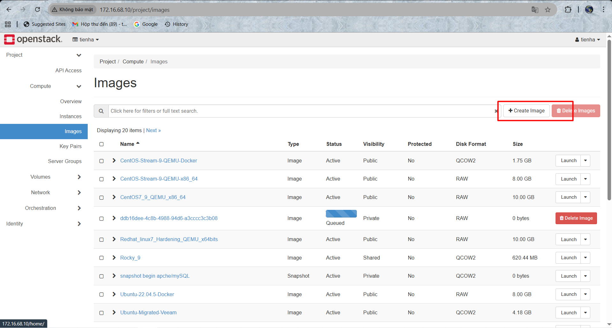
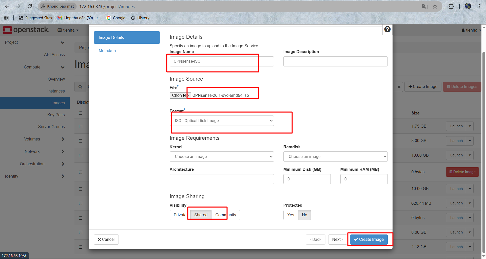
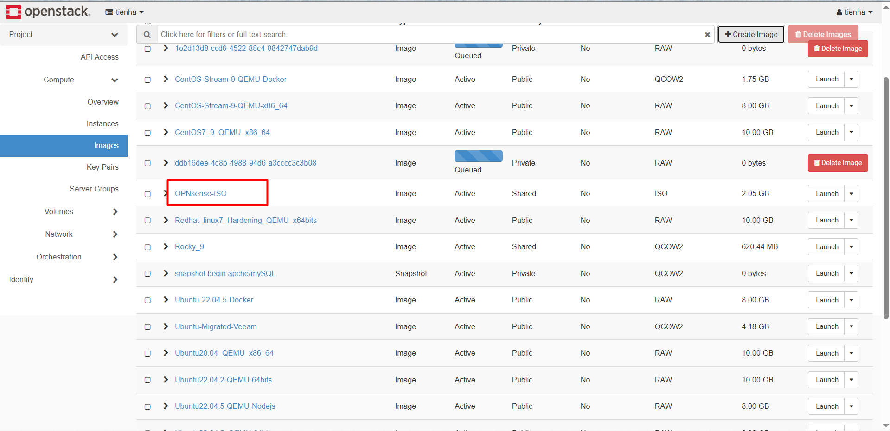

# BUILD MÔI TRƯỜNG CÀI OPNSENSE

## 1. Chuẩn bị

- Một cụm OpenStack để lab  
- Tải bộ cài OPNsense (bản dvd/nano, kiến trúc amd64).

## 2. MỤC TIÊU

- Dùng Openstack tạo máy ảo, gắn ISO OPNsense.

## 3. CÁC BƯỚC

Vào Dashboard:

```bash
Project → Compute → Images → Create Image
```



Điền:

- Image Name: OPNsense-ISO
- Image Source: File (`nano`/`dvd`)
- File: chọn file `.iso`
- Format: ISO
- Visibility: Public (hoặc Private)

Nhấn `Create Image`

- Đợi upload xong (Status = `Active`)

Kết quả:




