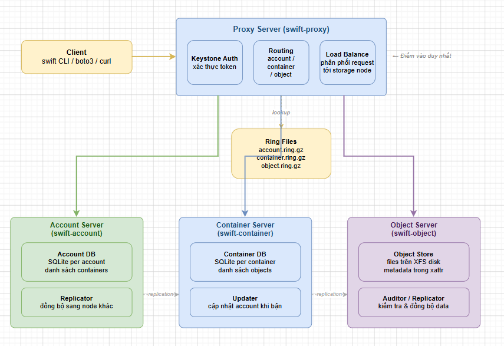
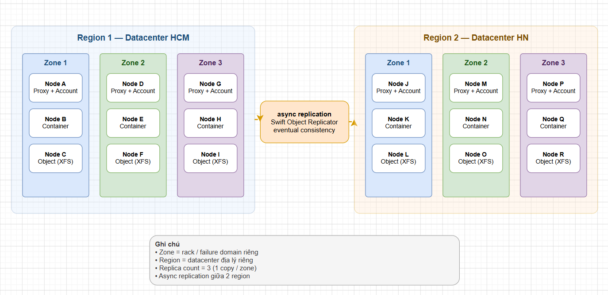
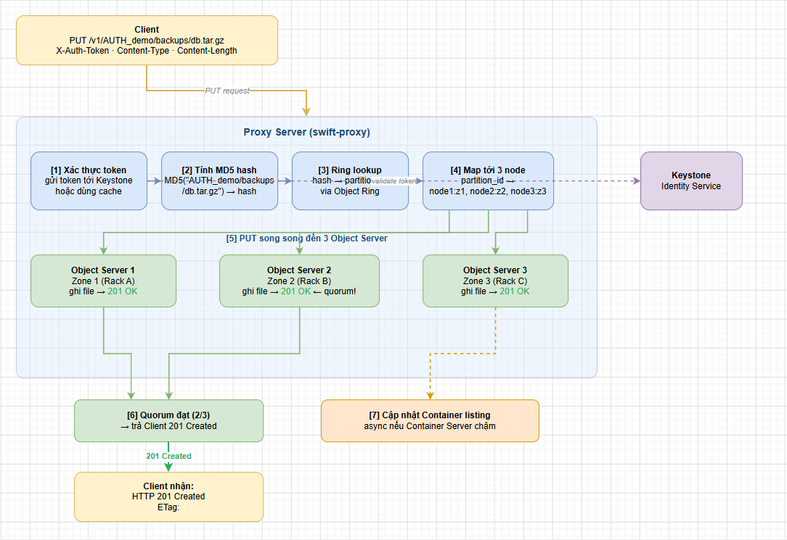
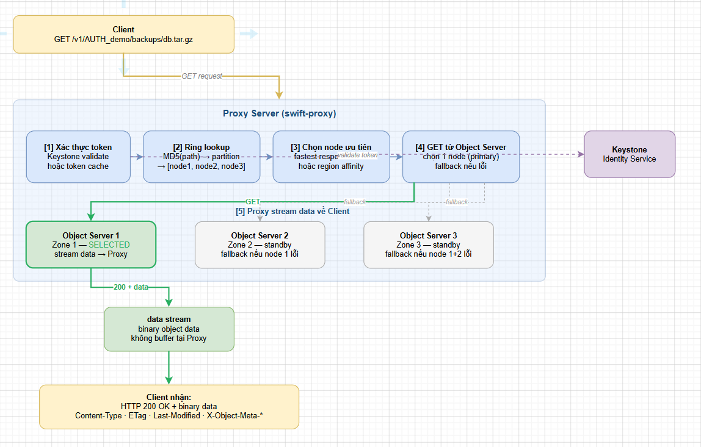
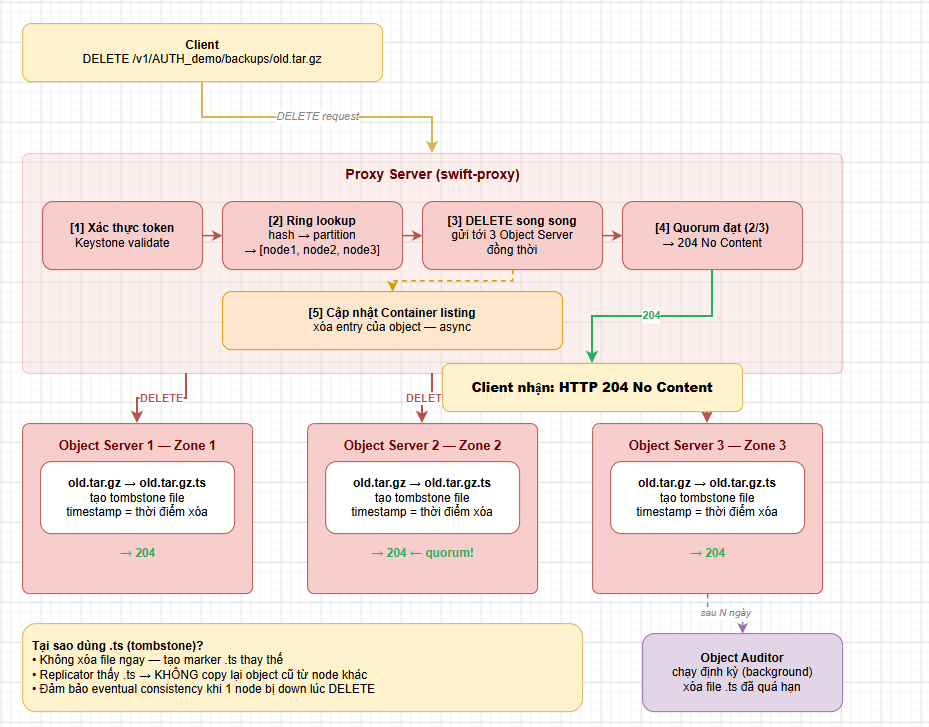
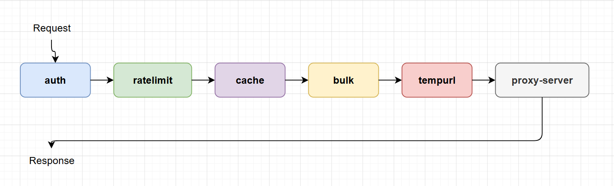

# TÌM HIỂU TỔNG QUAN OPENSTACK SWIFT

> **Phiên bản tham chiếu**: OpenStack **2026.1 Gazpacho** + Swift **2.34.x**

## I. SWIFT LÀ GÌ, DÙNG ĐỂ LÀM GÌ?

### 1. Định nghĩa

**OpenStack Swift** là dịch vụ **Object Storage** của OpenStack — lưu trữ dữ liệu dưới dạng các **object** (không phải file hay block), truy cập hoàn toàn qua **HTTP REST API**.

Mỗi object trong Swift được định vị bởi một URL:

```text
http://<proxy>:<port>/v1/<account>/<container>/<object>

Ví dụ:
http://swift.lab.local:8080/v1/AUTH_demo/backups/db-dump-2026.tar.gz
```

- **Account**: Tương đương tenant/project trong OpenStack Keystone.
- **Container**: Tương đương bucket trong S3 — namespace chứa object.
- **Object**: Dữ liệu thực tế (binary) kèm metadata.

### 2. So sánh Swift với Cinder và Manila

| Tiêu chí             | Cinder (Block)               | Manila (File)                | Swift (Object)                     |
|----------------------|------------------------------|------------------------------|------------------------------------|
| **Đơn vị dữ liệu**   | Block (raw disk)             | File trong thư mục           | Object (data + metadata + URL)     |
| **Giao thức**        | iSCSI, librbd                | NFS, CIFS, CephFS            | HTTP/S (Swift API, S3-compatible)  |
| **Cách truy cập**    | Mount vào VM như disk        | Mount thư mục qua mạng       | curl / boto3 / openstack CLI       |
| **POSIX**            | Có (qua filesystem)          | Có                           | Không                              |
| **Scale**            | Theo host                    | Theo NFS server              | Ngang hàng petabyte                |
| **Metadata**         | Rất ít                       | inode attributes             | Tùy biến không giới hạn            |
| **Latency**          | Thấp (ms)                    | Trung bình                   | Cao hơn (HTTP overhead)            |
| **Dùng cho**         | VM disk, database            | Shared workspace, home dir   | Backup, media, log, archive, CDN   |
| **Tính nhất quán**   | Strong                       | Strong                       | Eventual consistency               |

### 3. Use case phù hợp với Swift

```text
PHÙ HỢP:
  - Backup & archive: Cinder volume backup, database dump, snapshot
  - Static asset: ảnh, video, tài liệu cho web/app
  - Log aggregation: ship log từ nhiều node vào container tập trung
  - Data lake / AI-ML dataset: lưu training data quy mô lớn
  - CDN origin: Swift + middleware staticweb serve file tĩnh
  - Cross-region replication: multi-region Swift cluster
  - Disaster recovery: backup offsite qua HTTP

KHÔNG PHÙ HỢP:
  - Database cần random read/write byte-level → dùng Cinder RBD
  - Shared workspace cần POSIX lock → dùng Manila CephFS
  - VM ephemeral disk → dùng Nova + Ceph RBD
  - Latency < 5ms → dùng Block Storage
```

## II. CÁC THÀNH PHẦN CHÍNH

### 1. Tổng quan kiến trúc



### 2. Proxy Server (swift-proxy)

- **Vai trò**: Điểm vào duy nhất cho tất cả request từ client.

- **Chức năng**:

  - Xác thực request với **Keystone** (hoặc middleware `tempauth` cho lab).
  - Dùng **Ring** để tính ra node nào chứa account/container/object cần thiết.
  - Chuyển tiếp request đến Storage Node tương ứng.
  - Xử lý **quorum write**: ghi đủ số replica (mặc định 2/3) mới trả về `201 Created`.
  - Chạy **WSGI middleware pipeline** (auth, ratelimit, tempurl...).

- **HA**: Triển khai nhiều Proxy Node phía sau Load Balancer (HAProxy / Nginx).

- **Stateless**: Proxy không lưu state → dễ scale ngang.

```bash
# Service:
systemctl status swift-proxy

# Config:
/etc/swift/proxy-server.conf
```

### 3. Account Server (swift-account)

- **Vai trò**: Quản lý danh sách **container** thuộc về một **account** (project).

- **Lưu trữ**: SQLite database — mỗi account = 1 file `.db`.

- **Cung cấp**:

  - `GET /v1/<account>` → liệt kê container.
  - `HEAD /v1/<account>` → metadata (số container, bytes used).
  - `PUT` / `DELETE` account (admin).

```bash
systemctl status swift-account swift-account-replicator swift-account-auditor
/etc/swift/account-server.conf
```

### 4. Container Server (swift-container)

- **Vai trò**: Quản lý danh sách **object** trong một container.

- **Lưu trữ**: SQLite database — mỗi container = 1 file `.db`.

- **Cung cấp**:

  - `GET /v1/<account>/<container>` → liệt kê object.
  - `PUT` container (tạo mới), `DELETE` (xóa khi rỗng).
  - Container metadata: ACL, quota, versioning policy.

```bash
systemctl status swift-container swift-container-replicator swift-container-auditor
/etc/swift/container-server.conf
```

### 5. Object Server (swift-object)

- **Vai trò**: Lưu trữ **data thực tế** của object trên disk.
- **Lưu trữ**: File thông thường trên filesystem (`XFS` khuyến nghị) — không dùng database.
- **Cấu trúc path trên disk**:

```text
/srv/node/<device>/objects/<partition>/<suffix>/<hash>/<timestamp>.data
                                                       /<timestamp>.meta
                                                       /<timestamp>.ts   (tombstone khi xóa)
```

- **Chức năng phụ trợ**:

  - `swift-object-replicator`: Nhân bản object sang node khác.
  - `swift-object-auditor`: Định kỳ đọc lại object để phát hiện bit-rot.
  - `swift-object-updater`: Cập nhật container listing khi container server tạm unavailable.
  - `swift-object-expirer`: Xóa object hết hạn (`X-Delete-At`).

```bash
systemctl status swift-object swift-object-replicator swift-object-auditor
/etc/swift/object-server.conf
```

### 6. Bảng tóm tắt các thành phần

| Thành phần                | Lưu trữ              | Số lượng bản sao | Daemon phụ trợ                                                    |
|---------------------------|----------------------|------------------|-------------------------------------------------------------------|
| **Proxy Server**          | Không (stateless)    | N/A              | -                                                                 |
| **Account Server**        | SQLite (.db)         | 3 (theo ring)    | account-replicator, account-auditor                               |
| **Container Server**      | SQLite (.db)         | 3 (theo ring)    | container-replicator, container-auditor, container-updater        |
| **Object Server**         | File trên XFS        | 3 (theo ring)    | object-replicator, object-auditor, object-updater, object-expirer |

## III. RING — TRÁI TIM CỦA SWIFT

### 1. Ring là gì?

**Ring** là cơ chế Swift dùng để **tính toán vị trí lưu trữ** của mọi dữ liệu mà **không cần metadata server trung tâm** — tương tự CRUSH Map trong Ceph.

Swift có **3 Ring riêng biệt**:

| Ring              | Quản lý gì                              |
|-------------------|-----------------------------------------|
| **Account Ring**  | Account → Storage Node nào              |
| **Container Ring**| Container → Storage Node nào            |
| **Object Ring**   | Object → Storage Node nào               |

### 2. Cơ chế hoạt động của Ring

```text
Bước 1: Hash
  MD5(account/container/object) → 32-bit hash value

Bước 2: Partition
  hash >> (32 - partition_power) → partition ID
  (partition_power=10 → 2^10 = 1024 partitions)

Bước 3: Lookup Ring
  Ring table: partition_id → [device_1, device_2, device_3]
  → Biết đúng 3 device (trên 3 node khác nhau) chứa data

Bước 4: Build path
  device → IP:port + disk path → URL trực tiếp đến Object Server
```

### 3. Cấu trúc Ring file

```bash
# 3 file ring (binary, nằm trên tất cả node):
/etc/swift/account.ring.gz
/etc/swift/container.ring.gz
/etc/swift/object.ring.gz

# Xem thông tin ring:
swift-ring-builder /etc/swift/object.builder

# Output mẫu:
# object.builder, build version 5
# 1024 partitions, 3.000000 replicas, 1 regions, 3 zones, 6 devices, 0.00 balance
# The minimum number of hours before a partition can be reassigned is 1 (0:00:00 remaining)
# Devices:   id region zone   ip address:port replication ip:port  name weight partitions balance
#             0      1    1  10.0.0.21:6200   10.0.0.21:6200        sdb 100.00        512   0.00
#             1      1    2  10.0.0.22:6200   10.0.0.22:6200        sdb 100.00        512   0.00
#             2      1    3  10.0.0.23:6200   10.0.0.23:6200        sdb 100.00        512   0.00
```

### 4. Xây dựng Ring (thiết lập ban đầu)

```bash
# Tạo object ring (partition_power=10, replicas=3, min_part_hours=1):
swift-ring-builder /etc/swift/object.builder create 10 3 1

# Thêm device vào ring (zone 1, 2, 3 — mỗi zone trên 1 host):
swift-ring-builder /etc/swift/object.builder add \
  --region 1 --zone 1 --ip 10.0.0.21 --port 6200 \
  --replication-ip 10.0.0.21 --replication-port 6200 \
  --device sdb --weight 100

swift-ring-builder /etc/swift/object.builder add \
  --region 1 --zone 2 --ip 10.0.0.22 --port 6200 \
  --replication-ip 10.0.0.22 --replication-port 6200 \
  --device sdb --weight 100

swift-ring-builder /etc/swift/object.builder add \
  --region 1 --zone 3 --ip 10.0.0.23 --port 6200 \
  --replication-ip 10.0.0.23 --replication-port 6200 \
  --device sdb --weight 100

# Rebalance ring (phân phối partition vào device):
swift-ring-builder /etc/swift/object.builder rebalance

# Tương tự cho account và container ring:
swift-ring-builder /etc/swift/account.builder   create 10 3 1
swift-ring-builder /etc/swift/container.builder create 10 3 1
# (thêm device và rebalance tương tự)

# Copy ring files sang tất cả node:
scp /etc/swift/*.ring.gz root@10.0.0.22:/etc/swift/
scp /etc/swift/*.ring.gz root@10.0.0.23:/etc/swift/
```

### 5. Thêm node mới và rebalance

```bash
# Khi thêm node mới (storage node 4):
swift-ring-builder /etc/swift/object.builder add \
  --region 1 --zone 4 --ip 10.0.0.24 --port 6200 \
  --replication-ip 10.0.0.24 --replication-port 6200 \
  --device sdb --weight 100

# Rebalance: Swift tự phân phối lại partition không cần downtime:
swift-ring-builder /etc/swift/object.builder rebalance

# Kiểm tra balance (lý tưởng: gần 0.00):
swift-ring-builder /etc/swift/object.builder

# Distribute ring mới sang tất cả node:
scp /etc/swift/object.ring.gz root@10.0.0.2{1..4}:/etc/swift/
```

## IV. ZONES, REGIONS & REPLICATION

### 1. Zone — Cô lập lỗi

**Zone** là đơn vị cô lập lỗi vật lý trong Swift. Swift đảm bảo các replica của cùng 1 object **không bao giờ nằm trong cùng 1 zone**.

```text
Ví dụ replica_count=3, 3 zones:

Zone 1 (Rack A)          Zone 2 (Rack B)          Zone 3 (Rack C)
┌──────────────┐         ┌──────────────┐         ┌──────────────┐
│  Object.data │         │  Object.data │         │  Object.data │
│  (replica 1) │         │  (replica 2) │         │  (replica 3) │
└──────────────┘         └──────────────┘         └──────────────┘
→ Rack A cháy → 2 replica còn lại vẫn đủ serve read
```

**Cấu trúc zone điển hình**:

| Zone | Phạm vi vật lý                     |
|------|------------------------------------|
| 1    | Server/Rack riêng (môi trường nhỏ) |
| 1    | Cả 1 rack (datacenter nhỏ)         |
| 1    | Cả 1 row rack (datacenter lớn)     |
| 1    | Cả 1 tòa nhà / phòng máy chủ       |

### 2. Region — Multi-datacenter

**Region** là đơn vị địa lý — thường là 1 datacenter hoặc availability zone cấp cao.



- Mỗi region có ring riêng.
- Swift `swift-object-replicator` tự động đồng bộ giữa regions.
- Ưu tiên đọc từ region gần nhất (affinity).

### 3. Replica count và Quorum

```text
Replica count = 3 (mặc định khuyến nghị)

Write quorum = ceil(replicas / 2) + 1 = 2
→ Ghi thành công khi ít nhất 2/3 replica ghi OK → trả 201

Read quorum = 1
→ Đọc từ bất kỳ replica nào còn sống
```

```bash
# Xem replica count hiện tại:
swift-ring-builder /etc/swift/object.builder | grep replicas

# Thay đổi replica count (cần rebalance sau):
swift-ring-builder /etc/swift/object.builder set_replicas 3
swift-ring-builder /etc/swift/object.builder rebalance
```

### 4. Eventual Consistency — Cơ chế tự heal

Swift theo mô hình **eventual consistency**:

```text
Client PUT object → Proxy ghi replica 1, 2 thành công (quorum) → 201 Created
                    (replica 3 tạm unavailable)
                            ↓
              Object Replicator chạy background
                            ↓
              Phát hiện replica 3 thiếu → tự copy sang
                            ↓
              Sau vài giây/phút: 3 replica đồng bộ → consistent
```

**Replicator hoạt động**:

```bash
# Replicator chạy liên tục (mặc định mỗi 30s):
systemctl status swift-object-replicator

# Xem log replication:
tail -f /var/log/swift/object-replicator.log

# Cấu hình interval:
# /etc/swift/object-server.conf
[object-replicator]
run_pause = 30          # giây nghỉ giữa các lần chạy
concurrency = 1         # số thread replication đồng thời
```

## V. LUỒNG REQUEST END-TO-END

### 1. PUT Object — Ghi dữ liệu



### 2. GET Object — Đọc dữ liệu



**Xử lý khi node lỗi trong GET**:

```text
Proxy thử node 1 → timeout/error
  → Tự động fallback thử node 2 → thành công → stream về client
  (client không biết có lỗi xảy ra)
```

### 3. DELETE Object



### 4. Large Object — Xử lý file lớn

Swift có giới hạn single object mặc định **5 GB**. Với file lớn hơn, dùng **Static Large Object (SLO)** hoặc **Dynamic Large Object (DLO)**:

```bash
# Upload file > 5GB với SLO qua openstack CLI:
openstack object create \
  --segment-size 1073741824 \    # chunk 1GB mỗi segment
  backups \
  large-backup-100gb.tar.gz

# Hoặc dùng swift CLI:
swift upload \
  --segment-size 1G \
  --use-slo \
  backups large-backup-100gb.tar.gz

# Cơ chế:
# 1. File được chia thành nhiều segment (chunk)
# 2. Mỗi segment upload vào container riêng (<container>_segments)
# 3. Tạo manifest object mô tả thứ tự các segment
# 4. GET manifest → Proxy tự ghép các segment → trả về file hoàn chỉnh
```

## VI. MIDDLEWARE PIPELINE

### 1. WSGI Pipeline là gì?

Swift Proxy Server chạy trên nền **WSGI** và xử lý request qua một **chuỗi middleware** (pipeline) — mỗi middleware xử lý một chức năng riêng trước khi chuyển sang middleware tiếp theo.



### 2. Cấu hình pipeline

```ini
# /etc/swift/proxy-server.conf

[pipeline:main]
pipeline = catch_errors gatekeeper healthcheck proxy-logging cache \
           listing_formats bulk tempurl ratelimit authtoken \
           keystoneauth staticweb copy container-quotas \
           account-quotas slo dlo versioned_writes symlink \
           proxy-logging proxy-server
```

### 3. Các middleware quan trọng

#### a. authtoken + keystoneauth — Xác thực Keystone

```ini
[filter:authtoken]
paste.filter_factory = keystonemiddleware.auth_token:filter_factory
www_authenticate_uri = http://controller:5000
auth_url = http://controller:5000
memcached_servers = controller:11211
auth_type = password
project_domain_id = default
user_domain_id = default
project_name = service
username = swift
password = Tien123
delay_auth_decision = True

[filter:keystoneauth]
use = egg:swift#keystoneauth
operator_roles = admin, user
reseller_admin_role = ResellerAdmin
```

#### b. tempurl — URL tạm thời không cần auth

Cho phép tạo URL download/upload có thời hạn mà không cần token:

```bash
# Tạo tempurl key cho account:
openstack object store account set \
  --property Temp-URL-Key=mysecretkey123

# Tạo tempurl download (hết hạn sau 3600 giây):
swift tempurl GET 3600 \
  /v1/AUTH_demo/backups/db.tar.gz \
  mysecretkey123

# Output: /v1/AUTH_demo/backups/db.tar.gz?temp_url_sig=<sig>&temp_url_expires=<epoch>

# Client download không cần token:
curl "http://swift.lab.local:8080/v1/AUTH_demo/backups/db.tar.gz?temp_url_sig=...&temp_url_expires=..."
```

#### c. staticweb — Static website hosting

```bash
# Bật static web cho container:
openstack object store account set --property X-Account-Meta-Temp-URL-Key=key

# Cấu hình container làm web:
swift post backups \
  -m "X-Container-Meta-Web-Index: index.html" \
  -m "X-Container-Meta-Web-Listings: true" \
  -m "X-Container-Read: .r:*"    # public read

# Truy cập: http://swift.lab.local:8080/v1/AUTH_demo/backups/
```

#### d. ratelimit — Giới hạn request

```ini
[filter:ratelimit]
use = egg:swift#ratelimit
clock_accuracy = 1000
max_sleep_time_seconds = 60
log_sleep_time_seconds = 0
rate_buffer_seconds = 5

# Giới hạn số request/giây per account:
account_ratelimit = 200

# Giới hạn per container:
container_ratelimit_0 = 100
container_ratelimit_10 = 50
```

#### e. bulk — Bulk operations

```bash
# Upload nhiều file cùng lúc (tar archive):
tar -czf files.tar.gz file1 file2 file3

curl -X PUT \
  -H "X-Auth-Token: <token>" \
  -H "Content-Type: application/tar" \
  --data-binary @files.tar.gz \
  "http://swift.lab.local:8080/v1/AUTH_demo/backups?extract-archive=tar.gz"

# Xóa nhiều object cùng lúc (bulk delete):
cat > delete-list.txt << EOF
backups/old1.tar.gz
backups/old2.tar.gz
backups/old3.tar.gz
EOF

curl -X DELETE \
  -H "X-Auth-Token: <token>" \
  -H "Content-Type: text/plain" \
  --data-binary @delete-list.txt \
  "http://swift.lab.local:8080/v1/AUTH_demo?bulk-delete"
```

#### f. versioned_writes — Object versioning

```bash
# Bật versioning cho container (lưu lịch sử các phiên bản object):
openstack container create backups-versions   # container lưu version cũ

swift post backups \
  -H "X-Versions-Location: backups-versions"

# Mỗi lần PUT object mới → version cũ tự động move sang backups-versions
# DELETE object → restore về version cũ nhất

# Xem các version:
swift list backups-versions
```

### 4. Bảng tóm tắt middleware

| Middleware          | Chức năng                                          | Khi nào dùng                    |
|---------------------|----------------------------------------------------|---------------------------------|
| `authtoken`         | Validate Keystone token                            | Luôn luôn (production)          |
| `keystoneauth`      | Map role Keystone → quyền Swift                    | Luôn luôn (production)          |
| `tempurl`           | URL download/upload tạm thời không cần auth        | Chia sẻ file với bên ngoài      |
| `staticweb`         | Serve container như static website                 | CDN, landing page, docs         |
| `ratelimit`         | Giới hạn request/giây per account/container        | Chống abuse, multi-tenant       |
| `bulk`              | Bulk upload (tar) và bulk delete                   | Migration, ETL pipeline         |
| `slo`               | Static Large Object — file > 5GB                   | Backup lớn, media               |
| `dlo`               | Dynamic Large Object — append-only segments        | Log streaming                   |
| `versioned_writes`  | Lưu lịch sử version của object                     | Document management             |
| `copy`              | Server-side copy object giữa container             | Clone object không re-upload    |
| `container-quotas`  | Giới hạn dung lượng / số object per container      | Multi-tenant isolation          |
| `account-quotas`    | Giới hạn dung lượng per account                    | Multi-tenant billing            |
| `symlink`           | Object là symlink trỏ đến object khác              | Alias, deduplication            |