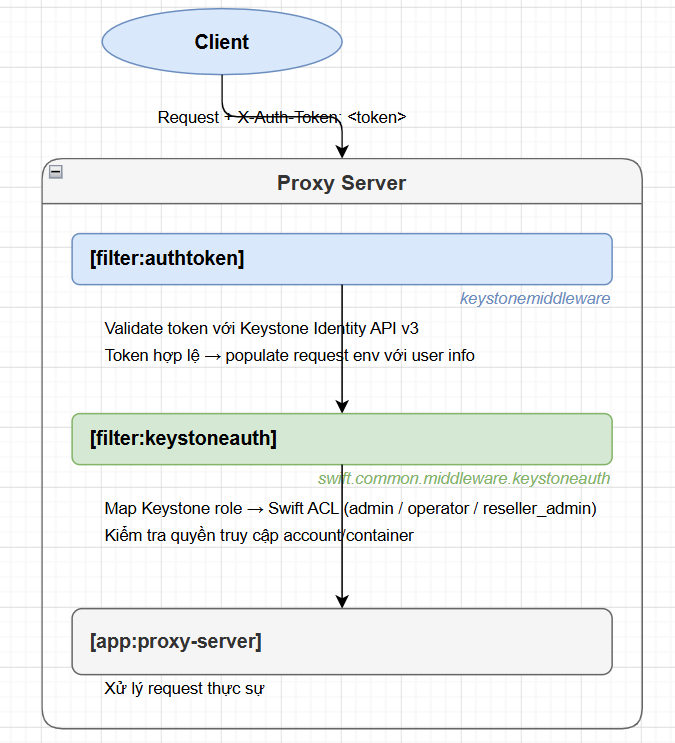

# TÍCH HỢP KEYSTONE AUTH CHO SWIFT

> **Phiên bản tham chiếu**: OpenStack **2026.1 Gazpacho** + Swift **2.34.x**

## I. SWIFT + KEYSTONE AUTH MIDDLEWARE

### 1. Tổng quan luồng xác thực



### 2. Tạo Swift service user và endpoint trong Keystone

```bash
source /root/admin-openrc

# Tạo user swift trong project service:
openstack user create --domain default --password Tien123 swift
openstack role add --project service --user swift admin

# Tạo service object-store:
openstack service create \
  --name swift \
  --description "OpenStack Object Storage" \
  object-store

# Tạo endpoint (thay controller bằng IP/hostname thực):
openstack endpoint create --region RegionOne \
  object-store public \
  "http://controller:8080/v1/AUTH_%(project_id)s"

openstack endpoint create --region RegionOne \
  object-store internal \
  "http://controller:8080/v1/AUTH_%(project_id)s"

openstack endpoint create --region RegionOne \
  object-store admin \
  "http://controller:8080/v1"

# Verify:
openstack endpoint list --service object-store
```

> **`%(project_id)s`** trong URL endpoint: Keystone tự động thay bằng project ID của user đang request — mỗi project được cô lập hoàn toàn trong Swift.

### 3. Cấu hình authtoken trong `proxy-server.conf`

```ini
# /etc/swift/proxy-server.conf

[filter:authtoken]
paste.filter_factory = keystonemiddleware.auth_token:filter_factory

# Keystone endpoint:
www_authenticate_uri = http://controller:5000
auth_url = http://controller:5000

# Memcache để cache token (giảm load Keystone):
memcached_servers = controller:11211
token_cache_time = 300       # Cache token 5 phút

# Credentials của swift service user:
auth_type = password
project_domain_id = default
user_domain_id = default
project_name = service
username = swift
password = Tien123

# QUAN TRỌNG: delay_auth_decision = True
# Cho phép request không có token đi qua (để middleware khác xử lý, ví dụ tempurl)
delay_auth_decision = True

# Service token (Swift gọi nội bộ sang Keystone/Cinder):
service_token_roles = service
service_token_roles_required = True

# Logging:
log_name = swift
```

### 4. Cấu hình keystoneauth trong `proxy-server.conf`

```ini
[filter:keystoneauth]
use = egg:swift#keystoneauth

# Role được phép thực hiện thao tác thông thường (PUT/GET/DELETE object):
operator_roles = admin, user, member, swiftoperator

# Role có quyền admin trên toàn bộ Swift (xem/sửa account bất kỳ):
reseller_admin_role = ResellerAdmin

# Cho phép service token bypass auth (Nova, Cinder gọi Swift nội bộ):
allow_overrides = True

# Cho phép user tự tạo account Swift của họ:
# (cần account_autocreate = True trong proxy-server)
```

### 5. Cấu hình proxy-server để hỗ trợ Keystone

```ini
[app:proxy-server]
use = egg:swift#proxy

# Tự động tạo Swift account khi project Keystone chưa có account Swift:
account_autocreate = True

# Cho phép admin quản lý account qua API:
allow_account_management = True
```

### 6. Pipeline hoàn chỉnh với Keystone

```ini
[pipeline:main]
pipeline = catch_errors gatekeeper healthcheck proxy-logging cache \
           listing_formats bulk tempurl ratelimit authtoken \
           keystoneauth staticweb copy container-quotas \
           account-quotas slo dlo versioned_writes symlink \
           proxy-logging proxy-server
```

> **Thứ tự pipeline quan trọng**: `tempurl` phải đứng **trước** `authtoken` để URL tạm thời không cần token vẫn hoạt động. `authtoken` phải đứng **trước** `keystoneauth`.

## II. SWIFT ROLES: ADMIN, OPERATOR, RESELLER_ADMIN

### 1. Phân cấp quyền trong Swift

```text
ResellerAdmin (Keystone role)
  └── Toàn quyền trên MỌI account Swift trong cluster
        └── Dùng cho: cloud admin, billing system

Admin (Keystone role trên project)
  └── Toàn quyền trên account Swift của project đó
        └── Dùng cho: project admin

operator_roles (user, member, swiftoperator...)
  └── Có thể đọc/ghi object trong account của project
        └── Dùng cho: developer, application

Container ACL (tùy chỉnh per-container)
  └── Kiểm soát chi tiết: ai được đọc/ghi container cụ thể
```

### 2. Kiểm tra quyền của user hiện tại

```bash
source /root/admin-openrc

# Xem roles của user trong project:
openstack role assignment list --user <username> --project <project> --names

# Thêm role swiftoperator cho user:
openstack role create swiftoperator
openstack role add --project myproject --user myuser swiftoperator

# Verify user có thể dùng Swift:
openstack object store account show
```

### 3. Container ACL — Phân quyền per-container

Swift hỗ trợ **Read ACL** và **Write ACL** per-container, độc lập với Keystone role:

**Read ACL format**:

```text
.r:*                    → Public read (bất kỳ ai, không cần auth)
.r:example.com          → Chỉ request từ domain example.com
.rlistings              → Cho phép liệt kê object (cần kết hợp .r:*)
<project_id>:<user_id>  → User cụ thể trong project cụ thể
<project_id>:*          → Mọi user trong project đó
*:<user_id>             → User đó trong mọi project
```

**Write ACL format**:

```text
<project_id>:<user_id>  → User cụ thể có quyền ghi
<project_id>:*          → Mọi user trong project có quyền ghi
```

```bash
# Đặt Read ACL — public read:
swift post mycontainer --read-acl ".r:*,.rlistings"

# Đặt Read ACL — chỉ project cụ thể:
swift post mycontainer \
  --read-acl "<project_id>:*"

# Đặt Write ACL — cho phép project khác ghi vào container:
swift post mycontainer \
  --write-acl "<other_project_id>:<user_id>"

# Kết hợp read + write:
swift post mycontainer \
  --read-acl ".r:*" \
  --write-acl "<project_id>:*"

# Xem ACL hiện tại:
swift stat mycontainer
# X-Container-Read: .r:*,.rlistings
# X-Container-Write: <project_id>:*

# Xóa ACL (đặt về rỗng):
swift post mycontainer --read-acl "" --write-acl ""
```

### 4. Account ACL — Phân quyền per-account

```bash
# Cấp quyền admin account cho user khác (chỉ account admin mới làm được):
swift post -m "X-Account-Access-Control: {\"admin\":[\"<user_id>\"],\"read-write\":[\"<other_user_id>\"],\"read-only\":[\"<readonly_user_id>\"]}"

# Xem Account ACL:
swift stat -v
# X-Account-Access-Control: {"admin":["..."],"read-write":["..."],"read-only":["..."]}
```

**Các mức quyền Account ACL**:

| Mức quyền    | Có thể làm gì                                                    |
|--------------|------------------------------------------------------------------|
| `admin`      | Thay đổi ACL, tạo/xóa container, đọc/ghi object                  |
| `read-write` | Tạo/xóa container, đọc/ghi object (không sửa được ACL)           |
| `read-only`  | Chỉ đọc: liệt kê container, liệt kê và download object           |

### 5. Bảng tóm tắt phân quyền

| Role / ACL              | Scope         | Xem account | Tạo container | Đọc object | Ghi object | Xóa container |
|-------------------------|---------------|-------------|---------------|------------|------------|---------------|
| `ResellerAdmin`         | Toàn cluster  | ✅ Tất cả   | ✅            | ✅         | ✅         | ✅            |
| `admin` (Keystone)      | Project       | ✅          | ✅            | ✅         | ✅         | ✅            |
| `operator_roles`        | Project       | ✅          | ✅            | ✅         | ✅         | ✅            |
| Container Read ACL      | Container     | ❌          | ❌            | ✅         | ❌         | ❌            |
| Container Write ACL     | Container     | ❌          | ❌            | ❌         | ✅         | ❌            |
| `.r:*` (public)         | Container     | ❌          | ❌            | ✅         | ❌         | ❌            |

## III. TEMPURL & TEMPAUTH

### 1. TempURL — Link tạm thời không cần token

**TempURL** cho phép tạo URL có chữ ký HMAC để download/upload object mà **không cần Keystone token** — phù hợp cho:

- Chia sẻ file với bên ngoài (presigned URL giống S3).
- Upload trực tiếp từ browser mà không expose token.
- CI/CD pipeline download artifact.

### 2. Cấu hình TempURL middleware

```ini
# /etc/swift/proxy-server.conf — đã có trong pipeline mặc định:
[filter:tempurl]
use = egg:swift#tempurl

# Các method được phép qua TempURL (mặc định):
# methods = GET HEAD PUT POST DELETE
```

> **Vị trí trong pipeline**: `tempurl` phải đứng **trước** `authtoken` vì request tempurl không có token.

### 3. Tạo TempURL key cho account

```bash
source /root/admin-openrc

# Đặt TempURL key cho account (lưu trong account metadata):
openstack object store account set \
  --property Temp-URL-Key=MySecretKey123!@#

# Đặt key thứ 2 (Swift hỗ trợ 2 key đồng thời — dùng để rotation):
openstack object store account set \
  --property Temp-URL-Key-2=MyNewSecretKey456!@#

# Verify key đã đặt:
openstack object store account show
# Temp-URL-Key: MySecretKey123!@#
# Temp-URL-Key-2: MyNewSecretKey456!@#
```

### 4. Tạo TempURL (GET — download)

```bash
# Cú pháp:
# swift tempurl <method> <seconds> <path> <key>

# Tạo URL download hết hạn sau 3600 giây (1 giờ):
TEMPURL=$(swift tempurl GET 3600 \
  /v1/AUTH_$(openstack project show demo -f value -c id)/mycontainer/myfile.txt \
  MySecretKey123!@#)

echo "http://controller:8080${TEMPURL}"
# Output:
# http://controller:8080/v1/AUTH_<project-id>/mycontainer/myfile.txt
#   ?temp_url_sig=<hmac-sha256>&temp_url_expires=<unix-epoch>

# Bất kỳ ai có URL này đều download được (không cần login):
curl "http://controller:8080${TEMPURL}" -o downloaded-file.txt
```

### 5. Tạo TempURL (PUT — upload không cần token)

```bash
# Tạo URL upload (hết hạn sau 600 giây):
UPLOAD_URL=$(swift tempurl PUT 600 \
  /v1/AUTH_<project-id>/uploads/new-file.txt \
  MySecretKey123!@#)

# Upload trực tiếp:
curl -X PUT \
  --data-binary @local-file.txt \
  "http://controller:8080${UPLOAD_URL}"

# Dùng trong web form (HTML):
# <form method="POST" action="http://controller:8080${UPLOAD_URL}"
#       enctype="multipart/form-data">
#   <input type="file" name="file" />
#   <input type="submit" value="Upload" />
# </form>
```

### 6. TempURL với container-level key

```bash
# Đặt key ở cấp container (chỉ áp dụng cho container đó):
swift post mycontainer \
  -m "Temp-URL-Key:ContainerLevelKey789"

# Tạo TempURL dùng container key:
swift tempurl GET 3600 \
  /v1/AUTH_<project-id>/mycontainer/file.txt \
  ContainerLevelKey789
```

### 7. TempAuth — Auth đơn giản không cần Keystone (chỉ dùng Lab)

**TempAuth** là middleware xác thực đơn giản, built-in Swift, không cần Keystone — chỉ dùng cho **dev/lab**:

```ini
# /etc/swift/proxy-server.conf (thay thế authtoken + keystoneauth):
[pipeline:main]
pipeline = catch_errors gatekeeper healthcheck proxy-logging cache \
           tempauth tempurl proxy-logging proxy-server

[filter:tempauth]
use = egg:swift#tempauth

# Khai báo user: user_<account>_<username> = <password> [roles]
user_admin_admin = admin_password .admin .reseller_admin
user_test_tester = testing .admin
user_test_user1  = user1pass

# Format: user_<account>_<user> = <password> [role1] [role2]
# .admin        = admin của account đó
# .reseller_admin = ResellerAdmin (toàn cluster)
```

```bash
# Lấy token TempAuth:
curl -v -H "X-Auth-User: test:tester" \
        -H "X-Auth-Key: testing" \
        http://localhost:8080/auth/v1.0

# Response header:
# X-Auth-Token: AUTH_<token>
# X-Storage-Url: http://localhost:8080/v1/AUTH_test

# Dùng token:
curl -H "X-Auth-Token: AUTH_<token>" \
     http://localhost:8080/v1/AUTH_test
```

> **Không dùng TempAuth trong production** — không tích hợp RBAC, không có audit log, không hỗ trợ multi-domain.

## IV. LẤY TOKEN VÀ GỌI SWIFT API BẰNG CURL

### 1. Lấy Keystone token v3

```bash
# Method 1: Dùng openstack CLI (đơn giản nhất):
source /root/admin-openrc
TOKEN=$(openstack token issue -f value -c id)
echo $TOKEN

# Method 2: Gọi Keystone API trực tiếp bằng curl:
TOKEN=$(curl -si \
  -H "Content-Type: application/json" \
  -d '{
    "auth": {
      "identity": {
        "methods": ["password"],
        "password": {
          "user": {
            "name": "admin",
            "domain": {"name": "Default"},
            "password": "Tien123"
          }
        }
      },
      "scope": {
        "project": {
          "name": "admin",
          "domain": {"name": "Default"}
        }
      }
    }
  }' \
  http://controller:5000/v3/auth/tokens \
  | grep "X-Subject-Token" | awk '{print $2}' | tr -d '\r')

echo "Token: $TOKEN"
```

### 2. Lấy Swift endpoint URL

```bash
# Lấy Swift endpoint từ Keystone service catalog:
SWIFT_URL=$(openstack endpoint list \
  --service object-store \
  --interface public \
  -f value -c URL)

# Thay %(project_id)s bằng project ID thực:
PROJECT_ID=$(openstack project show admin -f value -c id)
SWIFT_URL="${SWIFT_URL/\%(project_id\)s/$PROJECT_ID}"

echo "Swift URL: $SWIFT_URL"
# http://controller:8080/v1/AUTH_<project-id>
```

### 3. Thao tác với Account

```bash
# GET account — liệt kê container:
curl -s \
  -H "X-Auth-Token: $TOKEN" \
  "$SWIFT_URL"

# HEAD account — xem metadata:
curl -sI \
  -H "X-Auth-Token: $TOKEN" \
  "$SWIFT_URL"
# X-Account-Container-Count: 3
# X-Account-Object-Count: 150
# X-Account-Bytes-Used: 5368709120

# POST account — set metadata:
curl -s -X POST \
  -H "X-Auth-Token: $TOKEN" \
  -H "X-Account-Meta-Owner: TienDo" \
  -H "X-Account-Meta-Environment: production" \
  "$SWIFT_URL"
```

### 4. Thao tác với Container

```bash
# PUT — tạo container:
curl -s -X PUT \
  -H "X-Auth-Token: $TOKEN" \
  "$SWIFT_URL/mycontainer"
# HTTP 201 Created

# GET — liệt kê object (JSON):
curl -s \
  -H "X-Auth-Token: $TOKEN" \
  -H "Accept: application/json" \
  "$SWIFT_URL/mycontainer" | python3 -m json.tool

# HEAD — xem metadata container:
curl -sI \
  -H "X-Auth-Token: $TOKEN" \
  "$SWIFT_URL/mycontainer"

# POST — đặt ACL public:
curl -s -X POST \
  -H "X-Auth-Token: $TOKEN" \
  -H "X-Container-Read: .r:*,.rlistings" \
  "$SWIFT_URL/mycontainer"

# DELETE — xóa container (phải rỗng):
curl -s -X DELETE \
  -H "X-Auth-Token: $TOKEN" \
  "$SWIFT_URL/mycontainer"
# HTTP 204 No Content
```

### 5. Thao tác với Object

```bash
# PUT — upload object:
curl -s -X PUT \
  -H "X-Auth-Token: $TOKEN" \
  -H "Content-Type: text/plain" \
  -H "X-Object-Meta-Author: TienDo" \
  -H "X-Object-Meta-Project: OpenStack" \
  --data-binary @/etc/hosts \
  "$SWIFT_URL/mycontainer/hosts.txt"
# HTTP 201 Created + ETag: <md5>

# GET — download object:
curl -s \
  -H "X-Auth-Token: $TOKEN" \
  "$SWIFT_URL/mycontainer/hosts.txt" \
  -o /tmp/hosts-downloaded.txt

# HEAD — xem metadata object:
curl -sI \
  -H "X-Auth-Token: $TOKEN" \
  "$SWIFT_URL/mycontainer/hosts.txt"
# Content-Type: text/plain
# Content-Length: 1234
# ETag: <md5-checksum>
# Last-Modified: Thu, 30 May 2026 ...
# X-Object-Meta-Author: TienDo
# X-Timestamp: 1748649600.00000

# POST — cập nhật metadata (không thay đổi data):
curl -s -X POST \
  -H "X-Auth-Token: $TOKEN" \
  -H "Content-Type: text/plain" \
  -H "X-Object-Meta-Author: NewAuthor" \
  -H "X-Delete-After: 86400" \
  "$SWIFT_URL/mycontainer/hosts.txt"
# X-Delete-After: tự xóa sau 86400 giây (1 ngày)

# COPY — server-side copy:
curl -s -X COPY \
  -H "X-Auth-Token: $TOKEN" \
  -H "Destination: mycontainer/hosts-backup.txt" \
  "$SWIFT_URL/mycontainer/hosts.txt"

# DELETE — xóa object:
curl -s -X DELETE \
  -H "X-Auth-Token: $TOKEN" \
  "$SWIFT_URL/mycontainer/hosts.txt"
# HTTP 204 No Content
```

### 6. Script tiện ích — wrapper gọi Swift API

```bash
#!/bin/bash
# /usr/local/bin/swift-curl.sh
# Wrapper gọi Swift API với token tự động

OS_AUTH_URL="http://controller:5000"
OS_USERNAME="admin"
OS_PASSWORD="Tien123"
OS_PROJECT_NAME="admin"
OS_DOMAIN="Default"

# Lấy token và Swift URL:
RESPONSE=$(curl -si \
  -H "Content-Type: application/json" \
  -d "{
    \"auth\": {
      \"identity\": {
        \"methods\": [\"password\"],
        \"password\": {
          \"user\": {
            \"name\": \"$OS_USERNAME\",
            \"domain\": {\"name\": \"$OS_DOMAIN\"},
            \"password\": \"$OS_PASSWORD\"
          }
        }
      },
      \"scope\": {
        \"project\": {
          \"name\": \"$OS_PROJECT_NAME\",
          \"domain\": {\"name\": \"$OS_DOMAIN\"}
        }
      }
    }
  }" \
  $OS_AUTH_URL/v3/auth/tokens 2>/dev/null)

TOKEN=$(echo "$RESPONSE" | grep "X-Subject-Token" | awk '{print $2}' | tr -d '\r')
PROJECT_ID=$(echo "$RESPONSE" | python3 -c "
import sys, json
body = sys.stdin.read().split('\r\n\r\n', 1)[1]
d = json.loads(body)
print(d['token']['project']['id'])
" 2>/dev/null)

SWIFT_URL="http://controller:8080/v1/AUTH_${PROJECT_ID}"

echo "Token: $TOKEN"
echo "Swift URL: $SWIFT_URL"
echo ""

# Liệt kê container:
echo "=== Containers ==="
curl -s -H "X-Auth-Token: $TOKEN" "$SWIFT_URL"
```

### 7. Debugging token lỗi

```bash
# Kiểm tra token còn hạn không:
openstack token issue
# expires: 2026-05-30T22:05:37+0000  ← so sánh với thời gian hiện tại

# Xem chi tiết token (roles, project):
openstack token issue -f json | python3 -m json.tool

# Debug proxy-server — bật verbose log:
# /etc/swift/proxy-server.conf:
# log_level = DEBUG

# Xem log proxy:
journalctl -u swift-proxy -f
# Hoặc (nếu dùng Kolla):
docker logs -f swift_proxy | grep -E "ERROR|401|403"

# Test token trực tiếp với Keystone:
curl -s \
  -H "X-Auth-Token: $TOKEN" \
  -H "X-Subject-Token: $TOKEN" \
  http://controller:5000/v3/auth/tokens \
  | python3 -m json.tool | grep -E "expires_at|is_admin"
```
